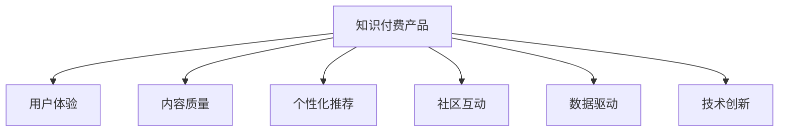

                 

# 如何提高知识付费产品的用户口碑

> 关键词：知识付费,用户口碑,用户体验,个性化推荐,内容质量,社区互动,数据驱动,技术创新

## 1. 背景介绍

### 1.1 问题由来
知识付费平台近年呈现爆炸式增长，但用户口碑参差不齐，部分产品因体验欠佳、内容质量低下、互动不足等问题，用户流失率居高不下。这些问题不仅仅影响平台收入，也限制了知识传播的深度和广度。因此，如何提升知识付费产品的用户口碑，成为业界亟需解决的问题。

### 1.2 问题核心关键点
用户口碑的提升，需要从用户体验、内容质量、个性化推荐、社区互动等多个维度全面优化。此外，数据驱动和持续技术创新，也应成为提升用户口碑的重要支撑。

- 用户体验：提升产品的易用性、流畅性和便捷性，确保用户能够快速便捷地使用产品。
- 内容质量：提供高价值、专业、实用的内容，满足用户的学习需求。
- 个性化推荐：精准推送用户感兴趣的内容，提高用户粘性。
- 社区互动：增强用户间互动交流，提升社区活跃度。
- 数据驱动：通过数据分析和挖掘，指导产品优化和创新。
- 技术创新：引入新技术、新算法，持续提升平台竞争力。

## 2. 核心概念与联系

### 2.1 核心概念概述

为更好地理解如何提升知识付费产品的用户口碑，本节将介绍几个关键相关概念：

- 知识付费：用户通过付费方式获取专业知识和技能的学习渠道，包括在线课程、电子书、音频、视频等形式。
- 用户口碑：用户对于知识付费产品的评价和反馈，直接影响产品受欢迎程度和品牌影响力。
- 用户体验：用户在使用产品时的直观感受和满意度，包括界面设计、功能流畅度等。
- 内容质量：知识付费产品提供的学习资料的专业性、实用性、深度等。
- 个性化推荐：基于用户行为和偏好的推荐系统，精准推送相关内容，提高用户满意度。
- 社区互动：知识付费平台中用户之间的交流和互动，增强用户粘性和参与感。
- 数据驱动：通过数据收集、分析和挖掘，指导产品策略和运营决策。
- 技术创新：通过引入新技术、新算法，不断优化产品功能和提升用户体验。

这些概念之间的逻辑关系可以通过以下Mermaid流程图来展示：



这个流程图展示了用户口碑提升的几个关键环节：

1. 通过优化用户体验，提升产品易用性和流畅度。
2. 通过提高内容质量，确保学习资料的深度和实用性。
3. 通过个性化推荐，精准推送用户感兴趣的内容。
4. 通过增强社区互动，提升用户参与感和粘性。
5. 通过数据驱动，指导产品策略和优化决策。
6. 通过技术创新，不断提升产品功能和竞争力。

这些环节共同作用，才能真正提升知识付费产品的用户口碑。

## 3. 核心算法原理 & 具体操作步骤
### 3.1 算法原理概述

提升知识付费产品的用户口碑，涉及多个算法原理，以下是几个核心算法：

- 个性化推荐算法：通过分析用户历史行为数据，计算用户兴趣，实时推送相关内容。
- 内容质量评价算法：通过对用户反馈和评价的实时收集和分析，优化学习资料的质量和布局。
- 社区互动算法：通过建立用户互动模型，提升用户间交流频率和质量。
- 用户体验评估算法：通过用户操作行为数据，实时优化界面设计和功能流程。
- 数据驱动决策算法：通过分析海量用户数据，指导产品策略优化和功能迭代。

这些算法相互关联，共同作用于知识付费产品的优化，从而提升用户口碑。

### 3.2 算法步骤详解

具体实施步骤包括：

1. 数据收集：通过用户注册、登录、使用行为、评价反馈等数据来源，全面收集用户信息。

2. 特征提取：从用户行为数据中提取关键特征，如浏览时长、点击率、互动频率等，为推荐和优化提供依据。

3. 模型训练：通过监督学习算法，如协同过滤、深度学习等，训练推荐模型和互动模型。

4. 个性化推荐：根据用户兴趣和行为特征，动态推送相关内容，提升用户满意度。

5. 内容优化：基于用户评价和反馈，实时优化内容质量和布局，增强学习效果。

6. 社区互动：建立用户互动模型，鼓励用户积极参与讨论，提升社区活跃度。

7. 数据驱动：通过数据分析和挖掘，指导产品优化和功能迭代。

8. 技术创新：引入新技术、新算法，提升产品功能和用户体验。

### 3.3 算法优缺点

提升知识付费产品用户口碑的算法有以下优点：

1. 提高用户满意度：通过个性化推荐和内容优化，提高用户学习体验，增强用户粘性。
2. 优化产品功能：通过数据驱动和持续技术创新，不断提升产品性能和竞争力。
3. 增强用户互动：通过社区互动算法，增强用户参与感和社区活跃度。

同时，这些算法也存在一定的局限性：

1. 数据隐私问题：用户数据的收集和分析可能引发隐私问题，需要确保数据安全合规。
2. 模型过拟合：复杂的推荐模型可能过拟合训练数据，降低泛化能力。
3. 技术成本高：新技术和新算法的引入需要高成本的技术支撑，可能不适用于中小型产品。
4. 用户接受度：部分用户可能不接受个性化推荐和数据驱动的策略，影响用户体验。

尽管存在这些局限，但通过合理设计和实施，这些算法仍能有效提升知识付费产品的用户口碑，推动产品迭代优化。

### 3.4 算法应用领域

提升知识付费产品用户口碑的算法，在知识付费、在线教育、个性化推荐等多个领域得到广泛应用。

1. 知识付费平台：如得到、喜马拉雅等，通过个性化推荐和内容优化，提升用户满意度和留存率。
2. 在线教育平台：如Coursera、Udemy等，通过数据驱动和社区互动，增强课程吸引力。
3. 个性化推荐系统：如Amazon、Netflix等，通过精准推荐，提升用户购物和观影体验。
4. 社交媒体平台：如微信、QQ等，通过互动算法和数据驱动，增强用户粘性和社区活跃度。

这些领域中，知识付费平台是最典型的应用场景。知识付费产品的用户口碑直接关系平台收入和市场竞争力，亟需通过技术手段不断优化和改进。

## 4. 数学模型和公式 & 详细讲解 & 举例说明

### 4.1 数学模型构建

本节将使用数学语言对提升知识付费产品用户口碑的理论基础和算法框架进行详细阐述。

设知识付费平台用户数为 $N$，用户对内容 $C_i$ 的兴趣评分为 $x_i$，内容质量评价为 $y_i$，个性化推荐模型为 $M$，用户体验优化算法为 $O$，社区互动模型为 $I$。

定义总体用户体验评分函数 $U$：

$$
U = \sum_{i=1}^{N} \left(x_i \cdot y_i \cdot M(x_i, y_i) + x_i \cdot O(x_i) + x_i \cdot I(x_i)\right)
$$

其中 $M(x_i, y_i)$ 为推荐模型，$O(x_i)$ 为用户体验优化算法，$I(x_i)$ 为社区互动模型。

### 4.2 公式推导过程

为了计算推荐模型 $M$，设用户对内容 $C_i$ 的兴趣评分为 $x_i$，内容质量评价为 $y_i$，推荐模型输出为 $z_i$，则推荐模型可以表示为：

$$
z_i = M(x_i, y_i) = \omega_1 x_i + \omega_2 y_i + \omega_3
$$

其中 $\omega_1, \omega_2, \omega_3$ 为模型的权重参数。

通过优化 $U$ 函数，不断调整 $M$ 的参数 $\omega_1, \omega_2, \omega_3$，使得用户体验评分 $U$ 最大化。

### 4.3 案例分析与讲解

以用户对某课程的评价和互动为例：

1. 用户 $A$ 对课程 $C_1$ 的评价 $y_1 = 4$，互动 $I_1 = 10$。
2. 用户 $B$ 对课程 $C_2$ 的评价 $y_2 = 2$，互动 $I_2 = 5$。

推荐模型 $M$ 输出的推荐度分别为：

$$
z_1 = \omega_1 \cdot 4 + \omega_2 \cdot 4 + \omega_3
$$

$$
z_2 = \omega_1 \cdot 2 + \omega_2 \cdot 2 + \omega_3
$$

通过优化 $U$ 函数，不断调整 $\omega_1, \omega_2, \omega_3$，使得推荐度 $z_1, z_2$ 更符合用户 $A, B$ 的实际需求。

## 5. 项目实践：代码实例和详细解释说明
### 5.1 开发环境搭建

在进行用户口碑提升的实践前，我们需要准备好开发环境。以下是使用Python进行TensorFlow开发的环境配置流程：

1. 安装Anaconda：从官网下载并安装Anaconda，用于创建独立的Python环境。

2. 创建并激活虚拟环境：
```bash
conda create -n tf-env python=3.8 
conda activate tf-env
```

3. 安装TensorFlow：根据CUDA版本，从官网获取对应的安装命令。例如：
```bash
conda install tensorflow -c pytorch -c conda-forge
```

4. 安装Flask：用于构建用户互动界面和API接口，提供用户互动功能。

```bash
pip install flask
```

5. 安装用户行为分析工具：如Apache Spark，用于大数据分析和处理。

```bash
pip install pyspark
```

完成上述步骤后，即可在`tf-env`环境中开始用户口碑提升的实践。

### 5.2 源代码详细实现

下面我们以个性化推荐系统的开发为例，给出使用TensorFlow和Python Flask构建的代码实现。

首先，定义推荐模型的训练函数：

```python
import tensorflow as tf

def train_model(data):
    features = tf.constant(data['features'], dtype=tf.float32)
    labels = tf.constant(data['labels'], dtype=tf.float32)
    
    model = tf.keras.Sequential([
        tf.keras.layers.Dense(64, activation='relu', input_shape=[3]),
        tf.keras.layers.Dense(1)
    ])
    
    model.compile(optimizer='adam', loss='mse')
    model.fit(features, labels, epochs=10, verbose=0)
    return model
```

然后，实现推荐模型的推理函数：

```python
def predict(model, features):
    predictions = model.predict(features)
    return predictions
```

最后，构建用户互动界面和API接口：

```python
from flask import Flask, request, jsonify

app = Flask(__name__)

@app.route('/recommend', methods=['POST'])
def recommend():
    data = request.json
    features = tf.constant(data['features'], dtype=tf.float32)
    model = train_model(data)
    predictions = predict(model, features)
    return jsonify({'predictions': predictions.tolist()})
    
if __name__ == '__main__':
    app.run(host='0.0.0.0', port=5000)
```

以上就是使用TensorFlow和Python Flask构建个性化推荐系统的完整代码实现。可以看到，通过简单的TensorFlow和Flask结合，可以快速构建推荐系统，实现用户互动和个性化推荐功能。

### 5.3 代码解读与分析

让我们再详细解读一下关键代码的实现细节：

**train_model函数**：
- 接收用户行为数据，提取关键特征（用户评分和互动）。
- 定义推荐模型，包括一个隐藏层和一个输出层。
- 使用Adam优化器进行模型训练，设定损失函数为均方误差。
- 返回训练好的推荐模型。

**predict函数**：
- 接收用户行为数据，输入到已训练好的推荐模型中。
- 输出模型的预测结果。

**Flask交互界面**：
- 定义API接口，接收用户行为数据。
- 调用train_model函数训练推荐模型，并调用predict函数输出预测结果。
- 通过JSON格式返回预测结果。

以上代码实现展示了Flask和TensorFlow的结合，使得推荐系统的构建变得简便高效。

当然，实际应用中还需要考虑更多因素，如用户数据的存储和处理、推荐系统的可扩展性、推荐结果的实时性等。但核心的算法流程基本与此类似。

## 6. 实际应用场景
### 6.1 在线教育平台

在线教育平台通过推荐系统，可以精准推送用户感兴趣的内容，提高用户学习效果和留存率。

具体而言，平台可以收集用户浏览、点击、评论、购买等行为数据，提取特征构建推荐模型。在用户访问课程时，动态推送相关课程推荐，同时收集用户反馈，实时优化推荐模型，提高用户满意度。

### 6.2 知识付费平台

知识付费平台通过社区互动系统，可以增强用户间的交流和协作，提升用户粘性。

具体而言，平台可以构建社区互动模型，分析用户互动行为和内容评价，提供个性化互动推荐，引导用户积极参与讨论，分享学习心得。同时，平台还可以引入社区管理机制，对不当内容进行监管，保障社区安全健康。

### 6.3 在线购物平台

在线购物平台通过推荐系统，可以提升用户的购物体验，提高转化率和复购率。

具体而言，平台可以收集用户浏览、点击、购买等行为数据，构建推荐模型。在用户浏览商品时，实时推送相关商品推荐，同时收集用户反馈，实时优化推荐模型，提升用户体验。

### 6.4 未来应用展望

随着推荐算法和社区互动技术的不断发展，用户口碑提升将展现出更加广阔的前景。

在智慧教育领域，推荐系统将增强个性化学习效果，提升学习效率和质量。

在智慧社区领域，社区互动系统将构建更紧密的社交关系，增强用户粘性和社区活跃度。

在智慧商业领域，推荐系统将提升用户购物体验，提高转化率和复购率。

此外，在智慧医疗、智慧媒体、智慧旅游等多个领域，用户口碑提升技术也将不断拓展，为社会经济生活带来深远影响。相信通过技术创新和数据驱动，知识付费产品的用户口碑必将得到持续提升，推动产业和社会的进步。

## 7. 工具和资源推荐
### 7.1 学习资源推荐

为了帮助开发者系统掌握用户口碑提升的理论基础和实践技巧，这里推荐一些优质的学习资源：

1. 《推荐系统实战》系列博文：由推荐系统专家撰写，深入浅出地介绍了推荐系统的理论基础和工程实践。

2. CS229《机器学习》课程：斯坦福大学开设的机器学习明星课程，有Lecture视频和配套作业，带你入门推荐系统的基本概念和经典模型。

3. 《推荐系统实践》书籍：综合介绍了推荐系统的理论、算法和实践，是推荐系统开发的必备书籍。

4. KDD、ICML等顶级会议论文：推荐系统领域顶级会议的论文，展示最新研究成果和趋势，值得关注。

5. HuggingFace官方文档：推荐系统库的官方文档，提供了丰富的推荐算法样例代码，是上手实践的必备资料。

通过对这些资源的学习实践，相信你一定能够快速掌握用户口碑提升的精髓，并用于解决实际的推荐问题。

### 7.2 开发工具推荐

高效的开发离不开优秀的工具支持。以下是几款用于用户口碑提升开发的常用工具：

1. TensorFlow：基于Python的开源深度学习框架，灵活动态的计算图，适合快速迭代研究。

2. PyTorch：同样基于Python的开源深度学习框架，灵活性和高效性俱佳，适合复杂的推荐系统开发。

3. Scikit-learn：用于数据处理和特征工程的工具库，支持大规模数据分析。

4. Apache Spark：大数据处理引擎，支持分布式计算，适合大数据推荐系统的开发。

5. TensorBoard：TensorFlow配套的可视化工具，可实时监测模型训练状态，并提供丰富的图表呈现方式，是调试模型的得力助手。

6. Weights & Biases：模型训练的实验跟踪工具，可以记录和可视化模型训练过程中的各项指标，方便对比和调优。

合理利用这些工具，可以显著提升用户口碑提升任务的开发效率，加快创新迭代的步伐。

### 7.3 相关论文推荐

用户口碑提升技术的发展源于学界的持续研究。以下是几篇奠基性的相关论文，推荐阅读：

1. item-based collaborative filtering（协同过滤算法）：通过分析用户对物品的评分数据，推荐用户可能感兴趣的其他物品。

2. matrix factorization（矩阵分解算法）：通过将用户行为数据分解为低秩矩阵，推荐用户可能感兴趣的其他物品。

3. deep learning-based recommender systems（深度学习推荐系统）：通过深度神经网络，学习用户行为和物品特征，推荐用户可能感兴趣的其他物品。

4. attention-based recommender systems（注意力机制推荐系统）：引入注意力机制，增强推荐模型的效果和鲁棒性。

5. neural collaborative filtering（神经协同过滤）：通过深度神经网络，增强推荐模型的效果和泛化能力。

这些论文代表了大规模推荐系统的技术演进路径。通过学习这些前沿成果，可以帮助研究者把握学科前进方向，激发更多的创新灵感。

## 8. 总结：未来发展趋势与挑战
### 8.1 总结

本文对如何提升知识付费产品的用户口碑进行了全面系统的介绍。首先阐述了用户口碑提升的理论基础和实践策略，明确了推荐系统、社区互动、用户体验优化等关键环节的作用。其次，从原理到实践，详细讲解了推荐算法和社区互动算法的工作原理和具体实现。同时，本文还探讨了推荐系统在在线教育、在线购物等多个领域的应用前景，展示了推荐技术的巨大潜力。此外，本文精选了推荐系统的各类学习资源，力求为读者提供全方位的技术指引。

通过本文的系统梳理，可以看到，用户口碑提升技术正在成为知识付费产品的核心竞争力，极大地推动了知识传播的深度和广度。未来，伴随推荐算法的不断优化和创新，用户口碑提升必将在知识付费领域展现出更加广阔的前景，深刻影响人类的学习方式和知识获取路径。

### 8.2 未来发展趋势

展望未来，推荐系统和社区互动技术将呈现以下几个发展趋势：

1. 推荐系统将更加智能化和个性化。通过引入更多用户行为数据和上下文信息，推荐模型将能够更精准地匹配用户需求。

2. 推荐系统将融合更多领域知识。推荐系统将与搜索、广告、社交网络等更多领域进行协同，提供更全面的信息和服务。

3. 推荐系统将引入更多先验知识。推荐模型将结合规则引擎和专家知识，增强推荐结果的可解释性和可信度。

4. 推荐系统将更注重用户隐私保护。推荐系统将通过数据匿名化、差分隐私等技术，确保用户数据的安全性和隐私性。

5. 推荐系统将更加注重用户反馈。推荐模型将实时分析用户反馈，优化推荐结果，提升用户体验。

6. 推荐系统将融合更多数据源。推荐模型将整合各类数据源，如用户行为数据、社交网络数据、市场调研数据等，提供更加全面的推荐服务。

以上趋势凸显了推荐系统和社区互动技术的广阔前景。这些方向的探索发展，必将进一步提升用户口碑提升技术的性能和应用范围，为知识付费产品带来更深远的影响。

### 8.3 面临的挑战

尽管推荐系统和社区互动技术已经取得了显著成就，但在迈向更加智能化、普适化应用的过程中，它们仍面临着诸多挑战：

1. 推荐系统的冷启动问题。新用户缺乏历史行为数据，难以进行有效推荐。如何通过先验知识和新算法解决冷启动问题，成为重要研究方向。

2. 推荐系统的过拟合问题。复杂推荐模型容易过拟合训练数据，降低泛化能力。如何优化推荐模型的泛化能力，是一个亟需解决的问题。

3. 推荐系统的实时性问题。实时推荐需要高效的数据处理和算法计算，如何在保证精度的同时，提升实时性，是一个重要课题。

4. 推荐系统的公平性问题。推荐模型容易产生不公平的推荐结果，如性别、种族等偏见。如何消除推荐模型的偏见，增强公平性，需要更多技术手段的支撑。

5. 推荐系统的可解释性问题。推荐模型往往缺乏可解释性，难以解释推荐结果的逻辑和依据。如何增强推荐模型的可解释性，是一个重要的研究方向。

6. 社区互动的互动质量问题。社区互动系统容易引发垃圾信息、恶意攻击等问题。如何加强社区管理和互动质量，保障社区安全健康，是一个重要的挑战。

正视推荐系统和社区互动技术面临的这些挑战，积极应对并寻求突破，将是对技术创新和产品优化具有重要意义。

### 8.4 研究展望

面对推荐系统和社区互动技术所面临的挑战，未来的研究需要在以下几个方面寻求新的突破：

1. 探索更多推荐算法。除了传统协同过滤、矩阵分解等方法，未来将探索更多深度学习、强化学习等算法，增强推荐模型的效果和泛化能力。

2. 引入更多领域知识。推荐模型将结合更多领域知识，如知识图谱、专家规则等，增强推荐结果的准确性和可信度。

3. 优化推荐系统性能。通过优化推荐模型结构和算法，提升推荐系统的实时性和可解释性。

4. 解决冷启动问题。通过引入先验知识和新算法，解决新用户的推荐问题，提高推荐系统的冷启动效果。

5. 增强推荐系统公平性。通过数据预处理、算法优化等手段，增强推荐系统的公平性和公正性。

6. 加强社区互动管理。通过建立社区规则和机制，增强社区互动质量和安全性。

这些研究方向将推动推荐系统和社区互动技术的不断进步，为知识付费产品带来更深远的影响。只有勇于创新、敢于突破，才能不断拓展用户口碑提升技术的边界，让推荐系统在更多场景中发挥更大的价值。

## 9. 附录：常见问题与解答

**Q1：推荐系统是否适用于所有领域？**

A: 推荐系统虽然具有广泛的适用性，但在某些特定领域如医疗、教育等，可能面临数据隐私、数据质量等问题，需要谨慎应用。此外，部分领域如农业、手工艺品等，用户需求多样、个性化程度高，推荐系统的效果可能不佳。

**Q2：推荐系统如何缓解过拟合问题？**

A: 推荐系统缓解过拟合的方法包括：
1. 引入正则化技术，如L1、L2正则化，抑制模型复杂度。
2. 采用集成学习技术，如Bagging、Boosting，提高模型泛化能力。
3. 引入对抗性训练，提高模型鲁棒性，降低过拟合风险。
4. 采用深度神经网络，提高模型的泛化能力。
5. 引入先验知识，增强模型的可解释性和可信度。

这些方法往往需要根据具体场景和数据特点，灵活组合使用。

**Q3：推荐系统如何处理数据冷启动问题？**

A: 推荐系统处理冷启动问题的方法包括：
1. 引入先验知识，如用户的基本属性、兴趣偏好等，弥补历史数据不足。
2. 引入推荐系统优化算法，如基于物品属性的推荐、基于内容的推荐等，提高推荐效果。
3. 引入用户引导机制，如引导用户填写兴趣偏好、参与互动等，逐步增加用户数据。
4. 引入数据增强技术，如通过相似用户、相似物品的推荐数据，增强推荐效果。

这些方法往往需要根据具体场景和数据特点，灵活组合使用。

**Q4：社区互动系统如何提高用户粘性？**

A: 社区互动系统提高用户粘性的方法包括：
1. 引入用户激励机制，如积分、勋章等，激励用户积极参与互动。
2. 引入社区管理机制，如垃圾信息过滤、恶意攻击检测等，保障社区安全健康。
3. 引入社区推荐系统，通过社区内推荐，增强用户互动效果。
4. 引入社区活动策划，如话题讨论、知识竞赛等，提升用户参与感和社区活跃度。

这些方法往往需要根据具体场景和用户特点，灵活组合使用。

**Q5：推荐系统如何平衡用户体验和推荐效果？**

A: 推荐系统平衡用户体验和推荐效果的方法包括：
1. 引入用户体验评估机制，实时监测用户行为和反馈，指导推荐算法优化。
2. 引入个性化推荐技术，增强推荐结果的精准度和匹配度。
3. 引入多维度数据源，如用户行为数据、社交网络数据、市场调研数据等，提供更全面的推荐服务。
4. 引入推荐结果解释机制，增强推荐结果的可解释性和可信度，提升用户满意度。

这些方法往往需要根据具体场景和用户特点，灵活组合使用。

总之，推荐系统和社区互动技术将在知识付费产品中发挥越来越重要的作用，通过不断的技术创新和优化，提升用户口碑，推动知识付费产业的健康发展。通过本文的系统梳理，相信你一定能够快速掌握用户口碑提升的精髓，并用于解决实际的推荐问题。

