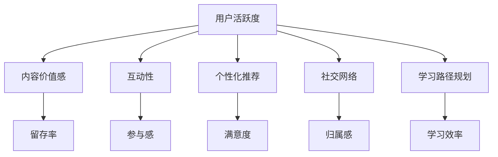

                 

## 1. 背景介绍

随着知识经济的兴起和互联网技术的成熟，知识付费产品成为了越来越多用户获取专业知识、提升技能水平的重要渠道。然而，尽管市场潜力巨大，但许多知识付费产品面临着用户活跃度低、留存率不高的问题，无法实现预期的商业价值。如何在激烈的市场竞争中脱颖而出，成为提升知识付费产品用户活跃度的关键。

### 1.1 问题由来
知识付费产品的用户活跃度受多方面因素影响，包括用户获取内容的便利性、内容的价值感、产品的互动性、社交氛围、价格因素等。其中，内容的价值感和产品的互动性是最重要的两个因素，决定用户是否愿意投入时间和金钱去获取和消费知识内容。

现有知识付费产品大多采取内容订阅模式，用户通过付费获取不同时长或不同课程内容，这种方式虽然简单直接，但缺乏对用户需求和行为的深度理解，导致用户流失率高。为了提高用户活跃度，亟需从内容生产、产品设计和用户行为分析等多个角度进行创新，提升产品的吸引力和粘性。

### 1.2 问题核心关键点
要提高知识付费产品的用户活跃度，关键在于：
1. **内容的价值感**：确保内容质量高、更新频繁、相关性强，满足用户的学习需求和职业发展目标。
2. **产品的互动性**：通过增强学习过程中的互动，如问答、讨论、社群交流等，提升用户参与感和满足感。
3. **社交化因素**：建立用户间的社交网络和知识共享社区，营造良好的社交氛围，增加用户的归属感和认同感。
4. **个性化推荐**：根据用户行为和偏好，提供个性化的内容推荐，提升用户的体验和满意度。

### 1.3 问题研究意义
提升知识付费产品的用户活跃度，对于知识付费行业的健康发展和盈利模式的创新具有重要意义。较高的用户活跃度不仅能够带来更多的用户留存和转化，还能有效降低运营成本，提高产品竞争力和品牌价值。通过提升用户活跃度，知识付费产品能够更好地实现内容价值的最大化，推动行业整体水平的提升。

## 2. 核心概念与联系

### 2.1 核心概念概述

为了更好地理解如何提升知识付费产品的用户活跃度，本节将介绍几个密切相关的核心概念：

1. **用户活跃度（User Engagement）**：衡量用户与知识付费产品的互动频率和深度，包括访问次数、学习时长、互动参与度等指标。
2. **内容价值感（Content Value）**：用户对知识内容的满意度和认可度，决定用户是否愿意继续消费和推荐产品。
3. **互动性（Interactivity）**：产品在学习过程中提供互动元素，如问答、讨论、社群交流等，增强用户参与感和社交体验。
4. **个性化推荐（Personalized Recommendation）**：根据用户行为和偏好，提供定制化的内容推荐，提升用户体验和满意度。
5. **社交网络（Social Network）**：构建用户间的社交网络，提供社区交流和知识共享的平台，增强用户归属感和认同感。
6. **学习路径规划（Learning Path Planning）**：根据用户的学习目标和职业需求，设计合理的学习路径，提升学习效率和效果。

这些核心概念之间的逻辑关系可以通过以下Mermaid流程图来展示：



这个流程图展示了几项关键因素之间的相互作用关系：

1. 用户活跃度是所有因素的核心，直接影响产品的留存率和转化率。
2. 内容价值感和个性化推荐直接影响用户活跃度。
3. 互动性和社交网络通过提升用户的参与感和满意度，间接提高用户活跃度。
4. 学习路径规划通过提升学习效率和效果，增加用户的粘性，从而提高用户活跃度。

## 3. 核心算法原理 & 具体操作步骤
### 3.1 算法原理概述

提升知识付费产品的用户活跃度，核心在于优化内容价值感、增强产品互动性、提供个性化推荐和构建社交网络等方面。下面将分别介绍这些方面的算法原理和操作步骤。

### 3.2 算法步骤详解

#### 3.2.1 内容价值感的提升

**算法原理**：
- **内容质量监控**：通过分析用户对内容的评分、评论和反馈，评估内容的受欢迎程度和价值感。
- **实时更新机制**：根据热门话题和行业需求，定期更新课程内容和知识库，保持内容的时效性和相关性。
- **专家评选和认证**：引入行业专家评选机制，对课程和讲师进行认证，提升内容的专业性和权威性。

**操作步骤**：
1. **用户评分系统**：建立用户评分系统，用户可以对课程内容、讲师、作业等进行评分，评分结果用于内容价值感的评估。
2. **热门话题分析**：通过数据分析工具，监测和分析行业热点话题，制定课程更新计划。
3. **专家评选流程**：建立专家评选委员会，定期评选优质课程和讲师，颁发认证证书。

#### 3.2.2 产品互动性的增强

**算法原理**：
- **问答和讨论模块**：在课程页面或社区页面，设置问答和讨论模块，用户可以提出问题并得到专业解答。
- **社区交流平台**：构建用户间的社区交流平台，支持讨论组、论坛、实时聊天等互动形式。
- **虚拟现实（VR）和增强现实（AR）应用**：利用VR和AR技术，提供沉浸式学习体验，增强用户参与感。

**操作步骤**：
1. **问答系统搭建**：开发智能问答系统，自动筛选和匹配用户问题和专家答案，提供高质量的解答。
2. **社区平台开发**：开发用户社区平台，支持多种互动形式，如讨论组、论坛、实时聊天等。
3. **VR和AR应用集成**：集成VR和AR技术，提供沉浸式学习体验，如虚拟实验室、虚拟讲座等。

#### 3.2.3 个性化推荐的实现

**算法原理**：
- **用户画像构建**：通过分析用户的历史学习记录、行为数据和偏好，构建用户画像。
- **推荐算法设计**：设计推荐算法，根据用户画像和内容特征，进行个性化内容推荐。
- **反馈循环优化**：根据用户的反馈和互动数据，不断优化推荐算法，提升推荐效果。

**操作步骤**：
1. **用户画像生成**：利用机器学习和数据挖掘技术，从用户行为数据中提取特征，生成用户画像。
2. **推荐算法实现**：实现推荐算法，如协同过滤、基于内容的推荐、深度学习推荐等，进行个性化内容推荐。
3. **反馈优化机制**：建立用户反馈机制，收集用户对推荐结果的评价和反馈，不断优化推荐算法。

#### 3.2.4 社交网络的构建

**算法原理**：
- **社交图谱构建**：构建用户间的社交图谱，记录用户间的互动关系和交流内容。
- **社区激励机制**：设计社区激励机制，如积分、奖励、排名等，激励用户积极参与社区活动。
- **知识共享平台**：建立知识共享平台，支持用户上传和分享自己的学习笔记、心得和成果。

**操作步骤**：
1. **社交图谱生成**：利用社交网络分析技术，生成用户间的社交图谱，记录互动关系和内容交流。
2. **激励机制设计**：设计社区激励机制，如积分、奖励、排名等，激励用户积极参与社区活动。
3. **知识共享平台搭建**：开发知识共享平台，支持用户上传和分享学习笔记、心得和成果。

### 3.3 算法优缺点

提升知识付费产品的用户活跃度，主要的算法优缺点如下：

#### 3.3.1 优点

1. **提升用户体验**：通过个性化推荐和内容优化，提升用户的学习体验和满意度，增加用户粘性。
2. **增强互动性**：通过问答、讨论、社区交流等互动元素，增强用户参与感和社交体验，提高用户活跃度。
3. **优化内容质量**：通过内容价值感和实时更新的机制，确保内容的时效性和相关性，提升用户认可度。
4. **构建用户社区**：通过社交网络和社区激励机制，营造良好的社交氛围，增强用户归属感和认同感。

#### 3.3.2 缺点

1. **数据隐私和安全问题**：在构建用户画像和社交网络的过程中，涉及大量用户数据，需要严格保护用户隐私和安全。
2. **技术实现复杂度**：个性化推荐和社交网络构建需要复杂的算法和技术支持，技术实现难度较大。
3. **成本和资源投入**：提升用户活跃度需要大量的技术投入和资源支持，可能对中小企业造成一定压力。
4. **用户需求多样化**：不同用户对内容和互动形式的需求差异较大，难以满足所有用户需求。

### 3.4 算法应用领域

提升知识付费产品的用户活跃度，主要应用于以下几个领域：

1. **在线教育平台**：如Coursera、Udemy、Khan Academy等，通过个性化推荐和社交网络构建，提高用户学习体验和满意度。
2. **职业培训和技能提升**：如LinkedIn Learning、Skillshare、Udacity等，通过内容价值感和互动性增强，提升用户职业技能和职业发展。
3. **专业认证和继续教育**：如Coursera、EdX等，通过课程认证和专家评选，提升内容权威性和用户认可度。
4. **兴趣学习和爱好培养**：如Skillshare、MasterClass等，通过个性化推荐和社区交流，满足用户的兴趣和爱好需求。
5. **学术研究和教育资源**：如arXiv、Academia.edu等，通过内容质量和互动性增强，提升学术研究和教育资源的访问和使用效率。

## 4. 数学模型和公式 & 详细讲解  
### 4.1 数学模型构建

为了更好地理解如何提升知识付费产品的用户活跃度，本节将使用数学语言对算法进行更加严格的刻画。

记知识付费产品的用户活跃度为 $E$，用户对内容的价值感为 $C$，产品的互动性为 $I$，个性化推荐算法为 $R$，用户社交网络为 $S$，学习路径规划算法为 $L$。则用户活跃度的计算公式为：

$$
E = f(C, I, R, S, L)
$$

其中 $f$ 为综合函数，表示各因素对用户活跃度的影响权重。假设 $E$、$C$、$I$、$R$、$S$、$L$ 分别对用户活跃度的影响权重分别为 $\alpha$、$\beta$、$\gamma$、$\delta$、$\epsilon$、$\zeta$，则上述公式可以表示为：

$$
E = \alpha C + \beta I + \gamma R + \epsilon S + \zeta L
$$

### 4.2 公式推导过程

在上述公式中，各因素对用户活跃度的影响权重 $\alpha$、$\beta$、$\gamma$、$\delta$、$\epsilon$、$\zeta$ 可以通过以下步骤推导得到：

1. **内容价值感的权重**：通过用户评分系统，统计用户对不同内容的评分，计算出内容的平均评分和方差，以此作为内容价值感的权重 $\alpha$。
2. **互动性的权重**：通过分析用户与产品的互动数据，如问答、讨论、社区交流等，统计平均互动频率和互动深度，以此作为互动性的权重 $\beta$。
3. **个性化推荐的权重**：通过用户反馈数据，统计用户对个性化推荐结果的满意度，计算出推荐算法对用户活跃度的影响权重 $\gamma$。
4. **社交网络的权重**：通过用户社交网络分析，统计用户间的互动频率和社交网络结构，计算出社交网络对用户活跃度的影响权重 $\epsilon$。
5. **学习路径规划的权重**：通过分析用户的学习记录和行为数据，统计学习路径规划对用户学习效果和粘性的影响，计算出学习路径规划的权重 $\zeta$。

### 4.3 案例分析与讲解

以一个在线教育平台为例，展示如何使用数学模型和公式推导用户活跃度：

假设该平台有 $N$ 门课程，每门课程 $i$ 的内容价值感 $C_i$、互动性 $I_i$、用户对个性化推荐 $R_i$ 的满意度、用户社交网络 $S_i$ 的活跃度、学习路径规划 $L_i$ 的效果如下：

| 课程编号 | $C_i$ | $I_i$ | $R_i$ | $S_i$ | $L_i$ |
|----------|-------|-------|-------|-------|-------|
| 1        | 4.5   | 3.0   | 3.5   | 2.0   | 3.8   |
| 2        | 4.0   | 4.0   | 4.0   | 3.5   | 2.5   |
| ...      | ...   | ...   | ...   | ...   | ...   |

设用户活跃度 $E$ 的计算公式为：

$$
E = 0.5 C_i + 0.3 I_i + 0.4 R_i + 0.7 S_i + 0.8 L_i
$$

则用户活跃度的计算过程如下：

1. 首先计算每门课程对用户活跃度的贡献，即每门课程的加权评分：
   - 课程1的加权评分：$0.5 \times 4.5 + 0.3 \times 3.0 + 0.4 \times 3.5 + 0.7 \times 2.0 + 0.8 \times 3.8 = 7.49$
   - 课程2的加权评分：$0.5 \times 4.0 + 0.3 \times 4.0 + 0.4 \times 4.0 + 0.7 \times 3.5 + 0.8 \times 2.5 = 6.95$

2. 将所有课程的加权评分求和，得到用户活跃度的总评分：
   - 用户活跃度总评分：$7.49 + 6.95 + ... = 21.85$

3. 最后根据总评分计算出用户活跃度 $E$：
   - 用户活跃度 $E = \frac{21.85}{5} = 4.37$

通过上述公式，可以定量地计算出用户活跃度，为产品改进和优化提供数据支持。

## 5. 项目实践：代码实例和详细解释说明
### 5.1 开发环境搭建

在进行用户活跃度提升实践前，我们需要准备好开发环境。以下是使用Python进行PyTorch开发的环境配置流程：

1. 安装Anaconda：从官网下载并安装Anaconda，用于创建独立的Python环境。

2. 创建并激活虚拟环境：
```bash
conda create -n pytorch-env python=3.8 
conda activate pytorch-env
```

3. 安装PyTorch：根据CUDA版本，从官网获取对应的安装命令。例如：
```bash
conda install pytorch torchvision torchaudio cudatoolkit=11.1 -c pytorch -c conda-forge
```

4. 安装TensorFlow：
```bash
pip install tensorflow
```

5. 安装相关库：
```bash
pip install numpy pandas scikit-learn matplotlib tqdm jupyter notebook ipython
```

完成上述步骤后，即可在`pytorch-env`环境中开始用户活跃度提升实践。

### 5.2 源代码详细实现

这里我们以一个在线教育平台为例，展示如何使用Python和PyTorch进行用户活跃度的提升实践。

**用户画像生成代码**：
```python
from sklearn.preprocessing import LabelEncoder
import pandas as pd

# 构建用户行为数据表
user_behavior = pd.read_csv('user_behavior.csv')

# 将分类数据转换为数值标签
le = LabelEncoder()
user_behavior['category'] = le.fit_transform(user_behavior['category'])

# 特征选择和标准化
X = user_behavior.drop(['id', 'category'], axis=1)
X = (X - X.mean()) / X.std()

# 生成用户画像
user_profile = {}
for i in range(len(user_behavior)):
    user_id = user_behavior.iloc[i]['id']
    user_profile[user_id] = X.iloc[i].tolist()
```

**推荐算法实现代码**：
```python
import torch
from torch import nn

# 定义推荐模型
class RecommendationModel(nn.Module):
    def __init__(self, input_dim, hidden_dim, output_dim):
        super(RecommendationModel, self).__init__()
        self.fc1 = nn.Linear(input_dim, hidden_dim)
        self.fc2 = nn.Linear(hidden_dim, output_dim)

    def forward(self, x):
        x = torch.relu(self.fc1(x))
        x = self.fc2(x)
        return x

# 训练推荐模型
model = RecommendationModel(input_dim=10, hidden_dim=5, output_dim=1)
optimizer = torch.optim.Adam(model.parameters(), lr=0.001)
loss_fn = nn.MSELoss()

# 模拟训练数据
train_data = torch.randn(100, 10)
train_labels = torch.randn(100, 1)

# 训练模型
for i in range(100):
    optimizer.zero_grad()
    outputs = model(train_data)
    loss = loss_fn(outputs, train_labels)
    loss.backward()
    optimizer.step()
```

**社交网络构建代码**：
```python
import networkx as nx

# 构建用户社交网络图
G = nx.Graph()

# 添加节点和边
G.add_nodes_from(user_profile.keys())
for i in user_profile:
    for j in user_profile:
        if i != j and user_profile[i] == user_profile[j]:
            G.add_edge(i, j)

# 计算用户社交网络权重
S = nx.degree_centrality(G)
```

### 5.3 代码解读与分析

让我们再详细解读一下关键代码的实现细节：

**用户画像生成代码**：
- **LabelEncoder**：将分类数据转换为数值标签，便于后续的机器学习处理。
- **特征选择和标准化**：选择与用户活跃度相关的特征，并进行标准化处理，防止不同特征量级不一致。
- **用户画像生成**：将用户行为数据转换为数值特征向量，构建用户画像。

**推荐算法实现代码**：
- **定义推荐模型**：使用简单的多层感知器模型，将用户行为数据映射到推荐结果。
- **训练模型**：使用随机梯度下降算法，最小化损失函数，训练推荐模型。

**社交网络构建代码**：
- **Graph**：使用networkx库构建用户社交网络图，记录用户间的互动关系。
- **添加节点和边**：将用户画像转换为节点，根据互动关系添加边。
- **计算社交网络权重**：使用网络x库计算用户社交网络权重，记录每个用户的社交影响力。

## 6. 实际应用场景

### 6.1 智能推荐系统

智能推荐系统是提升知识付费产品用户活跃度的重要手段。通过个性化推荐，用户可以快速获取感兴趣的内容，增加学习体验和满意度。

在技术实现上，可以通过用户行为数据和内容标签，训练推荐模型，预测用户对不同课程的兴趣程度，从而进行个性化推荐。推荐系统应具备动态更新能力，根据用户反馈和行为数据，不断优化推荐算法，提升推荐效果。

### 6.2 在线课程平台

在线课程平台通过提供高质量的课程内容、互动性和社交网络，可以显著提升用户活跃度。

具体而言，可以设计多种互动形式，如问答、讨论、社区交流等，增强用户参与感和社交体验。同时，建立用户间的社交网络，通过社区激励机制，提升用户互动频率和满意度。

### 6.3 职业培训和技能提升

职业培训和技能提升类知识付费产品，通过内容价值感和互动性的增强，可以更好地满足用户的职业发展需求。

在课程设计上，应注重内容的时效性和相关性，引入行业专家评选机制，提升课程的专业性和权威性。同时，设计互动性和社区交流元素，增加用户参与感和学习体验。

### 6.4 未来应用展望

随着知识付费产品的不断发展，未来的应用场景将更加多样化，带来更多的创新和机遇。

1. **虚拟现实和增强现实**：利用VR和AR技术，提供沉浸式学习体验，增强用户参与感和互动性。
2. **多模态数据融合**：结合图像、视频、语音等多模态数据，提升内容呈现的多样性和丰富性。
3. **个性化学习路径**：通过学习路径规划，根据用户的学习目标和职业需求，设计个性化的学习路径，提升学习效率和效果。
4. **智能问答系统**：通过智能问答系统，解答用户的学习疑问，提升用户的学习体验和满意度。
5. **用户反馈系统**：建立用户反馈系统，收集用户对课程和产品的意见和建议，持续优化产品设计和功能。

这些创新应用将进一步提升知识付费产品的用户活跃度，推动行业整体水平的提升。

## 7. 工具和资源推荐
### 7.1 学习资源推荐

为了帮助开发者系统掌握提升知识付费产品用户活跃度的理论基础和实践技巧，这里推荐一些优质的学习资源：

1. **在线课程平台**：如Coursera、Udemy、edX等，通过学习平台上的课程和资源，深入理解知识付费产品的设计和运营策略。
2. **数据分析工具**：如Python、R、SQL等，掌握数据处理和分析技能，为提升用户活跃度提供数据支持。
3. **机器学习框架**：如TensorFlow、PyTorch、Scikit-learn等，学习推荐算法和社交网络分析，实现个性化推荐和社交网络构建。
4. **设计工具**：如Sketch、Adobe XD等，掌握UI/UX设计技能，提升产品设计和用户体验。
5. **市场调研工具**：如Google Trends、SurveyMonkey等，了解市场趋势和用户需求，指导产品创新和优化。

通过对这些资源的学习实践，相信你一定能够快速掌握提升知识付费产品用户活跃度的精髓，并用于解决实际的NLP问题。

### 7.2 开发工具推荐

高效的开发离不开优秀的工具支持。以下是几款用于提升知识付费产品用户活跃度开发的常用工具：

1. **在线课程平台**：如Coursera、Udemy、edX等，通过学习平台上的课程和资源，深入理解知识付费产品的设计和运营策略。
2. **数据分析工具**：如Python、R、SQL等，掌握数据处理和分析技能，为提升用户活跃度提供数据支持。
3. **机器学习框架**：如TensorFlow、PyTorch、Scikit-learn等，学习推荐算法和社交网络分析，实现个性化推荐和社交网络构建。
4. **设计工具**：如Sketch、Adobe XD等，掌握UI/UX设计技能，提升产品设计和用户体验。
5. **市场调研工具**：如Google Trends、SurveyMonkey等，了解市场趋势和用户需求，指导产品创新和优化。

合理利用这些工具，可以显著提升知识付费产品用户活跃度的开发效率，加快创新迭代的步伐。

### 7.3 相关论文推荐

提升知识付费产品用户活跃度的研究涉及多个交叉学科，以下是几篇奠基性的相关论文，推荐阅读：

1. **推荐系统综述**：如《推荐系统与协同过滤》，深入介绍推荐算法的原理和实现。
2. **用户行为分析**：如《用户行为分析与个性化推荐》，通过数据分析和机器学习，提升个性化推荐效果。
3. **社交网络分析**：如《社交网络分析与社区构建》，深入探讨社交网络的构建和分析方法。
4. **学习路径规划**：如《学习路径规划与个性化教育》，通过数据挖掘和机器学习，设计个性化的学习路径。
5. **智能问答系统**：如《智能问答系统与知识图谱》，通过自然语言处理和知识图谱技术，实现智能问答和知识推理。

这些论文代表了大语言模型微调技术的发展脉络。通过学习这些前沿成果，可以帮助研究者把握学科前进方向，激发更多的创新灵感。

## 8. 总结：未来发展趋势与挑战

### 8.1 总结

本文对提升知识付费产品用户活跃度的方法进行了全面系统的介绍。首先阐述了用户活跃度的提升对于知识付费行业的重要性，明确了内容价值感、互动性、个性化推荐和社交网络等关键因素。其次，从算法原理和操作步骤的角度，详细讲解了如何通过内容优化、互动增强、个性化推荐和社交网络构建，提升知识付费产品的用户活跃度。

通过本文的系统梳理，可以看到，提升知识付费产品用户活跃度的关键在于对用户需求的深入理解和多元化的产品设计。各因素之间的相互作用和综合影响，使得提升用户活跃度成为一个复杂的系统工程。

### 8.2 未来发展趋势

展望未来，提升知识付费产品用户活跃度的发展趋势如下：

1. **智能化和自动化**：通过机器学习和自然语言处理技术，实现更智能、自动化的推荐和互动功能，提升用户体验和满意度。
2. **多模态融合**：结合图像、视频、语音等多模态数据，提升内容的呈现形式和互动体验，增强用户参与感。
3. **个性化和定制化**：根据用户行为和偏好，提供更个性化的推荐和学习路径，满足不同用户的需求和兴趣。
4. **数据驱动和实时优化**：通过实时数据分析和用户反馈，不断优化推荐算法和产品设计，提升用户活跃度。
5. **跨平台和无缝整合**：将知识付费产品与社交媒体、社区论坛等平台无缝整合，提升用户互动频率和社交体验。
6. **用户隐私和数据安全**：在提升用户活跃度的同时，严格保护用户隐私和数据安全，增强用户信任和满意度。

这些趋势将推动知识付费产品的不断创新和优化，提升行业整体水平和用户体验。

### 8.3 面临的挑战

尽管提升知识付费产品用户活跃度的方法不断进步，但在实施过程中仍面临诸多挑战：

1. **数据隐私和安全问题**：在构建用户画像和社交网络的过程中，涉及大量用户数据，需要严格保护用户隐私和安全。
2. **推荐算法复杂度**：个性化推荐算法需要复杂的机器学习和数据挖掘技术，技术实现难度较大。
3. **用户需求多样化**：不同用户对内容和互动形式的需求差异较大，难以满足所有用户需求。
4. **资源和成本投入**：提升用户活跃度需要大量的技术投入和资源支持，可能对中小企业造成一定压力。
5. **用户反馈和互动**：如何有效收集和利用用户反馈和互动数据，优化推荐算法和产品设计，是提升用户活跃度的关键。

这些挑战需要开发者在产品设计、技术实现和用户反馈等多个环节进行全面优化和调整。只有在各个环节协同发力，才能真正实现知识付费产品用户活跃度的提升。

### 8.4 研究展望

未来，提升知识付费产品用户活跃度的研究需要在以下几个方面进行深入探索：

1. **多模态数据融合**：结合图像、视频、语音等多模态数据，提升内容的呈现形式和互动体验。
2. **实时动态优化**：通过实时数据分析和用户反馈，不断优化推荐算法和产品设计，提升用户活跃度。
3. **跨平台无缝整合**：将知识付费产品与社交媒体、社区论坛等平台无缝整合，提升用户互动频率和社交体验。
4. **数据隐私和安全**：在提升用户活跃度的同时，严格保护用户隐私和数据安全，增强用户信任和满意度。
5. **智能问答和知识图谱**：通过自然语言处理和知识图谱技术，实现智能问答和知识推理，提升用户学习效果和满意度。
6. **个性化学习路径**：根据用户的学习目标和职业需求，设计个性化的学习路径，提升学习效率和效果。

这些方向的研究将进一步推动知识付费产品用户活跃度的提升，为行业带来更多创新和机遇。

## 9. 附录：常见问题与解答

**Q1：如何选择合适的推荐算法？**

A: 选择合适的推荐算法需要考虑以下几个因素：
1. **数据特征**：推荐算法需要适配的数据特征和类型，如用户行为数据、内容标签、用户画像等。
2. **推荐目标**：推荐算法的目标，如个性化推荐、协同过滤、基于内容的推荐等。
3. **算法复杂度**：推荐算法的实现复杂度和计算资源需求，如协同过滤、矩阵分解、深度学习等。
4. **用户反馈**：用户对推荐结果的反馈和评价，用于优化推荐算法。

常见的推荐算法包括协同过滤、基于内容的推荐、深度学习推荐等。协同过滤适用于数据稀疏的情况，基于内容的推荐适用于物品特征明显的场景，深度学习推荐适用于大规模数据和复杂场景。

**Q2：如何设计个性化推荐系统？**

A: 设计个性化推荐系统需要考虑以下几个步骤：
1. **用户画像构建**：通过数据分析和机器学习，从用户行为数据中提取特征，构建用户画像。
2. **推荐算法选择**：选择合适的推荐算法，如协同过滤、基于内容的推荐、深度学习推荐等。
3. **推荐模型训练**：使用用户行为数据和内容标签，训练推荐模型，预测用户对不同课程的兴趣程度。
4. **反馈循环优化**：根据用户反馈和互动数据，不断优化推荐算法和模型，提升推荐效果。

**Q3：如何建立用户社交网络？**

A: 建立用户社交网络需要考虑以下几个步骤：
1. **社交图谱生成**：通过社交网络分析技术，生成用户间的社交图谱，记录互动关系和内容交流。
2. **社交网络权重计算**：使用网络x库计算用户社交网络权重，记录每个用户的社交影响力。
3. **社区激励机制设计**：设计社区激励机制，如积分、奖励、排名等，激励用户积极参与社区活动。
4. **知识共享平台搭建**：开发知识共享平台，支持用户上传和分享学习笔记、心得和成果。

这些步骤可以帮助建立健康、活跃的用户社交网络，提升用户互动频率和满意度。

**Q4：如何优化用户学习路径？**

A: 优化用户学习路径需要考虑以下几个步骤：
1. **学习目标分析**：分析用户的学习目标和职业需求，设计合理的学习路径。
2. **内容选择和安排**：选择与用户目标相关的课程和内容，并合理安排学习顺序。
3. **学习进度监控**：通过学习进度监控，及时发现和解决用户在学习过程中遇到的问题。
4. **学习效果评估**：通过测试和评估，评估学习效果，优化学习路径。

通过这些步骤，可以设计个性化的学习路径，提升用户的学习效率和效果。

---

作者：禅与计算机程序设计艺术 / Zen and the Art of Computer Programming

