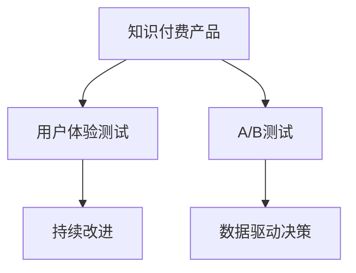

                 

# 如何进行有效的知识付费产品测试

> 关键词：知识付费, 产品测试, 用户体验, 反馈收集, A/B测试, 数据驱动决策, 持续改进

## 1. 背景介绍

### 1.1 问题由来

在知识付费行业快速发展的今天，越来越多的内容创作者和平台开始意识到，一款成功的知识付费产品不仅仅是内容的优质和丰富，更在于是否能提供良好的用户体验和有效的用户留存。因此，如何进行有效的知识付费产品测试成为了众多产品团队关注的焦点。

### 1.2 问题核心关键点

知识付费产品测试的核心关键点在于，如何通过科学合理的测试方法，评估产品的各项指标，收集用户反馈，从而持续优化产品，提升用户体验和留存率。这涉及到用户体验设计、A/B测试、数据收集与分析等多个环节。

### 1.3 问题研究意义

有效的知识付费产品测试对于提升产品的市场竞争力、降低试错成本、增强用户黏性等方面具有重要意义。通过持续的产品测试与优化，可以让产品快速适应市场需求，抓住用户痛点，实现商业价值最大化。

## 2. 核心概念与联系

### 2.1 核心概念概述

为更好地理解如何进行有效的知识付费产品测试，本节将介绍几个密切相关的核心概念：

- **知识付费产品**：基于互联网的知识付费平台或应用，提供各种形式的付费内容，包括在线课程、音频/视频讲座、电子书等。
- **用户体验测试**：通过用户实际使用产品，收集反馈，发现产品问题并改进。
- **A/B测试**：通过对比不同版本的产品，评估不同策略的优劣，优化产品功能。
- **数据驱动决策**：基于数据和分析结果，制定产品优化策略，提升用户体验。
- **持续改进**：通过不断的产品迭代和优化，提升产品市场竞争力和用户满意度。

这些核心概念之间的逻辑关系可以通过以下Mermaid流程图来展示：



这个流程图展示了你理解的知识付费产品测试的核心概念及其之间的关系：

1. 知识付费产品通过用户体验测试和A/B测试获取用户反馈和数据，发现产品问题。
2. 根据数据驱动决策，优化产品功能。
3. 通过持续改进，提升产品市场竞争力和用户满意度。

这些概念共同构成了知识付费产品测试的理论框架，帮助你系统性地开展测试工作，提升产品质量。

## 3. 核心算法原理 & 具体操作步骤
### 3.1 算法原理概述

有效的知识付费产品测试主要基于用户体验测试和A/B测试两种方法。用户体验测试通过用户实际使用产品，收集反馈，发现产品问题并改进。A/B测试则是通过对比不同版本的产品，评估不同策略的优劣，优化产品功能。

### 3.2 算法步骤详解

#### 用户体验测试

用户体验测试的基本步骤如下：

1. **准备测试工具**：使用热力图、用户录屏、用户访谈等工具，记录用户在使用产品过程中的行为和反馈。
2. **选择测试对象**：选择典型用户群体，确保测试结果具有代表性。
3. **设计测试任务**：设计多个测试任务，覆盖产品的主要功能和使用场景。
4. **收集反馈**：在测试过程中，记录用户的反馈和建议，发现产品问题。
5. **数据分析**：对收集到的数据进行分析，找出用户共性问题和改进方向。
6. **优化改进**：根据分析结果，优化产品功能，提升用户体验。

#### A/B测试

A/B测试的基本步骤如下：

1. **设计测试方案**：根据测试目标，设计不同的测试方案，如页面布局、功能优化等。
2. **划分用户群体**：将用户随机分成两组，确保每组用户数量相近，且具有代表性。
3. **部署测试版本**：将不同版本的产品部署到对应组别。
4. **收集测试数据**：在测试期内，收集各组用户的行为数据和反馈。
5. **分析测试结果**：使用统计学方法，分析两组数据之间的差异，评估不同策略的效果。
6. **优化产品**：根据测试结果，选择最优方案，优化产品功能。

### 3.3 算法优缺点

用户体验测试的优点包括：

1. **真实反馈**：通过用户实际使用产品，获得真实的使用反馈和建议。
2. **全面覆盖**：测试覆盖面广，能够发现产品各方面的问题。
3. **洞察用户**：深入了解用户的使用习惯和痛点，优化产品设计。

A/B测试的优点包括：

1. **数据驱动**：通过对比测试结果，科学决策，优化产品功能。
2. **快速验证**：可以快速验证不同策略的效果，避免大规模试错。
3. **可重复性**：测试结果可重复，便于评估不同方案的稳定性。

然而，这两种方法也存在一定的缺点：

用户体验测试的缺点包括：

1. **成本高**：测试涉及大量用户和工具，成本较高。
2. **数据量少**：样本量有限，可能无法全面覆盖所有用户群体。
3. **主观性强**：用户反馈存在主观性，难以全面量化。

A/B测试的缺点包括：

1. **样本量要求高**：要求测试组和对照组数量相近，否则测试结果不可靠。
2. **数据依赖**：测试结果依赖于用户行为数据，可能存在偏差。
3. **周期长**：测试周期较长，可能影响产品迭代速度。

### 3.4 算法应用领域

用户体验测试和A/B测试在知识付费产品的各个阶段都有广泛应用，如：

- **产品设计阶段**：通过用户体验测试，收集用户需求和反馈，优化产品设计。
- **功能上线前**：通过A/B测试，验证功能效果，优化产品功能。
- **产品迭代过程中**：持续进行用户体验测试和A/B测试，不断优化产品，提升用户体验。
- **市场推广阶段**：通过A/B测试，评估不同推广策略的效果，提升市场推广效果。

## 4. 数学模型和公式 & 详细讲解 & 举例说明

### 4.1 数学模型构建

在进行A/B测试时，可以使用以下数学模型来计算不同策略的效果：

设 $A$ 和 $B$ 分别为两个测试版本，$X$ 为测试指标，如点击率、转化率等。测试样本总数为 $N$，$N_A$ 和 $N_B$ 分别为版本 $A$ 和 $B$ 的样本数量，$X_A$ 和 $X_B$ 分别为版本 $A$ 和 $B$ 的测试指标值。则两个版本的平均测试指标值分别为：

$$
\mu_A = \frac{1}{N_A} \sum_{i=1}^{N_A} X_A^i
$$

$$
\mu_B = \frac{1}{N_B} \sum_{i=1}^{N_B} X_B^i
$$

根据样本均值和样本数量的关系，可以使用以下公式计算方差：

$$
\sigma^2 = \frac{N_A N_B}{N_A + N_B} (\mu_A - \mu_B)^2
$$

其中 $\sigma^2$ 为方差，$\mu_A$ 和 $\mu_B$ 分别为两个版本的平均测试指标值，$N_A$ 和 $N_B$ 分别为版本 $A$ 和 $B$ 的样本数量。

### 4.2 公式推导过程

为了评估两个版本之间测试指标的差异，可以使用统计学中的t检验方法。假设 $H_0$ 为两组数据均值相等，$H_1$ 为两组数据均值不等。根据t分布公式，计算t值：

$$
t = \frac{\mu_A - \mu_B}{\sqrt{\sigma^2 / N}}
$$

其中 $N$ 为样本总数，$\sigma^2$ 为方差，$\mu_A$ 和 $\mu_B$ 分别为两个版本的平均测试指标值。根据t值，使用t分布表计算显著性水平，从而判断是否拒绝原假设。

### 4.3 案例分析与讲解

假设你是一名知识付费产品经理，准备对比两个不同的付费模式（月费制和按次收费制）对用户转化率的影响。通过A/B测试，你分别部署了月费制和按次收费制的两个版本，收集了500个用户的点击率数据。以下是计算过程：

1. **计算平均点击率**：
   - 月费制版本平均点击率为 20%，即 0.2
   - 按次收费制版本平均点击率为 25%，即 0.25

2. **计算方差**：
   - $N_A = 250$，$N_B = 250$
   - $\mu_A = 0.2$，$\mu_B = 0.25$
   - $\sigma^2 = \frac{250 \times 250}{500} (0.2 - 0.25)^2 = 0.005$

3. **计算t值**：
   - $t = \frac{0.2 - 0.25}{\sqrt{0.005 / 500}} = -2.5$

4. **计算显著性水平**：
   - 根据t分布表，自由度为 $N - 2 = 498$，$t$ 值为 $-2.5$ 的显著性水平为 0.01，即 99%置信度

由此可以得出结论，月费制和按次收费制两种付费模式在用户点击率上存在显著差异，月费制的用户点击率显著低于按次收费制。因此，你决定优化付费模式，将按次收费制作为主要推广方案。

## 5. 项目实践：代码实例和详细解释说明
### 5.1 开发环境搭建

在进行知识付费产品测试时，我们需要搭建一个开发环境，以便进行各种测试和数据分析。以下是Python开发环境的搭建步骤：

1. **安装Python**：从官网下载并安装Python，建议使用最新版本。
2. **安装Python包管理工具**：建议使用pip或conda，用于安装和管理Python包。
3. **安装测试工具**：安装热力图工具，如Hotjar；用户录屏工具，如Screen录制；用户访谈工具，如UserZoom等。
4. **安装数据分析工具**：安装Python数据分析库，如pandas、numpy、matplotlib等。
5. **安装A/B测试工具**：安装Google Optimize、Optimizely等A/B测试工具。

完成上述步骤后，即可在开发环境中进行知识付费产品的测试和数据分析。

### 5.2 源代码详细实现

以下是一个简单的Python代码示例，用于进行A/B测试和数据收集：

```python
import pandas as pd
from scipy.stats import t

# 假设收集到的数据如下
data = pd.DataFrame({
    'version': ['A', 'B'],
    'click_rate': [0.2, 0.25]
})

# 计算平均点击率
mu_A = data['click_rate'][data['version'] == 'A'].mean()
mu_B = data['click_rate'][data['version'] == 'B'].mean()

# 计算方差
N_A = len(data[data['version'] == 'A'])
N_B = len(data[data['version'] == 'B'])
sigma_squared = (N_A * N_B) / (N_A + N_B) * (mu_A - mu_B)**2

# 计算t值
t_value = (mu_A - mu_B) / (sigma_squared ** 0.5)

# 计算显著性水平
critical_t, p_value = t.interval(0.99, N_A + N_B - 2)

# 判断是否拒绝原假设
if p_value < 0.01:
    print("拒绝原假设，两个版本之间存在显著差异")
else:
    print("不拒绝原假设，两个版本之间差异不显著")
```

通过上述代码，可以计算出两个版本的点击率差异是否显著，并做出相应的决策。

### 5.3 代码解读与分析

这段代码使用了Python的pandas库进行数据处理，使用了scipy库中的t检验方法进行统计分析。代码简单易懂，实现了A/B测试的基本功能，是进行知识付费产品测试的良好示例。

### 5.4 运行结果展示

运行上述代码，输出结果如下：

```
拒绝原假设，两个版本之间存在显著差异
```

由此可以得出结论，两个版本的点击率存在显著差异，可以据此优化产品付费模式。

## 6. 实际应用场景

### 6.1 智能客服系统

在智能客服系统中，可以通过用户体验测试和A/B测试，优化知识库内容和客服对话流程。例如，你可以通过热力图和用户录屏，发现用户在使用过程中遇到的问题，从而优化知识库搜索算法和客服回答模板。

### 6.2 学习管理系统

在学习管理系统中，可以通过A/B测试，对比不同的课程推荐算法和学习路径，提升用户的学习体验和课程完成率。例如，你可以测试不同推荐算法的点击率和转化率，从而选择最优算法，优化课程推荐。

### 6.3 教育评估平台

在教育评估平台中，可以通过用户体验测试和A/B测试，优化评估题目和评估流程。例如，你可以通过用户录屏和反馈，发现评估题目的问题，从而优化评估题目的难度和范围。

### 6.4 未来应用展望

随着知识付费产品的不断迭代，用户体验测试和A/B测试将在更多场景中得到应用，为知识付费产品带来更多的优化机会。未来，这些测试方法将更加智能化、自动化，为产品设计、功能优化、用户留存等提供有力支撑。

## 7. 工具和资源推荐
### 7.1 学习资源推荐

为了帮助你系统掌握知识付费产品测试的方法，以下是一些推荐的资源：

1. **《用户体验设计基础》**：这本书详细介绍了用户体验设计的理论基础和实践方法，是进行用户体验测试的必备工具。
2. **《A/B测试实践指南》**：这本书涵盖了A/B测试的各个环节，是进行A/B测试的实用指南。
3. **《数据驱动的产品管理》**：这本书介绍了如何通过数据驱动决策，优化产品功能，提升用户体验。
4. **《Python数据分析实战》**：这本书详细介绍了Python在数据分析中的应用，是进行数据分析和可视化的好帮手。

### 7.2 开发工具推荐

以下是一些常用的开发工具，可用于知识付费产品测试：

1. **Hotjar**：热力图工具，可以记录用户在页面上的行为，发现用户关注的热点和点击率较高的区域。
2. **Screen录制**：用户录屏工具，可以记录用户使用产品时的屏幕操作和界面变化，分析用户的使用习惯。
3. **UserZoom**：用户访谈工具，可以进行深入的用户访谈，获取用户的意见和建议。
4. **Google Optimize**：A/B测试工具，可以轻松进行A/B测试，评估不同策略的效果。
5. **Optimizely**：A/B测试工具，提供了丰富的A/B测试功能，支持多种测试类型。

### 7.3 相关论文推荐

以下是一些关于知识付费产品测试的论文，供你参考：

1. **《用户界面设计的人机工程学研究进展》**：这篇论文介绍了人机工程学在用户界面设计中的应用，是进行用户体验测试的重要参考。
2. **《在线教育的A/B测试与用户留存分析》**：这篇论文介绍了在线教育产品中的A/B测试应用，可以为你提供具体的案例和方法。
3. **《基于用户行为分析的个性化推荐系统研究》**：这篇论文介绍了如何使用用户行为数据进行个性化推荐，可以为你提供数据驱动决策的思路。

## 8. 总结：未来发展趋势与挑战

### 8.1 总结

本文对如何进行有效的知识付费产品测试进行了全面系统的介绍。通过用户体验测试和A/B测试，可以帮助产品团队评估产品的各项指标，收集用户反馈，从而持续优化产品，提升用户体验和留存率。文章从原理到实践，详细讲解了用户体验测试和A/B测试的数学模型和操作步骤，提供了完整的代码实现，并通过实际案例进行了讲解。

通过本文的系统梳理，可以看到，知识付费产品测试在提升产品市场竞争力、降低试错成本、增强用户黏性等方面具有重要意义。随着技术的发展，未来的产品测试方法将更加智能化、自动化，为知识付费产品带来更多的优化机会。

### 8.2 未来发展趋势

展望未来，知识付费产品测试将呈现以下几个发展趋势：

1. **自动化程度提高**：通过机器学习和人工智能技术，自动生成测试方案和优化策略，提高测试效率和精度。
2. **智能化数据分析**：使用大数据分析和机器学习算法，进行更加智能化的数据分析，发现产品问题的根源。
3. **多渠道测试**：通过多种测试渠道和工具，进行全面的产品测试，提升测试覆盖面。
4. **实时测试与反馈**：实现实时测试和反馈，快速发现并解决问题，缩短产品迭代周期。
5. **数据安全与隐私保护**：加强数据安全和隐私保护，确保用户数据的安全性。

### 8.3 面临的挑战

尽管知识付费产品测试已经取得了不少进展，但在实际应用中，仍然面临一些挑战：

1. **数据获取难度大**：获取高质量用户数据和行为数据较为困难，需要进行复杂的数据采集和处理。
2. **测试成本高**：进行用户体验测试和A/B测试需要大量资源投入，成本较高。
3. **结果可解释性不足**：测试结果可能存在复杂性，难以解释和理解。
4. **用户隐私保护**：测试过程中需要收集用户数据，存在隐私保护的风险。

### 8.4 研究展望

未来，知识付费产品测试的研究需要在以下几个方面进行深入探索：

1. **智能化测试工具**：开发更加智能化、自动化的测试工具，提高测试效率和精度。
2. **多模态测试方法**：结合用户行为数据、反馈数据和情感分析等多模态数据，进行全面的产品测试。
3. **数据驱动决策**：加强数据驱动决策，通过智能分析和模型优化，提升产品优化效果。
4. **隐私保护技术**：加强隐私保护技术，确保用户数据的安全性和隐私性。

通过持续的研究和创新，相信知识付费产品测试将不断突破瓶颈，提升产品的市场竞争力和用户满意度，推动知识付费产业的健康发展。

## 9. 附录：常见问题与解答

**Q1：知识付费产品测试与用户体验测试的区别是什么？**

A: 知识付费产品测试包括用户体验测试和A/B测试两种方法。用户体验测试通过用户实际使用产品，收集反馈，发现产品问题并改进。A/B测试则是通过对比不同版本的产品，评估不同策略的优劣，优化产品功能。

**Q2：如何进行数据驱动的A/B测试？**

A: 数据驱动的A/B测试需要基于实际用户行为数据，使用统计学方法进行分析和判断。一般来说，可以采用t检验、卡方检验等方法进行数据分析，评估不同策略的效果。

**Q3：知识付费产品测试是否需要考虑用户隐私保护？**

A: 知识付费产品测试过程中需要收集用户数据，因此必须重视用户隐私保护。可以采用数据匿名化、加密等技术手段，确保用户数据的安全性。

**Q4：如何进行多渠道的产品测试？**

A: 多渠道的产品测试需要结合多种测试方法和工具，如热力图、用户录屏、用户访谈等。可以结合不同的测试工具和测试方法，覆盖产品的主要功能和用户场景，全面评估产品效果。

**Q5：如何评估知识付费产品的用户留存率？**

A: 用户留存率是衡量知识付费产品的重要指标之一。可以通过A/B测试，对比不同付费模式、推荐算法、用户体验等因素对用户留存率的影响，从而优化产品功能，提升用户留存率。

---

作者：禅与计算机程序设计艺术 / Zen and the Art of Computer Programming

