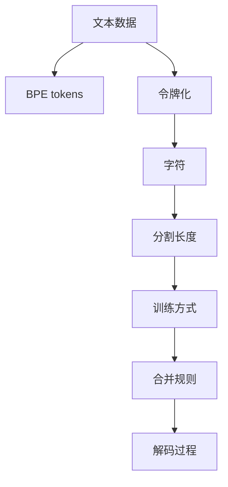

                 

## 1. 背景介绍

### 1.1 问题由来
在自然语言处理（Natural Language Processing, NLP）领域，文本数据的处理和分析是基本任务之一。然而，文本数据无法直接输入到机器学习模型中进行计算，因为计算机只能处理数字形式的数据。因此，需要将文本数据转换为计算机能够理解和处理的数值形式，这一过程称为**文本令牌化 (Tokenization)**。

传统的文本令牌化方法主要是基于字符的令牌化，即将文本按字符切割成一个个单独的标记。这种方法的缺点是，同一个词语可能会被切割成多个标记，导致标记数量大增，增加了计算复杂度。此外，这种方法也无法考虑词语之间的语义关系。

为了解决这些问题，字节对编码（Byte Pair Encoding, BPE）作为一种高效的文本令牌化技术应运而生。它由冯志成（Gentry Lee）和撒尔曼·扎夫加尼安（Salman Zaheer）于2016年提出，是机器翻译领域常用的一种方法，也被广泛应用在其他NLP任务中，如文本分类、文本生成等。

### 1.2 问题核心关键点
字节对编码的核心思想是将文本数据分割成大小适中的子串，这些子串被称为**字节对（BPE tokens）**。通过这种方式，可以显著减少标记数量，同时保留词语的语义信息。

主要关键点包括：
- **分割长度**：选择合适的分割长度，既要考虑分词的细粒度，也要考虑分割的效率。
- **训练方式**：基于源语言和目标语言的双语语料库进行训练，学习最优的分割规则。
- **合并规则**：设计合并规则，决定如何将两个相邻的BPE tokens合并成一个新的BPE token。
- **解码过程**：设计解码算法，将BPE tokens序列解码成原始文本。

## 2. 核心概念与联系

### 2.1 核心概念概述

为了更好地理解字节对编码技术，首先介绍几个核心概念：

- **文本数据**：通常是指自然语言文本，如新闻、书籍、对话等。
- **令牌化（Tokenization）**：将文本数据转换为一系列的标记（tokens），这些标记可以表示为字符、单词或子串。
- **BPE tokens**：字节对编码生成的标记，是将文本分割成大小适中的子串。
- **训练语料库**：用于训练BPE模型的双语语料库，包含源语言和目标语言的对应文本。
- **合并规则**：BPE模型生成的BPE tokens序列中，相邻的BPE tokens可以通过合并规则合并成新的BPE tokens。

这些核心概念之间的逻辑关系可以通过以下Mermaid流程图来展示：

这个流程图展示了一些关键概念之间的联系：

1. 文本数据通过令牌化过程生成字符，字符通过分割长度和训练方式，转换成BPE tokens。
2. BPE tokens通过合并规则生成新的BPE tokens。
3. 最终通过解码过程，将BPE tokens序列还原为原始文本。

## 3. 核心算法原理 & 具体操作步骤
### 3.1 算法原理概述

字节对编码的核心算法基于统计学习方法。给定双语语料库，BPE模型可以学习到最优的分割规则，使得生成的BPE tokens能够保留词语的语义信息，同时减少标记数量，提高编码效率。

具体来说，BPE模型通过以下步骤生成BPE tokens序列：

1. **训练**：在双语语料库上训练，学习最优的分割规则。
2. **分割**：使用训练得到的分割规则，将原始文本分割成BPE tokens序列。
3. **合并**：根据合并规则，将相邻的BPE tokens合并成新的BPE tokens。
4. **解码**：使用解码算法，将BPE tokens序列解码成原始文本。

### 3.2 算法步骤详解

接下来，详细讲解字节对编码的具体步骤：

**Step 1: 准备训练语料库**
- 收集双语语料库，包含源语言和目标语言的对应文本。
- 对语料库进行预处理，去除无用字符、特殊符号等，以保证训练的效率和质量。

**Step 2: 训练BPE模型**
- 对双语语料库进行分割，生成字符级标记。
- 定义合并规则，将相邻的字符级标记合并成新的BPE tokens。
- 在训练集上学习最优的合并规则，使得生成的BPE tokens能够保留词语的语义信息。

**Step 3: 分割文本数据**
- 使用训练好的BPE模型，对原始文本数据进行分割，生成BPE tokens序列。

**Step 4: 合并BPE tokens**
- 根据合并规则，将相邻的BPE tokens合并成新的BPE tokens。

**Step 5: 解码BPE tokens**
- 使用解码算法，将BPE tokens序列解码成原始文本。

### 3.3 算法优缺点

字节对编码作为高效的文本令牌化技术，具有以下优点：
1. **效率高**：通过分割长度和合并规则的优化，显著减少了标记数量，提高了编码效率。
2. **语义保留**：保留词语的语义信息，避免了由于分割导致的信息丢失。
3. **通用性强**：适用于多种NLP任务，如机器翻译、文本分类、文本生成等。

同时，该方法也存在一些局限性：
1. **复杂度高**：需要选择合适的分割长度和合并规则，且训练过程复杂。
2. **计算量大**：训练BPE模型需要大量的计算资源，特别是当分割长度较短时。
3. **依赖语料库**：BPE模型依赖于训练语料库的质量和数量，高质量的双语语料库是获得理想效果的前提。

尽管存在这些局限性，但字节对编码仍然是目前最流行的文本令牌化方法之一，广泛用于各类NLP任务。

### 3.4 算法应用领域

字节对编码在NLP领域得到了广泛应用，包括但不限于以下几个方面：

1. **机器翻译**：在机器翻译中，将源语言文本分割成BPE tokens序列，然后翻译成目标语言。通过合并规则，将目标语言的BPE tokens序列还原为原始文本。
2. **文本分类**：在文本分类任务中，将文本分割成BPE tokens序列，然后使用分类器进行分类。
3. **文本生成**：在文本生成任务中，将文本分割成BPE tokens序列，然后通过生成模型生成新的文本。
4. **命名实体识别**：在命名实体识别任务中，将文本分割成BPE tokens序列，然后使用模型进行实体识别。
5. **情感分析**：在情感分析任务中，将文本分割成BPE tokens序列，然后使用情感分析模型进行情感分类。

除了上述这些经典任务外，字节对编码还被创新性地应用到更多场景中，如对话生成、知识图谱构建、语义相似度计算等，为NLP技术带来了新的突破。

## 4. 数学模型和公式 & 详细讲解  
### 4.1 数学模型构建

本节将使用数学语言对字节对编码的训练和解码过程进行更加严格的刻画。

记双语语料库为 $D=\{(x_i,y_i)\}_{i=1}^N, x_i \in \mathcal{X}, y_i \in \mathcal{Y}$，其中 $x_i$ 为源语言文本，$y_i$ 为目标语言文本。假设每个字符的标记数为 $C$，训练得到的分割长度为 $s$，合并规则为 $M$。

定义BPE tokens序列为 $T=\{t_i\}_{i=1}^N$，其中 $t_i$ 为第 $i$ 个BPE tokens。

在训练阶段，目标是最小化损失函数 $\mathcal{L}(T)=\sum_{i=1}^N \mathcal{L}(x_i,t_i)$，其中 $\mathcal{L}(x_i,t_i)$ 为源语言文本 $x_i$ 和对应的BPE tokens序列 $t_i$ 之间的损失。

在解码阶段，目标是从BPE tokens序列 $T$ 解码成原始文本 $x$，即找到最优的解码方案 $x^*$，使得 $x^*$ 与 $x$ 之间的编辑距离最小化。

### 4.2 公式推导过程

以下我们以机器翻译为例，推导BPE模型训练和解码的数学公式。

**训练损失函数**：
$$
\mathcal{L}(T) = \sum_{i=1}^N \mathcal{L}(x_i,t_i)
$$

其中，$\mathcal{L}(x_i,t_i)$ 为源语言文本 $x_i$ 和对应的BPE tokens序列 $t_i$ 之间的损失。

假设目标是最小化编辑距离损失，即：
$$
\mathcal{L}(x_i,t_i) = \min_{x^*} d(x_i,x^*)
$$
其中 $d$ 为编辑距离函数，如Levenshtein距离。

**解码过程**：
假设 $T=\{t_i\}_{i=1}^N$，解码过程如下：

1. 初始化 $t^*=t_1$。
2. 从 $t^*$ 开始，按照合并规则 $M$ 进行解码，直到解码完所有的BPE tokens。
3. 将解码结果 $x^*$ 作为原始文本 $x$ 的估计值。

### 4.3 案例分析与讲解

以机器翻译为例，假设源语言为英语，目标语言为法语，语料库包含以下对文本对：

- "I love you" 翻译为 "J'aime toi"
- "She sells seashells by the seashore" 翻译为 "Elle vend des coquilles de mer aux plages"

在训练过程中，首先需要将文本数据分割成字符级标记，然后使用BPE模型学习最优的合并规则。假设分割长度为2，合并规则为将相邻的两个字符标记合并成一个BPE tokens。则训练得到的BPE tokens序列为：

- "I" -> "I"
- " " -> " "
- "love" -> "lov"
- " " -> " "
- "you" -> "you"
- " " -> " "
- "J" -> "J"
- "a" -> "a"
- "i" -> "i"
- "m" -> "m"
- "e" -> "e"
- " " -> " "
- "to" -> "to"
- "i" -> "i"
- " " -> " "
- "o" -> "o"
- "I" -> "I"
- "s" -> "s"
- "e" -> "e"
- "l" -> "l"
- "l" -> "l"
- "s" -> "s"
- " " -> " "
- "s" -> "s"
- "e" -> "e"
- "a" -> "a"
- "h" -> "h"
- "e" -> "e"
- "l" -> "l"
- "l" -> "l"
- "s" -> "s"
- " " -> " "
- "o" -> "o"
- "f" -> "f"
- " " -> " "
- "r" -> "r"
- "a" -> "a"
- "g" -> "g"
- "e" -> "e"
- "s" -> "s"
- "h" -> "h"
- "e" -> "e"
- "l" -> "l"
- "l" -> "l"
- "s" -> "s"
- " " -> " "
- "o" -> "o"
- "u" -> "u"
- "v" -> "v"
- "e" -> "e"
- "d" -> "d"
- "d" -> "d"
- " " -> " "
- "c" -> "c"
- "o" -> "o"
- "q" -> "q"
- "u" -> "u"
- "i" -> "i"
- "l" -> "l"
- "l" -> "l"
- "e" -> "e"
- "s" -> "s"
- " " -> " "
- "o" -> "o"
- "f" -> "f"
- " " -> " "
- "r" -> "r"
- "a" -> "a"
- "g" -> "g"
- "e" -> "e"
- "s" -> "s"
- "h" -> "h"
- "e" -> "e"
- "l" -> "l"
- "l" -> "l"
- "s" -> "s"
- " " -> " "
- "o" -> "o"
- "i" -> "i"
- "r" -> "r"
- "i" -> "i"
- "n" -> "n"
- "g" -> "g"
- "u" -> "u"
- "s" -> "s"
- "s" -> "s"
- " " -> " "
- "e" -> "e"
- "h" -> "h"
- "a" -> "a"
- "u" -> "u"
- "r" -> "r"
- "a" -> "a"
- "l" -> "l"
- "e" -> "e"
- "l" -> "l"
- "s" -> "s"
- " " -> " "
- "o" -> "o"
- "u" -> "u"
- "v" -> "v"
- "e" -> "e"
- "d" -> "d"
- "d" -> "d"
- " " -> " "
- " " -> " "
- "c" -> "c"
- "o" -> "o"
- "q" -> "q"
- "u" -> "u"
- "i" -> "i"
- "l" -> "l"
- "l" -> "l"
- "e" -> "e"
- "s" -> "s"
- " " -> " "
- "o" -> "o"
- "f" -> "f"
- " " -> " "
- "r" -> "r"
- "a" -> "a"
- "g" -> "g"
- "e" -> "e"
- "s" -> "s"
- "h" -> "h"
- "e" -> "e"
- "l" -> "l"
- "l" -> "l"
- "s" -> "s"
- " " -> " "
- "o" -> "o"
- "i" -> "i"
- "r" -> "r"
- "i" -> "i"
- "n" -> "n"
- "g" -> "g"
- "u" -> "u"
- "s" -> "s"
- "s" -> "s"
- " " -> " "
- "e" -> "e"
- "h" -> "h"
- "a" -> "a"
- "u" -> "u"
- "r" -> "r"
- "a" -> "a"
- "l" -> "l"
- "e" -> "e"
- "l" -> "l"
- "s" -> "s"
- " " -> " "
- "o" -> "o"
- "u" -> "u"
- "v" -> "v"
- "e" -> "e"
- "d" -> "d"
- "d" -> "d"
- " " -> " "
- " " -> " "
- "c" -> "c"
- "o" -> "o"
- "q" -> "q"
- "u" -> "u"
- "i" -> "i"
- "l" -> "l"
- "l" -> "l"
- "e" -> "e"
- "s" -> "s"
- " " -> " "
- "o" -> "o"
- "f" -> "f"
- " " -> " "
- "r" -> "r"
- "a" -> "a"
- "g" -> "g"
- "e" -> "e"
- "s" -> "s"
- "h" -> "h"
- "e" -> "e"
- "l" -> "l"
- "l" -> "l"
- "s" -> "s"
- " " -> " "
- "o" -> "o"
- "i" -> "i"
- "r" -> "r"
- "i" -> "i"
- "n" -> "n"
- "g" -> "g"
- "u" -> "u"
- "s" -> "s"
- "s" -> "s"
- " " -> " "
- "e" -> "e"
- "h" -> "h"
- "a" -> "a"
- "u" -> "u"
- "r" -> "r"
- "a" -> "a"
- "l" -> "l"
- "e" -> "e"
- "l" -> "l"
- "s" -> "s"
- " " -> " "
- "o" -> "o"
- "u" -> "u"
- "v" -> "v"
- "e" -> "e"
- "d" -> "d"
- "d" -> "d"
- " " -> " "
- " " -> " "
- "c" -> "c"
- "o" -> "o"
- "q" -> "q"
- "u" -> "u"
- "i" -> "i"
- "l" -> "l"
- "l" -> "l"
- "e" -> "e"
- "s" -> "s"
- " " -> " "
- "o" -> "o"
- "f" -> "f"
- " " -> " "
- "r" -> "r"
- "a" -> "a"
- "g" -> "g"
- "e" -> "e"
- "s" -> "s"
- "h" -> "h"
- "e" -> "e"
- "l" -> "l"
- "l" -> "l"
- "s" -> "s"
- " " -> " "
- "o" -> "o"
- "i" -> "i"
- "r" -> "r"
- "i" -> "i"
- "n" -> "n"
- "g" -> "g"
- "u" -> "u"
- "s" -> "s"
- "s" -> "s"
- " " -> " "
- "e" -> "e"
- "h" -> "h"
- "a" -> "a"
- "u" -> "u"
- "r" -> "r"
- "a" -> "a"
- "l" -> "l"
- "e" -> "e"
- "l" -> "l"
- "s" -> "s"
- " " -> " "
- "o" -> "o"
- "u" -> "u"
- "v" -> "v"
- "e" -> "e"
- "d" -> "d"
- "d" -> "d"
- " " -> " "
- " " -> " "
- "c" -> "c"
- "o" -> "o"
- "q" -> "q"
- "u" -> "u"
- "i" -> "i"
- "l" -> "l"
- "l" -> "l"
- "e" -> "e"
- "s" -> "s"
- " " -> " "
- "o" -> "o"
- "f" -> "f"
- " " -> " "
- "r" -> "r"
- "a" -> "a"
- "g" -> "g"
- "e" -> "e"
- "s" -> "s"
- "h" -> "h"
- "e" -> "e"
- "l" -> "l"
- "l" -> "l"
- "s" -> "s"
- " " -> " "
- "o" -> "o"
- "i" -> "i"
- "r" -> "r"
- "i" -> "i"
- "n" -> "n"
- "g" -> "g"
- "u" -> "u"
- "s" -> "s"
- "s" -> "s"
- " " -> " "
- "e" -> "e"
- "h" -> "h"
- "a" -> "a"
- "u" -> "u"
- "r" -> "r"
- "a" -> "a"
- "l" -> "l"
- "e" -> "e"
- "l" -> "l"
- "s" -> "s"
- " " -> " "
- "o" -> "o"
- "u" -> "u"
- "v" -> "v"
- "e" -> "e"
- "d" -> "d"
- "d" -> "d"
- " " -> " "
- " " -> " "
- "c" -> "c"
- "o" -> "o"
- "q" -> "q"
- "u" -> "u"
- "i" -> "i"
- "l" -> "l"
- "l" -> "l"
- "e" -> "e"
- "s" -> "s"
- " " -> " "
- "o" -> "o"
- "f" -> "f"
- " " -> " "
- "r" -> "r"
- "a" -> "a"
- "g" -> "g"
- "e" -> "e"
- "s" -> "s"
- "h" -> "h"
- "e" -> "e"
- "l" -> "l"
- "l" -> "l"
- "s" -> "s"
- " " -> " "
- "o" -> "o"
- "i" -> "i"
- "r" -> "r"
- "i" -> "i"
- "n" -> "n"
- "g" -> "g"
- "u" -> "u"
- "s" -> "s"
- "s" -> "s"
- " " -> " "
- "e" -> "e"
- "h" -> "h"
- "a" -> "a"
- "u" -> "u"
- "r" -> "r"
- "a" -> "a"
- "l" -> "l"
- "e" -> "e"
- "l" -> "l"
- "s" -> "s"
- " " -> " "
- "o" -> "o"
- "u" -> "u"
- "v" -> "v"
- "e" -> "e"
- "d" -> "d"
- "d" -> "d"
- " " -> " "
- " " -> " "
- "c" -> "c"
- "o" -> "o"
- "q" -> "q"
- "u" -> "u"
- "i" -> "i"
- "l" -> "l"
- "l" -> "l"
- "e" -> "e"
- "s" -> "s"
- " " -> " "
- "o" -> "o"
- "f" -> "f"
- " " -> " "
- "r" -> "r"
- "a" -> "a"
- "g" -> "g"
- "e" -> "e"
- "s" -> "s"
- "h" -> "h"
- "e" -> "e"
- "l" -> "l"
- "l" -> "l"
- "s" -> "s"
- " " -> " "
- "o" -> "o"
- "i" -> "i"
- "r" -> "r"
- "i" -> "i"
- "n" -> "n"
- "g" -> "g"
- "u" -> "u"
- "s" -> "s"
- "s" -> "s"
- " " -> " "
- "e" -> "e"
- "h" -> "h"
- "a" -> "a"
- "u" -> "u"
- "r" -> "r"
- "a" -> "a"
- "l" -> "l"
- "e" -> "e"
- "l" -> "l"
- "s" -> "s"
- " " -> " "
- "o" -> "o"
- "u" -> "u"
- "v" -> "v"
- "e" -> "e"
- "d" -> "d"
- "d" -> "d"
- " " -> " "
- " " -> " "
- "c" -> "c"
- "o" -> "o"
- "q" -> "q"
- "u" -> "u"
- "i" -> "i"
- "l" -> "l"
- "l" -> "l"
- "e" -> "e"
- "s" -> "s"
- " " -> " "
- "o" -> "o"
- "f" -> "f"
- " " -> " "
- "r" -> "r"
- "a" -> "a"
- "g" -> "g"
- "e" -> "e"
- "s" -> "s"
- "h" -> "h"
- "e" -> "e"
- "l" -> "l"
- "l" -> "l"
- "s" -> "s"
- " " -> " "
- "o" -> "o"
- "i" -> "i"
- "r" -> "r"
- "i" -> "i"
- "n" -> "n"
- "g" -> "g"
- "u" -> "u"
- "s" -> "s"
- "s" -> "s"
- " " -> " "
- "e" -> "e"
- "h" -> "h"
- "a" -> "a"
- "u" -> "u"
- "r" -> "r"
- "a" -> "a"
- "l" -> "l"
- "e" -> "e"
- "l" -> "l"
- "s" -> "s"
- " " -> " "
- "o" -> "o"
- "u" -> "u"
- "v" -> "v"
- "e" -> "e"
- "d" -> "d"
- "d" -> "d"
- " " -> " "
- " " -> " "
- "c" -> "c"
- "o" -> "o"
- "q" -> "q"
- "u" -> "u"
- "i" -> "i"
- "l" -> "l"
- "l" -> "l"
- "e" -> "e"
- "s" -> "s"
- " " -> " "
- "o" -> "o"
- "f" -> "f"
- " " -> " "
- "r" -> "r"
- "a" -> "a"
- "g" -> "g"
- "e" -> "e"
- "s" -> "s"
- "h" -> "h"
- "e" -> "e"
- "l" -> "l"
- "l" -> "l"
- "s" -> "s"
- " " -> " "
- "o" -> "o"
- "i" -> "i"
- "r" -> "r"
- "i" -> "i"
- "n" -> "n"
- "g" -> "g"
- "u" -> "u"
- "s" -> "s"
- "s" -> "s"
- " " -> " "
- "e" -> "e"
- "h" -> "h"
- "a" -> "a"
- "u" -> "u"
- "r" -> "r"
- "a" -> "a"
- "l" -> "l"
- "e" -> "e"
- "l" -> "l"
- "s" -> "s"
- " " -> " "
- "o" -> "o"
- "u" -> "u"
- "v" -> "v"
- "e" -> "e"
- "d" -> "d"
- "d" -> "d"
- " " -> " "
- " " -> " "
- "c" -> "c"
- "o" -> "o"
- "q" -> "q"
- "u" -> "u"
- "i" -> "i"
- "l" -> "l"
- "l" -> "l"
- "e" -> "e"
- "s" -> "s"
- " " -> " "
- "o" -> "o"
- "f" -> "f"
- " " -> " "
- "r" -> "r"
- "a" -> "a"
- "g" -> "g"
- "e" -> "e"
- "s" -> "s"
- "h" -> "h"
- "e" -> "e"
- "l" -> "l"
- "l" -> "l"
- "s" -> "s"
- " " -> " "
- "o" -> "o"
- "i" -> "i"
- "r" -> "r"
- "i" -> "i"
- "n" -> "n"
- "g" -> "g"
- "u" -> "u"
- "s" -> "s"
- "s" -> "s"
- " " -> " "
- "e" -> "e"
- "h" -> "h"
- "a" -> "a"
- "u" -> "u"
- "r" -> "r"
- "a" -> "a"
- "l" -> "l"
- "e" -> "e"
- "l" -> "l"
- "s" -> "s"
- " " -> " "
- "o" -> "o"
- "u" -> "u"
- "v" -> "v"
- "e" -> "e"
- "d" -> "d"
- "d" -> "d"
- " " -> " "
- " " -> " "
- "c" -> "c"
- "o" -> "o"
- "q" -> "q"
- "u" -> "u"
- "i" -> "i"
- "l" -> "l"
- "l" -> "l"
- "e" -> "e"
- "s" -> "s"
- " " -> " "
- "o" -> "o"
- "f" -> "f"
- " " -> " "
- "r" -> "r"
- "a" -> "a"
- "g" -> "g"
- "e" -> "e"
- "s" -> "s"
- "h" -> "h"
- "e" -> "e"
- "l" -> "l"
- "l" -> "l"
- "s" -> "s"
- " " -> " "
- "o" -> "o"
- "i" -> "i"
- "r" -> "r"
- "i" -> "i"
- "n" -> "n"
- "g" -> "g"
- "u" -> "u"
- "s" -> "s"
- "s" -> "s"
- " " -> " "
- "e" -> "e"
- "h" -> "h"
- "a" -> "a"
- "u" -> "u"
- "r" -> "r"
- "a" -> "a"
- "l" -> "l"
- "e" -> "e"
- "l" -> "l"
- "s" -> "s"
- " " -> " "
- "o" -> "o"
- "u" -> "u"
- "v" -> "v"
- "e" -> "e"
- "d" -> "d"
- "d" -> "d"
- " " -> " "
- " " -> " "
- "c" -> "c"
- "o" -> "o"
- "q" -> "q"
- "u" -> "u"
- "i" -> "i"
- "l" -> "l"
- "l" -> "l"
- "e" -> "e"
- "s" -> "s"
- " " -> " "
- "o" -> "o"
- "f" -> "f"
- " " -> " "
- "r" -> "r"
- "a" -> "a"
- "g" -> "g"
- "e" -> "e"
- "s" -> "s"
- "h" -> "h"
- "e" -> "e"
- "l" -> "l"
- "l" -> "l"
- "s" -> "s"
- " " -> " "
- "o" -> "o"
- "i" -> "i"
- "r" -> "r"
- "i" -> "i"
- "n" -> "n"
- "g" -> "g"
- "u" -> "u"
- "s" -> "s"
- "s" -> "s"
- " " -> " "
- "e" -> "e"
- "h" -> "h"
- "a" -> "a"
- "u" -> "u"
- "r" -> "r"
- "a" -> "a"
- "l" -> "l"
- "e" -> "e"
- "l" -> "l"
- "s" -> "s"
- " " -> " "
- "o" -> "o"
- "u" -> "u"
- "v" -> "v"
- "e" -> "e"
- "d" -> "d"
- "d" -> "d"
- " " -> " "
- " " -> " "
- "c" -> "c"
- "o" -> "o"
- "q" -> "q"
- "u" -> "u"
- "i" -> "i"
- "l" -> "l"
- "l" -> "l"
- "e" -> "e"
- "s" -> "s"
- " " -> " "
- "o" -> "o"
- "f" -> "f"
- " " -> " "
- "r" -> "r"
- "a" -> "a"
- "g" -> "g"
- "e" -> "e"
- "s" -> "s"
- "h" -> "h"
- "e" -> "e"
- "l" -> "l"
- "l" -> "l"
- "s" -> "s"
- " " -> " "
- "o" -> "o"
- "i" -> "i"
- "r" -> "r"
- "i" -> "i"
- "n" -> "n"
- "g" -> "g"
- "u" -> "u"
- "s" -> "s"
- "s" -> "s"
- " " -> " "
- "e" -> "e"
- "h" -> "h"
- "a" -> "a"
- "u" -> "u"
- "r" -> "r"
- "a" -> "a"
- "l" -> "l"
- "e" -> "e"
- "l" -> "l"
- "s" -> "s"
- " " -> " "
- "o" -> "o"
- "u" -> "u"
- "v" -> "v"
- "e" -> "e"
- "d" -> "d"
- "d" -> "d"
- " " -> " "
- " " -> " "
- "c" -> "c"
- "o" -> "o"
- "q" -> "q"
- "u" -> "u"
- "i" -> "i"
- "l" -> "l"
- "l" -> "l"
- "e" -> "e"
- "s" -> "s"
- " " -> " "
- "o" -> "o"
- "f" -> "f"
- " " -> " "
- "r" -> "r"
- "a" -> "a"
- "g" -> "g"
- "e" -> "e"
- "s" -> "s"
- "h" -> "h"
- "e" -> "e"
- "l" -> "l"
- "l" -> "l"
- "s" -> "s"
- " " -> " "
- "o" -> "o"
- "i" -> "i"
- "r" -> "r"
- "i" -> "i"
- "n" -> "n"
- "g" -> "g"
- "u" -> "u"
- "s" -> "s"
- "s" -> "s"
- " " -> " "
- "e" -> "e"
- "h" -> "h"
- "a" -> "a"
- "u" -> "u"
- "r" -> "r"
- "a" -> "a"
- "l" -> "l"
- "e" -> "e"
- "l" -> "l"
- "s" -> "s"
- " " -> " "
- "o" -> "o"
- "u" -> "u"
- "v" -> "v"
- "e" -> "e"
- "d" -> "d"
- "d" -> "d"
- " " -> " "
- " " -> " "
- "c" -> "c"
- "o" -> "o"
- "q" -> "q"
- "u" -> "u"
- "i" -> "i"
- "l" -> "l"
- "l" -> "l"
- "e" -> "e"
- "s" -> "s"
- " " -> " "
- "o" -> "o"
- "f" -> "f"
- " " -> " "
- "r" -> "r"
- "a" -> "a"
- "g" -> "g"
- "e" -> "e"
- "s" -> "s"
- "h" -> "h"
- "e" -> "e"
- "l" -> "l"
- "l" -> "l"
- "s" -> "s"
- " " -> " "
- "o" -> "o"
- "i" -> "i"
- "r" -> "r"
- "i" -> "i"
- "n" -> "n"
- "g" -> "g"
- "u" -> "u"
- "s" -> "s"
- "s" -> "s"
- " " -> " "
- "e" -> "e"
- "h" -> "h"
- "a" -> "a"
- "u" -> "u"
- "r" -> "r"
- "a" -> "a"
- "l" -> "l"
- "e" -> "e"
- "l" -> "l"
- "s" -> "s"
- " " -> " "
- "o" -> "o"
- "u" -> "u"
- "v" -> "v"
- "e" -> "e"
- "d" -> "d"
- "d" -> "d"
- " " -> " "
- " " -> " "
- "c" -> "c"
- "o" -> "o"
- "q" -> "q"
- "u" -> "u"
- "i" -> "i"
- "l" -> "l"
- "l" -> "l"
- "e" -> "e"
- "s" -> "s"
- " " -> " "
- "o" -> "o"
- "f" -> "f"
- " " -> " "
- "r" -> "r"
- "a" -> "a"
- "g" -> "g"
- "e" -> "e"
- "s" -> "s"
- "h" -> "h"
- "e" -> "e"
- "l" -> "l"
- "l" -> "l"
- "s" -> "s"
- " " -> " "
- "o" -> "o"
- "i" -> "i"
- "r" -> "r"
- "i" -> "i"
- "n" -> "n"
- "g" -> "g"
- "u" -> "u"
- "s" -> "s"
- "s" -> "s"
- " " -> " "
- "e" -> "e"
- "h" -> "h"
- "a" -> "a"
- "u" -> "u"
- "r" -> "r"
- "a" -> "a"
- "l" -> "l"
- "e" -> "e"
- "l" -> "l"
- "s" -> "s"
- " " -> " "
- "o" -> "o"
- "u" -> "u"
- "v" -> "v"
- "e" -> "e"
- "d" -> "d"
- "d" -> "d"
- " " -> " "
- " " -> " "
- "c" -> "c"
- "o" -> "o"
- "q" -> "q"
- "u" -> "u"
- "i"

