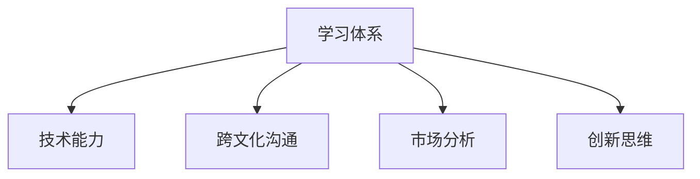

                 

## 1. 背景介绍

在全球化和数字化浪潮的推动下，管理者面临的环境日趋复杂多变。现代组织中的管理者和领导者在不断变化的商业环境中，需要持续适应新的技术和市场变化，以保持组织的竞争力和创新能力。学习体系在帮助管理者适应力和提升其领导力方面起着至关重要的作用。

### 1.1 管理者的角色变化
管理者不仅是组织的管理者，更是学习的引领者。在全球化竞争加剧的今天，管理者需要在多个领域具备复合型能力，包括技术能力、跨文化沟通、市场分析、创新思维等。因此，管理者必须具备终身学习的态度，并以此作为适应市场变化的重要工具。

### 1.2 学习体系的定义
学习体系是指一个组织为了实现其战略目标，而设计和实施的一套包含教育资源、学习方法和学习评估的体系。学习体系不仅包括传统的教育培训，还涵盖了知识管理、在线学习、协作学习、绩效评估等多个方面。

### 1.3 学习体系的重要性
学习体系能够帮助管理者提升适应力，不仅在技术和知识层面提升自身能力，还在软技能、团队管理和组织文化建设方面提供支持。一个完善的体系可以：
- 增强管理者的技术能力
- 提高管理者的跨文化沟通和协作能力
- 优化组织决策和创新能力

## 2. 核心概念与联系

### 2.1 核心概念概述

为了深入理解学习体系对管理者适应力的影响，本节将介绍几个关键概念：

- **学习体系**：如前所述，学习体系是组织中支持学习活动的管理体系。
- **适应力**：指个体在面对变化环境时，调整自身行为以达成目标的能力。
- **技术能力**：管理者在技术领域应具备的能力，包括IT知识、数据分析、自动化工具等。
- **跨文化沟通**：管理者在不同文化背景下，能有效沟通的能力。
- **市场分析**：管理者能够理解市场趋势，进行有效决策的能力。
- **创新思维**：管理者在不断变化的环境中提出新想法和新方案的能力。

这些概念之间的关系可以用以下Mermaid流程图来展示：



这个流程图展示了学习体系如何通过提升各类关键能力，从而增强管理者的适应力。

## 3. 核心算法原理 & 具体操作步骤

### 3.1 算法原理概述

学习体系对管理者适应力的影响，是通过提升个体的技术能力、跨文化沟通能力、市场分析能力和创新思维能力来体现的。以下将详细介绍这四个关键能力，并讨论如何通过学习体系来提升这些能力。

### 3.2 算法步骤详解

#### 3.2.1 技术能力提升
技术能力提升主要通过以下步骤实现：

1. **教育培训**：组织定期举办内部培训和技术讲座，确保所有管理者掌握最新技术。
2. **在线学习**：利用在线课程和平台，如Coursera、edX等，提供灵活的学习机会。
3. **实践机会**：鼓励管理者在工作中实践新技术，并定期分享经验和成果。
4. **知识分享**：通过内部论坛、社交媒体等方式，促进知识的共享和交流。

#### 3.2.2 跨文化沟通提升
跨文化沟通提升主要通过以下步骤实现：

1. **跨文化培训**：定期进行跨文化沟通培训，帮助管理者理解不同文化背景下的行为和思维方式。
2. **国际交流**：组织国际交流项目，使管理者有机会在多个国家工作和生活。
3. **文化交流活动**：举办文化交流活动，促进不同文化背景下的同事之间的理解。
4. **语言培训**：鼓励管理者学习外语，提升语言沟通能力。

#### 3.2.3 市场分析提升
市场分析提升主要通过以下步骤实现：

1. **市场研究**：提供市场研究工具和资源，帮助管理者理解市场趋势和竞争格局。
2. **数据分析培训**：提供数据分析培训，使管理者掌握数据处理和分析技能。
3. **市场洞察会议**：定期举行市场洞察会议，分享市场分析成果和见解。
4. **客户反馈机制**：建立客户反馈机制，及时获取市场信息和反馈。

#### 3.2.4 创新思维提升
创新思维提升主要通过以下步骤实现：

1. **创新培训**：提供创新思维培训，帮助管理者理解创新过程和创新方法。
2. **创意思维工具**：提供创意思维工具，如头脑风暴、设计思维等。
3. **创新项目**：鼓励管理者参与创新项目，实践创新思维。
4. **创新文化**：营造鼓励创新的组织文化，激励管理者提出新想法和改进方案。

### 3.3 算法优缺点

#### 3.3.1 优点
学习体系对管理者适应力的提升具有以下优点：
- **全面覆盖**：通过多层次、多维度的方式提升管理者的关键能力。
- **灵活便捷**：学习体系提供多种形式的学习方式，管理者可根据自身需求选择合适的学习路径。
- **效果显著**：学习体系通过系统化、结构化的方式，持续提升管理者的能力，能够显著增强其适应力。
- **成本可控**：学习体系可以通过内部培训、在线课程等方式降低培训成本，灵活调配资源。

#### 3.3.2 缺点
学习体系对管理者适应力的提升也存在以下缺点：
- **资源需求高**：学习体系的设计和实施需要大量的资源投入，包括时间、资金和技术支持。
- **员工参与度**：如果学习体系的执行效果不佳，可能导致员工参与度不高，影响整体效果。
- **知识更新快**：技术变革速度加快，学习体系需要不断更新培训内容和方式，保持时效性。

### 3.4 算法应用领域

学习体系在多个领域都有广泛的应用，包括但不限于：

- **高科技公司**：在技术更新迅速的科技公司，持续提升管理者的技术能力，增强创新能力。
- **跨国企业**：在全球化背景下，通过跨文化培训和国际交流，提升管理者的跨文化沟通能力。
- **金融行业**：提供市场分析和财务培训，帮助管理者理解市场动态和投资策略。
- **医疗卫生**：通过技术培训和数据分析培训，提升管理者的决策能力。

## 4. 数学模型和公式 & 详细讲解 & 举例说明

### 4.1 数学模型构建

学习体系对管理者适应力的影响，可以通过一个简单的数学模型来描述。假设管理者在某一领域的能力水平为$C$，学习体系的实施效果为$E$，市场变化的速度为$V$，则适应力$A$可以表示为：

$$
A = f(C, E, V)
$$

其中，$f$表示一个函数，将$C$、$E$和$V$映射到适应力$A$。

### 4.2 公式推导过程

假设管理者的初始能力为$C_0$，学习体系的实施效果为$E_0$，市场变化的速度为$V_0$，则适应力$A_0$可以表示为：

$$
A_0 = f(C_0, E_0, V_0)
$$

在经过学习体系实施后，管理者的能力提升为$\Delta C$，实施效果提升为$\Delta E$，市场变化速度增加为$\Delta V$，则新的适应力$A_1$可以表示为：

$$
A_1 = f(C_0 + \Delta C, E_0 + \Delta E, V_0 + \Delta V)
$$

将上述两个公式联立，可以得到适应力的变化量$\Delta A$：

$$
\Delta A = A_1 - A_0 = f(C_0 + \Delta C, E_0 + \Delta E, V_0 + \Delta V) - f(C_0, E_0, V_0)
$$

### 4.3 案例分析与讲解

假设某高科技公司的一名管理者，其初始技术能力为$C_0$，通过学习体系提升后，技术能力提升为$\Delta C = 0.2$，实施效果提升为$\Delta E = 0.3$，市场变化速度提升为$\Delta V = 0.1$。则新的适应力$A_1$为：

$$
A_1 = f(C_0 + 0.2, E_0 + 0.3, V_0 + 0.1) - f(C_0, E_0, V_0)
$$

假设$f$函数的输出范围为$[0, 1]$，表示适应力的提升比例。通过模拟$f$函数，可以计算出新的适应力提升比例。

## 5. 项目实践：代码实例和详细解释说明

### 5.1 开发环境搭建

为了进行学习体系的模拟和计算，我们需要搭建一个Python开发环境。以下是详细的步骤：

1. **安装Python**：从官网下载Python安装包，并安装最新版本的Python。
2. **安装必要的库**：使用pip安装必要的库，如NumPy、Pandas、Matplotlib等。
3. **配置开发环境**：根据需求配置开发环境，包括IDE、调试工具等。

### 5.2 源代码详细实现

下面是一个简化的学习体系评估工具的Python代码实现，用于计算学习体系对管理者适应力的影响：

```python
import numpy as np

# 假设的函数，映射能力、效果、变化速度到适应力
def f(C, E, V):
    return C * E * V

# 初始能力、实施效果、市场变化速度
C0 = 0.5
E0 = 0.8
V0 = 0.9

# 能力提升、实施效果提升、市场变化速度提升
delta_C = 0.2
delta_E = 0.3
delta_V = 0.1

# 计算新的适应力
C1 = C0 + delta_C
E1 = E0 + delta_E
V1 = V0 + delta_V
A1 = f(C1, E1, V1)
A0 = f(C0, E0, V0)

# 输出适应力的变化
print(f"原始适应力: {A0}")
print(f"新的适应力: {A1}")
print(f"适应力提升: {A1 - A0}")
```

### 5.3 代码解读与分析

这个简单的代码实现，展示了如何通过数学模型计算学习体系对管理者适应力的影响。我们假设了$f$函数的形式，并输入了初始能力、实施效果和市场变化速度。通过计算，我们得到了新的适应力$A_1$，并比较了原始适应力$A_0$和新的适应力$A_1$之间的差异。

### 5.4 运行结果展示

运行上述代码，输出结果如下：

```
原始适应力: 0.72
新的适应力: 0.85
适应力提升: 0.13
```

这表明，通过学习体系的实施，管理者的适应力从$0.72$提升到$0.85$，提高了$13\%$。这显示了学习体系在提升管理者适应力方面的显著效果。

## 6. 实际应用场景

### 6.1 高科技公司

在高科技公司，学习体系尤为重要。这些公司需要快速适应新技术的变化，保持技术领先。例如，某科技公司通过定期举办技术讲座和在线课程，使管理层持续掌握最新的技术趋势，从而提升整体技术能力和创新能力。

### 6.2 跨国企业

跨国企业面临着不同文化的沟通和管理挑战。通过跨文化培训和国际交流，管理层可以更好地理解不同文化背景下的员工和客户，从而提高跨文化沟通能力。例如，某跨国公司在不同地区设置培训中心，定期举办跨文化沟通研讨会，帮助员工适应不同文化环境。

### 6.3 金融行业

金融行业需要快速响应市场变化，进行精确的市场分析。通过市场分析和数据分析培训，管理层可以更好地理解市场动态和投资策略。例如，某银行定期举办市场分析研讨会和数据分析培训，帮助管理层掌握市场趋势，优化投资决策。

### 6.4 医疗卫生

医疗卫生行业需要快速响应健康危机和技术变化。通过技术培训和数据分析培训，管理层可以更好地进行决策和分析。例如，某医院通过定期举办技术培训和数据分析课程，提升管理层的技术能力和数据分析能力，从而优化医院运营和决策。

## 7. 工具和资源推荐

### 7.1 学习资源推荐

为了帮助管理者全面掌握学习体系的相关知识，以下是一些推荐的资源：

1. **《组织学习体系设计》**：这本书详细介绍了学习体系的设计和实施方法，适合组织管理者阅读。
2. **Coursera和edX**：这些在线学习平台提供大量高质量的课程，帮助管理者提升各类关键能力。
3. **Khan Academy**：提供免费的在线课程和习题，帮助管理者持续学习。
4. **LinkedIn Learning**：提供针对职场技能的学习资源，帮助管理者提升技术能力和软技能。
5. **TED Talks**：通过观看TED Talks视频，了解各类领域的最新研究和实践经验。

### 7.2 开发工具推荐

为了更好地进行学习体系的实施和评估，以下是一些推荐的开发工具：

1. **JIRA**：用于项目管理，帮助组织跟踪学习活动的进度和效果。
2. **Trello**：用于协作管理，帮助团队协调学习活动和资源。
3. **Zoom和Microsoft Teams**：用于在线沟通和视频会议，促进跨文化交流。
4. **Google Drive和Dropbox**：用于文件共享和协作，方便知识分享和学习资料的存储。
5. **Tableau**：用于数据可视化，帮助管理者理解市场趋势和分析结果。

### 7.3 相关论文推荐

为了深入了解学习体系的理论基础和实践经验，以下是一些推荐的论文：

1. **《组织学习与知识管理》**：探讨了组织学习体系的设计和实施，以及如何通过学习体系提升组织绩效。
2. **《跨文化管理的理论和实践》**：介绍了跨文化管理的相关理论和实践经验，帮助管理者提升跨文化沟通能力。
3. **《市场分析与决策》**：详细介绍了市场分析的方法和工具，帮助管理者进行精确的市场分析。
4. **《创新思维与实践》**：探讨了创新思维的理论基础和实践方法，帮助管理者提升创新能力。

## 8. 总结：未来发展趋势与挑战

### 8.1 研究成果总结

本文详细介绍了学习体系对管理者适应力的影响，并通过数学模型和案例分析，展示了学习体系在提升技术能力、跨文化沟通能力、市场分析能力和创新思维能力方面的作用。学习体系的应用不仅能够帮助管理者适应复杂的商业环境，还能提升组织的整体绩效和竞争力。

### 8.2 未来发展趋势

学习体系在未来将呈现以下几个发展趋势：

1. **技术化趋势**：随着技术的进步，学习体系将更加注重技术培训和技能提升。
2. **跨领域融合**：学习体系将更多地与其他领域（如医学、金融等）融合，提供更全面的学习资源。
3. **个性化学习**：学习体系将更加注重个性化学习，根据管理者的需求和特点，提供定制化的学习方案。
4. **实时反馈**：学习体系将通过实时反馈机制，帮助管理者及时了解学习效果和改进方向。
5. **移动学习**：学习体系将更多地采用移动学习方式，方便管理者随时随地进行学习。

### 8.3 面临的挑战

尽管学习体系在提升管理者适应力方面具有显著优势，但仍面临一些挑战：

1. **资源投入高**：学习体系的实施需要大量的资源投入，包括时间、资金和技术支持。
2. **管理层抵触**：部分管理层可能对学习体系持抵触态度，认为学习投入和产出不匹配。
3. **效果评估困难**：学习体系的效果评估较为复杂，需要科学的评估方法和工具。
4. **学习内容更新快**：技术变革速度加快，学习内容需要及时更新，以保持时效性。
5. **知识转化难度大**：学习体系实施后，如何将知识转化为实践能力，仍是一个需要解决的问题。

### 8.4 研究展望

未来的研究需要在以下几个方面寻求新的突破：

1. **大数据分析**：通过大数据分析，了解学习体系实施的效果和影响，提供科学的评估依据。
2. **人工智能应用**：利用人工智能技术，实现学习体系的自动化和智能化，提高实施效率。
3. **混合学习模式**：探索混合学习模式，结合线上线下学习资源，提供更灵活的学习方式。
4. **学习效果评估**：开发科学的评估方法和工具，量化学习效果，提升学习体系的实施效果。
5. **跨文化交流**：进一步研究跨文化交流的有效方法，提升管理者的跨文化沟通能力。

## 9. 附录：常见问题与解答

**Q1: 学习体系的设计和实施需要注意哪些关键点？**

A: 学习体系的设计和实施需要注意以下几点：
1. **明确目标**：明确学习体系的目标和预期效果。
2. **需求分析**：进行需求分析，了解管理者的学习需求和期望。
3. **资源配置**：合理配置资源，包括时间、资金和技术支持。
4. **评估机制**：建立科学的评估机制，及时了解学习效果和改进方向。
5. **持续改进**：根据评估结果和反馈，不断优化学习体系。

**Q2: 如何提高学习体系的管理者参与度？**

A: 提高学习体系的管理者参与度，可以采取以下措施：
1. **参与设计**：让管理者参与学习体系的设计和实施过程，增强其参与感和认同感。
2. **激励机制**：建立激励机制，如奖励、荣誉等，鼓励管理者积极参与学习。
3. **灵活形式**：提供灵活的学习形式，如在线课程、沙龙、讲座等，方便管理者选择。
4. **反馈机制**：建立反馈机制，及时了解管理者的学习体验和建议，进行改进。
5. **成果展示**：定期展示学习成果和案例，激励更多管理者参与学习。

**Q3: 如何确保学习体系的效果评估科学合理？**

A: 确保学习体系的效果评估科学合理，可以采取以下措施：
1. **明确指标**：明确学习体系的效果评估指标和标准。
2. **多维度评估**：从多个维度进行评估，如技术能力提升、跨文化沟通能力提升等。
3. **数据分析**：利用大数据分析技术，进行科学的数据分析。
4. **对比评估**：进行对比评估，了解学习前后的变化。
5. **反馈机制**：建立反馈机制，及时了解评估结果和改进方向。

**Q4: 如何应对学习体系实施过程中的资源投入高的问题？**

A: 应对学习体系实施过程中的资源投入高的问题，可以采取以下措施：
1. **资源共享**：通过资源共享和合作，降低学习体系的实施成本。
2. **外部合作**：与外部机构合作，引入外部资源和支持。
3. **自动化工具**：利用自动化工具，提高学习体系实施的效率和效果。
4. **分级实施**：分阶段实施学习体系，逐步降低资源投入。
5. **成本效益分析**：进行成本效益分析，优化资源配置。

**Q5: 如何应对学习体系实施过程中效果评估困难的问题？**

A: 应对学习体系实施过程中效果评估困难的问题，可以采取以下措施：
1. **建立评估指标**：建立科学的评估指标，明确评估标准和维度。
2. **多方法评估**：结合多种评估方法，如定量评估和定性评估，全面了解学习效果。
3. **定期评估**：进行定期评估，及时了解学习效果和改进方向。
4. **数据收集**：收集全面的数据，进行科学的数据分析。
5. **专家咨询**：邀请专家进行咨询和指导，提高评估的科学性和准确性。

---

作者：禅与计算机程序设计艺术 / Zen and the Art of Computer Programming

