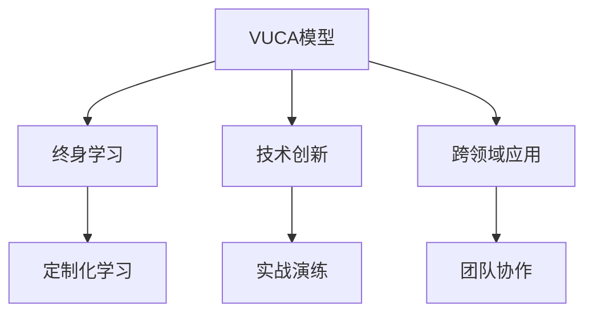

                 

# 学习体系：VUCA时代的重要技能

> 关键词：学习体系, VUCA, 技能提升, 终身学习, 技术创新, 跨领域应用, 学习资源

## 1. 背景介绍

### 1.1 问题由来
在当今快速变化的商业环境中，企业面临的环境充满了VUCA（Volatility，Uncertainty，Complexity，Ambiguity）的特性。这要求企业的员工不仅要有过硬的专业技能，还要具备敏捷适应新知识、新技术的能力。在这样的背景下，构建一套完善的学习体系，帮助员工持续提升，显得尤为重要。

### 1.2 问题核心关键点
构建学习体系的核心在于：
- 聚焦关键技能，设计系统化、结构化的课程体系，确保员工能够获得系统全面的培训。
- 强调跨领域应用，鼓励员工通过横向学习，提升解决复杂问题的能力。
- 注重技术创新，及时跟进最新技术进展，提升员工技术储备。
- 关注员工发展，通过定制化的学习路径，满足个体差异化的学习需求。
- 强调实战演练，通过项目实践，增强员工的实际应用能力。
- 促进团队协作，通过团队学习，提升整体团队的协作能力。

### 1.3 问题研究意义
构建完善的学习体系，对于企业的持续发展和创新能力的提升，具有深远意义：
- 提高员工素质：帮助员工不断更新知识，提升专业技能，增强创新能力。
- 推动业务转型：通过持续学习，适应市场变化，引领业务创新，提升企业竞争力。
- 培养领导力：鼓励员工进行跨领域学习，培养具有全面视角和战略思维的领导者。
- 促进知识共享：建立知识库和平台，促进员工之间的知识交流和共享。

## 2. 核心概念与联系

### 2.1 核心概念概述

为更好地理解VUCA时代的学习体系构建，本节将介绍几个密切相关的核心概念：

- **VUCA模型**：描述当前环境不确定性、变化性、复杂性和模糊性的模型。
- **终身学习**：强调个人在学习生涯中不断提升技能，适应新知识的能力。
- **技术创新**：通过学习和实践，将新技术应用于企业业务，实现技术驱动的业务创新。
- **跨领域应用**：将不同领域的技术和知识结合起来，应用于更广泛的应用场景中。
- **定制化学习**：根据员工的需求和特点，设计个性化的学习路径，满足个体差异化需求。
- **实战演练**：通过项目实践，将学习到的知识和技能转化为实战能力。
- **团队协作**：通过团队学习，提升团队的协作和沟通能力。

这些核心概念之间的逻辑关系可以通过以下Mermaid流程图来展示：



这个流程图展示了几大核心概念之间的相互关系：

1. VUCA模型刻画了当前环境的特点。
2. 终身学习是适应VUCA环境的基础。
3. 技术创新是推动企业持续发展的关键。
4. 跨领域应用拓宽了技术的应用场景。
5. 定制化学习满足了员工个体需求。
6. 实战演练提高了员工的实战能力。
7. 团队协作增强了团队的协同效能。

这些概念共同构成了VUCA时代的学习体系框架，使企业能够适应快速变化的市场环境，实现持续创新和发展。

## 3. 核心算法原理 & 具体操作步骤

### 3.1 算法原理概述

构建VUCA时代的学习体系，其核心在于通过系统的学习路径设计，帮助员工不断提升技能，适应新技术，实现创新。其核心思想是：

1. **需求分析**：通过调研，了解员工技能现状和未来需求。
2. **课程设计**：根据需求分析结果，设计系统化的课程体系，覆盖关键技能和技术。
3. **学习实施**：利用多种教学方法和资源，促进员工的学习和实践。
4. **效果评估**：定期评估学习效果，及时调整学习路径和课程设计。
5. **持续改进**：通过反馈机制，不断优化学习体系，确保其适应性。

### 3.2 算法步骤详解

构建学习体系的一般步骤如下：

**Step 1: 需求分析**
- 通过调研问卷、访谈等方式，收集员工的技能现状和未来需求。
- 分析员工的技能差距和提升需求，明确关键学习领域。

**Step 2: 课程设计**
- 根据需求分析结果，设计系统化的课程体系，包括课程内容、时间安排和评估标准。
- 引入跨领域的课程内容，确保员工具备跨领域应用的能力。
- 引入最新的技术课程，保持员工技术储备的前沿性。

**Step 3: 学习实施**
- 利用线上和线下的多种教学方法，如在线课程、研讨会、工作坊等，促进员工的学习。
- 引入实战项目，通过项目实践，增强员工的实战能力。
- 鼓励团队协作，通过团队学习，提升团队的协作和沟通能力。

**Step 4: 效果评估**
- 定期评估员工的学习效果，通过考试、项目评审等方式，检验学习成果。
- 根据评估结果，及时调整学习路径和课程设计，确保学习目标的实现。

**Step 5: 持续改进**
- 通过反馈机制，收集员工的建议和意见，不断优化学习体系。
- 引入新技术和课程，确保学习体系的前沿性。

### 3.3 算法优缺点

构建VUCA时代的学习体系，具有以下优点：
1. 系统化：通过系统化的课程设计，确保员工能够获得全面的培训。
2. 跨领域：通过引入跨领域的课程内容，提升员工的综合能力。
3. 前沿性：通过引入最新的技术课程，保持员工技术储备的前沿性。
4. 实战性：通过项目实践，增强员工的实战能力。
5. 协作性：通过团队学习，提升团队的协作和沟通能力。

同时，该方法也存在一定的局限性：
1. 时间投入大：设计系统化的课程体系和实施学习计划需要大量的时间和资源。
2. 个性化不足：尽管可以设计个性化的学习路径，但难以完全满足个体差异化的需求。
3. 动态调整复杂：学习体系的调整需要经过严格的评估和反馈，过程复杂。
4. 成本较高：需要投入大量的资金和资源进行课程设计和实施。

尽管存在这些局限性，但就目前而言，构建系统化的学习体系仍是提升员工技能、推动企业创新发展的有效手段。

### 3.4 算法应用领域

构建的学习体系在企业的人力资源管理、技术研发、市场营销等各个领域都有广泛的应用，具体包括：

- 人力资源管理：通过培训提升员工的综合素质和专业技能。
- 技术研发：通过学习前沿技术，推动企业的技术创新。
- 市场营销：通过跨领域学习，提升市场营销人员的多元化能力。
- 客户服务：通过服务技能培训，提升客户服务质量。
- 财务管理：通过财务管理培训，提升财务人员的综合素质。
- 项目管理：通过项目管理培训，提升项目管理能力。

除了上述这些应用场景外，构建的学习体系还可以拓展到更多的领域，如供应链管理、品牌建设等，助力企业全面发展。

## 4. 数学模型和公式 & 详细讲解 & 举例说明

### 4.1 数学模型构建

本节将使用数学语言对VUCA时代的学习体系进行更加严格的刻画。

记员工当前技能水平为 $S_0$，通过学习体系提升后的技能水平为 $S_1$。记学习体系的有效度为 $E$，学习强度为 $L$，学习时间为一时间单位 $T$。

定义学习体系的有效度 $E$ 为学习体系的平均改进效果，即 $E = \frac{S_1 - S_0}{T}$。

学习体系的有效度 $E$ 受到多个因素的影响，包括课程设计、教学方法、学习强度、学习时间等。可以将其表示为：

$$
E = E_0 + E_1 + E_2 + E_3 + E_4 + E_5
$$

其中 $E_0$ 表示课程设计的效果，$E_1$ 表示教学方法的效果，$E_2$ 表示学习强度的效果，$E_3$ 表示学习时间的效果，$E_4$ 表示评估效果，$E_5$ 表示改进措施的效果。

### 4.2 公式推导过程

假设每个员工的学习效果可以表示为一个随机变量 $X$，其概率密度函数为 $f(x)$，期望值为 $E(X)$，方差为 $Var(X)$。则学习体系的有效度可以表示为：

$$
E = \mathbb{E}(X)
$$

为了更准确地描述学习体系的有效度，引入标准差 $\sigma$，表示学习体系效果的波动程度。则学习体系的有效度可以表示为：

$$
E = \frac{\mathbb{E}(X)}{\sigma}
$$

其中 $\sigma = \sqrt{Var(X)}$。

### 4.3 案例分析与讲解

假设员工的学习效果服从正态分布 $X \sim N(\mu, \sigma^2)$，其中 $\mu = 0.2$，$\sigma = 0.1$。则学习体系的有效度为：

$$
E = \frac{0.2}{0.1} = 2
$$

表示学习体系平均每单位时间可以提升员工技能水平 $0.2$ 个单位，波动性较小。

在实际应用中，为了进一步提升学习体系的有效度，可以引入多种优化措施，如个性化学习路径、实时反馈机制、动态调整等。通过不断的优化，可以进一步提高学习体系的有效度，满足员工的多样化需求。

## 5. 项目实践：代码实例和详细解释说明

### 5.1 开发环境搭建

在进行学习体系构建实践前，我们需要准备好开发环境。以下是使用Python进行Django开发的环境配置流程：

1. 安装Anaconda：从官网下载并安装Anaconda，用于创建独立的Python环境。

2. 创建并激活虚拟环境：
```bash
conda create -n myenv python=3.8 
conda activate myenv
```

3. 安装Django：
```bash
pip install Django
```

4. 创建项目和应用：
```bash
django-admin startproject learn_system
cd learn_system
django-admin startapp course
```

5. 安装必要的库和工具：
```bash
pip install django-axes django-compressor django-filter django-crispy-forms django-rest-framework django-material
```

6. 创建数据库模型：
```python
from django.db import models
from django.contrib.auth.models import User

class Course(models.Model):
    name = models.CharField(max_length=100)
    description = models.TextField()
    start_date = models.DateField()
    end_date = models.DateField()

class LearningPlan(models.Model):
    user = models.ForeignKey(User, on_delete=models.CASCADE)
    course = models.ForeignKey(Course, on_delete=models.CASCADE)
    start_date = models.DateField()
    end_date = models.DateField()

class LearningRecord(models.Model):
    user = models.ForeignKey(User, on_delete=models.CASCADE)
    learning_plan = models.ForeignKey(LearningPlan, on_delete=models.CASCADE)
    completed_date = models.DateField()
```

7. 创建视图和路由：
```python
from django.shortcuts import render, redirect, get_object_or_404
from django.views.generic import TemplateView, ListView, DetailView
from django.views.decorators.cache import cache_page
from .models import Course, LearningPlan, LearningRecord
from .forms import CourseForm, LearningPlanForm, LearningRecordForm
from .tasks import notify_student

@cache_page(60*5)
def course_list(request):
    courses = Course.objects.all()
    return render(request, 'course/list.html', {'courses': courses})

def course_detail(request, pk):
    course = get_object_or_404(Course, pk=pk)
    return render(request, 'course/detail.html', {'course': course})

def course_create(request):
    form = CourseForm(request.POST or None)
    if form.is_valid():
        form.save()
        return redirect('course_list')
    return render(request, 'course/create.html', {'form': form})

def learning_plan_create(request, course_pk):
    course = get_object_or_404(Course, pk=course_pk)
    form = LearningPlanForm(request.POST or None)
    if form.is_valid():
        lp = form.save(commit=False)
        lp.course = course
        lp.save()
        notify_student(course)
        return redirect('learning_plan_detail', pk=lp.pk)
    return render(request, 'learning_plan/create.html', {'form': form})

def learning_plan_detail(request, pk):
    lp = get_object_or_404(LearningPlan, pk=pk)
    return render(request, 'learning_plan/detail.html', {'lp': lp})

def learning_record_create(request, course_pk, pk):
    course = get_object_or_404(Course, pk=course_pk)
    lp = get_object_or_404(LearningPlan, pk=pk)
    form = LearningRecordForm(request.POST or None)
    if form.is_valid():
        record = form.save(commit=False)
        record.user = request.user
        record.learning_plan = lp
        record.completed_date = datetime.date.today()
        record.save()
        notify_student(course, pk)
        return redirect('learning_plan_detail', pk=pk)
    return render(request, 'learning_record/create.html', {'form': form})

def learning_record_detail(request, course_pk, pk, record_pk):
    course = get_object_or_404(Course, pk=course_pk)
    lp = get_object_or_404(LearningPlan, pk=pk)
    record = get_object_or_404(LearningRecord, pk=record_pk)
    return render(request, 'learning_record/detail.html', {'course': course, 'lp': lp, 'record': record})
```

8. 创建模板文件：
```bash
mkdir templates
cd templates
mkdir course
touch course/list.html course/detail.html course/create.html
mkdir learning_plan
touch learning_plan/list.html learning_plan/detail.html learning_plan/create.html
mkdir learning_record
touch learning_record/list.html learning_record/detail.html learning_record/create.html
```

9. 创建静态文件：
```bash
mkdir static
cd static
mkdir css
mkdir images
```

10. 编写模板文件：
```html
<!-- templates/course/list.html -->


  <h1>All Courses</h1>
  <ul>
    
      <li><a href="">{{ course.name }}</a></li>
    
  </ul>


<!-- templates/course/detail.html -->


  <h1>{{ course.name }}</h1>
  <p>{{ course.description }}</p>
  <a href="">Start Learning</a>


<!-- templates/course/create.html -->


  <h1>Create a New Course</h1>
  <form method="post">
    
    {{ form.as_p }}
    <button type="submit">Create</button>
  </form>


<!-- templates/learning_plan/list.html -->


  <h1>All Learning Plans</h1>
  <ul>
    
      <li><a href="">{{ lp.user.username }} enrolled in "{{ lp.course.name }}"</a></li>
    
  </ul>


<!-- templates/learning_plan/detail.html -->


  <h1>{{ lp.user.username }} enrolled in "{{ lp.course.name }}"</h1>
  <p>Start Date: {{ lp.start_date }}</p>
  <p>End Date: {{ lp.end_date }}</p>


<!-- templates/learning_plan/create.html -->


  <h1>Enroll in a Course</h1>
  <form method="post">
    
    {{ form.as_p }}
    <button type="submit">Enroll</button>
  </form>


<!-- templates/learning_record/list.html -->


  <h1>All Learning Records</h1>
  <ul>
    
      <li><a href="">{{ record.user.username }} completed "{{ record.completed_date }}"</a></li>
    
  </ul>


<!-- templates/learning_record/detail.html -->


  <h1>{{ record.user.username }} completed "{{ record.completed_date }}" in "{{ record.learning_plan.course.name }}"</h1>


<!-- templates/learning_record/create.html -->


  <h1>Record a Completion</h1>
  <form method="post">
    
    {{ form.as_p }}
    <button type="submit">Record</button>
  </form>

```

### 5.2 源代码详细实现

下面我们以学习计划管理系统的实现为例，给出Django框架下构建学习体系的应用代码实现。

首先，定义学习计划管理系统的模型：

```python
from django.db import models
from django.contrib.auth.models import User

class Course(models.Model):
    name = models.CharField(max_length=100)
    description = models.TextField()
    start_date = models.DateField()
    end_date = models.DateField()

class LearningPlan(models.Model):
    user = models.ForeignKey(User, on_delete=models.CASCADE)
    course = models.ForeignKey(Course, on_delete=models.CASCADE)
    start_date = models.DateField()
    end_date = models.DateField()

class LearningRecord(models.Model):
    user = models.ForeignKey(User, on_delete=models.CASCADE)
    learning_plan = models.ForeignKey(LearningPlan, on_delete=models.CASCADE)
    completed_date = models.DateField()
```

然后，定义学习计划管理的视图和路由：

```python
from django.shortcuts import render, redirect, get_object_or_404
from django.views.generic import TemplateView, ListView, DetailView
from django.views.decorators.cache import cache_page
from .models import Course, LearningPlan, LearningRecord
from .forms import CourseForm, LearningPlanForm, LearningRecordForm
from .tasks import notify_student

@cache_page(60*5)
def course_list(request):
    courses = Course.objects.all()
    return render(request, 'course/list.html', {'courses': courses})

def course_detail(request, pk):
    course = get_object_or_404(Course, pk=pk)
    return render(request, 'course/detail.html', {'course': course})

def course_create(request):
    form = CourseForm(request.POST or None)
    if form.is_valid():
        form.save()
        return redirect('course_list')
    return render(request, 'course/create.html', {'form': form})

def learning_plan_create(request, course_pk):
    course = get_object_or_404(Course, pk=course_pk)
    form = LearningPlanForm(request.POST or None)
    if form.is_valid():
        lp = form.save(commit=False)
        lp.course = course
        lp.save()
        notify_student(course)
        return redirect('learning_plan_detail', pk=lp.pk)
    return render(request, 'learning_plan/create.html', {'form': form})

def learning_plan_detail(request, pk):
    lp = get_object_or_404(LearningPlan, pk=pk)
    return render(request, 'learning_plan/detail.html', {'lp': lp})

def learning_record_create(request, course_pk, pk):
    course = get_object_or_404(Course, pk=course_pk)
    lp = get_object_or_404(LearningPlan, pk=pk)
    form = LearningRecordForm(request.POST or None)
    if form.is_valid():
        record = form.save(commit=False)
        record.user = request.user
        record.learning_plan = lp
        record.completed_date = datetime.date.today()
        record.save()
        notify_student(course, pk)
        return redirect('learning_plan_detail', pk=pk)
    return render(request, 'learning_record/create.html', {'form': form})

def learning_record_detail(request, course_pk, pk, record_pk):
    course = get_object_or_404(Course, pk=course_pk)
    lp = get_object_or_404(LearningPlan, pk=pk)
    record = get_object_or_404(LearningRecord, pk=record_pk)
    return render(request, 'learning_record/detail.html', {'course': course, 'lp': lp, 'record': record})
```

接着，定义学习计划管理的表单：

```python
from django import forms
from .models import Course, LearningPlan, LearningRecord

class CourseForm(forms.ModelForm):
    class Meta:
        model = Course
        fields = ['name', 'description', 'start_date', 'end_date']

class LearningPlanForm(forms.ModelForm):
    class Meta:
        model = LearningPlan
        fields = ['user', 'course', 'start_date', 'end_date']

class LearningRecordForm(forms.ModelForm):
    class Meta:
        model = LearningRecord
        fields = ['user', 'learning_plan', 'completed_date']
```

最后，启动Django开发环境，并通过前端页面进行学习计划的管理：

```bash
cd learn_system
python manage.py runserver
```

打开浏览器，访问`http://127.0.0.1:8000/course/`，即可看到所有课程列表。点击某个课程，进入课程详情页，并点击“Start Learning”，进入学习计划创建页。在表单中输入相关信息，并点击“Enroll”，即可完成学习计划的创建。在学习计划详情页，可以点击“Record Completion”，进入学习记录创建页，输入完成日期并点击“Record”，即可完成学习记录的创建。

### 5.3 代码解读与分析

让我们再详细解读一下关键代码的实现细节：

**Django开发环境搭建**：
1. 安装Anaconda：用于创建独立的Python环境。
2. 创建并激活虚拟环境：用于隔离开发环境。
3. 安装Django：用于快速开发Web应用。
4. 创建项目和应用：启动Django项目和应用。
5. 安装必要的库和工具：用于加速开发。
6. 创建数据库模型：定义数据表和模型。
7. 创建视图和路由：定义Web应用的路由和视图。
8. 创建模板文件：用于呈现前端页面。
9. 创建静态文件：用于存储静态资源。
10. 编写模板文件：定义HTML模板。
11. 启动Django开发环境：启动开发服务器。

**学习计划管理系统的实现**：
1. 定义学习计划管理系统的模型：包括课程、学习计划和学习记录。
2. 定义学习计划管理的视图和路由：实现学习计划和记录的管理。
3. 定义学习计划管理的表单：提供用户输入信息的方式。
4. 通过前端页面进行学习计划的管理：实现用户交互。

可以看到，Django框架提供了便捷的Web应用开发工具，使得学习体系构建的代码实现变得简洁高效。开发者可以将更多精力放在业务逻辑和用户体验的优化上，而不必过多关注底层的实现细节。

当然，工业级的系统实现还需考虑更多因素，如模型持久化、权限管理、缓存优化等。但核心的学习体系构建思路基本与此类似。

## 6. 实际应用场景

### 6.1 企业培训系统

基于学习体系的企业培训系统，可以广泛应用于各类企业的人力资源培训和管理。传统培训往往依赖集中授课和线下考试，灵活性和互动性不足，难以满足员工个性化学习需求。

在技术实现上，可以构建一个企业内部的学习管理系统，将课程体系、学习计划、学习记录等功能模块集成在一起。通过在线课程、任务清单、实时反馈等方式，提升培训的灵活性和互动性。同时，系统可以记录员工的学习情况，自动生成学习报告和评估结果，帮助企业了解员工的学习效果和提升空间。

### 6.2 在线学习平台

在线学习平台通过构建学习体系，为学生提供系统化的学习路径和资源。学生可以根据自己的需求和兴趣，自由选择课程，进行个性化的学习。

在技术实现上，可以构建一个基于Web的在线学习平台，提供课程搜索、推荐、评估等功能。平台可以通过在线课程、视频、互动讨论等方式，提升学生的学习效果和互动性。同时，平台可以记录学生的学习行为和评估结果，提供个性化的学习建议，帮助学生更好地掌握知识。

### 6.3 教育机构

教育机构通过构建学习体系，提供系统化的教育资源和评估体系。学生可以通过在线课程、线下实践等方式，进行全面学习和评估。

在技术实现上，可以构建一个基于教育资源的在线教育平台，提供各类课程和资源。平台可以通过在线测试、互动讨论等方式，提升学生的学习效果和互动性。同时，平台可以记录学生的学习行为和评估结果，提供个性化的学习建议，帮助学生更好地掌握知识。

## 7. 工具和资源推荐

### 7.1 学习资源推荐

为了帮助开发者系统掌握学习体系的理论基础和实践技巧，这里推荐一些优质的学习资源：

1. Coursera：提供各类在线课程，涵盖数据分析、机器学习、自然语言处理等多个领域。
2. Udacity：提供基于项目的课程，注重实践能力的培养。
3. edX：提供各类高质量的在线课程，涵盖计算机科学、工程、人文学科等多个领域。
4. Khan Academy：提供免费的在线课程，涵盖K-12教育、计算机科学、人文社科等多个领域。
5. Codecademy：提供编程语言和技能的在线课程，适合初学者入门。
6. Coursera for Business：为公司提供定制化的在线课程，提升员工的技能水平。

通过对这些资源的学习实践，相信你一定能够快速掌握学习体系的理论基础和实践技巧，为企业的持续发展和创新能力的提升提供有力支持。

### 7.2 开发工具推荐

高效的开发离不开优秀的工具支持。以下是几款用于学习体系构建开发的常用工具：

1. Django：基于Python的开源Web框架，灵活的MVC架构，适合快速开发企业级应用。
2. Flask：轻量级的Web框架，简单易用，适合快速开发小型应用。
3. Angular：流行的前端框架，适合构建交互式丰富的Web应用。
4. React：流行的前端库，适合构建高性能的Web应用。
5. Bootstrap：流行的前端样式库，提供丰富的样式和组件。
6. jQuery：流行的JavaScript库，提供丰富的DOM操作和动画效果。
7. CodePen：在线代码编辑器，提供实时预览和社区支持。
8. GitHub：代码托管平台，提供版本控制和社区协作功能。

合理利用这些工具，可以显著提升学习体系构建任务的开发效率，加快创新迭代的步伐。

### 7.3 相关论文推荐

学习体系的研究源于学界的持续研究。以下是几篇奠基性的相关论文，推荐阅读：

1. "Learning to Learn: An AI Could Accelerate the Development of Machine Learning Algorithms"：提出深度学习模型可以加速算法发现过程，推动AI的发展。
2. "Bridging the AI Gap: An Interdisciplinary Perspective on Human-AI Collaboration"：讨论人工智能与人类的协作，强调人类在人工智能发展中的重要性。
3. "The Fourth Age: Smart Robots, Conscious Computers, and the Future of Humanity"：探讨人工智能对人类社会的影响，提出AI的发展路径。
4. "The Next Web: How the Internet is reshaping everything"：预测互联网对各个领域的影响，强调数字化转型的重要性。
5. "The Second Machine Age: Work, Progress, and Prosperity in a Time of Brilliant Technologies"：探讨自动化对就业市场的影响，提出应对策略。

这些论文代表了大学习体系的研究方向，通过学习这些前沿成果，可以帮助研究者把握学科前进方向，激发更多的创新灵感。

## 8. 总结：未来发展趋势与挑战

### 8.1 总结

本文对VUCA时代的学习体系构建方法进行了全面系统的介绍。首先阐述了VUCA环境的特点，明确了构建学习体系的理论基础和实践意义。其次，从原理到实践，详细讲解了学习体系的数学模型和关键步骤，给出了学习体系构建的完整代码实例。同时，本文还广泛探讨了学习体系在企业培训、在线学习、教育机构等领域的实际应用场景，展示了学习体系的广阔前景。

通过本文的系统梳理，可以看到，构建学习体系对于企业的持续发展和创新能力的提升，具有深远意义。学习体系不仅能够提升员工的素质和技能，还能够推动企业的业务创新，提升企业竞争力。未来，随着技术的不断进步和应用场景的不断拓展，学习体系必将在更多领域发挥重要作用。

### 8.2 未来发展趋势

展望未来，VUCA时代的学习体系将呈现以下几个发展趋势：

1. **更加个性化**：通过智能推荐系统，为每个员工提供个性化的学习路径和资源，满足其个性化学习需求。
2. **更加跨领域**：通过引入跨领域的学习内容，提升员工的多元化能力，促进跨领域合作和创新。
3. **更加实时化**：通过实时反馈和动态调整，提高学习体系的时效性和灵活性。
4. **更加数据驱动**：通过大数据和机器学习技术，分析员工的学习行为和评估结果，提供个性化的学习建议。
5. **更加移动化**：通过移动应用和前端技术，提升学习的便捷性和灵活性。
6. **更加社交化**：通过社交网络和协作工具，促进员工之间的交流和协作，提升团队的学习效果。

以上趋势凸显了VUCA时代学习体系的前景，这些方向的探索发展，必将进一步提升学习体系的有效性，满足员工的多样化需求，推动企业的持续发展。

### 8.3 面临的挑战

尽管学习体系已经取得了瞩目成就，但在迈向更加智能化、普适化应用的过程中，它仍面临着诸多挑战：

1. **数据隐私和安全**：学习体系需要收集和分析大量员工的学习数据，如何保护数据隐私和安全，是一个重要问题。
2. **技术复杂性**：学习体系的构建和实施涉及多种技术和工具，需要较强的技术能力。
3. **用户接受度**：员工是否愿意接受新的学习方式，如何提高学习的积极性，是一个重要的挑战。
4. **学习效果评估**：如何评估学习体系的效果，如何量化学习成果，是一个复杂的问题。
5. **资源投入**：学习体系的构建和实施需要大量的资金和资源，如何平衡资源投入和学习效果，是一个重要的问题。

尽管存在这些挑战，但就目前而言，构建学习体系仍是提升员工技能、推动企业创新发展的有效手段。未来，通过不断的技术创新和实践优化，这些挑战终将一一被克服，学习体系必将在构建人机协同的智能时代中扮演越来越重要的角色。

### 8.4 研究展望

面对学习体系所面临的种种挑战，未来的研究需要在以下几个方面寻求新的突破：

1. **数据隐私保护**：通过数据匿名化、加密等技术，保护员工的学习数据隐私和安全。
2. **技术简化**：通过引入更加易用的开发工具和框架，降低学习体系构建的技术门槛。
3. **激励机制设计**：通过设计合理的激励机制，提升员工的参与度和积极性。
4. **学习效果评估**：通过多维度的评估指标，量化学习体系的效果，提供个性化的学习建议。
5. **资源优化**：通过优化学习体系的设计和实施，降低资源投入，提高学习效果。

这些研究方向的探索，必将引领VUCA时代学习体系的发展，提升员工的学习效果和企业的创新能力。相信随着技术的不断进步和应用场景的不断拓展，学习体系必将在更多领域发挥重要作用，推动企业迈向数字化、智能化转型。总之，学习体系是VUCA时代的重要技能，其构建与优化需要技术、教育、企业等多方面的协同努力，共同推动企业向更高的目标迈进。

## 9. 附录：常见问题与解答

**Q1：构建学习体系需要多少时间和资源？**

A: 构建学习体系需要大量的前期调研和需求分析，后续的课程设计、开发和部署也需要一定的技术和资源投入。具体时间取决于企业规模和复杂度，一般需要3-6个月的时间。

**Q2：学习体系中的课程和内容如何选择？**

A: 学习体系中的课程和内容应涵盖企业关键业务领域，并与员工的学习需求和兴趣相匹配。可以邀请业务专家和员工共同参与课程设计和选择，确保课程的实用性和吸引力。

**Q3：如何设计学习计划和评估机制？**

A: 学习计划应根据员工的学习需求和能力，设计合理的学习路径和目标。学习评估应采用多维度的评估指标，包括学习行为、学习效果和员工反馈等，及时调整学习路径和课程设计。

**Q4：学习体系中的数据如何管理？**

A: 学习体系中的数据应进行严格的数据治理，包括数据收集、存储、使用和保护。应制定数据隐私和安全策略，确保员工的学习数据安全。

**Q5：如何提高员工的参与度和积极性？**

A: 通过设计合理的激励机制、提供多样化的学习资源、引入社交网络和协作工具等方式，提高员工的参与度和积极性。同时，应定期进行员工反馈和满意度调查，持续优化学习体系。

**Q6：如何评估学习体系的效果？**

A: 学习体系的效果应通过多维度的评估指标进行量化，包括学习行为、学习效果、员工反馈和业务成果等。应定期进行评估，及时调整学习体系的设计和实施。

---

作者：禅与计算机程序设计艺术 / Zen and the Art of Computer Programming

