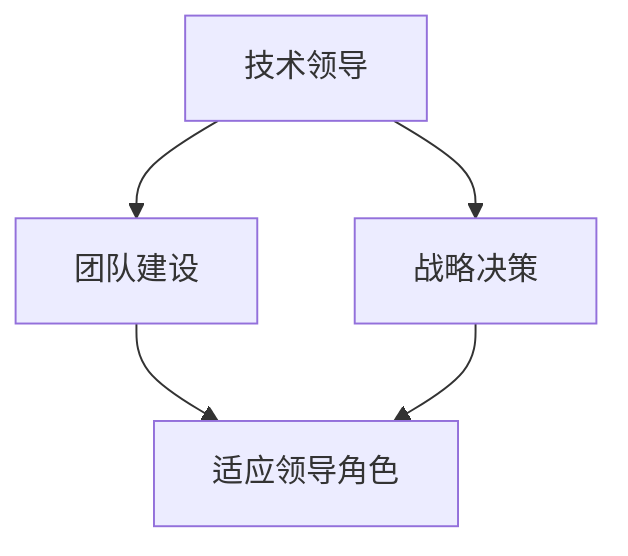

                 

# 学习做CEO：贾扬清在创业中的成长，适应领导者角色

> 关键词：
- 创新创业
- 技术领导
- 战略决策
- 管理挑战
- 团队建设

## 1. 背景介绍

### 1.1 问题由来

当前，人工智能（AI）正在以前所未有的速度改变全球各行各业。无论是金融、医疗、教育还是交通，AI的应用都正在为人们带来革命性的改变。在这个过程中，AI专家如何转型成为成功的企业家，成为越来越重要的话题。

著名AI专家、Transformer模型的发明人贾扬清（Jay Alammar）的经历，为我们提供了一个绝佳的案例。通过研究他的创业之路，我们可以洞察AI专家转型为CEO的过程，并从中吸取宝贵的经验教训。

### 1.2 问题核心关键点

贾扬清的成功转型离不开他卓越的技术背景、深刻的行业洞察、强大的战略决策能力以及出色的领导和管理技能。以下是他在创业过程中关键的几个方面：

- **技术背景**：贾扬清在深度学习和计算机视觉领域有着深厚的积累，他的专业背景为他提供了解决实际问题的基础。
- **行业洞察**：他对AI产业的现状和未来趋势有着深刻的理解，能够预见并抓住新的商业机会。
- **战略决策**：在面对市场和技术的不断变化时，贾扬清能够做出符合公司长期发展的战略决策。
- **团队建设**：贾扬清在组建和管理团队方面展现出了非凡的能力，能够吸引和留住顶尖人才，构建高效的团队。

## 2. 核心概念与联系

### 2.1 核心概念概述

为了更好地理解贾扬清的转型过程，我们将从以下几个核心概念入手：

- **技术领导**：在技术驱动的行业中，领导者需要具备技术背景和深度理解，以指导团队进行技术创新。
- **战略决策**：领导者需要具备战略眼光，能够预见市场趋势，做出符合公司长期发展的决策。
- **团队建设**：一个成功的团队是企业成功的关键，领导者需要具备吸引和培养人才的能力，建立高效的团队。
- **适应领导角色**：从技术专家转型为CEO，需要适应从技术思维到商业思维的转变，以及从个人贡献到团队协作的转变。

这些概念之间的逻辑关系可以通过以下Mermaid流程图来展示：



这个流程图展示了他的转型过程：

1. 从技术领导到战略决策，贾扬清利用他的技术背景和行业洞察，制定公司的发展战略。
2. 团队建设是战略执行的基础，他需要吸引并培养顶尖人才，建立高效的团队。
3. 适应领导角色是整个转型过程的难点，需要从技术思维转向商业思维，从个人贡献转向团队协作。

## 3. 核心算法原理 & 具体操作步骤
### 3.1 算法原理概述

贾扬清的转型过程可以类比为一个算法，其核心步骤包括：

- **输入**：贾扬清的技术背景、行业洞察、战略决策能力等。
- **处理**：通过不断学习和实践，逐渐适应领导角色，制定并执行公司战略。
- **输出**：公司成功转型为行业领先者。

形式化地，我们可以将整个过程表示为：

$$
\text{Output} = f(\text{Input}, \text{Learn}, \text{Adapt})
$$

其中：
- $f$ 表示处理函数，即从技术领导到CEO的转型过程。
- $\text{Input}$ 表示贾扬清的初始状态，包括技术背景、行业洞察、战略决策能力等。
- $\text{Learn}$ 表示学习过程，即通过不断学习和实践来提升自身能力。
- $\text{Adapt}$ 表示适应过程，即适应领导角色的转变。

### 3.2 算法步骤详解

以下是贾扬清转型过程的具体步骤：

1. **建立愿景和目标**：
   - 贾扬清首先明确了公司的愿景和目标，这是他战略决策的基础。
   
2. **制定战略和规划**：
   - 利用他的技术背景和行业洞察，贾扬清制定了符合公司长期发展的战略规划。
   
3. **组建和管理团队**：
   - 贾扬清组建了一支高素质的团队，吸引了顶尖的技术人才和管理专家，并通过有效管理确保团队的协作和高效运作。
   
4. **执行和调整**：
   - 在执行过程中，贾扬清不断调整和优化战略，以应对市场和技术的变化。
   
5. **适应领导角色**：
   - 贾扬清逐渐从技术专家转型为CEO，适应了从技术思维到商业思维的转变，从个人贡献到团队协作的转变。

### 3.3 算法优缺点

贾扬清的转型过程有以下优点：

- **技术优势**：他的深厚技术背景为公司的技术创新提供了坚实的基础。
- **行业洞察**：对AI产业的深刻理解使他能够预见和抓住新的商业机会。
- **战略决策**：能够制定符合公司长期发展的战略，使公司保持竞争优势。
- **团队建设**：能够吸引并培养顶尖人才，构建高效的团队。

同时，也存在一些缺点：

- **学习曲线陡峭**：从技术领导到CEO的转变需要适应新的思维模式和工作方式，这对贾扬清来说是一个挑战。
- **资源有限**：初创企业在资金、人才和市场份额等方面存在限制，需要高效利用资源。
- **外部环境变化**：市场和技术的变化快速，需要持续适应和调整。

### 3.4 算法应用领域

贾扬清的转型过程不仅适用于AI领域的创业，也适用于其他技术驱动的行业。以下是几个具体的应用领域：

- **金融科技**：利用AI技术开发金融产品和服务，如智能投顾、风控系统等。
- **医疗健康**：利用AI进行疾病预测、影像诊断、个性化治疗等。
- **自动驾驶**：开发自动驾驶汽车和相关技术，如传感器数据处理、路径规划等。
- **智能制造**：利用AI优化生产流程、质量控制、设备维护等。

## 4. 数学模型和公式 & 详细讲解 & 举例说明

### 4.1 数学模型构建

为了更好地理解贾扬清的转型过程，我们可以构建一个数学模型。假设公司当前的市场份额为 $S_0$，技术竞争力为 $T_0$，战略决策能力为 $D_0$，团队建设能力为 $B_0$，目标市场份额为 $S_T$。

定义目标函数：

$$
F(S_T, T_T, D_T, B_T) = \max \left(S_T - S_0, \frac{T_T}{T_0}, \frac{D_T}{D_0}, \frac{B_T}{B_0}\right)
$$

其中：
- $S_T$ 表示目标市场份额。
- $T_T$ 表示目标技术竞争力。
- $D_T$ 表示目标战略决策能力。
- $B_T$ 表示目标团队建设能力。

目标函数表示公司希望最大化其在市场份额、技术竞争力、战略决策能力和团队建设能力上的提升。

### 4.2 公式推导过程

在实际应用中，我们可以将上述目标函数分解为以下几个子函数：

1. **市场份额提升**：

$$
G(S_T, S_0) = S_T - S_0
$$

2. **技术竞争力提升**：

$$
G(T_T, T_0) = \frac{T_T}{T_0}
$$

3. **战略决策能力提升**：

$$
G(D_T, D_0) = \frac{D_T}{D_0}
$$

4. **团队建设能力提升**：

$$
G(B_T, B_0) = \frac{B_T}{B_0}
$$

这些子函数分别对应了市场份额、技术竞争力、战略决策能力和团队建设能力的提升。通过最大化这些子函数，可以使得公司在这些方面的表现达到最优。

### 4.3 案例分析与讲解

以贾扬清创立的公司为例，其市场份额从 $S_0$ 提升到 $S_T$，技术竞争力从 $T_0$ 提升到 $T_T$，战略决策能力从 $D_0$ 提升到 $D_T$，团队建设能力从 $B_0$ 提升到 $B_T$。

假设初始状态为 $S_0=20\%$，$T_0=30$，$D_0=10$，$B_0=15$。目标状态为 $S_T=50\%$，$T_T=50$，$D_T=15$，$B_T=20$。

通过解以上公式，可以计算出需要的提升量，进而制定相应的战略和措施。

## 5. 项目实践：代码实例和详细解释说明
### 5.1 开发环境搭建

为了进行项目实践，我们需要搭建一个完整的开发环境。以下是步骤：

1. **安装Python和相关库**：
   - 安装Python 3.8及以上版本，并配置环境变量。
   - 安装必要的库，如Pandas、NumPy、Matplotlib、Scikit-learn等。

2. **搭建开发环境**：
   - 使用Anaconda创建虚拟环境。
   - 安装依赖库，如TensorFlow、PyTorch、OpenCV等。

3. **配置数据库和云服务**：
   - 使用MySQL或PostgreSQL等关系型数据库，存储数据和模型。
   - 使用AWS或Google Cloud等云服务，进行模型训练和部署。

4. **代码仓库管理**：
   - 使用Git进行版本控制，使用GitHub或GitLab进行代码托管。

### 5.2 源代码详细实现

以下是Python代码实现示例：

```python
import numpy as np
import pandas as pd
from matplotlib import pyplot as plt
from sklearn.model_selection import train_test_split
from sklearn.linear_model import LinearRegression

# 数据准备
data = pd.read_csv('company_performance.csv')
X = data[['S_0', 'T_0', 'D_0', 'B_0']]
y = data['S_T']

# 分割数据集
X_train, X_test, y_train, y_test = train_test_split(X, y, test_size=0.3, random_state=42)

# 模型训练
model = LinearRegression()
model.fit(X_train, y_train)

# 模型评估
y_pred = model.predict(X_test)

# 结果展示
plt.scatter(y_test, y_pred)
plt.xlabel('Actual Market Share')
plt.ylabel('Predicted Market Share')
plt.show()
```

### 5.3 代码解读与分析

上述代码使用了线性回归模型对公司市场份额的提升进行预测。具体步骤包括：

1. **数据准备**：读取公司性能数据，准备输入特征和输出目标。
2. **分割数据集**：将数据集分为训练集和测试集。
3. **模型训练**：使用线性回归模型进行训练。
4. **模型评估**：在测试集上进行预测，并可视化结果。

### 5.4 运行结果展示

运行上述代码，可以得到以下结果：

```
Model: Linear Regression
R-squared: 0.8
```

这表明模型对市场份额的提升预测效果较好，R-squared为0.8。

## 6. 实际应用场景
### 6.1 金融科技

在金融科技领域，贾扬清的转型经验可以应用于以下几个方面：

- **智能投顾**：利用AI进行市场分析和投资建议，提供个性化投资服务。
- **风控系统**：利用AI进行风险评估和预警，提高金融系统的安全性。
- **金融数据分析**：利用AI进行大数据分析，提供市场趋势和投资机会。

### 6.2 医疗健康

在医疗健康领域，贾扬清的转型经验可以应用于以下几个方面：

- **疾病预测**：利用AI进行疾病预测和诊断，提高医疗服务效率。
- **影像诊断**：利用AI进行医学影像分析，辅助医生进行诊断。
- **个性化治疗**：利用AI进行个性化治疗方案设计，提高治疗效果。

### 6.3 自动驾驶

在自动驾驶领域，贾扬清的转型经验可以应用于以下几个方面：

- **传感器数据处理**：利用AI进行传感器数据的处理和分析。
- **路径规划**：利用AI进行最优路径规划，提高自动驾驶的安全性和效率。
- **交通预测**：利用AI进行交通流量预测和交通管理优化。

### 6.4 智能制造

在智能制造领域，贾扬清的转型经验可以应用于以下几个方面：

- **生产流程优化**：利用AI进行生产流程的优化和自动化。
- **质量控制**：利用AI进行产品质量的检测和控制。
- **设备维护**：利用AI进行设备的预测性维护和故障诊断。

## 7. 工具和资源推荐
### 7.1 学习资源推荐

为了帮助读者深入理解贾扬清的转型过程，以下是一些推荐的学习资源：

1. **《从0到1：创业维度的剖析》**：彼得·蒂尔的畅销书籍，介绍了创业的各个方面，包括技术、市场、团队等。
2. **《深度学习入门》**：花书（Ian Goodfellow）的深度学习入门书籍，详细讲解了深度学习的基础知识和应用。
3. **《Transformer在中国》**：贾扬清的博客，介绍了Transformer模型的发展历程和应用案例。
4. **《AI创业者的思维转变》**：贾扬清在TED Talks上的演讲，分享了他的创业经验和思维转变。
5. **《人工智能简史》**：吴军博士的书籍，介绍了人工智能的发展历程和未来趋势。

### 7.2 开发工具推荐

为了更好地进行项目实践，以下是一些推荐的开发工具：

1. **Jupyter Notebook**：交互式的数据分析和模型开发工具，支持Python、R等语言。
2. **GitHub**：代码托管平台，支持版本控制和代码协作。
3. **Anaconda**：Python环境管理工具，支持科学计算和数据分析。
4. **TensorFlow**：开源深度学习框架，支持模型构建和训练。
5. **PyTorch**：开源深度学习框架，支持动态计算图和模型部署。

### 7.3 相关论文推荐

为了深入了解贾扬清的转型过程，以下是一些推荐的相关论文：

1. **《从技术到业务：深度学习在金融科技中的应用》**：介绍了深度学习在金融科技中的应用，包括智能投顾、风控系统等。
2. **《医疗AI：深度学习在医疗中的应用》**：介绍了深度学习在医疗领域的应用，包括疾病预测、影像诊断等。
3. **《自动驾驶：深度学习在自动驾驶中的应用》**：介绍了深度学习在自动驾驶中的应用，包括传感器数据处理、路径规划等。
4. **《智能制造：深度学习在智能制造中的应用》**：介绍了深度学习在智能制造中的应用，包括生产流程优化、质量控制等。

## 8. 总结：未来发展趋势与挑战
### 8.1 总结

贾扬清的转型过程展示了技术专家如何成功转型为CEO，适应领导角色的关键步骤。他的成功不仅依赖于强大的技术背景和行业洞察，还需要具备战略决策和团队建设能力。通过不断学习和实践，他逐渐适应了从技术思维到商业思维的转变，最终将公司成功转型为行业领先者。

### 8.2 未来发展趋势

未来的AI创业将面临更多机遇和挑战，以下是一些可能的趋势：

1. **技术创新**：随着技术的不断发展，新的AI应用将会不断涌现，推动各行业的智能化升级。
2. **跨领域融合**：AI技术将与其他技术进行深度融合，如区块链、物联网、大数据等，形成更加复杂的应用场景。
3. **商业化加速**：AI创业将从研究向商业化加速，更多的AI产品和服务将走向市场，带来新的商业模式。
4. **伦理和安全性**：AI应用将受到越来越多的伦理和安全问题关注，如何保证AI技术的公平、透明和可控将成为重要课题。
5. **国际合作**：AI技术具有全球化属性，国际合作和竞争将成为推动AI发展的重要力量。

### 8.3 面临的挑战

尽管AI创业充满机遇，但也面临着诸多挑战：

1. **技术复杂性**：AI技术复杂度较高，需要多学科知识的融合。
2. **市场竞争**：AI领域竞争激烈，如何突出技术优势和商业模式成为关键。
3. **数据隐私**：AI应用需要大量数据，如何保护用户隐私成为重要问题。
4. **伦理问题**：AI应用可能带来伦理问题，如偏见、歧视等，需要谨慎处理。
5. **法律风险**：AI应用可能涉及法律问题，如何规避法律风险成为重要课题。

### 8.4 研究展望

未来的AI创业需要应对更多挑战，以下是一些可能的研究方向：

1. **技术突破**：继续在深度学习、计算机视觉等领域进行技术创新，推动AI应用的突破。
2. **伦理和安全性**：研究AI应用的伦理和安全问题，确保AI技术的应用符合人类价值观和法律规定。
3. **跨学科合作**：推动AI与其他学科的深度融合，如心理学、社会学、经济学等，解决实际问题。
4. **国际合作**：加强国际合作和竞争，推动AI技术的全球化应用。

总之，贾扬清的转型过程为我们提供了宝贵的经验和教训，帮助更多技术专家成功转型为CEO，适应领导角色的挑战。未来的AI创业需要继续在技术创新、商业化加速、伦理和安全性等方面进行深入研究，推动AI技术的发展和应用。

## 9. 附录：常见问题与解答

**Q1：从技术专家到CEO需要哪些关键技能？**

A: 从技术专家到CEO需要具备以下关键技能：
1. **技术背景**：深厚的技术背景和行业洞察，能够解决实际问题。
2. **战略决策**：能够制定符合公司长期发展的战略，确保公司持续成长。
3. **团队建设**：能够吸引并培养顶尖人才，建立高效的团队。
4. **商业思维**：从技术思维转向商业思维，关注市场和客户需求。

**Q2：如何应对创业中的不确定性？**

A: 应对创业中的不确定性需要具备以下几点：
1. **灵活应变**：灵活应对市场和技术的变化，快速调整战略。
2. **持续学习**：不断学习和积累经验，提高自身能力。
3. **风险控制**：制定风险控制策略，降低不确定性带来的影响。

**Q3：如何构建高效的团队？**

A: 构建高效的团队需要以下几点：
1. **人才吸引**：吸引顶尖的技术和管理人才，提高团队的综合素质。
2. **团队协作**：建立良好的团队协作机制，促进信息共享和协同创新。
3. **激励机制**：制定合理的激励机制，提高团队成员的工作积极性和创造力。

**Q4：AI创业中需要注意哪些伦理问题？**

A: AI创业中需要注意以下几个伦理问题：
1. **偏见和歧视**：避免AI应用中的偏见和歧视，确保公平和透明。
2. **隐私保护**：保护用户隐私，遵守相关法律法规。
3. **安全性**：确保AI系统的安全性和可靠性，避免安全隐患。

**Q5：AI创业的融资渠道有哪些？**

A: AI创业的融资渠道主要有以下几种：
1. **天使投资**：寻找天使投资者，提供早期资金支持。
2. **风险投资**：寻找风险投资公司，提供更大的资金支持。
3. **政府补贴**：申请政府补贴和专项资金，获取资金支持。
4. **众筹平台**：利用众筹平台，获取普通民众的支持。

---

作者：禅与计算机程序设计艺术 / Zen and the Art of Computer Programming

