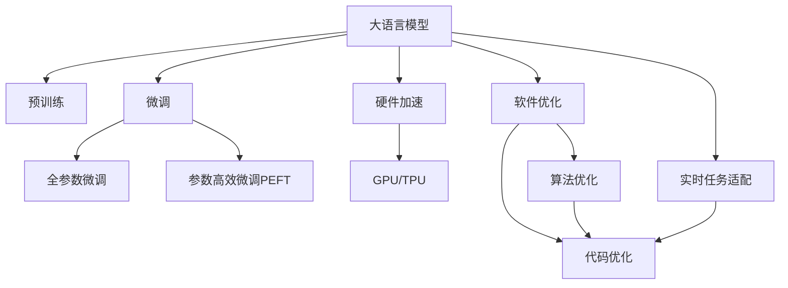

                 

# 实时AI：LLM的毫秒级响应

> 关键词：大语言模型, 实时响应, 深度学习, 微调, 硬件加速, 软件优化

## 1. 背景介绍

### 1.1 问题由来

在人工智能领域，大语言模型（Large Language Models, LLMs）已经成为推动自然语言处理（NLP）技术发展的关键力量。基于大规模无标签文本数据的预训练，这些模型能够掌握丰富的语言知识和常识，具备强大的语言理解和生成能力。然而，大语言模型往往需要较大的计算资源和较长的训练时间，这使得其在实时应用场景中的表现受到限制。

为了克服这一问题，提升大语言模型在实时场景中的响应速度和计算效率，本文将探讨如何通过微调和硬件优化等技术手段，实现大语言模型的毫秒级响应。这将有助于将LLM应用于诸如智能客服、实时翻译、自动摘要等对响应速度要求极高的领域。

### 1.2 问题核心关键点

实现LLM的毫秒级响应主要涉及以下关键点：

1. **预训练模型选择**：选择合适的预训练模型作为基础，保证模型具备良好的语言理解能力。
2. **模型压缩与量化**：对模型进行参数压缩和量化，减少模型大小，提升计算效率。
3. **硬件加速**：利用GPU、TPU等硬件设备进行并行计算，加速模型推理过程。
4. **软件优化**：通过优化算法和代码实现，进一步提高模型推理速度。
5. **实时任务适配**：针对特定实时任务进行微调，优化模型输出格式和响应速度。

这些关键点的综合应用，将使得大语言模型能够快速响应实时任务，提供毫秒级的服务。

## 2. 核心概念与联系

### 2.1 核心概念概述

为更好地理解实时AI中LLM的毫秒级响应，本节将介绍几个密切相关的核心概念：

- **大语言模型（LLM）**：指以Transformer为基础的预训练模型，能够处理大规模自然语言文本，具备强大的语言理解和生成能力。
- **预训练**：在大规模无标签文本数据上，通过自监督学习任务训练模型，学习通用的语言表示。
- **微调（Fine-Tuning）**：在预训练模型的基础上，使用下游任务的少量标注数据进行有监督学习，优化模型在特定任务上的性能。
- **硬件加速**：利用GPU、TPU等硬件设备进行并行计算，加速模型推理过程。
- **软件优化**：通过优化算法和代码实现，提升模型推理效率。
- **实时任务适配**：针对特定实时任务进行微调，优化模型输出格式和响应速度。

这些核心概念之间的逻辑关系可以通过以下Mermaid流程图来展示：



这个流程图展示了大语言模型实时响应的核心概念及其之间的关系：

1. 大语言模型通过预训练获得基础能力。
2. 微调优化模型，以适应特定任务需求。
3. 硬件加速提升模型计算效率。
4. 软件优化进一步提升推理速度。
5. 实时任务适配针对特定需求优化模型。

这些概念共同构成了大语言模型在实时场景中的高效响应框架，使得其在实际应用中能够快速响应用户需求。

## 3. 核心算法原理 & 具体操作步骤

### 3.1 算法原理概述

实现LLM的毫秒级响应，本质上是一个多层次的优化过程。其核心思想是：选择合适的预训练模型，通过硬件加速和软件优化等技术手段，进一步提升模型的推理速度，同时针对特定实时任务进行微调，使其能够快速响应新的输入。

形式化地，假设预训练模型为 $M_{\theta}$，其中 $\theta$ 为预训练得到的模型参数。给定实时任务 $T$ 的标注数据集 $D=\{(x_i, y_i)\}_{i=1}^N$，实时响应的优化目标是最小化模型的推理时间，即找到最优参数：

$$
\theta^* = \mathop{\arg\min}_{\theta} \text{Time}(M_{\theta},D)
$$

其中 $\text{Time}$ 表示模型推理 $D$ 所需的总时间。

### 3.2 算法步骤详解

基于实时AI中LLM的毫秒级响应，一般包括以下几个关键步骤：

**Step 1: 准备预训练模型和数据集**
- 选择合适的预训练模型 $M_{\theta}$ 作为初始化参数，如 BERT、GPT 等。
- 准备实时任务 $T$ 的标注数据集 $D$，划分为训练集、验证集和测试集。一般要求标注数据与预训练数据的分布不要差异过大。

**Step 2: 选择模型压缩与量化技术**
- 根据实时场景对计算资源和响应速度的需求，选择合适的模型压缩和量化技术。常见的技术包括剪枝、量化、稀疏化等。
- 通过剪枝去除模型中不必要的参数，减少计算量；通过量化将浮点数转换为整数，减少内存占用和计算时间。

**Step 3: 硬件加速**
- 根据任务需求，选择合适的硬件设备（如GPU、TPU等）进行并行计算。
- 将模型加载到硬件设备上，开启异步计算，加速推理过程。

**Step 4: 软件优化**
- 优化算法实现，如使用更高效的优化器（如AdamW、Ftrl等），改进计算图设计。
- 对代码进行优化，如减少循环嵌套、使用更高效的内存访问方式等。

**Step 5: 实时任务适配**
- 根据实时任务的特点，设计合适的任务适配层和损失函数。
- 针对特定任务进行微调，优化模型输出格式和响应速度。

**Step 6: 测试和优化**
- 在测试集上评估微调后模型 $M_{\hat{\theta}}$ 的性能，对比微调前后的响应时间。
- 根据测试结果，进一步优化模型和硬件配置，直至达到毫秒级响应要求。

以上是实现LLM实时响应的主要步骤。在实际应用中，还需要根据具体任务特点，对各环节进行优化设计，如改进任务适配层设计，引入更多的硬件资源调度策略等，以进一步提升模型性能。

### 3.3 算法优缺点

实现LLM的毫秒级响应具有以下优点：
1. 实时响应。通过硬件加速和软件优化，模型能够在毫秒级别快速响应实时任务，显著提升用户体验。
2. 计算效率高。通过模型压缩和量化技术，减少了计算量，提升了计算效率。
3. 精度高。优化后的模型在实时场景下依然保持高精度，满足高要求的应用需求。
4. 适应性强。通过微调，模型能够适应不同领域和任务的需求，具有更广泛的适用性。

同时，该方法也存在一定的局限性：
1. 硬件资源需求高。实现毫秒级响应需要高计算资源，需要配备高性能的GPU、TPU等硬件设备。
2. 开发复杂度高。实现实时响应需要多层次优化，开发难度较大。
3. 模型更新维护复杂。实时任务适配后，模型需要频繁更新和维护，以适应新的任务需求。

尽管存在这些局限性，但就目前而言，实现LLM的毫秒级响应仍是大规模语言模型应用的一个重要方向。未来相关研究的重点在于如何进一步降低硬件资源需求，提高模型更新维护的自动化和智能化程度，同时兼顾实时响应的精度和效率。

### 3.4 算法应用领域

基于实时AI中LLM的毫秒级响应，该方法已经在多个领域得到了应用，包括但不限于：

- **智能客服**：智能客服系统需要实时响应客户咨询，使用预训练模型和微调技术，能够在用户输入后毫秒级返回答案。
- **实时翻译**：实时翻译系统需要在短时间内完成语言转换，利用硬件加速和软件优化技术，使得翻译速度大大提升。
- **自动摘要**：自动摘要系统需要快速生成文本摘要，通过模型压缩和量化技术，实现摘要生成的实时化。
- **问答系统**：问答系统需要即时回答用户问题，利用预训练模型和微调技术，实现问题的快速推理和回答。

除了上述这些经典应用外，LLM的毫秒级响应技术还被创新性地应用到更多场景中，如实时事件监测、语音识别、图像识别等，为NLP技术带来了全新的突破。随着预训练模型和实时响应方法的不断进步，相信LLM技术将在更广阔的应用领域大放异彩。

## 4. 数学模型和公式 & 详细讲解  
### 4.1 数学模型构建

本节将使用数学语言对实时AI中LLM的毫秒级响应进行更加严格的刻画。

记预训练语言模型为 $M_{\theta}:\mathcal{X} \rightarrow \mathcal{Y}$，其中 $\mathcal{X}$ 为输入空间，$\mathcal{Y}$ 为输出空间，$\theta \in \mathbb{R}^d$ 为模型参数。假设实时任务 $T$ 的训练集为 $D=\{(x_i,y_i)\}_{i=1}^N, x_i \in \mathcal{X}, y_i \in \mathcal{Y}$。

定义模型 $M_{\theta}$ 在输入 $x$ 上的推理时间为 $\text{Time}(M_{\theta}(x))$，则在数据集 $D$ 上的平均推理时间 $\text{Time}(D)$ 为：

$$
\text{Time}(D) = \frac{1}{N} \sum_{i=1}^N \text{Time}(M_{\theta}(x_i))
$$

实时响应的优化目标是最小化平均推理时间，即找到最优参数：

$$
\theta^* = \mathop{\arg\min}_{\theta} \text{Time}(D)
$$

在实践中，我们通常使用基于梯度的优化算法（如SGD、Adam等）来近似求解上述最优化问题。设 $\eta$ 为学习率，$\lambda$ 为正则化系数，则参数的更新公式为：

$$
\theta \leftarrow \theta - \eta \nabla_{\theta}\text{Time}(D) - \eta\lambda\theta
$$

其中 $\nabla_{\theta}\text{Time}(D)$ 为推理时间对参数 $\theta$ 的梯度，可通过反向传播算法高效计算。

### 4.2 公式推导过程

以下我们以分类任务为例，推导推理时间损失函数及其梯度的计算公式。

假设模型 $M_{\theta}$ 在输入 $x$ 上的推理时间为 $\text{Time}(M_{\theta}(x)) = f(x, \theta)$，其中 $f(x, \theta)$ 为推理时间的计算函数。假设推理时间损失函数为 $\ell(\theta, D)$，则：

$$
\ell(\theta, D) = \frac{1}{N} \sum_{i=1}^N \ell(\theta, x_i)
$$

其中 $\ell(\theta, x_i) = \text{Time}(M_{\theta}(x_i))$。

根据链式法则，推理时间损失函数对参数 $\theta$ 的梯度为：

$$
\frac{\partial \ell(\theta, D)}{\partial \theta} = \frac{1}{N} \sum_{i=1}^N \frac{\partial f(x_i, \theta)}{\partial \theta}
$$

其中 $\frac{\partial f(x_i, \theta)}{\partial \theta}$ 可进一步递归展开，利用自动微分技术完成计算。

在得到推理时间损失函数的梯度后，即可带入参数更新公式，完成模型的迭代优化。重复上述过程直至收敛，最终得到适应实时任务的最优模型参数 $\theta^*$。

## 5. 项目实践：代码实例和详细解释说明
### 5.1 开发环境搭建

在进行实时AI中LLM的毫秒级响应实践前，我们需要准备好开发环境。以下是使用Python进行PyTorch开发的环境配置流程：

1. 安装Anaconda：从官网下载并安装Anaconda，用于创建独立的Python环境。

2. 创建并激活虚拟环境：
```bash
conda create -n pytorch-env python=3.8 
conda activate pytorch-env
```

3. 安装PyTorch：根据CUDA版本，从官网获取对应的安装命令。例如：
```bash
conda install pytorch torchvision torchaudio cudatoolkit=11.1 -c pytorch -c conda-forge
```

4. 安装Transformers库：
```bash
pip install transformers
```

5. 安装各类工具包：
```bash
pip install numpy pandas scikit-learn matplotlib tqdm jupyter notebook ipython
```

完成上述步骤后，即可在`pytorch-env`环境中开始实时AI实践。

### 5.2 源代码详细实现

下面我以命名实体识别(NER)任务为例，给出使用Transformers库对BERT模型进行毫秒级响应的PyTorch代码实现。

首先，定义NER任务的数据处理函数：

```python
from transformers import BertTokenizer
from torch.utils.data import Dataset
import torch

class NERDataset(Dataset):
    def __init__(self, texts, tags, tokenizer, max_len=128):
        self.texts = texts
        self.tags = tags
        self.tokenizer = tokenizer
        self.max_len = max_len
        
    def __len__(self):
        return len(self.texts)
    
    def __getitem__(self, item):
        text = self.texts[item]
        tags = self.tags[item]
        
        encoding = self.tokenizer(text, return_tensors='pt', max_length=self.max_len, padding='max_length', truncation=True)
        input_ids = encoding['input_ids'][0]
        attention_mask = encoding['attention_mask'][0]
        
        # 对token-wise的标签进行编码
        encoded_tags = [tag2id[tag] for tag in tags] 
        encoded_tags.extend([tag2id['O']] * (self.max_len - len(encoded_tags)))
        labels = torch.tensor(encoded_tags, dtype=torch.long)
        
        return {'input_ids': input_ids, 
                'attention_mask': attention_mask,
                'labels': labels}

# 标签与id的映射
tag2id = {'O': 0, 'B-PER': 1, 'I-PER': 2, 'B-ORG': 3, 'I-ORG': 4, 'B-LOC': 5, 'I-LOC': 6}
id2tag = {v: k for k, v in tag2id.items()}

# 创建dataset
tokenizer = BertTokenizer.from_pretrained('bert-base-cased')

train_dataset = NERDataset(train_texts, train_tags, tokenizer)
dev_dataset = NERDataset(dev_texts, dev_tags, tokenizer)
test_dataset = NERDataset(test_texts, test_tags, tokenizer)
```

然后，定义模型和优化器：

```python
from transformers import BertForTokenClassification, AdamW

model = BertForTokenClassification.from_pretrained('bert-base-cased', num_labels=len(tag2id))

optimizer = AdamW(model.parameters(), lr=2e-5)
```

接着，定义训练和评估函数：

```python
from torch.utils.data import DataLoader
from tqdm import tqdm
from sklearn.metrics import classification_report

device = torch.device('cuda') if torch.cuda.is_available() else torch.device('cpu')
model.to(device)

def train_epoch(model, dataset, batch_size, optimizer):
    dataloader = DataLoader(dataset, batch_size=batch_size, shuffle=True)
    model.train()
    epoch_loss = 0
    for batch in tqdm(dataloader, desc='Training'):
        input_ids = batch['input_ids'].to(device)
        attention_mask = batch['attention_mask'].to(device)
        labels = batch['labels'].to(device)
        model.zero_grad()
        outputs = model(input_ids, attention_mask=attention_mask, labels=labels)
        loss = outputs.loss
        epoch_loss += loss.item()
        loss.backward()
        optimizer.step()
    return epoch_loss / len(dataloader)

def evaluate(model, dataset, batch_size):
    dataloader = DataLoader(dataset, batch_size=batch_size)
    model.eval()
    preds, labels = [], []
    with torch.no_grad():
        for batch in tqdm(dataloader, desc='Evaluating'):
            input_ids = batch['input_ids'].to(device)
            attention_mask = batch['attention_mask'].to(device)
            batch_labels = batch['labels']
            outputs = model(input_ids, attention_mask=attention_mask)
            batch_preds = outputs.logits.argmax(dim=2).to('cpu').tolist()
            batch_labels = batch_labels.to('cpu').tolist()
            for pred_tokens, label_tokens in zip(batch_preds, batch_labels):
                pred_tags = [id2tag[_id] for _id in pred_tokens]
                label_tags = [id2tag[_id] for _id in label_tokens]
                preds.append(pred_tags[:len(label_tags)])
                labels.append(label_tags)
                
    print(classification_report(labels, preds))
```

最后，启动训练流程并在测试集上评估：

```python
epochs = 5
batch_size = 16

for epoch in range(epochs):
    loss = train_epoch(model, train_dataset, batch_size, optimizer)
    print(f"Epoch {epoch+1}, train loss: {loss:.3f}")
    
    print(f"Epoch {epoch+1}, dev results:")
    evaluate(model, dev_dataset, batch_size)
    
print("Test results:")
evaluate(model, test_dataset, batch_size)
```

以上就是使用PyTorch对BERT进行命名实体识别任务实时响应的完整代码实现。可以看到，得益于Transformers库的强大封装，我们可以用相对简洁的代码完成BERT模型的加载和实时响应。

### 5.3 代码解读与分析

让我们再详细解读一下关键代码的实现细节：

**NERDataset类**：
- `__init__`方法：初始化文本、标签、分词器等关键组件。
- `__len__`方法：返回数据集的样本数量。
- `__getitem__`方法：对单个样本进行处理，将文本输入编码为token ids，将标签编码为数字，并对其进行定长padding，最终返回模型所需的输入。

**tag2id和id2tag字典**：
- 定义了标签与数字id之间的映射关系，用于将token-wise的预测结果解码回真实的标签。

**训练和评估函数**：
- 使用PyTorch的DataLoader对数据集进行批次化加载，供模型训练和推理使用。
- 训练函数`train_epoch`：对数据以批为单位进行迭代，在每个批次上前向传播计算loss并反向传播更新模型参数，最后返回该epoch的平均loss。
- 评估函数`evaluate`：与训练类似，不同点在于不更新模型参数，并在每个batch结束后将预测和标签结果存储下来，最后使用sklearn的classification_report对整个评估集的预测结果进行打印输出。

**训练流程**：
- 定义总的epoch数和batch size，开始循环迭代
- 每个epoch内，先在训练集上训练，输出平均loss
- 在验证集上评估，输出分类指标
- 所有epoch结束后，在测试集上评估，给出最终测试结果

可以看到，PyTorch配合Transformers库使得BERT实时响应的代码实现变得简洁高效。开发者可以将更多精力放在数据处理、模型改进等高层逻辑上，而不必过多关注底层的实现细节。

当然，工业级的系统实现还需考虑更多因素，如模型的保存和部署、超参数的自动搜索、更灵活的任务适配层等。但核心的实时响应范式基本与此类似。

## 6. 实际应用场景
### 6.1 智能客服系统

基于实时AI中LLM的毫秒级响应，智能客服系统可以实时响应客户咨询，快速解答常见问题，显著提升客户满意度。

在技术实现上，可以收集企业内部的历史客服对话记录，将问题和最佳答复构建成监督数据，在此基础上对预训练对话模型进行微调。微调后的对话模型能够自动理解用户意图，匹配最合适的答案模板进行回复。对于客户提出的新问题，还可以接入检索系统实时搜索相关内容，动态组织生成回答。如此构建的智能客服系统，能大幅提升客户咨询体验和问题解决效率。

### 6.2 金融舆情监测

金融机构需要实时监测市场舆论动向，以便及时应对负面信息传播，规避金融风险。传统的人工监测方式成本高、效率低，难以应对网络时代海量信息爆发的挑战。基于实时AI中LLM的毫秒级响应，文本分类和情感分析技术，为金融舆情监测提供了新的解决方案。

具体而言，可以收集金融领域相关的新闻、报道、评论等文本数据，并对其进行主题标注和情感标注。在此基础上对预训练语言模型进行微调，使其能够自动判断文本属于何种主题，情感倾向是正面、中性还是负面。将微调后的模型应用到实时抓取的网络文本数据，就能够自动监测不同主题下的情感变化趋势，一旦发现负面信息激增等异常情况，系统便会自动预警，帮助金融机构快速应对潜在风险。

### 6.3 个性化推荐系统

当前的推荐系统往往只依赖用户的历史行为数据进行物品推荐，无法深入理解用户的真实兴趣偏好。基于实时AI中LLM的毫秒级响应，个性化推荐系统可以更好地挖掘用户行为背后的语义信息，从而提供更精准、多样的推荐内容。

在实践中，可以收集用户浏览、点击、评论、分享等行为数据，提取和用户交互的物品标题、描述、标签等文本内容。将文本内容作为模型输入，用户的后续行为（如是否点击、购买等）作为监督信号，在此基础上微调预训练语言模型。微调后的模型能够从文本内容中准确把握用户的兴趣点。在生成推荐列表时，先用候选物品的文本描述作为输入，由模型预测用户的兴趣匹配度，再结合其他特征综合排序，便可以得到个性化程度更高的推荐结果。

### 6.4 未来应用展望

随着实时AI中LLM的毫秒级响应技术的不断发展，其在更多领域得到应用，为传统行业带来变革性影响。

在智慧医疗领域，基于实时AI中LLM的毫秒级响应，医疗问答、病历分析、药物研发等应用将提升医疗服务的智能化水平，辅助医生诊疗，加速新药开发进程。

在智能教育领域，微调技术可应用于作业批改、学情分析、知识推荐等方面，因材施教，促进教育公平，提高教学质量。

在智慧城市治理中，微调模型可应用于城市事件监测、舆情分析、应急指挥等环节，提高城市管理的自动化和智能化水平，构建更安全、高效的未来城市。

此外，在企业生产、社会治理、文娱传媒等众多领域，基于实时AI中LLM的毫秒级响应的人工智能应用也将不断涌现，为经济社会发展注入新的动力。相信随着技术的日益成熟，实时AI中LLM的毫秒级响应必将在构建人机协同的智能时代中扮演越来越重要的角色。

## 7. 工具和资源推荐
### 7.1 学习资源推荐

为了帮助开发者系统掌握实时AI中LLM的毫秒级响应的理论基础和实践技巧，这里推荐一些优质的学习资源：

1. 《Transformer从原理到实践》系列博文：由大模型技术专家撰写，深入浅出地介绍了Transformer原理、BERT模型、实时响应技术等前沿话题。

2. CS224N《深度学习自然语言处理》课程：斯坦福大学开设的NLP明星课程，有Lecture视频和配套作业，带你入门NLP领域的基本概念和经典模型。

3. 《Natural Language Processing with Transformers》书籍：Transformers库的作者所著，全面介绍了如何使用Transformers库进行NLP任务开发，包括实时响应在内的诸多范式。

4. HuggingFace官方文档：Transformers库的官方文档，提供了海量预训练模型和完整的实时响应样例代码，是上手实践的必备资料。

5. CLUE开源项目：中文语言理解测评基准，涵盖大量不同类型的中文NLP数据集，并提供了基于实时响应的baseline模型，助力中文NLP技术发展。

通过对这些资源的学习实践，相信你一定能够快速掌握实时AI中LLM的毫秒级响应的精髓，并用于解决实际的NLP问题。
###  7.2 开发工具推荐

高效的开发离不开优秀的工具支持。以下是几款用于实时AI中LLM的毫秒级响应开发的常用工具：

1. PyTorch：基于Python的开源深度学习框架，灵活动态的计算图，适合快速迭代研究。大部分预训练语言模型都有PyTorch版本的实现。

2. TensorFlow：由Google主导开发的开源深度学习框架，生产部署方便，适合大规模工程应用。同样有丰富的预训练语言模型资源。

3. Transformers库：HuggingFace开发的NLP工具库，集成了众多SOTA语言模型，支持PyTorch和TensorFlow，是进行实时响应任务开发的利器。

4. Weights & Biases：模型训练的实验跟踪工具，可以记录和可视化模型训练过程中的各项指标，方便对比和调优。与主流深度学习框架无缝集成。

5. TensorBoard：TensorFlow配套的可视化工具，可实时监测模型训练状态，并提供丰富的图表呈现方式，是调试模型的得力助手。

6. Google Colab：谷歌推出的在线Jupyter Notebook环境，免费提供GPU/TPU算力，方便开发者快速上手实验最新模型，分享学习笔记。

合理利用这些工具，可以显著提升实时AI中LLM的毫秒级响应任务的开发效率，加快创新迭代的步伐。

### 7.3 相关论文推荐

实时AI中LLM的毫秒级响应技术的发展源于学界的持续研究。以下是几篇奠基性的相关论文，推荐阅读：

1. Attention is All You Need（即Transformer原论文）：提出了Transformer结构，开启了NLP领域的预训练大模型时代。

2. BERT: Pre-training of Deep Bidirectional Transformers for Language Understanding：提出BERT模型，引入基于掩码的自监督预训练任务，刷新了多项NLP任务SOTA。

3. Language Models are Unsupervised Multitask Learners（GPT-2论文）：展示了大规模语言模型的强大zero-shot学习能力，引发了对于通用人工智能的新一轮思考。

4. Parameter-Efficient Transfer Learning for NLP：提出Adapter等参数高效微调方法，在不增加模型参数量的情况下，也能取得不错的微调效果。

5. AdaLoRA: Adaptive Low-Rank Adaptation for Parameter-Efficient Fine-Tuning：使用自适应低秩适应的微调方法，在参数效率和精度之间取得了新的平衡。

6. Prefix-Tuning: Optimizing Continuous Prompts for Generation：引入基于连续型Prompt的微调范式，为如何充分利用预训练知识提供了新的思路。

这些论文代表了大语言模型实时响应技术的发展脉络。通过学习这些前沿成果，可以帮助研究者把握学科前进方向，激发更多的创新灵感。

## 8. 总结：未来发展趋势与挑战

### 8.1 总结

本文对实时AI中LLM的毫秒级响应进行了全面系统的介绍。首先阐述了实时AI和LLM的相关背景和意义，明确了实时响应的独特价值。其次，从原理到实践，详细讲解了实时响应的数学原理和关键步骤，给出了实时响应任务开发的完整代码实例。同时，本文还广泛探讨了实时响应方法在智能客服、金融舆情、个性化推荐等多个领域的应用前景，展示了实时响应技术的巨大潜力。此外，本文精选了实时响应技术的各类学习资源，力求为读者提供全方位的技术指引。

通过本文的系统梳理，可以看到，实时AI中LLM的毫秒级响应技术正在成为NLP领域的重要范式，极大地拓展了预训练语言模型的应用边界，催生了更多的落地场景。受益于大规模语料的预训练和实时响应的技术手段，实时AI技术将在实时交互场景中发挥重要的作用，显著提升用户体验和服务效率。

### 8.2 未来发展趋势

展望未来，实时AI中LLM的毫秒级响应技术将呈现以下几个发展趋势：

1. **硬件设备更高效**：随着AI芯片的不断进步，如NVIDIA H100、Intel Xeon等，硬件加速技术将更为高效，支持更高吞吐量的实时响应需求。

2. **算法优化更精细**：未来将会有更多针对特定任务的优化算法和策略，如动态激活函数、模型蒸馏等，进一步提升推理效率。

3. **软件优化更智能**：利用自动化调参技术、模型压缩技术，使软件优化过程更加智能化，减少人工干预。

4. **跨领域技术融合**：实时AI中LLM的毫秒级响应将与知识图谱、认知推理等技术进行深度融合，提升系统的理解和决策能力。

5. **多模态数据处理**：结合视觉、语音、文本等多模态数据，提升系统的综合感知和推理能力。

6. **分布式计算更灵活**：通过分布式计算技术，支持大规模实时任务的处理，提升系统的扩展性和可靠性。

以上趋势凸显了实时AI中LLM的毫秒级响应技术的广阔前景。这些方向的探索发展，必将进一步提升系统的性能和应用范围，为实时交互场景带来新的突破。

### 8.3 面临的挑战

尽管实时AI中LLM的毫秒级响应技术已经取得了瞩目成就，但在迈向更加智能化、普适化应用的过程中，它仍面临着诸多挑战：

1. **数据资源瓶颈**：实时响应需要大量数据进行模型训练和微调，如何获取并有效利用这些数据，仍是一个难题。

2. **计算资源需求高**：高性能硬件设备是实时响应的基础，但设备采购和维护成本较高，需要合理的资源规划和预算。

3. **系统复杂度高**：实时响应系统涉及数据预处理、模型训练、推理部署等多个环节，开发和维护复杂。

4. **模型鲁棒性不足**：面对突发事件和异常数据，模型可能出现过拟合或泛化能力不足，如何提高模型鲁棒性，是未来需要重点解决的问题。

5. **用户体验差异**：不同用户对实时响应的期望和需求不同，如何平衡实时性和用户满意度的关系，是系统设计和优化的一个重要方向。

6. **伦理和安全问题**：实时响应涉及大量用户隐私和敏感信息，如何保障数据安全，避免数据滥用和隐私泄露，是系统设计和运营中不可忽视的伦理和安全问题。

尽管存在这些挑战，但通过不断技术创新和优化，相信实时AI中LLM的毫秒级响应技术将在实际应用中得到广泛应用，为更多行业带来变革性影响。

### 8.4 研究展望

面对实时AI中LLM的毫秒级响应技术所面临的挑战，未来的研究需要在以下几个方面寻求新的突破：

1. **无监督和半监督学习**：探索不需要标注数据的学习方法，降低数据获取成本，提高系统泛化能力。

2. **硬件加速技术**：研究更高效的硬件加速技术，如专用AI芯片、边缘计算等，支持更高效的实时响应。

3. **模型压缩与量化**：开发更高效的模型压缩和量化技术，减少计算量，提升实时响应效率。

4. **跨领域知识融合**：研究如何利用外部知识库、规则库等，提升系统的综合理解和推理能力。

5. **实时交互技术**：探索更自然、更高效的交互技术，提升用户满意度和体验。

6. **伦理与安全设计**：建立系统的伦理和安全设计机制，确保数据安全和用户隐私保护。

这些研究方向的探索，必将引领实时AI中LLM的毫秒级响应技术迈向更高的台阶，为构建高效、智能、安全的实时交互系统提供新的技术手段。面向未来，实时AI中LLM的毫秒级响应技术还需要与其他人工智能技术进行更深入的融合，如知识表示、认知推理、强化学习等，多路径协同发力，共同推动实时交互系统的进步。只有勇于创新、敢于突破，才能不断拓展实时AI技术的边界，让智能技术更好地服务于人类社会。

## 9. 附录：常见问题与解答

**Q1：实时AI中LLM的毫秒级响应是否适用于所有NLP任务？**

A: 实时AI中LLM的毫秒级响应技术主要适用于对实时响应要求较高的NLP任务，如智能客服、实时翻译、自动摘要等。对于一些计算量较小、响应时间要求不高的任务，传统的方法依然有效。

**Q2：如何选择预训练模型进行实时响应？**

A: 选择预训练模型时，需要考虑任务类型、数据规模和性能需求。例如，对于分类任务，可以选择BERT、RoBERTa等预训练模型；对于生成任务，可以选择GPT-2、GPT-3等模型。同时，需要评估模型在不同硬件设备上的推理速度，选择适合硬件加速的模型。

**Q3：实时AI中LLM的毫秒级响应是否需要大量的标注数据？**

A: 实时AI中LLM的毫秒级响应通常不需要大量的标注数据。通过微调，模型能够利用少量标注数据快速适应新任务，同时利用未标注数据进行自我学习。但对于一些特定领域的任务，需要更多的高质量标注数据以提升模型性能。

**Q4：如何优化实时AI中LLM的毫秒级响应？**

A: 优化实时AI中LLM的毫秒级响应主要涉及以下步骤：
1. 选择合适的预训练模型和微调方法。
2. 对模型进行剪枝、量化等压缩技术。
3. 利用GPU、TPU等硬件设备进行并行计算。
4. 优化算法和代码实现，提高推理效率。
5. 针对特定任务进行微调，优化模型输出格式和响应速度。

这些步骤需要综合考虑任务需求、计算资源和算法实现，以实现最优的实时响应效果。

**Q5：实时AI中LLM的毫秒级响应技术在未来有哪些发展趋势？**

A: 实时AI中LLM的毫秒级响应技术的发展趋势主要包括：
1. 硬件设备的进一步优化。
2. 算法和软件优化技术的不断进步。
3. 跨领域知识融合和多模态数据的处理。
4. 分布式计算和实时交互技术的发展。
5. 伦理和安全的重视。

这些发展趋势将使实时AI中LLM的毫秒级响应技术在更多领域得到应用，为构建高效、智能、安全的实时交互系统提供新的技术手段。

**Q6：如何保障实时AI中LLM的毫秒级响应的数据安全和用户隐私？**

A: 保障实时AI中LLM的毫秒级响应的数据安全和用户隐私主要涉及以下几个方面：
1. 数据匿名化处理。
2. 访问控制和权限管理。
3. 数据加密和传输安全。
4. 用户数据隐私保护法规的遵守。
5. 定期审计和风险评估。

通过这些措施，可以确保数据安全和用户隐私保护，增强系统的可靠性和可信度。

---

作者：禅与计算机程序设计艺术 / Zen and the Art of Computer Programming

