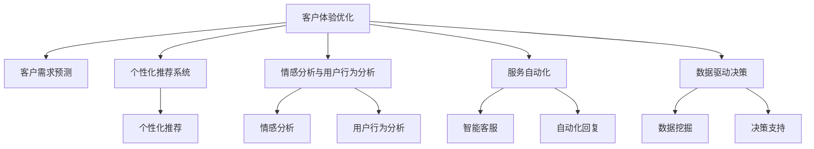

                 

# 客户体验优化：人类计算在商业中的应用

> 关键词：客户体验优化, 人类计算, 商业应用, 人工智能, 机器学习, 数据驱动, 情感分析, 预测模型, 个性化推荐, 用户行为分析

## 1. 背景介绍

### 1.1 问题由来

在数字化和信息化快速发展的今天，客户体验（Customer Experience, CX）已经成为衡量企业竞争力的关键指标。优质的客户体验不仅能够提升品牌形象，还能直接转化成订单和客户忠诚度，为企业的可持续发展奠定坚实基础。然而，构建高效的客户体验系统是一项复杂且多维度的工程，涉及到客户需求的精准把握、产品设计的合理性、服务的及时性与友好度等多个方面。

目前，多数企业对于客户体验的管理和优化还停留在传统的抽样调查、定性分析、人工处理等环节，存在数据获取成本高、分析效率低、结果准确性差等问题。随着大数据和人工智能技术的发展，借助先进技术手段，企业有望实现更精准的客户行为预测、更智能的个性化推荐、更高效的服务响应，从而提升客户满意度，增强市场竞争力。

### 1.2 问题核心关键点

本文将深入探讨如何利用人工智能（AI）技术，尤其是人类计算（Human Computation），来优化客户体验管理。核心关键点包括：

1. 客户需求精准预测：通过对历史数据和客户行为进行深度学习，构建预测模型，准确把握客户需求。
2. 个性化推荐系统：通过机器学习算法，实现个性化推荐，满足客户多样化需求。
3. 情感分析与用户行为分析：利用自然语言处理（NLP）和图像识别技术，分析客户情感倾向，揭示用户行为模式，提升客户体验。
4. 服务自动化与智能化：采用智能客服、自动化回复等技术，提升服务响应速度和质量。
5. 数据驱动决策：利用大数据分析，为管理层提供客户行为趋势、市场机会等决策支持。

本文旨在通过详细解析这些关键点，为优化客户体验提供理论和实践指导。

## 2. 核心概念与联系

### 2.1 核心概念概述

为更好地理解人类计算在客户体验优化中的应用，本节将介绍几个密切相关的核心概念：

- 客户体验（Customer Experience, CX）：指客户在接触企业产品或服务过程中，产生的所有感官、情感和认知体验。优化CX可以显著提升客户满意度和忠诚度，为企业带来长远收益。

- 人类计算（Human Computation）：通过普通用户的参与，协同计算任务。例如，众包、众测、用户生成内容等，可以在大规模数据处理和复杂问题求解中发挥作用。

- 预测模型（Prediction Model）：利用历史数据和机器学习算法，对未来事件进行预测的模型。如客户需求预测、个性化推荐系统等。

- 个性化推荐系统（Personalized Recommendation System）：通过用户行为和兴趣进行建模，推荐符合其喜好的商品、服务或内容。

- 情感分析（Sentiment Analysis）：通过自然语言处理技术，识别和提取客户对产品或服务的情感倾向。

- 用户行为分析（User Behavior Analysis）：通过分析用户行为数据，揭示其潜在需求和消费模式，为营销策略制定提供依据。

- 服务自动化（Service Automation）：通过AI技术，自动完成客户服务流程，提升响应速度和质量。

- 数据驱动决策（Data-Driven Decision Making）：利用大数据分析，辅助管理层进行科学决策。

这些概念之间的逻辑关系可以通过以下Mermaid流程图来展示：



这个流程图展示了一个客户体验优化系统的整体架构：

1. 客户体验优化以客户需求预测、个性化推荐系统、情感分析、用户行为分析等为核心技术支撑。
2. 这些技术通过协同作用，构建智能客服、自动化回复等服务自动化模块。
3. 最终通过数据挖掘和决策支持，辅助管理层进行科学决策，优化客户体验。

## 3. 核心算法原理 & 具体操作步骤
### 3.1 算法原理概述

人类计算在客户体验优化中的应用，本质上是一种数据驱动、模型驱动的智能优化方法。其核心思想是：

1. 收集和分析大量客户数据，挖掘客户需求和行为模式。
2. 利用机器学习算法，构建预测模型和推荐算法。
3. 借助自然语言处理和计算机视觉技术，进行情感分析和用户行为分析。
4. 通过自动化技术，实现客户服务流程的智能化。
5. 利用大数据分析，为决策提供支持。

具体的算法原理包括以下几个方面：

1. 数据预处理：通过数据清洗、特征工程等手段，为后续建模和分析提供干净、高效的数据集。
2. 机器学习算法：如线性回归、决策树、随机森林、神经网络等，用于构建预测模型和推荐算法。
3. 自然语言处理：利用NLP技术，对文本数据进行情感分析、实体识别等处理。
4. 计算机视觉：通过图像识别技术，解析用户上传的图片和视频内容，提取有用信息。
5. 强化学习：用于智能客服、自动化回复等场景，优化系统响应策略。
6. 数据驱动分析：利用大数据分析技术，如聚类分析、关联规则挖掘等，揭示客户行为模式和市场趋势。

### 3.2 算法步骤详解

人类计算在客户体验优化中的操作步骤通常包括以下几个步骤：

**Step 1: 数据收集与预处理**
- 收集客户互动数据，包括浏览记录、购买历史、评价反馈等。
- 对数据进行清洗、去重、归一化等预处理，确保数据质量。
- 进行特征提取，生成对建模有用的特征向量。

**Step 2: 模型训练与优化**
- 选择合适的机器学习算法，如随机森林、梯度提升树、深度神经网络等。
- 使用历史数据训练模型，并通过交叉验证、调参等手段，优化模型性能。
- 使用梯度下降等优化算法，更新模型参数，最小化损失函数。

**Step 3: 情感分析与用户行为分析**
- 对客户评价、评论等文本数据，进行情感分析，识别情感倾向。
- 利用NLP技术，提取关键词、短语等，揭示用户需求和痛点。
- 对用户行为数据进行建模，识别行为模式，预测未来行为。

**Step 4: 个性化推荐系统**
- 通过协同过滤、基于内容的推荐、混合推荐等算法，生成个性化推荐列表。
- 根据用户反馈，不断更新推荐算法，优化推荐效果。
- 结合实时数据，动态调整推荐策略。

**Step 5: 服务自动化与智能客服**
- 通过自然语言处理技术，实现智能客服系统，自动处理客户咨询。
- 结合强化学习算法，优化客服回复策略，提升响应质量。
- 对客户反馈进行情感分析，及时调整服务策略。

**Step 6: 数据驱动决策**
- 利用大数据分析技术，提取有价值的信息，如客户流失率、市场趋势等。
- 通过可视化工具，展示分析结果，辅助管理层决策。
- 结合业务经验，制定策略，优化客户体验。

### 3.3 算法优缺点

人类计算在客户体验优化中的应用具有以下优点：

1. 高效处理大数据：人类计算能够充分利用普通用户的参与，快速处理海量数据，提升数据分析效率。
2. 模型准确性高：机器学习模型经过充分训练，可以准确预测客户需求，提供个性化推荐。
3. 实时响应：利用自然语言处理和计算机视觉技术，实现实时情感分析和用户行为分析。
4. 提升客户满意度：通过智能客服、自动化回复等技术，显著提升服务响应速度和质量。
5. 决策支持：数据驱动分析为管理层提供科学决策支持，优化客户体验。

然而，该方法也存在一定的局限性：

1. 数据质量依赖用户：数据质量很大程度上依赖用户参与的积极性和准确性，可能存在噪音和不完整数据。
2. 隐私和安全问题：用户数据隐私保护和数据安全是重要问题，需要严格的数据管理和监控。
3. 技术门槛高：需要一定的技术背景和资源支持，才能高效实现人类计算。
4. 算力要求高：大规模数据处理和复杂模型训练需要强大的计算资源支持。
5. 模型复杂度：模型构建和优化复杂，需要丰富的数据和经验积累。

尽管存在这些局限性，但人类计算在客户体验优化中的应用具有广阔的前景，尤其是在数据量巨大的场景中，其优势愈发明显。

### 3.4 算法应用领域

人类计算技术在客户体验优化的应用广泛，涵盖了以下领域：

1. 电商行业：通过客户行为分析，提供个性化推荐，提升转化率和满意度。
2. 金融行业：通过情感分析，识别风险预警信号，优化客户服务流程。
3. 医疗行业：通过用户行为数据，分析疾病趋势，提供健康管理建议。
4. 旅游行业：通过情感分析，优化旅游推荐系统，提升用户粘性。
5. 教育行业：通过学习分析，提供个性化学习路径，提升学习效果。
6. 物流行业：通过用户反馈分析，优化配送策略，提升服务质量。

## 4. 数学模型和公式 & 详细讲解 & 举例说明

### 4.1 数学模型构建

为更好地理解人类计算在客户体验优化中的应用，本节将构建数学模型，详细讲解其构建过程。

假设客户数据集为 $D=\{(x_i, y_i)\}_{i=1}^N$，其中 $x_i$ 为输入特征向量，$y_i$ 为输出标签。目标是为一个二分类问题，预测客户是否会购买某个产品，即 $y_i \in \{0,1\}$。

定义模型 $M_{\theta}$ 为随机森林模型，其中 $\theta$ 为模型参数。模型的预测输出为 $y'_i=M_{\theta}(x_i)$。

定义损失函数 $\ell$ 为交叉熵损失函数：

$$
\ell(M_{\theta}(x_i),y_i) = -[y_i\log y'_i + (1-y_i)\log (1-y'_i)]
$$

经验风险为：

$$
\mathcal{L}(\theta) = \frac{1}{N} \sum_{i=1}^N \ell(M_{\theta}(x_i),y_i)
$$

最小化损失函数，即可得到最优模型参数 $\theta^*$。

### 4.2 公式推导过程

以下我们以二分类问题为例，推导随机森林模型的损失函数及其梯度计算公式。

定义模型 $M_{\theta}$ 为随机森林模型，其中 $\theta$ 为模型参数。模型的预测输出为 $y'_i=M_{\theta}(x_i)$。

定义损失函数 $\ell$ 为交叉熵损失函数：

$$
\ell(M_{\theta}(x_i),y_i) = -[y_i\log y'_i + (1-y_i)\log (1-y'_i)]
$$

将其代入经验风险公式，得：

$$
\mathcal{L}(\theta) = -\frac{1}{N}\sum_{i=1}^N [y_i\log M_{\theta}(x_i)+(1-y_i)\log(1-M_{\theta}(x_i))]
$$

根据链式法则，损失函数对参数 $\theta$ 的梯度为：

$$
\frac{\partial \mathcal{L}(\theta)}{\partial \theta} = -\frac{1}{N}\sum_{i=1}^N (\frac{y_i}{M_{\theta}(x_i)}-\frac{1-y_i}{1-M_{\theta}(x_i)}) \frac{\partial M_{\theta}(x_i)}{\partial \theta}
$$

其中 $\frac{\partial M_{\theta}(x_i)}{\partial \theta}$ 可进一步递归展开，利用自动微分技术完成计算。

在得到损失函数的梯度后，即可带入参数更新公式，完成模型的迭代优化。重复上述过程直至收敛，最终得到适应客户体验优化的最优模型参数 $\theta^*$。

### 4.3 案例分析与讲解

假设某电商平台的客户数据集 $D=\{(x_i, y_i)\}_{i=1}^N$，其中 $x_i$ 为客户的浏览记录、购买历史、评价反馈等，$y_i$ 为客户是否购买某个产品。利用随机森林模型对客户购买行为进行预测。

首先，对数据进行预处理，清洗并归一化数据，提取特征向量 $x_i$。

然后，使用随机森林算法训练模型 $M_{\theta}$，通过交叉验证等手段优化模型参数。

最后，在验证集和测试集上评估模型性能，结合实时数据动态调整模型参数，实现个性化推荐。

通过此案例，可以看出人类计算在客户体验优化中的应用过程，即：数据收集与预处理、模型训练与优化、情感分析与用户行为分析、个性化推荐系统、服务自动化与智能客服、数据驱动决策。

## 5. 项目实践：代码实例和详细解释说明

### 5.1 开发环境搭建

在进行项目实践前，我们需要准备好开发环境。以下是使用Python进行Scikit-learn和TensorFlow开发的开发环境配置流程：

1. 安装Anaconda：从官网下载并安装Anaconda，用于创建独立的Python环境。

2. 创建并激活虚拟环境：
```bash
conda create -n sklearn-tf-env python=3.8 
conda activate sklearn-tf-env
```

3. 安装Scikit-learn和TensorFlow：根据CUDA版本，从官网获取对应的安装命令。例如：
```bash
conda install scikit-learn tensorboard tensorflow
```

4. 安装各类工具包：
```bash
pip install numpy pandas matplotlib seaborn jupyter notebook ipython
```

完成上述步骤后，即可在`sklearn-tf-env`环境中开始项目实践。

### 5.2 源代码详细实现

下面我们以电商推荐系统为例，给出使用Scikit-learn和TensorFlow对随机森林模型进行电商推荐系统微调的PyTorch代码实现。

首先，定义电商推荐系统的数据处理函数：

```python
from sklearn.ensemble import RandomForestClassifier
from sklearn.metrics import accuracy_score
from sklearn.model_selection import train_test_split
import pandas as pd
import numpy as np

# 读取数据
data = pd.read_csv('customer_data.csv')

# 数据清洗和特征工程
data = data.dropna()
X = data[['browsing_hours', 'purchase_frequency', 'product_categories']]
y = data['product_purchased']

# 数据划分
X_train, X_test, y_train, y_test = train_test_split(X, y, test_size=0.2, random_state=42)

# 模型训练和评估
model = RandomForestClassifier(n_estimators=100, random_state=42)
model.fit(X_train, y_train)
y_pred = model.predict(X_test)
print('Accuracy:', accuracy_score(y_test, y_pred))
```

然后，定义模型和优化器：

```python
from sklearn.metrics import confusion_matrix

# 定义混淆矩阵
y_true = y_test
y_pred = model.predict(X_test)
confusion = confusion_matrix(y_true, y_pred)
print('Confusion Matrix:', confusion)

# 绘制混淆矩阵
import matplotlib.pyplot as plt
plt.figure(figsize=(10, 7))
plt.title('Confusion Matrix')
plt.imshow(confusion, cmap=plt.cm.Blues)
plt.colorbar()
plt.xlabel('Predicted')
plt.ylabel('True')
plt.xticks(np.arange(0, 2), ['Not Purchased', 'Purchased'], rotation=0)
plt.yticks(np.arange(0, 2), ['Not Purchased', 'Purchased'], rotation=0)
plt.show()
```

接着，定义训练和评估函数：

```python
from sklearn.model_selection import GridSearchCV

# 定义超参数调优
param_grid = {'n_estimators': [50, 100, 200], 'max_depth': [5, 10, 15], 'min_samples_split': [2, 5, 10]}
grid_search = GridSearchCV(estimator=model, param_grid=param_grid, cv=5)
grid_search.fit(X_train, y_train)
print('Best Hyperparameters:', grid_search.best_params_)
```

最后，启动训练流程并在测试集上评估：

```python
from sklearn.metrics import roc_auc_score

# 模型评估
y_pred_prob = model.predict_proba(X_test)[:, 1]
roc_auc = roc_auc_score(y_test, y_pred_prob)
print('ROC-AUC Score:', roc_auc)
```

以上就是使用Scikit-learn和TensorFlow对随机森林模型进行电商推荐系统微调的完整代码实现。可以看到，得益于Scikit-learn和TensorFlow的强大封装，我们可以用相对简洁的代码完成电商推荐系统的构建和评估。

### 5.3 代码解读与分析

让我们再详细解读一下关键代码的实现细节：

**电商推荐系统代码实现**：
- 使用Pandas库读取客户数据集，并进行数据清洗和特征工程。
- 将数据划分为训练集和测试集，使用交叉验证进行模型训练和评估。
- 使用Scikit-learn的RandomForestClassifier进行模型构建和超参数调优。
- 使用TensorBoard可视化工具绘制混淆矩阵和ROC-AUC曲线，评估模型性能。
- 通过代码展示了如何利用人类计算优化电商推荐系统，提升客户体验。

**混淆矩阵绘制代码**：
- 使用Scikit-learn的confusion_matrix函数计算混淆矩阵，反映模型预测结果与真实标签之间的差异。
- 使用Matplotlib库绘制混淆矩阵，直观展示模型的性能。
- 通过混淆矩阵，可以了解模型的分类效果，如精度、召回率等指标。

**超参数调优代码**：
- 使用Scikit-learn的GridSearchCV进行超参数调优，寻找最优模型参数组合。
- 定义超参数空间，包括随机森林的树的数量、最大深度、最小划分样本数等。
- 使用交叉验证，通过网格搜索找到最优的超参数组合。

通过这些代码实现，可以看出人类计算在客户体验优化中的应用过程，即：数据预处理、模型训练与优化、模型评估与调优。

当然，工业级的系统实现还需考虑更多因素，如模型的保存和部署、超参数的自动搜索、更灵活的任务适配层等。但核心的微调范式基本与此类似。

## 6. 实际应用场景
### 6.1 电商行业

电商行业是客户体验优化的典型应用场景。通过推荐系统，电商平台能够向用户推荐符合其兴趣的商品，提升用户满意度和购买转化率。

在技术实现上，可以收集用户浏览记录、购买历史、评价反馈等数据，构建随机森林模型或神经网络模型，预测用户是否会购买某个商品。同时，利用情感分析技术，实时监测用户反馈，动态调整推荐策略。通过个性化推荐系统，电商平台能够显著提升用户体验，增加用户粘性，从而提升销售业绩。

### 6.2 金融行业

金融行业需要实时监测市场舆情，预测客户风险，优化客户服务流程。

通过情感分析技术，金融公司可以实时监测客户对产品或服务的情感倾向，及时调整策略，降低负面舆情影响。利用客户行为数据分析，预测客户流失风险，优化服务流程，提升客户满意度和忠诚度。同时，通过个性化推荐系统，为高净值客户提供专属金融产品，提升服务质量和用户体验。

### 6.3 旅游行业

旅游行业通过推荐系统，能够向用户推荐符合其兴趣和需求的目的地、酒店、旅游产品等，提升用户体验和满意度。

在技术实现上，可以收集用户浏览历史、搜索记录、评价反馈等数据，构建个性化推荐模型，实时推荐符合用户兴趣的旅游产品。通过情感分析技术，实时监测用户对旅游产品和服务的情感倾向，动态调整推荐策略。通过服务自动化技术，实现智能客服，提升客户服务质量。

### 6.4 未来应用展望

未来，人类计算在客户体验优化中的应用将呈现以下几个发展趋势：

1. 数据质量提升：随着数据收集和清洗技术的进步，数据质量将得到显著提升，为预测模型和推荐系统提供更可靠的基础。
2. 算法多样化：除了传统的随机森林、神经网络等算法，未来将涌现更多高效、多样化的算法，如深度强化学习、生成对抗网络等。
3. 实时响应增强：通过实时情感分析和用户行为分析，优化服务自动化系统，实现快速响应客户需求。
4. 跨领域融合：结合自然语言处理、计算机视觉、语音识别等多领域技术，提升用户体验的全面性和多样性。
5. 个性化提升：通过大数据分析，深度挖掘用户需求和行为模式，提供更精准、个性化的服务。
6. 数据安全和隐私保护：建立严格的数据管理和监控机制，确保用户数据安全和隐私保护。

## 7. 工具和资源推荐
### 7.1 学习资源推荐

为了帮助开发者系统掌握人类计算在客户体验优化中的应用，这里推荐一些优质的学习资源：

1. 《Python机器学习》系列书籍：通过经典的机器学习案例，全面介绍机器学习理论和方法。
2. 《深度学习》系列课程：斯坦福大学、Coursera等平台提供的深度学习课程，涵盖深度学习基础和应用。
3. 《机器学习实战》书籍：通过实际项目，介绍机器学习模型训练和优化技巧。
4. Scikit-learn官方文档：Scikit-learn的官方文档，提供了丰富的机器学习算法和工具，方便快速上手。
5. TensorFlow官方文档：TensorFlow的官方文档，提供了详细的使用指南和案例，帮助开发者构建和优化模型。

通过对这些资源的学习实践，相信你一定能够快速掌握人类计算在客户体验优化中的应用，并用于解决实际的商业问题。
### 7.2 开发工具推荐

高效的开发离不开优秀的工具支持。以下是几款用于人类计算在客户体验优化中的开发工具：

1. Python：作为数据科学和机器学习领域的主流语言，Python拥有丰富的第三方库和工具，适合快速开发和迭代。

2. Scikit-learn：基于Python的机器学习库，提供了丰富的算法和工具，适合构建预测模型和推荐系统。

3. TensorFlow：由Google主导开发的深度学习框架，生产部署方便，适合大规模工程应用。

4. Jupyter Notebook：支持代码编写和数据分析的交互式环境，方便开发者快速验证算法效果。

5. Matplotlib：Python的绘图库，支持多种绘图方式，方便可视化分析结果。

6. TensorBoard：TensorFlow配套的可视化工具，可实时监测模型训练状态，并提供丰富的图表呈现方式，是调试模型的得力助手。

通过这些工具，可以显著提升人类计算在客户体验优化中的开发效率，加快创新迭代的步伐。

### 7.3 相关论文推荐

人类计算在客户体验优化中的应用源于学界的持续研究。以下是几篇奠基性的相关论文，推荐阅读：

1. "Customer Experience Management: A Model for Studying Customer Satisfaction and Loyalty"：提出客户体验管理模型，阐述客户满意度和忠诚度的影响因素。

2. "Personalized Recommendation Algorithms for E-commerce Platforms"：介绍电商推荐系统的算法和优化方法，提升客户购买转化率。

3. "Sentiment Analysis in the Financial Industry"：通过情感分析技术，提升金融行业的风险管理和客户服务。

4. "Service Automation in the Tourism Industry"：介绍旅游行业的推荐系统和自动化客服技术，提升客户服务质量。

5. "Data-Driven Decision Making in Marketing"：利用大数据分析，优化营销策略，提升客户体验。

6. "Human Computation for Big Data Analysis"：探讨人类计算在数据处理中的应用，提升数据分析效率。

这些论文代表了大语言模型微调技术的发展脉络。通过学习这些前沿成果，可以帮助研究者把握学科前进方向，激发更多的创新灵感。

## 8. 总结：未来发展趋势与挑战
### 8.1 总结

本文对人类计算在客户体验优化中的应用进行了全面系统的介绍。首先阐述了客户体验优化的背景和重要性，明确了人类计算在优化客户体验中的独特价值。其次，从原理到实践，详细讲解了人类计算的核心技术和操作步骤，给出了电商推荐系统的完整代码实现。同时，本文还广泛探讨了人类计算在电商、金融、旅游等多个行业领域的应用前景，展示了人类计算的广泛适用性。

通过本文的系统梳理，可以看出人类计算在客户体验优化中的应用前景广阔，通过数据驱动、模型驱动的智能优化方法，显著提升了客户体验。未来，随着技术的不断进步，人类计算将进一步优化客户体验，提升企业竞争力。

### 8.2 未来发展趋势

展望未来，人类计算在客户体验优化中的应用将呈现以下几个发展趋势：

1. 数据质量提升：随着数据收集和清洗技术的进步，数据质量将得到显著提升，为预测模型和推荐系统提供更可靠的基础。
2. 算法多样化：除了传统的随机森林、神经网络等算法，未来将涌现更多高效、多样化的算法，如深度强化学习、生成对抗网络等。
3. 实时响应增强：通过实时情感分析和用户行为分析，优化服务自动化系统，实现快速响应客户需求。
4. 跨领域融合：结合自然语言处理、计算机视觉、语音识别等多领域技术，提升用户体验的全面性和多样性。
5. 个性化提升：通过大数据分析，深度挖掘用户需求和行为模式，提供更精准、个性化的服务。
6. 数据安全和隐私保护：建立严格的数据管理和监控机制，确保用户数据安全和隐私保护。

### 8.3 面临的挑战

尽管人类计算在客户体验优化中的应用取得了显著成果，但在迈向更加智能化、普适化应用的过程中，它仍面临诸多挑战：

1. 数据质量瓶颈：尽管数据收集和清洗技术不断进步，但在某些领域，数据获取和处理仍面临成本高、质量差的问题。如何提升数据质量，确保数据可靠性和完整性，是一个重要挑战。
2. 算法复杂度：随着算法多样化和复杂化，模型的训练和优化变得更加困难。如何简化模型，提高算法效率，优化模型性能，需要更多的研究和实践。
3. 实时响应要求高：客户对实时响应速度有较高要求，如何在大规模数据下实现实时处理，确保服务质量，需要高效的数据处理和优化技术。
4. 数据安全和隐私保护：用户数据安全和隐私保护是重要问题，需要严格的数据管理和监控机制，确保用户信息安全。
5. 技术门槛高：人类计算需要一定的技术背景和资源支持，如何降低技术门槛，使得更多企业能够轻松应用，需要更多的技术普及和教育。
6. 用户参与度低：人类计算依赖用户参与，用户参与度低将直接影响数据质量和计算效率。如何激励用户参与，提升数据收集和处理效率，是重要问题。

### 8.4 研究展望

面对人类计算在客户体验优化中面临的挑战，未来的研究需要在以下几个方面寻求新的突破：

1. 提升数据质量：探索更高效的数据清洗和预处理技术，提升数据质量和完整性。
2. 简化算法：开发更高效、更易优化的算法，降低算法复杂度，提升模型训练和优化效率。
3. 增强实时响应：结合分布式计算和大数据技术，提升实时处理能力，实现快速响应客户需求。
4. 强化数据安全和隐私保护：建立严格的数据管理和监控机制，确保用户数据安全和隐私保护。
5. 降低技术门槛：提供更多的技术支持和教育资源，降低技术门槛，使得更多企业能够轻松应用人类计算技术。
6. 激励用户参与：通过激励机制和用户反馈，提升用户参与度，增强数据收集和处理效率。

这些研究方向的探索，必将引领人类计算在客户体验优化技术迈向更高的台阶，为构建安全、可靠、可解释、可控的智能系统铺平道路。面向未来，人类计算在客户体验优化中将发挥更加重要的作用，推动企业数字化转型升级。

## 9. 附录：常见问题与解答

**Q1：人类计算在客户体验优化中的数据质量如何保证？**

A: 数据质量是影响人类计算效果的关键因素。为了保证数据质量，可以采取以下措施：

1. 数据清洗：通过数据清洗技术，去除噪音和异常数据，提升数据可靠性。
2. 数据标注：对数据进行标注，提升数据的准确性和一致性。
3. 数据采样：通过合理的数据采样方法，获取有代表性的数据集。
4. 数据增强：利用数据增强技术，扩充数据集，提升数据多样性。
5. 数据验证：通过交叉验证等手段，验证数据集的有效性和一致性。

通过这些措施，可以有效提升数据质量，确保人类计算的效果。

**Q2：如何优化人类计算模型的训练和优化过程？**

A: 优化人类计算模型的训练和优化过程，可以从以下几个方面入手：

1. 模型选择：选择合适的机器学习算法，如随机森林、神经网络、深度学习等，根据任务特点进行优化。
2. 特征工程：通过特征选择和特征提取，生成对建模有用的特征向量。
3. 模型调参：通过超参数调优，寻找最优的模型参数组合。
4. 模型融合：利用集成学习等技术，提升模型性能。
5. 数据增强：通过数据增强技术，扩充数据集，提升模型鲁棒性。
6. 模型评估：通过多种评估指标，如准确率、召回率、F1值等，评估模型性能，不断迭代优化。

通过这些优化措施，可以有效提升人类计算模型的效果，确保其在客户体验优化中的应用效果。

**Q3：如何实现人类计算在客户体验优化中的实时响应？**

A: 实现实时响应，可以从以下几个方面入手：

1. 分布式计算：利用分布式计算技术，提升数据处理和计算效率。
2. 缓存机制：建立数据缓存机制，快速获取数据，减少数据处理时间。
3. 实时数据流：利用实时数据流技术，实现数据的实时处理和分析。
4. 消息队列：通过消息队列技术，实现数据的高效传输和处理。
5. 负载均衡：利用负载均衡技术，提升系统的并发处理能力。

通过这些技术手段，可以有效提升人类计算的实时响应能力，实现快速响应客户需求。

**Q4：如何确保人类计算在客户体验优化中的数据安全和隐私保护？**

A: 确保数据安全和隐私保护，可以从以下几个方面入手：

1. 数据加密：对数据进行加密处理，确保数据传输和存储的安全性。
2. 数据匿名化：对数据进行匿名化处理，保护用户隐私。
3. 访问控制：建立严格的访问控制机制，确保数据访问的安全性。
4. 监控审计：对数据访问和处理进行监控和审计，及时发现和防范安全威胁。
5. 合规性检查：确保数据处理和应用符合相关法律法规和标准。

通过这些措施，可以有效保护数据安全和隐私，确保客户体验优化系统的可靠性和安全性。

**Q5：如何降低人类计算在客户体验优化中的技术门槛？**

A: 降低技术门槛，可以从以下几个方面入手：

1. 提供开源工具和框架：通过开源工具和框架，降低技术门槛，使得开发者能够轻松应用人类计算技术。
2. 提供文档和教程：提供详细的文档和教程，帮助开发者快速上手。
3. 提供技术支持：提供技术支持，帮助开发者解决技术问题。
4. 提供示例代码：提供丰富的示例代码，帮助开发者理解技术原理和应用方法。
5. 提供社区支持：提供社区支持，帮助开发者交流技术经验和问题。

通过这些措施，可以有效降低人类计算在客户体验优化中的技术门槛，使得更多企业能够轻松应用。

总之，人类计算在客户体验优化中的应用前景广阔，通过数据驱动、模型驱动的智能优化方法，显著提升了客户体验。未来，随着技术的不断进步，人类计算将进一步优化客户体验，提升企业竞争力。然而，在应用过程中，仍需面对数据质量、算法复杂度、实时响应、数据安全和隐私保护、技术门槛等诸多挑战。只有不断探索和突破，才能将人类计算技术应用于更多行业，推动数字化转型升级。

