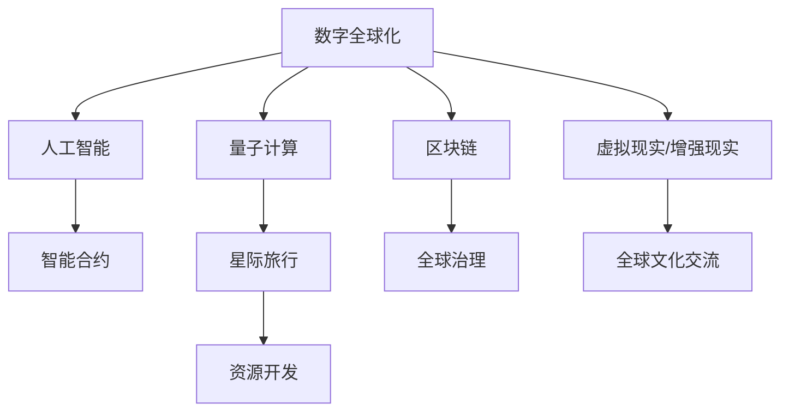

                 

# 2050年的全球化：从数字全球化到星际全球化的全球一体化进程

> 关键词：数字全球化,星际全球化,人工智能,全球一体化,智能合约,区块链,量子计算,星际旅行,数字身份

## 1. 背景介绍

### 1.1 问题由来

21世纪以来，全球化迅猛发展，尤其是在数字技术的推动下，全球各地的人们、企业和机构得以跨越地理界限，紧密联系，共享资源，协同创新。数字全球化浪潮加速了全球产业的融合，催生了全球价值链的形成，推动了社会生产力的跨越式提升。然而，数字全球化同样带来了数据隐私、网络安全、伦理道德等诸多挑战。

展望未来，全球化将迎来新的阶段：数字全球化向星际全球化过渡。在这一过程中，人工智能（AI）、区块链、量子计算等前沿技术将发挥关键作用，促进地球与星际之间的深度连接和无缝互动，构建全球一体化的新纪元。

### 1.2 问题核心关键点

未来全球化的一个重要特征是信息技术的深度融合。具体表现为：

- 数字全球化：通过互联网、物联网等技术，实现全球信息互通、产业互联、服务共享。
- 星际全球化：在数字全球化的基础上，通过人工智能、量子通信等技术，实现地球与星际之间的智能交互和资源共享。
- 全球一体化：形成涵盖物理空间、信息空间和心灵空间的全球一体化架构，为全球协作提供坚实的技术基础。

实现星际全球化，需要突破时间、空间和计算能力的限制，探索新的传输协议和计算模型，推动全球合作与治理机制的升级，打造跨界融合的全球生态。

### 1.3 问题研究意义

研究未来全球化技术，对于构建未来社会、经济和政治新秩序，具有重要意义：

1. 促进全球经济一体化：利用前沿技术，打破传统国际贸易和金融壁垒，实现全球市场和资源的深度融合。
2. 提升全球治理水平：通过智能合约、区块链等技术，增强全球治理的透明度和公正性。
3. 保护全球数字安全：发展量子通信、人工智能等技术，构建全球数字安全防线。
4. 推动全球文化交流：通过虚拟现实、增强现实等技术，促进不同文化之间的深度交流和理解。
5. 加速星际探索进程：利用先进计算和通信技术，支持星际旅行、资源开发等活动，推动人类向星际文明演进。

## 2. 核心概念与联系

### 2.1 核心概念概述

为更好地理解未来全球化技术，本节将介绍几个密切相关的核心概念：

- 数字全球化：通过互联网、物联网等技术，实现全球信息互通、产业互联、服务共享。
- 星际全球化：在数字全球化的基础上，通过人工智能、量子通信等技术，实现地球与星际之间的智能交互和资源共享。
- 全球一体化：形成涵盖物理空间、信息空间和心灵空间的全球一体化架构，为全球协作提供坚实的技术基础。
- 智能合约：基于区块链技术的自动化合约，能够实现无需第三方介入的交易和执行，提高信任和效率。
- 区块链：一种去中心化的分布式账本技术，保证数据透明、不可篡改，适用于全球金融、供应链等场景。
- 量子计算：利用量子态叠加和纠缠特性，实现计算速度的指数级提升，解决传统计算机无法处理的复杂问题。
- 虚拟现实/增强现实：通过计算机生成虚拟世界或增强现实环境，支持全球文化交流和远程协作。
- 星际旅行：通过先进推进系统和空间探测技术，实现人类跨星际的旅行和探索。

这些核心概念之间的逻辑关系可以通过以下Mermaid流程图来展示：



这个流程图展示了几大核心概念及其之间的关系：

1. 数字全球化通过人工智能、量子计算等技术，向星际全球化迈进。
2. 区块链技术支持智能合约，提高全球交易和治理的透明度和效率。
3. 虚拟现实/增强现实技术，促进全球文化交流和协作。
4. 星际旅行依赖于量子计算等先进技术，推动资源开发和人类文明的演进。

## 3. 核心算法原理 & 具体操作步骤

### 3.1 算法原理概述

未来全球化的核心算法主要包括人工智能、量子计算和区块链等技术。它们各自通过不同的原理和方法，实现全球一体化。

- 人工智能：利用机器学习和大数据分析，实现对海量数据的深度处理和智能决策。
- 量子计算：利用量子态叠加和纠缠特性，解决传统计算难以处理的复杂问题。
- 区块链：通过分布式账本技术，保证数据的透明和不可篡改性。

### 3.2 算法步骤详解

下面分别介绍这三大技术的核心算法步骤：

#### 3.2.1 人工智能

1. **数据采集与预处理**：通过传感器、网络等设备，采集全球各地的数据，包括气候、交通、经济等。
2. **模型训练与优化**：利用大数据和深度学习算法，训练出能够进行智能决策的模型。
3. **推理与执行**：将训练好的模型应用于实际场景，进行预测和决策。

#### 3.2.2 量子计算

1. **量子比特编码**：将经典信息编码为量子比特（qubit）。
2. **量子门操作**：通过量子门实现量子比特间的逻辑操作。
3. **量子算法求解**：利用量子算法解决复杂问题，如模拟量子系统、优化问题等。

#### 3.2.3 区块链

1. **共识机制设计**：选择适合的共识机制（如PoW、PoS等），保证网络节点的一致性。
2. **分布式账本设计**：设计分布式账本，实现数据的透明和不可篡改。
3. **智能合约开发**：开发基于区块链的智能合约，实现自动化的交易和执行。

### 3.3 算法优缺点

#### 3.3.1 人工智能

**优点**：
- 能够处理大规模数据，进行深度学习和预测。
- 支持多领域应用，如智能交通、智慧城市等。

**缺点**：
- 对数据质量和标注依赖性强。
- 模型复杂度大，计算成本高。
- 需要大量的计算资源和算法调优。

#### 3.3.2 量子计算

**优点**：
- 计算速度指数级提升，解决传统计算难以处理的问题。
- 应用于密码学、物理模拟等领域具有巨大潜力。

**缺点**：
- 技术成熟度低，实现难度大。
- 量子比特容易受环境干扰，错误率高。

#### 3.3.3 区块链

**优点**：
- 去中心化，提高数据透明和安全性。
- 适用于金融、供应链等场景。

**缺点**：
- 交易速度慢，网络延迟高。
- 共识机制复杂，网络成本高。

### 3.4 算法应用领域

未来全球化技术的广泛应用，将涵盖以下多个领域：

- **智能合约**：在金融、供应链、医疗等领域，提高交易透明度和执行效率。
- **区块链**：支持全球金融交易、版权保护等，增强数据安全和隐私保护。
- **量子通信**：实现全球安全通信，解决传统通信系统的局限。
- **人工智能**：应用于智慧城市、智能制造、远程医疗等，提升社会治理和公共服务水平。
- **虚拟现实/增强现实**：支持全球文化交流和协作，增强用户体验。
- **星际旅行**：推动人类向星际文明演进，开发利用星际资源。

## 4. 数学模型和公式 & 详细讲解  
### 4.1 数学模型构建

本节将使用数学语言对未来全球化技术进行更加严格的刻画。

**数据采集与预处理**：
假设采集的数据集为 $D=\{(x_i,y_i)\}_{i=1}^N$，其中 $x_i$ 为输入数据，$y_i$ 为标签。通过传感器、网络等设备采集到 $x_i$，预处理后得到 $\tilde{x}_i$。

**模型训练与优化**：
假设模型为 $f_\theta(x)$，其中 $\theta$ 为模型参数。训练目标为最小化损失函数 $\mathcal{L}(\theta)$。通过梯度下降等优化算法，更新模型参数，得到 $\hat{\theta}$。

**推理与执行**：
在实际应用中，利用训练好的模型 $f_{\hat{\theta}}(x)$，进行预测和决策。具体步骤如下：
1. 将输入数据 $\tilde{x}$ 输入模型，得到输出 $y'=f_{\hat{\theta}}(\tilde{x})$。
2. 根据预测结果 $y'$，执行相应的决策或操作。

**量子比特编码**：
假设编码的量子比特数量为 $n$，则量子比特的状态可以表示为 $|\psi\rangle=\sum_{i=0}^{2^n-1} \alpha_i |i\rangle$，其中 $\alpha_i$ 为量子态的系数。

**量子门操作**：
通过量子门（如Hadamard门、CNOT门等）实现量子比特之间的逻辑操作。具体步骤如下：
1. 对输入量子比特进行Hadamard门操作，得到叠加态 $|\psi'\rangle=\frac{1}{\sqrt{2}}(|0\rangle+|1\rangle)$。
2. 对输入量子比特和辅助量子比特进行CNOT门操作，得到纠缠态 $|\psi''\rangle=|0\rangle|\psi'\rangle+|1\rangle|\psi'\rangle$。

**量子算法求解**：
假设要解决的问题为 $Q(x)$，利用量子算法求解步骤如下：
1. 将经典信息编码为量子比特 $|\psi\rangle$。
2. 对量子比特进行量子门操作，求解量子问题。
3. 通过量子比特测量，获取经典解 $x'$。

**共识机制设计**：
假设区块链网络中有 $N$ 个节点，共识机制为PoW。共识步骤如下：
1. 每个节点根据区块链历史数据生成新区块。
2. 所有节点对新区块进行哈希计算，计算量最大的节点获得新区块。
3. 其他节点根据新区块更新本地区块链。

**分布式账本设计**：
假设区块链采用公有链结构，每个节点维护一个完整的分布式账本。账本结构为：
1. 区块头：包含区块的时间戳、哈希值等。
2. 交易列表：记录每个交易的信息。
3. 区块链结构：通过哈希指针连接各个区块。

**智能合约开发**：
假设智能合约为 $C(x)$，其中 $x$ 为输入数据。智能合约的执行步骤如下：
1. 合约被部署到区块链上，生成合约代码 $c$。
2. 对合约代码进行编译和验证，生成智能合约函数。
3. 调用智能合约函数，执行相应的操作。

### 4.2 公式推导过程

以下我们以智能合约为例，推导其计算过程。

假设智能合约为：
1. 接收者：Alice。
2. 条件：接收者拥有特定ID。
3. 操作：将一定数量货币转移到接收者。

智能合约的代码如下：
```javascript
function transfer(mint, id) {
    require(id == receiverID);
    mint.transfer(id, amount);
}
```

在区块链上部署智能合约，其执行步骤如下：
1. 生成智能合约代码 $c$：
   $$
   c = \text{Code}(transfer)
   $$
2. 将智能合约代码 $c$ 存储在区块链上，生成智能合约地址 $a$：
   $$
   a = \text{Address}(c)
   $$
3. 用户调用智能合约函数，执行操作：
   $$
   \text{Call}(a, mint, id, amount)
   $$

通过智能合约，实现自动化交易和执行，提高全球交易的透明度和效率。

## 5. 项目实践：代码实例和详细解释说明
### 5.1 开发环境搭建

在进行未来全球化技术实践前，我们需要准备好开发环境。以下是使用Python进行Solidity开发的环境配置流程：

1. 安装Node.js：从官网下载并安装Node.js，用于运行区块链网络。

2. 安装Truffle：使用npm安装Truffle，用于开发智能合约。
```bash
npm install -g truffle
```

3. 创建并激活虚拟环境：
```bash
source <virtualenv>/bin/activate
```

4. 安装Solidity：使用npm安装Solidity，用于编写智能合约代码。
```bash
npm install -g solc
```

完成上述步骤后，即可在虚拟环境中开始智能合约的开发。

### 5.2 源代码详细实现

下面我们以智能合约为例，给出使用Solidity语言对智能合约进行开发和部署的代码实现。

首先，定义智能合约的接口和函数：

```solidity
pragma solidity ^0.8.0;

contract Token {
    uint256 public totalSupply;
    mapping(uint256 => uint256) balances;
    event Transfer(uint256 from, uint256 to, uint256 amount);
    
    constructor(uint256 initialSupply) public {
        totalSupply = initialSupply;
        balances[msg.sender] = initialSupply;
    }
    
    function transfer(uint256 receiver, uint256 amount) public {
        require(balances[msg.sender] >= amount);
        balances[msg.sender] -= amount;
        balances[receiver] += amount;
        emit Transfer(msg.sender, receiver, amount);
    }
}
```

然后，在测试环境中测试智能合约：

```solidity
pragma solidity ^0.8.0;

contract Test {
    address private tokenAddress;
    uint256 private initialSupply;
    
    constructor(address _tokenAddress, uint256 _initialSupply) public {
        tokenAddress = _tokenAddress;
        initialSupply = _initialSupply;
        Token token = Token(tokenAddress);
        uint256 totalSupply = token.totalSupply();
        require(totalSupply == _initialSupply);
    }
    
    function testTransfer() public {
        Token token = Token(tokenAddress);
        uint256 balance = balances[msg.sender];
        require(balance > 0);
        token.transfer(receiver, amount);
    }
}
```

最后，将智能合约部署到区块链网络：

```bash
truffle compile
truffle migrate
```

### 5.3 代码解读与分析

让我们再详细解读一下关键代码的实现细节：

**智能合约接口和函数**：
- `constructor`函数：初始化智能合约，设置总供应量和初始余额。
- `transfer`函数：实现转账功能，更新余额，并记录转账事件。

**测试函数**：
- `testTransfer`函数：测试转账功能，模拟用户转账操作。

**部署步骤**：
1. 编译智能合约：
   ```bash
   truffle compile
   ```
2. 部署智能合约：
   ```bash
   truffle migrate
   ```

**部署环境**：
- 智能合约使用Solidity语言编写。
- 使用Truffle框架进行智能合约的开发和部署。

完成上述步骤后，即可在区块链网络上部署智能合约，并进行自动化交易。

## 6. 实际应用场景
### 6.1 智能合约在金融交易中的应用

智能合约在金融交易中的应用，可以实现无需第三方介入的交易和执行，提高交易的透明度和效率。例如，股票交易、债券发行等场景，可以通过智能合约自动完成交易验证、结算和支付，避免中间环节的繁琐操作和道德风险。

### 6.2 区块链在供应链管理中的应用

区块链的分布式账本技术，可以实现供应链各环节的数据透明和不可篡改，增强供应链的信任和协作。例如，企业可以记录产品的来源、运输、销售等全过程，保障产品质量和安全，提高供应链的响应速度和灵活性。

### 6.3 量子通信在信息安全中的应用

量子通信技术可以实现高安全性的信息传输，保证信息的不可窃听和不可篡改。例如，银行、政府等重要机构可以利用量子通信技术，保障其信息传输的安全性，防止信息泄露和篡改。

### 6.4 人工智能在智慧城市中的应用

人工智能技术可以应用于智慧城市建设，提升城市管理和服务水平。例如，智能交通系统、智慧安防系统、智慧医疗系统等，通过数据分析和智能决策，实现城市的高效运行和资源优化。

### 6.5 虚拟现实/增强现实在文化交流中的应用

虚拟现实/增强现实技术可以实现全球文化交流和协作，增强用户体验。例如，虚拟博物馆、虚拟展会、虚拟课堂等，让用户能够身临其境地体验和学习，促进不同文化之间的交流和理解。

### 6.6 星际旅行在资源开发中的应用

星际旅行技术可以支持人类向星际文明演进，开发利用星际资源。例如，太空采矿、星际旅游等，通过人类对星际资源的开发和利用，实现资源的共享和合作，促进星际文明的进步。

## 7. 工具和资源推荐
### 7.1 学习资源推荐

为了帮助开发者系统掌握未来全球化技术，这里推荐一些优质的学习资源：

1. Solidity官方文档：Solidity语言官方文档，提供详细的语法和示例代码。
2. Truffle官方文档：Truffle框架官方文档，提供智能合约开发和部署的指南。
3. Ethereum官网：Ethereum区块链官方文档，提供区块链技术的基础知识和应用案例。
4. 《Blockchain Basics》：一本区块链入门书籍，帮助理解区块链的基本概念和技术实现。
5. 《Quantum Computing for Computer Scientists》：一本量子计算入门书籍，帮助理解量子计算的基本原理和应用场景。
6. 《Artificial Intelligence: A Modern Approach》：一本人工智能入门书籍，帮助理解人工智能的基本概念和应用技术。

通过对这些资源的学习实践，相信你一定能够快速掌握未来全球化技术的精髓，并用于解决实际的区块链和智能合约问题。

### 7.2 开发工具推荐

高效的开发离不开优秀的工具支持。以下是几款用于未来全球化技术开发的常用工具：

1. Node.js：基于JavaScript的运行环境，支持区块链网络的操作。
2. Truffle：用于智能合约的开发和部署，支持Solidity语言。
3. Solidity：智能合约的编程语言，支持区块链的智能合约开发。
4. Ethereum官网：Ethereum区块链的官方开发平台，提供智能合约的部署和测试工具。
5. ConsenSys：Ethereum社区的开发者平台，提供丰富的开发资源和工具支持。
6. Quantum计算机：如IBM、Google等提供的量子计算机，支持量子计算的研究和开发。

合理利用这些工具，可以显著提升未来全球化技术的开发效率，加快创新迭代的步伐。

### 7.3 相关论文推荐

未来全球化技术的发展源于学界的持续研究。以下是几篇奠基性的相关论文，推荐阅读：

1. 《Bitcoin: A Peer-to-Peer Electronic Cash System》：比特币的论文，奠定了区块链技术的基石。
2. 《Quantum Supremacy using a Programmable Quantum Processor》：谷歌量子计算的论文，展示了量子计算的强大能力。
3. 《A Survey on Distributed Consensus Algorithms》：区块链共识算法的综述论文，帮助理解各种共识机制的原理和应用。
4. 《Artificial Intelligence: A Modern Approach》：人工智能的经典教材，帮助理解人工智能的基本概念和应用技术。
5. 《Quantum Computation and Quantum Information》：量子计算的经典教材，帮助理解量子计算的基本原理和应用场景。

这些论文代表了大语言模型微调技术的发展脉络。通过学习这些前沿成果，可以帮助研究者把握学科前进方向，激发更多的创新灵感。

## 8. 总结：未来发展趋势与挑战

### 8.1 研究成果总结

未来全球化技术的探索，是人工智能、区块链、量子计算等前沿技术的深度融合。通过数字全球化到星际全球化的过渡，构建全球一体化的新纪元。主要研究成果包括：

- 智能合约：提高全球交易透明度和执行效率。
- 区块链：增强数据透明和安全性，支持全球协作。
- 量子计算：解决复杂问题，推动人工智能和区块链的发展。
- 虚拟现实/增强现实：促进全球文化交流和协作。
- 星际旅行：推动人类向星际文明演进。

### 8.2 未来发展趋势

展望未来，未来全球化技术的发展趋势将体现在以下几个方面：

1. **技术的深度融合**：人工智能、区块链、量子计算等技术的深度融合，推动全球一体化的实现。
2. **智能合约的普及**：智能合约将成为全球交易和协作的基础，提高效率和透明度。
3. **区块链的扩展**：区块链技术将不断扩展其应用场景，支持更多领域的协作和治理。
4. **量子计算的突破**：量子计算技术将实现更多复杂问题的解决，推动人工智能和区块链的发展。
5. **虚拟现实/增强现实的普及**：虚拟现实/增强现实技术将广泛应用，促进全球文化交流和协作。
6. **星际旅行的实现**：星际旅行技术将取得突破，推动人类向星际文明演进。

### 8.3 面临的挑战

尽管未来全球化技术的发展前景广阔，但在实施过程中仍面临诸多挑战：

1. **技术成熟度**：当前区块链、量子计算等技术还处于早期阶段，技术成熟度不足。
2. **数据隐私**：区块链和智能合约等技术，需要处理大量敏感数据，数据隐私保护问题亟需解决。
3. **安全风险**：区块链和智能合约等技术，容易受到网络攻击和黑客攻击，安全风险需要加强防范。
4. **跨界合作**：不同国家和地区在技术标准、法律法规等方面存在差异，需要加强跨界合作，实现技术标准和法律法规的统一。
5. **社会接受度**：未来全球化技术需要得到社会各界的广泛接受和认可，推动其落地应用。

### 8.4 研究展望

未来全球化技术的研究展望主要集中在以下几个方面：

1. **技术标准的制定**：推动国际组织制定统一的技术标准，实现技术的全球统一。
2. **法律法规的完善**：加强对未来全球化技术的法律法规研究，保障其合法合规应用。
3. **跨界合作的深化**：加强国际间、行业间的跨界合作，推动技术的广泛应用。
4. **安全保障的加强**：加强未来全球化技术的安全保障，防范网络攻击和黑客攻击。
5. **社会接受度的提升**：加强对未来全球化技术的社会宣传和教育，提升社会接受度。

## 9. 附录：常见问题与解答

**Q1：未来全球化技术是否适用于所有行业？**

A: 未来全球化技术适用于大多数行业，尤其是金融、供应链、医疗、教育等数据密集型领域。对于一些对数据敏感的行业，如司法、军事等，需要根据具体需求和场景，进行相应的技术适配。

**Q2：智能合约在实际应用中面临哪些挑战？**

A: 智能合约在实际应用中面临以下挑战：
1. 代码漏洞：智能合约的代码实现复杂，容易产生漏洞，需要严格测试和审查。
2. 执行效率：智能合约的执行效率较低，需要优化代码和网络。
3. 法律风险：智能合约的法律风险尚未明确，需要进一步研究和规范。

**Q3：区块链在实际应用中面临哪些挑战？**

A: 区块链在实际应用中面临以下挑战：
1. 网络延迟：区块链的网络延迟较高，需要优化网络传输和共识机制。
2. 数据存储：区块链的分布式账本需要大量的存储资源，需要优化存储和计算。
3. 交易成本：区块链的交易成本较高，需要优化共识机制和计算模型。

**Q4：量子计算在实际应用中面临哪些挑战？**

A: 量子计算在实际应用中面临以下挑战：
1. 技术成熟度：量子计算的技术成熟度较低，需要进一步研究和开发。
2. 计算误差：量子比特容易受环境干扰，计算误差较高，需要优化算法和硬件。
3. 应用场景：量子计算的应用场景较为有限，需要进一步探索和验证。

**Q5：虚拟现实/增强现实在实际应用中面临哪些挑战？**

A: 虚拟现实/增强现实在实际应用中面临以下挑战：
1. 硬件成本：虚拟现实/增强现实设备的成本较高，需要降低硬件成本。
2. 用户体验：虚拟现实/增强现实的用户体验不佳，需要优化界面和交互设计。
3. 技术适配：虚拟现实/增强现实需要与其他技术结合，需要开发相应的接口和协议。

**Q6：星际旅行在实际应用中面临哪些挑战？**

A: 星际旅行在实际应用中面临以下挑战：
1. 技术难度：星际旅行的技术难度较高，需要进一步研究和开发。
2. 资源消耗：星际旅行需要大量的资源，需要优化推进系统和资源利用。
3. 伦理道德：星际旅行的伦理道德问题需要深入探讨和规范。

---

作者：禅与计算机程序设计艺术 / Zen and the Art of Computer Programming

