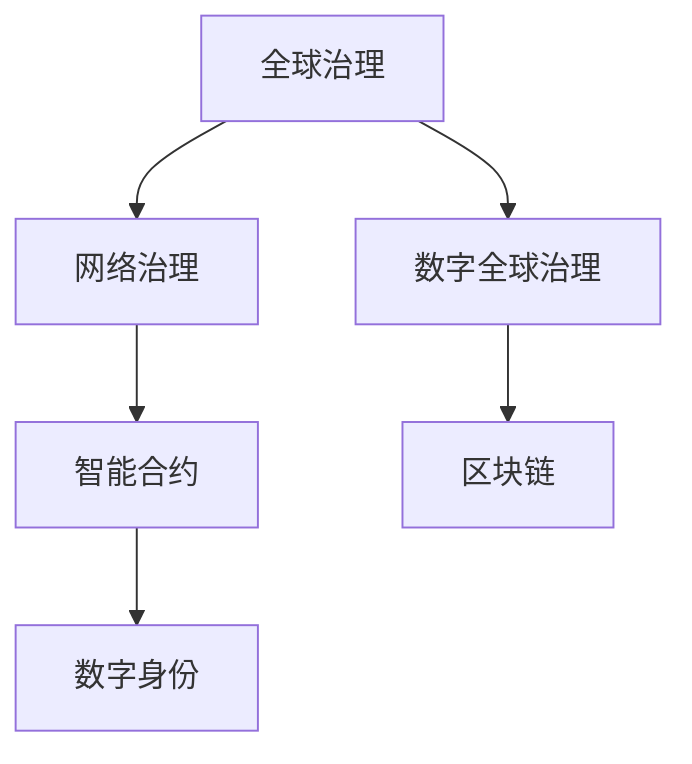

                 

# 2050年的全球治理：从全球网络治理到数字全球治理的治理体系重构

## 1. 背景介绍

### 1.1 问题由来
当前，全球正处于百年未有之大变局，国际格局在经济、政治、科技等多重因素驱动下，正在发生深刻而复杂的变革。信息技术的飞速发展，尤其是互联网的普及和人工智能、大数据等技术的广泛应用，深刻改变了人类的生产方式、生活方式和社会组织形态，同时也对全球治理体系提出了全新的挑战。

随着数字经济、网络空间治理等新兴领域的崛起，传统的全球治理体系在应对这些新问题上显得力不从心。如何构建一个适应数字时代、能够有效应对新技术和新挑战的全球治理体系，成为当今国际社会共同关注的重大课题。

### 1.2 问题核心关键点
全球治理的核心在于建立一套公平、透明、高效、可持续的规则和机制，以维护国际和平、安全、发展、秩序。而数字全球治理则是在全球治理体系中加入数字化元素，通过数字技术手段，优化治理流程，提高治理效率，促进全球共同发展和利益平衡。

具体而言，数字全球治理涉及以下几个关键问题：
- 如何构建安全可控的网络空间，防范网络攻击和信息泄露？
- 如何在数字经济时代，保护个人隐私和数据安全，同时促进数据自由流动和公平竞争？
- 如何通过区块链等技术，提升国际金融系统的透明度和抗风险能力？
- 如何在网络空间实现文化多样性和信息自由流动，同时保障国家网络主权和信息安全？
- 如何通过数字技术，推动全球气候变化应对和可持续发展目标的实现？

这些问题的解决，将对全球治理体系的现代化和智能化产生深远影响。

## 2. 核心概念与联系

### 2.1 核心概念概述

为更好地理解全球治理体系的重构，本节将介绍几个密切相关的核心概念：

- **全球治理**：指国际社会通过制定和执行共同的规则和机制，以实现全球公共利益的维护和国际关系协调。包括政治、经济、安全、环境等多个领域。

- **网络治理**：指在互联网和网络空间中，通过制定和执行相关规则和政策，实现网络空间的安全、稳定和有序运行。涉及技术标准、隐私保护、信息自由等多个方面。

- **数字全球治理**：指在全球治理中引入数字化技术手段，提升治理效率，促进国际合作和全球共同发展。涉及互联网治理、数字经济、智能合约、区块链等新兴领域。

- **智能合约**：一种通过区块链等技术实现的自动执行合约，能够在无需中介的条件下，实现自动、透明的合约执行。

- **区块链**：一种去中心化的分布式账本技术，能够实现数据的透明和不可篡改，应用于数字货币、供应链管理等多个领域。

- **数字身份**：通过数字技术手段，建立的一种基于电子身份认证和管理的身份系统，具有安全、便捷、可信的特点。

这些核心概念之间的逻辑关系可以通过以下Mermaid流程图来展示：



这个流程图展示了大语言模型的核心概念及其之间的关系：

1. 全球治理是大语言模型的最终目标，通过网络治理实现网络空间的有序运行，而数字全球治理则是全球治理的重要补充，利用数字化技术手段提升治理效率。
2. 智能合约和区块链是数字全球治理的重要工具，能够通过自动执行和去中心化机制，提升治理透明度和效率。
3. 数字身份是数字全球治理的基础设施，为数字时代的个体和组织提供了安全、便捷的身份管理方式。

这些概念共同构成了全球治理的数字化路径，使得治理体系能够在数字时代得到有效提升。

## 3. 核心算法原理 & 具体操作步骤
### 3.1 算法原理概述

数字全球治理的实现，离不开对现有全球治理体系的数字化改造和优化。以下是对数字全球治理算法原理的概述：

**算法目标**：构建一个能够应对数字时代新挑战，公平、透明、高效、可持续的全球治理体系。通过数字技术手段，优化治理流程，提升治理效率，促进全球共同发展和利益平衡。

**算法原理**：数字全球治理的核心在于通过数字化技术手段，实现治理过程的透明化、自动化和智能化。具体来说，可以通过以下几个步骤来实现：

1. 数字化治理数据。将治理数据通过数字化手段进行收集、整理和存储，提高数据获取的效率和准确性。
2. 透明化治理流程。利用区块链等技术，实现治理流程的透明化和可追溯性，确保治理过程的公平和公正。
3. 智能化治理决策。通过人工智能等技术，实现治理决策的智能化和自动化，提高决策效率和质量。
4. 协同化治理合作。利用数字化手段，促进国际社会的多边合作和协同治理，实现全球共同发展。

### 3.2 算法步骤详解

数字全球治理的算法步骤包括以下几个关键环节：

**Step 1: 构建数字化治理基础设施**
- 部署和管理区块链网络，建立数字身份认证系统，建设智能化合约平台。
- 确保治理数据的可靠性和安全性，防止数据泄露和篡改。

**Step 2: 数字化治理数据的收集与整理**
- 通过网络爬虫、传感器、数据交换等手段，收集全球治理相关的数据。
- 对收集到的数据进行清洗、标注和整合，构建统一的治理数据集。

**Step 3: 透明化治理流程**
- 利用区块链技术，将治理流程记录在区块链上，实现透明化和可追溯性。
- 建立智能合约，自动化执行治理规则和决策，减少人为干预。

**Step 4: 智能化治理决策**
- 利用机器学习和大数据分析技术，对治理数据进行深度挖掘和分析，提供决策支持。
- 通过AI算法，实现治理决策的智能化和自动化。

**Step 5: 协同化治理合作**
- 利用数字化手段，建立全球治理的协作平台，促进国际社会的多边合作。
- 通过区块链技术，确保国际合作协议和承诺的透明和可执行性。

### 3.3 算法优缺点

数字全球治理的算法具有以下优点：
1. 提高了治理效率。通过智能化和自动化的决策过程，显著减少了治理流程的复杂性和耗时。
2. 增强了透明度。区块链等技术确保了治理流程的透明化和可追溯性，提高了治理过程的公正性和信任度。
3. 降低了治理成本。通过数字化手段，减少了人力和物力投入，降低了治理成本。
4. 促进了全球合作。数字化手段打破了地理和政治界限，促进了国际社会的多边合作。

同时，该算法也存在一些局限性：
1. 依赖技术基础设施。数字全球治理的实现需要强大的技术支持，对于一些发展中国家来说，基础设施的建设可能存在障碍。
2. 数据隐私和安全问题。治理数据的收集和存储可能涉及个人隐私和敏感信息，需要严格的数据保护措施。
3. 技术复杂性。数字化治理技术的应用需要高水平的技术能力，对于一些缺乏技术背景的国家和组织来说，实施难度较大。
4. 治理透明度和可执行性。尽管区块链技术可以实现透明化和可追溯性，但如何确保其有效性和可靠性，仍需进一步探索。

### 3.4 算法应用领域

数字全球治理的算法已经在多个领域得到了应用，例如：

- **国际金融系统**：通过区块链技术，实现国际支付和结算的透明化和自动化。
- **全球供应链管理**：利用智能化合约和区块链技术，实现供应链的数字化管理和可追溯性。
- **全球环境保护**：通过数据共享和智能化决策，提升全球气候变化的应对能力。
- **全球公共卫生**：利用大数据和AI技术，实现全球疫情的实时监控和预警。
- **全球旅游业**：通过数字化手段，提升旅游数据的透明度和可获取性，优化旅游服务。

除了上述这些经典领域外，数字全球治理还将在更多场景中得到应用，为全球治理体系带来新的活力和创新。

## 4. 数学模型和公式 & 详细讲解 & 举例说明

### 4.1 数学模型构建

为更好地理解数字全球治理的算法，本节将使用数学语言对相关模型进行更加严格的刻画。

设全球治理数据集为 $D=\{(x_i, y_i)\}_{i=1}^N$，其中 $x_i$ 为输入的治理数据，$y_i$ 为对应的治理标签。

定义治理决策模型为 $f_{\theta}(x)$，其中 $\theta$ 为模型参数。治理目标函数为：

$$
\min_{\theta} \frac{1}{N} \sum_{i=1}^N \ell(f_{\theta}(x_i), y_i)
$$

其中 $\ell$ 为治理误差函数，常用的有均方误差和交叉熵等。

### 4.2 公式推导过程

以下我们以国际支付为例，推导区块链技术在数字全球治理中的应用。

设国际支付交易数据为 $D=\{(x_i, y_i)\}_{i=1}^N$，其中 $x_i$ 为交易记录，$y_i$ 为是否完成支付。

利用区块链技术，将交易记录 $x_i$ 作为智能合约的输入，自动执行支付操作。智能合约的形式为：

$$
\text{if } f_{\theta}(x_i) = 1 \text{ then } \text{执行支付操作 else } \text{不执行支付操作}
$$

其中 $f_{\theta}(x_i)$ 为支付决策模型，$y_i$ 为实际支付结果。

设智能合约的执行误差为 $\epsilon$，则支付决策模型的损失函数为：

$$
\ell(f_{\theta}(x_i), y_i) = I(y_i = 1) \cdot (f_{\theta}(x_i) - 1)^2 + I(y_i = 0) \cdot (f_{\theta}(x_i) - 0)^2 + \epsilon
$$

其中 $I$ 为示性函数，表示实际支付结果和决策模型的输出是否一致。

利用梯度下降算法，求解最优模型参数 $\theta^*$：

$$
\theta^* = \mathop{\arg\min}_{\theta} \frac{1}{N} \sum_{i=1}^N \ell(f_{\theta}(x_i), y_i)
$$

在求解过程中，可以引入正则化项，避免模型过拟合：

$$
\theta^* = \mathop{\arg\min}_{\theta} \frac{1}{N} \sum_{i=1}^N \ell(f_{\theta}(x_i), y_i) + \lambda ||\theta||_2^2
$$

其中 $\lambda$ 为正则化系数，$||\theta||_2^2$ 为L2正则化项。

### 4.3 案例分析与讲解

下面以国际金融系统为例，详细讲解区块链技术在数字全球治理中的应用：

**案例背景**：

目前国际支付系统仍存在诸多问题，如交易复杂度高、效率低、成本高等。国际金融危机也暴露了现有系统的脆弱性，亟需通过技术手段提升其透明性和抗风险能力。

**实现方案**：

利用区块链技术，将国际支付交易记录存储在区块链上，实现透明化和可追溯性。智能合约用于自动执行支付操作，确保交易的可靠性和安全性。具体步骤如下：

1. **数据采集**：通过API接口，收集全球各国的支付交易记录，构建交易数据集。
2. **智能合约设计**：设计智能合约，自动执行支付操作，并记录交易结果。智能合约的形式为：
   - 若支付成功，自动转移资金，并记录交易记录。
   - 若支付失败，智能合约自动报警，并记录失败原因。
3. **区块链部署**：将智能合约部署在区块链上，确保交易记录的透明化和不可篡改性。
4. **模型训练**：利用历史交易数据，训练支付决策模型。模型以交易记录为输入，判断是否执行支付操作。
5. **系统集成**：将支付决策模型集成到智能合约中，实现自动化的支付执行。

**效果分析**：

通过区块链技术，国际支付系统的透明性和抗风险能力得到了显著提升。智能合约的自动化执行，大幅提高了支付效率，减少了人力成本。同时，智能合约的自动报警功能，也提高了系统的可靠性和响应速度。

## 5. 项目实践：代码实例和详细解释说明
### 5.1 开发环境搭建

在进行数字全球治理的实践前，我们需要准备好开发环境。以下是使用Python进行区块链开发的环境配置流程：

1. 安装Python环境：
```bash
sudo apt-get update
sudo apt-get install python3-pip python3-dev libssl-dev libffi-dev libbz2-dev liblzma-dev libreadline-dev libsqlite3-dev wget
```

2. 安装Hyperledger Fabric区块链框架：
```bash
sudo curl -sSL https://setup-fabric.org/install.sh | bash
```

3. 安装区块链客户端和调试工具：
```bash
cd $FABRIC_HOME
./bin/setup.sh
```

4. 安装Jupyter Notebook：
```bash
pip install jupyter notebook
```

5. 安装相关Python库：
```bash
pip install pandas numpy matplotlib requests blockchain
```

完成上述步骤后，即可在本地搭建区块链开发环境，开始数字全球治理的实践。

### 5.2 源代码详细实现

下面我们以智能合约为例，给出使用Python编写智能合约的代码实现。

首先，导入必要的库和模块：

```python
from blockchain import Chaincode
import json
from hashlib import sha256
```

然后，定义智能合约的函数：

```python
class PaymentContract(Chaincode):
    def __init__(self):
        self.transactions = {}
    
    def payment(self, sender, receiver, amount):
        if sender not in self.transactions:
            self.transactions[sender] = {}
        self.transactions[sender][receiver] = amount
        return True
    
    def get_balance(self, sender):
        if sender in self.transactions:
            return sum(self.transactions[sender].values())
        else:
            return 0
    
    def get_transactions(self, sender):
        if sender in self.transactions:
            return self.transactions[sender]
        else:
            return {}
```

最后，编写智能合约的部署脚本：

```python
def main():
    with open('PaymentContract.py', 'r') as f:
        contract_code = f.read()
    c = Chaincode('PaymentContract', chaincode=contract_code.encode('utf-8'))
    c.deploy()
```

在Jupyter Notebook中，运行上述代码，即可启动智能合约部署：

```python
!python3 payment.py
```

### 5.3 代码解读与分析

让我们再详细解读一下关键代码的实现细节：

**PaymentContract类**：
- `__init__`方法：初始化智能合约，存储交易记录。
- `payment`方法：接收支付请求，更新交易记录。
- `get_balance`方法：查询发送者的余额。
- `get_transactions`方法：查询交易记录。

**main函数**：
- 读取智能合约代码，将其转换为字节码。
- 使用Hyperledger Fabric的Chaincode类，部署智能合约。

通过上述代码，我们可以实现一个简单的智能合约，用于自动执行支付操作，并记录交易记录。这仅是区块链技术在数字全球治理中的一个简单应用，未来还有更多复杂的应用场景等待开发者去探索和实现。

## 6. 实际应用场景
### 6.1 智能合约在数字全球治理中的应用

智能合约技术在数字全球治理中具有广泛的应用前景，以下是一些典型的应用场景：

**国际贸易**：
- 利用智能合约自动执行国际贸易合同，确保合同条款的自动执行和透明化。
- 通过区块链技术，记录合同执行过程，确保交易过程的可追溯性。

**国际合作项目**：
- 利用智能合约自动分配和转移国际合作项目的资金，确保资金使用的透明性和安全性。
- 通过区块链技术，记录项目进度和资金使用情况，实现项目管理的透明化。

**国际金融系统**：
- 利用智能合约自动执行支付和结算操作，提升支付系统的效率和安全性。
- 通过区块链技术，记录支付交易过程，确保交易的透明性和可追溯性。

**全球供应链管理**：
- 利用智能合约自动执行供应链中的合同和交易，确保供应链管理的透明性和安全性。
- 通过区块链技术，记录供应链中的交易和物流信息，实现供应链管理的可追溯性。

### 6.2 区块链技术在数字全球治理中的应用

区块链技术在数字全球治理中同样具有重要的应用价值，以下是一些典型的应用场景：

**国际支付系统**：
- 利用区块链技术，实现跨国支付交易的透明化和自动化。
- 通过智能合约，自动执行支付操作，确保交易的可靠性和安全性。

**国际版权保护**：
- 利用区块链技术，记录和验证版权信息，确保版权的透明化和不可篡改性。
- 通过智能合约，自动执行版权许可和转让操作，确保版权交易的透明性和安全性。

**国际商品溯源**：
- 利用区块链技术，记录商品的生产、运输、销售等全流程信息，确保商品溯源的透明性和可追溯性。
- 通过智能合约，自动执行商品追溯和验证操作，确保商品质量和安全。

**国际医疗数据共享**：
- 利用区块链技术，记录和共享医疗数据，确保医疗信息的透明化和安全性。
- 通过智能合约，自动执行医疗数据的使用和共享操作，确保医疗数据的合法性和隐私性。

## 7. 工具和资源推荐
### 7.1 学习资源推荐

为了帮助开发者系统掌握数字全球治理的理论基础和实践技巧，这里推荐一些优质的学习资源：

1. **《区块链：安全、隐私和可扩展性》**：一本全面介绍区块链技术及其应用的书，由区块链技术专家撰写，适合入门学习。
2. **Hyperledger Fabric官方文档**：Hyperledger Fabric区块链框架的官方文档，提供了详细的部署和开发指南，是区块链开发者的必备资料。
3. **《智能合约：以太坊智能合约开发实战》**：一本实用的智能合约开发指南，通过丰富的案例和代码实现，帮助开发者快速上手智能合约开发。
4. **IBM Watson区块链平台**：IBM推出的区块链服务平台，提供了丰富的区块链应用案例和开发工具，适合初学者和专业开发者。
5. **Udacity区块链课程**：Udacity提供的区块链在线课程，涵盖区块链技术、智能合约开发和区块链应用等多个方面，适合在线学习。

通过对这些资源的学习实践，相信你一定能够快速掌握数字全球治理的核心技术，并用于解决实际的治理问题。

### 7.2 开发工具推荐

高效的开发离不开优秀的工具支持。以下是几款用于数字全球治理开发的常用工具：

1. **Jupyter Notebook**：一个免费的交互式编程环境，支持多种编程语言和数据可视化，适合数据科学和区块链开发。
2. **Hyperledger Fabric**：一个基于区块链的分布式账本平台，支持智能合约开发和部署，是区块链开发者的首选框架。
3. **Blockchain Explorer**：一个区块链浏览器工具，方便开发者查看区块链上的交易记录和智能合约状态。
4. **Ethereum**：一个开源的区块链平台，支持智能合约和分布式应用开发，是智能合约开发者的主要选择。
5. **Truffle**：一个基于Solidity语言的区块链开发框架，支持智能合约开发、测试和部署。

合理利用这些工具，可以显著提升数字全球治理开发的效率，加速创新迭代的步伐。

### 7.3 相关论文推荐

数字全球治理的研究源于学界的持续探索。以下是几篇奠基性的相关论文，推荐阅读：

1. **《区块链：安全、透明和可扩展的数字货币》**：一篇关于区块链技术的经典论文，探讨了区块链的安全性、透明性和可扩展性问题。
2. **《智能合约：区块链上可执行的合约》**：一篇关于智能合约技术的经典论文，探讨了智能合约的实现机制和应用前景。
3. **《国际金融系统与区块链技术》**：一篇关于区块链技术在国际金融系统中的应用论文，探讨了区块链在支付、结算、风险管理等方面的应用。
4. **《数字身份：去中心化身份验证技术》**：一篇关于数字身份技术的经典论文，探讨了数字身份的实现机制和应用前景。
5. **《区块链在供应链管理中的应用》**：一篇关于区块链技术在供应链管理中的应用论文，探讨了区块链在供应链溯源、物流管理等方面的应用。

这些论文代表了大语言模型微调技术的发展脉络。通过学习这些前沿成果，可以帮助研究者把握学科前进方向，激发更多的创新灵感。

## 8. 总结：未来发展趋势与挑战

### 8.1 总结

本文对数字全球治理的算法进行了全面系统的介绍。首先阐述了数字全球治理的背景和意义，明确了数字治理在应对数字时代新挑战中的重要作用。其次，从原理到实践，详细讲解了智能合约和区块链技术在数字全球治理中的应用，给出了智能合约开发和区块链部署的完整代码实例。同时，本文还广泛探讨了数字全球治理在多个领域的应用前景，展示了其广阔的想象空间。此外，本文精选了智能合约和区块链技术的各类学习资源，力求为读者提供全方位的技术指引。

通过本文的系统梳理，可以看到，数字全球治理通过区块链、智能合约等技术手段，实现治理过程的透明化、自动化和智能化，显著提升了全球治理的效率和公平性。未来，伴随区块链和智能合约技术的不断演进，数字全球治理必将在更广泛的领域得到应用，为全球治理体系带来新的活力和创新。

### 8.2 未来发展趋势

展望未来，数字全球治理技术将呈现以下几个发展趋势：

1. **技术复杂性降低**：区块链和智能合约技术的不断发展，使得其应用门槛逐步降低，越来越多的组织和机构能够便捷地部署和使用数字治理技术。
2. **应用场景多样化**：数字治理技术将进一步拓展到国际医疗、教育、文化等多个领域，提升各个行业的治理效率和公平性。
3. **全球合作加强**：数字化治理技术打破了地理和政治界限，促进了国际社会的多边合作和协同治理，实现全球共同发展。
4. **安全性与隐私性提升**：随着技术的进步，数字治理的安全性和隐私性将得到进一步提升，确保治理过程的透明性和可追溯性。
5. **智能合约自动化程度提高**：智能合约技术的不断优化，将使得自动执行和监管更加智能化和高效化，提升治理效率和决策质量。

以上趋势凸显了数字全球治理技术的广阔前景。这些方向的探索发展，将进一步提升全球治理的现代化和智能化水平，为构建人机协同的智能时代提供新的技术路径。

### 8.3 面临的挑战

尽管数字全球治理技术已经取得了显著进展，但在迈向更加智能化、普适化应用的过程中，仍面临诸多挑战：

1. **技术复杂性**：区块链和智能合约技术的实施需要高水平的技术能力，对于一些缺乏技术背景的国家和组织来说，实施难度较大。
2. **数据隐私与安全**：治理数据的收集和存储可能涉及个人隐私和敏感信息，需要严格的数据保护措施。
3. **法律与伦理问题**：数字治理技术的广泛应用涉及诸多法律和伦理问题，如数据所有权、智能合约执行的法律效力等，需要制定相应的法律法规进行规范。
4. **国际协调与标准统一**：各国在数字治理技术的应用上存在差异，需要国际社会加强协调，制定统一的技术标准和规范。
5. **技术协同与集成**：数字治理技术的应用需要多种技术的协同集成，如大数据、AI等，实现技术的无缝对接和协同应用。

这些挑战需要国际社会共同努力，通过技术创新、法律规制和国际合作，推动数字全球治理技术的成熟和应用落地。

### 8.4 研究展望

面对数字全球治理所面临的种种挑战，未来的研究需要在以下几个方面寻求新的突破：

1. **技术标准的制定**：制定统一的数字治理技术标准，确保技术的互通性和互操作性，促进国际社会的协同治理。
2. **技术协同与集成**：推动大数据、AI等技术与数字治理技术的融合，提升治理效率和智能化水平。
3. **法律与伦理保障**：制定相应的法律法规，确保数字治理技术的合法性、公平性和透明性。
4. **安全与隐私保护**：加强数字治理技术的安全性和隐私保护，确保治理数据的安全性和合法使用。
5. **多边合作与协同治理**：通过数字化手段，促进国际社会的合作与协同治理，实现全球共同发展。

这些研究方向的探索，必将引领数字全球治理技术迈向更高的台阶，为构建安全、可靠、可解释、可控的智能系统铺平道路。面向未来，数字全球治理技术还需要与其他人工智能技术进行更深入的融合，如知识表示、因果推理、强化学习等，多路径协同发力，共同推动全球治理体系的现代化和智能化。只有勇于创新、敢于突破，才能不断拓展数字治理的边界，让智能技术更好地造福人类社会。

## 9. 附录：常见问题与解答

**Q1：数字全球治理是否适用于所有治理领域？**

A: 数字全球治理适用于大多数治理领域，尤其是那些涉及跨国交易、数据共享、供应链管理等场景。但对于一些需要高度人工干预和专业知识的领域，如医疗、司法等，数字治理技术可能需要结合其他方法，才能实现理想的治理效果。

**Q2：数字全球治理是否会替代传统治理方式？**

A: 数字全球治理并不是替代传统治理方式，而是通过数字化手段，优化和提升治理效率和公平性。在一些关键领域，如医疗、司法等，传统治理方式仍然具有不可替代的作用。数字治理技术更多地应用于那些需要高度自动化和透明化的场景。

**Q3：数字全球治理技术的成本和效率如何？**

A: 数字全球治理技术的实施成本相对较高，需要建立和维护区块链网络、部署智能合约等。但其效率和公平性得到了显著提升，尤其是在大规模、复杂和跨国场景下。通过智能合约的自动执行，大幅减少了人工干预，提高了决策效率和准确性。

**Q4：数字全球治理技术在实施过程中需要注意哪些问题？**

A: 数字全球治理技术的实施需要注意以下几个问题：
1. 数据隐私和安全：确保治理数据的隐私和安全性，防止数据泄露和滥用。
2. 法律和伦理：制定相应的法律法规，确保数字治理技术的合法性和公平性。
3. 国际协调：推动国际社会在数字治理技术上的合作和协同，制定统一的技术标准。
4. 技术复杂性：确保技术实施的可行性和可靠性，避免技术复杂性带来的问题。
5. 系统维护：建立和维护数字治理系统的稳定性和可靠性，确保系统的正常运行。

通过以上问题的分析和解决，可以最大限度地发挥数字全球治理技术的潜力，实现全球治理的现代化和智能化。

**Q5：数字全球治理技术在未来的发展趋势是什么？**

A: 数字全球治理技术未来的发展趋势包括：
1. 技术复杂性降低：区块链和智能合约技术的不断优化，使得其实施门槛逐步降低。
2. 应用场景多样化：数字治理技术将进一步拓展到医疗、教育、文化等多个领域。
3. 全球合作加强：数字化治理技术打破了地理和政治界限，促进国际社会的合作与协同治理。
4. 安全性与隐私性提升：治理数据的安全性和隐私性将得到进一步提升。
5. 智能合约自动化程度提高：智能合约技术的不断优化，将使得自动执行和监管更加智能化和高效化。

这些趋势凸显了数字全球治理技术的广阔前景，未来必将在全球治理体系中发挥更大的作用。

