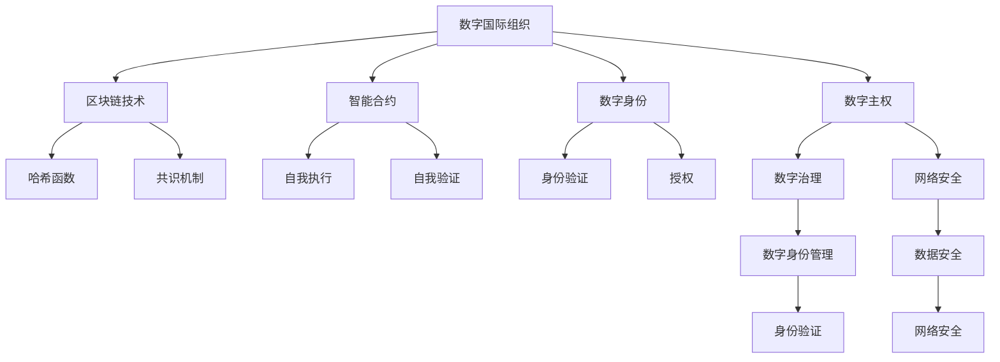

                 

# 2050年的全球治理：从数字国际组织到虚拟国家的全球政治格局重塑

## 1. 背景介绍

### 1.1 问题由来
随着数字技术的飞速发展，全球治理正经历前所未有的变革。特别是自新冠疫情爆发以来，各国在卫生、经济、环境等领域的合作日益紧密，对数字化、虚拟化治理的需求日益增加。然而，现有的全球治理框架和机制难以满足这些需求，亟需从传统实体形态向虚拟形态转变。在这一背景下，数字国际组织和虚拟国家应运而生，成为重塑全球政治格局的重要工具。

### 1.2 问题核心关键点
数字国际组织和虚拟国家的核心问题在于如何通过数字化手段，构建一个去中心化、透明、高效的全球治理体系。主要包括以下几个关键点：

1. **去中心化治理**：通过区块链、智能合约等技术，实现去中心化的治理决策和管理。
2. **透明公开**：利用区块链的不可篡改性，确保治理过程的透明性和公开性。
3. **高效协作**：通过数字工具和平台，实现跨国界、跨领域的实时协作和资源共享。
4. **虚拟国家**：基于数字身份和数字主权，构建虚拟国家，以适应数字化时代的国家治理需求。
5. **全球治理框架**：构建基于数字技术的全球治理框架，以应对全球性问题。

### 1.3 问题研究意义
研究数字国际组织和虚拟国家的构建方法，对于应对全球性挑战、促进国际合作、推动全球治理现代化具有重要意义：

1. 提高治理效率：数字国际组织和虚拟国家通过技术手段，可以大幅提升治理效率，实现快速响应和决策。
2. 促进国际合作：数字治理平台可以打破地理和文化的隔阂，促进跨国界的协作和信息共享。
3. 增强透明度和信任：通过区块链等技术，增强治理过程的透明度，提升各方信任度。
4. 应对全球性问题：虚拟国家可以在虚拟空间内应对气候变化、网络安全等全球性问题，推动全球治理创新。
5. 促进科技与政策的融合：数字治理技术的引入，将推动科技与政策的深度融合，激发更多治理创新。

## 2. 核心概念与联系

### 2.1 核心概念概述

为更好地理解数字国际组织和虚拟国家，本节将介绍几个密切相关的核心概念：

- **数字国际组织**：利用数字化手段构建的跨国、跨领域、跨文化的国际组织。主要通过互联网、区块链、人工智能等技术实现。
- **虚拟国家**：基于数字身份和数字主权构建的国家，通过数字技术实现国家治理。虚拟国家具有虚拟主权和实体治理的双重属性。
- **区块链技术**：一种去中心化的分布式账本技术，通过哈希函数、共识机制等保障数据安全性和不可篡改性。
- **智能合约**：在区块链上自动执行的合约，具有自我执行、自我验证的功能。
- **数字身份**：基于区块链和加密技术构建的数字身份，用于身份验证和授权。
- **数字主权**：国家在数字空间内的主权，包括数字身份管理、网络安全、数字治理等方面。

这些核心概念之间的逻辑关系可以通过以下Mermaid流程图来展示：



这个流程图展示了大语言模型的核心概念及其之间的关系：

1. 数字国际组织通过区块链和智能合约实现去中心化治理，利用数字身份和数字主权管理成员身份和治理权限。
2. 区块链通过哈希函数和共识机制保障数据安全性和不可篡改性。
3. 智能合约具有自我执行和自我验证功能，用于自动化治理决策。
4. 数字身份和数字主权是数字国家治理的基础，用于身份验证和授权。
5. 数字治理涵盖数字身份管理、网络安全等，保障国家治理的数字空间安全。

## 3. 核心算法原理 & 具体操作步骤
### 3.1 算法原理概述

数字国际组织和虚拟国家的构建，本质上是通过数字技术实现去中心化、透明化的治理过程。其核心算法原理主要包括以下几个方面：

- **去中心化治理算法**：通过区块链和智能合约技术，实现去中心化的治理决策和管理。主要基于分布式账本和共识机制，确保治理过程的公正性和透明性。
- **透明公开算法**：利用区块链的不可篡改性，实现治理过程的透明性和公开性。主要通过哈希函数和分布式账本技术，防止信息篡改和数据丢失。
- **高效协作算法**：通过数字工具和平台，实现跨国界、跨领域的实时协作和资源共享。主要基于分布式网络技术和实时通讯工具，促进信息交流和任务协作。
- **虚拟国家治理算法**：基于数字身份和数字主权，构建虚拟国家，实现国家治理的数字化。主要通过数字身份管理、网络安全、智能合约等技术，保障国家治理的数字化和智能化。

### 3.2 算法步骤详解

数字国际组织和虚拟国家的构建步骤大致包括以下几个关键步骤：

**Step 1: 准备区块链平台**
- 选择合适的区块链平台，如Ethereum、Hyperledger等，进行搭建。
- 定义智能合约模板，设计治理决策流程和规则。
- 部署智能合约，并进行初始化。

**Step 2: 创建数字身份**
- 利用区块链技术，创建数字身份和数字主权。
- 定义数字身份的权限和角色，如会员、管理者、监督者等。
- 生成数字证书，用于身份验证和授权。

**Step 3: 设计治理规则**
- 制定治理规则和决策流程，如共识机制、决策权限、投票规则等。
- 编写智能合约代码，实现治理规则的自动化执行。
- 进行智能合约的测试和调试，确保其正常运行。

**Step 4: 实施治理决策**
- 通过数字工具和平台，发布治理决策和任务。
- 成员通过数字身份参与治理决策，使用智能合约进行投票和执行。
- 实时监控治理过程，记录和验证决策结果。

**Step 5: 监测和审计**
- 利用区块链的不可篡改性，对治理过程进行监测和审计。
- 定期发布治理报告，公开治理决策和结果。
- 对违规行为进行调查和处理，确保治理公正性。

### 3.3 算法优缺点

数字国际组织和虚拟国家的构建方法具有以下优点：

- **去中心化**：通过区块链和智能合约技术，实现去中心化的治理决策，提升治理的公正性和透明性。
- **透明公开**：利用区块链的不可篡改性，确保治理过程的透明性和公开性，增强各方信任。
- **高效协作**：通过数字工具和平台，实现跨国界、跨领域的实时协作和资源共享，提高治理效率。
- **灵活性**：基于数字身份和数字主权，构建虚拟国家，适应数字化时代的国家治理需求，灵活应对各种治理场景。

同时，该方法也存在一些局限性：

- **技术依赖**：高度依赖区块链和智能合约等技术，技术门槛较高。
- **安全风险**：区块链和智能合约技术虽然安全，但仍然存在被攻击和篡改的风险。
- **法律和伦理问题**：数字身份和数字主权的法律和伦理问题仍需进一步明确，如数字主权的定义、数字身份的归属等。
- **标准化问题**：目前缺乏统一的数字治理标准和规范，不同平台和系统之间的互操作性较差。

### 3.4 算法应用领域

数字国际组织和虚拟国家的构建方法，在以下领域得到了广泛应用：

- **国际合作**：通过数字国际组织，实现跨国界的协作和信息共享，提升国际合作效率。
- **环境保护**：利用数字国际组织和虚拟国家，构建全球环境治理平台，促进各国在环境保护方面的合作。
- **公共卫生**：利用数字国际组织和虚拟国家，构建全球公共卫生治理平台，实现疫情监测和应急响应。
- **金融稳定**：通过数字国际组织和虚拟国家，构建全球金融治理平台，保障全球金融稳定。
- **网络安全**：利用数字国际组织和虚拟国家，构建全球网络安全治理平台，应对网络威胁。
- **数字主权**：通过虚拟国家，构建数字化主权体系，保障数字空间的国家安全。

除了上述这些经典应用外，数字国际组织和虚拟国家还被创新性地应用于更多场景中，如智能合约、分布式身份、跨链互操作等，为全球治理提供了新的技术手段。

## 4. 数学模型和公式 & 详细讲解  
### 4.1 数学模型构建

在数字国际组织和虚拟国家的构建过程中，涉及到大量的数学模型和公式。以下是几个关键的数学模型和公式：

- **共识算法**：如PoW（工作量证明）、PoS（权益证明）、DPoS（委托权益证明）等，用于保障区块链网络的共识和安全。
- **哈希函数**：如SHA-256、SHA-3等，用于确保区块链数据的不可篡改性和完整性。
- **智能合约**：利用Solidity等语言编写的代码，用于自动执行和验证治理决策。
- **分布式账本**：记录所有交易和状态的分布式数据库，确保数据的可靠性和一致性。

这些数学模型和公式是构建数字国际组织和虚拟国家的重要基础，通过理解这些模型和公式，可以更好地掌握数字治理的技术原理和实现方法。

### 4.2 公式推导过程

以下我们以PoW共识算法为例，推导其工作原理和关键公式。

**PoW共识算法**：

1. 矿工通过计算哈希函数解决一个数学难题（哈希碰撞）。
2. 第一个成功解决难题的矿工，将记录新区块并广播到网络中。
3. 其他矿工验证新区块，并通过共识机制确认其有效性。
4. 确认有效的新区块，将获得一定数量的数字货币奖励。

设新区块数量为 $n$，哈希碰撞难度为 $H$，每个区块奖励为 $R$。根据PoW算法，矿工计算新区块的平均耗时为 $T_{avg}$，求解难度为 $H$ 的数学难题的平均耗时为 $T_{solve}$。则：

$$
\begin{aligned}
T_{solve} &= H/T_{avg} \\
T_{avg} &= n \times T_{solve} \\
\end{aligned}
$$

将上述公式代入求解难度 $H$，得：

$$
H = \frac{T_{avg}}{n} = \frac{n \times T_{solve}}{n} = T_{solve}
$$

即，求解难度 $H$ 与新区块数量 $n$ 成正比，与平均耗时 $T_{avg}$ 成反比。

通过推导上述公式，可以理解PoW算法的核心原理，即通过哈希函数的计算复杂度，确保网络共识的安全性和区块链数据的完整性。

## 5. 项目实践：代码实例和详细解释说明
### 5.1 开发环境搭建

在进行数字国际组织和虚拟国家开发前，我们需要准备好开发环境。以下是使用Python进行Hyperledger Fabric开发的开发环境配置流程：

1. 安装Hyperledger Fabric：从官网下载并安装Hyperledger Fabric，用于构建数字国际组织和虚拟国家的区块链平台。
2. 安装Go语言：从官网下载并安装Go语言，用于编写智能合约和区块链客户端。
3. 安装Node.js：从官网下载并安装Node.js，用于构建数字国际组织的Web界面和应用。

完成上述步骤后，即可在Hyperledger Fabric环境中开始开发。

### 5.2 源代码详细实现

这里我们以构建一个简单的数字国际组织为例，给出使用Hyperledger Fabric进行开发的Pytho代码实现。

首先，定义智能合约：

```python
#! /usr/local/bin/python3
# -*- coding: utf-8 -*-

from hyperledger_fabric_sdk.py import User, Wallet
import hyperledger_fabric_sdk
import json
import hashlib

# 定义智能合约
def invoke(stub, chaincode_id, function, args):
    # 调用智能合约
    stub.execute_function(chaincode_id, function, args)

# 定义治理规则
def add_member(stub, member, role):
    # 添加成员
    if role == 'manager':
        role = 'Manager'
    elif role == 'supervisor':
        role = 'Supervisor'
    elif role == 'validator':
        role = 'Validator'
    else:
        role = 'Member'
    invoke(stub, 'myChaincode', 'addMember', [member, role])
```

然后，定义区块链客户端：

```python
# 区块链客户端
class Client:
    def __init__(self, peer, chaincode_name):
        self.peer = peer
        self.chaincode_name = chaincode_name
        self.response = None

    def get_state(self, chaincode_id, key):
        # 获取区块链状态
        response = stub.getState(chaincode_id, key)
        return response

    def put_state(self, chaincode_id, key, value):
        # 设置区块链状态
        response = stub.putState(chaincode_id, key, value)
        return response

    def invoke(self, chaincode_id, function, args):
        # 调用智能合约
        response = stub.invoke_function(chaincode_id, function, args)
        return response
```

最后，启动区块链网络：

```python
# 启动区块链网络
peer = 'localhost:7051'
client = Client(peer, 'myChaincode')
client.invoke('myChaincode', 'addMember', ['Alice', 'Manager'])
client.get_state('myChaincode', 'Alice')
```

以上就是使用Hyperledger Fabric构建数字国际组织的完整代码实现。可以看到，通过Python结合Hyperledger Fabric，可以轻松实现数字国际组织的构建和管理。

### 5.3 代码解读与分析

让我们再详细解读一下关键代码的实现细节：

**智能合约**：
- `add_member`函数：用于添加新成员和角色。在调用时，需要指定成员ID和角色，然后将信息传入智能合约进行处理。
- `invoke`函数：用于调用智能合约中的函数，实现治理决策。在调用时，需要指定链码ID、函数名和参数。

**区块链客户端**：
- `Client`类：封装了区块链客户端的常用操作，如获取状态、设置状态、调用智能合约等。
- `get_state`函数：用于获取区块链状态，将链码ID和键传入获取对应的值。
- `put_state`函数：用于设置区块链状态，将链码ID、键和值传入进行状态更新。
- `invoke`函数：用于调用智能合约，将链码ID、函数名和参数传入执行函数。

**区块链网络**：
- `peer`变量：定义了区块链网络的节点地址。
- `client`变量：创建了区块链客户端，用于与区块链网络进行交互。
- `invoke`函数：启动了区块链网络，并调用智能合约添加了新成员Alice。

可以看到，Hyperledger Fabric使得数字国际组织的构建和治理变得更加简单高效。开发者可以使用Python结合Hyperledger Fabric，快速构建和部署数字国际组织，实现去中心化、透明化的全球治理。

## 6. 实际应用场景
### 6.1 数字国际组织在环保中的应用

数字国际组织在环境保护领域的应用，为全球环境治理带来了新的解决方案。具体而言，可以构建一个全球性的环保治理平台，实现跨国界的环境数据共享和协同治理。

具体流程如下：
1. 各成员国将环境数据上传到数字国际组织平台，进行数据清洗和标准化。
2. 数字国际组织通过智能合约，实现数据的分布式存储和共享。
3. 各成员国可以实时获取环境数据，并根据数据进行决策和行动。
4. 数字国际组织通过区块链技术，确保数据的不可篡改性和透明性，增强各方信任。

通过数字国际组织平台，全球各国可以实时共享环境数据，协同应对环境问题，如气候变化、空气污染、水资源短缺等。这将大大提升环境治理的效率和效果。

### 6.2 数字国际组织在公共卫生中的应用

数字国际组织在公共卫生领域的应用，为全球公共卫生治理带来了新的可能性。具体而言，可以构建一个全球性的公共卫生治理平台，实现跨国界的疫情监测和应急响应。

具体流程如下：
1. 各成员国将疫情数据上传到数字国际组织平台，进行数据清洗和标准化。
2. 数字国际组织通过智能合约，实现数据的分布式存储和共享。
3. 各成员国可以实时获取疫情数据，并根据数据进行决策和行动。
4. 数字国际组织通过区块链技术，确保数据的不可篡改性和透明性，增强各方信任。

通过数字国际组织平台，全球各国可以实时共享疫情数据，协同应对公共卫生问题，如流行病、疫苗接种、医疗资源调配等。这将大大提升公共卫生治理的效率和效果。

### 6.3 数字国际组织在金融稳定中的应用

数字国际组织在金融稳定领域的应用，为全球金融治理带来了新的手段。具体而言，可以构建一个全球性的金融治理平台，实现跨国界的金融数据共享和协同监管。

具体流程如下：
1. 各成员国将金融数据上传到数字国际组织平台，进行数据清洗和标准化。
2. 数字国际组织通过智能合约，实现数据的分布式存储和共享。
3. 各成员国可以实时获取金融数据，并根据数据进行决策和行动。
4. 数字国际组织通过区块链技术，确保数据的不可篡改性和透明性，增强各方信任。

通过数字国际组织平台，全球各国可以实时共享金融数据，协同应对金融风险，如跨国洗钱、金融诈骗、市场操纵等。这将大大提升金融治理的效率和效果。

### 6.4 未来应用展望

随着数字国际组织和虚拟国家的不断发展，其在未来将具有更广泛的应用前景：

1. **全球治理平台**：构建基于区块链的数字国际组织，实现全球治理的数字化和透明化。
2. **跨国界协作**：通过智能合约和分布式账本，实现跨国界的实时协作和信息共享。
3. **数据治理**：利用区块链技术，保障数据的不可篡改性和透明性，增强治理信任。
4. **新兴技术应用**：引入物联网、人工智能等新兴技术，提升治理效率和效果。
5. **虚拟国家治理**：构建虚拟国家，实现国家治理的数字化和智能化。
6. **全球治理标准**：制定数字国际组织的统一标准和规范，促进各平台之间的互操作性。

## 7. 工具和资源推荐
### 7.1 学习资源推荐

为了帮助开发者系统掌握数字国际组织和虚拟国家的构建方法，这里推荐一些优质的学习资源：

1. 《Hyperledger Fabric官方文档》：Hyperledger Fabric的官方文档，提供了详细的技术指南和样例代码，是学习数字国际组织和虚拟国家的重要资料。
2. 《区块链技术指南》：介绍区块链技术的基本原理和应用场景，适合初学者入门。
3. 《智能合约编程指南》：介绍智能合约的编写方法和最佳实践，是构建数字国际组织的必备技能。
4. 《Hyperledger Fabric实战教程》：通过实践案例，深入讲解Hyperledger Fabric的使用和开发，适合进阶学习。
5. 《数字国家治理指南》：介绍数字国家治理的基本概念和实践案例，是构建虚拟国家的重要参考。

通过对这些资源的学习实践，相信你一定能够快速掌握数字国际组织和虚拟国家的构建方法，并用于解决实际的全球治理问题。
###  7.2 开发工具推荐

高效的开发离不开优秀的工具支持。以下是几款用于数字国际组织和虚拟国家开发的常用工具：

1. Hyperledger Fabric：由IBM主导开发的区块链平台，适合构建数字国际组织和虚拟国家。
2. Solidity：以太坊智能合约的编写语言，适合编写区块链上的智能合约。
3. Web3.js：以太坊的JavaScript库，适合开发基于区块链的Web应用。
4. WebAssembly：用于在浏览器中运行加密和智能合约的代码，适合构建分布式应用。
5. Go语言：适合编写区块链客户端和智能合约，性能优异。
6. Node.js：适合开发基于区块链的Web应用和API接口，灵活性高。

合理利用这些工具，可以显著提升数字国际组织和虚拟国家开发效率，加快创新迭代的步伐。

### 7.3 相关论文推荐

数字国际组织和虚拟国家的构建技术源于学界的持续研究。以下是几篇奠基性的相关论文，推荐阅读：

1. "The Architecture of a Blockchain-Based Digital International Organization"（区块链数字国际组织架构）
2. "A Decentralized Governance Model for Smart Contracts"（智能合约的分布式治理模型）
3. "Smart Contract Governance in Blockchain"（区块链中的智能合约治理）
4. "Blockchain Technology and Its Applications in Digital Governance"（区块链技术在数字治理中的应用）
5. "The Future of Digital Governance: From AI to Virtual States"（数字治理的未来：从AI到虚拟国家）

这些论文代表了大语言模型微调技术的发展脉络。通过学习这些前沿成果，可以帮助研究者把握学科前进方向，激发更多的创新灵感。

## 8. 总结：未来发展趋势与挑战
### 8.1 总结

本文对数字国际组织和虚拟国家的构建方法进行了全面系统的介绍。首先阐述了数字国际组织和虚拟国家的研究背景和意义，明确了其在去中心化、透明化、高效协作等方面具有的独特优势。其次，从原理到实践，详细讲解了数字国际组织和虚拟国家的数学模型和关键算法，给出了构建过程的完整代码实例。同时，本文还广泛探讨了数字国际组织在环保、公共卫生、金融稳定等多个领域的应用前景，展示了其在全球治理中的巨大潜力。此外，本文精选了数字国际组织的各类学习资源，力求为读者提供全方位的技术指引。

通过本文的系统梳理，可以看到，数字国际组织和虚拟国家正在成为全球治理的重要工具，极大地提升了治理效率和透明度，推动了全球治理的现代化进程。未来，伴随数字技术的发展，数字国际组织和虚拟国家必将在更广泛的领域得到应用，为全球治理带来新的变革。

### 8.2 未来发展趋势

展望未来，数字国际组织和虚拟国家的发展趋势主要包括以下几个方面：

1. **技术融合**：将区块链、人工智能、物联网等技术进行深度融合，提升治理效率和效果。
2. **标准化建设**：制定统一的治理标准和规范，促进各平台之间的互操作性。
3. **法律和伦理**：加强数字国际组织的法律和伦理建设，保障治理的合法性和公平性。
4. **虚拟国家的崛起**：虚拟国家将在虚拟空间内实现国家治理，成为未来国家治理的重要形式。
5. **数据治理**：利用区块链技术，保障数据的不可篡改性和透明性，增强治理信任。
6. **新兴技术应用**：引入新兴技术，如量子计算、分布式账本等，提升治理的科技水平。

以上趋势凸显了数字国际组织和虚拟国家的广阔前景。这些方向的探索发展，必将进一步提升全球治理的效率和公平性，推动人类社会向更加智能化、数字化方向发展。

### 8.3 面临的挑战

尽管数字国际组织和虚拟国家的构建技术已经取得了瞩目成就，但在迈向更加智能化、普适化应用的过程中，它仍面临着诸多挑战：

1. **技术门槛高**：数字国际组织和虚拟国家的构建需要具备较高的技术水平，需要大量的区块链和智能合约开发经验。
2. **安全风险高**：区块链和智能合约技术虽然安全，但仍然存在被攻击和篡改的风险。
3. **法律和伦理问题**：数字身份和数字主权的法律和伦理问题仍需进一步明确，如数字主权的定义、数字身份的归属等。
4. **标准化问题**：目前缺乏统一的数字治理标准和规范，不同平台和系统之间的互操作性较差。
5. **法律和合规问题**：数字国际组织和虚拟国家需要遵守各国的法律法规和国际条约，处理法律和合规问题较为复杂。

### 8.4 研究展望

面对数字国际组织和虚拟国家所面临的挑战，未来的研究需要在以下几个方面寻求新的突破：

1. **技术优化**：开发更加高效、安全的区块链和智能合约技术，提升治理效率和安全性。
2. **法律和伦理建设**：明确数字身份和数字主权的法律和伦理问题，保障治理的合法性和公平性。
3. **标准化建设**：制定统一的治理标准和规范，促进各平台之间的互操作性。
4. **新兴技术应用**：引入新兴技术，如量子计算、分布式账本等，提升治理的科技水平。
5. **多边协作**：加强国际合作，制定数字治理的全球性战略和政策，促进各国的协同治理。

这些研究方向的探索，必将引领数字国际组织和虚拟国家走向成熟，为全球治理带来新的变革。面向未来，数字国际组织和虚拟国家需要与其他治理手段协同发力，共同推动全球治理的进步。

## 9. 附录：常见问题与解答
**Q1：数字国际组织和虚拟国家是否适用于所有领域？**

A: 数字国际组织和虚拟国家在大多数领域具有广泛的应用前景，但对于一些特定领域，如军事、外交等，可能存在技术和管理上的局限。此外，对于需要高度物理现实交互的领域，如司法、警察等，数字治理可能仍面临挑战。因此，需要根据具体场景进行选择和设计。

**Q2：如何降低数字国际组织和虚拟国家的技术门槛？**

A: 通过引入区块链和智能合约的标准化工具和平台，如Hyperledger Fabric、Ethereum等，可以显著降低技术门槛。此外，开发简单易用的开发框架和教程，也可以帮助开发者快速上手。同时，政府和企业应加强对数字治理技术人才的培养，提升全社会的技术水平。

**Q3：数字国际组织和虚拟国家如何应对安全风险？**

A: 采用多层安全机制，如身份验证、权限管理、加密存储等，确保数据的安全性和隐私性。引入区块链的共识机制和智能合约的自我执行功能，防止数据篡改和攻击。定期进行安全审计和漏洞扫描，及时发现和修复安全问题。

**Q4：如何提升数字国际组织和虚拟国家的法律和伦理保障？**

A: 制定数字治理的法律法规和伦理规范，明确数字身份和数字主权的法律地位。建立数字治理的监督和监管机制，确保治理的合法性和公正性。加强国际合作，制定全球性的数字治理标准和规范，促进各国协同治理。

**Q5：数字国际组织和虚拟国家如何应对标准化问题？**

A: 加强国际合作，制定统一的治理标准和规范，促进各平台之间的互操作性。开发标准化工具和平台，如Hyperledger Fabric、Ethereum等，降低标准化难度。引入新兴技术，如量子计算、分布式账本等，提升治理的科技水平。

正视数字国际组织和虚拟国家所面临的这些挑战，积极应对并寻求突破，将是大语言模型微调走向成熟的必由之路。相信随着学界和产业界的共同努力，这些挑战终将一一被克服，数字国际组织和虚拟国家必将在构建人机协同的智能时代中扮演越来越重要的角色。

---

作者：禅与计算机程序设计艺术 / Zen and the Art of Computer Programming

