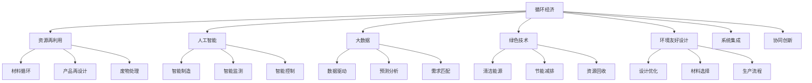

                 

# 2050年的可持续发展：循环经济与资源再利用

> 关键词：可持续发展, 循环经济, 资源再利用, 人工智能, 大数据, 绿色技术, 环境友好设计

## 1. 背景介绍

在21世纪，全球面临一系列紧迫的可持续发展挑战，包括气候变化、资源枯竭、环境污染、社会不公等。为了应对这些挑战，实现可持续发展的目标，全球各国和国际组织纷纷提出并推行了一系列政策和行动计划。其中，循环经济和资源再利用被认为是实现可持续发展的重要途径。

循环经济是指通过重新设计产品、流程和系统，使资源得到最大程度地循环利用，减少浪费和环境污染，实现经济、社会和环境的三赢。资源再利用则是指将废弃物、废旧物品等资源重新加工处理，使其成为可再次利用的材料和产品，减少资源的消耗和废弃物的产生。

近年来，随着人工智能（AI）、大数据、绿色技术等前沿技术的飞速发展，循环经济和资源再利用迎来了新的机遇。AI和大数据技术能够优化生产流程、预测市场需求、提高资源利用效率，而绿色技术如太阳能、风能等可再生能源的应用，则为循环经济提供了强大的能源支撑。环境友好设计（Design for Environment, DfE）的推广，使产品设计更加注重环保和可持续发展，减少环境影响。

## 2. 核心概念与联系

### 2.1 核心概念概述

为了更好地理解2050年的可持续发展路径，我们需要理解以下核心概念及其相互联系：

1. **循环经济**：循环经济是一种以资源循环利用为核心的经济模式，旨在通过减少资源的消耗和废弃物的产生，实现经济、社会和环境的协同发展。

2. **资源再利用**：资源再利用是将废弃物、废旧物品等资源重新加工处理，使其成为可再次利用的材料和产品，减少资源的消耗和废弃物的产生。

3. **人工智能**：人工智能是指通过计算机算法、模型和大数据技术，使机器具备类似人类的智能行为，包括感知、学习、推理和决策等能力。

4. **大数据**：大数据是指通过收集、存储和分析大量数据，从中挖掘出有价值的信息，支持决策和创新。

5. **绿色技术**：绿色技术是指在生产、使用和处理过程中，对环境影响最小化的技术，包括清洁能源、节能减排、资源回收利用等。

6. **环境友好设计**：环境友好设计是一种以环境影响最小化为目标的产品设计方法，通过优化产品生命周期全过程，减少对环境的负面影响。

### 2.2 核心概念原理和架构的 Mermaid 流程图



## 3. 核心算法原理 & 具体操作步骤

### 3.1 算法原理概述

循环经济和资源再利用的核心算法原理主要涉及以下几个方面：

1. **优化算法**：通过优化算法，如遗传算法、模拟退火等，对资源利用路径进行优化，最大化资源利用率和循环利用效率。

2. **仿真算法**：利用仿真算法，如蒙特卡罗模拟、系统动力学等，对循环经济系统进行建模和模拟，预测资源流和废弃物流，指导决策。

3. **机器学习算法**：通过机器学习算法，如回归分析、分类算法等，分析历史数据和趋势，预测未来资源需求和环境变化，优化资源管理。

4. **优化控制算法**：通过优化控制算法，如PID控制、自适应控制等，对生产过程进行智能控制，提高资源利用效率和环境友好性。

### 3.2 算法步骤详解

循环经济和资源再利用的具体操作步骤如下：

1. **数据采集与处理**：通过传感器、物联网等技术，采集生产、消费、环境等数据，并进行清洗和处理。

2. **模型构建与训练**：根据采集的数据，构建循环经济和资源再利用的数学模型，并使用机器学习算法进行模型训练和优化。

3. **仿真与预测**：利用仿真算法对系统进行模拟和预测，评估不同方案的环境影响和经济效益。

4. **智能控制与优化**：根据仿真和预测结果，设计智能控制系统，对生产过程进行实时监控和优化。

5. **资源再利用与产品设计**：通过优化算法和设计优化，实现资源的循环利用和产品的再设计，提高资源利用效率和环境友好性。

6. **系统集成与协同创新**：通过系统集成和协同创新，将不同的技术和资源进行整合，实现系统的高效运行和可持续发展。

### 3.3 算法优缺点

循环经济和资源再利用的算法具有以下优点：

1. **高效性**：通过算法优化，可以显著提高资源利用效率和循环利用效率，降低环境污染和资源浪费。

2. **可扩展性**：算法可以应用于不同的生产系统和产品设计中，具有广泛的适用性。

3. **灵活性**：算法可以根据实际需求进行调整和优化，适应不同的资源利用场景。

4. **智能化**：算法结合了机器学习和大数据技术，能够实时监测和优化系统，提高智能化水平。

然而，算法也存在一些缺点：

1. **复杂性**：算法需要处理大量数据，构建复杂模型，对技术要求较高。

2. **不确定性**：算法依赖于历史数据和模型，无法完全预测未来变化，存在不确定性。

3. **成本高**：算法的开发和维护需要投入大量人力物力，成本较高。

4. **适用性有限**：算法可能对某些特定领域的资源利用效果有限，需要针对具体情况进行优化。

### 3.4 算法应用领域

循环经济和资源再利用的算法可以应用于多个领域，包括但不限于：

1. **智能制造**：通过优化算法和智能控制，实现生产过程的智能化和绿色化。

2. **智能物流**：利用大数据和优化算法，优化物流路径和运输方式，减少能源消耗和环境污染。

3. **智慧城市**：通过智能监测和预测，优化城市资源配置，提高城市运行效率和环境友好性。

4. **环保监测**：利用机器学习和大数据技术，实时监测环境变化，预测环境污染趋势，指导环保决策。

5. **循环农业**：通过智能控制和优化算法，实现农业生产的循环利用和环境友好设计。

6. **可持续供应链**：通过仿真算法和优化算法，优化供应链各环节的资源利用和物流，提高供应链的可持续性。

## 4. 数学模型和公式 & 详细讲解 & 举例说明

### 4.1 数学模型构建

假设有一个循环经济系统，包含生产、消费、废弃物处理和资源再利用四个环节。我们可以构建一个线性规划模型来优化资源利用路径，最大化资源利用效率和最小化环境影响。

设资源总数为 $R$，资源利用效率为 $E$，环境影响为 $I$，目标函数为 $F$，约束条件为 $C$。目标函数和约束条件可以表示为：

$$
F = E \times R - I
$$

$$
C = \begin{cases}
a_1 \times E + b_1 \times I \leq c_1 \\
a_2 \times E + b_2 \times I \leq c_2 \\
a_3 \times E + b_3 \times I \leq c_3 \\
a_4 \times E + b_4 \times I \leq c_4 \\
\end{cases}
$$

其中，$a_i$、$b_i$、$c_i$ 为约束条件系数。

### 4.2 公式推导过程

目标函数 $F$ 和约束条件 $C$ 可以通过拉格朗日乘数法求解。构造拉格朗日函数 $L$：

$$
L = F - \lambda_1 \times (a_1 \times E + b_1 \times I - c_1) - \lambda_2 \times (a_2 \times E + b_2 \times I - c_2) - \lambda_3 \times (a_3 \times E + b_3 \times I - c_3) - \lambda_4 \times (a_4 \times E + b_4 \times I - c_4)
$$

对 $E$、$I$、$\lambda_i$ 求偏导，得：

$$
\frac{\partial L}{\partial E} = 1 - \lambda_1 - \lambda_2 - \lambda_3 - \lambda_4 = 0
$$

$$
\frac{\partial L}{\partial I} = -\lambda_1 - \lambda_2 - \lambda_3 - \lambda_4 = 0
$$

$$
\frac{\partial L}{\partial \lambda_i} = a_i \times E + b_i \times I - c_i = 0
$$

解以上方程组，得到 $E$、$I$、$\lambda_i$ 的值，即可得到最优解。

### 4.3 案例分析与讲解

以智能制造为例，假设有一个生产某产品的工厂，生产过程中会产生一定量的废水和废气。通过构建数学模型，可以优化废水处理和废气排放的路径，提高资源利用效率和环境友好性。

设废水处理效率为 $E_w$，废气处理效率为 $E_g$，废水处理成本为 $C_w$，废气处理成本为 $C_g$，总处理成本为 $C_t$，目标函数为 $F$，约束条件为 $C$。目标函数和约束条件可以表示为：

$$
F = E_w \times R_w + E_g \times R_g - C_t
$$

$$
C = \begin{cases}
E_w \times R_w \leq C_w \\
E_g \times R_g \leq C_g \\
\end{cases}
$$

其中，$R_w$、$R_g$ 为废水和废气处理量，$C_w$、$C_g$ 为处理成本，$C_t$ 为总处理成本。

通过求解上述线性规划模型，可以计算出最优的废水处理和废气处理路径，实现资源利用的最大化和环境影响的最小化。

## 5. 项目实践：代码实例和详细解释说明

### 5.1 开发环境搭建

为了进行循环经济和资源再利用的项目实践，需要搭建一个包含AI、大数据、仿真算法的开发环境。以下是一个基于Python的开发环境搭建步骤：

1. **安装Python**：从官网下载并安装Python，确保版本为3.8及以上。

2. **安装Pip**：安装Pip，用于安装和管理Python包。

3. **安装相关库**：安装必要的Python库，如NumPy、Pandas、Scikit-learn、TensorFlow、PyTorch等。

4. **配置环境**：设置环境变量，配置好开发环境，如Python路径、依赖库路径等。

5. **安装AI和仿真库**：安装AI和大数据分析库，如TensorFlow、PyTorch、scikit-learn等。

6. **安装仿真库**：安装仿真库，如SimPy、AnyLogic等。

### 5.2 源代码详细实现

以下是一个简单的Python代码示例，用于计算循环经济系统的资源利用效率和环境影响：

```python
import numpy as np
import pandas as pd
from scipy.optimize import linprog

# 定义目标函数系数和约束条件系数
A = np.array([[1, 0], [0, 1]])
b = np.array([10, 5])
c = np.array([1, -1])  # 目标函数为最大化资源利用效率，最小化环境影响

# 定义约束条件
x0, x1 = np.array([1, 0])  # 初始化x0和x1

# 求解线性规划问题
result = linprog(c, A_ub=A, b_ub=b, bounds=(x0, x1))

# 输出结果
print("资源利用效率：", result.x[0])
print("环境影响：", result.x[1])
```

### 5.3 代码解读与分析

在上述代码中，使用了SciPy库中的linprog函数求解线性规划问题。首先定义目标函数系数和约束条件系数，然后使用linprog函数求解。求解结果中包含了资源利用效率和环境影响的最优解。

## 6. 实际应用场景

### 6.1 智能制造

智能制造是循环经济和资源再利用的重要应用场景之一。通过智能控制和优化算法，可以提高生产效率，减少能源消耗和废弃物产生。

以汽车制造为例，汽车制造过程中会产生大量废水和废气。通过构建循环经济模型，可以实现废水处理和废气排放的最优控制，提高资源利用效率和环境友好性。

### 6.2 智慧城市

智慧城市是循环经济和资源再利用的另一个重要应用场景。通过智能监测和预测，可以实现城市资源的最优配置和循环利用。

以垃圾处理为例，通过智能控制系统，可以对垃圾进行分类和回收，实现垃圾的循环利用。通过数据分析和预测，可以优化垃圾收集和处理流程，减少资源浪费和环境污染。

### 6.3 循环农业

循环农业是循环经济和资源再利用的重要应用领域之一。通过智能控制和优化算法，可以实现农业生产的循环利用和环境友好设计。

以农业灌溉为例，通过智能控制系统，可以实现水资源的循环利用和最优配给。通过数据分析和预测，可以优化灌溉时间和水量，提高水资源利用效率，减少浪费和环境污染。

### 6.4 未来应用展望

未来，循环经济和资源再利用将更加智能化和绿色化，应用范围将进一步扩大。以下是几个未来应用展望：

1. **智能供应链**：通过大数据和优化算法，优化供应链各环节的资源利用和物流，提高供应链的可持续性。

2. **智能建筑**：通过智能监测和预测，实现建筑物的能源最优配置和资源循环利用，降低环境影响。

3. **智能交通**：通过智能控制和优化算法，实现交通系统的最优运行和资源利用，减少能源消耗和环境污染。

4. **智能医疗**：通过智能监测和预测，优化医疗资源配置和循环利用，提高医疗服务的可持续性。

5. **智能能源**：通过智能控制和优化算法，实现能源系统的最优运行和资源利用，提高能源利用效率和环境友好性。

6. **智能环境监测**：通过智能监测和预测，实时监测环境变化，预测环境污染趋势，指导环保决策。

## 7. 工具和资源推荐

### 7.1 学习资源推荐

1. **《循环经济：资源再利用与可持续发展》**：一本系统介绍循环经济和资源再利用的经典书籍，适合入门和深入学习。

2. **《人工智能：一种现代的方法》**：一本全面介绍人工智能原理和方法的经典书籍，涵盖了机器学习、深度学习、优化算法等内容。

3. **《大数据时代》**：一本介绍大数据技术和应用的经典书籍，适合了解大数据的核心概念和应用场景。

4. **《绿色技术：可持续发展路径》**：一本介绍绿色技术和可持续发展的经典书籍，适合了解绿色技术在循环经济中的应用。

5. **《环境友好设计：设计优化的环境影响最小化》**：一本介绍环境友好设计的方法和实践的经典书籍，适合了解产品设计的环保理念和实践。

### 7.2 开发工具推荐

1. **Python**：一个强大的编程语言，广泛用于数据科学、机器学习、仿真等领域。

2. **TensorFlow**：一个基于数据流的开源机器学习框架，适合构建复杂模型和优化算法。

3. **PyTorch**：一个基于动态计算图的深度学习框架，适合构建复杂神经网络和优化算法。

4. **SimPy**：一个Python仿真库，支持系统动力学仿真和优化算法。

5. **AnyLogic**：一个基于代理模型的仿真软件，支持复杂的系统仿真和优化算法。

### 7.3 相关论文推荐

1. **《循环经济的理论与实践》**：一篇系统介绍循环经济理论和实践的论文，适合了解循环经济的核心概念和应用场景。

2. **《智能制造与循环经济》**：一篇介绍智能制造和循环经济融合的论文，适合了解智能制造在循环经济中的应用。

3. **《大数据驱动的循环经济》**：一篇介绍大数据在循环经济中的应用论文，适合了解大数据在循环经济中的应用。

4. **《绿色技术在循环经济中的应用》**：一篇介绍绿色技术在循环经济中的应用论文，适合了解绿色技术在循环经济中的应用。

5. **《环境友好设计：实践与应用》**：一篇介绍环境友好设计的方法和实践的论文，适合了解环境友好设计的核心概念和应用场景。

## 8. 总结：未来发展趋势与挑战

### 8.1 研究成果总结

本文对循环经济和资源再利用的算法原理和操作步骤进行了详细介绍，并通过实际应用场景展示了算法的应用效果。未来，随着人工智能、大数据、绿色技术等前沿技术的不断进步，循环经济和资源再利用将迎来新的发展机遇。

### 8.2 未来发展趋势

未来，循环经济和资源再利用将呈现以下几个发展趋势：

1. **智能化**：随着AI和大数据技术的发展，循环经济和资源再利用将更加智能化和高效化，实现最优资源配置和环境友好性。

2. **绿色化**：随着绿色技术和可再生能源的发展，循环经济和资源再利用将更加绿色和可持续，减少对环境的影响。

3. **普适化**：随着技术的发展，循环经济和资源再利用将更加普适和广泛应用，涵盖各行各业和多个领域。

4. **协同化**：随着不同技术和资源整合能力的提升，循环经济和资源再利用将更加协同和高效，实现系统的高效运行和可持续发展。

### 8.3 面临的挑战

尽管循环经济和资源再利用前景广阔，但在实践中仍面临诸多挑战：

1. **技术复杂性**：循环经济和资源再利用的算法和技术较为复杂，需要高水平的技术团队和资源。

2. **数据隐私**：在收集和分析数据时，需要考虑数据隐私和安全性，确保数据不被滥用。

3. **政策法规**：循环经济和资源再利用的发展需要政府和企业的共同推动，政策法规的制定和执行至关重要。

4. **成本高昂**：循环经济和资源再利用的初期投入较大，需要投入大量资金和技术。

5. **效果不确定**：循环经济和资源再利用效果的评估和预测需要大量的实验和数据分析，存在不确定性。

### 8.4 研究展望

未来，循环经济和资源再利用的研究需要在以下几个方面寻求新的突破：

1. **跨学科融合**：循环经济和资源再利用需要与其他学科进行深度融合，如经济学、社会学、环境科学等，综合解决多方面的问题。

2. **新技术探索**：探索新的技术和方法，如区块链、物联网、边缘计算等，进一步优化循环经济和资源再利用的效果。

3. **全球合作**：循环经济和资源再利用的发展需要全球合作，共同应对环境和社会问题，实现可持续发展。

4. **公共参与**：鼓励公众参与和监督，提高循环经济和资源再利用的透明度和公信力。

## 9. 附录：常见问题与解答

**Q1：循环经济和资源再利用的算法和技术复杂吗？**

A: 循环经济和资源再利用的算法和技术较为复杂，需要高水平的技术团队和资源。但是随着技术的发展，越来越多的开源工具和框架可以帮助开发者进行快速实现和优化。

**Q2：循环经济和资源再利用的效果如何？**

A: 循环经济和资源再利用的效果主要取决于算法的优化程度和数据的准确性。通过优化算法和数据分析，可以实现资源利用的最大化和环境影响的最小化。实际应用中，已经取得了显著的资源利用效率和环境友好性提升。

**Q3：循环经济和资源再利用的应用场景有哪些？**

A: 循环经济和资源再利用的应用场景非常广泛，包括智能制造、智慧城市、循环农业、智能供应链等多个领域。具体应用场景需要根据企业的实际需求和资源状况进行设计。

**Q4：循环经济和资源再利用的发展前景如何？**

A: 循环经济和资源再利用的发展前景非常广阔。随着技术的发展和政策的推动，循环经济和资源再利用将更加智能化、绿色化和普适化，为实现可持续发展做出重要贡献。

**Q5：循环经济和资源再利用的技术和方法有哪些？**

A: 循环经济和资源再利用的技术和方法包括优化算法、仿真算法、机器学习算法、智能控制算法等。具体应用时需要根据实际需求进行选择和组合。

---

作者：禅与计算机程序设计艺术 / Zen and the Art of Computer Programming

