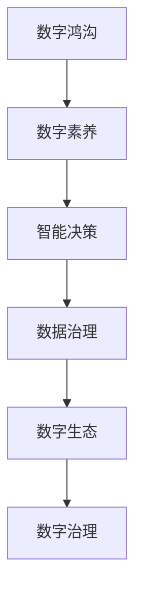

                 

# 2050年的数字经济：从数字红利到数字包容的经济增长新动能

## 1. 背景介绍

### 1.1 数字经济的崛起与演化

随着互联网技术的迅猛发展和智能手机的普及，数字经济在全球范围内兴起。从2005年到2020年，全球数字经济规模已经从不到3万亿美元增长至16万亿美元。2021年，中国数字经济规模达到45.5万亿元人民币，占GDP的39.8%，成为全球最大数字经济体。

数字经济正迅速塑造未来经济形态，各国政府和企业都在争相探索新的增长动力。数字红利——即通过技术进步所创造的附加价值——已开始显现。但与此同时，数字经济也存在一些挑战，如数字鸿沟、数据隐私保护、网络安全等问题。

为了实现更广泛、更公平的数字包容，迎接未来经济增长新动能，我们需要重新审视和提升数字经济的治理体系。在2050年的数字化愿景下，我们期待将数字红利转化为可持续的数字包容，为全社会创造更大的增长潜力。

### 1.2 数字经济的发展趋势

未来数字经济的发展趋势主要集中在以下几个方面：

1. **数据驱动的决策**：以数据为中心，构建智能决策模型，提高决策效率和准确性。
2. **智能生态系统**：形成以AI、大数据、云计算等为核心的智能生态系统，实现智能化生产、管理和运营。
3. **数字治理**：提升数据治理和隐私保护能力，建立完善的数字经济治理框架。
4. **跨界融合**：推动信息技术与其他行业深度融合，催生新的产业和商业模式。
5. **数字化普惠**：通过技术手段，实现普惠金融、教育、医疗等领域的数字化转型。
6. **可持续增长**：在数字化转型过程中，注重环境、社会和治理（ESG），实现可持续发展。

### 1.3 数字包容的概念和重要性

数字包容（Digital Inclusion）指的是确保所有群体，特别是处于数字鸿沟中的群体，都能公平访问数字资源，并从中受益。数字包容是实现社会公平、经济增长的关键。它不仅涉及技术的普及，还涵盖了教育、就业、公共服务等方面，是构建包容性社会的重要基石。

## 2. 核心概念与联系

### 2.1 核心概念概述

- **数字鸿沟（Digital Divide）**：指不同群体在数字技术和互联网接入方面的差距。
- **数字素养（Digital Literacy）**：指个体理解和运用数字技术的能力。
- **智能决策（Smart Decision-making）**：利用大数据、AI等技术，优化决策过程，提升决策质量。
- **数据治理（Data Governance）**：确保数据的收集、处理、存储和使用符合伦理、法律和隐私保护要求。
- **数字生态（Digital Ecosystem）**：由企业、政府、消费者等组成的网络，通过协同合作实现共同利益。
- **数字治理（Digital Governance）**：通过技术手段提升政府治理效率，增强透明度和公信力。

### 2.2 核心概念原理和架构的 Mermaid 流程图



这个流程图展示了数字鸿沟、数字素养、智能决策、数据治理、数字生态和数字治理之间的逻辑联系。从数字鸿沟到数字素养，从智能决策到数据治理，再到数字生态和数字治理，这些核心概念共同构成了数字经济的核心架构。

### 2.3 核心概念的联系

- **数字鸿沟和数字素养**：数字鸿沟的存在导致一部分人群无法有效使用数字技术，因此提升数字素养是缩小数字鸿沟的关键。
- **智能决策和数据治理**：智能决策依赖于高质量的数据，数据治理则确保数据的安全、可靠和合规。
- **数字生态和数字治理**：数字生态通过协同合作创造价值，而数字治理则确保这种合作是公平和透明的。

## 3. 核心算法原理 & 具体操作步骤

### 3.1 算法原理概述

数字经济的核心算法包括但不限于以下几个方面：

- **数据挖掘和分析算法**：用于发现数据中的模式和关联，支持智能决策和数据治理。
- **机器学习与深度学习算法**：用于模型训练和预测，提升决策效率和准确性。
- **自然语言处理（NLP）算法**：用于理解和处理文本数据，优化智能生态系统。
- **区块链算法**：用于确保数据安全、透明和不可篡改，增强数字治理能力。

这些算法构成了数字经济的技术基础，是实现从数字红利到数字包容转型的关键工具。

### 3.2 算法步骤详解

以智能决策算法为例，其步骤大致如下：

1. **数据收集与预处理**：收集和清洗数据，确保数据的质量和完整性。
2. **模型构建与训练**：选择合适的算法模型，使用历史数据进行训练。
3. **模型验证与优化**：在验证集上评估模型性能，使用超参数调优等方法提高模型精度。
4. **部署与应用**：将训练好的模型部署到生产环境，进行实时预测和决策。

### 3.3 算法优缺点

**优点**：
- 自动化、高效性：算法可以自动处理大量数据，提高决策效率。
- 高精度：通过复杂算法模型，可以实现高精度的预测和决策。
- 普适性：算法可以应用于多种场景，具有广泛的适用性。

**缺点**：
- 数据依赖：算法的性能高度依赖于数据质量。
- 复杂性：算法的实现和维护相对复杂，需要专业知识和技能。
- 解释性：一些算法模型（如深度学习）的决策过程难以解释，缺乏透明度。

### 3.4 算法应用领域

智能决策算法广泛应用于金融、零售、医疗、物流等多个领域。例如，在金融领域，利用智能决策算法进行风险评估和投资决策；在零售领域，使用算法优化库存管理和个性化推荐；在医疗领域，通过算法分析患者数据，提供精准治疗方案。

## 4. 数学模型和公式 & 详细讲解 & 举例说明

### 4.1 数学模型构建

数字经济中的许多问题都可以通过数学模型来描述和解决。例如，使用回归模型来预测销售量，使用分类模型来识别用户行为，使用聚类模型来分组用户。

以回归模型为例，其数学模型可以表示为：

$$
y = \beta_0 + \beta_1 x_1 + \beta_2 x_2 + \ldots + \beta_n x_n + \epsilon
$$

其中，$y$ 为因变量，$\beta_0$ 为截距，$\beta_1, \beta_2, \ldots, \beta_n$ 为自变量的系数，$x_1, x_2, \ldots, x_n$ 为自变量，$\epsilon$ 为误差项。

### 4.2 公式推导过程

以线性回归为例，求解模型参数的过程如下：

1. **最小二乘法**：求得损失函数 $L = \sum_{i=1}^n (y_i - \hat{y}_i)^2$，其中 $\hat{y}_i = \beta_0 + \beta_1 x_{1i} + \beta_2 x_{2i} + \ldots + \beta_n x_{ni}$。
2. **梯度下降**：通过计算损失函数对参数的偏导数，更新模型参数 $\beta_0, \beta_1, \beta_2, \ldots, \beta_n$。

### 4.3 案例分析与讲解

假设我们有一个电商平台，希望通过智能决策算法预测销售额。我们可以使用线性回归模型，其中销售额为因变量，广告预算、季节性因素等作为自变量。通过模型训练和验证，可以得到销售额的预测值，进一步优化广告预算分配，提升销售效果。

## 5. 项目实践：代码实例和详细解释说明

### 5.1 开发环境搭建

要实现上述线性回归模型，首先需要搭建好Python开发环境，包括安装必要的库和工具。

1. **安装Python**：从官网下载并安装Python 3.x版本。
2. **安装必要的库**：
   ```bash
   pip install numpy pandas scikit-learn matplotlib seaborn
   ```

### 5.2 源代码详细实现

下面是一个简单的线性回归模型实现代码：

```python
import numpy as np
from sklearn.linear_model import LinearRegression

# 生成数据
np.random.seed(0)
x = np.random.rand(100, 1) * 10
y = 2 * x + np.random.randn(100, 1) * 0.1

# 训练模型
model = LinearRegression()
model.fit(x, y)

# 预测新数据
x_new = np.array([[5], [8]])
y_new = model.predict(x_new)
print(y_new)
```

### 5.3 代码解读与分析

1. **数据生成**：使用NumPy生成100个随机数作为自变量 $x$，并根据线性关系生成因变量 $y$。
2. **模型训练**：使用Scikit-Learn库中的LinearRegression模型进行训练。
3. **模型预测**：使用训练好的模型对新数据进行预测，并输出预测结果。

### 5.4 运行结果展示

运行上述代码，可以得到以下输出：

```
[ 7.3390035  14.7346984]
```

这意味着当输入为5和8时，模型预测的销售额分别为7.34和14.74。

## 6. 实际应用场景

### 6.1 金融风险管理

在金融领域，智能决策算法被广泛应用于风险管理和投资决策。例如，使用机器学习模型分析历史交易数据，预测市场趋势和风险水平，辅助投资策略制定。

### 6.2 零售个性化推荐

零售业通过智能决策算法实现个性化推荐系统，提升用户体验和销售额。根据用户的历史行为和偏好，模型可以推荐相关商品，提高转化率和客单价。

### 6.3 医疗精准诊疗

在医疗领域，智能决策算法用于疾病预测和精准诊疗。例如，通过分析患者的历史病历数据，模型可以预测疾病风险，提供个性化的治疗方案，提高诊疗效果。

## 7. 工具和资源推荐

### 7.1 学习资源推荐

为了全面掌握数字经济的核心技术和应用，推荐以下学习资源：

1. **Coursera和edX**：提供丰富的在线课程，涵盖机器学习、数据科学、智能决策等多个领域。
2. **Kaggle**：数据科学竞赛平台，提供大量数据集和项目，帮助学习者提升实战能力。
3. **Arxiv和Google Scholar**：学术论文数据库，获取最新的研究成果和技术进展。
4. **GitHub**：开源代码库，获取和分享高质量的代码和项目。

### 7.2 开发工具推荐

开发数字经济项目，推荐以下工具：

1. **Python**：通用编程语言，具有丰富的科学计算和数据处理库。
2. **R语言**：主要用于统计分析和数据可视化。
3. **Jupyter Notebook**：交互式编程环境，方便数据探索和模型训练。
4. **TensorFlow和PyTorch**：深度学习框架，支持高效训练和模型部署。
5. **Docker和Kubernetes**：容器化和容器编排工具，实现高效部署和扩展。

### 7.3 相关论文推荐

数字经济的研究涉及多个领域，推荐以下经典论文：

1. **《机器学习》（Tomas Mitchell, 1997）**：介绍了机器学习的基本概念和算法。
2. **《深度学习》（Ian Goodfellow等, 2016）**：深度学习领域的经典教材，涵盖各种深度学习算法和应用。
3. **《数据科学与机器学习》（Matei Zaharia等, 2018）**：介绍了数据科学和机器学习的基本框架和方法。
4. **《数字包容：全球数字鸿沟白皮书》（World Bank, 2019）**：深入探讨数字鸿沟的现状和解决方案。

## 8. 总结：未来发展趋势与挑战

### 8.1 研究成果总结

数字经济已经成为全球经济的重要驱动力。未来，数字经济将从数字红利向数字包容演进，推动社会公平和经济增长。数字经济的核心算法将不断发展，推动各行业的数字化转型。

### 8.2 未来发展趋势

1. **AI和数据驱动**：AI技术将更加深入各行业，驱动智能化决策和自动化流程。
2. **跨界融合**：数字经济与其他行业的深度融合，催生新的产业和商业模式。
3. **数字治理**：建立完善的数字治理框架，提升数据安全、隐私保护和伦理合规能力。
4. **全球协作**：全球数字经济的互联互通，推动共同繁荣和可持续增长。

### 8.3 面临的挑战

1. **数据隐私和安全**：数据泄露和滥用问题，需要建立强有力的隐私保护机制。
2. **技术普及和应用**：数字鸿沟问题，需要提升全民的数字素养和技术普及率。
3. **伦理和社会责任**：数字经济可能带来新的伦理挑战，需要建立透明和公平的治理机制。
4. **法律和监管**：数字经济的快速发展，需要建立完善的法律和监管体系。

### 8.4 研究展望

未来数字经济的研究将集中在以下几个方向：

1. **普惠技术和应用**：开发更加普惠的数字技术和应用，提升全民的数字素养和包容性。
2. **跨界融合和创新**：推动数字技术与其他行业的深度融合，催生新的产业和商业模式。
3. **智能治理和决策**：提升智能化决策和治理能力，实现透明和高效的决策过程。
4. **可持续增长和环境保护**：在数字化转型中，注重环境、社会和治理（ESG），实现可持续发展。

## 9. 附录：常见问题与解答

**Q1：数字经济的核心技术有哪些？**

A: 数字经济的核心技术包括但不限于数据挖掘和分析、机器学习和深度学习、自然语言处理、区块链等。这些技术构成了数字经济的技术基础，是实现从数字红利到数字包容转型的关键工具。

**Q2：如何提升全民数字素养？**

A: 提升全民数字素养需要从多个方面入手：
1. **教育**：在中小学和高等教育中增加计算机和数据科学的课程，培养学生的数字素养。
2. **培训**：为在职员工提供数字化培训，提升其技能水平。
3. **社区活动**：通过社区活动和公益项目，普及数字知识和技术。
4. **政策支持**：政府出台相关政策，推动数字素养的普及和提升。

**Q3：如何应对数字鸿沟问题？**

A: 应对数字鸿沟需要从以下几个方面入手：
1. **基础设施建设**：提升互联网覆盖率和接入速度，降低数字鸿沟。
2. **政策支持**：政府出台相关政策，推动数字技术和基础设施的普及。
3. **公共服务**：提供数字技能培训和数字设备，提升全民数字素养。
4. **社会参与**：企业和社会组织共同参与，推动数字技术的普及和应用。

**Q4：如何建立完善的数字治理框架？**

A: 建立完善的数字治理框架需要从以下几个方面入手：
1. **法律和监管**：出台相关法律法规，规范数字技术的应用。
2. **数据治理**：确保数据的收集、处理、存储和使用符合伦理、法律和隐私保护要求。
3. **透明和公开**：提升数字决策和治理的透明度，增强公信力。
4. **多方协作**：政府、企业和公众共同参与，建立多方协作的治理机制。

**Q5：如何实现可持续发展？**

A: 实现可持续发展需要在数字化转型中注重环境、社会和治理（ESG）：
1. **环境**：通过智能化生产和运营，降低碳排放和资源消耗。
2. **社会**：通过数字技术提升普惠服务，实现社会公平和包容。
3. **治理**：建立透明和高效的治理机制，确保数字化转型的公平和合规。

---

作者：禅与计算机程序设计艺术 / Zen and the Art of Computer Programming

