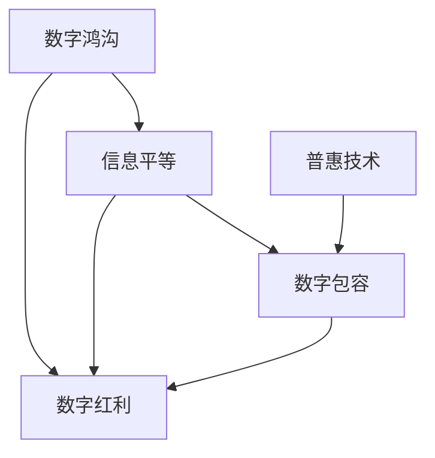

                 

# 2050年的数字鸿沟：从数字红利到数字包容的信息平等

## 1. 背景介绍

### 1.1 问题由来

在21世纪以来，全球科技发展的浪潮中，信息技术的应用日趋广泛，为人类社会带来了前所未有的便利和效益。然而，随之而来的是日益加深的数字鸿沟，特别是在经济欠发达地区、教育水平较低的人群、以及不同性别的群体中，这种鸿沟尤为显著。信息技术在带来效率提升和经济增长的同时，也进一步拉大了不同群体之间的差距，导致"数字红利"并未被普遍共享。

### 1.2 问题核心关键点

数字鸿沟的核心关键点在于信息获取的不平等。无论是教育、医疗、就业还是日常生活，那些无法接触或利用信息技术的群体，往往难以享受其带来的红利。尽管全球科技巨头们投入大量资源推广智能设备和服务，但很多用户依旧因经济条件、教育背景、语言障碍、地域限制等多种因素，无法有效获取和利用信息资源。

### 1.3 问题研究意义

研究2050年的数字鸿沟问题，对于构建普惠的数字社会，推动全球信息平等具有深远意义。科技和信息的普及是21世纪社会进步的重要驱动力之一，而实现信息平等将使每个人都能获得更多发展机会，促进社会的公正和和谐。通过探索有效的技术方案和政策措施，在2050年能够将数字鸿沟的负面影响降到最低，进一步缩小不同群体之间的差距，实现社会的全面发展。

## 2. 核心概念与联系

### 2.1 核心概念概述

为了更好地理解数字鸿沟问题的本质和影响，我们需要首先明确几个核心概念：

- **数字鸿沟(Digital Divide)**：指不同群体之间因经济条件、教育背景、技术掌握程度等差异，导致获取和使用信息技术的能力和效果存在显著差距。
- **信息平等(Information Equality)**：指每个人都能平等地获取、使用、创造信息资源，确保不同群体不受信息不对称的影响。
- **数字红利(Digital Dividends)**：指信息技术应用带来的经济增长、社会效益和文化发展的综合收益。
- **数字包容(Digital Inclusion)**：指政府、企业和社会各界通过各种措施，使所有人都能方便、有效地接触和使用信息技术，缩小数字鸿沟。
- **普惠技术(Universal Technology)**：指所有人群都能无障碍使用的技术，无论其经济条件、教育水平、地理位置等。

这些概念之间的联系可以通过以下Mermaid流程图来展示：



这个流程图展示了数字鸿沟问题的各个关键方面，以及其对信息平等、数字红利、数字包容和普惠技术的影响。

## 3. 核心算法原理 & 具体操作步骤
### 3.1 算法原理概述

解决数字鸿沟问题，需要采取一系列策略，涵盖技术、政策、教育等多个方面。以下是对这一过程的核心算法原理概述：

### 3.2 算法步骤详解

**Step 1: 数据采集与分析**

- 采集不同地区、不同群体、不同年龄段的信息获取和使用数据，分析其中的不平等现象。
- 使用机器学习算法，如聚类、分类等方法，识别出数字鸿沟的主要影响因素，如经济条件、教育水平、地理环境等。

**Step 2: 普惠技术推广**

- 开发和推广普惠技术，如低成本智能手机、移动互联网接入、公共Wi-Fi网络等。
- 通过政府补贴、企业合作等方式，降低技术使用的门槛，确保每个人都能接触和使用信息技术。

**Step 3: 信息教育普及**

- 设计和实施信息教育项目，提升公众的信息素养和数字技能。
- 通过在线课程、社区培训等方式，向不同群体提供基本的数字技能培训。

**Step 4: 多层次政策支持**

- 制定和实施多层次的政策措施，如税收优惠、财政补贴、投资倾斜等，支持数字基础设施建设。
- 建立跨部门协调机制，推动各部门共同推进数字鸿沟问题的解决。

**Step 5: 技术优化与创新**

- 利用人工智能、机器学习等技术，优化现有信息获取和使用模式。
- 研究新型信息服务模式，如智能推荐系统、虚拟现实(VR)、增强现实(AR)等，提升用户体验。

**Step 6: 持续监测与评估**

- 建立数字鸿沟监测和评估体系，持续跟踪各项措施的实施效果。
- 定期发布数字鸿沟报告，评估进展，并根据情况调整策略。

### 3.3 算法优缺点

**优点**：
- 多角度全方位地解决数字鸿沟问题，提高信息获取的平等性和普惠性。
- 融合了技术和政策手段，兼顾经济效益和社会效益。
- 通过持续监测和评估，确保措施的有效性和持续性。

**缺点**：
- 需要多方协同努力，涉及部门众多，执行难度较大。
- 资金和技术投入较大，短期内可能难以取得显著效果。
- 政策实施的短期效果和长期可持续性之间存在平衡问题。

### 3.4 算法应用领域

数字鸿沟问题的解决，涉及信息技术、教育、医疗、政府等多个领域。以下是几个典型应用场景：

1. **教育领域**：通过互联网和移动设备，为偏远和贫困地区的学校提供优质教育资源，实现远程教学。

2. **医疗健康**：利用远程医疗平台，为偏远地区提供医疗咨询和诊断服务，缩小医疗资源分配不均的问题。

3. **就业与培训**：提供职业培训和就业指导服务，帮助低技能工人提高就业竞争力，缩小就业机会的差距。

4. **金融服务**：通过移动支付和互联网金融服务，为贫困地区居民提供便捷的金融服务，提升其经济水平。

5. **农村发展**：推广数字化农业技术，提高农业生产效率，促进农村经济的现代化。

6. **公共服务**：利用数字化手段，提升公共服务的可及性和效率，如电子政务、智能交通等。

## 4. 数学模型和公式 & 详细讲解 & 举例说明

### 4.1 数学模型构建

数字鸿沟问题的数学建模，可以从多个角度进行。以下是一个简单的数学模型构建过程：

设 $D$ 表示数字鸿沟的影响因子集，包括经济条件、教育水平、地理环境等。假设每个因子 $x_i$ 对数字鸿沟的影响为 $w_i$，则数字鸿沟的总体影响 $G$ 可以表示为：

$$
G = \sum_{i=1}^{n} w_i x_i
$$

其中 $n$ 为影响因子的个数。通过数据分析，可以估计出每个因子的权重 $w_i$，进而计算出总体影响 $G$。

### 4.2 公式推导过程

假设我们已经收集到 $m$ 个地区的数字鸿沟数据，每个地区的数字鸿沟 $G_i$ 与因子 $x_{i,j}$ 之间的关系可以表示为线性回归模型：

$$
G_i = \beta_0 + \beta_1 x_{i,1} + \beta_2 x_{i,2} + \cdots + \beta_n x_{i,n} + \epsilon_i
$$

其中 $\beta_0, \beta_1, \beta_2, \cdots, \beta_n$ 为线性回归系数，$\epsilon_i$ 为随机误差项。通过最小二乘法等方法，可以求解出 $\beta_0, \beta_1, \beta_2, \cdots, \beta_n$，进而估计出每个影响因子的权重 $w_i$。

### 4.3 案例分析与讲解

以中国农村地区的数字鸿沟为例，研究其对信息平等的潜在影响。根据收集到的数据，构建线性回归模型，估计出经济条件、教育水平、地理环境等因子对数字鸿沟的影响权重。利用这些权重，可以计算出不同地区的数字鸿沟总体影响 $G$，并识别出最关键的改进方向。

## 5. 项目实践：代码实例和详细解释说明
### 5.1 开发环境搭建

在进行数字鸿沟问题的解决实践时，需要准备以下开发环境：

1. 安装Python环境：在本地或云上安装Python 3.x版本，并配置好必要的库和工具。
2. 数据集准备：收集不同地区、不同群体的信息获取和使用数据，确保数据的代表性性和准确性。
3. 数据处理工具：使用Pandas、NumPy等工具，对数据进行清洗、转换和预处理。
4. 模型训练环境：搭建好GPU或TPU环境，确保模型训练的高效性。

### 5.2 源代码详细实现

以下是一个简单的Python代码示例，用于进行线性回归模型的构建和训练：

```python
import pandas as pd
from sklearn.linear_model import LinearRegression

# 加载数据集
data = pd.read_csv('digital_divide_data.csv')

# 分割训练集和测试集
X_train, X_test, y_train, y_test = train_test_split(data.drop('G', axis=1), data['G'], test_size=0.2, random_state=42)

# 构建线性回归模型
model = LinearRegression()
model.fit(X_train, y_train)

# 预测测试集结果
y_pred = model.predict(X_test)

# 输出模型系数
print(model.coef_)
```

### 5.3 代码解读与分析

**数据准备**：
- 使用Pandas读取CSV格式的数据集，并进行初步清洗和处理。
- 使用Scikit-learn的train_test_split函数，将数据集分割为训练集和测试集，并设置随机种子。

**模型构建与训练**：
- 使用Scikit-learn的LinearRegression类，构建线性回归模型。
- 使用fit函数训练模型，将训练集数据和标签传入模型，进行模型拟合。

**预测与输出**：
- 使用predict函数对测试集进行预测，并输出模型系数，以便分析模型特征权重。

### 5.4 运行结果展示

运行上述代码，输出模型系数，以理解各个影响因子的权重大小。通过分析，可以识别出对数字鸿沟影响最大的因子，从而有针对性地采取改进措施。

## 6. 实际应用场景

### 6.1 智能教育系统

智能教育系统是解决数字鸿沟问题的重要手段。通过智能设备和在线平台，为偏远和贫困地区的学校提供优质教育资源，实现远程教学，缩小教育资源分配不均的问题。

**技术实现**：
- 使用远程教学平台，如Khan Academy、Coursera等，为学生提供在线课程和学习资源。
- 利用人工智能技术，进行个性化学习推荐和作业批改，提升教学效果。

**效果评估**：
- 通过在线学习平台的用户活跃度和成绩提升情况，评估系统的使用效果。
- 收集学生和家长的反馈意见，持续改进系统功能和服务质量。

### 6.2 远程医疗服务

远程医疗服务是解决农村和偏远地区医疗资源不足问题的重要措施。通过互联网和移动设备，为患者提供医疗咨询和诊断服务，提高医疗服务的可及性。

**技术实现**：
- 利用视频会议和远程诊疗软件，连接医生和患者，实现远程问诊。
- 使用医疗影像识别和诊断工具，提高诊断准确性。

**效果评估**：
- 通过医生和患者的满意度调查，评估远程医疗服务的质量。
- 统计远程诊疗的成功率和误诊率，提升医疗服务的效率和效果。

### 6.3 数字普惠金融

数字普惠金融通过移动互联网和智能设备，为贫困地区居民提供便捷的金融服务，提升其经济水平。

**技术实现**：
- 开发移动支付和互联网金融平台，提供转账、支付、理财等服务。
- 利用大数据和人工智能技术，进行风险评估和信用管理，提高金融服务的可靠性。

**效果评估**：
- 统计用户活跃度和交易金额，评估数字普惠金融服务的使用情况。
- 通过用户满意度调查和金融效果分析，评估金融服务的覆盖面和有效性。

### 6.4 未来应用展望

未来，随着技术和社会的发展，数字鸿沟问题的解决将更加全面和深入。以下是几个未来应用展望：

1. **全域网络覆盖**：通过5G、卫星通信等技术，实现全球范围内的网络覆盖，为偏远地区提供稳定的互联网接入。
2. **智能设备普及**：智能设备的成本不断降低，普及率逐步提升，为更多人提供便捷的信息获取手段。
3. **AI辅助教育**：利用人工智能技术，实现个性化学习和智能辅导，提高教育效果和覆盖率。
4. **医疗远程协作**：通过远程医疗平台，实现医疗资源的共享和协作，提升医疗服务的质量和效率。
5. **普惠数字金融**：利用大数据和人工智能技术，提供便捷、安全的数字金融服务，提升贫困地区居民的经济水平。

## 7. 工具和资源推荐
### 7.1 学习资源推荐

为了帮助读者系统掌握数字鸿沟问题的理论和实践，以下推荐一些优质学习资源：

1. **《数字鸿沟：理解信息时代的不平等》**（Digital Divide: Understanding Information Age Inequality）：讲解数字鸿沟的理论基础和影响因素，提供实际案例分析。
2. **《信息平等与数字包容》**（Information Equality and Digital Inclusion）：介绍信息平等的概念和实现策略，探讨数字包容的具体措施。
3. **《普惠技术：连接世界的桥梁》**（Universal Technology: Bridging the World）：讨论普惠技术的定义、应用和推广策略。
4. **《数字鸿沟解决手册》**（Digital Divide Solutions Manual）：提供实际案例和解决方案，助力解决数字鸿沟问题。

### 7.2 开发工具推荐

以下推荐一些常用的开发工具，用于数字鸿沟问题的解决实践：

1. **Python**：广泛使用的编程语言，拥有丰富的数据处理和机器学习库。
2. **Jupyter Notebook**：交互式编程环境，支持代码、数据、文档的混合展示，方便数据探索和模型调试。
3. **Pandas**：数据处理和分析库，支持大规模数据集的处理和操作。
4. **Scikit-learn**：机器学习库，提供多种回归、分类、聚类等算法实现。
5. **TensorFlow**：深度学习框架，支持多种深度学习模型的构建和训练。

### 7.3 相关论文推荐

以下是几篇具有代表性的数字鸿沟问题的相关论文，推荐阅读：

1. **《数字鸿沟：技术、社会与经济影响》**（The Digital Divide: Technology, Society and Economy）：探讨数字鸿沟的多维度影响，提出解决方案。
2. **《全球数字鸿沟的缩小：政策与技术的双重作用》**（Reducing the Global Digital Divide: The Role of Policy and Technology）：研究不同国家的数字鸿沟现状和政策措施。
3. **《数字鸿沟：跨越数字时代的鸿沟》**（Digital Divide: Crossing the Digital Age）：讨论数字鸿沟的全球性问题，提出未来发展方向。

## 8. 总结：未来发展趋势与挑战

### 8.1 总结

本文对数字鸿沟问题的解决方案进行了全面系统介绍，通过数据采集、普惠技术推广、信息教育普及、多层次政策支持、技术优化与创新、持续监测与评估等多个方面，探讨了如何构建普惠的数字社会，推动全球信息平等。通过案例分析和代码实例，展示了数字鸿沟问题的解决实践，为未来的研究和应用提供了参考。

### 8.2 未来发展趋势

展望未来，数字鸿沟问题的解决将面临以下几个趋势：

1. **技术持续创新**：新一代信息技术（如5G、物联网、人工智能等）的不断发展，将进一步缩小数字鸿沟，提高信息平等的水平。
2. **政策支持加强**：各国政府和国际组织将更加重视数字鸿沟问题，制定和实施更加有力的政策措施。
3. **社会认知提升**：公众对数字鸿沟问题的关注和认知提升，将促使更多的社会力量参与进来，共同推动问题的解决。
4. **全球合作加强**：跨国合作和信息共享，将促进全球范围内的数字鸿沟问题的解决，实现信息资源的全球化共享。

### 8.3 面临的挑战

尽管数字鸿沟问题的解决已经取得了一定进展，但在实现全面的信息平等和普惠技术普及方面，仍面临诸多挑战：

1. **资金投入不足**：数字基础设施的建设和管理需要大量资金，资金不足是制约数字鸿沟解决的重要因素。
2. **技术推广难度大**：技术推广过程中，存在使用习惯、教育水平等诸多因素的限制，推广难度较大。
3. **政策协调困难**：数字鸿沟问题涉及多个部门和利益相关者，政策协调和实施面临挑战。
4. **安全性和隐私保护**：数字鸿沟解决方案在提供便捷服务的同时，也带来了安全性和隐私保护的新挑战。

### 8.4 研究展望

未来，数字鸿沟问题的研究需要在以下几个方面进行深入探索：

1. **多学科融合**：结合社会学、经济学、心理学等多学科知识，综合分析数字鸿沟的影响因素和解决方案。
2. **可持续发展**：在推动信息平等的同时，注重可持续发展，确保技术的可持继性和环境友好性。
3. **普适性技术**：开发更加普适、便捷、易用的数字鸿沟解决方案，确保所有人都能方便使用。
4. **人机协同**：探索人机协同的工作模式，提升信息获取和使用的效率和质量。

## 9. 附录：常见问题与解答

**Q1: 如何衡量数字鸿沟的影响？**

A: 数字鸿沟的影响可以通过多种方式衡量，如收入差距、教育水平、就业机会等。具体来说，可以使用线性回归、因子分析等统计方法，评估不同因素对数字鸿沟的贡献度，并计算总体影响。

**Q2: 如何提升数字普惠金融服务的覆盖率？**

A: 提升数字普惠金融服务的覆盖率，需要从以下几个方面入手：
1. 降低金融服务的成本，提供低成本的金融产品和服务。
2. 加强金融教育，提升公众的金融素养和数字技能。
3. 引入大数据和人工智能技术，进行风险评估和信用管理。
4. 通过政府和企业的合作，建立金融服务的激励机制。

**Q3: 数字鸿沟问题如何解决？**

A: 解决数字鸿沟问题，需要多层次、多方位的措施：
1. 推广普惠技术，确保所有人都能接触和使用信息技术。
2. 普及信息教育，提升公众的科技素养和数字技能。
3. 制定和实施政策措施，支持数字基础设施建设。
4. 引入人工智能和机器学习技术，优化信息获取和使用模式。

**Q4: 数字鸿沟问题的解决需要多长时间？**

A: 数字鸿沟问题的解决是一个长期的过程，需要持续的政策支持、技术创新和社会参与。具体时间取决于各个国家的经济发展水平、政策力度、技术推广效果等因素。

**Q5: 数字鸿沟问题对社会的影响有多大？**

A: 数字鸿沟问题对社会的影响非常深远，不仅体现在经济收入、教育机会、就业状况等方面，还可能加剧社会不平等、影响公共服务的可及性、甚至对国家安全和稳定造成威胁。因此，解决数字鸿沟问题，对于构建公正、和谐、可持续的社会具有重要意义。

作者：禅与计算机程序设计艺术 / Zen and the Art of Computer Programming

