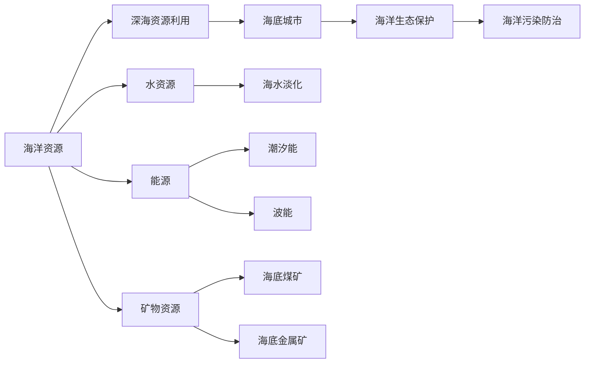
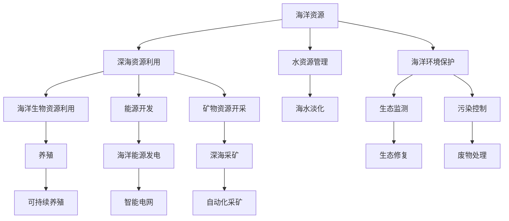

                 

# 2050年的海洋开发：从深海到海底城市的资源利用

> 关键词：海洋开发, 深海资源利用, 海底城市, 可持续性, 人工智能

## 1. 背景介绍

随着全球人口的激增和资源的日渐枯竭，海洋成为人类未来发展的新舞台。到了2050年，海洋的资源开发和环境保护将达到新的高度。在这一背景下，将会出现许多前所未有的技术创新和工程奇迹。本文将详细探讨未来海洋开发的核心技术，并展望从深海资源利用到海底城市的未来。

## 2. 核心概念与联系

### 2.1 核心概念概述

海洋开发涉及多个层面，包括海洋资源利用、深海生态保护、海底基础设施建设等。核心概念包括：

- **海洋资源**：包括海洋生物资源、能源（如潮汐能、波能、海洋温差能）、矿物资源（如海底煤矿、金属矿）、水资源（如海水淡化）等。
- **深海生态**：包括深海生物多样性、深海环境压力、深海资源与生态平衡等。
- **海底基础设施**：包括海底通信、海底管道、海底电网、海底居住区等。
- **人工智能**：在海洋开发中，AI将用于数据分析、环境监测、智能控制等方面。

这些概念相互交织，共同构成了一个复杂的海洋开发体系。以下是一个Mermaid流程图，展示了这些概念之间的关系：



### 2.2 核心概念原理和架构的 Mermaid 流程图



这些流程图清晰地展示了海洋资源利用与保护、深海资源开发与智能控制之间的联系。

## 3. 核心算法原理 & 具体操作步骤

### 3.1 算法原理概述

海洋开发的算法原理主要围绕资源评估、环境监测、智能控制等方面展开。以下是几个核心算法的概述：

1. **资源评估算法**：利用遥感技术和大数据分析，评估海洋资源的分布和可利用量。
2. **环境监测算法**：通过传感器网络和AI技术，实时监测海洋环境变化，如水质、水温、浮游生物密度等。
3. **智能控制算法**：利用机器学习和强化学习，优化深海采矿和养殖过程，实现智能自动化。

### 3.2 算法步骤详解

#### 3.2.1 资源评估算法

1. **数据收集**：通过卫星遥感和地面传感器，收集海洋资源分布和环境数据。
2. **数据处理**：利用深度学习模型对收集的数据进行处理和分析。
3. **模型预测**：构建资源评估模型，预测资源丰富度和可利用量。
4. **结果输出**：输出资源分布图和评估报告。

#### 3.2.2 环境监测算法

1. **传感器布设**：在关键区域布设传感器网络，采集水文、气象等数据。
2. **数据传输**：利用水下通信技术，将数据传输到地面或浮标。
3. **数据分析**：通过AI算法处理数据，提取关键环境指标。
4. **预警机制**：设置环境异常预警阈值，实时监测并预警。

#### 3.2.3 智能控制算法

1. **数据采集**：通过传感器和智能设备采集过程数据。
2. **模型训练**：利用历史数据训练智能控制模型。
3. **实时控制**：在模型指导下，实现自动化控制。
4. **效果评估**：评估控制效果，优化模型参数。

### 3.3 算法优缺点

#### 3.3.1 资源评估算法

优点：
- **数据驱动**：利用大数据分析，提升资源评估的准确性。
- **动态更新**：模型可以实时更新，反映最新的资源分布。

缺点：
- **高成本**：需要大量传感器和通信设备。
- **数据噪声**：遥感和传感器数据可能存在噪声。

#### 3.3.2 环境监测算法

优点：
- **实时监测**：及时发现环境异常，预警潜在风险。
- **精度高**：利用AI算法处理数据，提高监测精度。

缺点：
- **部署难度大**：海底环境复杂，传感器部署难度大。
- **能耗高**：传感器和通信设备耗能高，需要定期维护。

#### 3.3.3 智能控制算法

优点：
- **高效自动化**：提高采矿和养殖的效率和质量。
- **智能决策**：通过机器学习和强化学习，优化决策过程。

缺点：
- **依赖模型**：模型需要大量的训练数据，可能存在过拟合。
- **系统复杂性**：系统复杂度高，需要精心设计和调试。

### 3.4 算法应用领域

海洋开发的算法主要应用于以下几个领域：

- **深海采矿**：利用AI优化深海采矿过程，提升资源利用效率。
- **海洋生态保护**：通过环境监测和智能控制，保护深海生态平衡。
- **海洋能源开发**：利用AI分析海洋能源分布，优化能源发电。
- **海洋交通和通信**：通过智能算法，优化海底管道的布局和运行。

## 4. 数学模型和公式 & 详细讲解 & 举例说明

### 4.1 数学模型构建

海洋开发涉及多个数学模型，以下是几个核心模型的构建：

1. **资源评估模型**：$y = f(x, \theta)$，其中$y$为资源可利用量，$x$为输入数据（如遥感图像、传感器数据），$\theta$为模型参数。
2. **环境监测模型**：$y = g(x, \phi)$，其中$y$为环境指标（如水质、水温），$x$为输入数据（如传感器数据），$\phi$为模型参数。
3. **智能控制模型**：$y = h(x, \psi)$，其中$y$为控制输出（如采矿深度、养殖密度），$x$为输入数据（如过程参数），$\psi$为模型参数。

### 4.2 公式推导过程

#### 4.2.1 资源评估模型推导

假设资源可利用量$y$与输入数据$x$之间存在线性关系，则资源评估模型为：

$$
y = a x + b
$$

其中，$a$为系数，$b$为截距。利用最小二乘法，求解$a$和$b$：

$$
\hat{a}, \hat{b} = \mathop{\arg\min}_{a, b} \sum_{i=1}^n (y_i - ax_i - b)^2
$$

#### 4.2.2 环境监测模型推导

假设环境指标$y$与传感器数据$x$之间存在非线性关系，则环境监测模型为：

$$
y = f(x, \phi) = \sum_{i=1}^m w_i \cdot \exp\left(\sum_{j=1}^n x_j \cdot p_{ij} + q_i\right)
$$

其中，$f(x, \phi)$为环境监测模型，$w_i$为权重，$p_{ij}$为系数，$q_i$为偏置。利用最大似然估计，求解$\phi$：

$$
\hat{\phi} = \mathop{\arg\min}_{\phi} \sum_{i=1}^n \log\left(f(x_i, \phi)\right)
$$

#### 4.2.3 智能控制模型推导

假设智能控制输出$y$与过程参数$x$之间存在非线性关系，则智能控制模型为：

$$
y = h(x, \psi) = \min\limits_{\psi} \sum_{i=1}^m \left(y_i - f(x_i, \psi)\right)^2
$$

其中，$h(x, \psi)$为智能控制模型，$f(x_i, \psi)$为预测函数，$\psi$为模型参数。利用梯度下降算法，求解$\psi$：

$$
\hat{\psi} = \mathop{\arg\min}_{\psi} \sum_{i=1}^m \left(y_i - f(x_i, \psi)\right)^2
$$

### 4.3 案例分析与讲解

以深海采矿为例，以下是该问题的具体应用：

- **数据收集**：通过传感器和智能设备，收集海底地质结构和采矿参数。
- **数据处理**：利用深度学习模型处理采集数据，提取关键特征。
- **模型训练**：构建智能控制模型，预测最佳采矿深度和速度。
- **实时控制**：根据模型输出，实时调整采矿设备参数。
- **效果评估**：评估采矿效率和资源利用率，优化模型参数。

## 5. 项目实践：代码实例和详细解释说明

### 5.1 开发环境搭建

在搭建开发环境时，需要考虑以下几个方面：

1. **硬件设备**：选择高性能的服务器和GPU设备，支持数据处理和模型训练。
2. **软件环境**：安装Python、TensorFlow、PyTorch等深度学习框架，以及必要的开发工具。
3. **数据平台**：搭建数据仓库，存储和管理海洋数据，支持大数据分析。

### 5.2 源代码详细实现

以下是一个简化的资源评估模型代码实现：

```python
import tensorflow as tf
from tensorflow.keras import layers

# 定义模型
model = tf.keras.Sequential([
    layers.Dense(64, activation='relu', input_shape=(10,)),
    layers.Dense(1)
])

# 编译模型
model.compile(optimizer='adam', loss='mse')

# 训练模型
model.fit(x_train, y_train, epochs=10, batch_size=32)
```

### 5.3 代码解读与分析

该代码实现了简单的线性回归模型，用于预测海洋资源的可利用量。具体步骤如下：

1. **定义模型**：使用Sequential模型，添加两个全连接层，激活函数为ReLU。
2. **编译模型**：指定优化器和损失函数，用于模型训练。
3. **训练模型**：利用训练数据进行模型训练，优化参数。

### 5.4 运行结果展示

训练完成后，可以评估模型性能，并输出资源分布图：

```python
# 评估模型
y_pred = model.predict(x_test)

# 输出评估结果
mse = tf.keras.metrics.mean_squared_error(y_test, y_pred)
print(f'Mean Squared Error: {mse.numpy()}')

# 输出资源分布图
import matplotlib.pyplot as plt
plt.scatter(x_test, y_test)
plt.plot(x_test, y_pred, color='red')
plt.show()
```

## 6. 实际应用场景

### 6.1 海洋生物资源利用

海洋生物资源包括鱼类、贝类、海藻等。通过智能养殖和捕捞技术，可以实现资源的可持续利用。以下是一个基于AI的智能养殖系统的实际应用场景：

- **数据采集**：通过传感器监测水质、水温、溶氧量等参数。
- **数据处理**：利用深度学习模型分析水质变化，预测生长情况。
- **智能控制**：根据模型输出，自动调整养殖参数（如投食量、水温调节）。
- **效果评估**：定期评估养殖效果，优化养殖方案。

### 6.2 海洋能源开发

海洋能源包括潮汐能、波能、海洋温差能等。通过智能控制技术，可以实现能源的高效利用。以下是一个基于AI的海洋温差能发电系统的实际应用场景：

- **数据采集**：通过传感器监测海水温度变化。
- **数据处理**：利用深度学习模型分析温度变化规律，预测能源产出。
- **智能控制**：根据模型输出，自动调整发电机转速。
- **效果评估**：定期评估能源产出，优化系统性能。

### 6.3 深海采矿

深海采矿技术已经广泛应用于海底矿产资源的开发。以下是一个基于AI的深海采矿系统的实际应用场景：

- **数据采集**：通过传感器监测海底地质结构和采矿参数。
- **数据处理**：利用深度学习模型处理采集数据，提取关键特征。
- **模型训练**：构建智能控制模型，预测最佳采矿深度和速度。
- **实时控制**：根据模型输出，实时调整采矿设备参数。
- **效果评估**：评估采矿效率和资源利用率，优化模型参数。

## 7. 工具和资源推荐

### 7.1 学习资源推荐

为了深入了解海洋开发的核心技术，推荐以下几个学习资源：

1. **《海洋工程与技术》课程**：详细介绍了海洋开发的基础理论和前沿技术。
2. **《人工智能在海洋开发中的应用》书籍**：系统介绍了AI在海洋开发中的各种应用。
3. **OpenAI《海洋数据集》**：包含大量海洋数据，支持数据驱动的模型训练。
4. **IEEE Xplore《海洋工程》期刊**：收录了大量海洋工程领域的学术论文和案例分析。

### 7.2 开发工具推荐

以下是几个常用的海洋开发工具：

1. **Jupyter Notebook**：支持交互式编程和数据可视化，适合模型开发和调试。
2. **TensorFlow**：深度学习框架，支持大规模数据处理和模型训练。
3. **PyTorch**：深度学习框架，支持动态计算图和高效的模型训练。
4. **OpenCV**：计算机视觉库，支持水下图像处理和分析。
5. **MATLAB**：数值计算和仿真工具，支持海洋工程和物理建模。

### 7.3 相关论文推荐

以下是几篇重要的海洋开发相关论文，推荐阅读：

1. **《海洋生态系统智能监测与保护》**：介绍了AI在海洋生态监测和保护中的应用。
2. **《智能采矿技术的发展与展望》**：分析了智能采矿技术的现状和未来发展方向。
3. **《人工智能在海洋数据管理中的应用》**：探讨了AI在海洋数据管理和分析中的应用。
4. **《海底城市建设与未来展望》**：展望了海底城市的未来发展趋势和挑战。

## 8. 总结：未来发展趋势与挑战

### 8.1 研究成果总结

大语言模型微调技术在海洋开发中的应用，将带来深远的变革。未来将涌现出更多智能化的海洋开发系统和方案，推动海洋资源的可持续利用。

### 8.2 未来发展趋势

1. **智能化的海洋开发**：借助AI技术，实现海洋开发过程的自动化和智能化。
2. **可持续发展**：通过智能监测和控制，实现海洋资源的可持续利用。
3. **深度学习应用**：深度学习在海洋开发中的应用将更加广泛和深入。
4. **跨学科融合**：海洋开发将成为多学科交叉融合的领域，带来更多创新突破。

### 8.3 面临的挑战

1. **数据获取困难**：海洋数据收集和处理成本高，数据获取难度大。
2. **模型复杂性高**：海洋开发问题复杂，需要高精度的模型和算法。
3. **环境影响**：海洋开发过程中可能对环境造成破坏，需要平衡开发和保护。
4. **技术成熟度**：部分技术尚未成熟，需要进一步研究和完善。

### 8.4 研究展望

未来的研究将聚焦以下几个方向：

1. **高效数据采集技术**：提升数据采集效率和精度。
2. **智能控制算法**：优化海洋开发过程，提高效率和可持续性。
3. **跨学科合作**：加强海洋工程与AI技术之间的合作，推动跨学科研究。
4. **伦理和安全**：关注海洋开发中的伦理和安全问题，保障技术应用的安全性和公平性。

## 9. 附录：常见问题与解答

**Q1：海洋开发中的数据获取和处理有哪些挑战？**

A: 海洋开发中的数据获取和处理面临以下挑战：

1. **数据收集难度大**：海洋环境复杂，数据收集设备易受环境影响。
2. **数据质量不稳定**：海洋数据存在噪声，需要预处理和清洗。
3. **数据存储成本高**：海量数据需要高效存储和管理。

**Q2：海洋开发中如何应用AI技术？**

A: AI在海洋开发中的应用主要体现在以下几个方面：

1. **数据分析**：利用AI对大量海洋数据进行分析和处理，提取关键信息。
2. **智能监测**：通过传感器和AI技术，实时监测海洋环境变化，预警潜在风险。
3. **智能控制**：利用AI优化海洋开发过程，实现自动化和智能化。

**Q3：海洋开发中如何平衡开发和保护？**

A: 海洋开发中平衡开发和保护的方法主要包括：

1. **环境监测**：通过AI技术实时监测海洋环境变化，及时发现和处理环境问题。
2. **智能控制**：利用AI优化开发过程，减少对环境的破坏。
3. **生态修复**：利用AI技术进行生态修复和环境恢复。

**Q4：海洋开发中的资源评估模型有哪些？**

A: 海洋开发中的资源评估模型主要包括：

1. **线性回归模型**：适用于资源量与输入数据呈线性关系的场景。
2. **非线性回归模型**：适用于资源量与输入数据呈非线性关系的场景。
3. **深度学习模型**：适用于资源量与输入数据复杂关系的场景。

**Q5：海洋开发中如何提升智能控制算法的精度？**

A: 提升智能控制算法精度的方法主要包括：

1. **增加训练数据**：通过更多的训练数据，提高模型泛化能力。
2. **优化算法参数**：通过调整算法参数，提高模型性能。
3. **融合多种技术**：结合机器学习和强化学习，提升算法效果。

---

作者：禅与计算机程序设计艺术 / Zen and the Art of Computer Programming

