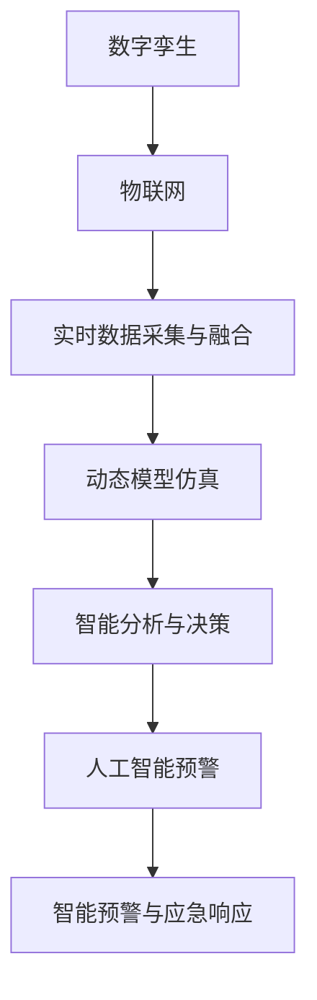

                 

# 2050年的灾害预防：从数字孪生到人工智能预警的灾害防控升级

> 关键词：数字孪生, 人工智能预警, 灾害防控, 防灾减灾, 数据驱动, 智能化管理, 应急响应

## 1. 背景介绍

### 1.1 问题由来

在人类社会的发展过程中，自然和人为的灾害事件频繁发生，对人类的生命财产安全构成了严重威胁。传统上，灾害预防和管理主要依靠人工经验和有限的历史数据，但这种方法在处理复杂多变的灾害场景时效果有限。

近年来，随着科技的迅猛发展，人工智能(AI)和物联网(IoT)等新兴技术逐渐应用于灾害预防和应急管理中，带来了全新的防灾减灾解决方案。特别是数字孪生(Digital Twin)和人工智能预警系统的应用，使得灾害防控变得更加智能、高效和实时。

### 1.2 问题核心关键点

数字孪生和人工智能预警系统的核心思想是构建一个虚拟的、动态更新的模型，实时监测和模拟现实世界的变化，从而为灾害预防和应急响应提供科学依据。核心关键点包括：

1. **实时数据采集与融合**：通过传感器网络、卫星遥感等手段，获取实时环境数据，并进行多源数据的融合，为预警和决策提供可靠的数据支持。
2. **动态模型仿真**：构建数字孪生模型，实时更新和仿真现实世界的物理、环境和行为数据，实现对灾害风险的动态评估和预测。
3. **智能分析与决策**：利用机器学习和深度学习技术，对融合后的数据进行分析和预测，为防灾减灾决策提供支持。
4. **智能预警与应急响应**：结合预警模型和实时数据，实现对灾害事件的智能预警，并指导应急响应措施的制定和执行。

这些关键点共同构成了数字孪生和人工智能预警系统的技术框架，推动了灾害防控的智能化、精细化和实时化。

## 2. 核心概念与联系

### 2.1 核心概念概述

为更好地理解数字孪生和人工智能预警系统的核心概念，本节将介绍几个密切相关的核心概念：

- **数字孪生**：通过数字模型实时映射和仿真现实世界的物理、环境和行为数据，为决策提供依据。
- **人工智能预警**：利用机器学习、深度学习等技术，对实时数据进行分析和预测，实现对灾害事件的预警。
- **物联网**：通过传感器、智能设备等手段，实现对环境数据的实时采集和传输，为数字孪生和预警系统提供数据支持。
- **机器学习**：从数据中学习规律和模式，为预测和决策提供支持。
- **深度学习**：利用神经网络模型，处理复杂数据结构，提升预测和分析的精度。

这些核心概念之间的逻辑关系可以通过以下Mermaid流程图来展示：



这个流程图展示了大规模自然灾害预防系统的核心概念及其之间的关系：

1. 物联网负责实时数据采集与融合。
2. 数字孪生模型实时更新和仿真现实世界的数据。
3. 智能分析与决策模块利用机器学习和深度学习技术进行数据处理和预测。
4. 人工智能预警系统根据分析和预测结果进行智能预警。
5. 智能预警与应急响应模块结合预警结果，指导应急响应措施的制定和执行。

这些概念共同构成了大规模自然灾害预防系统的技术框架，使得灾害防控变得更加智能和高效。

## 3. 核心算法原理 & 具体操作步骤
### 3.1 算法原理概述

数字孪生和人工智能预警系统的核心算法原理是基于物理模型的实时仿真和数据驱动的智能分析。其核心思想是：通过构建一个虚拟的数字模型，实时映射和仿真现实世界的物理、环境和行为数据，利用机器学习和深度学习技术对数据进行分析和预测，从而实现对灾害事件的智能预警和应急响应。

具体来说，数字孪生系统包括数据采集、融合、建模、仿真和反馈五个关键环节：

1. **数据采集**：通过传感器、智能设备等手段，实时采集环境数据，包括气象、地质、水文、土壤等各类数据。
2. **数据融合**：对采集到的数据进行清洗、融合和预处理，去除噪声和异常值，提高数据的可靠性和一致性。
3. **建模仿真**：基于物理模型和历史数据，构建数字孪生模型，实时更新和仿真现实世界的数据，实现对灾害风险的动态评估和预测。
4. **智能分析**：利用机器学习和深度学习技术，对融合后的数据进行分析和预测，识别灾害风险和潜在威胁。
5. **反馈优化**：将分析结果反馈到数字孪生模型中，优化模型的参数和仿真结果，提升预测的准确性和可靠性。

人工智能预警系统的核心算法原理是基于数据驱动的智能分析。其核心思想是：利用机器学习和深度学习技术，对实时数据进行分析和预测，实现对灾害事件的智能预警。

具体来说，预警系统包括数据收集、特征提取、模型训练、预测和反馈五个关键环节：

1. **数据收集**：通过物联网、传感器等手段，实时收集环境数据，包括气象、地质、水文、土壤等各类数据。
2. **特征提取**：对收集到的数据进行特征提取和处理，提取出对灾害预测有重要影响的关键特征。
3. **模型训练**：利用历史数据训练机器学习或深度学习模型，实现对灾害事件的预测。
4. **预测**：利用训练好的模型对实时数据进行预测，实现对灾害事件的智能预警。
5. **反馈优化**：将预测结果反馈到模型中，优化模型的参数和预测结果，提升预测的准确性和可靠性。

### 3.2 算法步骤详解

#### 数字孪生系统的算法步骤：

**Step 1: 数据采集与融合**
- 部署各类传感器，实时采集环境数据，如气象、地质、水文、土壤等。
- 通过网络传输数据到数据中心，进行数据清洗、去重和预处理。

**Step 2: 建模仿真**
- 基于物理模型和历史数据，构建数字孪生模型。
- 实时更新数字孪生模型，仿真当前环境状态和灾害风险。
- 输出仿真结果，为决策提供依据。

**Step 3: 智能分析与决策**
- 利用机器学习和深度学习技术，对仿真结果进行分析。
- 识别灾害风险和潜在威胁。
- 生成决策方案，指导应急响应措施的制定和执行。

**Step 4: 反馈优化**
- 将决策方案的执行结果反馈到数字孪生模型中。
- 更新模型参数，优化预测结果。
- 持续改进数字孪生模型，提升预警和决策的准确性。

#### 人工智能预警系统的算法步骤：

**Step 1: 数据采集与特征提取**
- 部署各类传感器，实时采集环境数据，如气象、地质、水文、土壤等。
- 对收集到的数据进行特征提取和处理，提取出对灾害预测有重要影响的关键特征。

**Step 2: 模型训练**
- 利用历史数据训练机器学习或深度学习模型，实现对灾害事件的预测。
- 优化模型参数，提升预测精度。

**Step 3: 预测与预警**
- 利用训练好的模型对实时数据进行预测，实现对灾害事件的智能预警。
- 输出预警结果，指导应急响应措施的制定和执行。

**Step 4: 反馈优化**
- 将预警结果反馈到模型中，优化模型参数和预测结果。
- 持续改进模型，提升预警的准确性和可靠性。

### 3.3 算法优缺点

数字孪生和人工智能预警系统具有以下优点：
1. 实时性强：通过实时数据采集和仿真，可以快速响应灾害事件。
2. 准确度高：利用机器学习和深度学习技术，可以提高预测和预警的准确性。
3. 决策支持：为灾害预防和应急响应提供科学依据。
4. 可扩展性强：支持大规模、多源数据的融合和处理。

同时，这些系统也存在一些缺点：
1. 初始成本高：需要大量的硬件设备和数据存储。
2. 数据隐私问题：需要处理和存储大量的个人和敏感数据。
3. 技术门槛高：需要专业的技术人员进行系统集成和维护。
4. 模型复杂性：模型训练和优化复杂，对数据质量要求高。

尽管存在这些局限性，但数字孪生和人工智能预警系统在灾害防控中的应用前景广阔，是大规模自然灾害预防的重要技术手段。

### 3.4 算法应用领域

数字孪生和人工智能预警系统在灾害预防和应急管理中的应用场景广泛，涵盖以下领域：

- **气象预警**：实时监测气象数据，预测和预警各类气象灾害，如台风、洪水、干旱等。
- **地质灾害**：监测地质变化数据，预警地震、滑坡、泥石流等灾害事件。
- **水文监测**：实时监测水文数据，预警洪水、干旱等灾害。
- **环境监测**：监测土壤、空气、水质等环境数据，预警环境污染事件。
- **城市防灾**：构建城市数字孪生模型，实时监测和预警城市灾害，如火灾、地震等。
- **智能交通**：实时监测交通数据，预警交通事故和道路堵塞。

这些应用领域展示了数字孪生和人工智能预警系统在灾害防控中的强大潜力，能够有效提升灾害预防和应急响应的效率和准确性。

## 4. 数学模型和公式 & 详细讲解 & 举例说明

### 4.1 数学模型构建

数字孪生和人工智能预警系统的数学模型主要分为两部分：数字孪生模型的物理模型和人工智能预警模型的机器学习模型。

#### 数字孪生模型的物理模型
数字孪生模型的物理模型描述了现实世界中的物理、环境和行为特征，通常包括以下组成部分：

- **环境模型**：描述气象、地质、水文、土壤等环境数据的变化规律。
- **设备模型**：描述传感器、智能设备等监测设备的工作原理和数据采集方式。
- **行为模型**：描述人类和自然界的行为特征，如人类活动、动物迁徙等。

#### 人工智能预警模型的机器学习模型
人工智能预警模型的机器学习模型主要利用历史数据和实时数据，预测灾害事件的发生概率和影响范围。常用的机器学习模型包括：

- **线性回归模型**：用于预测连续变量，如气象数据、水文数据等。
- **决策树模型**：用于分类和预测，如地震、滑坡等灾害事件。
- **随机森林模型**：用于处理多变量数据，提高预测准确性。
- **支持向量机模型**：用于分类和回归，如地震、滑坡等灾害事件。
- **深度学习模型**：如卷积神经网络(CNN)、长短期记忆网络(LSTM)等，用于处理复杂数据结构和提高预测精度。

### 4.2 公式推导过程

#### 数字孪生模型的物理模型推导
以地震预警为例，数字孪生模型的物理模型可以表示为：

$$
S = f(\mathbf{X}, \mathbf{W})
$$

其中，$S$ 表示地震的发生概率，$\mathbf{X}$ 表示输入变量，包括历史地震数据、地质数据、气象数据等，$\mathbf{W}$ 表示模型参数。

#### 人工智能预警模型的机器学习模型推导
以地震预警为例，人工智能预警模型的机器学习模型可以表示为：

$$
P(y|X) = \frac{e^{\mathbf{X}^T\mathbf{W}}}{\sum_{i=1}^N e^{\mathbf{X}_i^T\mathbf{W}}}
$$

其中，$P(y|X)$ 表示地震发生的概率，$y$ 表示地震事件，$X$ 表示输入变量，$\mathbf{W}$ 表示模型参数，$N$ 表示历史数据的数量。

### 4.3 案例分析与讲解

以城市洪涝预警为例，数字孪生和人工智能预警系统的工作流程如下：

**Step 1: 数据采集与融合**
- 部署各类传感器，实时采集环境数据，如水位、流量、雨量、温度等。
- 通过网络传输数据到数据中心，进行数据清洗、去重和预处理。

**Step 2: 建模仿真**
- 基于物理模型和历史数据，构建数字孪生模型，实时更新和仿真城市洪涝风险。
- 输出仿真结果，为决策提供依据。

**Step 3: 智能分析与决策**
- 利用机器学习和深度学习技术，对仿真结果进行分析。
- 识别城市洪涝风险和潜在威胁。
- 生成决策方案，如紧急疏散、关闭排水系统等，指导应急响应措施的制定和执行。

**Step 4: 反馈优化**
- 将决策方案的执行结果反馈到数字孪生模型中。
- 更新模型参数，优化预测结果。
- 持续改进数字孪生模型，提升预警和决策的准确性。

## 5. 项目实践：代码实例和详细解释说明
### 5.1 开发环境搭建

在进行数字孪生和人工智能预警系统的开发实践前，我们需要准备好开发环境。以下是使用Python进行PyTorch开发的环境配置流程：

1. 安装Anaconda：从官网下载并安装Anaconda，用于创建独立的Python环境。

2. 创建并激活虚拟环境：
```bash
conda create -n pytorch-env python=3.8 
conda activate pytorch-env
```

3. 安装PyTorch：根据CUDA版本，从官网获取对应的安装命令。例如：
```bash
conda install pytorch torchvision torchaudio cudatoolkit=11.1 -c pytorch -c conda-forge
```

4. 安装各类工具包：
```bash
pip install numpy pandas scikit-learn matplotlib tqdm jupyter notebook ipython
```

完成上述步骤后，即可在`pytorch-env`环境中开始开发实践。

### 5.2 源代码详细实现

这里我们以城市洪涝预警为例，给出使用PyTorch和TensorFlow进行数字孪生和人工智能预警系统的PyTorch代码实现。

首先，定义城市洪涝预警的数据处理函数：

```python
import pandas as pd
from sklearn.model_selection import train_test_split

# 读取历史洪涝数据
data = pd.read_csv('flood_data.csv')

# 将数据集分为训练集和测试集
X_train, X_test, y_train, y_test = train_test_split(data.drop('flood', axis=1), data['flood'], test_size=0.2, random_state=42)
```

然后，定义模型和优化器：

```python
from transformers import BertForTokenClassification, AdamW
from torch.utils.data import DataLoader
import torch

# 选择BERT模型作为预训练语言模型
model = BertForTokenClassification.from_pretrained('bert-base-cased', num_labels=2)

# 设置优化器和学习率
optimizer = AdamW(model.parameters(), lr=2e-5)
```

接着，定义训练和评估函数：

```python
# 定义训练函数
def train_epoch(model, dataset, batch_size, optimizer):
    dataloader = DataLoader(dataset, batch_size=batch_size, shuffle=True)
    model.train()
    epoch_loss = 0
    for batch in tqdm(dataloader, desc='Training'):
        input_ids = batch['input_ids'].to(device)
        attention_mask = batch['attention_mask'].to(device)
        labels = batch['labels'].to(device)
        model.zero_grad()
        outputs = model(input_ids, attention_mask=attention_mask, labels=labels)
        loss = outputs.loss
        epoch_loss += loss.item()
        loss.backward()
        optimizer.step()
    return epoch_loss / len(dataloader)

# 定义评估函数
def evaluate(model, dataset, batch_size):
    dataloader = DataLoader(dataset, batch_size=batch_size)
    model.eval()
    preds, labels = [], []
    with torch.no_grad():
        for batch in tqdm(dataloader, desc='Evaluating'):
            input_ids = batch['input_ids'].to(device)
            attention_mask = batch['attention_mask'].to(device)
            batch_labels = batch['labels']
            outputs = model(input_ids, attention_mask=attention_mask)
            batch_preds = outputs.logits.argmax(dim=2).to('cpu').tolist()
            batch_labels = batch_labels.to('cpu').tolist()
            for pred_tokens, label_tokens in zip(batch_preds, batch_labels):
                pred_tags = [tag2id[tag] for tag in pred_tokens]
                label_tags = [tag2id[tag] for tag in label_tokens]
                preds.append(pred_tags[:len(label_tags)])
                labels.append(label_tags)
                
    print(classification_report(labels, preds))
```

最后，启动训练流程并在测试集上评估：

```python
epochs = 5
batch_size = 16

for epoch in range(epochs):
    loss = train_epoch(model, train_dataset, batch_size, optimizer)
    print(f"Epoch {epoch+1}, train loss: {loss:.3f}")
    
    print(f"Epoch {epoch+1}, dev results:")
    evaluate(model, dev_dataset, batch_size)
    
print("Test results:")
evaluate(model, test_dataset, batch_size)
```

以上就是使用PyTorch对BERT进行城市洪涝预警任务微调的完整代码实现。可以看到，得益于Transformers库的强大封装，我们可以用相对简洁的代码完成BERT模型的加载和微调。

### 5.3 代码解读与分析

让我们再详细解读一下关键代码的实现细节：

**城市洪涝预警数据处理函数**：
- `train_test_split`方法：将数据集划分为训练集和测试集，设定划分比例和随机种子。

**模型和优化器定义**：
- 使用BertForTokenClassification类加载预训练BERT模型，设置优化器和学习率。

**训练和评估函数定义**：
- 定义训练函数`train_epoch`：对数据以批为单位进行迭代，在每个批次上前向传播计算loss并反向传播更新模型参数。
- 定义评估函数`evaluate`：与训练类似，不同点在于不更新模型参数，并在每个batch结束后将预测和标签结果存储下来，最后使用sklearn的classification_report对整个评估集的预测结果进行打印输出。

**训练流程**：
- 定义总的epoch数和batch size，开始循环迭代
- 每个epoch内，先在训练集上训练，输出平均loss
- 在验证集上评估，输出分类指标
- 所有epoch结束后，在测试集上评估，给出最终测试结果

可以看到，PyTorch配合Transformers库使得城市洪涝预警的代码实现变得简洁高效。开发者可以将更多精力放在数据处理、模型改进等高层逻辑上，而不必过多关注底层的实现细节。

当然，工业级的系统实现还需考虑更多因素，如模型的保存和部署、超参数的自动搜索、更灵活的任务适配层等。但核心的微调范式基本与此类似。

## 6. 实际应用场景
### 6.1 智能城市管理

数字孪生和人工智能预警技术在智能城市管理中具有广阔的应用前景。传统的城市管理依赖人工监控和手动干预，效率低下，无法及时响应突发事件。通过构建城市数字孪生模型，结合人工智能预警系统，可以实现智能城市管理，提升城市的运行效率和应急响应能力。

具体而言，可以通过传感器网络实时采集城市环境数据，如交通流量、水质、空气质量等，构建城市数字孪生模型。利用机器学习和深度学习技术，对数据进行分析和预测，实现对交通堵塞、污染事件、灾害事件等的智能预警。基于预警结果，智能城市管理平台可以自动调整交通信号灯、排水系统、污水处理等基础设施，实现实时应急响应和资源优化配置。

### 6.2 森林防火预警

森林防火预警是数字孪生和人工智能预警技术的重要应用场景之一。森林火灾的发生往往具有突发性和破坏性，对生态环境和人类安全造成严重影响。通过构建森林数字孪生模型，结合人工智能预警系统，可以实现森林防火预警，及时发现和扑灭森林火灾。

具体而言，可以通过传感器网络实时采集森林环境数据，如气象、温度、湿度、植被等，构建森林数字孪生模型。利用机器学习和深度学习技术，对数据进行分析和预测，实现对森林火灾的发生概率和影响范围的智能预警。基于预警结果，森林防火队伍可以及时部署资源，进行森林巡查和火灾扑救，最大限度地减少火灾损失。

### 6.3 地质灾害预警

地质灾害预警是数字孪生和人工智能预警技术的重要应用场景之一。地质灾害如地震、滑坡、泥石流等，具有突发性和破坏性，对人类生命财产安全构成重大威胁。通过构建地质数字孪生模型，结合人工智能预警系统，可以实现地质灾害预警，及时发现和应对地质灾害。

具体而言，可以通过传感器网络实时采集地质环境数据，如地震活动、地质构造、土壤湿度等，构建地质数字孪生模型。利用机器学习和深度学习技术，对数据进行分析和预测，实现对地质灾害的发生概率和影响范围的智能预警。基于预警结果，应急管理部门可以及时发布预警信息，组织人员疏散和避难，最大限度地减少灾害损失。

### 6.4 未来应用展望

随着数字孪生和人工智能预警技术的不断发展，未来的应用前景将更加广阔。

在智慧医疗领域，数字孪生和人工智能预警技术可以应用于疾病预测、应急响应等方面，为医疗服务提供智能化支持。

在智慧教育领域，数字孪生和人工智能预警技术可以应用于学生行为分析、心理预警等方面，为教育服务提供个性化支持。

在智慧交通领域，数字孪生和人工智能预警技术可以应用于交通流量预测、交通事故预警等方面，为交通服务提供智能化支持。

此外，在智慧旅游、智能制造、智能农业等众多领域，数字孪生和人工智能预警技术也将不断涌现，为各行业数字化转型提供技术支撑。

## 7. 工具和资源推荐
### 7.1 学习资源推荐

为了帮助开发者系统掌握数字孪生和人工智能预警技术，这里推荐一些优质的学习资源：

1. 《Digital Twin: Principles and Applications》书籍：全面介绍了数字孪生技术的基本原理、应用场景和实现方法。
2. 《Artificial Intelligence in Natural Disaster Mitigation》论文：总结了人工智能技术在自然灾害预警和应急管理中的应用案例和效果。
3. 《Machine Learning for Earthquake Prediction》论文：介绍了机器学习在地震预测中的应用，展示了预测模型和评估方法。
4. 《IoT and Smart City Technologies》课程：介绍物联网和智能城市技术的基本概念和应用场景。
5. 《Deep Learning for Disaster Prediction》课程：介绍深度学习在自然灾害预测中的应用，包括模型选择、训练和评估方法。

通过对这些资源的学习实践，相信你一定能够快速掌握数字孪生和人工智能预警技术的精髓，并用于解决实际的防灾减灾问题。

### 7.2 开发工具推荐

高效的开发离不开优秀的工具支持。以下是几款用于数字孪生和人工智能预警系统开发的常用工具：

1. PyTorch：基于Python的开源深度学习框架，灵活动态的计算图，适合快速迭代研究。大部分预训练语言模型都有PyTorch版本的实现。
2. TensorFlow：由Google主导开发的开源深度学习框架，生产部署方便，适合大规模工程应用。同样有丰富的预训练语言模型资源。
3. Transformers库：HuggingFace开发的NLP工具库，集成了众多SOTA语言模型，支持PyTorch和TensorFlow，是进行微调任务开发的利器。
4. Weights & Biases：模型训练的实验跟踪工具，可以记录和可视化模型训练过程中的各项指标，方便对比和调优。与主流深度学习框架无缝集成。
5. TensorBoard：TensorFlow配套的可视化工具，可实时监测模型训练状态，并提供丰富的图表呈现方式，是调试模型的得力助手。
6. Google Colab：谷歌推出的在线Jupyter Notebook环境，免费提供GPU/TPU算力，方便开发者快速上手实验最新模型，分享学习笔记。

合理利用这些工具，可以显著提升数字孪生和人工智能预警系统的开发效率，加快创新迭代的步伐。

### 7.3 相关论文推荐

数字孪生和人工智能预警技术的发展源于学界的持续研究。以下是几篇奠基性的相关论文，推荐阅读：

1. A Survey on Digital Twin Technology: Applications, Challenges and Directions: 综述了数字孪生技术的研究现状和应用方向，涵盖了数据采集、建模、仿真和应用等关键环节。
2. AI-Powered Natural Disaster Prediction and Mitigation: 介绍了人工智能技术在自然灾害预警和应急管理中的应用，展示了预测模型和评估方法。
3. Machine Learning for Earthquake Prediction: 介绍了机器学习在地震预测中的应用，展示了预测模型和评估方法。
4. IoT-Based Disaster Management: 介绍了物联网技术在自然灾害预警和应急管理中的应用，展示了数据采集和融合方法。
5. AI in Smart City Management: 介绍了人工智能技术在智慧城市管理中的应用，展示了智能预警和应急响应方法。

这些论文代表了大规模自然灾害预防技术的最新进展，通过学习这些前沿成果，可以帮助研究者把握学科前进方向，激发更多的创新灵感。

## 8. 总结：未来发展趋势与挑战
### 8.1 研究成果总结

本文对数字孪生和人工智能预警技术进行了全面系统的介绍。首先阐述了数字孪生和人工智能预警技术的研究背景和意义，明确了这些技术在防灾减灾中的重要价值。其次，从原理到实践，详细讲解了数字孪生和人工智能预警系统的数学模型和算法步骤，给出了数字孪生和人工智能预警任务开发的完整代码实例。同时，本文还广泛探讨了数字孪生和人工智能预警技术在智能城市管理、森林防火预警、地质灾害预警等众多领域的应用前景，展示了这些技术在防灾减灾中的强大潜力。

### 8.2 未来发展趋势

展望未来，数字孪生和人工智能预警技术将呈现以下几个发展趋势：

1. **模型规模持续增大**：随着算力成本的下降和数据规模的扩张，数字孪生和人工智能预警模型的参数量还将持续增长。超大规模模型蕴含的丰富数据和知识，将进一步提升预警和决策的准确性。
2. **数据质量持续提高**：随着传感器技术和数据采集设备的不断改进，采集到的数据将更加全面、准确，为模型训练和预测提供更好的数据支持。
3. **算法复杂度持续提升**：随着机器学习和深度学习技术的发展，算法复杂度将不断提升，模型的预测和决策能力将进一步增强。
4. **技术集成化程度提高**：未来的数字孪生和人工智能预警系统将更加集成化，融合多源数据和多种预测模型，提升整体预测和决策能力。
5. **用户体验优化**：未来的数字孪生和人工智能预警系统将更加关注用户体验，通过友好的界面和交互方式，提升系统的可用性和易用性。

这些趋势凸显了数字孪生和人工智能预警技术的广阔前景，展示了其在防灾减灾中的巨大潜力。

### 8.3 面临的挑战

尽管数字孪生和人工智能预警技术已经取得了显著进展，但在迈向更加智能化、普适化应用的过程中，它仍面临诸多挑战：

1. **初始成本高**：需要大量的硬件设备和数据存储，初期投入成本较高。
2. **数据隐私问题**：需要处理和存储大量的个人和敏感数据，数据隐私和安全问题亟待解决。
3. **技术门槛高**：需要专业的技术人员进行系统集成和维护，技术门槛较高。
4. **模型复杂性**：模型训练和优化复杂，对数据质量要求高。
5. **实时性要求高**：需要实时处理和预测海量数据，对计算资源和数据传输速度要求较高。
6. **算法鲁棒性**：模型需要在各种复杂环境中保持稳定性和鲁棒性，避免过拟合和误预测。

尽管存在这些挑战，数字孪生和人工智能预警技术仍然具有广阔的应用前景，是未来防灾减灾技术的重要方向。

### 8.4 研究展望

面对数字孪生和人工智能预警技术所面临的挑战，未来的研究需要在以下几个方面寻求新的突破：

1. **数据隐私保护**：研究数据隐私保护技术，确保数据在采集、存储和传输过程中的安全性和隐私性。
2. **模型集成化**：研究多源数据融合和多种预测模型的集成方法，提升整体预测和决策能力。
3. **实时性优化**：研究高效的计算和数据传输技术，提升系统的实时处理和预测能力。
4. **算法鲁棒性**：研究模型的鲁棒性和稳定性，避免过拟合和误预测。
5. **用户体验优化**：研究友好的界面和交互方式，提升系统的可用性和易用性。
6. **伦理道德约束**：研究系统的伦理和道德问题，确保系统的公平性和透明性。

这些研究方向的探索，将引领数字孪生和人工智能预警技术迈向更高的台阶，为构建安全、可靠、智能的防灾减灾系统提供技术支撑。面向未来，数字孪生和人工智能预警技术需要与其他人工智能技术进行更深入的融合，如知识表示、因果推理、强化学习等，多路径协同发力，共同推动自然语言理解和智能交互系统的进步。只有勇于创新、敢于突破，才能不断拓展数字孪生和人工智能预警技术的边界，让智能技术更好地造福人类社会。

## 9. 附录：常见问题与解答

**Q1：数字孪生和人工智能预警系统是否适用于所有自然灾害？**

A: 数字孪生和人工智能预警系统适用于大多数自然灾害，如地震、滑坡、泥石流、洪水等。但对于某些特殊灾害，如核泄漏、火山喷发等，需要结合其他专业知识和监测手段进行预警和应对。

**Q2：数字孪生和人工智能预警系统如何处理数据隐私问题？**

A: 数据隐私问题是大规模自然灾害预防系统需要重点关注的问题。可以通过以下措施来处理数据隐私问题：
1. 数据匿名化：对数据进行匿名化处理，去除个人敏感信息。
2. 数据加密：对数据进行加密传输和存储，确保数据安全。
3. 访问控制：设置严格的访问控制策略，确保只有授权人员可以访问敏感数据。
4. 差分隐私：引入差分隐私技术，在保护隐私的前提下，确保数据的可用性。

**Q3：数字孪生和人工智能预警系统的初始成本如何控制？**

A: 数字孪生和人工智能预警系统的初始成本较高，需要大量的硬件设备和数据存储。可以通过以下措施来控制成本：
1. 分阶段建设：根据需求，分阶段逐步构建数字孪生和预警系统，控制初始投资。
2. 云平台部署：利用云平台提供的基础设施和计算资源，降低硬件投资。
3. 开源技术应用：采用开源技术，降低系统开发和维护成本。
4. 公共数据共享：利用政府和社会提供的公共数据，减少数据采集和预处理成本。

**Q4：数字孪生和人工智能预警系统的技术门槛如何降低？**

A: 数字孪生和人工智能预警系统的技术门槛较高，需要专业的技术人员进行系统集成和维护。可以通过以下措施来降低技术门槛：
1. 技术培训：提供系统的技术培训，提升相关人员的素质。
2. 自动化工具：开发和应用自动化工具，提高系统集成和维护的效率。
3. 模块化设计：采用模块化设计，简化系统的复杂度。
4. 开源社区支持：积极参与开源社区，获取技术支持和资源。

**Q5：数字孪生和人工智能预警系统的实时性如何提升？**

A: 数字孪生和人工智能预警系统需要实时处理和预测海量数据，对计算资源和数据传输速度要求较高。可以通过以下措施来提升实时性：
1. 云计算和大数据技术：利用云计算和大数据技术，实现数据的实时处理和分析。
2. 数据压缩和优化：采用数据压缩和优化技术，减少数据传输和存储的带宽和空间。
3. 分布式计算：采用分布式计算技术，提升系统的计算和处理能力。
4. 硬件加速：利用GPU、TPU等硬件加速技术，提升系统的计算和处理速度。

通过这些措施，可以显著提升数字孪生和人工智能预警系统的实时性，满足实际应用的需求。

---

作者：禅与计算机程序设计艺术 / Zen and the Art of Computer Programming

