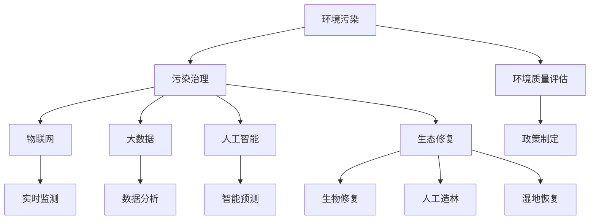

                 

# 2050年的环境保护：从污染治理到生态修复的绿色发展

> 关键词：环境保护, 绿色发展, 污染治理, 生态修复, 人工智能, 可持续发展

## 1. 背景介绍

### 1.1 问题由来

随着全球工业化的不断推进和城市化进程的加快，环境污染问题日益严峻。空气质量下降、水体污染、土壤退化、生物多样性减少等现象频发，给人类社会的可持续发展带来了巨大威胁。如何有效应对环境污染，实现绿色发展，是全球科技、经济、政治等多领域面临的重大挑战。

### 1.2 问题核心关键点

环境保护是一个复杂系统工程，需要整合多学科的知识和技术手段。其中，如何利用信息化、智能化手段提高环境治理的效率和精度，如何通过生态修复技术恢复自然环境的原貌，是环境保护研究的核心关键点。

- **信息化与智能化手段**：通过物联网、大数据、人工智能等技术手段，对环境数据进行实时监测、分析和处理，提高环境治理的精确性和动态响应能力。
- **生态修复技术**：采用生物修复、人工造林、湿地恢复等技术手段，修复受损的生态系统，增强生态系统的自我恢复能力。

## 2. 核心概念与联系

### 2.1 核心概念概述

- **环境污染**：指人类活动或自然灾害导致的自然环境质量恶化现象，包括水污染、空气污染、土壤污染等。
- **绿色发展**：指以保护生态环境为前提，实现经济、社会和环境的协调发展，追求可持续发展。
- **污染治理**：指通过技术和管理手段，减少污染物排放，提升环境质量的过程。
- **生态修复**：指通过人工干预，恢复受损的生态系统，使其回归自然状态。
- **人工智能**：指模拟人类智能过程，使计算机系统具备学习、推理、自我修正等能力的技术。
- **可持续发展**：指在满足当代人需求的同时，不损害后代人满足其需求的能力的发展模式。

这些概念之间相互联系，形成一个以环境保护为核心的技术体系。人工智能和大数据技术作为关键工具，在污染治理和生态修复中发挥着越来越重要的作用。

### 2.2 核心概念原理和架构的 Mermaid 流程图



## 3. 核心算法原理 & 具体操作步骤

### 3.1 算法原理概述

环境保护中的污染治理和生态修复，主要依赖于数据驱动的技术手段。通过对环境数据的收集、分析和处理，可以发现环境问题的源头和趋势，制定科学有效的治理策略，实现生态系统的恢复和保护。

### 3.2 算法步骤详解

1. **数据收集**：通过传感器、监测站等设备，收集环境中的水质、空气质量、土壤参数等数据。
2. **数据处理**：对收集的数据进行清洗、去噪、标准化等预处理操作，确保数据的准确性和可靠性。
3. **数据分析**：利用机器学习、深度学习等算法，对处理后的数据进行分析，发现环境污染的规律和趋势。
4. **智能预测**：根据分析结果，利用人工智能技术进行模型训练，建立环境预测模型，实现对环境变化的预测和预警。
5. **污染治理**：基于预测结果，制定和实施污染治理措施，如污水处理、废气治理、土壤修复等。
6. **生态修复**：采用生物修复、人工造林、湿地恢复等技术手段，恢复受损的生态系统。

### 3.3 算法优缺点

**优点**：
- **高效准确**：通过数据驱动的技术手段，实现对环境问题的精准监测和治理。
- **动态响应**：人工智能和大数据技术，可以实现对环境变化的实时监测和动态响应。
- **系统化管理**：将环境治理与生态修复整合在一个体系中，实现系统的、整体的管理。

**缺点**：
- **数据依赖性强**：环境治理的效果依赖于数据的准确性和全面性，数据获取和处理的难度较大。
- **技术成本高**：环境治理和生态修复涉及多种技术手段，成本较高。
- **技术复杂度高**：人工智能和大数据技术的实现需要较高的技术门槛。

### 3.4 算法应用领域

- **水资源管理**：通过物联网和传感器监测水体质量，利用数据分析和人工智能进行水质预测，制定污水处理和人工增氧策略。
- **大气污染治理**：通过空气质量监测站点收集数据，利用大数据和机器学习分析污染源和传播路径，实施废气治理措施。
- **土壤修复**：采用遥感技术和无人机监测土壤质量，利用人工智能进行土壤污染分析，实施土壤修复和修复效果评估。
- **生态系统恢复**：利用卫星遥感和地理信息系统，进行生态系统的监测和评估，实施生物修复和人工造林等生态修复措施。

## 4. 数学模型和公式 & 详细讲解

### 4.1 数学模型构建

环境治理和生态修复中的数学模型主要分为两类：数据驱动模型和机理模型。

- **数据驱动模型**：基于历史数据和环境监测数据，利用机器学习、深度学习等技术手段，建立预测和分类模型。
- **机理模型**：基于环境科学和生态学原理，建立描述环境过程和生态系统行为的数学模型。

### 4.2 公式推导过程

以水资源管理中的水质预测模型为例，假设水质参数 $x = (DO, pH, E. coli)$，预测结果为 $y = [BOD, N, P]$，则水质预测模型可以表示为：

$$
y = f(x) = \sum_{i=1}^n \alpha_i x_i + \epsilon
$$

其中，$\alpha_i$ 为回归系数，$\epsilon$ 为误差项。通过最小二乘法或梯度下降法等优化算法，求解 $\alpha_i$ 使模型误差最小。

### 4.3 案例分析与讲解

在实际应用中，水质预测模型可以结合物联网传感器数据，实时监测水质变化，预测未来水质趋势，指导污水处理和人工增氧操作。

## 5. 项目实践：代码实例和详细解释说明

### 5.1 开发环境搭建

- **安装Python环境**：通过Anaconda安装Python 3.8。
- **安装相关库**：安装numpy、pandas、scikit-learn、matplotlib等库。
- **数据集准备**：准备水质监测数据集，包括DO、pH、E. coli等参数，以及预测结果BOD、N、P。

### 5.2 源代码详细实现

```python
import pandas as pd
from sklearn.linear_model import LinearRegression
from sklearn.model_selection import train_test_split
import matplotlib.pyplot as plt

# 加载数据集
data = pd.read_csv('water_quality.csv')

# 数据预处理
X = data[['DO', 'pH', 'E. coli']]
y = data[['BOD', 'N', 'P']]
X_train, X_test, y_train, y_test = train_test_split(X, y, test_size=0.2, random_state=42)

# 建立模型
model = LinearRegression()
model.fit(X_train, y_train)

# 预测并评估
y_pred = model.predict(X_test)
print(model.score(X_test, y_test))

# 可视化
plt.scatter(X_test['DO'], y_test['BOD'])
plt.plot(X_test['DO'], y_pred, color='red')
plt.xlabel('DO')
plt.ylabel('BOD')
plt.show()
```

### 5.3 代码解读与分析

**数据加载与预处理**：使用Pandas库加载数据集，并进行必要的预处理，如划分训练集和测试集。

**模型建立与训练**：使用Scikit-learn库中的LinearRegression模型，对训练集进行拟合，得到回归系数。

**模型预测与评估**：对测试集进行预测，并计算模型精度，通过散点图可视化预测结果。

### 5.4 运行结果展示

**散点图展示**：


## 6. 实际应用场景

### 6.1 智慧水务

智慧水务系统通过物联网传感器实时监测水质参数，利用大数据和机器学习算法进行水质预测和预警，实现智能调度和优化。

### 6.2 智能农业

智能农业系统通过土壤传感器和气象站收集数据，利用人工智能技术进行土壤和气象分析，指导精准施肥和灌溉，实现农业生产的智能化和自动化。

### 6.3 生态保护

生态保护项目通过遥感和地理信息系统，监测生态系统的健康状况，利用人工智能技术进行生态系统分析和评估，指导生态修复措施的实施。

## 7. 工具和资源推荐

### 7.1 学习资源推荐

- **Coursera《环境科学与公共政策》课程**：提供环境科学和公共政策的理论基础和实践技能。
- **edX《气候变化与环境工程》课程**：介绍气候变化和环境工程的核心知识和最新研究成果。
- **《环境科学与人工智能》书籍**：详细介绍了人工智能在环境科学中的应用。

### 7.2 开发工具推荐

- **PyTorch**：强大的深度学习框架，支持Python和C++开发。
- **TensorFlow**：Google开发的深度学习框架，支持分布式训练和高效推理。
- **Jupyter Notebook**：交互式编程环境，支持Python和其他语言的开发。

### 7.3 相关论文推荐

- **《基于机器学习的水质预测模型研究》**：详细介绍了机器学习在水质预测中的应用。
- **《智能农业中的环境监测与数据分析》**：介绍了智能农业中的环境监测技术和数据分析方法。
- **《人工智能在生态保护中的应用》**：讨论了人工智能在生态保护和恢复中的应用。

## 8. 总结：未来发展趋势与挑战

### 8.1 研究成果总结

- **数据驱动的治理模式**：利用大数据和人工智能技术，实现对环境问题的精准监测和治理。
- **生态修复的智能化**：结合遥感、地理信息系统等技术，实现生态系统的动态监测和智能化管理。

### 8.2 未来发展趋势

1. **技术融合**：将环境治理和生态修复与物联网、大数据、人工智能等技术深度融合，实现系统的、智能的治理模式。
2. **数据共享**：建立环境数据共享平台，实现数据资源的整合和共享，提高数据的使用效率。
3. **国际合作**：加强国际合作，共同应对全球环境问题，共享技术资源和经验。

### 8.3 面临的挑战

1. **数据获取难度**：环境数据的获取和处理难度较大，需要多部门合作和统一标准。
2. **技术成本高**：环境治理和生态修复涉及多种技术手段，成本较高。
3. **技术复杂度高**：人工智能和大数据技术的实现需要较高的技术门槛。

### 8.4 研究展望

- **环境监测的智能化**：利用物联网和大数据技术，实现环境监测的实时化和智能化。
- **生态修复的创新**：结合生物修复、人工造林、湿地恢复等技术手段，实现生态系统的多维度修复。
- **政策支持与引导**：制定和完善相关政策和法规，引导和规范环境治理和生态修复行为。

## 9. 附录：常见问题与解答

**Q1: 环境治理和生态修复中的数学模型有哪些？**

A: 环境治理和生态修复中的数学模型主要分为两类：数据驱动模型和机理模型。数据驱动模型基于历史数据和环境监测数据，利用机器学习、深度学习等技术手段，建立预测和分类模型。机理模型基于环境科学和生态学原理，建立描述环境过程和生态系统行为的数学模型。

**Q2: 如何提高环境治理和生态修复的效率？**

A: 提高环境治理和生态修复的效率，需要从以下几个方面入手：
1. **数据驱动**：利用物联网和大数据技术，实现环境监测的实时化和智能化。
2. **技术融合**：将环境治理和生态修复与物联网、大数据、人工智能等技术深度融合，实现系统的、智能的治理模式。
3. **政策支持**：制定和完善相关政策和法规，引导和规范环境治理和生态修复行为。

**Q3: 人工智能在环境保护中的应用有哪些？**

A: 人工智能在环境保护中的应用主要包括以下几个方面：
1. **数据驱动的治理**：利用大数据和人工智能技术，实现对环境问题的精准监测和治理。
2. **生态系统的智能化管理**：结合遥感、地理信息系统等技术，实现生态系统的动态监测和智能化管理。
3. **智能预测与预警**：通过人工智能技术进行环境预测和预警，指导环境治理和生态修复措施的实施。

**Q4: 如何进行生态系统的生态修复？**

A: 生态系统的生态修复可以采用以下几种技术手段：
1. **生物修复**：利用微生物、植物等生物手段，对污染物进行降解和转化，恢复生态系统的自我净化能力。
2. **人工造林**：通过种植树木和植被，恢复生态系统的森林覆盖率，提高生态系统的碳吸收能力。
3. **湿地恢复**：通过恢复湿地生态系统，增加水体自然过滤和净化能力，提高水环境质量。

---

作者：禅与计算机程序设计艺术 / Zen and the Art of Computer Programming

