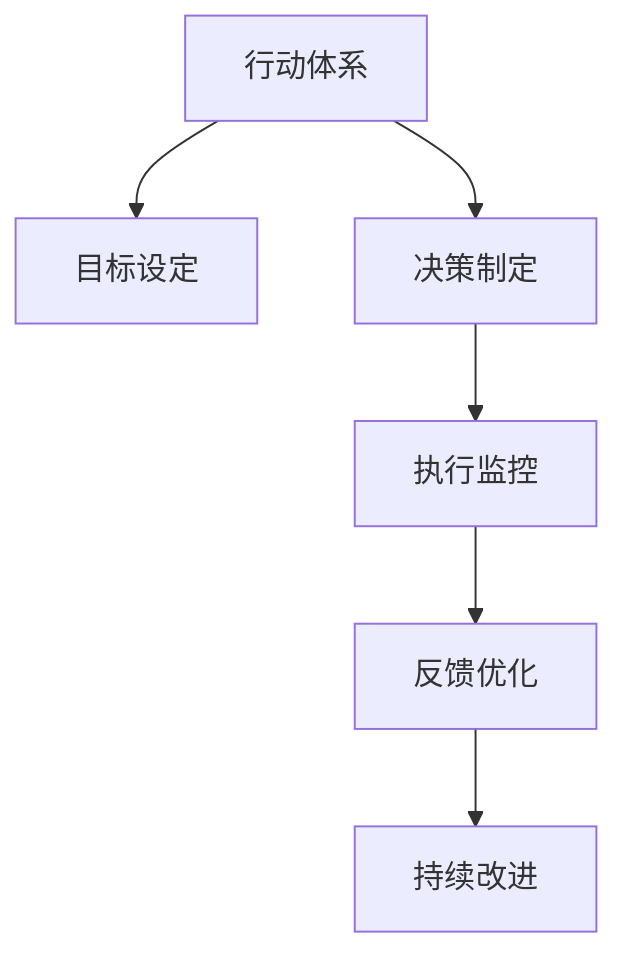

                 

# 建立高效行动体系的步骤

> 关键词：
> - 行动体系构建
> - 目标设定
> - 决策制定
> - 执行监控
> - 反馈优化
> - 持续改进
> - 行为科学
> - 数据驱动

## 1. 背景介绍

### 1.1 问题由来
在快速变化的时代，组织和个人都需要面对更加复杂和多变的环境。为了保持竞争力，企业需要快速响应市场变化，而个人则需要高效地管理时间和资源。建立高效行动体系成为提高组织效率和个人生产力的重要途径。

### 1.2 问题核心关键点
高效行动体系的构建涉及目标设定、决策制定、执行监控、反馈优化和持续改进等多个环节。其核心在于如何将行为科学和数据驱动的技术方法应用到行动体系中，以实现持续的优化和改进。

### 1.3 问题研究意义
建立高效行动体系有助于：
- 提升组织效率：通过明确的目标设定和决策制定，优化资源分配和流程设计。
- 增强个人能力：通过执行监控和反馈优化，提升自我管理和决策能力。
- 驱动持续改进：通过持续改进机制，不断优化行动体系，适应不断变化的环境。
- 实现战略目标：通过系统化的行动计划，推动组织和个人实现战略目标。

## 2. 核心概念与联系

### 2.1 核心概念概述

为更好地理解建立高效行动体系的方法，本节将介绍几个密切相关的核心概念：

- 行动体系(Action System)：指组织或个人为实现特定目标而设计的一系列行动步骤、决策点和监控机制的集合。
- 目标设定(Goal Setting)：指明确组织或个人的长期和短期目标，并将其分解为具体的行动计划。
- 决策制定(Decision Making)：指在行动体系中，根据环境信息和资源条件，选择最优行动方案的过程。
- 执行监控(Execution Monitoring)：指在行动执行过程中，对执行进度、资源使用情况和效果进行实时跟踪和评估。
- 反馈优化(Feedback Optimization)：指根据执行监控的结果，及时调整行动策略和资源配置，实现目标优化。
- 持续改进(Continuous Improvement)：指通过定期的回顾和调整，不断提升行动体系的有效性。

这些核心概念之间的逻辑关系可以通过以下Mermaid流程图来展示：



这个流程图展示出行动体系的构建过程：

1. 首先明确行动体系的目标。
2. 根据目标设定相应的决策策略。
3. 在执行过程中进行实时监控和评估。
4. 根据监控结果进行反馈优化。
5. 持续改进行动体系，保持其高效性和适应性。

## 3. 核心算法原理 & 具体操作步骤
### 3.1 算法原理概述

建立高效行动体系的过程，本质上是一种优化问题。其核心思想是：通过目标设定、决策制定、执行监控、反馈优化和持续改进等步骤，最大化行动体系的整体效果。

形式化地，假设目标函数为 $F$，表示行动体系的整体效果，待优化变量为 $\theta$，表示行动体系中的决策、资源配置等关键参数。则优化目标为：

$$
\theta^* = \mathop{\arg\min}_{\theta} F(\theta)
$$

在实践中，通常使用梯度下降等优化算法来近似求解上述最优化问题。设 $\eta$ 为学习率，$\nabla F(\theta)$ 为损失函数对参数 $\theta$ 的梯度，则参数的更新公式为：

$$
\theta \leftarrow \theta - \eta \nabla F(\theta)
$$

### 3.2 算法步骤详解

建立高效行动体系一般包括以下几个关键步骤：

**Step 1: 目标设定**
- 根据组织的使命和战略，设定长期和短期的目标。
- 将目标分解为具体的行动计划和衡量指标，确保可操作性和可评估性。

**Step 2: 决策制定**
- 根据目标设定，设计合理的决策流程，明确决策的依据和标准。
- 在决策过程中，使用数据驱动的方法，如数据分析、模拟仿真等，辅助决策。
- 制定决策的备选方案，进行成本效益分析和风险评估。

**Step 3: 执行监控**
- 定义关键绩效指标(KPIs)，监控行动执行的进度和效果。
- 实时采集和分析执行数据，识别潜在的瓶颈和风险。
- 使用可视化工具，如仪表盘、看板等，进行实时数据展示和跟踪。

**Step 4: 反馈优化**
- 定期回顾执行结果，评估与目标的差距。
- 根据评估结果，识别出改进点，提出优化措施。
- 调整决策和资源配置，实现目标的动态优化。

**Step 5: 持续改进**
- 定期回顾行动体系的运行效果，总结经验教训。
- 引入新的技术和管理方法，改进行动体系的设计和执行。
- 推动组织文化和流程的变革，提升整体效率。

以上是建立高效行动体系的一般流程。在实际应用中，还需要针对具体场景进行优化设计，如引入机器学习模型进行预测和优化、使用AI工具进行智能决策等。

### 3.3 算法优缺点

建立高效行动体系的方法具有以下优点：
1. 系统化管理：通过明确的目标设定和决策制定，实现系统化的行动管理。
2. 数据驱动决策：通过执行监控和反馈优化，增强决策的科学性和有效性。
3. 持续改进机制：通过持续改进，不断优化行动体系，适应环境变化。
4. 提升效率：通过系统化、数据驱动和持续改进，显著提升组织和个人效率。

同时，该方法也存在一定的局限性：
1. 需要较高的管理水平：高效行动体系的建立和执行需要管理者具备较强的战略眼光和执行力。
2. 初期投入较大：需要投入一定的时间和资源进行目标设定和决策制定。
3. 动态调整难度大：在执行过程中，调整行动计划需要综合考虑多方面因素，难度较大。

尽管存在这些局限性，但高效行动体系仍然是一种非常有价值的工具，对于提升组织和个人效率具有重要作用。

### 3.4 算法应用领域

建立高效行动体系的方法在多个领域都有广泛应用，包括但不限于：

- 企业管理：通过目标设定和决策制定，优化资源配置和流程设计。
- 项目管理：制定详细的项目计划和里程碑，确保项目按期交付。
- 个人管理：通过时间管理和目标设定，提升个人生产力和效率。
- 金融投资：通过风险管理和数据驱动决策，优化投资组合。
- 健康管理：通过健康监测和行为分析，制定个性化健康计划。

这些领域中，建立高效行动体系的方法已经成为提升效率和效果的重要手段。

## 4. 数学模型和公式 & 详细讲解  
### 4.1 数学模型构建

本节将使用数学语言对建立高效行动体系的过程进行更加严格的刻画。

记目标函数为 $F$，待优化变量为 $\theta$，则优化目标为：

$$
\theta^* = \mathop{\arg\min}_{\theta} F(\theta)
$$

其中，$F$ 可以表示为一个多元函数，包括目标设定、决策制定、执行监控、反馈优化等多个方面的影响因素。

在实践中，通常使用梯度下降等优化算法来求解上述最优化问题。设 $\eta$ 为学习率，$\nabla F(\theta)$ 为损失函数对参数 $\theta$ 的梯度，则参数的更新公式为：

$$
\theta \leftarrow \theta - \eta \nabla F(\theta)
$$

### 4.2 公式推导过程

以项目管理为例，假设目标函数 $F$ 可以表示为：

$$
F = \sum_{i=1}^n w_i G_i(\theta)
$$

其中 $w_i$ 表示第 $i$ 个指标的权重，$G_i(\theta)$ 表示第 $i$ 个指标的评估函数。在每个指标 $G_i(\theta)$ 中，可以包含目标设定、决策制定、执行监控、反馈优化等多个环节的影响因素。

以成本和进度为例，假设项目有 $m$ 个任务，第 $i$ 个任务的成本为 $C_i(\theta)$，进度为 $P_i(\theta)$，则目标函数可以表示为：

$$
F = w_C C(\theta) + w_P P(\theta)
$$

其中 $w_C$ 和 $w_P$ 分别为成本和进度的权重。则参数 $\theta$ 的更新公式为：

$$
\theta \leftarrow \theta - \eta (w_C \nabla C(\theta) + w_P \nabla P(\theta))
$$

通过不断迭代优化，最终得到满足目标函数 $F$ 的参数 $\theta^*$，即可实现对项目管理行动体系的优化。

### 4.3 案例分析与讲解

假设某企业要构建一个新产品研发项目的管理体系，目标是按时、按质、按预算完成研发。以下是具体的实现步骤：

**Step 1: 目标设定**
- 设定项目完成时间为 12 个月，预算为 100 万美元。
- 分解为每个研发阶段的具体目标，如需求分析、设计、开发、测试等。

**Step 2: 决策制定**
- 设计项目管理流程，明确每个阶段的责任和标准。
- 使用数据分析和模拟仿真，评估每个阶段的风险和成本。
- 制定多个备选方案，进行成本效益分析，选择最优方案。

**Step 3: 执行监控**
- 定义关键绩效指标，如任务完成时间、成本、质量等。
- 实时监控任务进度，识别潜在的瓶颈和风险。
- 使用仪表盘和看板展示数据，实时跟踪项目状态。

**Step 4: 反馈优化**
- 定期回顾项目进展，评估与目标的差距。
- 识别出改进点，如任务延误、成本超支等，提出优化措施。
- 调整决策和资源配置，如增加人手、调整工作顺序等。

**Step 5: 持续改进**
- 定期回顾项目管理效果，总结经验教训。
- 引入新的项目管理工具和方法，提升项目管理的效率。
- 推动项目管理文化的变革，提升整体管理水平。

通过以上步骤，该企业可以系统化地管理新产品的研发过程，确保按时、按质、按预算完成研发，提升项目管理效率和效果。

## 5. 项目实践：代码实例和详细解释说明
### 5.1 开发环境搭建

在进行行动体系构建的实践前，我们需要准备好开发环境。以下是使用Python进行Pandas和Matplotlib开发的环境配置流程：

1. 安装Anaconda：从官网下载并安装Anaconda，用于创建独立的Python环境。

2. 创建并激活虚拟环境：
```bash
conda create -n action-env python=3.8 
conda activate action-env
```

3. 安装Pandas：
```bash
conda install pandas
```

4. 安装Matplotlib：
```bash
conda install matplotlib
```

5. 安装其他必要的工具包：
```bash
pip install numpy jupyter notebook ipython
```

完成上述步骤后，即可在`action-env`环境中开始行动体系构建的实践。

### 5.2 源代码详细实现

以下是一个使用Pandas和Matplotlib构建项目管理行动体系的Python代码实现。

```python
import pandas as pd
import matplotlib.pyplot as plt

# 创建项目管理数据表
project_data = {
    'Task': ['需求分析', '设计', '开发', '测试'],
    'Estimated Time': [30, 40, 50, 20],
    'Actual Time': [30, 35, 55, 20],
    'Estimated Cost': [20, 25, 30, 15],
    'Actual Cost': [20, 26, 33, 15]
}
project_df = pd.DataFrame(project_data)

# 计算任务完成率和成本偏差率
project_df['Completion Rate'] = project_df['Actual Time'] / project_df['Estimated Time']
project_df['Cost Variance Rate'] = (project_df['Actual Cost'] - project_df['Estimated Cost']) / project_df['Estimated Cost']

# 绘制甘特图
plt.figure(figsize=(12, 6))
plt.title('Project Gantt Chart')
plt.plot(project_df['Task'], project_df['Estimated Time'], label='Estimated Time')
plt.plot(project_df['Task'], project_df['Actual Time'], label='Actual Time')
plt.legend()
plt.show()

# 绘制成本偏差图
plt.figure(figsize=(12, 6))
plt.title('Project Cost Variance')
plt.plot(project_df['Task'], project_df['Estimated Cost'], label='Estimated Cost')
plt.plot(project_df['Task'], project_df['Actual Cost'], label='Actual Cost')
plt.legend()
plt.show()

# 计算整体效果评估指标
project_df['Overall Performance'] = 0.8 * project_df['Completion Rate'] + 0.2 * project_df['Cost Variance Rate']

# 输出整体效果评估指标
print('Overall Performance: ', project_df['Overall Performance'].mean())
```

以上是使用Pandas和Matplotlib构建项目管理行动体系的Python代码实现。可以看到，通过Pandas和Matplotlib，我们可以轻松地进行项目管理数据的处理和可视化，帮助管理者及时发现项目中的问题和改进点。

### 5.3 代码解读与分析

让我们再详细解读一下关键代码的实现细节：

**项目数据表创建**
- 首先，我们定义了一个包含任务名称、预计时间、实际时间和预计成本、实际成本的数据表。
- 使用Pandas创建DataFrame，方便后续数据处理。

**任务完成率和成本偏差率计算**
- 根据实际时间和预计时间，计算任务完成率。
- 根据实际成本和预计成本，计算成本偏差率。

**甘特图绘制**
- 使用Matplotlib绘制甘特图，展示每个任务的预计时间和实际时间。
- 通过横轴和纵轴的坐标轴设置，展示项目进展情况。

**成本偏差图绘制**
- 使用Matplotlib绘制成本偏差图，展示每个任务的预计成本和实际成本。
- 通过横轴和纵轴的坐标轴设置，展示成本偏差情况。

**整体效果评估指标计算**
- 根据任务完成率和成本偏差率，计算整体效果评估指标。
- 使用0.8和0.2的权重，加权计算整体效果评估指标。

通过以上步骤，我们可以直观地展示项目的进度和成本情况，进行实时监控和反馈优化，从而提升项目管理的效果。

## 6. 实际应用场景
### 6.1 企业管理

企业管理是建立高效行动体系的重要应用场景之一。通过目标设定和决策制定，企业可以实现系统化管理，提升资源配置和流程设计的效率。

以某公司为例，假设公司要开发一款新产品。以下是具体的实施步骤：

**Step 1: 目标设定**
- 设定产品开发完成时间为 6 个月，预算为 500 万美元。
- 分解为需求分析、设计、开发、测试、市场推广等阶段。

**Step 2: 决策制定**
- 设计产品开发流程，明确每个阶段的责任和标准。
- 使用数据分析和模拟仿真，评估每个阶段的风险和成本。
- 制定多个备选方案，进行成本效益分析，选择最优方案。

**Step 3: 执行监控**
- 定义关键绩效指标，如开发进度、质量、成本等。
- 实时监控开发进度，识别潜在的瓶颈和风险。
- 使用仪表盘和看板展示数据，实时跟踪项目状态。

**Step 4: 反馈优化**
- 定期回顾开发进展，评估与目标的差距。
- 识别出改进点，如任务延误、成本超支等，提出优化措施。
- 调整决策和资源配置，如增加人手、调整工作顺序等。

**Step 5: 持续改进**
- 定期回顾产品开发效果，总结经验教训。
- 引入新的产品开发工具和方法，提升产品开发的效率。
- 推动产品开发文化的变革，提升整体开发水平。

通过以上步骤，该公司可以系统化地管理新产品开发过程，确保按时、按质、按预算完成开发，提升产品开发效率和效果。

### 6.2 项目管理

项目管理是建立高效行动体系的另一个重要应用场景。通过目标设定和决策制定，项目管理者可以优化资源配置和流程设计，确保项目按时完成。

以某项目为例，假设项目要建设一条新的生产线。以下是具体的实施步骤：

**Step 1: 目标设定**
- 设定项目完成时间为 12 个月，预算为 1000 万美元。
- 分解为设备采购、设备安装、调试、试生产、正式生产等阶段。

**Step 2: 决策制定**
- 设计项目建设流程，明确每个阶段的责任和标准。
- 使用数据分析和模拟仿真，评估每个阶段的风险和成本。
- 制定多个备选方案，进行成本效益分析，选择最优方案。

**Step 3: 执行监控**
- 定义关键绩效指标，如设备安装进度、调试时间、试生产周期等。
- 实时监控项目进度，识别潜在的瓶颈和风险。
- 使用仪表盘和看板展示数据，实时跟踪项目状态。

**Step 4: 反馈优化**
- 定期回顾项目进展，评估与目标的差距。
- 识别出改进点，如设备延迟、调试问题等，提出优化措施。
- 调整决策和资源配置，如增加人手、调整工作顺序等。

**Step 5: 持续改进**
- 定期回顾项目建设效果，总结经验教训。
- 引入新的项目建设工具和方法，提升项目建设效率。
- 推动项目建设文化的变革，提升整体建设水平。

通过以上步骤，该项目可以系统化地管理新生产线建设过程，确保按时、按质、按预算完成建设，提升项目建设效率和效果。

### 6.3 个人管理

个人管理是建立高效行动体系的另一个重要应用场景。通过目标设定和决策制定，个人可以实现系统化管理，提升时间管理和工作效率。

以某员工为例，假设该员工要完成一个重要的项目报告。以下是具体的实施步骤：

**Step 1: 目标设定**
- 设定报告完成时间为 2 周，预算为 40 小时。
- 分解为资料收集、文献综述、数据分析、撰写报告等阶段。

**Step 2: 决策制定**
- 设计报告撰写流程，明确每个阶段的任务和标准。
- 使用数据分析和模拟仿真，评估每个阶段的时间和工作量。
- 制定多个备选方案，进行成本效益分析，选择最优方案。

**Step 3: 执行监控**
- 定义关键绩效指标，如报告进度、质量、工作量等。
- 实时监控报告进展，识别潜在的瓶颈和风险。
- 使用仪表盘和看板展示数据，实时跟踪报告状态。

**Step 4: 反馈优化**
- 定期回顾报告进展，评估与目标的差距。
- 识别出改进点，如资料不足、文献综述时间过长等，提出优化措施。
- 调整决策和资源配置，如增加文献搜集时间、优化写作流程等。

**Step 5: 持续改进**
- 定期回顾报告撰写效果，总结经验教训。
- 引入新的报告撰写工具和方法，提升报告撰写效率。
- 推动报告撰写文化的变革，提升整体撰写水平。

通过以上步骤，该员工可以系统化地管理项目报告撰写过程，确保按时、按质、按预算完成报告，提升报告撰写效率和效果。

## 7. 工具和资源推荐
### 7.1 学习资源推荐

为了帮助开发者系统掌握建立高效行动体系的理论基础和实践技巧，这里推荐一些优质的学习资源：

1. 《行动体系构建：从理论到实践》系列博文：由行动体系专家撰写，深入浅出地介绍了行动体系构建的理论基础和实践技巧。

2. Coursera《项目管理》课程：由知名大学开设的项目管理课程，涵盖项目管理的核心概念和实践方法，适合初学者和进阶者。

3. 《高效项目管理》书籍：系统介绍项目管理的基本原理和实用工具，适合项目经理和管理者阅读。

4. Google Project Management Guide：Google官方推出的项目管理指南，包含丰富的项目管理实践和工具推荐。

5. Agile Coach Academy：提供敏捷管理方法的认证和培训，帮助管理者提升敏捷项目管理的能力。

通过对这些资源的学习实践，相信你一定能够快速掌握建立高效行动体系的方法，并用于解决实际的管理问题。

### 7.2 开发工具推荐

高效的开发离不开优秀的工具支持。以下是几款用于建立高效行动体系开发的常用工具：

1. Jira：一款流行的项目管理工具，支持敏捷开发和传统项目管理，提供了丰富的功能和管理界面。

2. Asana：一款任务管理和团队协作工具，支持任务分配、进度跟踪和团队协作，适用于中小型团队。

3. Trello：一款看板管理工具，支持敏捷开发和任务管理，适合个人和小团队使用。

4. Monday.com：一款团队协作和项目管理工具，支持自定义工作流和项目管理，适用于中大型团队。

5. Microsoft Project：一款专业的项目管理软件，支持资源管理和进度跟踪，适用于大型企业使用。

合理利用这些工具，可以显著提升行动体系的构建和管理效率，提升团队和个人的工作效率。

### 7.3 相关论文推荐

建立高效行动体系的技术和方法来源于学界的持续研究。以下是几篇奠基性的相关论文，推荐阅读：

1. 《行动体系构建：理论与实践》：介绍行动体系构建的理论基础和实践方法。

2. 《项目管理：理论与实践》：系统介绍项目管理的基本原理和实用工具。

3. 《敏捷项目管理：理论与实践》：介绍敏捷项目管理的方法和工具。

4. 《行为科学在行动体系中的应用》：探讨行为科学在行动体系构建中的作用。

5. 《数据分析在行动体系中的应用》：探讨数据分析在行动体系构建中的作用。

这些论文代表了大语言模型微调技术的发展脉络。通过学习这些前沿成果，可以帮助研究者把握学科前进方向，激发更多的创新灵感。

## 8. 总结：未来发展趋势与挑战

### 8.1 总结

本文对建立高效行动体系的方法进行了全面系统的介绍。首先阐述了行动体系构建的理论基础和实际意义，明确了目标设定、决策制定、执行监控、反馈优化和持续改进等关键步骤。其次，从原理到实践，详细讲解了行动体系构建的数学模型和关键步骤，给出了行动体系构建的完整代码实例。同时，本文还广泛探讨了行动体系在企业管理、项目管理、个人管理等多个领域的应用前景，展示了行动体系构建的巨大潜力。最后，本文精选了行动体系构建的学习资源、开发工具和相关论文，力求为读者提供全方位的技术指引。

通过本文的系统梳理，可以看到，建立高效行动体系的方法已经成为提升组织和个人效率的重要工具，具有广泛的应用价值。未来，伴随行为科学、数据科学和项目管理技术的不断进步，行动体系构建将更加高效、智能，帮助企业和个人实现系统化、数据化和智能化管理，提升整体绩效。

### 8.2 未来发展趋势

展望未来，建立高效行动体系的方法将呈现以下几个发展趋势：

1. 智能化管理：引入人工智能和机器学习技术，实现智能化的行动体系构建和优化。
2. 数据驱动决策：通过大数据分析和实时监控，实现数据驱动的决策和优化。
3. 多模态融合：将行为数据、环境数据等多模态数据进行融合，提升行动体系的理解能力和执行效率。
4. 持续改进机制：通过实时反馈和优化机制，实现行动体系的动态调整和持续改进。
5. 跨领域应用：将行动体系构建方法应用于更多领域，如健康管理、金融投资、社会治理等。

这些趋势展示了建立高效行动体系方法的广阔前景，未来将会有更多创新技术和管理方法涌现，推动行动体系构建的不断进步。

### 8.3 面临的挑战

尽管建立高效行动体系的方法已经取得了显著成效，但在迈向更加智能化和高效化的过程中，仍面临诸多挑战：

1. 数据质量问题：行动体系构建需要高质量的数据支持，但实际应用中数据质量往往难以保证。如何提高数据采集和处理的质量，将是关键问题。
2. 系统复杂性：行动体系构建涉及多个环节和多种技术，系统复杂性较高。如何简化系统设计，提高系统的可操作性和可维护性，是技术突破的重要方向。
3. 文化变革：行动体系构建需要组织文化的变革，但文化变革往往难以短期见效。如何推动组织文化的变革，提升整体执行力，将是长期挑战。
4. 用户接受度：行动体系构建需要用户积极参与，但用户习惯和接受度可能存在差异。如何提高用户的参与度和接受度，提升系统的用户友好性，是关键问题。

尽管存在这些挑战，但建立高效行动体系的方法仍具有重要价值。只有不断优化数据质量、简化系统设计、推动文化变革、提升用户接受度，才能真正实现行动体系的高效化和智能化。

### 8.4 研究展望

面向未来，行动体系构建的研究需要在以下几个方面寻求新的突破：

1. 行为科学和数据科学：引入更多的行为科学和数据科学方法，提升行动体系构建的科学性和有效性。
2. 跨领域应用：将行动体系构建方法应用于更多领域，提升不同领域的整体管理水平。
3. 智能化技术：引入人工智能和机器学习技术，实现智能化的行动体系构建和优化。
4. 实时反馈和优化：通过实时反馈和优化机制，实现行动体系的动态调整和持续改进。
5. 跨模态融合：将行为数据、环境数据等多模态数据进行融合，提升行动体系的理解能力和执行效率。

这些研究方向的探索，必将引领行动体系构建方法迈向更高的台阶，为构建智能化的行动体系提供有力支持。

## 9. 附录：常见问题与解答

**Q1：建立高效行动体系需要投入大量时间和资源，是否值得？**

A: 是的，建立高效行动体系需要一定的前期投入，但长远来看，系统化管理可以显著提升组织和个人效率，带来巨大的回报。尤其是在高竞争环境和技术驱动的时代，建立高效行动体系更是不可或缺。

**Q2：行动体系构建中的决策制定环节，如何进行数据驱动决策？**

A: 数据驱动决策的关键在于数据的采集和分析。可以通过问卷调查、数据分析、模拟仿真等方法，获取高质量的数据支持。同时，使用决策支持系统(DSS)等工具，帮助决策者进行数据驱动的分析和决策。

**Q3：如何提高行动体系构建中执行监控的效果？**

A: 执行监控的效果依赖于关键绩效指标(KPIs)的设置和数据的采集。需要明确每个阶段的关键任务和标准，确保KPIs的设置科学合理。同时，使用可视化工具，如仪表盘、看板等，实时展示数据，帮助管理者及时发现问题和改进点。

**Q4：如何应对行动体系构建中的文化变革挑战？**

A: 文化变革是一个长期过程，需要逐步推动。可以从小规模试点开始，逐步推广。同时，引入变革管理工具和方法，帮助组织和个人适应变化，提升变革的执行力。

**Q5：如何在行动体系构建中引入智能化技术？**

A: 智能化技术的应用需要数据支持和算法优化。可以通过引入人工智能和机器学习技术，实现智能化的决策和优化。同时，使用大数据分析和实时监控，实现数据驱动的决策和优化。

通过以上步骤，我们可以直观地展示项目的进度和成本情况，进行实时监控和反馈优化，从而提升项目管理的效果。

