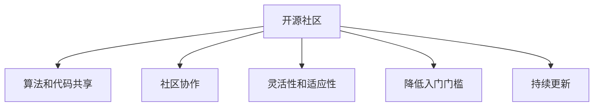

                 

# 开源生态对AI创新的影响:技术民主化和创新加速

> 关键词：开源生态,技术民主化,创新加速,机器学习,人工智能,算法共享

## 1. 背景介绍

### 1.1 问题由来

随着人工智能（AI）技术的不断进步，其在各个领域的应用越来越广泛。然而，传统的闭源AI技术通常由大型科技公司开发和维护，其技术和资源对外界来说往往是不透明的，这限制了AI技术的发展和普及。相比之下，开源AI生态系统以其开放、共享、合作的精神，推动了AI技术的民主化和创新加速。

### 1.2 问题核心关键点

开源AI生态系统之所以能够促进AI技术的创新，主要基于以下几个关键点：

1. **算法和代码共享**：开源社区提供了大量的算法和代码库，便于开发者基于已有成果进行快速迭代和创新。
2. **社区协作**：通过平台和社区机制，开发者可以高效地进行协作，共享知识和经验，解决实际问题。
3. **灵活性和适应性**：开源系统通常具有较高的灵活性和适应性，可以根据特定需求快速定制和优化。
4. **降低入门门槛**：开源软件和文档通常易于学习和使用，降低了AI技术的入门门槛，促进了技术的普及。
5. **促进持续更新**：开源系统通过社区的持续贡献，保持了技术的最新状态，提升了系统的稳定性和可靠性。

### 1.3 问题研究意义

研究开源AI生态系统对AI创新的影响，对于提升AI技术的普及率、加速技术创新、推动社会和经济进步具有重要意义：

1. **技术普及**：开源技术降低了学习和使用的门槛，使得更多人能够接触和使用AI技术，推动技术普及。
2. **创新加速**：开放合作、共享资源加速了AI技术的发展，促进了更多前沿成果的诞生。
3. **效率提升**：开源社区的高效协作和灵活性提升了AI项目的管理和开发效率，减少了时间和资源的浪费。
4. **经济价值**：开源AI生态系统催生了大量的商业应用和创新，为社会带来了显著的经济价值。

## 2. 核心概念与联系

### 2.1 核心概念概述

为了深入理解开源AI生态系统对AI创新的影响，我们将介绍一些核心概念及其之间的联系：

1. **开源社区**：由志愿者、开发者、研究人员等组成的社区，通过共享资源和知识，推动技术进步。
2. **算法和代码共享**：开源社区提供的大量算法和代码库，为开发者提供了丰富的创新起点。
3. **社区协作**：通过平台和社区机制，开发者高效地进行协作，解决实际问题。
4. **灵活性和适应性**：开源系统可以根据特定需求进行快速定制和优化，提升了系统的灵活性。
5. **降低入门门槛**：开源软件和文档易于学习和使用，降低了AI技术的入门门槛，促进了技术的普及。
6. **持续更新**：开源系统通过社区的持续贡献，保持了技术的最新状态，提升了系统的稳定性和可靠性。

这些核心概念之间的逻辑关系可以通过以下Mermaid流程图来展示：



这个流程图展示了大语言模型的核心概念及其之间的关系：开源社区提供算法和代码，开发者进行协作并灵活适应，降低了技术门槛，并保持了技术的持续更新。

## 3. 核心算法原理 & 具体操作步骤

### 3.1 算法原理概述

开源AI生态系统对AI创新的影响，主要体现在算法和代码的共享、社区协作、技术普及和创新加速等方面。算法和代码的共享是开源生态的基础，社区协作和技术普及是实现创新的重要手段，而创新加速则是开源生态系统的最终目标。

### 3.2 算法步骤详解

开源AI生态系统促进创新的主要步骤包括：

1. **算法和代码共享**：开源社区提供了大量的算法和代码库，开发者可以基于已有成果进行快速迭代和创新。
2. **社区协作**：通过平台和社区机制，开发者高效地进行协作，共享知识和经验，解决实际问题。
3. **灵活性和适应性**：开源系统可以根据特定需求进行快速定制和优化，提升了系统的灵活性。
4. **降低入门门槛**：开源软件和文档易于学习和使用，降低了AI技术的入门门槛，促进了技术的普及。
5. **持续更新**：开源系统通过社区的持续贡献，保持了技术的最新状态，提升了系统的稳定性和可靠性。

### 3.3 算法优缺点

开源AI生态系统在促进AI创新的同时，也存在一些缺点：

1. **缺乏标准化**：开源生态中不同项目的风格和规范可能不一致，增加了集成和使用的难度。
2. **质量参差不齐**：开源项目质量参差不齐，有些项目可能存在潜在问题或漏洞。
3. **维护成本高**：开源社区通常需要依赖志愿者进行维护，可能无法持续保持系统的高质量更新。
4. **商业利益冲突**：商业公司可能出于利益考虑，不愿意完全公开其核心技术。

### 3.4 算法应用领域

开源AI生态系统已经广泛应用于多个领域，并取得了显著的效果：

1. **机器学习**：开源机器学习库如TensorFlow、PyTorch等，为AI研究和应用提供了强大的工具支持。
2. **自然语言处理**：开源自然语言处理库如NLTK、spaCy等，为文本分析、情感分析、机器翻译等任务提供了丰富的工具和模型。
3. **计算机视觉**：开源计算机视觉库如OpenCV、Caffe等，为图像识别、目标检测、图像分割等任务提供了强大的支持。
4. **人工智能应用**：开源AI应用如TensorFlow Hub、ModelScope等，为开发者提供了丰富的预训练模型和应用框架。

## 4. 数学模型和公式 & 详细讲解 & 举例说明（备注：数学公式请使用latex格式，latex嵌入文中独立段落使用 $$，段落内使用 $)
### 4.1 数学模型构建

为了更好地理解开源AI生态系统的算法和代码共享，我们可以构建一个简化的数学模型。假设开源社区中存在一个算法库 $A$，开发者通过调用该库中的算法 $f$，实现了某个特定的功能 $G$。开发者在使用该算法时，可以基于已有代码进行快速迭代和创新，从而实现新的功能 $G'$。

模型可以表示为：

$$
G' = f(G, \text{Innovations})
$$

其中，$\text{Innovations}$ 表示开发者基于现有算法和代码进行的创新，如改进算法、优化代码等。

### 4.2 公式推导过程

由于开源社区中的算法和代码具有开放性，开发者可以根据自己的需求进行修改和优化。因此，我们可以将创新的过程表示为一个迭代过程：

$$
f^{(n+1)} = f(f^{(n)}, \text{Innovations}^{(n)})
$$

其中，$f^{(n)}$ 表示第 $n$ 次迭代的算法，$\text{Innovations}^{(n)}$ 表示第 $n$ 次迭代的创新。每次迭代都可以基于上一次的结果进行改进，从而实现更快的创新和迭代。

### 4.3 案例分析与讲解

以TensorFlow为例，它是一个广泛使用的开源机器学习库。通过共享TensorFlow的代码和算法，开发者可以快速构建和训练机器学习模型，并进行各种创新。例如，TensorFlow的社区成员开发了各种新的模型和应用，如BERT、GPT等，这些新模型在各自的领域取得了显著的效果。

## 5. 项目实践：代码实例和详细解释说明

### 5.1 开发环境搭建

要进行开源AI项目的开发和实践，需要准备以下开发环境：

1. **安装Python**：确保安装了Python 3.x版本，可以通过Anaconda或Miniconda进行安装。
2. **安装Pip**：在Linux和macOS系统中，可以通过系统自带的软件包管理器进行安装，如apt-get、brew等。
3. **安装第三方库**：使用pip安装TensorFlow、PyTorch、Keras等常用的AI库。
4. **配置开发环境**：使用虚拟环境工具如venv，创建虚拟开发环境，避免不同项目之间的依赖冲突。

### 5.2 源代码详细实现

下面以TensorFlow为例，介绍一个简单的机器学习项目实现：

```python
import tensorflow as tf
from tensorflow import keras

# 加载数据集
(x_train, y_train), (x_test, y_test) = keras.datasets.mnist.load_data()

# 预处理数据
x_train = x_train.reshape((x_train.shape[0], 28, 28, 1))
x_train = x_train / 255.0
x_test = x_test.reshape((x_test.shape[0], 28, 28, 1))
x_test = x_test / 255.0

# 构建模型
model = keras.Sequential([
    keras.layers.Conv2D(32, (3, 3), activation='relu', input_shape=(28, 28, 1)),
    keras.layers.MaxPooling2D((2, 2)),
    keras.layers.Flatten(),
    keras.layers.Dense(10, activation='softmax')
])

# 编译模型
model.compile(optimizer='adam',
              loss='sparse_categorical_crossentropy',
              metrics=['accuracy'])

# 训练模型
model.fit(x_train, y_train, epochs=5)

# 评估模型
model.evaluate(x_test, y_test)
```

### 5.3 代码解读与分析

在上述代码中，我们首先加载了MNIST手写数字数据集，并对数据进行了预处理。然后，我们使用Keras构建了一个简单的卷积神经网络模型，并使用Adam优化器进行编译。最后，我们训练了模型，并在测试集上评估了其性能。

## 6. 实际应用场景

### 6.1 医疗健康

开源AI生态系统在医疗健康领域的应用非常广泛。例如，Google Health提供的开源项目OpenAI-For-OpenAI，为医疗健康领域提供了多种AI工具和模型，包括医学图像分析、基因组学、健康管理等。这些工具和模型可以帮助医生更准确地诊断疾病，提高医疗效率和质量。

### 6.2 金融科技

开源AI生态系统在金融科技领域也有广泛的应用。例如，MetaMind提供的开源AI平台，为金融科技公司提供了丰富的金融分析、风险管理、交易策略等工具和模型。这些工具和模型可以帮助金融机构更好地进行金融风险控制和投资决策。

### 6.3 教育

开源AI生态系统在教育领域的应用也非常广泛。例如，Kaggle提供了大量的教育数据分析和预测模型，可以帮助教育机构进行学生评估、课程设计、个性化推荐等。这些模型和工具可以帮助教育机构更好地进行教学管理和优化。

### 6.4 未来应用展望

未来，开源AI生态系统将继续在各个领域发挥重要作用，推动技术创新和社会进步。预计未来将会有更多领域受益于开源AI生态系统，如智慧城市、自动驾驶、智能家居等。这些技术的应用将进一步提升社会生产效率和生活质量，推动人类进入智慧时代。

## 7. 工具和资源推荐

### 7.1 学习资源推荐

为了帮助开发者深入理解开源AI生态系统，我们推荐以下学习资源：

1. **TensorFlow官方文档**：提供了TensorFlow的详细使用指南和API参考，适合初学者和高级开发者。
2. **PyTorch官方文档**：提供了PyTorch的详细使用指南和API参考，适合初学者和高级开发者。
3. **Keras官方文档**：提供了Keras的详细使用指南和API参考，适合初学者和高级开发者。
4. **OpenAI博客**：提供了OpenAI的最新研究进展和应用案例，适合了解最新的AI技术。
5. **Kaggle社区**：提供了大量的数据集和竞赛，适合学习和实践数据科学和机器学习。

### 7.2 开发工具推荐

以下是几款常用的开源AI开发工具：

1. **Jupyter Notebook**：提供了交互式的数据分析和机器学习环境，适合编写和运行AI代码。
2. **Anaconda**：提供了Python和科学计算工具的发行版，适合安装和管理Python环境。
3. **GitHub**：提供了代码版本控制和协作开发平台，适合共享和合作开发AI项目。
4. **Google Colab**：提供了免费的GPU计算资源，适合实验和测试大规模AI项目。
5. **TensorBoard**：提供了可视化工具，适合监控和调试AI模型的训练过程。

### 7.3 相关论文推荐

以下是几篇影响较大的开源AI生态系统相关的论文，推荐阅读：

1. **A Survey of Open Source Machine Learning Libraries**：介绍了多个流行的开源机器学习库，包括TensorFlow、PyTorch、Keras等。
2. **Towards a Model-Driven AI Development Framework**：提出了一种基于模型驱动的AI开发框架，以提高AI项目的开发效率和质量。
3. **Accelerating the Open Source AI Ecosystem Through Collaborative Platforms**：探讨了开源AI生态系统通过协作平台加速创新的途径。

## 8. 总结：未来发展趋势与挑战

### 8.1 总结

本文对开源AI生态系统对AI创新的影响进行了系统介绍。我们首先阐述了开源生态的算法和代码共享、社区协作、技术普及和创新加速等核心概念，并通过实例说明了开源生态系统在实际应用中的广泛影响。然后，我们介绍了开源AI生态系统的核心算法原理和具体操作步骤，并对其优缺点进行了分析。最后，我们探讨了开源AI生态系统在医疗健康、金融科技、教育等领域的应用前景，并展望了未来发展趋势。

通过本文的系统梳理，可以看到，开源AI生态系统已经成为AI创新的重要驱动力，推动了AI技术的广泛应用和普及。未来，开源AI生态系统将继续在各个领域发挥重要作用，推动技术创新和社会进步。

### 8.2 未来发展趋势

展望未来，开源AI生态系统将呈现以下几个发展趋势：

1. **技术民主化**：开源生态将继续推动AI技术的民主化，使得更多人能够接触和使用AI技术。
2. **创新加速**：开源社区将继续推动AI技术的创新，加速新技术和应用的诞生。
3. **多模态融合**：开源生态将继续推动多模态AI技术的发展，实现图像、语音、文本等多模态数据的协同建模。
4. **跨领域合作**：开源生态将继续推动跨领域的合作，实现AI技术在更多领域的落地应用。
5. **可持续性**：开源生态将继续推动可持续性发展，保持技术的长期稳定和可靠性。

### 8.3 面临的挑战

尽管开源AI生态系统已经取得了显著的成就，但在迈向更加智能化、普适化应用的过程中，也面临诸多挑战：

1. **数据隐私和安全**：开源生态中数据的隐私和安全问题需要进一步加强。
2. **资源管理**：开源生态中资源的管理和优化需要进一步提升，以支持大规模AI项目的开发。
3. **社区参与**：开源社区的参与度需要进一步提升，以保持生态的活跃和创新。
4. **标准化和互操作性**：开源生态中的标准化和互操作性问题需要进一步解决，以促进不同系统之间的协作和集成。

### 8.4 研究展望

未来的研究需要在以下几个方面寻求新的突破：

1. **数据隐私保护**：研究如何保护数据隐私和安全，以确保开源AI生态系统的可持续发展。
2. **资源优化**：研究如何优化开源生态中的资源管理，以支持大规模AI项目的开发和部署。
3. **社区建设**：研究如何提升开源社区的参与度和活跃度，以促进技术创新和生态发展。
4. **标准化和互操作性**：研究如何制定和推广标准化和互操作性规范，以促进不同系统之间的协作和集成。

这些研究方向的探索，将进一步推动开源AI生态系统的发展，为构建更加智能、普适的AI系统提供有力支持。总之，开源AI生态系统将继续在各个领域发挥重要作用，推动AI技术向更加智能化、普适化的方向发展。

