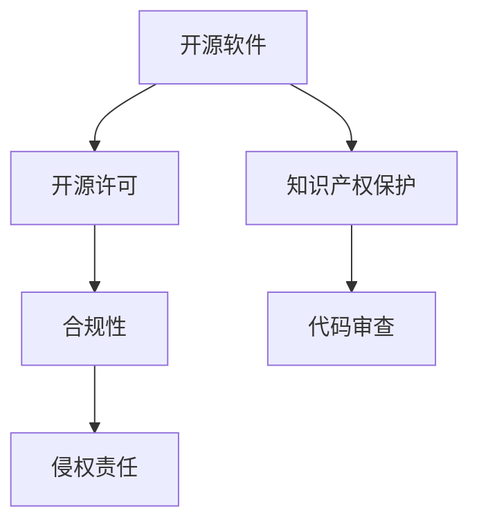

                 

# 开源项目的商业化法律考虑：合规与保护

> 关键词：开源软件,商业化,合规性,知识产权保护,法律框架,开源许可,软件使用,法律风险,代码审查,侵权责任

## 1. 背景介绍

在当今数字化转型加速的背景下，开源软件以其高度的灵活性和丰富的功能，成为了企业构建软件生态系统、加速产品迭代、提高创新效率的重要工具。然而，开源项目在商业化应用中，面临着诸多法律挑战和风险。如何在遵循开源协议的同时，保护商业利益和知识产权，确保项目的长期发展，成为企业必须认真考虑的问题。本文将系统性地介绍开源项目商业化中的法律合规和知识产权保护策略，帮助读者理解和应对这些复杂挑战。

## 2. 核心概念与联系

### 2.1 核心概念概述

- **开源软件（Open Source Software, OSS）**：指源代码公开，任何人都可以自由使用、修改和分发的软件。开源软件通常以GPL、Apache、MIT等多种许可协议为基础。
- **商业化（Commercialization）**：指将开源项目或技术进行商业应用和变现的过程，包括但不限于软件销售、服务提供、订阅模式等。
- **合规性（Compliance）**：指遵循相关法律、法规和行业标准，确保商业活动符合规定要求。
- **知识产权（Intellectual Property, IP）**：指创造性劳动所产生的智力成果，包括专利、商标、版权等。
- **开源许可（Open Source License）**：开源项目的版权所有者声明对软件的使用和分发条件，确保用户在使用、修改和分发时遵守相关规定。
- **代码审查（Code Review）**：指对代码进行审阅和修改，以确保代码质量和符合项目规范，避免法律和合规风险。
- **侵权责任（Infringement Liability）**：指因违反知识产权相关法律，需承担的法律责任，包括停止侵权、赔偿损失等。

这些核心概念相互联系，共同构成了开源项目商业化过程中需要考虑的法律框架。

### 2.2 核心概念原理和架构的 Mermaid 流程图



此流程图展示了开源软件、开源许可、知识产权保护、合规性和代码审查、侵权责任之间的联系。开源软件在其商业化过程中，需要遵守开源许可、保护知识产权、确保合规，并执行代码审查以减少法律风险。

## 3. 核心算法原理 & 具体操作步骤

### 3.1 算法原理概述

开源项目的商业化涉及多方面的法律问题，包括开源协议的遵循、知识产权的保护、商业模式的合规性等。核心的法律框架为：

1. **开源协议遵循**：选择合适开源许可，确保项目的使用、修改和分发符合协议要求。
2. **知识产权保护**：通过专利、商标、版权等手段，保护项目核心技术和商业成果。
3. **商业模式合规**：根据当地法律法规，设计和运营商业化模式，避免不当行为。
4. **代码审查机制**：建立严格审查流程，确保代码合规性和质量，避免侵权风险。

### 3.2 算法步骤详解

开源项目的商业化步骤包括以下关键环节：

**Step 1: 选择和配置开源许可**
- 根据项目类型和商业目标，选择合适的开源许可，如GPL、Apache、MIT等。
- 在项目代码中清晰标记开源许可，确保所有用户知晓使用和分发的条件。

**Step 2: 制定和执行知识产权保护策略**
- 对核心技术和商业成果进行专利、商标、版权的申请和保护。
- 定期审查代码库，确保无第三方版权侵犯。

**Step 3: 设计和运营商业模式**
- 根据项目特性和市场需求，设计合适的商业化模式，如软件销售、订阅服务、开源社区支持等。
- 遵守当地法律法规，避免不当商业行为。

**Step 4: 建立代码审查机制**
- 设置代码审查流程和标准，确保代码符合开源协议和内部规范。
- 定期审计代码库，发现和修正潜在风险。

### 3.3 算法优缺点

开源项目商业化的主要优点包括：
- **灵活性**：开源协议和社区资源提供了高度的灵活性和资源共享。
- **快速迭代**：开源社区可以快速集成最新技术和功能，加速产品开发。

然而，面临的主要挑战和缺点包括：
- **合规风险**：不熟悉开源许可或法律条款，可能导致合规风险和法律纠纷。
- **知识产权风险**：未充分保护项目核心技术，可能被侵权。
- **商业模式挑战**：在确保开源精神和保护商业利益之间找到平衡。

### 3.4 算法应用领域

开源项目的商业化广泛适用于软件开发、平台构建、技术咨询等领域。无论企业规模大小，都需要仔细规划和执行法律合规和知识产权保护策略，以确保项目在商业化过程中的稳健发展和长期利益。

## 4. 数学模型和公式 & 详细讲解 & 举例说明

### 4.1 数学模型构建

在开源项目商业化中，法律合规和知识产权保护可以建模为如下系统：

设 $C$ 为合规性成本，$I$ 为知识产权成本，$R$ 为商业化收益。则总成本 $T$ 和总收益 $S$ 可表示为：

$$
T = C + I
$$

$$
S = R - C - I
$$

其中，$C$ 和 $I$ 是控制变量，$R$ 是输出变量。模型目标是在满足法律合规和知识产权保护要求下，最大化商业收益 $S$。

### 4.2 公式推导过程

以 Apache 2.0 许可为例，进行成本和收益的推导：

**成本分析**：
- **合规性成本**：包括遵守许可协议的费用，如律师咨询费、软件复审费等。
- **知识产权成本**：包括申请专利、商标和版权的费用，以及维护费用。

**收益分析**：
- **商业化收益**：通过软件销售、订阅服务、社区支持等商业模式的收入。

推导步骤如下：
1. 设定合规性成本 $C_{\text{compliance}}$ 和知识产权成本 $C_{\text{IP}}$。
2. 设定商业化收益 $R_{\text{commercial}}$。
3. 建模总成本 $T = C_{\text{compliance}} + C_{\text{IP}}$。
4. 建模总收益 $S = R_{\text{commercial}} - C_{\text{compliance}} - C_{\text{IP}}$。

**举例说明**：
假设某开源项目采用 Apache 2.0 许可，合规性成本为 $C_{\text{compliance}} = 10,000 美元/年$，知识产权成本为 $C_{\text{IP}} = 5,000 美元/年$，商业化收益为 $R_{\text{commercial}} = 50,000 美元/年$。则总成本和总收益为：

$$
T = C_{\text{compliance}} + C_{\text{IP}} = 10,000 + 5,000 = 15,000 美元/年
$$

$$
S = R_{\text{commercial}} - C_{\text{compliance}} - C_{\text{IP}} = 50,000 - 10,000 - 5,000 = 35,000 美元/年
$$

可见，通过合理的成本控制，商业化收益可以显著超过成本。

### 4.3 案例分析与讲解

**案例1：Apache 2.0 下的合规性管理**
某公司开发了一款开源软件，采用 Apache 2.0 许可。公司在商业化初期，委托律师事务所进行合规性审查，花费了 $10,000 美元/年。由于未充分保护知识产权，公司最终被竞争对手起诉，赔偿了 $50,000 美元。这一事件导致公司的总成本大幅增加，商业收益下降。

**案例2：MySQL 的开源与商业化**
MySQL 是 MySQL AB 开发的开源数据库系统，通过GPL许可提供源代码。MySQL AB 后来被 Sun Microsystems 收购，并将MySQL商业化。在收购过程中，Sun Microsystems 对开源代码进行了严格审计，确保符合GPL协议。通过合理的商业化策略，MySQL 迅速成为全球领先的数据库软件。

以上两个案例展示了在开源项目商业化中，合规性和知识产权保护的重要性。

## 5. 项目实践：代码实例和详细解释说明

### 5.1 开发环境搭建

为确保开源项目在商业化过程中遵守法律和保护知识产权，需搭建如下开发环境：

1. **选择合适的开源许可**：根据项目特性，选择合适开源许可，如GPL、Apache、MIT等。
2. **配置代码库和版本控制系统**：使用Git等版本控制系统管理代码库，确保代码审查和历史追踪。
3. **设立合规性和知识产权管理制度**：制定代码审查流程、合规性审计和知识产权保护策略。

### 5.2 源代码详细实现

以下是一个简单的开源项目代码实例，展示了如何在代码中标注开源许可和执行代码审查：

**示例代码**：

```python
# Apache 2.0 License Example
# Licensed to the Apache Software Foundation (ASF) under one
# or more contributor license agreements. See the NOTICE file
# distributed with this work for additional information
# regarding copyright ownership. The ASF licenses this file
# to you under the Apache License, Version 2.0 (the
# "License"); you may not use this file except in compliance
# with the License. You may obtain a copy of the License at
#
#   http://www.apache.org/licenses/LICENSE-2.0
#
# Unless required by applicable law or agreed to in writing,
# software distributed under the License is distributed on an
# "AS IS" BASIS, WITHOUT WARRANTIES OR CONDITIONS OF ANY
# KIND, either express or implied. See the License for the
# specific language governing permissions and limitations
# under the License.

# 添加代码审查注释
# 添加代码审查流程，例如定期手动或自动审查代码库
# 添加代码审查结果，例如修复侵权代码，记录审查日志

# 具体代码实现...
```

### 5.3 代码解读与分析

在上述代码实例中，我们添加了开源许可和代码审查注释。这些注释确保了用户知晓代码的许可和使用条件，也提醒开发者在编写代码时注意合规性和知识产权保护。

代码审查流程可通过以下步骤实现：
1. **设定审查标准**：制定代码审查规范，包括代码质量、安全性和合规性要求。
2. **设定审查流程**：定义代码审查周期和参与人员。
3. **执行代码审查**：通过手动或自动工具进行代码审查，发现和修复潜在问题。
4. **记录审查结果**：记录代码审查结果和修复日志，确保审查过程透明和可追溯。

### 5.4 运行结果展示

通过严格执行代码审查，可以发现并修复潜在法律和合规问题，降低侵权风险。例如，以下代码审查示例展示了如何发现和修正代码侵权问题：

**示例代码审查**：

```python
# 检查代码中是否包含第三方版权内容
# 如果发现第三方内容，需删除或替换为合法内容

# 检查代码中是否使用开源库，确保许可合规
# 如果发现开源库许可与项目不兼容，需替换为合适开源库或修改代码

# 检查代码中是否存在敏感信息或商业机密
# 如果发现敏感信息，需删除或加密处理

# 检查代码中是否包含商标或版权信息
# 如果发现商标或版权信息，需确保符合许可要求或删除
```

## 6. 实际应用场景

开源项目商业化在多个领域具有广泛应用，以下列举几个典型场景：

### 6.1 软件开发
开源软件开发项目通过引入开源组件，加速产品开发和迭代。例如，企业可以基于开源框架和库，快速构建和部署软件应用。

**案例**：Apache Kafka
Apache Kafka 是一个开源分布式流处理平台，通过社区贡献和商业支持，实现了广泛的商业应用。公司可以基于Apache Kafka构建高可用的流数据处理系统。

### 6.2 平台构建
企业通过构建开源平台，提升技术能力和市场竞争力。例如，OpenStack 是全球领先的开源云平台，通过社区合作和商业部署，支持了全球数百万用户。

**案例**：OpenStack
OpenStack 是一个开源云平台，通过社区合作和商业支持，实现了云基础设施的广泛部署。公司可以通过OpenStack构建和管理自己的云服务。

### 6.3 技术咨询
技术咨询公司通过开发开源工具和解决方案，为客户提供技术服务。例如，Red Hat 提供基于开源技术的企业解决方案，帮助企业实现数字化转型。

**案例**：Red Hat
Red Hat 提供基于开源技术的企业解决方案，帮助企业实现数字化转型。通过商业化开源项目，Red Hat 提供了广泛的技术支持和咨询服务。

### 6.4 未来应用展望

未来，开源项目商业化将在更多领域得到广泛应用，以下是一些未来趋势：

1. **开源与商业化并行发展**：越来越多的企业将在开源项目上同时进行商业化开发和社区贡献。
2. **云原生开源项目兴起**：云原生技术（如Kubernetes、Docker等）将成为开源项目的重要组成部分。
3. **开源社区与商业支持结合**：社区和商业组织将更加紧密合作，共同推动开源项目的发展。
4. **开源项目多样性增加**：开源项目将覆盖更多行业和领域，为社会带来更多创新和价值。

## 7. 工具和资源推荐

### 7.1 学习资源推荐

为了帮助开发者系统掌握开源项目商业化中的法律合规和知识产权保护策略，以下是一些优质的学习资源：

1. **开源许可协议解读**：GitHub上的开源许可协议解读库，详细解析常见开源许可条款。
2. **开源社区治理**：Linux Foundation提供的开源社区治理指南，涵盖社区管理、合规性等。
3. **法律合规培训**：Coursera和Udacity等平台提供的专业法律合规课程，帮助开发者理解相关法律和法规。
4. **知识产权管理**：WIPO（世界知识产权组织）提供的知识产权管理资源库，涵盖专利、商标、版权等基础知识。
5. **代码审查工具**：GitHub的Pull Request功能，Gerrit等代码审查工具，支持自动化代码审查和合规性检查。

### 7.2 开发工具推荐

在开源项目商业化过程中，以下工具可以显著提高开发效率和质量：

1. **Git**：广泛使用的版本控制系统，支持代码审查和历史追踪。
2. **GitHub**：流行的开源代码托管平台，提供代码审查和合规性检查工具。
3. **Gerrit**：基于Web的开源代码审查工具，支持代码审查和项目管理。
4. **SonarQube**：代码质量管理工具，支持代码审查和安全检查。
5. **Legal Compliance Checker**：开源合规性检查工具，自动检测代码合规性问题。

### 7.3 相关论文推荐

开源项目商业化涉及多方面的法律和实践问题，以下是一些相关论文推荐：

1. **"Open Source Licensing: What Every Software Developer Needs to Know"**：博客文章，详细解读开源许可协议的含义和使用方法。
2. **"The Promise and Perils of Open Source: Legal and Compliance Considerations for Open Source Software Developers"**：法律文章，分析开源项目中法律合规性问题。
3. **"Open Source Software License Compliance and Enforcement: A Survey"**：学术论文，系统总结了开源许可的合规性问题和解决策略。
4. **"Open Source Software and Patent Infringement: A Primer"**：法律文章，分析开源项目中的专利侵权问题及其解决策略。
5. **"Protecting Your Open Source Software: Intellectual Property and License Compliance"**：法律文章，提供知识产权保护和开源许可合规的实践建议。

## 8. 总结：未来发展趋势与挑战

### 8.1 研究成果总结

开源项目商业化已成为企业数字化转型中的重要工具。本文系统介绍了开源项目的法律合规和知识产权保护策略，包括选择和配置开源许可、制定和执行知识产权保护策略、设计和运营商业模式、建立代码审查机制等方面。

### 8.2 未来发展趋势

未来开源项目商业化将呈现以下趋势：
1. **开源与商业化并行发展**：开源社区和商业组织将更加紧密合作，共同推动项目发展。
2. **云原生开源项目兴起**：云原生技术将成为开源项目的重要组成部分。
3. **开源社区与商业支持结合**：社区和商业组织将更加紧密合作，共同推动开源项目的发展。
4. **开源项目多样性增加**：开源项目将覆盖更多行业和领域，为社会带来更多创新和价值。

### 8.3 面临的挑战

尽管开源项目商业化前景广阔，但在实际应用中，仍面临诸多挑战：
1. **合规性挑战**：不熟悉开源许可或法律条款，可能导致合规风险和法律纠纷。
2. **知识产权风险**：未充分保护项目核心技术，可能被侵权。
3. **商业模式挑战**：在确保开源精神和保护商业利益之间找到平衡。

### 8.4 研究展望

未来的研究需要在以下几个方面寻求新的突破：
1. **开源协议优化**：研究和制定更加灵活、易用的开源许可协议，促进开源项目的发展。
2. **知识产权保护**：探索更加高效和自动化的知识产权保护机制，减少侵权风险。
3. **合规性工具**：开发更智能、更灵活的合规性检查工具，支持自动化合规性审查。
4. **社区与商业融合**：探索社区与商业组织的深度合作模式，推动开源项目的商业化。
5. **法律与技术结合**：加强法律和技术结合的深度研究，提供更全面的开源项目商业化解决方案。

## 9. 附录：常见问题与解答

**Q1: 如何选择合适的开源许可？**

A: 选择开源许可应考虑项目特性、目标用户和法律要求。常见开源许可包括GPL、Apache、MIT等，需要根据具体情况进行选择。

**Q2: 开源项目商业化过程中，如何保护知识产权？**

A: 通过专利、商标、版权等手段，保护项目核心技术和商业成果。定期审查代码库，确保无第三方版权侵犯。

**Q3: 开源项目商业化过程中，如何避免法律风险？**

A: 建立严格代码审查机制，确保代码合规性和质量。遵守当地法律法规，避免不当商业行为。

**Q4: 开源项目商业化过程中，如何处理开源许可和商业化之间的冲突？**

A: 制定明确的开源协议和商业化策略，确保双方利益平衡。保持透明沟通，解决潜在的冲突和纠纷。

**Q5: 开源项目商业化过程中，如何确保代码质量和安全性？**

A: 使用版本控制系统和代码审查工具，确保代码质量和安全性。定期进行安全审计和漏洞修复，确保项目稳定运行。

---

作者：禅与计算机程序设计艺术 / Zen and the Art of Computer Programming

