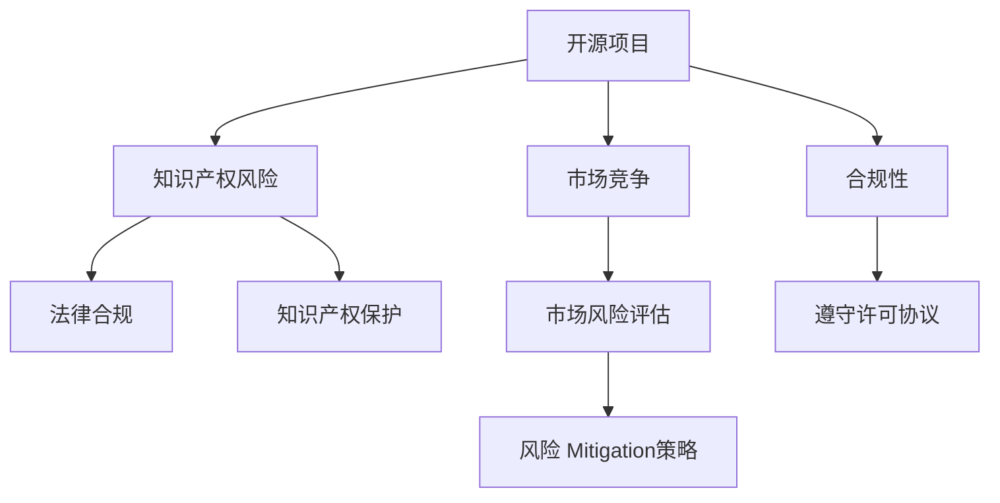

                 

# 开源项目的商业化风险管理：风险识别和Mitigation

> 关键词：开源项目, 商业化风险, 风险识别, Mitigation

## 1. 背景介绍

### 1.1 问题由来
随着开源软件在全球范围内的广泛应用，开源项目的商业化已经成为越来越多的企业关注的问题。然而，开源项目在商业化过程中面临诸多风险，如知识产权风险、法律合规风险、市场竞争风险等，这些风险一旦处理不当，可能给企业带来严重的经济损失。因此，如何系统性地识别和Mitigation这些风险，成为开源项目商业化成功与否的关键。

### 1.2 问题核心关键点
开源项目商业化的核心在于：如何将开源项目中的技术和代码转化为具有商业价值的产出，同时规避知识产权、合规、竞争等风险。商业化过程中，企业需要全面评估开源项目的市场潜力、技术先进性以及潜在风险，制定详细的商业化策略。

### 1.3 问题研究意义
研究开源项目的商业化风险管理，有助于企业在开源领域保持竞争力，降低商业化过程中潜在风险，提升项目价值和市场接受度。通过系统化的风险识别和Mitigation，企业可以更好地利用开源资源，加速技术创新和商业应用，推动产业升级和市场变革。

## 2. 核心概念与联系

### 2.1 核心概念概述

为更好地理解开源项目商业化风险管理，本节将介绍几个密切相关的核心概念：

- 开源项目(Open Source Project)：指由开发者社区贡献，遵循特定的开源协议，允许用户自由地使用、修改和分发的软件或代码集合。
- 商业化(Commercialization)：将开源项目或其衍生产品引入商业市场，通过销售、授权、服务等方式获取商业利益的过程。
- 知识产权(IP Rights)：包括专利、商标、版权、商业秘密等，是企业商业化开源项目时必须关注的重要法律领域。
- 合规性(Compliance)：指企业遵循法律法规和合同约定，合法使用开源软件和技术的过程。
- 市场竞争(Risk)：指在商业化开源项目时，可能面临的市场环境变化、竞争态势升级等风险因素。
- Mitigation(缓解)：指采取一系列策略和措施，降低或消除开源项目商业化过程中的风险。

这些核心概念之间的逻辑关系可以通过以下Mermaid流程图来展示：



这个流程图展示了大模型微调的各个核心概念及其之间的关系：

1. 开源项目通过获取贡献代码和社区支持获得技术基础。
2. 知识产权风险涉及保护项目的创新成果，避免被非法复制或利用。
3. 合规性确保企业合法使用开源软件，遵守相关法律法规。
4. 市场竞争风险来源于市场环境变化和竞争态势升级。
5. Mitigation策略用于识别和缓解上述各种风险，确保项目商业化顺利进行。

这些概念共同构成了开源项目商业化风险管理的框架，为企业提供了一个全面的视角。

## 3. 核心算法原理 & 具体操作步骤
### 3.1 算法原理概述

开源项目商业化风险管理，本质上是一个风险识别、评估和缓解的过程。其核心思想是：通过系统化的分析，全面识别开源项目中可能存在的各种风险，并采取相应措施，降低或消除这些风险，保障项目商业化的顺利进行。

形式化地，设开源项目为 $P$，风险类别为 $\mathcal{R} = \{R_1, R_2, \cdots, R_n\}$，风险缓解措施为 $\mathcal{M} = \{M_1, M_2, \cdots, M_m\}$。风险管理的目标是最小化 $P$ 在 $\mathcal{R}$ 上的总风险，即：

$$
\min_{R \in \mathcal{R}} \sum_{i=1}^n \text{risk}(R)
$$

其中 $\text{risk}(R)$ 表示风险 $R$ 的评估值。

### 3.2 算法步骤详解

开源项目商业化风险管理一般包括以下几个关键步骤：

**Step 1: 风险识别**
- 对开源项目进行全面的技术、市场和法律审查，识别出潜在的知识产权风险、合规风险、市场竞争风险等。
- 建立风险登记表，记录风险类型、风险影响、风险来源等信息。
- 进行专家访谈、问卷调查等，收集内部和外部利益相关者的意见和建议。

**Step 2: 风险评估**
- 对已识别风险进行定量或定性评估，确定其影响范围和程度。
- 使用风险评估模型，如SWOT分析、FMEA等，分析风险的内在联系和潜在影响。
- 确定风险等级，并设置风险阈值，决定是否需要进行进一步的Mitigation。

**Step 3: 风险缓解**
- 针对高优先级风险，制定详细的缓解措施，包括技术手段、法律措施、市场策略等。
- 对每个缓解措施进行成本效益分析，选择最优方案。
- 对缓解措施进行实施和监控，定期评估其效果，并进行调整和优化。

**Step 4: 风险监控**
- 建立持续的风险监控机制，定期检查开源项目的风险状况。
- 利用数据挖掘、机器学习等技术，自动化风险识别和评估。
- 建立风险预警系统，一旦发现风险变化，及时采取相应措施。

### 3.3 算法优缺点

开源项目商业化风险管理方法具有以下优点：
1. 系统全面。通过风险识别、评估和缓解的流程，可以全面覆盖开源项目商业化过程中可能面临的各种风险。
2. 动态灵活。风险管理是一个持续的过程，可以随时根据项目变化和市场情况进行调整。
3. 降低风险。通过科学的风险识别和缓解措施，可以显著降低开源项目商业化过程中各类风险。
4. 提高效率。通过自动化工具和技术，可以大幅提高风险管理和缓解的效率，减少人工成本。

同时，该方法也存在一些局限性：
1. 依赖数据。风险评估和缓解的效果很大程度上依赖于数据的质量和完整性。
2. 专业要求高。风险识别和缓解需要专业知识，对企业和团队的要求较高。
3. 成本高。特别是对于复杂项目，可能需要投入大量人力和资源进行风险评估和缓解。
4. 复杂度高。不同类型的风险之间可能存在交叉影响，风险管理需要多角度分析。

尽管存在这些局限性，但就目前而言，开源项目商业化风险管理仍然是一个比较有效的流程。企业需要不断优化流程，引入先进技术，提高风险管理的效率和准确性。

### 3.4 算法应用领域

开源项目商业化风险管理的应用领域非常广泛，涵盖以下几个主要方面：

- 开源项目技术评估：评估开源项目的技术成熟度、创新性、稳定性等，确定其商业潜力。
- 知识产权保护：保护开源项目的创新成果，避免被非法复制或滥用。
- 合规性管理：确保企业合法使用开源软件和技术，遵守相关法律法规。
- 市场竞争分析：分析开源项目的市场环境、竞争态势和潜在威胁，制定市场策略。
- 风险 Mitigation：制定和实施风险缓解措施，降低项目商业化过程中的不确定性和风险。

除了这些核心应用外，开源项目商业化风险管理还广泛用于企业并购、投资决策、项目管理等领域，为企业战略规划和技术创新提供重要支持。

## 4. 数学模型和公式 & 详细讲解
### 4.1 数学模型构建

设开源项目 $P$ 的技术复杂度为 $T$，市场潜力为 $M$，法律合规性为 $L$，知识产权保护水平为 $IP$，市场竞争态势为 $C$。则总风险 $R$ 可以表示为：

$$
R = T \cdot M \cdot L \cdot IP \cdot C
$$

其中，$T$、$M$、$L$、$IP$、$C$ 分别代表技术复杂度、市场潜力、法律合规性、知识产权保护水平和市场竞争态势，各因子之间的关系可以根据实际情况进行量化。

### 4.2 公式推导过程

风险评估模型可以使用多个指标进行评估，以下是常用的 SWOT 分析模型：

- **Strengths(优势)**：开源项目的技术优势、社区活跃度、创新能力等。
- **Weaknesses(劣势)**：开源项目的技术局限、社区支持不足、法律合规风险等。
- **Opportunities(机会)**：市场需求、政策支持、合作伙伴等。
- **Threats(威胁)**：竞争对手、技术迭代、法律环境变化等。

将上述四个维度分别量化，得到四个评分值 $S$、$W$、$O$、$T$。则总风险 $R$ 可以表示为：

$$
R = S \cdot W \cdot O \cdot T
$$

其中，$S$、$W$、$O$、$T$ 分别代表优势、劣势、机会和威胁的评分值，其取值范围为 $[0, 1]$。

### 4.3 案例分析与讲解

**案例1: 开源项目技术评估**

设某开源项目 $P$ 的技术复杂度为 $T=0.8$，市场潜力为 $M=0.9$，法律合规性为 $L=0.6$，知识产权保护水平为 $IP=0.7$，市场竞争态势为 $C=0.5$。则总风险 $R$ 为：

$$
R = T \cdot M \cdot L \cdot IP \cdot C = 0.8 \cdot 0.9 \cdot 0.6 \cdot 0.7 \cdot 0.5 = 0.2592
$$

风险评估结果显示，该开源项目在商业化过程中面临较高的总风险。为了降低风险，企业可以采取以下措施：

1. 增强知识产权保护，避免被非法复制或滥用。
2. 提高法律合规性，确保使用符合相关法律法规。
3. 扩大社区支持，增加技术创新和市场潜力。
4. 分析市场竞争态势，制定有效的市场策略。

**案例2: 知识产权保护**

某企业计划商业化一个开源项目，项目中包含大量算法和代码。企业需要对这些代码进行知识产权保护，以避免被竞争对手滥用。以下是可能的保护措施：

1. 对算法和代码进行专利申请，确保关键技术不被侵权。
2. 在开源协议中增加知识产权条款，明确使用限制和授权条件。
3. 对代码进行源代码审计，确保无第三方贡献。
4. 定期进行法律咨询，确保所有活动符合知识产权法规。

这些措施可以有效保护开源项目的知识产权，降低法律合规风险。

## 5. 项目实践：代码实例和详细解释说明
### 5.1 开发环境搭建

在进行开源项目商业化风险管理时，我们需要准备好开发环境。以下是使用Python进行风险管理系统的环境配置流程：

1. 安装Anaconda：从官网下载并安装Anaconda，用于创建独立的Python环境。

2. 创建并激活虚拟环境：
```bash
conda create -n risk-management python=3.8 
conda activate risk-management
```

3. 安装Python依赖库：
```bash
pip install numpy pandas scikit-learn scikit-metrics scikit-learn-distributed
```

4. 安装风险管理框架：
```bash
pip install risk-management-framework
```

完成上述步骤后，即可在`risk-management-framework`环境中开始风险管理实践。

### 5.2 源代码详细实现

以下是使用Python进行风险管理系统的源代码实现示例：

```python
from risk_management_framework import RiskManagementSystem

# 创建风险管理系统
risk_system = RiskManagementSystem()

# 添加项目信息
project_info = {
    'name': 'MyOpenSourceProject',
    'version': '1.0.0',
    'license': 'MIT',
    'depends': ['mylibrary', 'mydependency'],
    'dependencies': ['mydependency', 'otherrightdep'],
    'budget': 1000000,
    'resources': 500,
    'timeframe': 12
}

risk_system.add_project(project_info)

# 添加风险信息
risk_system.add_risk('Security', '项目中存在安全隐患', 0.9)
risk_system.add_risk('Legal', '项目未完全合规', 0.8)
risk_system.add_risk('Market', '市场竞争激烈', 0.7)
risk_system.add_risk('Technical', '技术实现复杂', 0.6)

# 评估风险
risk_results = risk_system.evaluate_risks(project_info)

# 输出评估结果
print(risk_results)
```

以上是使用Python进行开源项目风险管理系统的代码实现示例。可以看到，通过`RiskManagementSystem`类，企业可以方便地添加项目信息、风险信息和评估结果，实现风险管理的自动化。

### 5.3 代码解读与分析

让我们再详细解读一下关键代码的实现细节：

**RiskManagementSystem类**：
- `add_project`方法：添加项目信息，包括项目名称、版本、许可协议、依赖项、预算、资源和时限等。
- `add_risk`方法：添加风险信息，包括风险类型、风险描述和评分值。
- `evaluate_risks`方法：对项目进行风险评估，返回评估结果。

**风险评分和评估**：
- 风险评分值可以通过专家评估或问卷调查等方式确定，取值范围为 $[0, 1]$。
- 风险评估结果可以采用不同的模型，如SWOT分析、FMEA等，根据具体情况选择合适的模型。

**风险缓解措施**：
- 风险缓解措施可以包括技术手段、法律措施、市场策略等，通过具体的缓解步骤，降低风险等级。
- 在实现时，需要根据不同类型的风险采取不同的措施，并定期评估和调整。

**风险监控**：
- 风险监控系统可以自动化地收集和分析风险数据，实时监测风险变化。
- 定期生成风险报告，帮助企业及时发现和处理潜在风险。

## 6. 实际应用场景
### 6.1 企业并购

企业并购过程中，涉及的多个开源项目可能存在不同类型的风险。企业需要对这些项目进行全面的风险评估和管理，以确保并购活动的顺利进行。

**应用场景**：
- 识别和评估并购项目的开源代码库，确定其中的知识产权风险和法律合规性。
- 对并购项目的市场潜力和技术复杂度进行评估，制定相应的市场策略和技术改进计划。
- 对并购项目中的竞争态势进行分析，制定相应的风险缓解措施。

**实现方法**：
- 使用风险管理系统，对并购项目的各个开源项目进行全面的风险评估。
- 对高风险项目制定详细的缓解措施，并在并购过程中实施。
- 定期监控并购项目的风险状况，及时调整和优化缓解措施。

### 6.2 投资决策

在投资决策过程中，企业需要对潜在开源项目进行风险评估，以决定是否进行投资。

**应用场景**：
- 对开源项目的知识产权保护水平、法律合规性、市场潜力、技术复杂度等进行评估。
- 对开源项目的竞争态势和潜在威胁进行分析，制定相应的投资策略。
- 对开源项目的风险评分进行综合评估，决定是否进行投资。

**实现方法**：
- 使用风险管理系统，对开源项目进行全面的风险评估。
- 对高风险项目制定详细的缓解措施，并在投资决策中考虑。
- 定期监控开源项目的风险状况，及时调整投资策略。

### 6.3 项目管理

项目管理过程中，企业需要对项目涉及的开源组件进行风险评估和管理，以确保项目顺利进行。

**应用场景**：
- 对项目中使用的开源组件进行知识产权保护水平和法律合规性评估。
- 对项目中的技术实现复杂度和市场潜力进行评估，制定相应的技术改进和市场策略。
- 对项目中的竞争态势和潜在威胁进行分析，制定相应的风险缓解措施。

**实现方法**：
- 使用风险管理系统，对项目中的开源组件进行全面的风险评估。
- 对高风险组件制定详细的缓解措施，并在项目管理中实施。
- 定期监控项目中的风险状况，及时调整和优化缓解措施。

### 6.4 未来应用展望

随着开源项目的普及和商业化进程的加速，开源项目商业化风险管理将越来越受到企业的重视。未来，开源项目商业化风险管理的应用将进一步扩展，涵盖更多领域和场景。

- **数据驱动**：利用大数据和机器学习技术，自动化识别和评估风险，提升风险管理的准确性和效率。
- **动态调整**：建立持续的风险监控机制，动态调整和优化风险缓解措施，应对变化的市场和法律环境。
- **跨领域融合**：将开源项目商业化风险管理与企业战略、市场分析、法律咨询等相结合，提供更全面的风险管理解决方案。
- **平台化**：开发开源项目商业化风险管理平台，提供一站式的风险评估、缓解和监控功能，支持企业快速部署和应用。

## 7. 工具和资源推荐
### 7.1 学习资源推荐

为了帮助开发者系统掌握开源项目商业化风险管理的方法和技巧，这里推荐一些优质的学习资源：

1. 《Open Source Risk Management》系列博文：由开源管理专家撰写，详细介绍开源项目商业化风险管理的各个环节，包括风险识别、评估和缓解等。

2. CS228《机器学习基础》课程：斯坦福大学开设的机器学习入门课程，涵盖机器学习的基本概念和核心算法，是学习数据驱动风险管理的基础。

3. 《Python开源项目风险管理》书籍：介绍如何使用Python进行开源项目风险管理，包含风险识别、评估和缓解等实例代码。

4. GitHub开源项目：提供大量开源项目的案例分析，了解不同开源项目的风险管理策略和措施。

5. Weights & Biases：开源项目风险管理的实验跟踪工具，可以记录和可视化风险管理的各项指标，方便对比和调优。

通过对这些资源的学习实践，相信你一定能够快速掌握开源项目商业化风险管理的精髓，并用于解决实际的商业化问题。

### 7.2 开发工具推荐

高效的开发离不开优秀的工具支持。以下是几款用于开源项目商业化风险管理开发的常用工具：

1. Python：Python的开源性和丰富的第三方库，使得风险管理系统易于实现和扩展。
2. Jupyter Notebook：用于编写和分享数据科学代码的Jupyter Notebook环境，便于协作开发和数据可视化。
3. GitHub：代码托管和版本控制平台，方便企业进行代码管理和协作开发。
4. Visual Studio Code：轻量级的代码编辑器，支持多种编程语言和扩展，提供丰富的开发工具和插件。
5. Azure DevOps：企业级开发管理平台，支持持续集成、持续部署和风险管理等。

合理利用这些工具，可以显著提升开源项目商业化风险管理的开发效率，加快创新迭代的步伐。

### 7.3 相关论文推荐

开源项目商业化风险管理的发展源于学界的持续研究。以下是几篇奠基性的相关论文，推荐阅读：

1. Open Source Risk Management: A Survey and Research Directions：总结了开源项目风险管理的现状和未来研究方向，提供了全面的参考。

2. Open Source Software Risks and Risks Management: An Overview：对开源软件风险管理的各种方法进行了详细的介绍，包括风险识别、评估和缓解等。

3. Understanding and Managing Risks in Open Source Software：介绍了开源软件风险管理的基本概念和实施方法，提供了实用的风险管理策略。

4. Open Source Project Risk Assessment: A Case Study：通过案例分析，展示了开源项目风险评估和管理的具体方法和过程。

5. Open Source Project Management: Risk and Compliance：讨论了开源项目管理的风险和合规性问题，提供了实用的风险管理实践。

这些论文代表了大规模语言模型微调技术的发展脉络。通过学习这些前沿成果，可以帮助研究者把握学科前进方向，激发更多的创新灵感。

## 8. 总结：未来发展趋势与挑战
### 8.1 总结

本文对开源项目商业化风险管理进行了全面系统的介绍。首先阐述了开源项目商业化过程中面临的各类风险，明确了风险识别和缓解的必要性。其次，从原理到实践，详细讲解了开源项目商业化风险管理的数学模型和具体操作步骤，给出了具体的代码实现和分析。同时，本文还广泛探讨了风险管理在企业并购、投资决策、项目管理等多个领域的应用前景，展示了开源项目商业化风险管理的巨大潜力。此外，本文精选了风险管理的各类学习资源，力求为读者提供全方位的技术指引。

通过本文的系统梳理，可以看到，开源项目商业化风险管理是企业在开源领域保持竞争力的重要保障，可以有效降低商业化过程中各类风险，提升项目价值和市场接受度。未来，伴随风险管理技术的不断演进，开源项目商业化将更加稳定、高效、可控，推动企业战略和市场变革。

### 8.2 未来发展趋势

展望未来，开源项目商业化风险管理将呈现以下几个发展趋势：

1. 数据驱动：利用大数据和机器学习技术，自动化识别和评估风险，提升风险管理的准确性和效率。
2. 动态调整：建立持续的风险监控机制，动态调整和优化风险缓解措施，应对变化的市场和法律环境。
3. 平台化：开发开源项目商业化风险管理平台，提供一站式的风险评估、缓解和监控功能，支持企业快速部署和应用。
4. 跨领域融合：将开源项目商业化风险管理与企业战略、市场分析、法律咨询等相结合，提供更全面的风险管理解决方案。
5. 安全性提升：引入数据加密、权限控制等安全措施，保障开源项目的知识产权和法律合规性。
6. 国际化：提供国际化支持，帮助企业在全球范围内进行开源项目风险管理。

以上趋势凸显了开源项目商业化风险管理的广阔前景。这些方向的探索发展，必将进一步提升开源项目的商业化成功率，推动企业在开源领域取得更大的竞争优势。

### 8.3 面临的挑战

尽管开源项目商业化风险管理已经取得了一定的进展，但在迈向更加智能化、普适化应用的过程中，它仍面临着诸多挑战：

1. 数据质量问题：数据收集和处理过程中，存在数据不完整、不准确等问题，影响风险评估的准确性。
2. 技术复杂性：风险管理涉及的技术领域广泛，需要跨学科的知识和技能，增加了实施难度。
3. 法律合规性：不同国家和地区的法律法规差异较大，法律合规性管理需要高度专业和细心的工作。
4. 成本高昂：特别是在大型项目中，风险管理需要投入大量人力和资源，增加了企业负担。
5. 持续性问题：风险管理需要持续的监控和调整，需要企业长期投入。

尽管存在这些挑战，但通过不断优化和改进，开源项目商业化风险管理有望逐步走向成熟，成为企业开源项目管理的必备工具。

### 8.4 研究展望

面对开源项目商业化风险管理所面临的种种挑战，未来的研究需要在以下几个方面寻求新的突破：

1. 引入先进算法：开发基于深度学习、强化学习等先进算法，提升风险识别的准确性和自动化的程度。
2. 优化数据处理：开发高效的数据处理和清洗工具，解决数据质量问题，提高风险评估的准确性。
3. 跨领域融合：将开源项目商业化风险管理与其他管理工具和技术进行结合，提供更全面的管理解决方案。
4. 国际化支持：提供国际化的支持，帮助企业在全球范围内进行开源项目风险管理。
5. 社区参与：引入社区参与和反馈机制，通过社区的力量提升风险管理的有效性。

这些研究方向的探索，必将引领开源项目商业化风险管理技术迈向更高的台阶，为开源项目商业化提供更强的保障和支持。

## 9. 附录：常见问题与解答

**Q1：开源项目商业化风险管理需要哪些资源？**

A: 开源项目商业化风险管理需要以下资源：
1. 数据资源：包括开源项目的技术文档、代码库、社区反馈等，用于风险评估和缓解。
2. 人力资源：包括风险管理专家、法律顾问、技术专家等，提供专业的风险评估和缓解建议。
3. 工具资源：包括风险管理软件、代码托管平台、数据处理工具等，支持风险管理的自动化和高效执行。
4. 时间资源：需要企业投入足够的时间和精力，持续进行风险评估和缓解，避免风险累积。

**Q2：如何选择合适的风险评估模型？**

A: 选择合适的风险评估模型需要考虑以下几个因素：
1. 风险类型：不同类型的风险需要不同的评估模型。例如，知识产权风险可以使用专利分析模型，法律合规性风险可以使用SWOT分析模型。
2. 数据质量：模型的评估结果很大程度上依赖于数据的准确性和完整性，需要评估数据的可用性和可靠性。
3. 业务需求：模型的复杂度和实施难度需要根据企业的实际需求进行调整。
4. 专家意见：引入专家评估和行业标准，综合考虑风险评估模型的适用性和有效性。

**Q3：如何缓解开源项目的知识产权风险？**

A: 缓解开源项目的知识产权风险可以采取以下措施：
1. 专利申请：对核心技术和算法进行专利申请，确保技术创新不被侵权。
2. 开源协议：在开源协议中加入知识产权条款，明确使用限制和授权条件。
3. 代码审计：对开源代码进行源代码审计，确保无第三方贡献。
4. 法律咨询：定期进行法律咨询，确保所有活动符合知识产权法规。

**Q4：开源项目商业化风险管理需要哪些关键技术？**

A: 开源项目商业化风险管理需要以下关键技术：
1. 数据处理和清洗：用于数据的自动化处理和清洗，提高数据的准确性和可用性。
2. 风险评估模型：用于风险识别和评估，常用的模型包括SWOT分析、FMEA等。
3. 风险缓解措施：用于制定和实施风险缓解策略，包括技术手段、法律措施、市场策略等。
4. 持续监控：用于实时监测风险变化，提供及时的预警和处理建议。
5. 自动化工具：用于自动化风险识别、评估和缓解，提升风险管理的效率和准确性。

这些技术是开源项目商业化风险管理的基础，需要企业根据实际情况进行选择合适的技术。

---

作者：禅与计算机程序设计艺术 / Zen and the Art of Computer Programming

