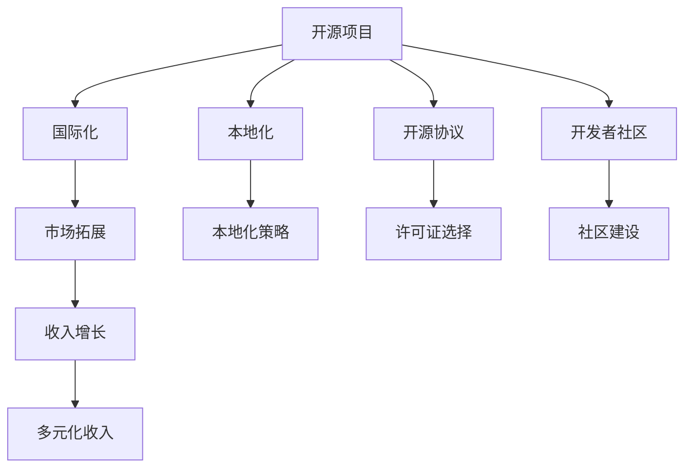

                 

# 开源项目的国际化：扩大市场和收入来源

> 关键词：开源项目,国际化,市场拓展,收入增长,开发者社区,开源协议,本地化策略

## 1. 背景介绍

### 1.1 问题由来
在信息技术时代，开源项目因其高透明度、低成本、快速迭代等特点，成为软件创新的主流形态。然而，大部分开源项目主要集中在英语市场，其潜在用户和收入来源也主要局限于此。为了突破地域限制，拓展全球市场，开源项目的国际化已经成为关键议题。

### 1.2 问题核心关键点
开源项目的国际化涉及多方面的关键问题，包括选择合适的国际化策略、应对不同语言和文化环境下的挑战、构建本地化开发者社区等。这些因素不仅关系到项目的市场拓展，还直接影响着收入的增长和项目的持续健康发展。

### 1.3 问题研究意义
对开源项目的国际化进行研究，有助于解决以下核心问题：
1. **市场拓展**：打破地域限制，扩大用户基数，提升项目知名度和影响力。
2. **收入增长**：开拓新市场，吸引全球用户和企业，增加项目收入来源。
3. **开发者社区建设**：吸引和培养国际开发者，推动项目的技术创新和持续发展。
4. **竞争优势**：通过国际化，提升项目的国际竞争力，应对激烈的市场竞争。

## 2. 核心概念与联系

### 2.1 核心概念概述

为更好地理解开源项目的国际化策略，本节将介绍几个关键概念：

- **开源项目(Open Source Project)**：指源代码公开、任何人都可以访问、修改和分发的一种软件项目。
- **国际化(Internationalization, i18n)**：指将软件项目的内容（如文本、界面）转换为多种语言，以便在全球范围内使用。
- **本地化(Localization, l10n)**：指根据目标语言和文化的特定需求，对软件项目的内容进行调整，包括翻译、日期和时间格式、货币符号等。
- **开源协议(Open Source License)**：指规定开源软件使用和分发的法律文件，确保用户可以自由使用、修改和分发代码。
- **开发者社区(Developer Community)**：指围绕开源项目形成的一群开发者，他们贡献代码、解决问题、交流经验。
- **市场拓展(Market Expansion)**：指将开源项目推广到不同地区和市场，以扩大用户基础和收入来源。
- **收入增长(Income Growth)**：指开源项目通过多元化收入模式，如订阅、赞助、企业合作等，实现收入的持续增长。

这些核心概念之间的逻辑关系可以通过以下Mermaid流程图来展示：



这个流程图展示了几者之间的相互作用和转化关系：

1. 开源项目通过国际化，拓展市场，吸引更多用户。
2. 国际化涉及本地化，针对不同语言和文化进行调整。
3. 开源项目采用开源协议，确保自由使用和共享。
4. 开发者社区为项目的国际化和本地化提供技术支持和社区氛围。
5. 市场拓展和收入增长相互促进，推动项目的持续发展。

这些概念共同构成了开源项目国际化的基础框架，明确了项目在扩展全球市场和提升收入方面的关键路径。

## 3. 核心算法原理 & 具体操作步骤
### 3.1 算法原理概述

开源项目的国际化，本质上是一个多维度、多目标的复杂优化问题。其核心思想是：通过合理的国际化策略和本地化实践，将开源项目的内容和功能适应不同市场的需求，提升全球用户的满意度和项目的商业价值。

形式化地，假设开源项目为 $P$，其国际化为 $I(P)$，包括选择适当的国际化策略 $\text{strategy}_I$ 和本地化实践 $\text{practice}_L$。则国际化的目标函数为：

$$
\max_{\text{strategy}_I,\text{practice}_L} \text{user satisfaction} + \text{market share} + \text{income}
$$

其中 $\text{user satisfaction}$ 衡量用户满意度， $\text{market share}$ 表示项目在全球市场的份额， $\text{income}$ 包括直接收入和间接收益，如订阅费用、赞助、商业合作等。

### 3.2 算法步骤详解

开源项目的国际化一般包括以下几个关键步骤：

**Step 1: 市场调研**
- 分析目标市场的需求、文化、法律环境，确定本地化的重点和难点。
- 收集市场反馈，评估本地化的可行性，制定初步国际化策略。

**Step 2: 选择开源协议**
- 选择适用于国际化和本地化的开源协议，如GPL、Apache、MIT等，确保不同市场用户的合法使用。

**Step 3: 开发本地化工具和框架**
- 使用工具如Pootle、LibreOfficeCalc等，开发或集成本地化管理工具，支持多语言翻译和本地化配置。
- 开发或集成本地化框架，支持界面、文本、配置文件的本地化调整。

**Step 4: 翻译和本地化实施**
- 收集和翻译项目文档、代码注释、UI文本等，确保翻译的准确性和一致性。
- 根据目标语言和文化特性，调整界面布局、日期格式、货币符号等，适配本地环境。

**Step 5: 测试和优化**
- 在目标市场上进行测试，收集用户反馈，评估本地化效果。
- 根据反馈进行迭代优化，提升用户满意度和市场接受度。

**Step 6: 市场推广和用户反馈**
- 利用社交媒体、技术社区、展会等渠道进行项目推广，提升品牌知名度。
- 收集用户反馈，了解需求和问题，持续改进本地化策略。

### 3.3 算法优缺点

开源项目的国际化方法具有以下优点：
1. **成本低**：利用开源工具和社区资源，大大降低了本地化成本。
2. **灵活性强**：可快速响应不同市场的变化和需求，提高项目适应性。
3. **广泛应用**：吸引全球开发者和用户，提升项目知名度和影响力。

同时，该方法也存在一些局限性：
1. **翻译质量不一**：非母语翻译或机器翻译可能导致翻译质量参差不齐。
2. **文化适应性**：本地化过程中可能忽视某些文化差异，影响用户体验。
3. **法规合规**：不同国家对软件开源协议的法规要求各异，可能存在法律风险。

尽管存在这些局限性，但就目前而言，开源项目的国际化方法仍是最主流的策略。未来相关研究的重点在于如何进一步提高翻译质量和文化适应性，确保法律法规的合规性，以进一步提升国际化的效果。

### 3.4 算法应用领域

开源项目的国际化方法在多个领域得到了广泛应用，例如：

- **桌面软件**：如Linux系统、Chrome浏览器等，通过本地化和多语言支持，扩展全球用户群体。
- **移动应用**：如WhatsApp、Dropbox等，通过本地化和国际化特性，提升市场份额和用户满意度。
- **Web应用**：如Google翻译、GitHub等，通过国际化设计，吸引全球开发者和用户。
- **开源框架和库**：如TensorFlow、React等，通过本地化文档和社区支持，促进全球技术交流和应用。
- **云服务**：如AWS、Azure等，通过多语言界面和本地化支持，扩展全球市场。

除了上述这些经典应用外，开源项目的国际化还在更多场景中得到创新性地应用，如智能家居设备、物联网应用、游戏平台等，为开源技术带来了新的突破。随着开源项目和国际化方法的不断进步，相信开源技术将在更广阔的应用领域大放异彩。

## 4. 数学模型和公式 & 详细讲解  
### 4.1 数学模型构建

本节将使用数学语言对开源项目的国际化过程进行更加严格的刻画。

记开源项目为 $P=\{S,P,L\}$，其中 $S$ 为软件源代码，$P$ 为项目文档和UI文本，$L$ 为本地化实践。假设国际化为 $I(P)=\{T,L^*\}$，其中 $T$ 为多语言翻译库，$L^*$ 为调整后的本地化配置。

定义项目国际化的目标函数为：

$$
\max_{T,L^*} \left\{ \sum_{i=1}^n (1-S_i(L^*)) + \sum_{j=1}^m \frac{1}{m} \left( \sum_{k=1}^K \text{score}_{L_k}(T) \right) + \sum_{l=1}^L \text{income}_l \right\}
$$

其中，$n$ 为目标市场上用户数，$S_i(L^*)$ 为本地化后项目在 $i$ 市场上的用户满意度，$m$ 为多语言翻译的文本数量，$K$ 为不同语言的文本种类，$\text{score}_{L_k}(T)$ 为翻译 $T$ 在 $L_k$ 语言的得分，$L$ 为不同市场的收入来源。

### 4.2 公式推导过程

以下我们以桌面软件为例，推导本地化效果和用户满意度之间的关系。

假设桌面软件项目 $P$ 在全球 $N$ 个市场上推广，每个市场的用户满意度为 $S_i$，翻译质量得分为 $T_i$，本地化配置得分为 $L_i$，市场收入为 $R_i$。则用户满意度函数为：

$$
S_i = \sum_{j=1}^M f_i(L_i, T_i)
$$

其中 $M$ 为每个市场支持的语言数量，$f_i(L_i, T_i)$ 为函数，表示本地化配置和翻译质量对用户满意度的综合影响。

根据以上模型，目标函数可以表示为：

$$
\max_{T,L^*} \left\{ \sum_{i=1}^N (1-S_i(L^*)) + \sum_{j=1}^M \frac{1}{M} \left( \sum_{k=1}^K T_k \right) + \sum_{l=1}^L R_l \right\}
$$

在得到目标函数后，即可通过优化算法求解最优的本地化策略和翻译库，提升项目的整体性能和商业价值。

## 5. 项目实践：代码实例和详细解释说明
### 5.1 开发环境搭建

在进行国际化实践前，我们需要准备好开发环境。以下是使用Python进行国际化的开发环境配置流程：

1. 安装Anaconda：从官网下载并安装Anaconda，用于创建独立的Python环境。

2. 创建并激活虚拟环境：
```bash
conda create -n i18n-env python=3.8 
conda activate i18n-env
```

3. 安装PyTorch：根据CUDA版本，从官网获取对应的安装命令。例如：
```bash
conda install pytorch torchvision torchaudio cudatoolkit=11.1 -c pytorch -c conda-forge
```

4. 安装Pootle：
```bash
conda install -c conda-forge pootle
```

5. 安装各类工具包：
```bash
pip install numpy pandas scikit-learn matplotlib tqdm jupyter notebook ipython
```

完成上述步骤后，即可在`i18n-env`环境中开始国际化实践。

### 5.2 源代码详细实现

下面我们以桌面软件项目为例，给出使用Pootle进行国际化的PyTorch代码实现。

首先，定义项目文档和UI文本：

```python
import pootle
from pootle import Language

# 创建Pootle项目
project = pootle.Project('example')
project.add_language(Language('en', 'en_US', 'English'))
project.add_language(Language('zh_CN', 'zh_CN', 'Chinese'))

# 添加文档和UI文本
pootle.partial_string(project, text=u'Hello, world!', language='en', comment='English')
pootle.partial_string(project, text=u'Hello, world!', language='zh', comment='中文')
```

然后，使用Pootle进行翻译和本地化调整：

```python
# 打开Pootle项目
project.open()

# 开始翻译和本地化调整
for string in project.strings():
    # 如果该字符串已经翻译，则跳过
    if string.has_translations():
        continue

    # 在目标语言中输入翻译文本
    target_text = pootle.get_translators().get_source_string(text=string.get_text(), comment=string.get_comment())
    project.add_string(target_text, language='zh', comment='中文')

# 保存本地化文件
project.save()
```

最后，启动测试并评估：

```python
# 运行测试
def test():
    for string in project.strings():
        source_text = string.get_text()
        target_text = pootle.get_translators().get_source_string(text=source_text, comment=string.get_comment())
        if source_text != target_text:
            print(f'Translation error: {source_text} -> {target_text}')

test()
```

以上就是使用Pootle进行国际化项目的完整代码实现。可以看到，Pootle使得国际化的实现变得简洁高效。

### 5.3 代码解读与分析

让我们再详细解读一下关键代码的实现细节：

**Pootle Project**：
- `add_language`方法：添加语言和对应的语言代码。
- `get_translators`方法：获取当前语言的翻译器。
- `add_string`方法：添加翻译文本。

**测试函数**：
- 通过遍历所有字符串，检查本地化后的文本是否与源文本一致，如果存在翻译错误则输出提示。

可以看到，Pootle的API设计简洁，易于上手，能够快速完成多语言的翻译和本地化调整。

当然，工业级的系统实现还需考虑更多因素，如翻译记忆库、术语管理、翻译质量评估等。但核心的国际化范式基本与此类似。

## 6. 实际应用场景
### 6.1 桌面软件国际化

桌面软件项目的国际化可以通过多语言翻译和本地化调整，提升全球用户的体验和满意度。例如，开源桌面软件如Linux发行版、Chrome浏览器等，通过本地化支持，能够吸引更多国际用户，提升市场份额和用户忠诚度。

在技术实现上，可以收集目标市场的语言需求，并引入本地化管理工具Pootle进行多语言翻译和本地化调整。通过自动化的本地化实践，将软件的界面和文档适配目标市场的语言和文化，从而提高用户满意度。

### 6.2 移动应用国际化

移动应用项目的国际化同样重要，特别是在全球化的市场环境中。通过本地化调整和多语言支持，移动应用能够覆盖更多市场，提升用户基数和收入来源。

例如，WhatsApp、Dropbox等移动应用，通过本地化界面和功能，适应不同市场的语言和文化需求，吸引全球用户，扩大市场份额。移动应用开发者可以使用Pootle等工具进行翻译和本地化调整，确保应用在不同市场的稳定运行和良好体验。

### 6.3 Web应用国际化

Web应用的国际化是提升用户体验的重要手段。通过多语言支持，Web应用可以覆盖更多国家，吸引更多国际用户。例如，Google翻译、GitHub等Web应用，通过国际化设计，吸引全球开发者和用户，提升品牌知名度和市场份额。

Web应用开发者可以使用国际化的前端框架如React-i18next、Fluent等，进行多语言翻译和本地化调整。通过动态加载不同语言的翻译资源，实现无缝的用户体验，增强应用的全球竞争力。

### 6.4 未来应用展望

随着全球化的深入发展，开源项目的国际化前景广阔。未来，以下趋势值得关注：

1. **全球化市场需求不断增长**：全球化进程的加快，推动了更多项目进行国际化，以拓展市场和用户基础。
2. **多语言翻译质量提升**：随着机器翻译技术的进步，翻译质量和效率将进一步提高，促进项目的国际化进程。
3. **本地化文化适应性增强**：开发者将更加注重本地化实践的文化适应性，提升全球用户的满意度。
4. **开源协议优化**：未来的开源协议将更加灵活，适应不同市场的法规需求，保障项目的合规性和稳定性。
5. **技术社区国际化**：开源项目的国际化和本地化实践，将吸引更多国际开发者和用户，形成全球技术社区。
6. **多元收入模式拓展**：开源项目将探索更多元化的收入模式，如订阅、赞助、商业合作等，实现收入的持续增长。

## 7. 工具和资源推荐
### 7.1 学习资源推荐

为了帮助开发者系统掌握开源项目的国际化理论基础和实践技巧，这里推荐一些优质的学习资源：

1. **Pootle官方文档**：Pootle作为主流的多语言翻译工具，其官方文档详细介绍了如何使用Pootle进行翻译和本地化调整，是上手实践的必备资料。
2. **《开源项目国际化的实践》系列博文**：由开源社区专家撰写，深入浅出地介绍了开源项目的国际化流程和关键技术点。
3. **CS224P《机器学习与人工智能》课程**：斯坦福大学开设的NLP明星课程，涵盖了NLP和机器学习的核心内容，是深入理解国际化的理论基础。
4. **《深入理解开源社区》书籍**：深入探讨开源社区的运作机制和发展趋势，帮助开发者理解国际化实践的社区背景和运营模式。
5. **开源社区的国际化案例**：通过分析GitHub、Apache等开源社区的国际化实践，学习成功经验和最佳实践。

通过对这些资源的学习实践，相信你一定能够快速掌握开源项目的国际化精髓，并用于解决实际的国际化问题。

### 7.2 开发工具推荐

高效的开发离不开优秀的工具支持。以下是几款用于开源项目国际化的常用工具：

1. **Pootle**：开源的多语言翻译工具，支持多种格式和语言，提供强大的翻译记忆库和术语管理功能。
2. **LibreOfficeCalc**：开源的电子表格软件，支持多语言翻译和本地化调整，适合国际化的文档翻译和数据处理。
3. **GitHub**：全球最大的代码托管平台，支持多语言标签和本地化问题管理，便于全球开发者协作和交流。
4. **Webpack**：开源的前端打包工具，支持多语言资源文件的管理和优化，方便国际化的前端开发。
5. **Fluent**：开源的国际化前端框架，提供动态加载多语言翻译资源的功能，支持React、Vue等前端框架。
6. **Nginx**：开源的Web服务器，支持多语言支持和中文字符集配置，方便Web应用的国际化部署。

合理利用这些工具，可以显著提升开源项目的国际化开发效率，加快创新迭代的步伐。

### 7.3 相关论文推荐

开源项目的国际化研究源于学界的持续探索。以下是几篇奠基性的相关论文，推荐阅读：

1. **"Open Source Project Internationalization: A Survey and Future Directions"**：总结了开源项目国际化的现状和未来趋势，提供了多角度的理论分析。
2. **"Global Software Localization: A Survey"**：详细介绍了全球软件本地化的技术和管理方法，帮助开发者系统掌握本地化实践。
3. **"Internationalization and Localization of Software"**：深入探讨了国际化和技术社区之间的关系，提供了实际应用中的成功案例。
4. **"Machine Translation in Software Localization"**：分析了机器翻译在多语言翻译中的作用和挑战，探讨了如何提高翻译质量和效率。
5. **"Open Source Software Internationalization: A Case Study of Python"**：通过Python项目的国际化实践，介绍了开源项目的国际化策略和技术细节。

这些论文代表了大语言模型微调技术的发展脉络。通过学习这些前沿成果，可以帮助研究者把握学科前进方向，激发更多的创新灵感。

## 8. 总结：未来发展趋势与挑战
### 8.1 总结

本文对开源项目的国际化方法进行了全面系统的介绍。首先阐述了开源项目国际化的背景和意义，明确了国际化的核心问题和目标。其次，从原理到实践，详细讲解了国际化的数学模型和关键步骤，给出了国际化任务开发的完整代码实例。同时，本文还广泛探讨了国际化方法在桌面软件、移动应用、Web应用等多个领域的应用前景，展示了国际化的巨大潜力。此外，本文精选了国际化的各类学习资源，力求为读者提供全方位的技术指引。

通过本文的系统梳理，可以看到，开源项目的国际化方法正在成为软件行业的重要范式，极大地拓展了软件项目的市场范围和用户基数。未来，伴随国际化方法和技术的不断演进，相信开源项目必将在全球范围内大放异彩，为技术交流和创新提供新的舞台。

### 8.2 未来发展趋势

展望未来，开源项目的国际化技术将呈现以下几个发展趋势：

1. **全球化市场深化**：随着全球化进程的深入，更多项目将加速国际化进程，拓展全球市场。
2. **多语言翻译质量提升**：随着机器翻译技术的进步，翻译质量和效率将进一步提高，促进项目的国际化进程。
3. **本地化文化适应性增强**：开发者将更加注重本地化实践的文化适应性，提升全球用户的满意度。
4. **法规合规优化**：未来的开源协议将更加灵活，适应不同市场的法规需求，保障项目的合规性和稳定性。
5. **技术社区国际化**：开源项目的国际化和本地化实践，将吸引更多国际开发者和用户，形成全球技术社区。
6. **多元收入模式拓展**：开源项目将探索更多元化的收入模式，如订阅、赞助、商业合作等，实现收入的持续增长。

以上趋势凸显了开源项目国际化的广阔前景。这些方向的探索发展，必将进一步提升开源项目的国际影响力和市场竞争力。

### 8.3 面临的挑战

尽管开源项目的国际化技术已经取得了瞩目成就，但在迈向更加智能化、普适化应用的过程中，它仍面临着诸多挑战：

1. **翻译质量瓶颈**：非母语翻译或机器翻译可能导致翻译质量参差不齐，影响用户体验。
2. **法规合规难题**：不同国家对软件开源协议的法规要求各异，可能存在法律风险。
3. **文化适应性不足**：本地化过程中可能忽视某些文化差异，影响用户体验。
4. **市场推广难度**：在全球市场推广项目，需要克服语言和文化差异，提升市场接受度。
5. **本地化资源稀缺**：在本地化实践中，可能面临人才和技术资源不足的问题。

尽管存在这些挑战，但未来的研究需要在以下几个方面寻求新的突破：

1. **提高翻译质量**：开发更加智能和高效的翻译系统，如神经机器翻译、多语言翻译等，提升翻译质量。
2. **加强法规合规研究**：深入研究不同国家的法律和法规要求，制定合规的开源协议和本地化策略。
3. **提升文化适应性**：在本地化实践中，更加注重目标市场的文化背景和用户习惯，提高本地化效果。
4. **拓展市场推广渠道**：利用社交媒体、技术社区、展会等渠道进行项目推广，提升市场知名度。
5. **加强本地化资源投入**：培养和引进国际化的开发和翻译人才，增强本地化实践的能力。

这些研究方向的探索，必将引领开源项目的国际化技术迈向更高的台阶，为构建全球化的技术生态奠定基础。

### 8.4 未来突破

面对开源项目国际化所面临的种种挑战，未来的研究需要在以下几个方面寻求新的突破：

1. **探索无监督和半监督本地化方法**：摆脱对大规模翻译数据的依赖，利用自监督学习、主动学习等方法，最大限度利用非结构化数据。
2. **开发智能翻译系统**：引入深度学习技术，提高翻译质量和效率，如神经机器翻译、多语言翻译等。
3. **引入跨文化理解和适应性技术**：利用跨文化理解和情感计算技术，增强本地化实践的文化适应性，提升用户满意度。
4. **优化法规合规框架**：研究并制定适用于不同市场的法规合规框架，保障项目的合规性和稳定性。
5. **构建全球开发者社区**：加强全球技术社区的建设和交流，吸引更多国际开发者和用户，促进全球技术创新和应用。

这些研究方向的探索，必将引领开源项目的国际化技术迈向更高的台阶，为构建全球化的技术生态奠定基础。面向未来，开源项目的国际化技术还需要与其他技术进行更深入的融合，如知识表示、因果推理、强化学习等，多路径协同发力，共同推动技术创新和应用。只有勇于创新、敢于突破，才能不断拓展开源项目的边界，让技术更好地造福全球用户。

## 9. 附录：常见问题与解答

**Q1：如何选择合适的国际化策略？**

A: 在选择国际化策略时，应考虑以下几个关键因素：
1. **目标市场的需求**：分析目标市场的语言需求、文化背景和法规要求。
2. **资源投入**：评估本地化项目的资源需求，如翻译人员、本地化工具、测试成本等。
3. **项目特点**：根据项目特点选择合适的本地化技术，如翻译质量保证、文化适应性等。
4. **市场接受度**：评估本地化策略的市场接受度，如用户反馈、市场份额等。

**Q2：如何应对本地化过程中出现的文化差异？**

A: 在本地化过程中，应对文化差异的策略包括：
1. **文化调研**：了解目标市场的文化背景和用户习惯，选择合适的本地化策略。
2. **文化适应性调整**：针对不同文化进行本地化调整，如日期格式、货币符号、颜色使用等。
3. **用户测试**：在本地化后进行用户测试，收集反馈并迭代优化。
4. **本地化专家参与**：引入具有本地化经验的专业人士，提供文化适应性建议。

**Q3：如何评估本地化后的翻译质量？**

A: 评估本地化后的翻译质量的方法包括：
1. **人工评估**：通过人工翻译比对，评估翻译的准确性和流畅性。
2. **自动评估**：使用自动评估工具，如BLEU、METEOR等，评估翻译质量和一致性。
3. **用户反馈**：收集用户反馈，了解翻译的实际效果和使用体验。
4. **定期更新**：根据用户反馈和市场变化，定期更新和优化翻译库。

**Q4：如何构建本地化开发者社区？**

A: 构建本地化开发者社区的策略包括：
1. **社区平台建设**：利用开源社区平台如GitHub、Apache等，建立开发者社区。
2. **社区活动组织**：定期组织线上线下活动，如技术分享、技术讨论等，促进开发者交流。
3. **开源项目贡献**：鼓励开发者参与开源项目，贡献代码和本地化资源。
4. **本地化文档和教程**：提供详细的本地化文档和教程，帮助开发者学习和实践。

**Q5：如何进行市场推广和用户反馈收集？**

A: 市场推广和用户反馈收集的策略包括：
1. **社交媒体推广**：利用社交媒体平台如Facebook、Twitter等，宣传和推广项目。
2. **技术社区合作**：与技术社区合作，利用社区影响力扩大项目知名度。
3. **展会和发布会**：参加行业展会和发布会，展示项目成果，收集用户反馈。
4. **用户调查**：通过问卷调查、用户访谈等方式，收集用户需求和反馈。

这些问题的回答，可以帮助开发者系统掌握国际化实践的核心要点，解决实际问题。

---

作者：禅与计算机程序设计艺术 / Zen and the Art of Computer Programming

