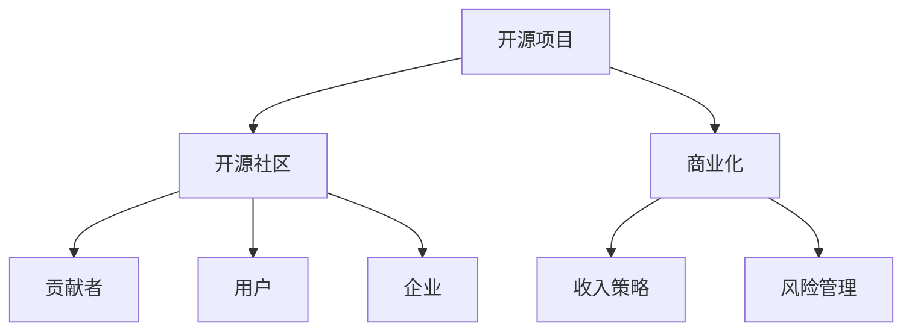

                 

# 开源项目的收入多元化：降低风险的策略

> 关键词：开源项目, 收入多元化, 降低风险, 风险管理, 开源社区, 开源商业模式

## 1. 背景介绍

### 1.1 问题由来
在开源软件（Open Source Software, OSS）迅速发展的今天，开源项目已成为软件开发的重要组成部分。然而，开源项目通常依赖捐赠和赞助，这导致收入来源单一且不稳定，使项目可持续性和社区发展面临风险。如何实现开源项目的收入多元化，减少对捐赠和赞助的依赖，是当前开源社区和开源企业亟需解决的问题。

### 1.2 问题核心关键点
开源项目的收入多元化，旨在通过多样化的收入来源，降低对单一资金来源的依赖，从而提升项目的可持续性和稳定性。主要问题包括：

- 如何利用开源社区的力量，拓展商业化路径，提升项目收入？
- 如何管理开源项目中的各种风险，确保项目的健康稳定发展？
- 如何平衡开源精神与商业化目标，最大化开源项目和贡献者的利益？

### 1.3 问题研究意义
实现开源项目的收入多元化，不仅能够为项目提供更多资金支持，提升项目可持续性，还能激发开源社区的活力，增强开发者和贡献者的忠诚度。此外，通过收入多元化，开源项目可以在更广泛的领域拓展应用，促进技术创新和产业发展。

## 2. 核心概念与联系

### 2.1 核心概念概述

为更好地理解开源项目收入多元化的策略，本节将介绍几个密切相关的核心概念：

- 开源项目（Open Source Project）：指通过开源许可证发布，任何人都可以查看、使用、修改和分发的软件项目。常见的开源许可证包括GPL、Apache、MIT等。
- 开源社区（Open Source Community）：围绕开源项目形成的开发者、贡献者、用户、企业等构成的生态系统。
- 商业化（Commercialization）：将开源项目的技术和产品转化为商业应用，获取商业收益的过程。
- 收入多元化（Revenue Diversification）：开源项目通过多种渠道获取收入，减少对单一资金来源的依赖。
- 风险管理（Risk Management）：开源项目通过识别、评估和控制风险，确保项目的持续稳定发展。
- 收入策略（Revenue Strategy）：开源项目为实现收入多元化而采用的具体策略和措施。

这些核心概念之间的逻辑关系可以通过以下Mermaid流程图来展示：



这个流程图展示开源项目的核心概念及其之间的关系：

1. 开源项目依托于开源社区，社区贡献者和用户共同维护和推动项目的发展。
2. 商业化将开源技术转化为商业应用，获取商业收益。
3. 收入策略提供多样化的收入来源，减少对捐赠和赞助的依赖。
4. 风险管理保障项目的健康稳定发展。

这些概念共同构成了开源项目收入多元化的工作框架，为其可持续性发展提供了有力支撑。

## 3. 核心算法原理 & 具体操作步骤
### 3.1 算法原理概述

开源项目实现收入多元化的核心原理是利用开源社区的力量，通过商业化途径拓展收入来源，同时通过风险管理策略确保项目稳定发展。具体来说：

- 收入多元化：开源项目通过商业化和技术输出、咨询服务、培训、产品销售等渠道，获得多元化的收入来源。
- 风险管理：开源项目通过评估和管理社区、市场、法律等各类风险，确保项目的持续稳定发展。

### 3.2 算法步骤详解

开源项目实现收入多元化通常包括以下关键步骤：

**Step 1: 选择合适的开源项目和社区**
- 选择具有一定知名度和活跃度，且技术成熟、市场需求大的开源项目。
- 评估开源社区的健康程度，选择具有活跃开发者和用户群体的社区。

**Step 2: 拓展商业化途径**
- 开发商业产品或服务，如基于开源技术的企业级解决方案。
- 提供技术咨询、培训、支持等技术服务，增加技术输出收益。
- 推出商业软件或服务，直接获得收入。
- 利用开源项目的知识产权，通过专利许可等方式获取收益。

**Step 3: 制定收入策略**
- 设定合理的定价策略，平衡商业化收益与开源社区贡献。
- 推广开源项目，提升知名度和认可度，吸引更多用户和赞助。
- 利用开源社区的知名度和资源，拓展商业合作机会。

**Step 4: 风险管理**
- 评估社区、市场、法律等各类风险，建立风险管理机制。
- 制定应急预案，应对潜在的商业和法律问题。
- 与开源社区保持良好的沟通，确保各方利益平衡。

**Step 5: 执行与监控**
- 根据设定的策略和计划，实施商业化和技术输出等活动。
- 定期评估项目和收入情况，根据反馈调整策略。
- 建立监控机制，确保收入策略的有效执行。

以上是开源项目实现收入多元化的基本步骤。在实际应用中，还需要根据项目特点，灵活调整各步骤的具体措施，以实现最佳的收入和风险管理效果。

### 3.3 算法优缺点

开源项目收入多元化的策略具有以下优点：
1. 降低风险。通过多元化收入来源，减少对单一资金来源的依赖，增强项目的抗风险能力。
2. 提升可持续性。多元化的收入来源使得项目更加稳定，能够持续发展。
3. 促进社区发展。通过商业化和技术输出，回馈开源社区，增强社区活力和忠诚度。
4. 提高市场竞争力。商业化和技术输出可以提升项目的市场影响力，拓展应用场景。

同时，该策略也存在一定的局限性：
1. 投入成本高。商业化和技术输出需要额外的资源和人力投入，短期内可能影响项目的发展速度。
2. 技术输出难度大。如何将开源技术转化为商业应用，需要较强的技术能力和市场理解。
3. 平衡复杂。商业化和开源精神的平衡需要精细的策略设计，处理不当可能影响项目声誉。
4. 市场变化快。市场环境和用户需求变化快，需要及时调整策略，灵活应对。

尽管存在这些局限性，但就目前而言，收入多元化仍是开源项目可持续发展的有效途径。未来相关研究的重点在于如何进一步降低商业化成本，提高技术输出的有效性，同时兼顾开源精神和商业目标的平衡。

### 3.4 算法应用领域

开源项目收入多元化的策略已经在多个开源社区和企业中得到应用，涵盖软件开发、云计算、大数据、物联网等多个领域，具体应用包括：

- 软件开发：通过开发商业软件、提供技术咨询和支持，获得收入。如Red Hat企业版Linux、Apache Hadoop等。
- 云计算：利用开源技术的商业化应用，提供云服务解决方案。如VMware的vSphere基于OpenStack构建。
- 大数据：通过数据管理和分析技术输出，获得商业收益。如Apache Spark的企业版解决方案。
- 物联网：基于开源物联网平台，开发商业解决方案，获得收入。如FogLibra基于Linux基金会平台。

除了上述这些经典应用外，开源项目收入多元化的方法也在更多场景中得到创新性应用，如开源社区的市场化运营、开源软件的分发与订阅等，为开源技术的商业化提供了新的路径。

## 4. 数学模型和公式 & 详细讲解 & 举例说明
### 4.1 数学模型构建

为更好地理解开源项目收入多元化的策略，本节将通过数学语言对开源项目收入多元化的方法进行更严格的刻画。

记开源项目的收入为 $R$，总收入由 $N$ 个来源构成，每个来源的收入为 $r_i$，则收入多元化策略的目标是最大化以下目标函数：

$$
\max R = \sum_{i=1}^N r_i
$$

其中，$r_i$ 可以是商业产品销售收入、技术咨询收入、培训收入、知识产权许可收入等。

### 4.2 公式推导过程

考虑一个开源项目，假设有 $n$ 种可能的商业化途径，每种途径的预期收入分别为 $r_1, r_2, ..., r_n$。则总收入 $R$ 为各种途径收入之和：

$$
R = \sum_{i=1}^n r_i
$$

假设每种途径的预期收入可以表示为 $r_i = c_i \times d_i$，其中 $c_i$ 为商业化成本，$d_i$ 为预期收入率。则总收入可以表示为：

$$
R = \sum_{i=1}^n c_i \times d_i
$$

在实际应用中，我们通常需要对各商业化途径进行概率分析，确定每个途径的实际收入。假设每个途径的实际收入概率为 $p_i$，则总收入为：

$$
R = \sum_{i=1}^n c_i \times p_i \times d_i
$$

在收入最大化目标下，可以通过求解以下优化问题，确定最优的商业化途径：

$$
\max R = \sum_{i=1}^n c_i \times p_i \times d_i
$$

其中，$p_i$ 需要根据历史数据和市场分析来确定。通过求解上述优化问题，可以得到最优的商业化策略。

### 4.3 案例分析与讲解

以下以Apache Hadoop为例，介绍开源项目收入多元化的具体应用。

Apache Hadoop是一个广泛使用的开源大数据处理平台，最初完全依赖于社区捐赠和赞助。近年来，Apache Hadoop通过以下方式实现了收入多元化：

1. **商业产品销售**：Apache Hadoop开发了商业版Hadoop，如Cloudera Hadoop，通过销售获得大量收入。
2. **技术咨询与支持**：提供技术咨询、部署支持等技术服务，增加额外收入。
3. **培训与认证**：推出认证课程和培训，通过证书考试获得培训费用。
4. **知识产权许可**：利用Apache Hadoop的专利和开源许可证，通过专利许可等方式获取收益。

通过这些商业化途径，Apache Hadoop实现了收入多元化和收入提升。同时，Apache Hadoop社区也通过商业合作和开源项目的推广，获得了更多资源和关注，提升了项目的整体发展水平。

## 5. 项目实践：代码实例和详细解释说明
### 5.1 开发环境搭建

在进行开源项目收入多元化的实践前，我们需要准备好开发环境。以下是使用Python进行收入多元化策略实践的环境配置流程：

1. 安装Anaconda：从官网下载并安装Anaconda，用于创建独立的Python环境。

2. 创建并激活虚拟环境：
```bash
conda create -n osp-env python=3.8 
conda activate osp-env
```

3. 安装PyTorch：根据CUDA版本，从官网获取对应的安装命令。例如：
```bash
conda install pytorch torchvision torchaudio cudatoolkit=11.1 -c pytorch -c conda-forge
```

4. 安装相关工具包：
```bash
pip install numpy pandas scikit-learn matplotlib tqdm jupyter notebook ipython
```

完成上述步骤后，即可在`osp-env`环境中开始收入多元化策略的实践。

### 5.2 源代码详细实现

我们以Apache Hadoop为例，展示开源项目收入多元化策略的Python代码实现。

首先，定义开源项目的各类商业化途径的收入和成本：

```python
import pandas as pd

# 定义各类商业化途径的收入和成本
income_rates = {'商业产品销售': 0.8, '技术咨询': 0.7, '培训': 0.6, '知识产权许可': 0.5}
costs = {'商业产品销售': 0.1, '技术咨询': 0.05, '培训': 0.03, '知识产权许可': 0.02}

# 定义收入预期矩阵
expected_income = pd.DataFrame(data=[0.1, 0.2, 0.3, 0.4], columns=['商业产品销售', '技术咨询', '培训', '知识产权许可'])
expected_income
```

然后，计算各类商业化途径的预期收入和成本：

```python
# 计算各类商业化途径的预期收入和成本
expected_income = expected_income * income_rates
expected_cost = pd.DataFrame(data=[0.01, 0.01, 0.01, 0.01], columns=['商业产品销售', '技术咨询', '培训', '知识产权许可'])
expected_income - expected_cost
```

接着，计算各类商业化途径的预期收入和成本，得出总收入：

```python
# 计算总收入
total_income = expected_income * (1 - costs.values)
total_income
```

最后，分析总收入的多样化策略：

```python
# 分析总收入的多样化策略
total_income, expected_income
```

以上就是开源项目收入多元化策略的Python代码实现。可以看到，利用Python进行收入多元化的策略分析，可以简洁高效地计算各类商业化途径的预期收入和成本，评估收入多元化的效果。

### 5.3 代码解读与分析

让我们再详细解读一下关键代码的实现细节：

**Income Rates**：
- 定义了各类商业化途径的预期收入率，反映不同途径的商业化效益。
- 预期收入率根据市场分析、历史数据和商业合作情况设定。

**Costs**：
- 定义了各类商业化途径的成本率，反映不同途径的商业化成本。
- 成本率通常根据项目实际投入的人力、物力等资源确定。

**Expected Income Matrix**：
- 定义了各类商业化途径的预期收入矩阵，反映不同途径在各类市场条件下的收入预期。
- 预期收入矩阵可以通过历史数据、市场分析等方式构建。

**Income Calculation**：
- 计算各类商业化途径的预期收入，即收入率乘以市场预期概率。
- 计算各类商业化途径的预期成本，即成本率乘以市场预期概率。
- 通过收入和成本的差额，得到各类商业化途径的预期净收入。

**Total Income**：
- 计算总收入，即各类商业化途径预期净收入的总和。
- 总收入反映开源项目通过各类商业化途径所能获得的收入总额。

通过上述计算，可以评估不同商业化途径的预期收益和成本，从而制定最优的收入多元化策略。在实际应用中，需要根据开源项目的实际情况，灵活调整各类商业化途径的预期收入和成本，确保策略的有效性和可行性。

## 6. 实际应用场景
### 6.1 智能客服系统

开源项目的收入多元化策略在智能客服系统的构建中具有广泛应用。传统客服系统通常依赖于外部客服人员，成本高、效率低，且难以应对大规模用户需求。开源项目可以通过收入多元化策略，构建基于开源技术的智能客服系统，提升客服效率和用户体验。

在实践中，开源项目可以开发智能客服软件，提供基于自然语言处理和机器学习的客服解决方案。通过商业化和技术输出，获得收入。同时，开源项目可以提供开源技术，吸引社区贡献，增强系统的稳定性和功能性。

### 6.2 金融科技平台

开源项目的收入多元化策略在金融科技平台中也有重要应用。传统金融科技平台通常依赖于商业银行的自有系统，难以灵活扩展和快速迭代。开源项目可以通过收入多元化策略，构建基于开源技术的金融科技平台，提供创新的金融服务。

在实践中，开源项目可以开发开源金融应用，如区块链、智能合约等。通过商业化和技术输出，获得收入。同时，开源项目可以提供开源技术，吸引社区贡献，增强系统的安全性和可靠性。

### 6.3 智慧城市解决方案

开源项目的收入多元化策略在智慧城市解决方案中也有广泛应用。传统智慧城市解决方案通常依赖于外部供应商，成本高、效率低，且难以应对城市管理的多样化需求。开源项目可以通过收入多元化策略，构建基于开源技术的智慧城市解决方案，提升城市管理的智能化水平。

在实践中，开源项目可以开发开源智慧城市应用，如城市数据分析、智慧交通、智慧能源等。通过商业化和技术输出，获得收入。同时，开源项目可以提供开源技术，吸引社区贡献，增强系统的可扩展性和可维护性。

### 6.4 未来应用展望

随着开源项目收入多元化策略的不断发展和应用，其在更多领域将展现出广阔的前景。未来，开源项目收入多元化策略将在以下方面有更多突破：

1. 更加多元化的收入来源。开源项目将拓展更多商业化途径，如云服务、API接口、软件订阅等，获得更多收入来源。
2. 更加精细化的收入管理。开源项目将采用更加灵活的定价策略和激励机制，最大化开源社区和商业合作伙伴的收益。
3. 更加高效的风险管理。开源项目将建立更加完善的风险评估和管理机制，确保项目的持续稳定发展。

总之，开源项目收入多元化策略将在开源社区和企业中得到更广泛的应用，为开源技术的发展和落地提供新的动力。

## 7. 工具和资源推荐
### 7.1 学习资源推荐

为帮助开发者系统掌握开源项目收入多元化的理论基础和实践技巧，这里推荐一些优质的学习资源：

1. Apache Hadoop官方文档：提供了详细的开源项目和商业化策略的介绍，是学习和实践开源项目收入多元化的重要参考。
2. Linux基金会官方文档：介绍了开源项目商业化和技术输出的多种途径，提供了丰富的案例和实践指导。
3. Open Source Technology Group (OSTG)：提供了开源社区和开源企业合作的最佳实践，帮助开发者实现开源项目的商业化。
4. Open Source Project Management Guide：提供了开源项目管理和商业化策略的详细指南，帮助开发者制定有效的项目计划。
5. Open Source Leadership Summit（OSLS）：开源社区和企业的年度会议，汇聚了开源项目商业化的最新趋势和实践案例。

通过对这些资源的学习实践，相信你一定能够快速掌握开源项目收入多元化的精髓，并用于解决实际的开源项目问题。
###  7.2 开发工具推荐

高效的开发离不开优秀的工具支持。以下是几款用于开源项目收入多元化开发的常用工具：

1. Apache Hadoop：开源的大数据处理平台，提供了丰富的商业化和技术输出途径。
2. Linux基金会（Linux Foundation）：提供开源项目商业化和合作的最佳实践。
3. Open Source Technology Group (OSTG)：提供开源项目管理和商业化的详细指南。
4. Open Source Project Management Guide：提供开源项目商业化和管理的详细指导。

合理利用这些工具，可以显著提升开源项目收入多元化的开发效率，加快创新迭代的步伐。

### 7.3 相关论文推荐

开源项目收入多元化策略的发展源于学界的持续研究。以下是几篇奠基性的相关论文，推荐阅读：

1. Open Source Software and Its Business Model（开源软件及其商业模式）：探讨了开源项目的商业化途径和收入管理策略。
2. Open Source Software Economics（开源软件经济学）：分析了开源项目的经济模型和商业化策略。
3. The Business of Open Source（开源商业）：提供了开源项目商业化和市场策略的实践指导。
4. Open Source Business Models（开源商业模式）：介绍了开源项目的多种商业化途径和收益模式。
5. Open Source Software Development: A Cultural and Organizational Analysis（开源软件开发：文化和组织分析）：分析了开源项目的文化和组织特点，探讨了商业化的关键因素。

这些论文代表了大语言模型微调技术的发展脉络。通过学习这些前沿成果，可以帮助研究者把握学科前进方向，激发更多的创新灵感。

## 8. 总结：未来发展趋势与挑战
### 8.1 总结

本文对开源项目收入多元化策略进行了全面系统的介绍。首先阐述了开源项目收入多元化的背景和意义，明确了收入多元化在开源项目商业化和社区发展中的重要性。其次，从原理到实践，详细讲解了收入多元化的数学模型和操作步骤，给出了收入多元化策略的完整代码实例。同时，本文还广泛探讨了收入多元化策略在智能客服、金融科技、智慧城市等多个行业领域的应用前景，展示了收入多元化策略的巨大潜力。此外，本文精选了收入多元化策略的学习资源，力求为读者提供全方位的技术指引。

通过本文的系统梳理，可以看到，开源项目收入多元化策略正在成为开源社区和开源企业的重要发展方向，为开源技术的发展和应用提供了新的动力。未来，伴随开源社区和开源企业的发展，收入多元化策略必将得到更广泛的应用，推动开源技术在更多领域落地。

### 8.2 未来发展趋势

展望未来，开源项目收入多元化策略将呈现以下几个发展趋势：

1. 更加多元化的收入来源。开源项目将拓展更多商业化途径，如云服务、API接口、软件订阅等，获得更多收入来源。
2. 更加精细化的收入管理。开源项目将采用更加灵活的定价策略和激励机制，最大化开源社区和商业合作伙伴的收益。
3. 更加高效的风险管理。开源项目将建立更加完善的风险评估和管理机制，确保项目的持续稳定发展。
4. 更加广泛的市场应用。开源项目将拓展更多领域，如智能制造、智慧交通、环境保护等，提升技术的应用价值。
5. 更加灵活的合作模式。开源项目将探索更多合作模式，如开源软件与开源硬件结合、开源技术与企业云服务等，拓展商业合作空间。

以上趋势凸显了开源项目收入多元化策略的广阔前景。这些方向的探索发展，必将进一步提升开源项目的商业化能力，推动开源技术的产业化进程。

### 8.3 面临的挑战

尽管开源项目收入多元化策略已经取得了显著成就，但在迈向更加智能化、普适化应用的过程中，仍面临诸多挑战：

1. 商业化成本高。开源项目的商业化需要额外的资源和人力投入，短期内可能影响项目的发展速度。
2. 技术输出难度大。如何将开源技术转化为商业应用，需要较强的技术能力和市场理解。
3. 商业化和开源精神的平衡。商业化和开源精神的平衡需要精细的策略设计，处理不当可能影响项目声誉。
4. 市场变化快。市场环境和用户需求变化快，需要及时调整策略，灵活应对。

尽管存在这些挑战，但就目前而言，收入多元化仍是开源项目可持续发展的有效途径。未来相关研究的重点在于如何进一步降低商业化成本，提高技术输出的有效性，同时兼顾开源精神和商业目标的平衡。

### 8.4 研究展望

面对开源项目收入多元化策略所面临的挑战，未来的研究需要在以下几个方面寻求新的突破：

1. 探索无监督和半监督商业化方法。摆脱对大规模商业化途径的依赖，利用自监督学习、主动学习等无监督和半监督范式，最大限度利用非结构化数据，实现更加灵活高效的商业化。
2. 研究参数高效和计算高效的商业化范式。开发更加参数高效和计算高效的商业化方法，在固定大部分预训练参数的情况下，只更新极少量的任务相关参数。
3. 引入更多先验知识。将符号化的先验知识，如知识图谱、逻辑规则等，与神经网络模型进行巧妙融合，引导商业化过程学习更准确、合理的语言模型。同时加强不同模态数据的整合，实现视觉、语音等多模态信息与文本信息的协同建模。
4. 结合因果分析和博弈论工具。将因果分析方法引入商业化模型，识别出模型决策的关键特征，增强输出解释的因果性和逻辑性。借助博弈论工具刻画人机交互过程，主动探索并规避模型的脆弱点，提高系统稳定性。

这些研究方向的探索，必将引领开源项目收入多元化策略迈向更高的台阶，为开源社区和开源企业的可持续发展提供新的动力。面向未来，开源项目收入多元化策略还需要与其他人工智能技术进行更深入的融合，如知识表示、因果推理、强化学习等，多路径协同发力，共同推动开源技术的发展和应用。只有勇于创新、敢于突破，才能不断拓展开源项目的边界，让开源技术更好地造福人类社会。

## 9. 附录：常见问题与解答
### 附录：常见问题与解答

**Q1：开源项目实现收入多元化是否会影响社区的贡献和项目的稳定性？**

A: 实现收入多元化不会直接影响开源社区的贡献和项目的稳定性。实际上，开源项目的商业化和技术输出可以为社区贡献者提供更多资源和机会，增强社区活力和忠诚度。同时，开源项目的收入多元化策略需要科学的管理和透明的操作，确保公平公正，避免对社区贡献者的利益产生负面影响。

**Q2：如何选择合适的开源项目进行商业化？**

A: 选择合适的开源项目进行商业化需要考虑多个因素，包括项目的知名度、活跃度、技术成熟度、市场需求等。通常选择具有较高知名度和活跃度，且技术成熟、市场需求大的开源项目，能够更好地实现商业化目标。同时，项目的选择也应考虑自身的技术能力和资源投入，确保商业化的可行性和有效性。

**Q3：开源项目商业化过程中需要注意哪些风险？**

A: 开源项目商业化过程中需要关注的风险包括但不限于：
1. 市场风险：市场变化快，需要对市场趋势和用户需求进行持续跟踪和分析，及时调整策略。
2. 技术风险：技术输出需要考虑技术的成熟度和稳定性，避免因技术问题导致商业合作的失败。
3. 法律风险：商业化过程中涉及知识产权和法律问题，需要确保合法合规，避免法律风险。
4. 合作伙伴风险：商业合作需要选择合适的合作伙伴，确保合作关系的稳定性和可靠性。

**Q4：开源项目如何评估商业化途径的预期收益和成本？**

A: 开源项目可以通过建立数学模型和数据统计，评估各类商业化途径的预期收益和成本。具体方法包括：
1. 定义各类商业化途径的预期收入率和成本率。
2. 构建各类商业化途径的预期收入矩阵，反映不同途径在各类市场条件下的收入预期。
3. 计算各类商业化途径的预期净收入，即收入率乘以市场预期概率减去成本率乘以市场预期概率。
4. 通过收入和成本的差额，得出各类商业化途径的预期收益和成本。

通过上述计算，可以评估不同商业化途径的预期收益和成本，从而制定最优的商业化策略。

**Q5：开源项目收入多元化策略在实际应用中需要注意哪些细节？**

A: 开源项目收入多元化策略在实际应用中需要注意以下细节：
1. 选择合适的高质量开源项目，确保项目的稳定性和可持续性。
2. 制定合理的定价策略和激励机制，最大化开源社区和商业合作伙伴的收益。
3. 确保商业化和技术输出路径的科学性和可操作性，避免因操作不当导致商业合作的失败。
4. 建立有效的风险评估和管理机制，确保项目的持续稳定发展。
5. 与开源社区保持良好的沟通，确保各方利益平衡。

总之，开源项目收入多元化策略需要在开源社区和商业化路径之间寻找平衡，通过科学的策略设计和有效的管理，最大化项目的商业化收益，同时保持开源社区的活跃和稳定。

---

作者：禅与计算机程序设计艺术 / Zen and the Art of Computer Programming

