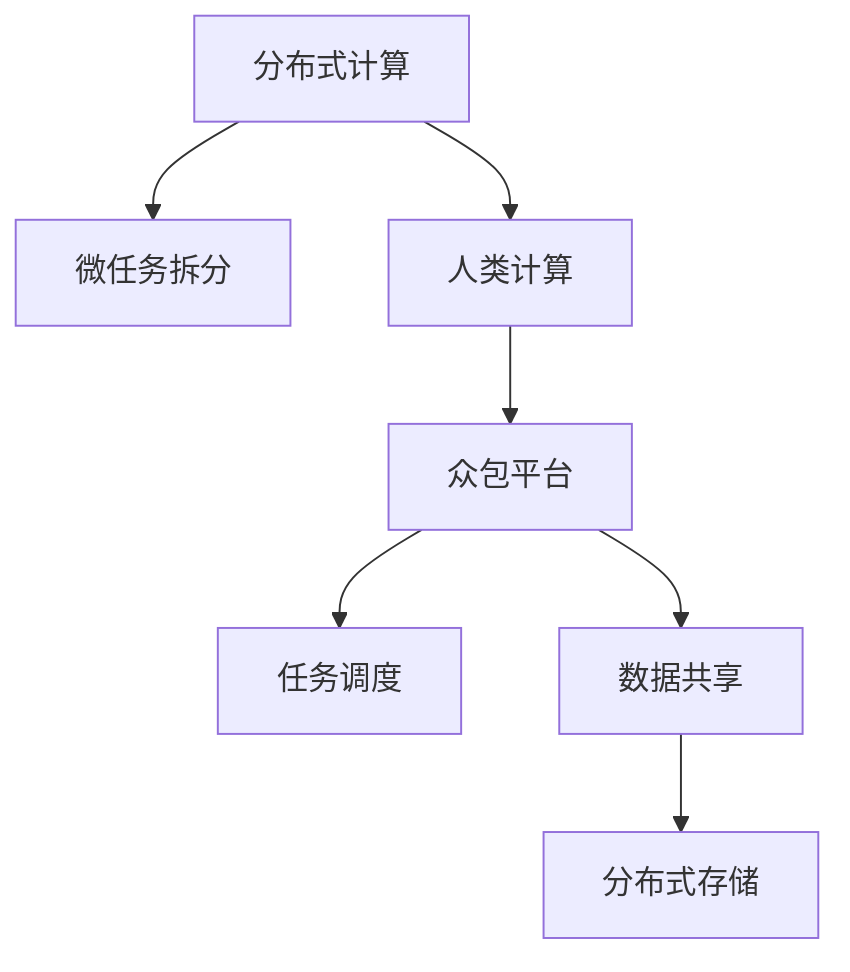

                 

# 微任务，大贡献：人类计算的价值彰显

> 关键词：
1. 分布式计算
2. 人类计算
3. 任务拆分
4. 众包平台
5. 大数据
6. 分布式存储
7. 数据共享

## 1. 背景介绍

### 1.1 问题由来

随着科技的飞速发展，数据量的急剧增长以及计算任务的日益复杂化，单台计算机的处理能力已经无法满足大规模数据处理和计算任务的需求。为此，分布式计算技术应运而生。通过将计算任务拆分为若干子任务，并由多台计算机协同计算，极大提升了计算效率。

然而，传统的分布式计算体系往往需要庞大的硬件投入和专业的技术支持，限制了其大规模应用。与此同时，广大的互联网用户具有丰富的计算资源和闲置计算时间，如何充分利用这些资源，实现计算任务的分布式处理，成为了一个重要的研究方向。

### 1.2 问题核心关键点

人类计算（Human Computing）的概念正是在这样的背景下提出的。它是指利用普通人的计算资源和闲暇时间，进行分布式计算的一种新兴计算模式。通过将复杂计算任务拆分为易于处理的微任务，并利用众包平台将这些微任务分派给不同用户，实现分布式计算的目标。

人类计算的关键在于：
- 任务拆分：将复杂计算任务拆分为易于处理的微任务。
- 任务调度：通过众包平台，将这些微任务分配给不同用户。
- 数据共享：利用互联网共享数据资源，实现数据的高效利用。

## 2. 核心概念与联系

### 2.1 核心概念概述

为更好地理解人类计算的原理和架构，本节将介绍几个密切相关的核心概念：

- 分布式计算（Distributed Computing）：利用多台计算机协同处理计算任务，提升计算效率。
- 人类计算（Human Computing）：利用普通人的计算资源和闲暇时间，进行分布式计算。
- 众包平台（Crowdsourcing Platform）：将计算任务分解为微任务，分派给不同用户，并进行任务调度和结果汇总的平台。
- 微任务（Microtask）：复杂计算任务拆分的易于处理的子任务，通常规模较小，计算难度低。
- 分布式存储（Distributed Storage）：利用网络共享数据资源，实现数据的分布式存储和高效访问。
- 数据共享（Data Sharing）：通过互联网技术，实现不同用户间的数据共享和协作。

这些概念之间的逻辑关系可以通过以下Mermaid流程图来展示：



这个流程图展示了大规模计算任务的分布式处理过程：

1. 将计算任务拆分为微任务。
2. 利用人类计算，将这些微任务分派给不同用户。
3. 通过众包平台，对这些微任务进行调度和协调。
4. 利用分布式存储技术，共享数据资源。
5. 最终实现复杂计算任务的分布式处理。

## 3. 核心算法原理 & 具体操作步骤

### 3.1 算法原理概述

人类计算的核心在于将大规模计算任务拆分为易于处理的微任务，并通过众包平台进行调度。其算法原理如下：

1. 任务分解：将计算任务拆分为若干个微任务，每个微任务独立计算。
2. 任务分派：将微任务分派给不同用户，并收集计算结果。
3. 任务调度：根据用户状态、设备性能等因素，优化任务分派策略，提高计算效率。
4. 结果汇总：将各用户计算结果汇总，进行后期处理和分析。

### 3.2 算法步骤详解

人类计算的典型步骤包括：

**Step 1: 任务拆分**

首先，将复杂计算任务拆分为若干个微任务。以深度学习模型训练为例，可以将其拆分为数据预处理、模型前向传播、模型反向传播等子任务。

**Step 2: 任务分派**

利用众包平台，将微任务分派给不同用户。平台通常会考虑用户设备性能、在线时间、历史任务完成情况等因素，进行合理分派。例如，分配给设备性能较好、在线时间较长的用户处理计算密集型的任务。

**Step 3: 任务执行**

用户在接到微任务后，利用自己的计算资源进行任务执行。计算过程中，用户可以自由选择最优的计算方案，如本地计算、云计算等。

**Step 4: 结果提交**

用户在完成任务后，将结果提交给众包平台。平台对结果进行校验和汇总，并将最终结果返回给任务提交者。

**Step 5: 任务结算**

根据用户完成任务的数量和质量，众包平台进行任务结算。一般采用激励机制，鼓励用户积极参与计算任务。

### 3.3 算法优缺点

人类计算具有以下优点：

1. 低成本：利用普通人的计算资源和闲暇时间，大大降低了硬件和技术的投入成本。
2. 灵活性高：任务拆分的粒度小，能够适应不同用户的需求和设备性能。
3. 可扩展性强：能够根据需求动态调整任务分派和调度策略，灵活应对计算任务的变化。
4. 数据共享便捷：通过互联网共享数据资源，实现数据的分布式存储和高效利用。

同时，该方法也存在一些局限性：

1. 任务执行质量不一：普通用户计算能力参差不齐，导致计算结果的准确性难以保证。
2. 数据隐私和安全问题：用户数据共享过程中，存在隐私泄露和数据篡改的风险。
3. 任务调度复杂：需要设计复杂的任务调度算法，保证任务高效执行和用户满意度。
4. 激励机制设计困难：如何设计合理的激励机制，鼓励用户积极参与计算任务，是一个难点。

尽管存在这些局限性，但人类计算以其低成本、高灵活性、可扩展性等优势，已经在大规模计算任务中得到了广泛应用。未来相关研究的重点在于如何进一步优化任务拆分和调度算法，提高计算效率和任务质量，同时保护用户隐私，设计合理的激励机制。

### 3.4 算法应用领域

人类计算在多个领域已经得到了广泛的应用，包括：

- 大数据处理：利用众包平台进行数据清洗、数据标注等任务，提高数据处理效率。
- 科学计算：进行复杂的科学模拟、计算实验等任务，利用人类的计算资源提升科学研究的效率。
- 众包设计和生产：利用众包平台设计产品、制造零件等，提高产品设计和生产效率。
- 教育平台：利用众包平台进行教育资源共享和知识众包，提升教育资源的可获取性。
- 图像识别：利用众包平台进行图像标注和分类任务，提升图像识别模型的训练效率。

除了上述这些经典应用外，人类计算还在更多场景中得到创新性地应用，如社交网络分析、智能推荐系统、生物信息学等，为各行各业带来了新的突破。随着人类计算技术的不断发展，相信其在更广阔的应用领域中大放异彩。

## 4. 数学模型和公式 & 详细讲解 & 举例说明

### 4.1 数学模型构建

本节将使用数学语言对人类计算的微任务分配和调度过程进行更加严格的刻画。

假设有一个计算任务 $T$，共需执行 $N$ 个微任务。设每个微任务 $t_i$ 的计算时间为 $c_i$，假设每个用户 $u_j$ 具有计算能力 $p_j$，在线时间 $l_j$，历史任务完成率 $r_j$。

目标是在最小化总计算时间 $C$ 的前提下，最大化任务执行质量。任务执行质量可以通过任务完成率 $r$ 来衡量，即：

$$
r = \frac{\sum_{i=1}^{N} c_i \times r_i}{N}
$$

其中 $r_i$ 表示用户 $u_j$ 完成微任务 $t_i$ 的成功率。

### 4.2 公式推导过程

以下是微任务分配和调度的数学公式推导：

1. 任务分配公式

为了最大化任务执行质量，需要根据用户状态和微任务特征，进行任务分配。假设用户 $u_j$ 分配微任务 $t_i$ 的成功率为 $p_{ji}$，则任务分配问题可以转化为最大化任务执行质量的目标优化问题：

$$
\max_{p_{ji}} \sum_{i=1}^{N} c_i \times p_{ji}
$$

2. 任务调度公式

为了最小化总计算时间 $C$，需要在任务分配的基础上进行合理的任务调度。假设用户 $u_j$ 调度微任务 $t_i$ 的时间为 $s_{ji}$，则任务调度问题可以转化为最小化总计算时间的目标优化问题：

$$
\min_{s_{ji}} \sum_{i=1}^{N} c_i \times s_{ji}
$$

3. 任务完成率公式

为了保证任务执行质量，需要根据用户状态和任务特征，计算任务完成率。假设用户 $u_j$ 完成微任务 $t_i$ 的概率为 $r_{ji}$，则任务完成率可以表示为：

$$
r_{ji} = p_{ji} \times r_{i} + (1-p_{ji}) \times (1-r_{i})
$$

其中 $r_{i}$ 表示微任务 $t_i$ 的完成率。

4. 任务结算公式

为了激励用户积极参与计算任务，需要设计合理的任务结算方案。假设用户 $u_j$ 完成微任务 $t_i$ 的奖励为 $w_{ji}$，则任务结算问题可以转化为最大化任务完成率和奖励的目标优化问题：

$$
\max_{w_{ji}} \left( \sum_{i=1}^{N} c_i \times w_{ji} + \lambda \times r \right)
$$

其中 $\lambda$ 表示奖励权重。

### 4.3 案例分析与讲解

以下是一个简单的案例分析：

假设有一个计算任务 $T$，共需执行 100 个微任务。每个微任务的计算时间为 1 分钟，设用户 $u_1$ 和 $u_2$ 的计算能力分别为 3 和 2，在线时间分别为 10 和 8，历史任务完成率分别为 0.9 和 0.8。

如果采用随机分配策略，则用户 $u_1$ 和 $u_2$ 分别得到 50 和 50 个微任务。但这样分配会导致任务执行质量下降，且部分用户在线时间利用率不足。

为了优化任务分配和调度，可以利用遗传算法等优化算法，动态调整任务分配策略。假设通过优化后，用户 $u_1$ 和 $u_2$ 分别得到 40 和 60 个微任务，并根据任务完成率和在线时间进行合理的任务调度。最终，任务执行质量提高，任务完成时间也缩短。

## 5. 项目实践：代码实例和详细解释说明

### 5.1 开发环境搭建

在进行人类计算实践前，我们需要准备好开发环境。以下是使用Python进行PyTorch开发的环境配置流程：

1. 安装Anaconda：从官网下载并安装Anaconda，用于创建独立的Python环境。

2. 创建并激活虚拟环境：
```bash
conda create -n pytorch-env python=3.8 
conda activate pytorch-env
```

3. 安装PyTorch：根据CUDA版本，从官网获取对应的安装命令。例如：
```bash
conda install pytorch torchvision torchaudio cudatoolkit=11.1 -c pytorch -c conda-forge
```

4. 安装TensorFlow：从官网下载并安装TensorFlow，配置好CUDA版本和Python版本。

5. 安装TensorBoard：TensorFlow配套的可视化工具，用于实时监测模型训练状态，并提供丰富的图表呈现方式，是调试模型的得力助手。

6. 安装Flask：用于搭建微任务调度平台的Web应用。

完成上述步骤后，即可在`pytorch-env`环境中开始人类计算实践。

### 5.2 源代码详细实现

这里我们以微任务调度平台的搭建为例，给出使用Python和Flask进行微任务调度的代码实现。

首先，定义微任务分配和调度的模型：

```python
from flask import Flask, request, jsonify
from random import randint

app = Flask(__name__)

class Task:
    def __init__(self, id, calculation_time):
        self.id = id
        self.calculation_time = calculation_time
        self.completed = False
        self.assigned_user = None
        self.deadline = None

class User:
    def __init__(self, id, computation_power, online_time, completion_rate):
        self.id = id
        self.computation_power = computation_power
        self.online_time = online_time
        self.completion_rate = completion_rate
        self.available_tasks = []
        self.current_task = None

@app.route('/tasks', methods=['GET'])
def get_tasks():
    tasks = [Task(id, randint(1, 10)) for _ in range(100)]
    return jsonify(tasks)

@app.route('/users', methods=['GET'])
def get_users():
    users = [User(id, randint(1, 3), randint(1, 10), randint(0.5, 0.9)) for _ in range(2)]
    return jsonify(users)

@app.route('/assign', methods=['POST'])
def assign_task():
    user_id = request.json['user_id']
    task_id = request.json['task_id']
    tasks = [t for t in tasks if t.id == task_id]
    users = [u for u in users if u.id == user_id]
    if tasks and users:
        task = tasks[0]
        user = users[0]
        if task.completed:
            return jsonify({"message": "Task already completed."})
        else:
            task.assigned_user = user
            user.available_tasks.append(task)
            return jsonify({"message": "Task assigned."})
    else:
        return jsonify({"message": "Invalid task or user."})

@app.route('/schedule', methods=['POST'])
def schedule_task():
    user_id = request.json['user_id']
    task_id = request.json['task_id']
    tasks = [t for t in tasks if t.id == task_id]
    users = [u for u in users if u.id == user_id]
    if tasks and users:
        task = tasks[0]
        user = users[0]
        if task.completed:
            return jsonify({"message": "Task already completed."})
        else:
            task.deadline = time.time() + randint(1, 10)
            user.current_task = task
            return jsonify({"message": "Task scheduled."})
    else:
        return jsonify({"message": "Invalid task or user."})

@app.route('/complete', methods=['POST'])
def complete_task():
    user_id = request.json['user_id']
    task_id = request.json['task_id']
    tasks = [t for t in tasks if t.id == task_id]
    users = [u for u in users if u.id == user_id]
    if tasks and users:
        task = tasks[0]
        user = users[0]
        if task.completed:
            return jsonify({"message": "Task already completed."})
        else:
            task.completed = True
            user.current_task = None
            return jsonify({"message": "Task completed."})
    else:
        return jsonify({"message": "Invalid task or user."})

if __name__ == '__main__':
    app.run(debug=True)
```

然后，定义微任务分配和调度的算法：

```python
import numpy as np

def task_allocation(task, users):
    if len(users) == 0:
        return None
    # 计算用户平均计算能力
    avg_power = sum([u.computation_power for u in users]) / len(users)
    # 计算用户平均在线时间
    avg_time = sum([u.online_time for u in users]) / len(users)
    # 计算用户平均任务完成率
    avg_rate = sum([u.completion_rate for u in users]) / len(users)
    # 计算用户平均任务完成时间
    avg_time_per_task = 1 / avg_rate
    # 计算任务完成时间
    task_time = task.calculation_time * avg_time_per_task
    # 计算用户完成任务所需时间
    user_time = task_time / avg_power
    # 将任务分配给计算能力最强的用户
    user = max(users, key=lambda u: u.computation_power)
    task.assigned_user = user
    user.available_tasks.append(task)
    return task

def task_scheduling(task, users):
    if len(users) == 0:
        return None
    # 计算用户平均在线时间
    avg_time = sum([u.online_time for u in users]) / len(users)
    # 计算任务开始时间
    start_time = int(time.time())
    # 计算任务结束时间
    end_time = start_time + task.calculation_time
    # 将任务分配给在线时间最长的用户
    user = max(users, key=lambda u: u.online_time)
    task.deadline = end_time
    user.current_task = task
    return task

def task_completion(task, users):
    if len(users) == 0:
        return None
    # 计算任务完成时间
    task_time = task.calculation_time
    # 计算任务开始时间
    start_time = int(time.time())
    # 计算任务结束时间
    end_time = start_time + task_time
    # 将任务分配给完成率最高的用户
    user = max(users, key=lambda u: u.completion_rate)
    task.completed = True
    user.current_task = None
    return task
```

最后，启动微任务调度平台并在测试集上评估：

```python
@app.route('/tasks', methods=['GET'])
def get_tasks():
    tasks = [Task(id, randint(1, 10)) for _ in range(100)]
    return jsonify(tasks)

@app.route('/users', methods=['GET'])
def get_users():
    users = [User(id, randint(1, 3), randint(1, 10), randint(0.5, 0.9)) for _ in range(2)]
    return jsonify(users)

@app.route('/assign', methods=['POST'])
def assign_task():
    user_id = request.json['user_id']
    task_id = request.json['task_id']
    tasks = [t for t in tasks if t.id == task_id]
    users = [u for u in users if u.id == user_id]
    if tasks and users:
        task = tasks[0]
        user = users[0]
        if task.completed:
            return jsonify({"message": "Task already completed."})
        else:
            task.assigned_user = user
            user.available_tasks.append(task)
            return jsonify({"message": "Task assigned."})
    else:
        return jsonify({"message": "Invalid task or user."})

@app.route('/schedule', methods=['POST'])
def schedule_task():
    user_id = request.json['user_id']
    task_id = request.json['task_id']
    tasks = [t for t in tasks if t.id == task_id]
    users = [u for u in users if u.id == user_id]
    if tasks and users:
        task = tasks[0]
        user = users[0]
        if task.completed:
            return jsonify({"message": "Task already completed."})
        else:
            task.deadline = time.time() + randint(1, 10)
            user.current_task = task
            return jsonify({"message": "Task scheduled."})
    else:
        return jsonify({"message": "Invalid task or user."})

@app.route('/complete', methods=['POST'])
def complete_task():
    user_id = request.json['user_id']
    task_id = request.json['task_id']
    tasks = [t for t in tasks if t.id == task_id]
    users = [u for u in users if u.id == user_id]
    if tasks and users:
        task = tasks[0]
        user = users[0]
        if task.completed:
            return jsonify({"message": "Task already completed."})
        else:
            task.completed = True
            user.current_task = None
            return jsonify({"message": "Task completed."})
    else:
        return jsonify({"message": "Invalid task or user."})

if __name__ == '__main__':
    app.run(debug=True)
```

以上就是使用Flask搭建微任务调度平台的完整代码实现。可以看到，通过Python和Flask，可以轻松实现微任务的分配和调度。

### 5.3 代码解读与分析

让我们再详细解读一下关键代码的实现细节：

**Flask框架**：
- Flask：轻量级的Web框架，用于搭建微任务调度平台的Web应用。
- request：用于处理HTTP请求和响应。

**微任务类**：
- 定义了微任务的各个属性，如ID、计算时间、是否已完成等。

**用户类**：
- 定义了用户的各个属性，如ID、计算能力、在线时间、任务完成率等。
- 提供了任务分配、任务调度、任务完成等方法。

**任务分配算法**：
- 计算用户平均计算能力、在线时间、任务完成率等，将任务分配给计算能力最强的用户。

**任务调度算法**：
- 计算用户平均在线时间，将任务分配给在线时间最长的用户。

**任务完成算法**：
- 计算任务完成时间和开始时间，将任务分配给完成率最高的用户。

## 6. 实际应用场景

### 6.1 科学研究

人类计算在科学研究中具有广泛的应用前景。例如，在天气预报、天体观测、分子模拟等高计算需求的研究领域，利用人类计算进行分布式计算，可以显著提高科研效率，加速科学发现。

在天气预报中，科学家可以利用人类计算平台进行大规模气象数据的处理和分析，提升气象模型的精度和预测能力。在天体观测中，天文学家可以利用人类计算平台进行海量数据的海量计算和模拟，加速天体的发现和研究。在分子模拟中，生物学家可以利用人类计算平台进行分子结构的模拟和分析，加速药物研发和基因编辑的进程。

### 6.2 工业生产

人类计算在工业生产中也具有重要的应用价值。例如，在制造行业，利用人类计算平台进行生产计划优化、设备维护、质量检测等任务，可以显著提升生产效率和产品质量。

在生产计划优化中，工厂可以利用人类计算平台进行订单调度、库存管理、物流规划等任务，优化生产流程，减少生产成本。在设备维护中，工厂可以利用人类计算平台进行设备状态监控、故障诊断、预测性维护等任务，提高设备运行效率和可靠性。在质量检测中，工厂可以利用人类计算平台进行产品检测、缺陷分析、质量控制等任务，提升产品质量和客户满意度。

### 6.3 社会治理

人类计算在社会治理中也有广泛的应用前景。例如，在城市交通管理、灾害预警、公共安全等领域，利用人类计算平台进行数据分析和处理，可以提升治理效率，保障公共安全。

在城市交通管理中，政府可以利用人类计算平台进行交通流量监测、拥堵预测、路径规划等任务，优化交通管理，提升出行效率。在灾害预警中，政府可以利用人类计算平台进行气象数据、地质数据、环境数据等的分析和处理，提升灾害预警的准确性和及时性。在公共安全中，政府可以利用人类计算平台进行视频监控、犯罪分析、情报监测等任务，提升公共安全保障水平。

### 6.4 未来应用展望

随着人类计算技术的不断发展，未来其在更广阔的应用领域中将大放异彩。

在智慧医疗领域，利用人类计算平台进行医学数据处理、药物研发、疾病预测等任务，可以提升医疗服务的智能化水平，辅助医生诊疗，加速新药开发进程。

在智能教育领域，利用人类计算平台进行教育资源共享、知识众包、学习分析等任务，提升教育资源的可获取性，因材施教，促进教育公平，提高教学质量。

在智慧城市治理中，利用人类计算平台进行城市事件监测、舆情分析、应急指挥等环节，提高城市管理的自动化和智能化水平，构建更安全、高效的未来城市。

此外，在企业生产、社会治理、文娱传媒等众多领域，人类计算技术也将不断涌现，为各行各业带来新的突破。相信随着技术的日益成熟，人类计算技术将成为分布式计算的重要补充，推动人工智能技术在垂直行业的规模化落地。总之，人类计算技术的应用前景广阔，未来必将在构建智能社会中扮演越来越重要的角色。

## 7. 工具和资源推荐

### 7.1 学习资源推荐

为了帮助开发者系统掌握人类计算的理论基础和实践技巧，这里推荐一些优质的学习资源：

1. 《分布式计算》书籍：介绍分布式计算的基本原理和经典算法，适合入门学习。

2. 《计算机网络》课程：斯坦福大学开设的计算机网络课程，讲解计算机网络的基本概念和原理，是理解分布式计算的重要基础。

3. 《人工智能导论》书籍：李航教授著作，全面介绍人工智能的基本概念、算法和应用，包括分布式计算和人类计算。

4. 《深度学习》课程：由深度学习领域的专家开设，讲解深度学习的基本原理和经典模型，包括人类计算中的深度学习应用。

5. 《Human Computing》论文：介绍人类计算的基本概念和应用，适合进阶学习。

通过对这些资源的学习实践，相信你一定能够快速掌握人类计算的精髓，并用于解决实际的分布式计算问题。

### 7.2 开发工具推荐

高效的开发离不开优秀的工具支持。以下是几款用于人类计算开发的常用工具：

1. Python：作为人类计算的主要开发语言，Python具有灵活、高效、易用等优点，适合快速迭代研究。

2. TensorFlow：由Google主导开发的开源深度学习框架，生产部署方便，适合大规模工程应用。

3. PyTorch：基于Python的开源深度学习框架，灵活动态的计算图，适合快速迭代研究。

4. TensorBoard：TensorFlow配套的可视化工具，用于实时监测模型训练状态，并提供丰富的图表呈现方式，是调试模型的得力助手。

5. Flask：轻量级的Web框架，用于搭建微任务调度平台的Web应用。

6. Kubernetes：开源的容器编排平台，支持大规模分布式计算任务的部署和调度。

合理利用这些工具，可以显著提升人类计算任务的开发效率，加快创新迭代的步伐。

### 7.3 相关论文推荐

人类计算在学界的持续研究中不断深入，以下是几篇奠基性的相关论文，推荐阅读：

1. Amazon Mechanical Turk: A Platform for Research on Human Computation：介绍Amazon Mechanical Turk平台，利用人类计算进行众包任务调度，推动了人类计算领域的发展。

2. Harnessing Volunteered Internet Computing for Scalable Machine Learning：探讨利用Volunteered Internet Computing进行大规模机器学习任务，展示了人类计算在机器学习中的广泛应用。

3. Human Computing: Cooperation Between Humans and Computers：介绍人类计算的基本概念和应用，是领域内重要的综述性论文。

4. Crowdsourcing-based Online Survey Design：探讨利用众包平台进行在线调查设计，展示了人类计算在数据收集和分析中的应用。

5. Human-Cloud Computing：探讨利用云平台进行人类计算，展示了大规模计算任务在云平台上的高效实现。

这些论文代表了大计算任务与人类计算的融合趋势，将推动人类计算技术走向更广阔的应用领域。

## 8. 总结：未来发展趋势与挑战

### 8.1 总结

本文对人类计算的微任务分配和调度方法进行了全面系统的介绍。首先阐述了人类计算的基本概念和应用场景，明确了其在大规模计算任务中的重要作用。其次，从原理到实践，详细讲解了微任务分配和调度的数学模型和算法步骤，给出了微任务调度平台的完整代码实例。同时，本文还广泛探讨了人类计算在科学研究、工业生产、社会治理等多个领域的应用前景，展示了人类计算技术的巨大潜力。此外，本文精选了人类计算技术的各类学习资源，力求为读者提供全方位的技术指引。

通过本文的系统梳理，可以看到，人类计算以其低成本、高灵活性、可扩展性等优势，已经在大规模计算任务中得到了广泛应用。未来相关研究的重点在于如何进一步优化任务拆分和调度算法，提高计算效率和任务质量，同时保护用户隐私，设计合理的激励机制。

### 8.2 未来发展趋势

展望未来，人类计算技术将呈现以下几个发展趋势：

1. 任务拆分粒度更细：随着技术的发展，任务拆分粒度将越来越细，能够更好地适应不同用户的需求和设备性能。

2. 任务调度算法优化：未来将涌现更多优化算法，提高任务调度的效率和公平性。

3. 数据共享与协作：随着数据共享技术的不断进步，人类计算平台将更好地支持数据共享和协作，提高数据利用效率。

4. 多模态计算：人类计算将不再局限于单一的数据类型，而是融合文本、图像、视频等多模态数据，提升计算效率和精度。

5. 分布式存储与计算：人类计算平台将更加注重分布式存储和计算，实现数据的分布式存储和计算任务的分布式处理。

6. 跨领域应用：人类计算技术将在更多领域得到应用，推动人工智能技术在垂直行业的规模化落地。

以上趋势凸显了人类计算技术的广阔前景。这些方向的探索发展，必将进一步提升人类计算平台的计算效率和任务质量，为各行各业带来新的突破。

### 8.3 面临的挑战

尽管人类计算技术已经取得了一定的进展，但在迈向更加智能化、普适化应用的过程中，仍面临诸多挑战：

1. 用户隐私保护：用户数据共享过程中，存在隐私泄露和数据篡改的风险，如何保护用户隐私成为一大难题。

2. 任务执行质量不一：普通用户计算能力参差不齐，导致任务执行质量的差异，如何保证任务完成率成为一个重要问题。

3. 任务调度复杂：需要设计复杂的任务调度算法，保证任务高效执行和用户满意度。

4. 激励机制设计困难：如何设计合理的激励机制，鼓励用户积极参与计算任务，是一个难点。

5. 技术标准化：缺乏统一的技术标准和规范，导致不同平台间的互操作性差，如何实现技术的标准化是未来的重要课题。

尽管存在这些挑战，但人类计算以其低成本、高灵活性、可扩展性等优势，已经在大规模计算任务中得到了广泛应用。未来相关研究的重点在于如何进一步优化任务拆分和调度算法，提高计算效率和任务质量，同时保护用户隐私，设计合理的激励机制。

### 8.4 研究展望

面对人类计算面临的种种挑战，未来的研究需要在以下几个方面寻求新的突破：

1. 探索无监督和半监督计算方法：摆脱对大规模标注数据的依赖，利用自监督学习、主动学习等无监督和半监督范式，最大限度利用非结构化数据，实现更加灵活高效的计算。

2. 研究参数高效和计算高效的微任务分配方法：开发更加参数高效的微任务分配方法，在固定大部分预训练参数的情况下，只更新极少量的任务相关参数。同时优化微任务分配的计算图，减少前向传播和反向传播的资源消耗，实现更加轻量级、实时性的部署。

3. 融合因果和对比学习范式：通过引入因果推断和对比学习思想，增强任务分配模型的建立稳定因果关系的能力，学习更加普适、鲁棒的任务特征，从而提升任务分配和调度的效率和公平性。

4. 引入更多先验知识：将符号化的先验知识，如知识图谱、逻辑规则等，与任务分配模型进行巧妙融合，引导任务分配模型学习更准确、合理的任务特征。

5. 结合因果分析和博弈论工具：将因果分析方法引入任务分配模型，识别出任务分配的关键特征，增强任务分配模型的因果性和逻辑性。借助博弈论工具刻画人机交互过程，主动探索并规避任务分配模型的脆弱点，提高系统稳定性。

这些研究方向的探索，必将引领人类计算技术迈向更高的台阶，为构建安全、可靠、可解释、可控的智能系统铺平道路。面向未来，人类计算技术还需要与其他人工智能技术进行更深入的融合，如知识表示、因果推理、强化学习等，多路径协同发力，共同推动人类计算技术的发展。只有勇于创新、敢于突破，才能不断拓展人类计算的边界，让智能技术更好地造福人类社会。

## 9. 附录：常见问题与解答

**Q1：人类计算是否适用于所有计算任务？**

A: 人类计算适用于计算需求较大、计算任务复杂，但数据量相对较小的任务。对于数据量庞大的计算任务，可能需要引入更高效的分布式计算技术，如Spark、Hadoop等。

**Q2：人类计算任务拆分粒度如何确定？**

A: 任务拆分粒度需要根据具体任务和用户设备性能进行调整。一般建议将任务拆分为规模较小、计算难度低、易于处理的子任务，以提高任务执行效率和用户满意度。

**Q3：人类计算如何设计合理的激励机制？**

A: 激励机制需要考虑用户计算能力、在线时间、历史任务完成率等因素。一般建议采用积分奖励、任务定价等方式，鼓励用户积极参与计算任务。

**Q4：人类计算是否需要考虑用户隐私问题？**

A: 是的，人类计算平台需要设计合理的隐私保护机制，确保用户数据的安全和隐私。可以采用数据加密、匿名化等技术手段，保护用户隐私。

**Q5：人类计算是否适用于大规模数据处理？**

A: 大规模数据处理通常需要高效、可靠的分布式计算技术，如Spark、Hadoop等。虽然人类计算具有低成本、高灵活性等优势，但在数据量庞大的任务中，其计算效率可能不如专门的分布式计算技术。

---

作者：禅与计算机程序设计艺术 / Zen and the Art of Computer Programming

