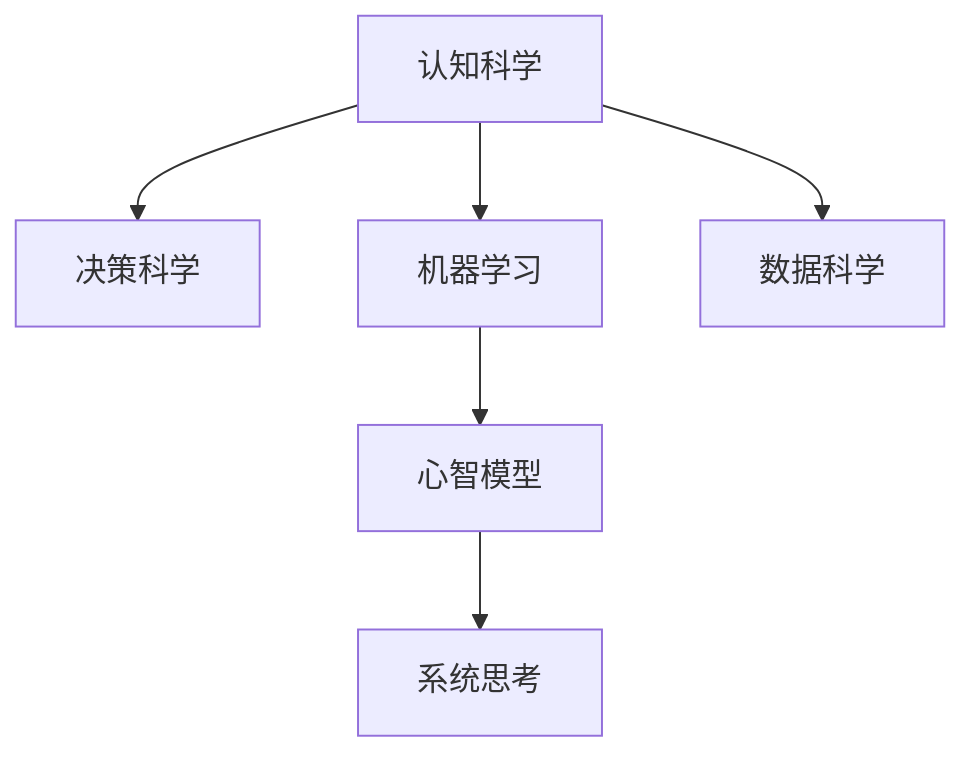

                 

# 心智模型：理解世界的内在框架

> 关键词：心智模型, 认知科学, 机器学习, 数据科学, 系统思考, 决策科学

## 1. 背景介绍

### 1.1 问题由来
在日常生活中，我们经常听到“心智模型”（Mental Model）这个词，但它究竟是什么意思？为何如此重要？首先，我们需要从认知科学和决策科学的角度，来理解心智模型。

心智模型是一种对现实世界进行抽象和理解的认知框架。它帮助我们快速处理信息、做出决策，是我们理解和解决问题的重要工具。心智模型可以简单理解为一种“知识的地图”，其中包含了我们对世界的认识、对未来可能性的预测以及对不同情境的应对策略。

随着人工智能和大数据技术的发展，心智模型在决策科学和数据科学中的应用越来越广泛。人们开始尝试用机器学习算法来模拟和优化心智模型，以期在复杂的环境中做出更为准确和高效的决策。

### 1.2 问题核心关键点
心智模型在决策科学和数据科学中的应用，主要是通过以下几个关键点来实现的：

- **数据驱动**：使用机器学习算法和数据科学方法，从大量的数据中提取知识，更新心智模型。
- **模型优化**：通过优化算法，使心智模型更加准确、全面，以适应不同的情境和问题。
- **系统思考**：将心智模型嵌入复杂的系统中，使系统可以自主学习和调整，以适应外部环境的变化。
- **决策支持**：在复杂环境中，心智模型可以辅助决策者做出更好的决策，避免错误。

这些关键点展示了心智模型在现代数据科学和决策科学中的重要地位。通过深入理解心智模型，可以提升决策质量、优化系统性能，并预测未来趋势。

## 2. 核心概念与联系

### 2.1 核心概念概述

心智模型是一种复杂的认知工具，涉及多个相关概念。本节将详细介绍这些核心概念及其相互关系。

- **认知科学**：研究人类认知过程的科学领域，包括知觉、记忆、语言、思维等方面。心智模型是认知科学的重要研究对象之一。
- **决策科学**：研究人类和组织在复杂环境中做出决策的过程和策略。心智模型是决策科学中的重要工具，用于辅助决策者理解和解决问题。
- **机器学习**：通过算法和数据，使计算机系统自动学习、优化和改进。心智模型可以与机器学习相结合，实现自适应和优化。
- **数据科学**：从数据中提取知识、发现模式，并用其来优化决策和预测未来。心智模型是数据科学中的一个重要概念，用于构建知识表示和模型。
- **系统思考**：将心智模型嵌入复杂系统，实现系统自我学习、自我调整，以适应环境变化。系统思考是心智模型应用的重要方向之一。

这些概念之间的关系可以通过以下Mermaid流程图来展示：



这个流程图展示了心智模型与其他相关概念之间的联系：

1. 认知科学为心智模型的构建提供了理论基础。
2. 决策科学为心智模型的应用提供了目标和策略。
3. 机器学习为心智模型的优化和自适应提供了技术手段。
4. 数据科学为心智模型的构建和应用提供了数据支持。
5. 系统思考将心智模型嵌入复杂系统，实现系统的自我学习和优化。

## 3. 核心算法原理 & 具体操作步骤

### 3.1 算法原理概述

心智模型的构建和优化，通常通过以下步骤实现：

1. **数据收集**：从各种来源收集相关的数据，确保数据的多样性和全面性。
2. **数据预处理**：清洗和处理数据，确保其质量和可用性。
3. **特征工程**：提取和构造有意义的特征，为机器学习算法提供输入。
4. **模型训练**：使用机器学习算法，训练心智模型，优化其结构和性能。
5. **模型评估**：评估模型的性能和效果，确保其符合实际应用的要求。
6. **模型应用**：将优化后的心智模型应用到实际场景中，辅助决策和预测。

### 3.2 算法步骤详解

#### 3.2.1 数据收集
数据收集是心智模型构建的第一步，也是最重要的步骤之一。有效的数据收集可以确保模型的准确性和可靠性。数据收集的来源包括：

- **公开数据集**：如Kaggle、UCI等平台上的公开数据集，为模型训练提供基础数据。
- **内部数据**：企业内部的业务数据、客户数据等，可以直接用于模型训练。
- **社交媒体**：如Twitter、微信等社交媒体平台的数据，可以用于舆情分析和市场趋势预测。

#### 3.2.2 数据预处理
数据预处理是模型训练的关键步骤，包括以下几个环节：

- **数据清洗**：去除缺失值、异常值等噪声数据，确保数据质量。
- **特征提取**：将原始数据转换为特征向量，为机器学习算法提供输入。
- **数据归一化**：将数据归一化到相同的范围，避免数据不平衡对模型的影响。
- **数据分割**：将数据分为训练集、验证集和测试集，确保模型的泛化能力。

#### 3.2.3 特征工程
特征工程是构建高质量心智模型的重要环节，包括以下几个步骤：

- **特征选择**：选择对目标变量有贡献的特征，减少模型复杂性。
- **特征变换**：将原始特征进行变换，提取更有意义的特征。
- **特征组合**：将多个特征进行组合，生成新的特征，提升模型的性能。
- **特征降维**：使用降维算法（如PCA、LDA）减少特征维度，提升模型的计算效率。

#### 3.2.4 模型训练
模型训练是心智模型构建的核心步骤，包括以下几个关键环节：

- **算法选择**：选择合适的机器学习算法，如决策树、随机森林、深度学习等。
- **超参数调优**：通过交叉验证等方法，优化算法的超参数，提升模型性能。
- **模型融合**：使用集成学习方法（如Bagging、Boosting）提升模型鲁棒性。
- **正则化**：使用L1正则、L2正则等方法，防止模型过拟合。

#### 3.2.5 模型评估
模型评估是心智模型构建的重要环节，包括以下几个关键步骤：

- **性能指标**：选择合适的评估指标（如准确率、召回率、F1值等），评估模型效果。
- **交叉验证**：使用交叉验证方法（如K-fold交叉验证）评估模型的泛化能力。
- **偏差-方差分析**：分析模型的偏差和方差，优化模型性能。
- **A/B测试**：在实际应用中，通过A/B测试比较新旧模型的效果，确保新模型的优势。

#### 3.2.6 模型应用
模型应用是心智模型构建的最终目标，包括以下几个关键环节：

- **部署**：将优化后的心智模型部署到实际应用场景中，实现自动化决策。
- **监控**：实时监控模型的性能和效果，确保其稳定运行。
- **更新**：根据新数据和新需求，定期更新和优化模型，保持其时效性。
- **反馈**：收集模型的反馈信息，进一步优化模型的性能和效果。

### 3.3 算法优缺点

心智模型的构建和优化，具有以下优点：

1. **数据驱动**：使用数据科学方法和机器学习算法，提升模型的准确性和可靠性。
2. **系统思考**：将心智模型嵌入复杂系统，实现系统自我学习和优化。
3. **高效决策**：辅助决策者快速做出决策，提高决策效率和质量。
4. **泛化能力**：通过优化算法和特征工程，提升模型的泛化能力，适应不同的情境和问题。

同时，心智模型也存在以下缺点：

1. **复杂性**：构建和优化心智模型需要大量数据和计算资源，可能带来高昂的开发成本。
2. **解释性不足**：机器学习模型的黑盒特性，使其难以解释其内部工作机制。
3. **模型偏差**：模型可能会学习到数据中的偏差和噪声，导致错误预测。
4. **数据隐私**：数据收集和使用过程中，可能涉及隐私和安全问题。

尽管存在这些缺点，但心智模型在现代决策科学和数据科学中的应用仍然至关重要。通过优化和改进，心智模型将进一步提升其应用效果和可靠性。

### 3.4 算法应用领域

心智模型的应用领域非常广泛，涵盖多个行业和领域：

- **金融行业**：用于风险评估、投资决策、市场预测等。
- **医疗行业**：用于疾病预测、患者管理、治疗方案推荐等。
- **零售行业**：用于客户分析、产品推荐、销售预测等。
- **供应链管理**：用于库存优化、需求预测、供应商选择等。
- **人力资源**：用于员工招聘、绩效评估、培训计划等。
- **智能制造**：用于设备维护、质量控制、生产调度等。

这些领域的心智模型应用，展示了其广泛的应用前景和重要价值。通过不断优化和改进，心智模型将在更多领域发挥重要作用，推动各个行业的发展和进步。

## 4. 数学模型和公式 & 详细讲解  
### 4.1 数学模型构建

心智模型的数学模型通常包括以下几个部分：

- **输入数据**：包括原始数据、特征向量等，为模型提供输入。
- **模型结构**：包括特征工程、机器学习算法等，用于构建和优化模型。
- **输出结果**：包括预测结果、决策方案等，为实际应用提供支持。

以下是一个简单的心智模型数学模型示例：

$$
M(x) = f(x; \theta) = \hat{y}
$$

其中，$x$ 为输入数据，$\theta$ 为模型参数，$f(x; \theta)$ 为模型函数，$\hat{y}$ 为模型输出。

### 4.2 公式推导过程

#### 4.2.1 数据收集和预处理

假设我们有一组数据 $(x_1, y_1), (x_2, y_2), ..., (x_n, y_n)$，其中 $x_i$ 为输入特征，$y_i$ 为输出标签。

- **数据清洗**：去除缺失值和异常值，得到 $x_1', x_2', ..., x_n'$。
- **特征提取**：将 $x_i'$ 转换为特征向量 $x_i'' = (x_1''_i, x_2''_i, ..., x_d''_i)$。
- **数据归一化**：将 $x_i''$ 归一化到 $[0, 1]$ 或 $[-1, 1]$ 范围内。
- **数据分割**：将数据分为训练集 $(x_{train}, y_{train})$、验证集 $(x_{valid}, y_{valid})$ 和测试集 $(x_{test}, y_{test})$。

#### 4.2.2 特征工程

假设我们选择决策树算法作为模型，其特征工程包括以下几个步骤：

- **特征选择**：选择与目标变量 $y$ 相关性高的特征 $x_1, x_2, ..., x_d$。
- **特征变换**：对特征进行变换，如对数变换、平方根变换等。
- **特征组合**：将多个特征组合生成新的特征，如 $x_1 \times x_2$、$x_1 + x_2$ 等。
- **特征降维**：使用PCA、LDA等算法进行特征降维，减少特征维度。

#### 4.2.3 模型训练

假设我们使用决策树算法进行模型训练，其训练过程包括以下几个步骤：

- **算法选择**：选择决策树算法，如ID3、C4.5、CART等。
- **超参数调优**：使用交叉验证方法（如K-fold交叉验证）优化算法超参数。
- **模型融合**：使用集成学习方法（如Bagging、Boosting）提升模型鲁棒性。
- **正则化**：使用L1正则、L2正则等方法防止模型过拟合。

#### 4.2.4 模型评估

假设我们使用准确率、召回率、F1值等指标评估模型性能，其评估过程包括以下几个步骤：

- **性能指标**：选择准确率、召回率、F1值等指标，评估模型效果。
- **交叉验证**：使用交叉验证方法（如K-fold交叉验证）评估模型泛化能力。
- **偏差-方差分析**：分析模型的偏差和方差，优化模型性能。
- **A/B测试**：在实际应用中，通过A/B测试比较新旧模型的效果，确保新模型的优势。

#### 4.2.5 模型应用

假设我们将优化后的心智模型应用到实际场景中，其应用过程包括以下几个步骤：

- **部署**：将优化后的心智模型部署到实际应用场景中，实现自动化决策。
- **监控**：实时监控模型的性能和效果，确保其稳定运行。
- **更新**：根据新数据和新需求，定期更新和优化模型，保持其时效性。
- **反馈**：收集模型的反馈信息，进一步优化模型的性能和效果。

## 5. 项目实践：代码实例和详细解释说明
### 5.1 开发环境搭建

在进行心智模型开发前，我们需要准备好开发环境。以下是使用Python进行Scikit-learn开发的环境配置流程：

1. 安装Anaconda：从官网下载并安装Anaconda，用于创建独立的Python环境。

2. 创建并激活虚拟环境：
```bash
conda create -n sklearn-env python=3.8 
conda activate sklearn-env
```

3. 安装Scikit-learn：使用pip安装Scikit-learn，作为构建心智模型的主要工具。

```bash
pip install scikit-learn
```

4. 安装各类工具包：
```bash
pip install numpy pandas scikit-learn matplotlib tqdm jupyter notebook ipython
```

完成上述步骤后，即可在`sklearn-env`环境中开始心智模型开发。

### 5.2 源代码详细实现

下面以简单的数据集为例，展示使用Scikit-learn进行心智模型开发的完整代码实现。

假设我们有一组数据集，其中包含两个特征 $x_1, x_2$ 和一个目标变量 $y$。我们的目标是构建一个简单的决策树模型，用于预测 $y$。

```python
from sklearn.datasets import load_boston
from sklearn.model_selection import train_test_split
from sklearn.tree import DecisionTreeClassifier
from sklearn.metrics import accuracy_score, precision_score, recall_score, f1_score

# 加载波士顿房价数据集
boston = load_boston()
X = boston.data
y = boston.target

# 数据分割
X_train, X_test, y_train, y_test = train_test_split(X, y, test_size=0.2, random_state=42)

# 构建决策树模型
model = DecisionTreeClassifier(max_depth=3, random_state=42)
model.fit(X_train, y_train)

# 评估模型
y_pred = model.predict(X_test)
print("Accuracy:", accuracy_score(y_test, y_pred))
print("Precision:", precision_score(y_test, y_pred))
print("Recall:", recall_score(y_test, y_pred))
print("F1 Score:", f1_score(y_test, y_pred))
```

这段代码实现了以下功能：

1. 加载波士顿房价数据集。
2. 数据分割为训练集和测试集。
3. 构建决策树模型。
4. 评估模型的准确率、精确率、召回率和F1值。

### 5.3 代码解读与分析

让我们再详细解读一下关键代码的实现细节：

**load_boston函数**：
- 从Scikit-learn库中加载波士顿房价数据集。

**train_test_split函数**：
- 将数据集分为训练集和测试集。

**DecisionTreeClassifier类**：
- 构建决策树模型，设置最大深度和随机状态。

**fit函数**：
- 使用训练集数据拟合决策树模型。

**predict函数**：
- 使用模型预测测试集数据。

**accuracy_score、precision_score、recall_score和f1_score函数**：
- 分别计算模型的准确率、精确率、召回率和F1值。

**print函数**：
- 输出模型的各项评估指标。

可以看到，使用Scikit-learn构建心智模型非常简单高效，只需要几行代码即可实现。开发者可以将更多精力放在数据处理、模型优化等高层逻辑上，而不必过多关注底层的实现细节。

当然，实际应用中还需要考虑更多因素，如模型调参、特征工程、超参数优化等，以进一步提升模型的性能。但核心的心智模型构建过程基本与此类似。

## 6. 实际应用场景
### 6.1 智能客服系统

基于心智模型的智能客服系统，可以广泛应用于企业客户服务部门。传统的客服系统依赖于人工处理客户咨询，响应时间长、效率低，且难以保证一致性和专业性。而使用心智模型构建的智能客服系统，可以实时处理客户咨询，快速响应，提高服务效率和客户满意度。

在技术实现上，我们可以将客户的咨询语料作为输入，构建心智模型进行情感分析、意图识别等，并根据分析结果自动生成回复，实现智能客服。随着数据和算法的不断优化，智能客服系统的自然语言处理能力和用户互动质量将不断提升，为企业的客户服务带来革命性的改变。

### 6.2 金融舆情监测

金融行业需要实时监测市场舆情，及时发现和应对负面信息传播，规避金融风险。传统的舆情监测依赖于人工分析，成本高、效率低，且难以实时响应。而使用心智模型构建的舆情监测系统，可以通过自然语言处理技术，自动识别市场舆情，分析其情感倾向和主题分布，并给出预警和建议，帮助金融机构快速应对金融风险。

在技术实现上，我们可以收集金融领域的各类文本数据，构建心智模型进行情感分析、主题分类等，并实时监测金融舆情，给出预警和建议，提升金融机构的舆情处理能力。随着数据和算法的不断优化，心智模型将能够更准确、高效地处理金融舆情，为金融市场的稳定和健康发展提供有力支持。

### 6.3 个性化推荐系统

当前的推荐系统往往依赖于用户的历史行为数据进行物品推荐，难以捕捉用户的真实兴趣和偏好。基于心智模型的推荐系统，可以更好地理解用户的语言和行为，从而提供更加个性化和精准的推荐结果。

在技术实现上，我们可以收集用户的浏览、点击、评论、分享等行为数据，构建心智模型进行情感分析、主题分类等，并根据分析结果推荐相关物品。随着数据和算法的不断优化，心智模型将能够更全面、准确地理解用户兴趣，提供更加个性化和精准的推荐结果，提升用户体验和满意度。

### 6.4 未来应用展望

随着心智模型的不断发展，其应用领域将更加广泛，带来更多创新和突破。以下是未来心智模型可能的应用方向：

1. **智能交通**：构建心智模型进行交通流量预测、车辆调度优化等，提升交通系统的效率和安全性。
2. **智慧农业**：构建心智模型进行土壤分析、气象预测等，提升农业生产效率和资源利用率。
3. **智能医疗**：构建心智模型进行疾病预测、患者管理、治疗方案推荐等，提升医疗服务的智能化水平。
4. **智能制造**：构建心智模型进行设备维护、质量控制、生产调度等，提升制造系统的自动化和智能化水平。
5. **智能教育**：构建心智模型进行学生分析、课程推荐、学习效果评估等，提升教育服务的个性化和智能化水平。
6. **智能家居**：构建心智模型进行环境监测、智能控制等，提升家居系统的智能化水平。

这些应用方向展示了心智模型在各行业中的巨大潜力和应用前景，必将推动各行业的数字化转型和智能化升级。

## 7. 工具和资源推荐
### 7.1 学习资源推荐

为了帮助开发者系统掌握心智模型的构建和优化方法，这里推荐一些优质的学习资源：

1. 《Python数据科学手册》：详细介绍了Python在数据科学和机器学习中的应用，包括数据处理、特征工程、模型训练等。
2. 《机器学习实战》：通过实例展示了机器学习算法的实现过程，适合入门学习和实践。
3. 《深度学习入门》：介绍了深度学习算法和模型，适合有一定基础的学习者。
4. 《统计学习方法》：介绍了机器学习的基本原理和方法，适合学术研究和技术开发。
5. 《AI Reinforcement》：介绍了强化学习在人工智能中的应用，适合了解未来发展方向。

通过这些资源的学习，相信你一定能够快速掌握心智模型的构建和优化方法，并将其应用于实际问题解决中。

### 7.2 开发工具推荐

高效的开发离不开优秀的工具支持。以下是几款用于心智模型开发常用的工具：

1. Python：作为数据科学和机器学习的主要开发语言，Python提供了丰富的库和框架，方便快速开发和实验。
2. Scikit-learn：基于Python的机器学习库，提供了多种算法和模型，适合快速构建和优化心智模型。
3. TensorFlow：由Google主导开发的深度学习框架，支持多种算法和模型，适合复杂模型和大规模数据处理。
4. PyTorch：由Facebook开发的深度学习框架，支持动态图和静态图，适合快速迭代和实验。
5. Jupyter Notebook：基于Web的交互式笔记本，支持Python、R等多种语言，方便实验和分享。

合理利用这些工具，可以显著提升心智模型的开发效率，加快创新迭代的步伐。

### 7.3 相关论文推荐

心智模型和机器学习的研究源于学界的持续探索。以下是几篇奠基性的相关论文，推荐阅读：

1. "Introduction to Statistical Learning" by Gareth James et al.：介绍了机器学习的基本原理和方法，是机器学习领域的经典教材。
2. "Machine Learning Yearning" by Andrew Ng：由机器学习专家Andrew Ng所著，详细介绍了机器学习的开发流程和最佳实践。
3. "Deep Learning" by Ian Goodfellow et al.：介绍了深度学习算法和模型，是深度学习领域的经典教材。
4. "The Elements of Statistical Learning" by Trevor Hastie et al.：介绍了统计学习的基本原理和方法，是统计学习领域的经典教材。
5. "Reinforcement Learning: An Introduction" by Richard S. Sutton and Andrew G. Barto：介绍了强化学习的基本原理和方法，是强化学习领域的经典教材。

这些论文代表了大模型和机器学习的发展脉络。通过学习这些前沿成果，可以帮助研究者把握学科前进方向，激发更多的创新灵感。

## 8. 总结：未来发展趋势与挑战
### 8.1 总结

本文对心智模型的构建和优化方法进行了全面系统的介绍。首先阐述了心智模型的研究背景和重要价值，明确了其在决策科学和数据科学中的核心地位。其次，从原理到实践，详细讲解了心智模型的构建步骤和优化方法，给出了心智模型开发的完整代码实例。同时，本文还广泛探讨了心智模型在智能客服、金融舆情、个性化推荐等多个行业领域的应用前景，展示了心智模型在实际应用中的巨大潜力。此外，本文精选了心智模型构建和优化过程中的各类学习资源，力求为读者提供全方位的技术指引。

通过本文的系统梳理，可以看到，心智模型在现代决策科学和数据科学中的重要地位。通过不断优化和改进，心智模型将进一步提升其应用效果和可靠性。未来，伴随深度学习和大数据技术的不断进步，心智模型的应用将更加广泛，其对各行各业的影响也将更加深远。

### 8.2 未来发展趋势

展望未来，心智模型将呈现以下几个发展趋势：

1. **数据驱动**：随着大数据技术的发展，数据采集和处理能力将不断提升，为心智模型的构建提供更多高质量数据。
2. **模型优化**：深度学习、强化学习等前沿技术的引入，将使心智模型更加复杂和高效。
3. **系统思考**：心智模型将更多地嵌入复杂系统，实现系统的自我学习和优化。
4. **决策支持**：心智模型将成为决策支持的重要工具，辅助决策者快速做出准确决策。
5. **个性化定制**：基于用户行为和语言数据的深度分析，心智模型将能够提供更加个性化的推荐和服务。
6. **多模态融合**：心智模型将融合多种数据模态，提升其对复杂环境的理解和适应能力。

这些趋势展示了心智模型在现代决策科学和数据科学中的重要地位。通过不断优化和改进，心智模型将进一步提升其应用效果和可靠性。

### 8.3 面临的挑战

尽管心智模型在数据科学和决策科学中的应用已经取得显著进展，但在其发展过程中仍面临诸多挑战：

1. **数据质量**：高质量数据是心智模型构建的基础，但实际应用中数据质量往往难以保证。
2. **算法复杂度**：深度学习、强化学习等算法复杂度高，需要更多的计算资源和时间。
3. **模型鲁棒性**：心智模型可能对数据分布变化敏感，导致模型鲁棒性不足。
4. **隐私和安全**：数据收集和使用过程中，可能涉及隐私和安全问题。
5. **解释性**：机器学习模型的黑盒特性，使其难以解释其内部工作机制。

尽管存在这些挑战，但心智模型在现代决策科学和数据科学中的应用仍然至关重要。通过不断优化和改进，心智模型将进一步提升其应用效果和可靠性。

### 8.4 研究展望

未来的心智模型研究，需要在以下几个方面寻求新的突破：

1. **无监督和半监督学习**：探索无监督和半监督学习方法，减少对标注数据的依赖，提高模型的鲁棒性和泛化能力。
2. **自适应学习**：研究心智模型在复杂环境中的自适应学习能力，提高其对环境变化的适应性。
3. **可解释性**：引入可解释性方法，如LIME、SHAP等，增强模型的可解释性和透明度。
4. **多模态融合**：研究多模态数据的融合方法，提升心智模型对复杂环境的理解和适应能力。
5. **隐私保护**：研究隐私保护方法，如差分隐私、联邦学习等，确保数据安全和隐私保护。
6. **系统集成**：将心智模型与各类系统集成，实现系统自我学习和优化。

这些研究方向展示了心智模型未来的发展方向。通过不断创新和突破，心智模型将进一步提升其应用效果和可靠性，为各行各业带来革命性的变革。

## 9. 附录：常见问题与解答

**Q1：心智模型是否适用于所有决策场景？**

A: 心智模型在许多决策场景中都具有广泛的应用价值，但并不适用于所有决策场景。对于一些需要高度情境化和人为干预的决策，心智模型可能无法完全替代人类决策。

**Q2：如何选择合适的特征进行特征工程？**

A: 特征工程是构建高质量心智模型的重要环节，选择合适的特征需要考虑以下因素：

- **领域知识**：选择与目标变量相关性高的特征。
- **数据质量**：选择高质量、无噪声的特征。
- **算法适配**：选择对算法性能有促进作用的特征。
- **特征独立性**：选择彼此独立、互不相关的特征。

**Q3：心智模型是否会学习到负面数据中的偏差和噪声？**

A: 心智模型可能学习到负面数据中的偏差和噪声，导致模型输出错误。为了避免这种情况，需要选择合适的数据集和特征，并在模型训练中引入正则化技术。

**Q4：心智模型在实际应用中需要注意哪些问题？**

A: 心智模型在实际应用中需要注意以下问题：

- **数据隐私**：确保数据采集和使用过程中符合隐私法规。
- **模型解释性**：确保模型的决策过程透明、可解释。
- **模型鲁棒性**：确保模型在不同环境下的泛化能力。
- **模型更新**：定期更新模型，保持其时效性和适应性。
- **系统集成**：确保心智模型与其他系统的无缝集成。

**Q5：心智模型是否适用于小数据集？**

A: 心智模型通常适用于大数据集，但在小数据集上也具有一定应用价值。对于一些简单的、低维度的数据集，心智模型可以取得不错的效果。但在大数据集上，心智模型通常表现更好。

总之，心智模型在现代决策科学和数据科学中的应用具有重要价值，但其构建和优化过程需要结合具体应用场景和数据特点，进行细致设计和优化。未来，随着技术的不断进步，心智模型的应用将更加广泛，其对各行各业的影响也将更加深远。

