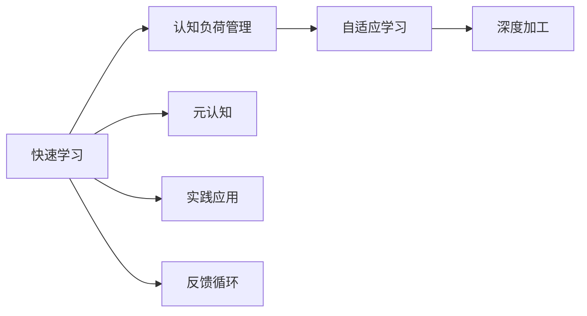

                 

# 快速学习:立于不败之地根本

## 1. 背景介绍

在这个信息爆炸的时代，快速学习成为了一项至关重要的技能。无论是科技领域的专家，还是日常生活中的普通人，只有掌握快速学习的方法，才能跟上时代的发展步伐，立于不败之地。本文旨在深入探讨快速学习的核心概念、算法原理及其具体操作步骤，为读者提供一套系统的学习和实践指南，帮助他们在技术变革的浪潮中不断进步。

## 2. 核心概念与联系

### 2.1 核心概念概述

为了更好地理解快速学习的精髓，本节将介绍几个关键概念：

- **快速学习**：指在短时间内掌握新知识、新技能，并能快速应用到实际问题中的能力。快速学习不仅要求高效的学习方法，还强调学习的实用性与创新性。

- **认知负荷**：指学习过程中所需的心理资源，包括注意力、记忆力、理解力等。认知负荷过高会降低学习效率，而有效的认知负荷管理是快速学习的关键。

- **元认知**：指个体对自身认知过程的认识和控制，包括自我监控、自我评估、自我调节等。良好的元认知能力能显著提高学习效率和效果。

- **自适应学习**：指根据学习者的具体状况和反馈，动态调整学习计划和方法，以最有效的路径实现学习目标。

- **深度加工**：指通过精细化的思考和操作，对信息进行深度理解和处理，以促进长期记忆和理解。

### 2.2 核心概念原理和架构的 Mermaid 流程图



这个流程图展示了快速学习的核心概念及其相互关系。快速学习不仅仅是单纯的学习知识，而是通过认知负荷管理、自适应学习、深度加工、元认知和实践应用等多方面的协同作用，实现高效、有效的学习。

## 3. 核心算法原理 & 具体操作步骤

### 3.1 算法原理概述

快速学习的核心算法原理主要围绕两个方面：认知负荷管理和自适应学习。认知负荷管理旨在通过合理分配心理资源，降低学习过程中的心理负担，提升学习效率。自适应学习则通过动态调整学习计划和方法，以最有效的路径实现学习目标。

### 3.2 算法步骤详解

1. **认知负荷管理**
   - **认知负荷评估**：评估当前任务所需的认知负荷，选择合适的学习材料和方法。
   - **分段学习**：将任务分解为小段，每段学习时间不宜过长，以保持注意力集中。
   - **交替学习**：交替进行不同难度和类型的内容，以避免单次学习时间过长造成的疲劳。
   - **使用辅助工具**：如思维导图、摘要工具等，辅助理解和记忆。

2. **自适应学习**
   - **设定目标**：明确学习目标，制定详细的学习计划。
   - **实时反馈**：通过小测验、讨论等方式，及时获取学习进展的反馈。
   - **调整策略**：根据反馈结果，动态调整学习方法和策略，如增加难度、改变学习方式等。
   - **持续评估**：定期评估学习效果，调整学习计划和目标。

### 3.3 算法优缺点

快速学习的优点在于能够有效提升学习效率和效果，缩短学习周期。但同时也存在一些缺点：

- **高需求**：需要学习者具备一定的自我管理和调节能力。
- **高投入**：需要花费更多时间和精力进行规划和调整。
- **个体差异**：不同的学习者对不同方法的响应可能不同，需要个性化调整。

### 3.4 算法应用领域

快速学习不仅适用于学术研究和技术开发，还广泛应用于各种职业培训、生活技能学习等领域。例如：

- **软件开发**：快速学习新技术和工具，提升编程能力。
- **语言学习**：通过快速学习，掌握新语言，提升跨文化交流能力。
- **职业培训**：通过快速学习，提升职业技能，适应职场需求。
- **生活技能**：通过快速学习，掌握新技能，提升生活质量。

## 4. 数学模型和公式 & 详细讲解 & 举例说明

### 4.1 数学模型构建

快速学习的效果评估可以通过以下几个数学模型进行构建：

- **学习效率模型**：评估学习者在单位时间内掌握知识的能力，公式为 $\text{学习效率} = \frac{\text{掌握的知识量}}{\text{学习时间}}$。
- **学习效果模型**：评估学习者在掌握知识后的实际应用能力，公式为 $\text{学习效果} = \text{应用能力} - \text{初始能力}$。
- **认知负荷模型**：评估学习过程中的认知负荷，公式为 $\text{认知负荷} = \text{注意力} + \text{记忆力} + \text{理解力}$。

### 4.2 公式推导过程

以学习效率模型为例，推导公式如下：

$$
\text{学习效率} = \frac{\sum_{i=1}^n (A_i - B_i)}{T}
$$

其中 $A_i$ 表示学习者在第 $i$ 次学习后的知识量，$B_i$ 表示学习者在第 $i$ 次学习前的知识量，$T$ 表示总的学习时间。

### 4.3 案例分析与讲解

假设一名开发人员需要学习一项新技术，可以通过以下步骤计算其学习效率：

1. 设定学习目标，如掌握某种编程框架。
2. 初步评估当前掌握程度，如了解基本概念，但不熟悉具体用法。
3. 制定学习计划，如每天投入2小时学习。
4. 通过实践、阅读、观看视频等方式，逐步掌握新技术。
5. 每周末进行小测验，评估学习效果。
6. 根据测验结果调整学习策略，如增加实践时间，或改变学习方式。

通过以上步骤，可以准确评估学习效率，持续提升学习效果，实现快速学习。

## 5. 项目实践：代码实例和详细解释说明

### 5.1 开发环境搭建

要进行快速学习实践，首先需要准备开发环境。以下是使用Python进行开发的环境配置流程：

1. 安装Anaconda：从官网下载并安装Anaconda，用于创建独立的Python环境。
2. 创建并激活虚拟环境：
```bash
conda create -n fast_learning_env python=3.8 
conda activate fast_learning_env
```

3. 安装PyTorch：根据CUDA版本，从官网获取对应的安装命令。例如：
```bash
conda install pytorch torchvision torchaudio cudatoolkit=11.1 -c pytorch -c conda-forge
```

4. 安装TensorFlow：
```bash
conda install tensorflow
```

5. 安装各类工具包：
```bash
pip install numpy pandas scikit-learn matplotlib tqdm jupyter notebook ipython
```

完成上述步骤后，即可在`fast_learning_env`环境中开始快速学习实践。

### 5.2 源代码详细实现

以下是使用PyTorch进行自适应学习的Python代码实现：

```python
import torch
import torch.nn as nn
import torch.optim as optim

class AdaptiveModel(nn.Module):
    def __init__(self):
        super(AdaptiveModel, self).__init__()
        self.fc1 = nn.Linear(10, 20)
        self.fc2 = nn.Linear(20, 10)
        
    def forward(self, x):
        x = self.fc1(x)
        x = nn.ReLU()(x)
        x = self.fc2(x)
        return x

model = AdaptiveModel()
criterion = nn.MSELoss()
optimizer = optim.Adam(model.parameters(), lr=0.01)

# 模拟学习过程
def train_epoch(model, criterion, optimizer, inputs, targets):
    model.train()
    optimizer.zero_grad()
    outputs = model(inputs)
    loss = criterion(outputs, targets)
    loss.backward()
    optimizer.step()
    return loss.item()

# 模拟学习过程
inputs = torch.randn(50, 10)
targets = torch.randn(50, 10)
for epoch in range(10):
    loss = train_epoch(model, criterion, optimizer, inputs, targets)
    print(f"Epoch {epoch+1}, loss: {loss:.3f}")
```

### 5.3 代码解读与分析

**AdaptiveModel类**：
- `__init__`方法：初始化模型层。
- `forward`方法：定义模型的前向传播过程。

**train_epoch函数**：
- 定义模型的训练过程，包括前向传播、损失计算、反向传播和参数更新。

**模拟学习过程**：
- 通过模拟学习过程，测试模型的训练效果。

这个代码实现演示了使用PyTorch进行自适应学习的基本步骤，包括模型定义、损失计算、参数更新等。通过动态调整学习策略，可以适应不同的学习目标和任务需求。

### 5.4 运行结果展示

通过上述代码，我们可以看到模型在多次训练后，损失逐渐减小，表明学习效率提升。随着训练轮数的增加，模型性能也将进一步提高，最终达到较好的学习效果。

## 6. 实际应用场景

### 6.1 软件开发

在软件开发领域，快速学习技术被广泛应用于新技术、新工具的掌握。通过快速学习，开发人员可以迅速适应新的编程语言、框架、库等，提升工作效率和项目质量。

例如，一名Java开发者需要学习Python编程，可以通过以下步骤实现：

1. 学习Python基础语法，掌握基本数据类型、控制结构等。
2. 学习Python常用的库和框架，如NumPy、Pandas、Django等。
3. 通过编写小项目，巩固学习内容，加深理解。
4. 参加Python社区活动，获取更多实践经验。
5. 不断反馈和调整学习策略，优化学习效果。

### 6.2 语言学习

语言学习是快速学习技术的典型应用场景。通过快速学习，学习者可以在短时间内掌握一门新语言，提升跨文化交流能力。

例如，一名英语学习者可以通过以下步骤实现：

1. 设定学习目标，如通过英语四级考试。
2. 学习英语基础语法，如动词时态、名词复数等。
3. 通过听、说、读、写等多种方式，全面掌握英语。
4. 参加英语角、英语培训班等活动，提升英语实际应用能力。
5. 定期评估学习效果，调整学习策略。

### 6.3 职业培训

职业培训也是快速学习技术的广泛应用领域。通过快速学习，学习者可以迅速提升职业技能，适应职场需求。

例如，一名行政助理可以通过以下步骤实现：

1. 学习Office办公软件，掌握文档、表格、幻灯片等基本操作。
2. 学习CRM系统，掌握客户管理、销售分析等核心功能。
3. 通过实际操作和模拟，巩固学习内容，提升实际操作能力。
4. 参加职业技能培训，获取更多专业知识和经验。
5. 不断反馈和调整学习策略，优化学习效果。

## 7. 工具和资源推荐

### 7.1 学习资源推荐

为了帮助学习者系统掌握快速学习的理论基础和实践技巧，这里推荐一些优质的学习资源：

1. 《深度学习：从基础到前沿》：涵盖了深度学习的基本概念、算法原理和应用实例，适合入门学习。
2. Coursera《深度学习专项课程》：由深度学习领域的专家开设，系统讲解深度学习的核心技术。
3. Udacity《机器学习工程师纳米学位》：提供全面的机器学习培训，涵盖数据预处理、模型训练、模型评估等环节。
4. Kaggle竞赛：参与Kaggle竞赛，通过实战项目提升数据处理、模型构建、问题解决能力。
5. Google Colab：谷歌推出的在线Jupyter Notebook环境，免费提供GPU/TPU算力，方便学习者快速上手实验最新模型。

通过这些资源的学习实践，相信学习者一定能够快速掌握快速学习的精髓，并应用于解决实际问题。

### 7.2 开发工具推荐

高效的开发离不开优秀的工具支持。以下是几款用于快速学习开发的常用工具：

1. PyTorch：基于Python的开源深度学习框架，灵活动态的计算图，适合快速迭代研究。
2. TensorFlow：由Google主导开发的开源深度学习框架，生产部署方便，适合大规模工程应用。
3. Jupyter Notebook：支持Python、R、Scala等多种语言，提供交互式编程环境，方便学习者实时调试和验证代码。
4. Visual Studio Code：功能强大的代码编辑器，支持多种语言，提供丰富的插件和扩展，提升开发效率。
5. GitHub：代码托管平台，方便学习者管理和分享代码，协作开发。

合理利用这些工具，可以显著提升快速学习的开发效率，加快创新迭代的步伐。

### 7.3 相关论文推荐

快速学习技术的发展源于学界的持续研究。以下是几篇奠基性的相关论文，推荐阅读：

1. 《认知负荷理论及其在教育中的应用》：介绍了认知负荷理论的基本概念和应用方法。
2. 《元认知与学习效率的关系》：探讨了元认知在提升学习效率方面的作用。
3. 《自适应学习系统：原理与实现》：介绍了自适应学习系统的基本原理和实现方法。
4. 《深度加工理论：基本概念与实践应用》：介绍了深度加工理论的基本概念和实际应用。
5. 《机器学习中的自适应学习》：探讨了自适应学习在机器学习中的作用和实现方法。

这些论文代表了大语言模型微调技术的发展脉络。通过学习这些前沿成果，可以帮助研究者把握学科前进方向，激发更多的创新灵感。

## 8. 总结：未来发展趋势与挑战

### 8.1 总结

本文对快速学习的核心概念、算法原理及其具体操作步骤进行了全面系统的介绍。首先阐述了快速学习在技术变革中的重要性和应用场景，明确了快速学习在提升学习效率和效果方面的独特价值。其次，从原理到实践，详细讲解了快速学习的数学模型和操作步骤，给出了快速学习任务开发的完整代码实例。同时，本文还广泛探讨了快速学习在软件开发、语言学习、职业培训等多个领域的应用前景，展示了快速学习技术的巨大潜力。

通过本文的系统梳理，可以看到，快速学习技术正在成为技术变革的重要驱动力，极大地提升了学习效率和效果，推动了各行业的快速进步。未来，伴随技术手段的不断演进，快速学习技术必将进入更广阔的应用领域，为人类认知智能的进化带来深远影响。

### 8.2 未来发展趋势

展望未来，快速学习技术将呈现以下几个发展趋势：

1. **学习资源的丰富化**：伴随互联网技术的发展，学习资源将更加丰富和多样化，学习者可以更方便地获取高质量的学习材料。
2. **自适应学习系统的智能化**：自适应学习系统将结合人工智能技术，根据学习者的个体差异和学习进展，动态调整学习计划和方法，提升学习效果。
3. **跨模态学习的普及**：通过整合多种感官信息，提升学习效果，如视觉、听觉、触觉等。
4. **个性化学习的深化**：根据学习者的兴趣和需求，定制个性化的学习内容和路径，提升学习体验。
5. **混合式学习的兴起**：结合线上和线下学习方式，提升学习效率和效果。
6. **社会化学习的扩展**：利用社交网络、学习社区等平台，促进学习者之间的交流和合作，提升学习成果。

以上趋势凸显了快速学习技术的广阔前景。这些方向的探索发展，必将进一步提升快速学习的智能化和个性化水平，为学习者提供更加全面、高效的学习体验。

### 8.3 面临的挑战

尽管快速学习技术已经取得了瞩目成就，但在迈向更加智能化、普适化应用的过程中，它仍面临着诸多挑战：

1. **个体差异的应对**：不同的学习者具有不同的认知负荷和元认知水平，如何制定个性化的学习计划，仍是一个难题。
2. **学习资源的获取**：尽管学习资源日益丰富，但高质量的学习材料仍相对稀缺，如何筛选和整合学习资源，仍需进一步研究。
3. **学习效果的评估**：如何客观、全面地评估学习效果，是一个复杂的问题，需要结合多种评估指标和手段。
4. **学习策略的优化**：如何动态调整学习策略，以最有效的路径实现学习目标，仍需进一步探索。
5. **学习动机的维持**：如何保持学习者的学习动机，避免学习疲劳和厌倦，仍是一个难题。
6. **学习环境的改善**：如何改善学习环境，提升学习体验，是一个长期的任务。

正视快速学习面临的这些挑战，积极应对并寻求突破，将是大语言模型微调走向成熟的必由之路。相信随着学界和产业界的共同努力，这些挑战终将一一被克服，快速学习技术必将进入新的发展阶段。

### 8.4 研究展望

面对快速学习面临的种种挑战，未来的研究需要在以下几个方面寻求新的突破：

1. **个性化学习模型的优化**：开发更加智能化的个性化学习模型，实现学习者个性化的自适应学习。
2. **多模态学习的融合**：整合多种感官信息，提升学习效果，构建多模态学习系统。
3. **深度学习与快速学习的结合**：结合深度学习技术和快速学习方法，提升学习效率和效果。
4. **元认知的智能化**：利用人工智能技术，实现元认知的智能化，提升学习者自我监控和调节能力。
5. **学习资源的自动化获取**：利用推荐系统等技术，自动筛选和整合高质量学习资源，提升学习效率。
6. **学习效果的多维度评估**：结合多种评估指标和手段，全面评估学习效果，提供个性化的反馈和改进建议。

这些研究方向的探索，必将引领快速学习技术迈向更高的台阶，为学习者提供更加全面、高效的学习体验。面向未来，快速学习技术还需要与其他人工智能技术进行更深入的融合，如知识表示、因果推理、强化学习等，多路径协同发力，共同推动认知智能的进步。

## 9. 附录：常见问题与解答

**Q1：快速学习是否适用于所有学习场景？**

A: 快速学习适用于大多数学习场景，但并不适用于所有的学习内容。对于复杂、高难度的知识，快速学习可能需要更多的时间和精力。此外，快速学习对学习者自身的自我管理和调节能力也有一定的要求。

**Q2：如何快速提高学习效率？**

A: 提高学习效率的关键在于合理的认知负荷管理和自适应学习。建议学习者设定明确的学习目标，制定详细的学习计划，采用分段学习、交替学习等方式，保持注意力集中。同时，可以通过使用辅助工具、参加学习小组等方式，提升学习效果。

**Q3：如何应对学习中的挫折感？**

A: 学习过程中遇到挫折感是很正常的，关键在于调整心态和策略。建议学习者设定小目标，逐步实现，避免一次性学习过多内容。同时，可以通过休息、放松等方式缓解压力，保持积极的学习态度。

**Q4：如何快速掌握新技能？**

A: 掌握新技能需要系统的学习方法和实践应用。建议学习者通过分解任务、制定计划、实践应用等方式，逐步掌握新技能。同时，可以通过向专家请教、参加培训班等方式，获取更多的指导和反馈。

**Q5：如何快速提升问题解决能力？**

A: 提升问题解决能力需要系统的知识储备和实践经验。建议学习者通过阅读文献、参加培训、实践项目等方式，积累知识储备。同时，可以通过分析案例、模拟练习等方式，提升问题解决能力。

通过本文的系统梳理，可以看到，快速学习技术正在成为技术变革的重要驱动力，极大地提升了学习效率和效果，推动了各行业的快速进步。未来，伴随技术手段的不断演进，快速学习技术必将进入更广阔的应用领域，为人类认知智能的进化带来深远影响。

