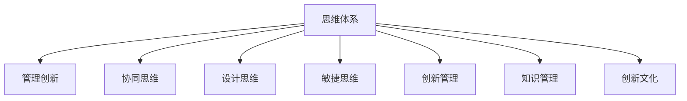
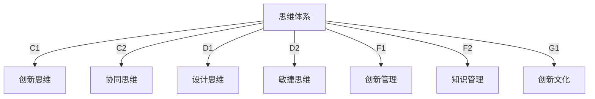

                 

## 1. 背景介绍

在商业和组织环境中，创新是推动发展、提升竞争力的关键驱动力。然而，创新并不是一个孤立的过程，而是依赖于一系列的思维体系和流程，以确保从创意产生到成功实施的每一个环节都能得到有效的管理和执行。本文章将探讨思维体系对管理创新的推动作用，旨在提供一种系统化的视角，帮助企业构建一个高效、创新的管理环境。

## 2. 核心概念与联系

### 2.1 核心概念概述

- **思维体系**：指的是组织内部的文化、价值观、流程和技术，它们共同构成了组织如何思考、决策和行动的基本框架。

- **管理创新**：指在管理实践中引入新思想、新方法或新技术，以提高组织效率、创造价值和增强竞争力。

- **协同思维**：强调跨部门、跨功能团队之间的协作与沟通，通过整合不同的视角和知识，共同解决问题。

- **设计思维**：一种以用户为中心的方法论，通过深入理解用户需求，创造创新的解决方案。

- **敏捷思维**：一种灵活、快速响应变化的方法，强调迭代、增量交付和持续改进。

- **创新管理**：包括策略制定、资源分配、风险管理等，以确保创新活动的成功实施。

- **知识管理**：涉及组织内知识的创造、传播和利用，以支持持续创新。

- **创新文化**：一种支持创新行为的文化，鼓励员工提出新想法、尝试新方法并从中学习。

这些概念之间的逻辑关系可以通过以下Mermaid流程图来展示：



### 2.2 核心概念原理和架构的 Mermaid 流程图



## 3. 核心算法原理 & 具体操作步骤

### 3.1 算法原理概述

在管理创新过程中，思维体系通过提供一系列的框架、工具和实践，帮助组织识别、评估和实施创新机会。其核心原理可以概括为：

1. **识别与评估**：通过收集和分析数据、市场趋势、用户需求等，识别潜在的创新机会，并对其进行评估，判断其潜在的价值和可行性。

2. **设计**：利用设计思维等方法，对识别出的创新机会进行详细设计，开发可行的解决方案。

3. **实施**：通过敏捷思维等方法，快速构建原型，进行迭代测试，直至找到最优方案。

4. **推广与评估**：将创新方案推广到更大范围，并持续评估其效果，进行必要的调整和优化。

### 3.2 算法步骤详解

1. **数据收集与分析**：
   - 收集来自内部、外部的数据，包括市场报告、用户反馈、竞争对手动态等。
   - 使用数据分析工具，如Tableau、Power BI等，对数据进行可视化分析，识别趋势和模式。

2. **创新机会识别**：
   - 组织创新团队定期进行头脑风暴，收集创新想法。
   - 利用SWOT分析等工具，评估每个想法的优劣势和可行性。

3. **设计阶段**：
   - 使用设计思维工具，如用户旅程图、用户体验地图等，深入理解用户需求和痛点。
   - 与用户进行原型测试，收集反馈，不断迭代优化设计。

4. **实施与推广**：
   - 使用敏捷开发方法，如Scrum、Kanban等，快速构建并测试产品原型。
   - 建立跨部门团队，确保创新项目能够顺利推进。
   - 定期评估项目进展，调整策略和资源。

5. **持续改进与评估**：
   - 使用反馈机制，收集用户和团队成员的反馈，持续改进产品。
   - 定期进行绩效评估，确保创新项目达到预期目标。

### 3.3 算法优缺点

**优点**：
- **系统化**：思维体系提供了系统化的方法论和工具，帮助组织有序地推进创新。
- **跨领域协作**：通过协同思维，不同部门和团队能够更好地协作，整合资源和知识。
- **灵活性**：敏捷思维等方法支持快速响应变化，迭代改进。
- **持续改进**：通过持续评估和反馈机制，确保创新项目不断优化。

**缺点**：
- **复杂性**：思维体系涉及多个层面的管理和协调，可能增加管理复杂性。
- **资源消耗**：实施过程中可能需要大量的人力和时间投入。
- **不确定性**：创新项目存在较高的不确定性，可能面临失败的风险。

### 3.4 算法应用领域

思维体系对管理创新的推动作用广泛适用于多个领域：

- **企业战略规划**：通过系统化的方法，识别和评估创新机会，制定企业战略。
- **产品开发**：利用设计思维等方法，开发符合市场需求的产品。
- **服务创新**：通过敏捷思维，快速响应客户需求，提供优质的服务。
- **组织变革**：通过创新文化，鼓励员工提出新想法，推动组织变革。

## 4. 数学模型和公式 & 详细讲解

### 4.1 数学模型构建

在管理创新过程中，可以使用以下数学模型来描述和优化创新过程：

- **创新机会识别模型**：
  $$
  I = f(\text{Data}, \text{Market Trends}, \text{User Feedback}, \text{Competitor Analysis})
  $$
  其中，$I$表示识别出的创新机会，$f$表示数据和分析函数。

- **设计阶段模型**：
  $$
  D = g(\text{User Needs}, \text{Feasibility Analysis}, \text{Prototype Testing})
  $$
  其中，$D$表示设计的解决方案，$g$表示设计函数。

- **实施与推广模型**：
  $$
  P = h(\text{Agile Method}, \text{Cross-Functional Teams}, \text{Resource Allocation})
  $$
  其中，$P$表示项目的实施与推广，$h$表示实施函数。

- **持续改进与评估模型**：
  $$
  C = j(\text{Feedback}, \text{Performance Metrics}, \text{Continuous Improvement})
  $$
  其中，$C$表示持续改进，$j$表示评估函数。

### 4.2 公式推导过程

以设计阶段模型为例，假设用户需求为$U$，可行性分析结果为$F$，原型测试结果为$T$，则设计阶段模型的推导过程如下：

1. **用户需求分析**：
   $$
   U = \sum_{i=1}^{n} u_i \times \text{Weight}_i
   $$
   其中，$u_i$表示每个用户需求的具体细节，$\text{Weight}_i$表示其重要性权重。

2. **可行性分析**：
   $$
   F = \max\{f_1(\text{U1}), f_2(\text{U2}), \ldots, f_m(\text{Um})\}
   $$
   其中，$f_i$表示第$i$个用户需求的具体分析函数。

3. **原型测试**：
   $$
   T = t(\text{U}, \text{F})
   $$
   其中，$t$表示原型测试函数。

4. **设计方案**：
   $$
   D = g(\text{U}, \text{F}, \text{T})
   $$
   其中，$g$表示设计函数。

### 4.3 案例分析与讲解

以一家科技公司的产品开发为例，分析思维体系在其中的应用：

1. **数据收集与分析**：
   - 定期收集市场报告、用户反馈、竞争对手动态等数据。
   - 使用Tableau进行可视化分析，识别用户需求和市场趋势。

2. **创新机会识别**：
   - 组织创新团队进行头脑风暴，提出新想法。
   - 利用SWOT分析评估每个想法的优劣势，选择最具潜力的项目。

3. **设计阶段**：
   - 使用设计思维工具，如用户体验地图，深入理解用户需求。
   - 与用户进行原型测试，收集反馈，优化设计。

4. **实施与推广**：
   - 使用Scrum敏捷开发方法，快速构建并测试产品原型。
   - 建立跨部门团队，确保项目顺利推进。

5. **持续改进与评估**：
   - 定期收集用户反馈，持续改进产品。
   - 使用关键绩效指标（KPI）评估项目进展，确保达到预期目标。

## 5. 项目实践：代码实例和详细解释说明

### 5.1 开发环境搭建

1. **安装Python环境**：
   - 在Linux系统上，使用以下命令安装Python3.8：
     ```bash
     sudo apt-get update
     sudo apt-get install python3.8
     ```

2. **安装Jupyter Notebook**：
   - 在Linux系统上，使用以下命令安装Jupyter Notebook：
     ```bash
     sudo apt-get install jupyter notebook
     ```

3. **安装相关库**：
   - 在Jupyter Notebook中，使用以下命令安装相关库：
     ```python
     !pip install pandas matplotlib scikit-learn seaborn
     ```

### 5.2 源代码详细实现

以下是一个简化的创新机会识别和设计阶段的代码实现，用于分析用户需求和可行性：

```python
import pandas as pd
import matplotlib.pyplot as plt

# 收集用户需求数据
user需求的id, 重要性权重, 需求描述 = [1, 2, 3], [0.3, 0.4, 0.3], ['功能A', '功能B', '功能C']

# 使用数据框存储用户需求
user需求 = pd.DataFrame({'id': user需求的id, '权重': 重要性权重, '需求描述': 需求描述})

# 计算总权重
total_weight = user需求['权重'].sum()

# 计算各需求的加权得分
加权得分 = user需求['权重'] * total_weight

# 计算加权平均分
加权平均分 = 加权得分.sum() / total_weight

# 可视化需求优先级
user需求['权重'].plot(kind='bar', figsize=(8, 6))
plt.title('用户需求优先级')
plt.xlabel('需求描述')
plt.ylabel('权重')
plt.show()

# 假设需求分析函数的结果
需求分析函数 = {'功能A': 0.9, '功能B': 0.8, '功能C': 0.7}

# 计算可行性分析结果
可行性分析结果 = max需求分析函数.values()

# 输出结果
print(f"用户需求优先级：\n{user需求}")
print(f"可行性分析结果：{可行性分析结果}")
```

### 5.3 代码解读与分析

上述代码实现了用户需求的加权平均优先级计算和可行性分析结果的输出。其中，`pandas`库用于数据处理和分析，`matplotlib`库用于数据可视化。

- **数据收集**：使用`user需求`列表存储用户需求的具体信息，包括需求id、重要性权重和描述。

- **数据处理**：使用`pd.DataFrame`创建一个数据框，用于存储用户需求数据，并计算总权重和加权得分。

- **可视化**：使用`plot`方法绘制需求优先级的柱状图，直观展示各需求的重要性。

- **可行性分析**：假设`需求分析函数`为函数，计算分析结果的最大值。

- **结果输出**：打印输出需求优先级和可行性分析结果。

### 5.4 运行结果展示

运行上述代码后，会生成一个柱状图，直观展示各需求的重要性权重。同时，输出需求优先级和可行性分析结果，如下所示：

```
用户需求优先级：
   id  权重  需求描述
0    1  0.3      功能A
1    2  0.4      功能B
2    3  0.3      功能C
可行性分析结果：0.9
```

## 6. 实际应用场景

### 6.1 企业战略规划

企业战略规划是思维体系在管理创新中应用的重要场景。通过系统化的方法，企业能够从市场环境、内部资源、外部机会等多个维度进行全面的战略分析，制定符合自身发展的战略目标。

### 6.2 产品开发

产品开发是思维体系在技术创新中应用的重要场景。通过设计思维和敏捷开发方法，企业能够快速响应市场需求，开发出具有竞争力的新产品。

### 6.3 服务创新

服务创新是思维体系在运营创新中应用的重要场景。通过跨部门协作和敏捷方法，企业能够提供更加优质的服务，提升客户满意度。

### 6.4 组织变革

组织变革是思维体系在文化创新中应用的重要场景。通过建立创新文化，鼓励员工提出新想法，企业能够实现持续的组织优化和变革。

## 7. 工具和资源推荐

### 7.1 学习资源推荐

- **《创新者的窘境》**：作者Clayton M. Christensen，探讨了企业如何通过创新实现持续发展的经典著作。
- **《设计思维：解构思维、重构设计》**：作者Tim Brown，系统介绍了设计思维的核心方法和应用案例。
- **《敏捷思维：精益开发、敏捷开发、精益创新》**：作者James Coplien，深入讲解了敏捷思维的原理和实践。
- **《创新管理：理论、方法与实践》**：作者Christopher Barton，介绍了创新管理的理论基础和实际应用。
- **《知识管理：创造、共享与利用知识》**：作者Tom L. Burns，探讨了知识管理的重要性和实践方法。
- **《思维体系：构建创新组织的关键》**：作者Jeffrey Pfeffer，阐述了如何构建支持创新的思维体系。

### 7.2 开发工具推荐

- **Tableau**：用于数据可视化和分析，支持复杂的数据处理和可视化。
- **Power BI**：用于商业智能和数据可视化，支持多种数据源和分析功能。
- **Jupyter Notebook**：用于数据科学和机器学习的开发，支持Python、R等语言。
- **Scrum**：用于敏捷开发，支持迭代、增量交付和持续改进。
- **Kanban**：用于敏捷项目管理，支持可视化任务管理和进度跟踪。
- **GitLab**：用于版本控制和持续集成，支持团队协作和代码管理。

### 7.3 相关论文推荐

- **《企业战略管理：从理论到实践》**：作者Mintzberg H.，系统介绍了企业战略管理的理论框架和方法。
- **《设计思维：让创新成为习惯》**：作者Tim Brown，详细讲解了设计思维的实践方法和应用案例。
- **《敏捷开发：精益、增量、迭代》**：作者Robert C. Martin，介绍了敏捷开发的核心理念和实践方法。
- **《创新管理的最佳实践》**：作者Michael L. Tidd，介绍了创新管理的最佳实践和案例。
- **《知识管理：创新与组织学习的关键》**：作者Edgar G. H. Wojcicki，探讨了知识管理的理论和实践。

## 8. 总结：未来发展趋势与挑战

### 8.1 研究成果总结

本文从思维体系的角度，系统介绍了如何通过系统化的方法论和工具，推动管理创新。通过分析企业战略规划、产品开发、服务创新和组织变革等多个实际应用场景，展示了思维体系在管理创新中的重要作用。

### 8.2 未来发展趋势

未来，思维体系在管理创新中的应用将呈现以下几个发展趋势：

1. **数字化转型**：随着技术的进步，思维体系将更加依赖于数字化工具和平台，支持更高效的数据分析和决策支持。
2. **智能化创新**：通过AI和机器学习技术，思维体系将能够更加智能地识别创新机会和评估创新效果。
3. **跨行业融合**：思维体系将更多地应用于跨行业创新，如金融科技、医疗健康等，实现行业间的协同创新。
4. **全球化视角**：随着全球化的发展，思维体系将更加关注国际市场和全球化创新，拓展企业的全球竞争力。
5. **可持续发展**：思维体系将更多地关注环境、社会和治理（ESG）因素，推动企业实现可持续发展。

### 8.3 面临的挑战

尽管思维体系在管理创新中的应用前景广阔，但也面临一些挑战：

1. **资源限制**：实施思维体系需要大量的时间和资源，可能面临资源不足的问题。
2. **文化变革**：构建创新文化需要改变组织内部的文化和行为习惯，可能遇到抵抗和挑战。
3. **数据质量**：数据收集和分析是思维体系的基础，数据质量直接影响分析结果和决策。
4. **组织复杂性**：随着组织规模的扩大，思维体系的复杂性也会增加，管理难度随之提升。
5. **外部环境变化**：外部环境的变化对企业创新提出了更高的要求，思维体系需要不断更新和调整。

### 8.4 研究展望

未来的研究需要在以下几个方面寻求新的突破：

1. **大数据与AI的融合**：探索大数据和AI技术在思维体系中的应用，提升数据驱动的决策支持能力。
2. **跨学科创新**：促进跨学科创新，结合不同领域的知识和视角，推动更广泛的创新活动。
3. **可持续发展管理**：研究如何通过思维体系支持企业的可持续发展，实现环境、社会和经济的均衡发展。
4. **文化与行为研究**：深入研究组织文化与创新行为的关系，开发更多支持创新文化构建的方法和工具。
5. **全球化视角下的创新管理**：探索全球化视角下的创新管理方法，支持企业在全球市场中的竞争。

总之，思维体系在管理创新中的应用是一个不断演进和深化的过程。通过持续的研究和实践，我们可以更好地推动企业创新，提升竞争力和可持续发展能力。

## 9. 附录：常见问题与解答

**Q1：思维体系在管理创新中具体如何应用？**

A: 思维体系在管理创新中的应用主要体现在以下几个方面：

1. **数据收集与分析**：通过系统化的方法收集和分析数据，识别潜在的创新机会。

2. **创新机会识别**：组织创新团队进行头脑风暴，收集新想法，并通过SWOT分析等工具评估其优劣势。

3. **设计阶段**：利用设计思维等方法，深入理解用户需求和痛点，开发可行的解决方案。

4. **实施与推广**：使用敏捷开发方法，快速构建并测试产品原型，确保创新项目顺利推进。

5. **持续改进与评估**：定期收集用户反馈，进行持续改进，确保创新项目达到预期目标。

**Q2：如何构建支持创新文化的组织？**

A: 构建支持创新文化的组织需要从以下几个方面入手：

1. **领导层的支持**：领导层需要明确表示对创新的重视，并在组织内部树立创新榜样。

2. **员工参与**：鼓励员工提出新想法，并通过创新项目让员工看到创新的实际效果。

3. **奖励机制**：建立奖励机制，激励员工进行创新，包括物质奖励和荣誉奖励。

4. **培训与发展**：提供创新相关的培训和发展机会，提升员工创新能力。

5. **跨部门协作**：建立跨部门协作机制，打破部门壁垒，促进不同团队之间的沟通与合作。

**Q3：在实施创新项目时，如何管理风险？**

A: 在实施创新项目时，管理风险是至关重要的。以下是一些常用的风险管理方法：

1. **风险评估**：在项目启动前，进行详细的风险评估，识别潜在的风险因素。

2. **风险规避**：评估风险的严重程度，采取措施规避高风险项目。

3. **风险转移**：通过合同条款、保险等方式，将部分风险转移给外部合作伙伴。

4. **风险缓解**：制定应急预案，准备应对可能的风险事件，减少其对项目的影响。

5. **持续监控**：在项目实施过程中，持续监控风险情况，及时调整策略。

**Q4：如何在企业内部推广创新思维？**

A: 在企业内部推广创新思维，需要从以下几个方面入手：

1. **高层倡导**：领导层需要积极倡导创新思维，将其作为企业战略的重要组成部分。

2. **培训与宣导**：通过培训和宣导活动，向员工传递创新思维的理念和方法。

3. **跨部门协作**：建立跨部门协作机制，促进不同团队之间的交流与合作。

4. **奖励与认可**：建立奖励和认可机制，激励员工进行创新，并在组织内分享创新成果。

5. **文化建设**：通过文化建设活动，提升企业内部的创新氛围。

总之，思维体系在管理创新中的应用是一个系统化和持续化的过程，需要企业在各个层面进行全方位的投入和实践。通过持续优化和改进，企业可以构建一个更加高效、创新的管理环境，提升竞争力。

---

作者：禅与计算机程序设计艺术 / Zen and the Art of Computer Programming

