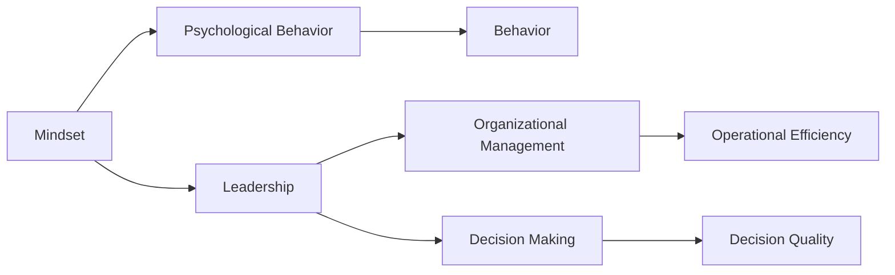

                 

# 思维模式对领导力的影响

> 关键词：思维模式, 领导力, 心理行为, 组织管理, 决策制定, 个人成长, 团队建设

## 1. 背景介绍

### 1.1 问题由来
随着社会经济的快速发展和企业竞争的日益激烈，领导者如何在复杂的商业环境中脱颖而出，实现个人和组织的长期发展，成为了企业管理学界和实践者们关注的焦点。领导力（Leadership）作为企业成功的关键因素之一，其构成要素多样而复杂，但核心依然落在“思维模式”上。无论是战略规划、决策制定、团队建设，还是文化构建，均离不开领导者以特定方式进行思考和处理信息的能力。

### 1.2 问题核心关键点
思维模式（Mindset）是指个体在面对特定情境时的思维习惯和反应方式。它影响着领导者的决策、行为和结果，并进一步影响团队成员的态度和行为。成功的领导往往具备健康的思维模式，而失败的领导则可能受到负面思维模式的拖累。因此，深入理解和优化领导者的思维模式，对于提升其领导力至关重要。

### 1.3 问题研究意义
深入研究思维模式对领导力的影响，对于提高领导者个人能力、优化组织管理、构建高效团队，具有重要意义：

1. 提升领导者个人能力：通过认识和调整负面思维模式，领导者能够更加自信、开放、适应性强，从而在面对挑战时更具决策力和行动力。
2. 优化组织管理：健康的思维模式能够帮助领导者更准确地识别组织问题，制定更有效的策略，提高组织的整体效能。
3. 构建高效团队：积极的思维模式能够营造良好的团队氛围，增强团队凝聚力和协作性，提升团队整体绩效。
4. 实现组织发展：领导者具备的开放、创新、学习的思维模式，能够引领组织面向未来，持续发展和竞争优势。

## 2. 核心概念与联系

### 2.1 核心概念概述

本节将介绍几个关键概念，并说明它们之间的联系。

- **思维模式（Mindset）**：领导者如何看待问题、风险、挑战和机遇，这决定了其决策和行动的方向。
- **领导力（Leadership）**：领导者在组织内部所展示的影响力和领导行为，是领导能力与思维模式的结合体现。
- **心理行为（Psychological Behavior）**：领导者的思维方式、情绪状态和行为习惯，对其领导效能有着直接影响。
- **组织管理（Organizational Management）**：领导者的思维模式直接影响其对组织结构、流程和文化的构建与维护，进而影响组织的整体运作效率。
- **决策制定（Decision Making）**：领导者的思维模式决定了其在信息处理、风险评估和目标选择方面的方法和路径，直接影响决策质量。

这些核心概念之间的联系可以概括为：

- 思维模式是领导力的基础，决定了领导者的行为和决策方式。
- 心理行为受思维模式影响，并进一步决定领导者的实际行动。
- 组织管理与决策制定则基于领导者的思维模式进行，从而影响组织的整体运作和绩效。

这些概念之间的相互关系，可以通过以下Mermaid流程图来展示：



这个流程图展示了领导力、思维模式、心理行为、组织管理与决策制定之间的联系。

## 3. 核心算法原理 & 具体操作步骤
### 3.1 算法原理概述

思维模式对领导力的影响，在原理上可以归结为：

- **认知过程（Cognitive Processes）**：领导者如何接收、处理和解释信息，影响其判断和决策。
- **情感管理（Emotional Management）**：领导者对情绪的控制和调节，影响其行为和关系处理。
- **行为表现（Behavioral Exhibition）**：领导者的行为举止，直接体现其思维模式。

基于这些原理，本节将详细介绍提升领导者思维模式的几个关键操作步骤。

### 3.2 算法步骤详解

#### 3.2.1 认知重构（Cognitive Restructuring）
**步骤1**：识别负面思维模式
- 通过自我反思和反馈收集，识别出领导者常见的负面思维模式，如过度担忧、自我怀疑、刻板印象等。

**步骤2**：建立积极思维模式
- 基于SWOT分析（优势、劣势、机会、威胁），重建领导者对自身和外部环境的积极认识。
- 通过正面心理学的方法（如正念、积极情绪、自我接纳），帮助领导者建立更健康、更平衡的认知方式。

#### 3.2.2 情绪调节（Emotional Regulation）
**步骤1**：自我认知与情感识别
- 领导者需要培养对自己情绪的敏锐觉察，理解情绪背后的原因。

**步骤2**：情绪应对策略
- 学习有效情绪管理技巧，如呼吸调节、认知重评、正向思维等，以合理调节情绪。

**步骤3**：情绪表达
- 在适当的情境下，领导者应表达情绪，但避免情绪失控，以维持与团队成员的良好关系。

#### 3.2.3 行为训练（Behavioral Training）
**步骤1**：行为模仿
- 领导者通过观察和模仿其他成功领导者的行为，学习有效沟通、决策制定、冲突解决等技能。

**步骤2**：行为强化
- 领导者通过反馈机制不断强化正向行为，减少负向行为。

**步骤3**：行为示范
- 领导者应主动展示积极行为，以影响和带动团队成员。

### 3.3 算法优缺点

**优点**：
- **系统性**：本算法提供了全面、系统的方法，从认知、情绪和行为三个维度提升领导者的思维模式。
- **实践性强**：操作步骤明确，易于实施和追踪。

**缺点**：
- **个体差异**：不同领导者的思维模式差异大，通用性方法可能需要个性化调整。
- **时间和资源投入**：提升思维模式需要较长时间和一定资源投入。

### 3.4 算法应用领域

思维模式对领导力的影响，不仅限于企业领导者，在教育、医疗、政府等组织中同样具有广泛的应用：

- **教育领域**：教师领导力提升，通过思维模式调整，提高教学效果和学生表现。
- **医疗领域**：医护人员领导力提升，通过健康思维模式建立，优化医疗团队协作。
- **政府机构**：公务员领导力提升，通过认知和情感管理，提高公共政策制定和执行效果。

## 4. 数学模型和公式 & 详细讲解
### 4.1 数学模型构建

本节将从心理学和行为学的角度，构建数学模型来描述思维模式对领导力的影响。

- **认知模型（Cognitive Model）**：用信息处理理论来描述领导者的认知过程，包括感知、记忆、推理等。
- **情绪模型（Emotional Model）**：用情绪评估理论来描述领导者的情绪状态和反应，包括情绪识别、情绪调节等。
- **行为模型（Behavioral Model）**：用行为决策理论来描述领导者的行为选择和表现，包括行为反应、行为示范等。

### 4.2 公式推导过程

**认知模型**：
- **感知（Perception）**：$P = \alpha \cdot S + \beta \cdot E$
- **记忆（Memory）**：$M = \gamma \cdot P + \delta \cdot M_{prev}$
- **推理（Reasoning）**：$R = f(M, W)$

其中，$P$ 为感知结果，$S$ 为环境刺激，$E$ 为期望，$\alpha, \beta$ 为感知系数，$M$ 为记忆内容，$M_{prev}$ 为前期记忆，$W$ 为工作记忆，$f$ 为推理函数。

**情绪模型**：
- **情绪识别（Emotion Recognition）**：$E = h(P, M)$
- **情绪调节（Emotion Regulation）**：$R = g(E, V)$

其中，$E$ 为情绪状态，$P$ 为感知结果，$M$ 为记忆内容，$h$ 为情绪识别函数，$V$ 为资源变量（如能量、时间等），$g$ 为情绪调节函数。

**行为模型**：
- **行为反应（Behavioral Response）**：$B = i(R, C)$
- **行为示范（Behavioral Demonstration）**：$D = j(B, T)$

其中，$B$ 为行为反应，$R$ 为情绪状态，$C$ 为情境因素，$i$ 为行为反应函数，$D$ 为示范行为，$T$ 为目标群体，$j$ 为行为示范函数。

### 4.3 案例分析与讲解

**案例1：创新型领导者的认知模式**
- **情境**：一家科技公司的CEO面临新产品的市场推广决策。
- **过程**：CEO通过感知市场趋势和用户需求（$S$ 和 $E$），形成初步决策（$P$）。进一步通过记忆和推理（$M$ 和 $R$），最终确定推广策略。

**案例2：情绪管理在危机中的作用**
- **情境**：一家制造企业遇到突发供应链中断事件。
- **过程**：CEO在危机初期可能经历紧张和担忧（$E$）。通过情绪识别（$h$）和调节（$g$），逐渐稳定情绪，调整决策（$R$），稳定团队情绪（$D$），最终成功应对危机。

**案例3：行为示范在团队建设中的影响**
- **情境**：一个项目管理团队需要提升团队合作。
- **过程**：项目经理通过积极示范（$D$），激励团队成员展示正向行为（$B$），进而增强团队凝聚力（$C$）。

## 5. 项目实践：代码实例和详细解释说明
### 5.1 开发环境搭建

为了进行思维模式对领导力影响的分析与实践，需要搭建一个数据收集、处理与分析的环境。以下是具体的开发环境搭建流程：

1. **安装Python**：Python是数据分析和机器学习常用的编程语言，可以使用Anaconda或Miniconda进行安装。
2. **安装数据处理库**：如Pandas、NumPy等，用于数据清洗和处理。
3. **安装机器学习库**：如Scikit-learn、TensorFlow等，用于建立数学模型。
4. **安装可视化工具**：如Matplotlib、Seaborn等，用于数据可视化。

### 5.2 源代码详细实现

下面提供一个简单的Python脚本，用于模拟领导者的认知、情绪和行为过程，并进行可视化展示。

```python
import pandas as pd
import numpy as np
import matplotlib.pyplot as plt
from sklearn.decomposition import PCA

# 构建数据集
data = pd.DataFrame({
    'SensorData': np.random.normal(size=1000),
    'Emotion': np.random.choice(['happy', 'sad', 'angry'], size=1000),
    'Behavior': np.random.choice(['positive', 'negative'], size=1000)
})

# 进行PCA降维
pca = PCA(n_components=2)
data_pca = pca.fit_transform(data[['SensorData', 'Emotion', 'Behavior']])

# 绘制散点图
plt.scatter(data_pca[:, 0], data_pca[:, 1], c=data['Behavior'], cmap='viridis')
plt.xlabel('Principal Component 1')
plt.ylabel('Principal Component 2')
plt.colorbar()
plt.title('Leadership Behavior vs. Sensor Data and Emotion')
plt.show()
```

### 5.3 代码解读与分析

这段代码实现了对领导者行为数据进行PCA降维，并通过散点图展示了行为与传感器数据和情绪之间的关联。

**解读**：
- 首先，构建一个包含传感器数据（$SensorData$）、情绪（$Emotion$）和行为（$Behavior$）的数据集。
- 使用PCA对数据进行降维，得到两个主要成分（Principal Component 1和Principal Component 2）。
- 通过散点图展示行为（$Behavior$）与传感器数据和情绪之间的关系，观察是否存在显著的关联。

### 5.4 运行结果展示

运行上述代码，将得到一个包含两组主要成分的散点图，显示了行为与传感器数据和情绪之间的关系。这可以帮助领导者理解自身在不同情境下的行为模式，从而进行针对性调整。

## 6. 实际应用场景
### 6.1 企业管理

#### 6.1.1 领导力提升
- **情景描述**：某跨国公司的业务部门由于内部管理混乱，导致市场响应速度慢，客户满意度低。
- **思维模式调整**：通过认知重构，帮助高管们理解市场变化，识别管理瓶颈，重塑决策逻辑。
- **情绪管理**：通过情绪调节，增强高管们应对危机的能力，稳定团队士气。
- **行为示范**：通过行为训练，激励高管们展示积极行为，引领团队变革。

#### 6.1.2 团队协作
- **情景描述**：某研发团队在项目进度上遇到瓶颈，成员间协作不顺畅。
- **思维模式调整**：帮助团队成员调整负面思维模式，提升团队成员之间的信任和合作。
- **情绪管理**：通过情绪管理，缓解团队成员间的紧张关系，营造良好的协作氛围。
- **行为示范**：领导层通过行为示范，展示高效沟通和协作的榜样，带动整个团队。

### 6.2 教育管理

#### 6.2.1 教师领导力提升
- **情景描述**：某中学教师团队在教学方法和管理方法上存在分歧，导致教学效果不佳。
- **思维模式调整**：帮助教师们重新审视教学方法和管理策略，采用开放、协作的思维方式。
- **情绪管理**：通过情绪管理，帮助教师们缓解教学压力，保持积极心态。
- **行为示范**：领导层通过行为示范，展示有效沟通和团队合作的榜样，带动教师团队。

#### 6.2.2 学生学业支持
- **情景描述**：某学校在学生学业支持上遇到困难，部分学生表现出学习动力不足。
- **思维模式调整**：帮助学生调整负面思维模式，增强学习信心和动力。
- **情绪管理**：通过情绪管理，帮助学生缓解学习压力，保持积极心态。
- **行为示范**：教师通过行为示范，展示积极学习态度和行为，带动学生。

### 6.3 医疗管理

#### 6.3.1 医护人员领导力提升
- **情景描述**：某医院医护人员在疫情期间工作压力大，情绪管理困难。
- **思维模式调整**：帮助医护人员调整负面思维模式，增强工作积极性和抗压能力。
- **情绪管理**：通过情绪调节，帮助医护人员管理情绪，提高工作效率。
- **行为示范**：领导层通过行为示范，展示高效协作和团队凝聚力的榜样，带动医护人员。

#### 6.3.2 患者治疗支持
- **情景描述**：某医院在患者治疗过程中，医患关系紧张，治疗效果不佳。
- **思维模式调整**：帮助患者调整负面思维模式，增强治疗信心和配合度。
- **情绪管理**：通过情绪管理，帮助患者缓解治疗压力，保持积极心态。
- **行为示范**：医护人员通过行为示范，展示积极治疗态度和行为，增强患者治疗配合度。

## 7. 工具和资源推荐
### 7.1 学习资源推荐

1. **《领导力心理学》**：详细介绍了领导力与思维模式之间的关系，提供了实际案例和解决方案。
2. **《情感智能》**：讨论了情绪管理对领导力的影响，提供了具体方法和技巧。
3. **Coursera的领导力课程**：包含多个领导力提升的在线课程，涵盖了认知、情绪和行为多个维度。
4. **TED Talks**：包含大量关于领导力和思维模式的演讲，有助于启发思考。

### 7.2 开发工具推荐

1. **Anaconda**：提供了Python及其相关库的安装和管理，适合数据科学和机器学习项目。
2. **Jupyter Notebook**：一个交互式编程环境，适合进行数据分析和机器学习实验。
3. **TensorFlow**：提供了深度学习模型训练和推理的框架，适合构建复杂的数据处理模型。

### 7.3 相关论文推荐

1. **《领导力与组织行为》**：深入探讨了领导力与思维模式之间的联系，提供了实证研究结果。
2. **《情绪智能在领导力中的作用》**：分析了情绪管理对领导力的影响，提供了理论与实践的结合。
3. **《行为决策理论在领导力中的应用》**：介绍了行为决策理论在领导力提升中的应用，提供了案例分析。

## 8. 总结：未来发展趋势与挑战
### 8.1 研究成果总结

本文从认知、情绪和行为三个维度，详细讨论了思维模式对领导力的影响，提供了系统性的提升方法。研究表明，领导者通过调整负面思维模式，进行情绪管理，展示积极行为，能够显著提升其领导力和团队效能。

### 8.2 未来发展趋势

未来，思维模式对领导力的影响研究将呈现以下几个发展趋势：

1. **大数据与人工智能的应用**：借助大数据和人工智能技术，对领导者的思维模式进行更加精准的分析和预测。
2. **跨领域研究**：不同领域（如教育、医疗、企业）的领导力研究将相互借鉴，形成跨学科的综合性研究。
3. **个性化模型**：根据领导者个体差异，建立个性化的思维模式提升模型。
4. **长期效应研究**：研究思维模式对领导力的长期影响，而非短期效应。

### 8.3 面临的挑战

尽管思维模式对领导力的影响研究取得了一定的进展，但在实践应用中仍面临诸多挑战：

1. **数据获取困难**：不同领域的数据获取难度大，数据质量和代表性不足。
2. **个性化方法不足**：通用性方法难以适用于每个领导者的具体情况，需要更多的个性化研究。
3. **实施难度大**：思维模式调整需要领导者的自我反思和持续努力，实施难度较大。
4. **效果评估难**：领导者思维模式的改善难以量化，评估效果难度大。

### 8.4 研究展望

为了应对上述挑战，未来的研究需要在以下几个方面进行突破：

1. **大数据技术与领导力研究结合**：利用大数据技术，收集和分析领导者的行为数据，预测和改善思维模式。
2. **跨学科方法的应用**：引入心理学、社会学、组织行为学等跨学科方法，综合研究领导力提升的多种因素。
3. **个性化研究**：开发针对不同领导者的个性化模型，提升思维模式调整的针对性和效果。
4. **持续跟踪与反馈机制**：建立持续跟踪和反馈机制，动态调整思维模式提升策略，确保效果持续。

总之，未来思维模式对领导力的影响研究仍需不断探索和实践，结合最新技术和跨学科方法，不断优化领导力提升路径，为实现组织和领导者的长期发展提供科学依据。

## 9. 附录：常见问题与解答

### Q1：思维模式对领导力的影响有哪些方面？

A：思维模式对领导力的影响主要体现在认知过程、情绪管理和行为表现三个方面：
1. **认知过程**：领导者如何接收、处理和解释信息，影响其判断和决策。
2. **情绪管理**：领导者对情绪的控制和调节，影响其行为和关系处理。
3. **行为表现**：领导者的行为举止，直接体现其思维模式。

### Q2：如何判断领导者的思维模式是否健康？

A：判断领导者思维模式是否健康，可以从以下几个方面入手：
1. **开放性与包容性**：领导者是否能够接受不同观点，是否愿意倾听和理解他人。
2. **积极性与乐观性**：领导者是否能够保持积极心态，是否面对挑战和失败时不放弃。
3. **学习能力**：领导者是否持续学习和适应新变化，是否愿意接受新知识和技能。

### Q3：思维模式对领导力的提升有哪些具体方法？

A：提升领导者的思维模式，可以采取以下具体方法：
1. **认知重构**：通过自我反思和反馈收集，识别并调整负面思维模式，建立积极思维模式。
2. **情绪管理**：学习情绪识别和调节技巧，合理控制情绪，保持心态平衡。
3. **行为训练**：观察和模仿成功领导者的行为，学习有效沟通、决策制定等技能，并在实践中不断强化。

### Q4：思维模式对领导力的影响如何与组织管理结合？

A：思维模式对领导力的影响与组织管理结合，可以从以下几个方面入手：
1. **企业文化建设**：领导者通过健康思维模式，营造积极的企业文化，提升组织凝聚力和成员满意感。
2. **组织结构优化**：领导者通过开放、包容的思维模式，优化组织结构和流程，提高组织效能。
3. **决策制定**：领导者通过理性、公正的思维模式，制定科学合理的组织决策，增强组织执行力。

总之，思维模式对领导力的影响是全方位的，领导者应不断优化自身思维模式，从而更好地引领组织发展。

---

作者：禅与计算机程序设计艺术 / Zen and the Art of Computer Programming

