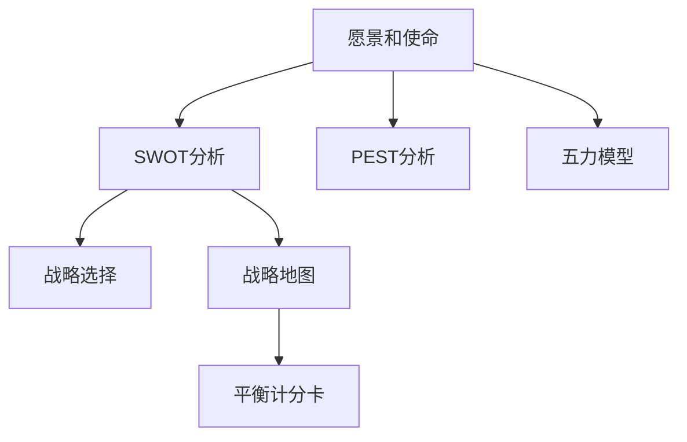

                 

# 战略管理：制定和执行长期规划的艺术

## 1. 背景介绍

### 1.1 问题由来
在快速变化的商业环境中，制定和执行长期规划变得越来越重要。企业的成功不仅仅依赖于短期的利润，还需要在长远的战略布局中不断创新和优化。然而，传统的计划制定和执行方式已难以满足现代企业的动态需求。因此，引入先进的管理理论和方法，特别是战略管理理论，成为了企业发展的关键。

### 1.2 问题核心关键点
战略管理旨在通过系统化的思考和执行策略，帮助企业实现可持续增长和竞争优势。核心关键点包括：
- **战略规划**：确定企业的长期目标和行动计划。
- **战略执行**：确保战略目标的实现，通过资源配置和过程管理。
- **绩效评估**：评估战略执行的效果，调整策略以适应环境变化。

### 1.3 问题研究意义
战略管理的研究意义在于：
- **指导实践**：提供了一套系统化的方法论，帮助企业制定和执行战略。
- **提升竞争力**：通过前瞻性的战略布局，增强企业的市场竞争力和可持续发展能力。
- **促进创新**：鼓励企业创新，保持与技术和社会发展的同步。
- **风险管理**：通过识别和管理风险，增强企业应对不确定性的能力。

## 2. 核心概念与联系

### 2.1 核心概念概述

战略管理涉及一系列关键概念，包括但不限于：

- **愿景和使命**：企业长期目标和存在的意义。
- **SWOT分析**：分析企业的优势、劣势、机会和威胁。
- **PEST分析**：分析宏观环境中的政治、经济、社会和技术因素。
- **五力模型**：分析行业竞争环境，包括供应商、客户、替代品、竞争对手和新进入者。
- **战略选择**：确定不同的战略选择，如成本领先、差异化、集中化等。
- **战略地图**：将战略目标分解为可执行的行动计划和关键绩效指标(KPIs)。
- **平衡计分卡**：通过财务、客户、内部流程和创新四个维度评估战略执行效果。

### 2.2 核心概念原理和架构的 Mermaid 流程图



### 2.3 核心概念的联系

这些概念之间具有紧密的联系，共同构成了战略管理的框架：

- **愿景和使命**提供了战略方向，确保战略与企业长期目标一致。
- **SWOT分析**识别企业的内部和外部环境，为战略选择提供依据。
- **PEST分析**进一步分析宏观环境，确保战略的适应性。
- **五力模型**评估行业竞争环境，制定针对性策略。
- **战略选择**根据内外环境，确定具体的战略方向。
- **战略地图**将战略目标转化为具体行动计划和KPIs。
- **平衡计分卡**评估战略执行效果，持续改进战略实施。

这种结构化的联系，使企业能够系统地识别、制定和执行战略，从而在竞争中保持优势。

## 3. 核心算法原理 & 具体操作步骤

### 3.1 算法原理概述

战略管理涉及的算法原理主要集中在定量和定性分析方法上，旨在通过数据驱动和经验结合的方式，制定和优化企业战略。其核心在于以下几个步骤：

1. **数据收集与分析**：收集相关数据，包括市场调研、行业报告、财务数据等。
2. **战略选择与评估**：通过定量和定性分析方法，评估不同战略选择的优劣。
3. **战略执行计划**：制定详细的行动计划，明确资源分配和执行路径。
4. **绩效监控与反馈**：通过关键绩效指标(KPIs)和平衡计分卡，持续监控战略执行效果，并及时调整策略。

### 3.2 算法步骤详解

#### 3.2.1 数据收集与分析

数据收集与分析是战略管理的第一步，包括：

- **市场调研**：通过问卷调查、访谈和焦点小组等方法，收集市场数据和客户反馈。
- **行业报告**：分析行业趋势和竞争对手动态。
- **财务数据**：分析企业的财务状况，包括收入、成本、利润等。

#### 3.2.2 战略选择与评估

战略选择与评估通过以下步骤进行：

1. **SWOT分析**：识别企业的优势、劣势、机会和威胁，确定战略方向。
2. **PEST分析**：分析宏观环境中的政治、经济、社会和技术因素，评估其对企业的影响。
3. **五力模型**：分析行业竞争环境，评估供应商、客户、替代品、竞争对手和新进入者对企业的影响。
4. **竞争情报**：通过竞争情报工具，监测竞争对手的动向和市场反应。
5. **战略选择**：在分析结果的基础上，确定成本领先、差异化、集中化等不同的战略选择。

#### 3.2.3 战略执行计划

战略执行计划通过以下步骤制定：

1. **战略地图**：将战略目标分解为具体的行动计划和KPIs，确保战略可执行。
2. **资源配置**：明确所需资源，包括人力、财力和技术资源。
3. **执行路径**：制定详细的执行路径和时间表。
4. **风险管理**：识别潜在风险，制定应对措施。

#### 3.2.4 绩效监控与反馈

绩效监控与反馈通过以下步骤进行：

1. **KPIs设定**：设定关键绩效指标，评估战略执行效果。
2. **平衡计分卡**：通过财务、客户、内部流程和创新四个维度，全面评估战略执行效果。
3. **持续改进**：根据监控结果，及时调整战略和执行计划。

### 3.3 算法优缺点

战略管理的优点包括：

- **系统性**：通过系统化的分析方法，确保战略的全面性和科学性。
- **灵活性**：能够根据环境变化，及时调整战略方向。
- **综合性强**：综合考虑内外部环境，制定全面的战略方案。

其缺点包括：

- **复杂性**：涉及多个维度和分析方法，实施过程复杂。
- **数据依赖**：对数据的质量和完整性要求高，数据获取成本大。
- **执行难度**：需要高水平的管理团队和执行能力。

### 3.4 算法应用领域

战略管理的应用领域广泛，包括但不限于：

- **企业战略规划**：制定和执行企业的长期战略。
- **业务单元战略**：制定各业务单元的战略目标和行动计划。
- **人力资源战略**：制定人力资源管理和发展的长期战略。
- **技术创新战略**：制定技术研发和创新的战略方向。
- **市场营销战略**：制定市场营销和品牌建设的战略方案。
- **国际化战略**：制定企业国际化的战略布局和行动计划。

## 4. 数学模型和公式 & 详细讲解 & 举例说明

### 4.1 数学模型构建

战略管理涉及的数学模型主要包括：

- **线性回归模型**：用于预测市场趋势和客户需求。
- **决策树模型**：用于评估不同战略选择的风险和收益。
- **蒙特卡洛模拟**：用于风险评估和战略优化。
- **多目标优化模型**：用于综合评估多个战略选择的优劣。

### 4.2 公式推导过程

以线性回归模型为例，推导其公式和应用过程：

设有一组历史数据 $(x_1, y_1), (x_2, y_2), ..., (x_n, y_n)$，其中 $x_i$ 表示自变量，$y_i$ 表示因变量，$n$ 为样本数量。线性回归模型的目标是找到一条直线 $y = ax + b$，使得所有数据点 $(x_i, y_i)$ 到直线的距离最小。

最小二乘法求解该问题，通过求解如下目标函数：

$$
\min \sum_{i=1}^{n} (y_i - (ax_i + b))^2
$$

得到回归系数 $a$ 和 $b$ 的公式：

$$
\hat{a} = \frac{\sum_{i=1}^{n} x_iy_i - \frac{\sum_{i=1}^{n} x_i \sum_{i=1}^{n} y_i}{\sum_{i=1}^{n} x_i^2 - \frac{\left(\sum_{i=1}^{n} x_i\right)^2}{n}}
$$

$$
\hat{b} = \bar{y} - \hat{a}\bar{x}
$$

其中 $\bar{x} = \frac{\sum_{i=1}^{n} x_i}{n}$，$\bar{y} = \frac{\sum_{i=1}^{n} y_i}{n}$。

### 4.3 案例分析与讲解

以一家电子产品公司为例，其市场需求预测可以通过线性回归模型进行：

设该公司过去的销售数据为 $(x_1, y_1), (x_2, y_2), ..., (x_n, y_n)$，其中 $x_i$ 表示时间（以月为单位），$y_i$ 表示销售额。通过收集历史数据，使用线性回归模型进行预测，得到如下回归方程：

$$
\hat{y} = \hat{a}x + \hat{b}
$$

其中 $\hat{a}$ 和 $\hat{b}$ 通过最小二乘法求解得到。假设得到 $\hat{a} = 0.5$，$\hat{b} = 100$，则未来第 $k$ 个月的销售额预测为：

$$
\hat{y}_k = 0.5k + 100
$$

这样，公司可以根据预测结果进行生产计划和库存管理，降低库存成本，提高市场响应速度。

## 5. 项目实践：代码实例和详细解释说明

### 5.1 开发环境搭建

战略管理的项目实践需要具备以下环境：

- **Python**：数据处理和模型分析的首选语言。
- **Jupyter Notebook**：交互式数据科学平台，便于实验和分析。
- **R**：强大的统计分析工具，适用于线性回归等模型。
- **SQL**：数据库管理语言，用于数据收集和处理。
- **Excel**：数据可视化和报表生成工具，便于结果展示。

### 5.2 源代码详细实现

以下是一个简单的Python代码示例，用于线性回归模型的实现和预测：

```python
import pandas as pd
import numpy as np
from sklearn.linear_model import LinearRegression
import matplotlib.pyplot as plt

# 数据集
data = pd.read_csv('sales_data.csv')
X = data['time'].tolist()
y = data['sales'].tolist()

# 线性回归模型
model = LinearRegression()
model.fit(np.array(X).reshape(-1, 1), np.array(y).reshape(-1, 1))

# 预测未来销售额
future_sales = []
for i in range(1, 13):
    future_sales.append(model.predict(np.array([i]).reshape(-1, 1))[0])

# 绘制时间-销售额曲线
plt.plot(X, y, 'o', label='Actual Sales')
plt.plot(X, np.array(y).tolist(), 'r-', label='Regression Line')
plt.plot(X, future_sales, 'g--', label='Future Sales')
plt.legend()
plt.xlabel('Time (Months)')
plt.ylabel('Sales')
plt.title('Sales Prediction')
plt.show()
```

### 5.3 代码解读与分析

这段代码主要实现了线性回归模型的数据处理和预测：

- `data = pd.read_csv('sales_data.csv')`：读取历史销售数据。
- `X = data['time'].tolist()` 和 `y = data['sales'].tolist()`：将时间（自变量）和销售额（因变量）转换为列表。
- `model = LinearRegression()`：创建线性回归模型对象。
- `model.fit(np.array(X).reshape(-1, 1), np.array(y).reshape(-1, 1))`：训练模型。
- `future_sales = []`：创建一个空列表，用于存储未来销售额的预测值。
- 使用 `for` 循环，对未来每个月的销售额进行预测，并添加到 `future_sales` 列表中。
- `plt.plot(X, y, 'o', label='Actual Sales')`：绘制实际销售额曲线。
- `plt.plot(X, np.array(y).tolist(), 'r-', label='Regression Line')`：绘制回归直线。
- `plt.plot(X, future_sales, 'g--', label='Future Sales')`：绘制未来销售额预测曲线。
- `plt.legend()`、`plt.xlabel()`、`plt.ylabel()` 和 `plt.title()`：设置图表的标签和标题。

### 5.4 运行结果展示

运行上述代码，将生成一个时间-销售额的曲线图，展示了实际销售额、回归直线和未来销售额的预测值。通过这张图，公司可以直观地看到未来销售额的走势，并据此调整生产计划和库存管理策略。

## 6. 实际应用场景

### 6.1 市场营销策略

在市场营销策略中，战略管理可以帮助企业制定有效的市场推广计划。通过市场调研和SWOT分析，识别目标市场的机会和威胁，制定差异化或成本领先的策略。例如，一家电子商务公司可以通过五力模型分析，识别市场中的竞争态势，优化价格策略和促销手段，提升市场份额。

### 6.2 人力资源管理

在人力资源管理中，战略管理可以帮助企业制定人员发展和招聘策略。通过PEST分析和五力模型，评估行业趋势和竞争环境，制定适合企业特点的人力资源战略。例如，一家科技公司可以通过PEST分析，预测技术发展趋势，制定技术人才招聘和培养计划，确保人才供给与技术创新同步。

### 6.3 产品开发

在产品开发中，战略管理可以帮助企业制定产品创新和迭代策略。通过市场调研和竞争情报，识别市场需求和竞争优势，制定差异化产品策略。例如，一家汽车制造公司可以通过五力模型分析，识别市场中的替代品和竞争者，优化产品设计和功能，提升产品竞争力。

### 6.4 未来应用展望

未来，随着数据分析技术的不断进步，战略管理将更注重数据驱动和人工智能的结合。例如，通过机器学习算法，自动化分析历史数据和市场趋势，实时调整战略方向。通过大数据分析，实时监控市场动态，快速响应环境变化。

## 7. 工具和资源推荐

### 7.1 学习资源推荐

- **《战略管理》**：菲利普·科特勒著，系统介绍了战略管理的理论和方法。
- **《哈佛商业评论》**：提供最新的商业管理案例和理论研究。
- **Coursera**：提供多门战略管理相关的在线课程，包括哈佛大学、INSEAD等顶级学府的课程。
- **麦肯锡咨询**：提供大量的战略管理案例研究和咨询经验。

### 7.2 开发工具推荐

- **Excel**：数据可视化和报表生成工具，便于结果展示和分析。
- **Jupyter Notebook**：交互式数据科学平台，便于实验和分析。
- **R**：强大的统计分析工具，适用于线性回归等模型。
- **Python**：数据处理和模型分析的首选语言。
- **Tableau**：数据可视化和商业智能工具，便于数据探索和分析。

### 7.3 相关论文推荐

- **《企业战略管理》**：亨利·明茨伯格著，介绍了战略管理的核心概念和实践方法。
- **《竞争战略》**：迈克尔·波特著，经典竞争战略分析工具和方法。
- **《蓝海战略》**：W. 钱·金和勒妮·莫博涅著，探讨了创新和差异化战略。
- **《管理学》**：彼得·德鲁克著，管理学的经典之作，介绍了战略管理的基本原则和实践。

## 8. 总结：未来发展趋势与挑战

### 8.1 研究成果总结

战略管理的研究已经取得了丰硕成果，涵盖了从定性分析到定量分析的各个方面。其核心思想是通过系统化的思考和执行策略，帮助企业实现可持续增长和竞争优势。

### 8.2 未来发展趋势

未来战略管理的发展趋势包括：

- **数据驱动**：通过大数据和机器学习技术，实现战略的实时化和精准化。
- **跨学科融合**：与心理学、社会学、经济学等多学科结合，形成更加全面的战略管理理论。
- **全球化视角**：适应全球化环境，考虑跨文化管理和跨国战略布局。
- **可持续发展**：强调环境和社会责任，推动企业的可持续发展。
- **数字化转型**：利用数字化技术，提升战略管理的效率和效果。

### 8.3 面临的挑战

战略管理面临的挑战包括：

- **数据质量**：数据获取和处理过程中的质量问题，影响战略决策的准确性。
- **环境变化**：市场和技术的快速变化，需要及时调整战略方向。
- **资源配置**：有限的资源如何合理配置，确保战略实施的有效性。
- **执行困难**：战略执行过程中，需要高水平的管理团队和执行能力。
- **风险管理**：识别和管理战略实施中的各种风险，确保战略的稳健性。

### 8.4 研究展望

未来战略管理的重点研究方向包括：

- **大数据分析**：利用大数据技术，实现战略决策的智能化和自动化。
- **人工智能应用**：探索人工智能在战略管理中的应用，提升战略执行的效率和效果。
- **跨学科研究**：与心理学、社会学、经济学等多学科结合，形成更加全面的战略管理理论。
- **全球化战略**：适应全球化环境，考虑跨文化管理和跨国战略布局。
- **可持续发展**：强调环境和社会责任，推动企业的可持续发展。

## 9. 附录：常见问题与解答

**Q1: 什么是战略管理？**

A: 战略管理是企业为了实现长期目标，通过系统化的方法规划、制定和执行战略的过程。

**Q2: 战略管理的主要步骤包括哪些？**

A: 主要步骤包括数据收集与分析、战略选择与评估、战略执行计划和绩效监控与反馈。

**Q3: 如何选择不同的战略方向？**

A: 通常需要综合考虑企业的内外部环境，如SWOT分析、PEST分析和五力模型等，选择合适的战略方向。

**Q4: 如何评估战略执行效果？**

A: 可以通过关键绩效指标(KPIs)和平衡计分卡等工具，全面评估战略执行效果。

**Q5: 什么是平衡计分卡？**

A: 平衡计分卡是一种战略管理工具，通过财务、客户、内部流程和创新四个维度，全面评估战略执行效果。

---

作者：禅与计算机程序设计艺术 / Zen and the Art of Computer Programming

