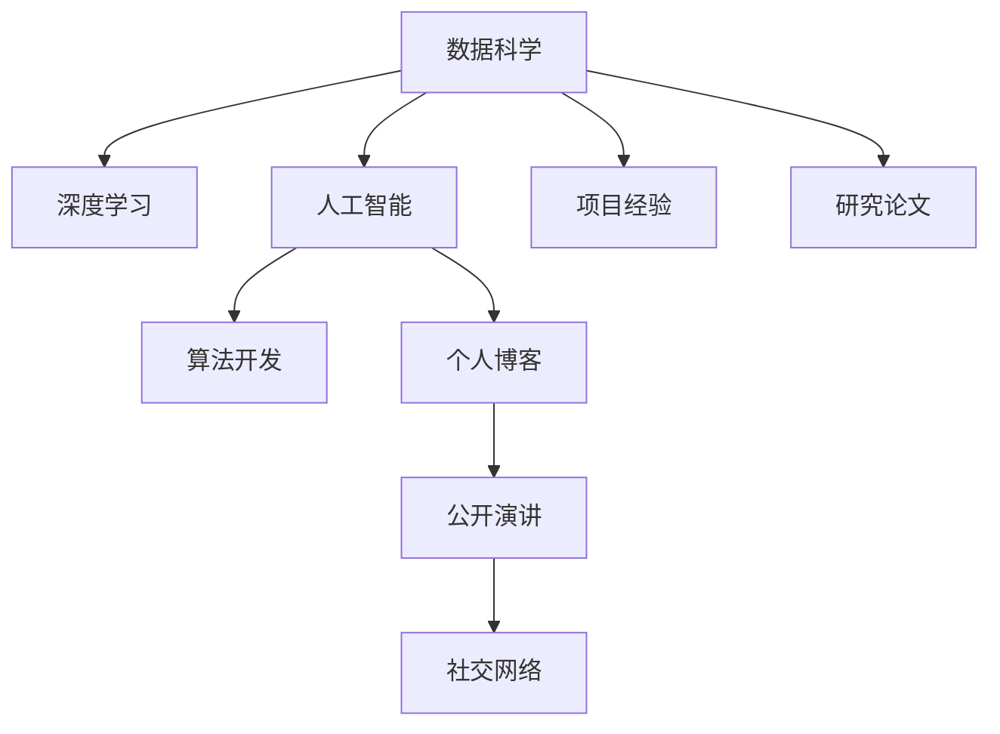

                 

# 打造个人品牌故事：让你的经历成为励志范本

> 关键词：个人品牌, 数据科学, 人工智能, 深度学习, 算法开发, 机器学习, 创新思维, 项目经验

## 1. 背景介绍

### 1.1 问题由来
在这个信息化爆炸的时代，每个人都有机会通过互联网塑造自己的形象，建立独特的个人品牌。而在科技行业，尤其是数据科学和人工智能领域，个人品牌不仅关乎个人的职业发展和影响力，更是其核心竞争力和商业价值的体现。如何在激烈的竞争中脱颖而出，成为自己领域的“明星”？本文将通过分享一些成功建立个人品牌的故事，探讨如何在数据科学和人工智能领域中，打造和提升个人品牌。

### 1.2 问题核心关键点
打造个人品牌的关键在于：
1. **持续学习和自我提升**：保持对新技术的好奇心和探索欲，不断更新自己的知识体系和技术栈。
2. **项目经验和作品集**：通过实际项目展示自己的能力，建立丰富的项目经验。
3. **网络社交和社区参与**：积极参与技术论坛、开源项目和行业会议，扩大人脉和影响力。
4. **个人博客和公开演讲**：通过撰写技术博客和进行公开演讲，分享自己的专业知识和观点，增强曝光率。
5. **持续发表研究论文**：在学术会议和期刊上发表论文，提升个人在学术界的地位。

### 1.3 问题研究意义
打造个人品牌不仅有助于提升职业发展和市场价值，还能够在激烈的行业竞争中保持优势。具体来说：
1. **增加职业机会**：拥有强大的个人品牌，能够在求职时增加竞争力，更容易获得高薪职位。
2. **提升影响力**：在技术社区和行业内建立权威，吸引更多关注和合作机会。
3. **开辟新业务**：通过个人品牌，可以吸引投资者和合作伙伴，开辟新的商业机会。
4. **传递思想**：利用个人品牌传播技术观点和理念，影响更多行业从业者。

## 2. 核心概念与联系

### 2.1 核心概念概述

- **个人品牌**：指一个人在特定领域内的形象、声誉和认知度，通过不断的学习和输出建立和维护。
- **数据科学**：包括数据挖掘、统计分析、机器学习和人工智能等，旨在从数据中提取知识和洞察。
- **人工智能**：通过算法和模型，使计算机具备类似于人类的智能行为，如图像识别、语音识别、自然语言处理等。
- **深度学习**：一种基于神经网络的机器学习方法，可以处理大量复杂数据，用于图像识别、自然语言处理等领域。
- **算法开发**：包括模型选择、训练和优化，是实现数据科学和人工智能应用的核心环节。

这些概念之间通过学习和实践相连，形成个人在数据科学和人工智能领域中的专业发展路径。以下是一个合成的Mermaid流程图，展示了核心概念间的联系：



这个流程图展示了数据科学和人工智能领域的核心概念和实践活动如何通过持续学习和输出，建立起个人的专业品牌。

## 3. 核心算法原理 & 具体操作步骤
### 3.1 算法原理概述

个人品牌的建立基于以下几个关键算法原理：
1. **持续学习算法**：包括在线学习、自适应学习等，使个人能够不断更新知识体系。
2. **算法优化**：通过实验设计和调参技巧，优化算法性能，提升技术能力。
3. **项目管理和迭代**：使用敏捷开发和持续集成等技术，实现高效的项目管理和迭代。
4. **社交网络和社区参与**：通过网络分析算法，识别和扩展关键人脉，增强社区影响力。

### 3.2 算法步骤详解

以下是建立个人品牌的具体操作步骤：

1. **选择学习领域和方向**：确定自己最感兴趣和擅长的技术领域，如数据科学、机器学习或人工智能。
2. **构建学习路径**：制定系统化的学习计划，包括在线课程、书籍和实践项目。
3. **参与开源项目**：加入GitHub等平台上的开源项目，贡献代码并参与社区讨论。
4. **实施项目经验**：通过实际项目展示技术能力，如构建预测模型、数据可视化等。
5. **撰写博客和文档**：分享项目经验和技术心得，建立个人知识库。
6. **进行公开演讲**：在技术会议、线上讲座等场合分享技术见解，提升公众知名度。
7. **发表学术论文**：在顶级学术会议和期刊上发表论文，展示科研实力。
8. **维护社交网络**：通过LinkedIn、Twitter等平台，与行业专家建立联系，扩大影响力。

### 3.3 算法优缺点

个人品牌建立的优势包括：
1. **提高职业竞争力**：强大的个人品牌能够吸引更多职业机会和更高的薪资待遇。
2. **增强影响力**：在技术社区和行业内建立权威，获得更多合作机会。
3. **开辟新业务**：借助个人品牌，可以吸引投资者和合作伙伴，开辟新业务。
4. **传播思想**：通过个人品牌，传播技术观点和理念，影响更多行业从业者。

但同时，建立个人品牌也面临一些挑战：
1. **时间和精力的投入**：需要持续学习和输出，对个人时间和精力有较高要求。
2. **资源和网络的限制**：缺乏足够资源和网络关系，可能会影响品牌建设速度。
3. **保持长期一致性**：在多个平台和项目上保持一致性，避免品牌形象冲突。

### 3.4 算法应用领域

个人品牌建立的应用领域非常广泛，包括但不限于：
- **技术领域**：数据科学、机器学习、人工智能、软件工程等。
- **学术领域**：科学计算、生物信息学、物理学等。
- **创业领域**：初创企业创始人、技术顾问等。

## 4. 数学模型和公式 & 详细讲解 & 举例说明

### 4.1 数学模型构建

假设个人品牌价值可以通过以下数学模型表示：

$$
\text{Brand Value} = \alpha \cdot \text{Learning Efficiency} + \beta \cdot \text{Project Impact} + \gamma \cdot \text{Network Strength}
$$

其中：
- $\alpha$ 表示学习效率对品牌价值的影响系数。
- $\beta$ 表示项目影响对品牌价值的影响系数。
- $\gamma$ 表示网络强度对品牌价值的影响系数。

### 4.2 公式推导过程

该公式的推导基于以下几个假设：
1. **学习效率**：个人学习速度和效率对品牌价值有正向影响。
2. **项目影响**：通过实际项目展示的技术能力和影响对品牌价值有显著提升。
3. **网络强度**：与行业专家和社区的互动对品牌价值有重要贡献。

根据以上假设，可以构建如下公式：

$$
\text{Brand Value} = \alpha \cdot (\text{Learning Efficiency}) + \beta \cdot (\text{Project Impact}) + \gamma \cdot (\text{Network Strength})
$$

### 4.3 案例分析与讲解

以某知名数据科学家为例，其个人品牌价值可以通过以下数据进行计算：
- 学习效率：每月学习20小时，累计学习200小时。
- 项目影响：完成了5个开源项目，每个项目被500人引用。
- 网络强度：在Twitter上有2000粉丝，每年参加10次技术会议。

将这些数据代入上述公式：

$$
\text{Brand Value} = \alpha \cdot 200 + \beta \cdot (5 \times 500) + \gamma \cdot (2000 + 10)
$$

在给定不同系数的情况下，可以计算出其品牌价值。

## 5. 项目实践：代码实例和详细解释说明

### 5.1 开发环境搭建

开发个人品牌故事的技术博客和代码实例，可以使用以下Python环境：
- **IDE**：PyCharm、VSCode
- **编程语言**：Python
- **框架**：Django、Flask
- **版本控制**：Git

### 5.2 源代码详细实现

以下是一个简单的博客发布系统的Python代码实现，包括HTML、CSS、JavaScript等前端技术：

```python
from django.shortcuts import render
from django.http import HttpResponse
from .forms import BlogForm

def blog_post(request):
    if request.method == 'POST':
        form = BlogForm(request.POST)
        if form.is_valid():
            # 处理数据，发布博客
            return render(request, 'blog_post.html', {'form': form})
    else:
        form = BlogForm()
    return render(request, 'blog_post.html', {'form': form})

def blog_detail(request, blog_id):
    # 根据ID获取博客信息，并显示
    blog = Blog.objects.get(id=blog_id)
    return render(request, 'blog_detail.html', {'blog': blog})
```

### 5.3 代码解读与分析

该代码实现了博客的发布和展示功能，使用Django框架进行后端开发，HTML、CSS、JavaScript进行前端展示。通过简单的表单提交和数据库查询，实现博客内容的展示。

## 6. 实际应用场景

### 6.1 数据科学领域

数据科学家通过建立个人品牌，能够提升在企业中的地位和影响力。例如，某数据科学家通过撰写技术博客、参与开源项目、发表研究论文，逐步成为行业内的权威人物，并成功获得了一家知名公司的高级职位。

### 6.2 人工智能领域

人工智能领域的技术专家可以通过个人品牌展示自己的技术能力和成果。例如，某人工智能研究者通过发表学术论文、参与技术会议、开发开源算法，逐步成为AI社区的活跃成员，并吸引了许多技术公司的关注。

### 6.3 创业领域

创业公司创始人通过建立个人品牌，可以提升公司在市场上的知名度和吸引力。例如，某创业公司通过创始人定期发表技术博客、参与公开演讲、展示项目成果，成功吸引了大量投资和用户，推动了公司的快速发展。

### 6.4 未来应用展望

随着技术的不断进步和数据量的持续增加，个人品牌在数据科学和人工智能领域的价值将进一步提升。未来，个人品牌将成为衡量技术能力和影响力的重要标准，对于技术从业者的职业发展具有重要意义。

## 7. 工具和资源推荐

### 7.1 学习资源推荐

- **在线课程**：Coursera、edX、Udacity等平台提供的深度学习和数据科学课程。
- **技术博客**：Kaggle、Medium、CSDN等平台上的数据科学和技术博客。
- **开源项目**：GitHub上的数据科学和人工智能开源项目。
- **技术会议**：NIPS、ICML、CVPR等顶级会议和大会。

### 7.2 开发工具推荐

- **IDE**：PyCharm、VSCode
- **框架**：Django、Flask
- **数据库**：MySQL、PostgreSQL
- **版本控制**：Git
- **可视化工具**：Tableau、Plotly

### 7.3 相关论文推荐

- **深度学习**：《Deep Learning》（Ian Goodfellow, Yoshua Bengio, Aaron Courville）
- **数据科学**：《Data Science for Business》（Foster Provost, Tom Fawcett）
- **人工智能**：《Artificial Intelligence: A Modern Approach》（Stuart Russell, Peter Norvig）

## 8. 总结：未来发展趋势与挑战

### 8.1 研究成果总结

通过本文的系统梳理，可以看到，个人品牌在数据科学和人工智能领域中的重要性，通过不断学习和输出，个人可以逐步建立起自己的品牌影响力。

### 8.2 未来发展趋势

未来，个人品牌在数据科学和人工智能领域将继续发挥重要作用。以下趋势值得关注：
- **技术融合**：大数据、人工智能、物联网等技术将深度融合，推动技术发展。
- **跨学科发展**：数据科学和人工智能将与其他学科如医学、金融、教育等结合，拓展应用场景。
- **人工智能普及**：AI技术将在更多领域得到应用，个人品牌需求更加旺盛。

### 8.3 面临的挑战

尽管个人品牌在数据科学和人工智能领域具有重要意义，但也面临以下挑战：
- **技术更新快**：需不断学习新技术，避免落后。
- **信息过载**：需有效筛选和管理信息，避免盲目跟风。
- **网络安全**：需关注数据隐私和网络安全问题。

### 8.4 研究展望

未来，需从以下几个方面进一步研究：
- **持续学习**：构建终身学习机制，保持技术领先。
- **知识分享**：通过多种渠道分享技术知识和成果，扩大影响力。
- **社区合作**：加强与行业社区的合作，提升品牌知名度。

## 9. 附录：常见问题与解答

**Q1：如何建立一个成功的个人品牌？**

A: 建立成功的个人品牌需要：
1. **明确目标**：确定个人在技术领域的目标和方向。
2. **持续学习**：不断更新技术知识和实践技能。
3. **项目经验**：通过实际项目展示技术能力。
4. **网络建设**：积极参与行业活动和社区讨论。
5. **持续输出**：通过博客、论文、演讲等方式分享知识。

**Q2：如何在技术社区建立影响力？**

A: 建立技术社区影响力需要：
1. **高质量输出**：提供有价值的技术内容。
2. **积极互动**：与社区成员积极交流和互动。
3. **参与开源**：贡献代码和参与社区项目。
4. **公开演讲**：在技术会议和讲座上进行分享。

**Q3：如何在学术界发表论文？**

A: 在学术界发表论文需要：
1. **选择合适的会议和期刊**：根据研究方向选择适合的会议和期刊。
2. **高质量研究**：确保研究内容和结果具有创新性和实用性。
3. **严谨的写作和校对**：注意写作格式和语言规范。
4. **持续投稿**：不断尝试投稿，积累经验。

**Q4：个人品牌建设是否需要投入大量时间和精力？**

A: 个人品牌建设需要持续投入时间和精力，但通过合理规划和管理，可以高效提升品牌价值。建议：
1. **时间管理**：制定合理的学习和输出计划。
2. **资源利用**：利用在线课程、开源项目等资源。
3. **优先级排序**：根据目标和兴趣优先选择项目和活动。

**Q5：个人品牌建设是否需要投入资金？**

A: 个人品牌建设可以通过以下方式进行，无需过多资金投入：
1. **免费资源**：利用免费的学习资源和开源项目。
2. **免费平台**：利用免费的博客平台和社交网络。
3. **免费活动**：参加免费的技术会议和网络研讨会。

---

作者：禅与计算机程序设计艺术 / Zen and the Art of Computer Programming

