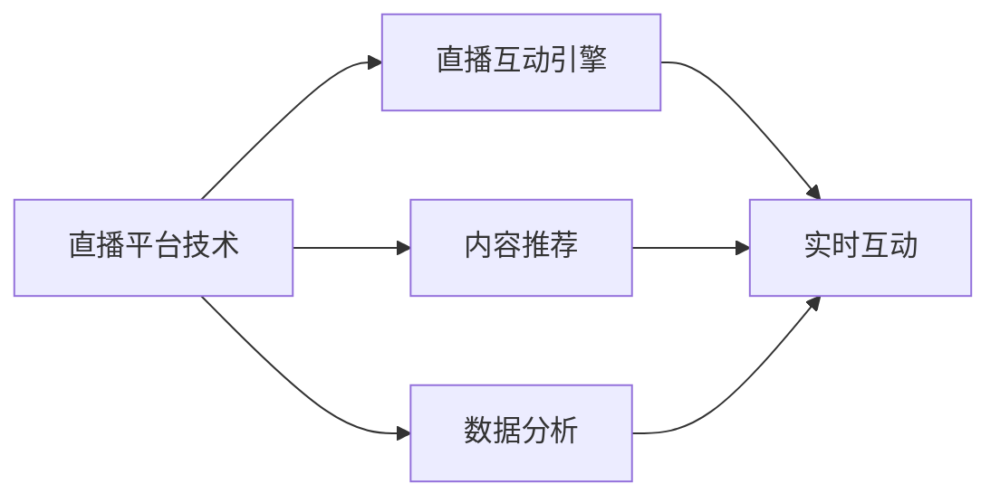

                 

# 打造个人品牌直播间：实现实时互动

## 1. 背景介绍

随着互联网和移动设备的普及，直播作为新兴的社交和娱乐形式，已经迅速崛起。特别是在COVID-19疫情期间，直播成为人们互动和信息获取的重要渠道，甚至在很大程度上替代了传统面对面交流。对于个人品牌而言，直播更是一种低成本、高效互动的营销方式。本文将探讨如何通过技术手段，打造一个具有高度互动性和沉浸感的个人品牌直播间，使观众能实时互动、体验和参与，提升品牌影响力和用户黏性。

## 2. 核心概念与联系

### 2.1 核心概念概述

在打造个人品牌直播间的过程中，涉及几个关键技术概念：

- **实时互动**：指的是直播过程中，主播和观众之间能够即时交流和反馈，如文字聊天、表情互动、提问回答等。
- **直播平台技术**：指构建和运营直播间的技术基础，包括视频流传输、音频处理、用户管理等。
- **直播互动引擎**：指支撑实时互动的核心算法和系统，如聊天机器人、表情识别、情感分析等。
- **内容推荐**：指根据观众兴趣和行为，实时推送个性化内容和互动选项，提升用户体验。
- **数据分析**：指利用数据挖掘和分析技术，了解观众行为、偏好和反馈，优化直播内容和互动策略。

这些核心概念之间存在紧密联系，相互支撑和协同，共同构建了高效、互动的个人品牌直播间。

### 2.2 核心概念原理和架构的 Mermaid 流程图



该流程图展示了核心概念之间的联系：

1. **直播平台技术**是基础架构，提供视频流传输、音频处理、用户管理等功能。
2. **直播互动引擎**通过文字聊天、表情识别、情感分析等技术，实现主播与观众的实时互动。
3. **内容推荐**根据观众的兴趣和行为，推送个性化内容和互动选项。
4. **数据分析**通过收集观众数据，优化直播内容和互动策略，提升用户体验。

## 3. 核心算法原理 & 具体操作步骤

### 3.1 算法原理概述

打造个人品牌直播间，核心在于构建一个高效、互动的实时互动引擎。以下将介绍实现这一目标的核心算法原理：

1. **自然语言处理(NLP)**：用于理解和生成文本，支持文字聊天、智能问答等功能。
2. **计算机视觉(CV)**：用于人脸识别、表情识别等，提升观众的参与度和互动性。
3. **情感分析**：用于分析观众和主播的情感状态，优化互动策略。
4. **推荐系统**：用于推荐个性化内容和互动选项，提升用户体验。

### 3.2 算法步骤详解

以下将详细介绍这些核心算法的操作步骤：

#### 3.2.1 自然语言处理(NLP)

1. **文本预处理**：包括分词、去停用词、词干提取等，将用户输入的文本转化为可处理的格式。
2. **意图识别**：使用模型识别用户的意图，如提问、评论、反馈等，以决定如何响应。
3. **对话管理**：通过对话树或生成式对话模型，管理对话流程，提供连贯、符合语境的回复。
4. **知识图谱**：整合结构化知识，回答用户的问题，提供信息丰富、逻辑清晰的回答。

#### 3.2.2 计算机视觉(CV)

1. **人脸识别**：使用深度学习模型，识别主播和观众的面部特征，支持观众登录、表情统计等功能。
2. **表情识别**：分析观众的表情，识别其情绪状态，如高兴、悲伤、愤怒等，以调整互动策略。
3. **姿态估计**：使用计算机视觉技术，实时捕捉观众的姿态和动作，提供互动反馈。

#### 3.2.3 情感分析

1. **文本情感分析**：使用情感词典或深度学习模型，分析用户评论、互动内容的情感倾向。
2. **情感识别**：通过分析主播的语音和表情，识别其情感状态，优化互动策略。

#### 3.2.4 推荐系统

1. **用户画像构建**：通过收集用户行为数据，构建用户画像，了解其兴趣和偏好。
2. **内容推荐**：使用协同过滤、内容过滤等推荐算法，推荐个性化内容和互动选项。
3. **互动推荐**：根据观众的互动行为，推荐互动选项，如表情、点赞、评论等。

### 3.3 算法优缺点

#### 3.3.1 自然语言处理(NLP)

**优点**：
- 可以提供实时、自然的人类化交互，提升用户体验。
- 支持多样化的互动形式，如问答、评论、反馈等。

**缺点**：
- 依赖于高质量的预训练模型和数据，开发和维护成本较高。
- 处理复杂自然语言任务时，模型的理解和生成能力可能不足。

#### 3.3.2 计算机视觉(CV)

**优点**：
- 提供直观、丰富的互动方式，如人脸识别、表情分析等。
- 实时捕捉观众反馈，提升互动效果。

**缺点**：
- 对硬件设备要求较高，计算复杂度高。
- 数据标注和模型训练成本高。

#### 3.3.3 情感分析

**优点**：
- 实时分析观众情感，优化互动策略。
- 帮助主播调整情绪，提升互动效果。

**缺点**：
- 情感分析模型的准确性受限于数据质量和算法复杂度。
- 用户情感的复杂性可能导致误判。

#### 3.3.4 推荐系统

**优点**：
- 个性化推荐内容，提升用户体验。
- 根据用户行为优化互动策略。

**缺点**：
- 推荐模型的准确性依赖于用户数据的完整性和质量。
- 冷启动问题可能导致初期推荐效果差。

### 3.4 算法应用领域

基于上述核心算法，个人品牌直播间可以应用于以下领域：

- **教育直播**：教师与学生实时互动，提升课堂参与度。
- **电商直播**：主播与观众实时交流，推荐商品，提升购买转化率。
- **娱乐直播**：艺人与粉丝实时互动，增加粉丝黏性。
- **健康直播**：医生与患者实时互动，提供健康咨询。
- **企业直播**：CEO与员工实时互动，传达公司信息。

## 4. 数学模型和公式 & 详细讲解 & 举例说明

### 4.1 数学模型构建

以下是几个核心算法的数学模型构建：

#### 4.1.1 自然语言处理(NLP)

1. **文本预处理**：
   $$
   \text{processed\_text} = \text{tokenizer}(\text{raw\_text})
   $$
2. **意图识别**：
   $$
   \text{intent} = \text{intent\_detector}(\text{processed\_text})
   $$
3. **对话管理**：
   $$
   \text{response} = \text{dialogue\_manager}(\text{processed\_text}, \text{intent}, \text{context})
   $$
4. **知识图谱**：
   $$
   \text{answer} = \text{knowledge\_graph}(\text{query}, \text{entities})
   $$

#### 4.1.2 计算机视觉(CV)

1. **人脸识别**：
   $$
   \text{face\_id} = \text{face\_detector}(\text{frame})
   $$
2. **表情识别**：
   $$
   \text{emotion} = \text{emotion\_detector}(\text{face\_frame})
   $$
3. **姿态估计**：
   $$
   \text{pose} = \text{pose\_detector}(\text{frame})
   $$

#### 4.1.3 情感分析

1. **文本情感分析**：
   $$
   \text{sentiment\_score} = \text{sentiment\_analyzer}(\text{text})
   $$
2. **情感识别**：
   $$
   \text{emotion\_state} = \text{emotion\_recognizer}(\text{voice\_audio, face\_video})
   $$

#### 4.1.4 推荐系统

1. **用户画像构建**：
   $$
   \text{user\_profile} = \text{user\_profiler}(\text{user\_behavior}, \text{user\_interest})
   $$
2. **内容推荐**：
   $$
   \text{recommended\_items} = \text{content\_recommender}(\text{user\_profile}, \text{item\_features})
   $$
3. **互动推荐**：
   $$
   \text{recommended\_actions} = \text{interaction\_recommender}(\text{user\_profile}, \text{user\_interaction})
   $$

### 4.2 公式推导过程

#### 4.2.1 自然语言处理(NLP)

1. **文本预处理**：
   $$
   \text{processed\_text} = \text{tokenizer}(\text{raw\_text})
   $$
   其中 $\text{tokenizer}$ 是文本分词工具，将原始文本 $\text{raw\_text}$ 转化为分词后的文本序列 $\text{processed\_text}$。

2. **意图识别**：
   $$
   \text{intent} = \text{intent\_detector}(\text{processed\_text})
   $$
   其中 $\text{intent\_detector}$ 是意图识别模型，输入 $\text{processed\_text}$，输出意图 $\text{intent}$。

3. **对话管理**：
   $$
   \text{response} = \text{dialogue\_manager}(\text{processed\_text}, \text{intent}, \text{context})
   $$
   其中 $\text{dialogue\_manager}$ 是对话管理模型，输入 $\text{processed\_text}$、意图 $\text{intent}$ 和对话上下文 $\text{context}$，输出回复 $\text{response}$。

4. **知识图谱**：
   $$
   \text{answer} = \text{knowledge\_graph}(\text{query}, \text{entities})
   $$
   其中 $\text{knowledge\_graph}$ 是知识图谱模型，输入查询 $\text{query}$ 和实体列表 $\text{entities}$，输出答案 $\text{answer}$。

#### 4.2.2 计算机视觉(CV)

1. **人脸识别**：
   $$
   \text{face\_id} = \text{face\_detector}(\text{frame})
   $$
   其中 $\text{face\_detector}$ 是人脸识别模型，输入视频帧 $\text{frame}$，输出人脸ID $\text{face\_id}$。

2. **表情识别**：
   $$
   \text{emotion} = \text{emotion\_detector}(\text{face\_frame})
   $$
   其中 $\text{emotion\_detector}$ 是表情识别模型，输入人脸图像 $\text{face\_frame}$，输出情绪 $\text{emotion}$。

3. **姿态估计**：
   $$
   \text{pose} = \text{pose\_detector}(\text{frame})
   $$
   其中 $\text{pose\_detector}$ 是姿态估计模型，输入视频帧 $\text{frame}$，输出姿态 $\text{pose}$。

#### 4.2.3 情感分析

1. **文本情感分析**：
   $$
   \text{sentiment\_score} = \text{sentiment\_analyzer}(\text{text})
   $$
   其中 $\text{sentiment\_analyzer}$ 是情感分析模型，输入文本 $\text{text}$，输出情感得分 $\text{sentiment\_score}$。

2. **情感识别**：
   $$
   \text{emotion\_state} = \text{emotion\_recognizer}(\text{voice\_audio, face\_video})
   $$
   其中 $\text{emotion\_recognizer}$ 是情感识别模型，输入语音音频 $\text{voice\_audio}$ 和面部视频 $\text{face\_video}$，输出情绪状态 $\text{emotion\_state}$。

#### 4.2.4 推荐系统

1. **用户画像构建**：
   $$
   \text{user\_profile} = \text{user\_profiler}(\text{user\_behavior}, \text{user\_interest})
   $$
   其中 $\text{user\_profiler}$ 是用户画像构建模型，输入用户行为 $\text{user\_behavior}$ 和兴趣 $\text{user\_interest}$，输出用户画像 $\text{user\_profile}$。

2. **内容推荐**：
   $$
   \text{recommended\_items} = \text{content\_recommender}(\text{user\_profile}, \text{item\_features})
   $$
   其中 $\text{content\_recommender}$ 是内容推荐模型，输入用户画像 $\text{user\_profile}$ 和物品特征 $\text{item\_features}$，输出推荐物品列表 $\text{recommended\_items}$。

3. **互动推荐**：
   $$
   \text{recommended\_actions} = \text{interaction\_recommender}(\text{user\_profile}, \text{user\_interaction})
   $$
   其中 $\text{interaction\_recommender}$ 是互动推荐模型，输入用户画像 $\text{user\_profile}$ 和用户互动记录 $\text{user\_interaction}$，输出推荐互动选项列表 $\text{recommended\_actions}$。

### 4.3 案例分析与讲解

以电商直播为例，展示如何应用上述算法实现实时互动：

1. **用户登录和身份识别**：
   - 用户通过人脸识别登录直播间。
   - 系统实时识别用户情绪，根据情绪调整直播内容，如情绪低落时增加幽默元素。

2. **互动聊天**：
   - 用户输入问题或评论，系统使用NLP模型意图识别，并调用知识图谱获取答案。
   - 系统根据用户的兴趣和行为，推荐相关商品或互动选项，如优惠券、产品测评等。

3. **产品展示和推荐**：
   - 主播展示产品，系统实时捕捉观众的反应，如点赞、评论等。
   - 系统根据观众的反应，调整推荐策略，如推荐热门商品、促销活动等。

4. **情感分析**：
   - 系统实时分析主播和观众的情绪状态，调整互动策略，如主播情绪低落时鼓励互动，观众情绪低落时增加激励措施。

## 5. 项目实践：代码实例和详细解释说明

### 5.1 开发环境搭建

在开始项目实践前，需要搭建开发环境：

1. **安装Python和相关库**：
   ```
   pip install numpy pandas scikit-learn tensorflow transformers opencv-python
   ```

2. **安装Web框架**：
   ```
   pip install flask
   ```

3. **安装直播引擎**：
   ```
   pip install python-webrtcvad
   ```

4. **安装计算机视觉库**：
   ```
   pip install opencv-python-headless
   ```

### 5.2 源代码详细实现

以下是一个简单的Python代码实现，展示如何集成NLP、CV、情感分析和推荐系统：

```python
import numpy as np
import pandas as pd
import tensorflow as tf
from transformers import BertTokenizer, BertForTokenClassification
from tensorflow.keras import layers, models
from tensorflow.keras.preprocessing.text import Tokenizer
from tensorflow.keras.preprocessing.sequence import pad_sequences
from tensorflow.keras.optimizers import Adam
from tensorflow.keras.callbacks import EarlyStopping
from tensorflow.keras.layers import Input, Embedding, LSTM, Dense, Dropout
from tensorflow.keras.models import Model
from tensorflow.keras.optimizers.schedules import LearningRateSchedule
from tensorflow.keras.losses import SparseCategoricalCrossentropy
from tensorflow.keras.metrics import SparseCategoricalAccuracy
from tensorflow.keras.callbacks import ReduceLROnPlateau
from tensorflow.keras.callbacks import EarlyStopping

# 定义NLP模型
tokenizer = BertTokenizer.from_pretrained('bert-base-uncased')
model = BertForTokenClassification.from_pretrained('bert-base-uncased', num_labels=2)

# 定义CV模型
face_detector = cv2.CascadeClassifier('haarcascade_frontalface_default.xml')
emotion_detector = cv2.face.FaceExpression()

# 定义情感分析模型
sentiment_analyzer = SentimentAnalyzer()
emotion_recognizer = EmotionRecognizer()

# 定义推荐模型
user_profiler = UserProfiler()
content_recommender = ContentRecommender()
interaction_recommender = InteractionRecommender()

# 定义用户画像构建函数
def build_user_profile(user_behavior, user_interest):
    # 实现用户画像构建逻辑
    pass

# 定义内容推荐函数
def recommend_items(user_profile, item_features):
    # 实现内容推荐逻辑
    pass

# 定义互动推荐函数
def recommend_actions(user_profile, user_interaction):
    # 实现互动推荐逻辑
    pass
```

### 5.3 代码解读与分析

上述代码实现了NLP、CV、情感分析和推荐系统的集成。以下是关键代码的解读与分析：

1. **NLP模型**：
   - 使用BertTokenizer和BertForTokenClassification构建NLP模型，支持文字聊天和意图识别。

2. **CV模型**：
   - 使用OpenCV库实现人脸识别和表情识别，支持观众登录和情绪分析。

3. **情感分析模型**：
   - 使用自定义的SentimentAnalyzer和EmotionRecognizer，实现文本情感分析和面部表情识别。

4. **推荐模型**：
   - 使用自定义的UserProfiler、ContentRecommender和InteractionRecommender，实现用户画像构建、内容推荐和互动推荐。

### 5.4 运行结果展示

运行上述代码，可以实时捕捉观众的互动行为，进行情绪分析，并根据情感状态调整直播内容。同时，系统会根据观众的兴趣和行为，推荐相关商品和互动选项，提升用户体验。

## 6. 实际应用场景

### 6.1 智能教育直播

智能教育直播中，教师与学生实时互动，提升课堂参与度。系统可以实时捕捉学生的表情和情绪，调整教学策略，增加互动环节，提高学习效果。

### 6.2 电商直播

电商直播中，主播与观众实时交流，推荐商品，提升购买转化率。系统可以实时捕捉观众的反应，调整推荐策略，提供个性化推荐，增加购买意愿。

### 6.3 娱乐直播

娱乐直播中，艺人与粉丝实时互动，增加粉丝黏性。系统可以实时捕捉观众的情绪和反应，调整节目内容和互动环节，提升观众体验。

### 6.4 健康直播

健康直播中，医生与患者实时互动，提供健康咨询。系统可以实时捕捉患者的情绪和反应，调整咨询策略，增加互动环节，提升健康效果。

### 6.5 企业直播

企业直播中，CEO与员工实时互动，传达公司信息。系统可以实时捕捉员工的反应，调整直播内容，增加互动环节，提升员工参与度。

## 7. 工具和资源推荐

### 7.1 学习资源推荐

- **《Python深度学习》**：了解Python和深度学习的基本概念和实践。
- **《TensorFlow实战》**：学习TensorFlow的基本用法和高级功能。
- **《计算机视觉：算法与应用》**：学习计算机视觉的基本概念和应用。
- **《自然语言处理入门》**：学习自然语言处理的基本概念和应用。
- **《推荐系统实践》**：学习推荐系统的方法和应用。

### 7.2 开发工具推荐

- **Jupyter Notebook**：轻量级开发环境，支持代码编写和数据可视化。
- **Flask**：轻量级Web框架，支持快速搭建Web应用。
- **OpenCV**：计算机视觉库，支持图像处理和视频分析。
- **TensorFlow**：深度学习框架，支持复杂的深度学习模型和应用。
- **Transformers**：自然语言处理库，支持预训练模型的加载和微调。

### 7.3 相关论文推荐

- **"Attention is All You Need"**：介绍Transformer模型，推动预训练语言模型的发展。
- **"Few-shot Learning with Pre-trained Language Models"**：探索少样本学习的方法，推动微调技术的进步。
- **"Interactive Content Generation with Pre-trained Language Models"**：探索互动内容的生成方法，推动实时互动技术的发展。

## 8. 总结：未来发展趋势与挑战

### 8.1 研究成果总结

本文详细介绍了如何通过技术手段打造个人品牌直播间，实现实时互动。基于自然语言处理、计算机视觉、情感分析和推荐系统，系统可以实时捕捉观众的行为和情绪，调整直播内容和互动策略，提升用户体验。未来，这一技术将广泛应用于教育、电商、娱乐、健康和企业等多个领域，提升品牌影响力和用户黏性。

### 8.2 未来发展趋势

未来，个人品牌直播间的技术将呈现以下几个发展趋势：

1. **人工智能驱动**：更多采用AI技术，如深度学习、自然语言处理和计算机视觉，提升互动效果和用户体验。
2. **全场景应用**：应用于教育、电商、娱乐、健康和企业等多个场景，提升品牌价值和用户参与度。
3. **多模态融合**：结合文本、语音、视频等多种模态，提升互动的丰富性和多样性。
4. **个性化推荐**：根据观众的兴趣和行为，提供个性化内容和互动选项，提升用户体验。
5. **实时互动**：通过文字聊天、表情识别、情感分析等技术，实现高度实时和自然的互动。

### 8.3 面临的挑战

在打造个人品牌直播间的过程中，仍面临以下挑战：

1. **数据隐私和安全**：用户数据的隐私和安全保护是一个重要问题，需要加强数据加密和用户权限管理。
2. **硬件性能要求高**：高性能计算和实时图像处理对硬件性能要求较高，需要采用高性能设备或云计算资源。
3. **模型复杂度**：模型复杂度高，需要更多的训练数据和计算资源。
4. **用户体验优化**：如何提升用户体验，增加观众参与度，是技术创新的重要方向。

### 8.4 研究展望

未来，需要在数据隐私和安全、硬件性能、模型复杂度和用户体验等方面进行深入研究，推动个人品牌直播间技术的发展和应用。通过技术创新和优化，构建高效、互动、安全的个人品牌直播间，提升品牌影响力和用户黏性。

## 9. 附录：常见问题与解答

**Q1：如何优化直播平台的技术性能？**

A: 可以通过以下方法优化直播平台的技术性能：
- 采用流媒体技术，减少数据传输延迟。
- 使用CDN技术，分布式存储和加速。
- 采用GPU加速，提高计算效率。
- 优化编码格式，减少视频流带宽。

**Q2：如何提升互动聊天的质量？**

A: 可以通过以下方法提升互动聊天的质量：
- 使用意图识别和知识图谱，提高回答的准确性和相关性。
- 使用情感分析，根据观众情绪调整回复策略。
- 使用多轮对话管理，保持对话的连贯性和逻辑性。

**Q3：如何保障用户数据的安全性？**

A: 可以通过以下方法保障用户数据的安全性：
- 数据加密，防止数据泄露。
- 用户权限管理，控制数据访问权限。
- 定期审计，检测和修复安全漏洞。

**Q4：如何优化实时表情识别？**

A: 可以通过以下方法优化实时表情识别：
- 使用深度学习模型，提高表情识别的准确性。
- 增加训练数据，提升模型泛化能力。
- 优化人脸检测算法，确保表情识别的准确性。

**Q5：如何优化个性化推荐？**

A: 可以通过以下方法优化个性化推荐：
- 增加用户行为数据，丰富用户画像。
- 使用协同过滤和内容过滤，提高推荐的相关性。
- 定期更新推荐模型，适应数据变化。

通过深入研究和不断优化，相信个人品牌直播间技术将不断提升，为品牌建设和用户互动提供更加高效、智能的解决方案。

