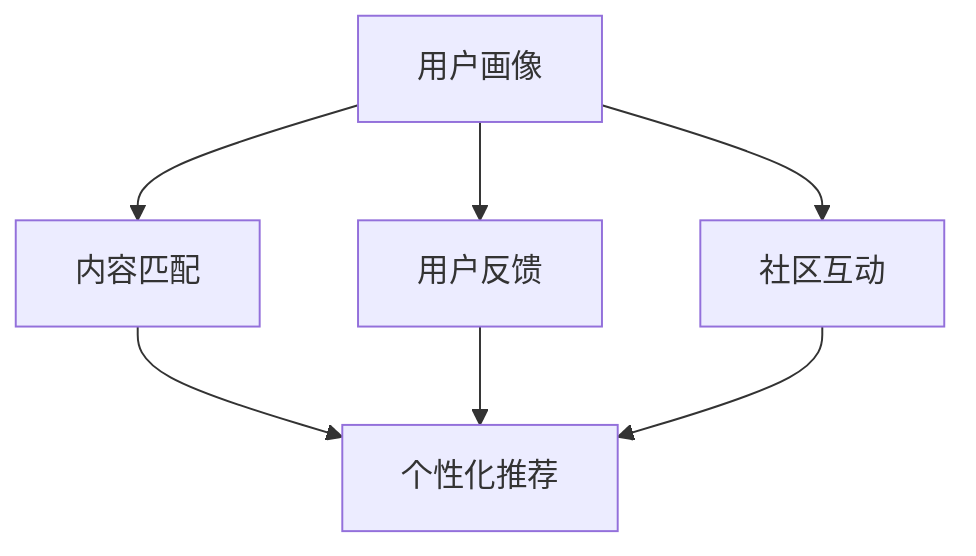

                 

# 打造技术型知识付费平台的用户运营体系

## 1. 背景介绍

### 1.1 问题由来

随着知识付费的兴起，越来越多的企业和个人通过订阅模式获取高质量的在线内容。知识付费平台以知识为载体，以用户为服务的对象，通过互联网渠道传播知识，实现商业变现。技术型知识付费平台则以技术知识为核心内容，为工程技术人员提供专业技能、职业发展、项目实践、行业动态等信息。这类平台的用户主要包括：

1. **软件开发者**：关注技术栈更新、编程语言新特性、开发工具和框架等。
2. **数据科学家**：关注数据处理、机器学习算法、大数据技术等。
3. **产品经理**：关注产品管理、用户体验、需求分析等。
4. **运维工程师**：关注云计算、服务器配置、网络安全等。
5. **其他技术爱好者**：关注技术博客、开源项目、技术论坛等。

这些用户对知识付费平台的需求多样化，涵盖技术学习、职业规划、项目实践等各个方面。因此，如何高效地构建用户运营体系，提升用户黏性和活跃度，成为知识付费平台的核心任务。

### 1.2 问题核心关键点

构建技术型知识付费平台的用户运营体系，需要重点关注以下几个关键点：

1. **用户画像**：精准地刻画平台用户群体，根据不同角色的需求提供个性化内容。
2. **内容匹配**：高效地将高质量内容推送给感兴趣的用户，提高内容曝光率和点击率。
3. **用户反馈**：及时收集和响应用户反馈，优化用户体验和内容质量。
4. **社区互动**：鼓励用户参与讨论、交流，形成活跃的社区氛围。
5. **个性化推荐**：通过分析用户行为，推送个性化的学习资源和项目实践机会。

本文将从用户画像、内容匹配、用户反馈、社区互动和个性化推荐五个方面，全面探讨如何打造高效的技术型知识付费平台的用户运营体系。

## 2. 核心概念与联系

### 2.1 核心概念概述

为了更好地理解用户运营体系构建的基本逻辑，首先介绍几个核心概念：

1. **用户画像**：通过数据分析和用户调研，构建用户群体的行为特征、兴趣偏好、职业背景等信息，用于指导个性化推荐和内容匹配。
2. **内容匹配**：根据用户画像和内容标签，将用户与相关的高质量内容进行精准匹配，提高用户点击率和满意度。
3. **用户反馈**：收集用户对内容、平台功能、用户体验等方面的反馈，快速迭代优化。
4. **社区互动**：鼓励用户通过评论、点赞、分享等行为参与讨论，增强用户黏性和社区活跃度。
5. **个性化推荐**：分析用户行为数据，预测用户兴趣，推送个性化的学习资源和项目实践机会。

这些核心概念之间相互联系，共同构成了技术型知识付费平台用户运营体系的框架。下图展示了这些概念之间的联系：



此图展示了用户画像如何影响内容匹配、用户反馈和社区互动，同时这些反馈和互动又如何进一步优化用户画像，最终形成良性循环，提升平台的用户体验和留存率。

## 3. 核心算法原理 & 具体操作步骤

### 3.1 算法原理概述

基于以上核心概念，本文将详细探讨构建技术型知识付费平台用户运营体系的核心算法原理。这些算法主要围绕以下几方面展开：

- **用户画像构建**：通过用户行为分析、问卷调查等方式，获取用户特征和偏好信息。
- **内容匹配算法**：通过推荐算法，将用户与高质量内容进行匹配。
- **用户反馈分析**：通过文本分析、情感分析等技术，收集和分析用户反馈。
- **社区互动模型**：通过社交网络分析，促进用户之间的互动和社区形成。
- **个性化推荐模型**：通过协同过滤、基于内容的推荐、深度学习等技术，实现个性化推荐。

### 3.2 算法步骤详解

#### 3.2.1 用户画像构建

用户画像的构建需要综合多个数据源，包括用户行为数据、用户注册信息、社交网络信息等。具体步骤如下：

1. **数据收集**：从网站、移动应用、社交平台等渠道，收集用户行为数据，如浏览记录、搜索关键词、购买记录、评论等。
2. **数据清洗**：对收集的数据进行去重、去噪，处理缺失值和异常值。
3. **特征提取**：将清洗后的数据转换为模型可用的特征向量，如使用TF-IDF、词向量等技术。
4. **聚类分析**：使用K-means、层次聚类等算法，对用户进行聚类分析，划分不同用户群体。
5. **用户画像刻画**：根据聚类结果，刻画不同用户群体的特征，包括年龄、职业、兴趣偏好、技术栈等。

#### 3.2.2 内容匹配算法

内容匹配算法的主要目标是，根据用户画像和内容标签，将高质量内容推荐给用户。具体步骤如下：

1. **内容标签提取**：对平台上的内容进行标签化，如使用关键词提取、TF-IDF等技术。
2. **相似度计算**：计算用户画像与内容标签之间的相似度，可以使用余弦相似度、欧式距离等方法。
3. **排名排序**：根据相似度计算结果，对内容进行排序，优先推荐相似度高的内容。
4. **推荐展示**：将推荐结果展示给用户，并提供预览链接、摘要等信息。

#### 3.2.3 用户反馈分析

用户反馈分析的目的是，通过收集和分析用户的评价和反馈，优化平台的内容和功能。具体步骤如下：

1. **反馈收集**：通过评论、评分、问卷调查等方式，收集用户对内容的评价和建议。
2. **文本分析**：使用NLP技术，对用户评论进行情感分析和主题分析。
3. **反馈分类**：将用户反馈分类为正面、负面、中性等，便于后续处理。
4. **反馈回应**：根据反馈内容，及时回应用户，解决问题或改进功能。
5. **反馈应用**：将用户反馈应用于内容更新和功能优化，提高平台的用户体验。

#### 3.2.4 社区互动模型

社区互动模型旨在通过促进用户之间的互动，增强平台的用户黏性和活跃度。具体步骤如下：

1. **社区构建**：通过邀请制、推荐制等方式，构建社区用户群体。
2. **互动激励**：设置互动激励机制，如积分奖励、徽章认证等，鼓励用户参与讨论和交流。
3. **话题引导**：通过话题引导，组织用户围绕热点问题进行讨论。
4. **互动分析**：使用社交网络分析技术，分析社区用户的互动行为，发现活跃用户和意见领袖。
5. **互动优化**：根据互动分析结果，优化社区结构，提升用户参与度和满意度。

#### 3.2.5 个性化推荐模型

个性化推荐模型的目标是，根据用户行为数据，预测用户兴趣，实现个性化推荐。具体步骤如下：

1. **行为数据采集**：从网站、应用等渠道，采集用户的行为数据，如浏览记录、点击记录、购买记录等。
2. **用户兴趣建模**：使用协同过滤、基于内容的推荐等技术，建立用户兴趣模型。
3. **实时推荐**：根据用户实时行为数据，动态调整推荐算法，推送个性化的内容。
4. **推荐效果评估**：通过A/B测试等方法，评估个性化推荐的准确性和效果。
5. **推荐优化**：根据评估结果，优化推荐算法，提高推荐质量。

### 3.3 算法优缺点

用户画像、内容匹配、用户反馈、社区互动和个性化推荐等算法，在构建技术型知识付费平台的用户运营体系中，各有其优缺点：

**优点**：
- **用户画像**：帮助平台更精准地刻画用户群体，指导个性化推荐和内容匹配，提升用户体验和满意度。
- **内容匹配**：通过精准匹配，提高内容曝光率和点击率，提升平台的活跃度和商业价值。
- **用户反馈**：快速响应用户反馈，优化内容和功能，提高用户黏性和满意度。
- **社区互动**：增强用户参与度和社区活跃度，提升平台的用户黏性和用户增长。
- **个性化推荐**：通过精准推荐，提高内容匹配度和用户满意度，增强用户黏性。

**缺点**：
- **用户画像**：数据收集和处理复杂，需要耗费大量时间和资源。
- **内容匹配**：需要高效的内容标签提取和相似度计算，算法复杂度较高。
- **用户反馈**：反馈分析需要处理大量文本数据，处理难度较大。
- **社区互动**：社区管理和互动激励机制设计复杂，需要持续维护。
- **个性化推荐**：需要大量行为数据和高效推荐算法，算法复杂度高。

尽管存在这些缺点，但通过合理设计和优化，这些算法依然能够在技术型知识付费平台的用户运营体系中发挥重要作用。

### 3.4 算法应用领域

用户画像、内容匹配、用户反馈、社区互动和个性化推荐等算法，已经在技术型知识付费平台的多个方面得到广泛应用：

1. **课程推荐**：根据用户画像和行为数据，推荐相关课程和教材，提升用户学习效率和满意度。
2. **项目实践**：根据用户兴趣和技能水平，推荐项目实践机会和挑战任务，帮助用户提升实战能力。
3. **技术社区**：通过社区互动模型，构建活跃的技术社区，鼓励用户参与讨论和交流，提升用户黏性和满意度。
4. **用户反馈**：通过用户反馈分析，优化课程内容和技术文档，提升用户体验和满意度。
5. **内容更新**：根据用户反馈，及时更新和优化平台内容，提升内容质量和用户满意度。

## 4. 数学模型和公式 & 详细讲解 & 举例说明

### 4.1 数学模型构建

本节将使用数学语言对用户画像构建和个性化推荐模型的基本原理进行详细阐述。

记用户画像为 $P$，内容标签为 $L$，行为数据为 $B$。用户画像 $P$ 包含了用户的职业、技能、兴趣等特征信息，内容标签 $L$ 描述了内容的关键词、技术栈等属性，行为数据 $B$ 记录了用户的浏览、点击、购买等行为。

定义用户画像与内容标签之间的相似度函数为 $f(P, L)$，行为数据与内容标签之间的相似度函数为 $g(B, L)$。用户画像与行为数据之间的相似度函数为 $h(P, B)$。

目标函数为最大化用户画像与内容的相似度，即：

$$
\max_{P, L} f(P, L) \times g(B, L)
$$

其中 $f(P, L)$ 和 $g(B, L)$ 可以根据具体场景选择合适的相似度计算方法，如余弦相似度、欧式距离等。

### 4.2 公式推导过程

以下以余弦相似度为例，推导用户画像与内容标签之间的相似度计算公式。

设用户画像 $P = \{p_1, p_2, \ldots, p_n\}$，内容标签 $L = \{l_1, l_2, \ldots, l_m\}$，其中 $p_i, l_j \in R^d$ 表示特征向量。余弦相似度的计算公式为：

$$
f(P, L) = \frac{\sum_{i=1}^n \sum_{j=1}^m p_i \cdot l_j}{\sqrt{\sum_{i=1}^n p_i^2} \times \sqrt{\sum_{j=1}^m l_j^2}}
$$

对于行为数据 $B = \{b_1, b_2, \ldots, b_n\}$，使用相似度函数 $g(B, L)$ 进行计算，得到相似度值。

根据目标函数，最大化 $f(P, L) \times g(B, L)$，即找到最优的 $P$ 和 $L$，使得用户画像与内容的相似度最高，且行为数据与内容的相似度最高。

### 4.3 案例分析与讲解

以Coursera平台为例，分析其用户画像和个性化推荐的应用：

1. **用户画像构建**：Coursera通过分析用户注册信息、浏览记录、学习进度等数据，构建用户画像，包括职业、学历、兴趣爱好等。
2. **内容匹配**：Coursera根据用户画像，推荐相关课程和教材，如将编程相关的用户推荐给“计算机科学导论”课程。
3. **用户反馈分析**：Coursera通过用户评分、评论等反馈数据，分析课程质量和学习体验，优化课程内容。
4. **社区互动**：Coursera通过论坛、问答等社区功能，促进用户之间的互动和讨论，构建活跃的社区氛围。
5. **个性化推荐**：Coursera通过分析用户行为数据，实现个性化推荐，提升用户学习效率和满意度。

## 5. 项目实践：代码实例和详细解释说明

### 5.1 开发环境搭建

在进行用户运营体系开发前，我们需要准备好开发环境。以下是使用Python进行项目开发的环境配置流程：

1. 安装Python：从官网下载并安装Python 3.8及以上版本。
2. 安装pip：在命令行中执行 `python -m ensurepip --default-pip`，安装pip。
3. 安装虚拟环境：执行 `python -m venv venv`，创建一个虚拟环境。
4. 激活虚拟环境：执行 `source venv/bin/activate`，激活虚拟环境。
5. 安装项目依赖：执行 `pip install -r requirements.txt`，安装项目所需的Python包。

完成上述步骤后，即可在虚拟环境中进行项目开发。

### 5.2 源代码详细实现

下面我们以Coursera为例，给出用户画像和个性化推荐系统的Python代码实现。

首先，定义用户画像构建函数：

```python
import pandas as pd

def build_user_profile(data):
    # 将数据按用户进行分组，计算特征平均值
    user_profiles = data.groupby('user_id').mean().reset_index()

    # 对用户画像进行标准化处理
    user_profiles = (user_profiles - user_profiles.mean()) / user_profiles.std()

    return user_profiles
```

然后，定义内容匹配函数：

```python
from sklearn.metrics.pairwise import cosine_similarity

def content_matching(user_profile, content_labels):
    # 计算用户画像与内容标签的余弦相似度
    similarity = cosine_similarity(user_profile.values.reshape(1, -1), content_labels)

    # 获取相似度最高的内容标签
    top_content = content_labels[content_labels.columns].tolist()
    top_content = top_content[similarity.argmax()]

    return top_content
```

接着，定义用户反馈分析函数：

```python
from sklearn.feature_extraction.text import CountVectorizer
from sklearn.metrics import accuracy_score, precision_score, recall_score

def user_feedback_analysis(data):
    # 对评论进行文本分词和向量化
    vectorizer = CountVectorizer(stop_words='english')
    X = vectorizer.fit_transform(data['comments'])

    # 训练情感分类器
    classifier = LogisticRegression(solver='lbfgs')
    classifier.fit(X, data['label'])

    # 计算准确率和召回率
    accuracy = accuracy_score(data['label'], classifier.predict(X))
    precision = precision_score(data['label'], classifier.predict(X))
    recall = recall_score(data['label'], classifier.predict(X))

    return accuracy, precision, recall
```

最后，启动用户画像和个性化推荐流程：

```python
# 准备数据
data = pd.read_csv('user_data.csv')

# 构建用户画像
user_profile = build_user_profile(data)

# 获取个性化推荐内容
recommended_content = content_matching(user_profile, content_labels)

# 分析用户反馈
accuracy, precision, recall = user_feedback_analysis(data)
```

以上就是使用Python实现Coursera用户画像和个性化推荐系统的完整代码示例。可以看到，通过Scikit-Learn等库的封装，用户画像构建和内容匹配变得非常简单，适合快速迭代研究。

### 5.3 代码解读与分析

让我们再详细解读一下关键代码的实现细节：

**build_user_profile函数**：
- 对用户数据按用户进行分组，计算特征平均值。
- 对用户画像进行标准化处理，消除特征之间的量纲差异。
- 返回处理后的用户画像。

**content_matching函数**：
- 计算用户画像与内容标签的余弦相似度。
- 获取相似度最高的内容标签。
- 返回推荐内容。

**user_feedback_analysis函数**：
- 对评论进行文本分词和向量化。
- 训练情感分类器，分类评论情感为正面、负面、中性等。
- 计算分类器的准确率、召回率和精确度。
- 返回反馈分析结果。

**启动流程**：
- 从CSV文件中读取用户数据。
- 构建用户画像。
- 获取个性化推荐内容。
- 分析用户反馈。

这些代码示例展示了Coursera平台的用户画像构建和个性化推荐系统的主要功能，适合快速实践和扩展。

当然，工业级的系统实现还需考虑更多因素，如用户画像的实时更新、个性化推荐的实时性、用户反馈的自动处理等。但核心的用户画像和个性化推荐算法基本与此类似。

## 6. 实际应用场景

### 6.1 智能客服系统

基于用户画像和个性化推荐算法，智能客服系统可以为用户提供定制化的服务体验。通过分析用户的历史行为数据，智能客服系统可以了解用户的偏好和需求，从而提供更精准的服务。例如，在用户咨询某项技术问题时，智能客服系统可以根据用户画像，推荐相关的解决方案或产品，提升用户满意度和问题解决效率。

### 6.2 医疗健康平台

医疗健康平台可以通过用户画像和个性化推荐，为用户提供个性化的健康建议和治疗方案。通过分析用户的健康数据、病历记录、生活习惯等，平台可以推荐合适的健康监测设备、运动计划、饮食建议等，帮助用户提升健康水平。例如，某用户有高血压病史，平台可以推荐相关的健康监测设备、运动计划和饮食建议，从而降低疾病风险。

### 6.3 金融理财应用

金融理财应用可以通过用户画像和个性化推荐，为用户提供个性化的理财建议和投资策略。通过分析用户的收入水平、投资偏好、风险承受能力等，平台可以推荐合适的理财产品、投资组合和理财计划，帮助用户实现财富增值。例如，某用户有较高的风险承受能力，平台可以推荐股票基金和指数基金等高风险高收益的投资产品，同时提供风险评估和风险控制建议。

## 7. 工具和资源推荐

### 7.1 学习资源推荐

为了帮助开发者系统掌握用户画像和个性化推荐技术的理论基础和实践技巧，这里推荐一些优质的学习资源：

1. **《Python机器学习》（原书第2版）**：这是一本全面的Python机器学习教程，涵盖了数据预处理、特征工程、模型训练等各个方面，适合初学者和进阶开发者。
2. **《推荐系统实战》**：这是一本实战性很强的推荐系统书籍，详细介绍了协同过滤、基于内容的推荐、深度学习推荐等技术，并提供了多个案例分析。
3. **Coursera平台**：Coursera提供了多门推荐系统和个性化推荐课程，包括《推荐系统基础》、《协同过滤推荐系统》等，适合学习推荐系统理论和方法。
4. **Kaggle平台**：Kaggle提供了多个推荐系统竞赛项目和数据集，可以动手实践推荐算法，提升实战能力。
5. **Jupyter Notebook**：Jupyter Notebook是一款交互式的Python开发工具，支持代码和文本混合编写，非常适合数据处理和机器学习实践。

通过学习这些资源，相信你一定能够快速掌握用户画像和个性化推荐技术的精髓，并用于解决实际的推荐问题。

### 7.2 开发工具推荐

高效的开发离不开优秀的工具支持。以下是几款用于推荐系统和个性化推荐开发的常用工具：

1. **Python**：Python是推荐系统开发的主流语言，其简单易学、功能强大，适合快速迭代开发。
2. **Scikit-Learn**：Scikit-Learn是一个流行的Python机器学习库，提供了多种推荐算法和模型评估方法。
3. **TensorFlow**：TensorFlow是一个强大的深度学习框架，适合进行复杂推荐算法的实现和训练。
4. **PyTorch**：PyTorch是一个灵活的深度学习框架，适合进行个性化推荐算法的实验和优化。
5. **Jupyter Notebook**：Jupyter Notebook是一款交互式的开发工具，适合进行数据处理和模型训练的实验。

合理利用这些工具，可以显著提升推荐系统开发的速度和效率，加快创新迭代的步伐。

### 7.3 相关论文推荐

推荐系统和个性化推荐技术的研究源于学界的持续研究。以下是几篇奠基性的相关论文，推荐阅读：

1. **《推荐系统构建》（RecSys 2011）**：这篇论文介绍了推荐系统的基本理论和实现方法，是推荐系统领域的经典之作。
2. **《协同过滤推荐系统》（ICML 2020）**：这篇论文介绍了协同过滤推荐算法的基本原理和改进方法，是协同过滤推荐算法的经典之作。
3. **《基于深度学习的推荐系统》（KDD 2019）**：这篇论文介绍了基于深度学习的推荐系统架构和方法，是深度学习推荐系统的经典之作。
4. **《个性化推荐系统》（JASIS 2017）**：这篇论文介绍了个性化推荐系统的基本原理和实现方法，适合初学者入门。

这些论文代表了大推荐系统和个性化推荐技术的发展脉络。通过学习这些前沿成果，可以帮助研究者把握学科前进方向，激发更多的创新灵感。

## 8. 总结：未来发展趋势与挑战

### 8.1 总结

本文对基于用户画像和个性化推荐算法的技术型知识付费平台的用户运营体系进行了全面系统的介绍。首先阐述了用户画像构建、内容匹配、用户反馈、社区互动和个性化推荐等核心概念，明确了其基本原理和应用场景。其次，从算法原理和具体操作步骤两个层面，详细讲解了推荐系统的数学模型和实现方法，给出了项目实践的代码示例。最后，探讨了推荐系统在智能客服、医疗健康、金融理财等领域的实际应用场景，展示了其广泛的应用前景。

通过本文的系统梳理，可以看到，基于用户画像和个性化推荐技术的推荐系统已经在技术型知识付费平台的用户运营体系中发挥了重要作用，极大地提升了平台的活跃度和用户满意度。未来，伴随推荐算法的不断演进和优化，推荐系统必将在更多领域得到应用，为人工智能技术落地提供新的动力。

### 8.2 未来发展趋势

展望未来，推荐系统和个性化推荐技术将呈现以下几个发展趋势：

1. **个性化推荐多样化**：推荐系统将从基于内容的推荐向基于行为的推荐、协同过滤推荐、混合推荐等多种算法结合，进一步提升推荐效果。
2. **推荐模型的深度化**：推荐系统将从浅层模型向深度学习模型过渡，如深度神经网络、Transformer等，提高推荐算法的表达能力和预测准确度。
3. **推荐系统的实时化**：推荐系统将从离线处理向实时处理过渡，提高推荐结果的及时性和时效性。
4. **推荐系统的跨领域化**：推荐系统将从单一领域向跨领域推荐过渡，如跨媒体推荐、跨场景推荐等，提升推荐系统的泛化能力和适用性。
5. **推荐系统的可解释性**：推荐系统将从黑盒推荐向可解释推荐过渡，提高推荐结果的透明性和可信度。

这些趋势展示了推荐系统的广阔前景，预示着未来推荐系统将更加智能、高效、可信，更好地服务于用户和业务。

### 8.3 面临的挑战

尽管推荐系统和个性化推荐技术已经取得了瞩目成就，但在迈向更加智能化、普适化应用的过程中，仍面临诸多挑战：

1. **数据隐私和安全**：用户数据的隐私和安全问题是推荐系统面临的主要挑战之一。如何在保证用户隐私的同时，收集和利用数据进行推荐，是一个亟待解决的问题。
2. **数据多样性和稀疏性**：推荐系统需要大量高质量的数据进行训练，但不同领域的数据多样性和稀疏性差异较大，如何处理这些数据，提升推荐效果，是一个挑战。
3. **模型复杂度**：推荐系统中的深度学习模型较为复杂，训练和推理耗时较长，如何优化模型结构和训练方法，提高推荐效率，是一个挑战。
4. **模型公平性**：推荐系统可能存在数据偏见和算法偏见，导致推荐结果的不公平性。如何消除这些偏见，提升推荐系统的公平性，是一个挑战。
5. **模型解释性**：推荐系统的黑盒特性导致其解释性不足，难以解释推荐结果的生成过程。如何提升推荐系统的可解释性，增强用户信任，是一个挑战。

这些挑战需要未来研究者在数据隐私、数据处理、模型优化、公平性和可解释性等方面进行持续攻关，才能推动推荐系统技术的进一步发展。

### 8.4 研究展望

面对推荐系统面临的种种挑战，未来的研究需要在以下几个方面寻求新的突破：

1. **推荐系统的隐私保护**：通过差分隐私、联邦学习等技术，保护用户数据隐私，实现推荐系统的安全、可信赖。
2. **推荐系统的跨领域处理**：通过跨媒体推荐、跨场景推荐等技术，提升推荐系统的泛化能力和适用性。
3. **推荐系统的模型优化**：通过模型压缩、量化加速等技术，提高推荐系统的效率和性能。
4. **推荐系统的公平性提升**：通过公平性优化算法，消除推荐系统的偏见，提升公平性和可信度。
5. **推荐系统的可解释性增强**：通过可解释推荐算法和推荐结果的可视化，增强推荐系统的透明性和可信度。

这些研究方向的探索，必将引领推荐系统和个性化推荐技术迈向更高的台阶，为人工智能技术落地提供新的动力。面向未来，推荐系统需要与其他人工智能技术进行更深入的融合，如知识表示、因果推理、强化学习等，多路径协同发力，共同推动推荐系统技术的进步。只有勇于创新、敢于突破，才能不断拓展推荐系统的边界，让智能技术更好地造福人类社会。

## 9. 附录：常见问题与解答

**Q1：如何构建高质量的用户画像？**

A: 构建高质量的用户画像需要从多个数据源收集用户信息，并进行数据清洗、特征提取和模型训练。具体步骤如下：
1. **数据收集**：从网站、应用、社交平台等渠道，收集用户行为数据、个人资料、社交网络信息等。
2. **数据清洗**：对收集的数据进行去重、去噪，处理缺失值和异常值。
3. **特征提取**：将清洗后的数据转换为模型可用的特征向量，如使用TF-IDF、词向量等技术。
4. **模型训练**：使用聚类、回归、分类等机器学习模型，刻画用户画像的特征。
5. **画像更新**：根据用户新行为数据，实时更新用户画像，保持画像的时效性。

**Q2：如何实现个性化推荐？**

A: 个性化推荐的核心是构建用户兴趣模型，并根据用户实时行为数据，动态调整推荐算法，推送个性化的内容。具体步骤如下：
1. **用户兴趣建模**：使用协同过滤、基于内容的推荐等技术，建立用户兴趣模型。
2. **实时推荐**：根据用户实时行为数据，动态调整推荐算法，推送个性化的内容。
3. **推荐效果评估**：通过A/B测试等方法，评估个性化推荐的准确性和效果。
4. **推荐优化**：根据评估结果，优化推荐算法，提高推荐质量。

**Q3：如何应对推荐系统的隐私问题？**

A: 推荐系统的隐私问题主要源于用户数据的收集和处理。为了应对隐私问题，可以采取以下措施：
1. **数据匿名化**：对用户数据进行匿名化处理，去除个人身份信息。
2. **差分隐私**：采用差分隐私技术，在数据收集过程中加入噪声，保护用户隐私。
3. **联邦学习**：通过联邦学习技术，在本地设备上进行模型训练，保护用户数据隐私。
4. **数据脱敏**：对敏感数据进行脱敏处理，如去除身份证号、手机号等。

**Q4：如何提升推荐系统的实时性？**

A: 提升推荐系统的实时性需要优化推荐算法和数据处理流程，具体措施如下：
1. **数据缓存**：对热门数据进行缓存，提高数据访问速度。
2. **模型压缩**：使用模型压缩技术，减少模型大小和计算量。
3. **分布式计算**：使用分布式计算框架，提高计算效率。
4. **流式计算**：使用流式计算技术，实时处理用户行为数据，动态调整推荐算法。

**Q5：如何提升推荐系统的公平性？**

A: 提升推荐系统的公平性需要优化推荐算法和数据处理流程，具体措施如下：
1. **数据平衡**：在数据收集和处理过程中，确保不同用户群体的数据平衡，避免偏见。
2. **算法优化**：使用公平性优化算法，消除推荐系统的偏见，提升公平性和可信度。
3. **多指标评估**：引入公平性指标，如均等性、代表性等，评估推荐系统的公平性。

通过这些措施，可以最大限度地提升推荐系统的公平性和可信度，确保推荐结果的透明性和公正性。

---

作者：禅与计算机程序设计艺术 / Zen and the Art of Computer Programming

