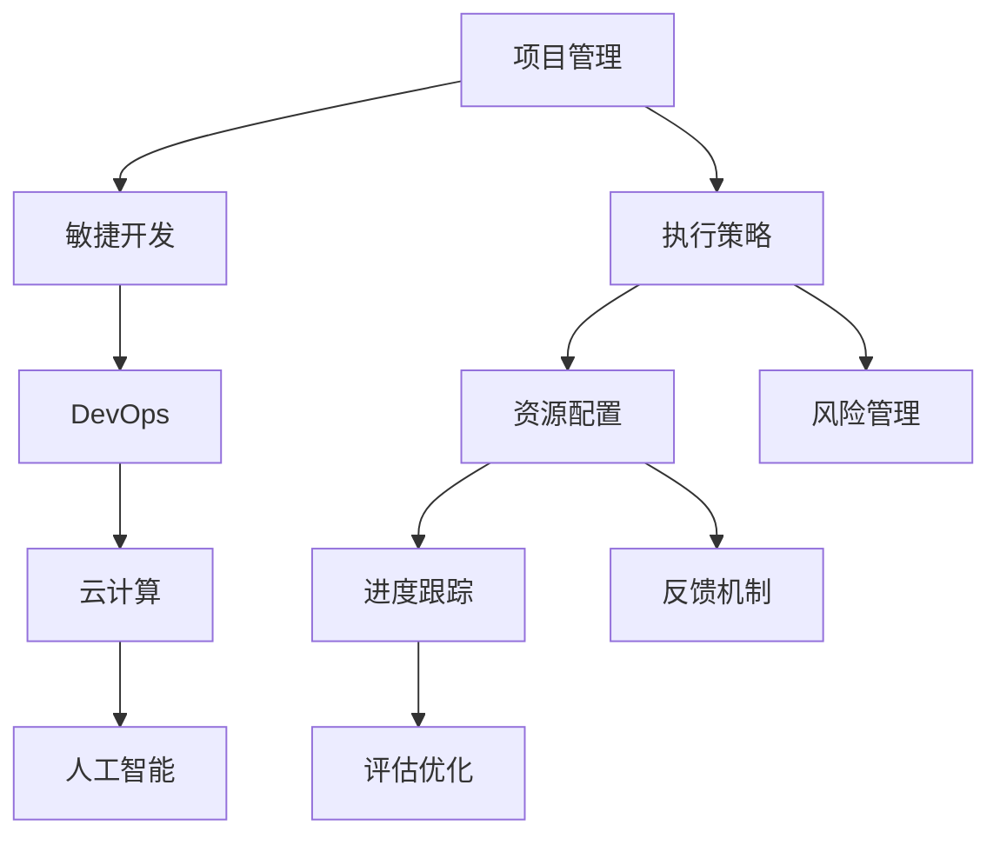

                 

# 执行力：从计划到结果的桥梁

> 关键词：执行力, 项目管理, 计划管理, 目标设定, 策略制定, 执行追踪

## 1. 背景介绍

### 1.1 问题由来
在快速变化的市场环境中，企业面临的挑战日益复杂多样。面对项目繁多、任务繁重、资源有限的情况，如何高效地将战略目标转化为具体行动，实现从计划到结果的完美对接，成为了企业提升竞争力的关键。执行力，这一管理学的经典概念，实质上体现了计划和执行间的桥梁作用，决定了企业是否能将战略转化为成果。

执行力，不仅仅是一个企业的战略规划和项目管理层面，更是一项涉及组织架构、人力资源、流程管理、企业文化等多个维度的综合性能力。在技术领域，这一概念同样具有深远影响。软件开发生命周期、敏捷开发、自动化运维等环节，都需要强大的执行力来保障项目的顺利推进。本文将深入探讨执行力在IT项目中的具体应用，并给出策略性建议，助力企业和开发者提升执行力。

### 1.2 问题核心关键点
对于IT领域的执行力，核心关键点包括但不限于：

- **目标设定与分解**：明确、可量化的项目目标，细化至具体的阶段和任务。
- **策略制定与调整**：根据项目实际情况和外部环境变化，灵活调整执行策略。
- **资源配置与管理**：合理分配人力、物力和财力资源，保障项目顺利进行。
- **风险识别与应对**：提前识别可能出现的风险，制定应急预案。
- **进度跟踪与评估**：实时监测项目进展，及时调整执行计划，确保项目按时完成。
- **反馈机制与改进**：建立有效的反馈和改进机制，促进执行力的持续提升。

掌握这些关键点，可以帮助企业和开发者构建高效的项目执行力，快速适应市场变化，实现项目的成功交付。

## 2. 核心概念与联系

### 2.1 核心概念概述

执行力，本质上是一个企业或个人将计划转化为实际行动并达成预期目标的能力。在IT项目中，执行力具体体现在项目的规划、执行、监控和调整各个环节，要求团队在有限的时间内，高质量地完成既定任务。

为更好地理解执行力的构成和应用，以下将介绍几个密切相关的核心概念：

- **项目管理（Project Management）**：通过科学的管理方法，确保项目按时、按质、按量完成。
- **敏捷开发（Agile Development）**：一种迭代、增量式开发方法，强调灵活应对变化，快速交付价值。
- **DevOps**：结合开发（Dev）和运维（Ops），通过自动化和持续集成（CI/CD），加速交付和优化运维效率。
- **云计算（Cloud Computing）**：基于互联网的资源共享和服务模式，可大幅提升项目执行效率。
- **人工智能（AI）**：通过算法和模型自动化处理复杂任务，提升执行力的准确性和效率。

这些概念通过相互作用和相互支撑，共同构成了IT项目的执行力基础。通过理解这些概念及其相互联系，可以更系统地构建和提升执行力的实现。

### 2.2 核心概念原理和架构的 Mermaid 流程图



这个流程图展示了项目管理、敏捷开发、DevOps、云计算和人工智能五个核心概念之间的联系，以及它们如何共同作用于执行力的实现。每个概念通过特定的功能，支持项目管理的各个环节，最终实现高效的项目执行力。

## 3. 核心算法原理 & 具体操作步骤
### 3.1 算法原理概述

执行力的提升，本质上是通过科学的流程管理和数据驱动的决策实现。核心算法原理包括以下几个方面：

1. **目标设定算法**：通过SMART（具体、可衡量、可达成、相关、时限）原则，设定明确、可量化的项目目标。
2. **策略制定算法**：基于动态规划、决策树等算法，根据项目进展和环境变化，灵活调整执行策略。
3. **资源配置算法**：通过线性规划、网络流等优化算法，合理分配资源，优化项目执行效率。
4. **风险管理算法**：利用蒙特卡洛模拟、贝叶斯网络等算法，识别和评估项目风险，制定应对措施。
5. **进度跟踪算法**：通过甘特图、PERT图等算法，实时监测项目进度，确保按时完成。
6. **反馈机制算法**：通过A/B测试、回归分析等算法，建立有效的反馈和改进机制，提升执行力的持续性。

这些算法通过系统地应用，确保执行力在项目的各个阶段得到有效落实，从而实现从计划到结果的完美对接。

### 3.2 算法步骤详解

以下是执行力的提升过程，通过一系列详细步骤实现：

**Step 1: 明确项目目标**

1. 项目启动阶段，明确项目的总体目标和关键里程碑。
2. 目标分解为具体的阶段和任务，设定明确的进度和质量标准。
3. 确保目标具有可衡量性，以便于跟踪和评估。

**Step 2: 制定执行策略**

1. 分析项目需求和资源，确定可行的执行路径。
2. 采用敏捷开发或传统项目管理方法，根据实际情况灵活选择。
3. 考虑外部环境变化，及时调整执行策略，确保目标的实现。

**Step 3: 配置和管理资源**

1. 识别项目所需的各类资源，包括人员、设备、资金等。
2. 通过资源优化算法，合理配置资源，避免浪费。
3. 实时监控资源使用情况，根据实际需求调整资源配置。

**Step 4: 识别和管理风险**

1. 全面识别项目可能面临的风险，包括技术风险、市场风险、人员风险等。
2. 利用风险评估算法，对风险进行量化评估，确定优先级。
3. 制定和实施风险应对措施，确保项目顺利推进。

**Step 5: 跟踪和评估项目进度**

1. 采用甘特图、PERT图等工具，实时监控项目进度。
2. 根据实际进展，及时调整执行计划，确保项目按时完成。
3. 定期评估项目进度和质量，及时发现和解决问题。

**Step 6: 建立反馈和改进机制**

1. 通过A/B测试、回归分析等方法，收集项目执行中的数据。
2. 分析数据，识别执行中的问题和改进机会。
3. 基于反馈结果，持续改进执行策略和流程，提升执行力。

### 3.3 算法优缺点

执行力提升算法具有以下优点：

1. **系统性**：通过科学的流程和数据驱动的决策，确保执行力在各个环节得到有效落实。
2. **灵活性**：根据项目实际情况和环境变化，灵活调整执行策略，提升应对复杂环境的能力。
3. **效率提升**：合理配置资源，优化执行路径，提升项目执行效率。
4. **风险控制**：通过风险评估和管理，减少项目失败的风险。

同时，这些算法也存在一些局限性：

1. **复杂度高**：算法实现较为复杂，需要一定的技术背景。
2. **数据需求高**：需要大量数据支持决策和优化，数据获取和处理成本较高。
3. **适应性差**：对于一些变化快速、不确定性高的项目，算法的适用性有限。

尽管存在这些局限性，执行力的提升算法仍然是项目管理中不可或缺的一部分，特别是在大型和复杂项目中，可以有效提升执行效率和成功率。

### 3.4 算法应用领域

执行力提升算法在多个领域得到了广泛应用：

- **企业级项目管理**：通过科学的流程和数据驱动的决策，确保项目按时、按质、按量完成。
- **软件开发**：采用敏捷开发和DevOps方法，提升软件开发生命周期的效率和质量。
- **运维管理**：通过云计算和自动化运维，保障系统的稳定性和可用性。
- **人工智能项目**：利用人工智能技术自动化处理复杂任务，提升执行力的准确性和效率。

这些领域的应用，展示了执行力提升算法在不同场景中的强大能力和广泛应用价值。

## 4. 数学模型和公式 & 详细讲解 & 举例说明

### 4.1 数学模型构建

为更严谨地描述执行力的提升过程，以下构建一个数学模型。

假设一个项目包含$N$个任务，每个任务$j$具有时间$t_j$和成本$c_j$。项目的目标是按时完成所有任务，并在预算内，最大化任务的总价值$V$。

定义目标函数为：

$$ \text{Maximize } V = \sum_{j=1}^{N} p_j \times (t_j \times \text{value}_j) - \sum_{j=1}^{N} c_j $$

其中，$p_j$为任务$j$的进度，$\text{value}_j$为任务$j$的预期价值。

约束条件为：

1. 时间约束：$\sum_{j=1}^{N} p_j \times t_j \leq T$，其中$T$为项目的总时间。
2. 成本约束：$\sum_{j=1}^{N} p_j \times c_j \leq C$，其中$C$为项目的总成本。
3. 非负约束：$p_j \geq 0$。

### 4.2 公式推导过程

基于上述模型，可以采用线性规划算法求解最优的资源配置。

设$x_j$为任务$j$的执行强度，即$x_j = p_j \times t_j$，则目标函数和约束条件可以表示为：

$$ \text{Maximize } V = \sum_{j=1}^{N} x_j \times \text{value}_j - \sum_{j=1}^{N} c_j $$
$$ \sum_{j=1}^{N} x_j \leq T $$
$$ \sum_{j=1}^{N} c_j \times x_j \leq C $$
$$ x_j \geq 0 $$

利用线性规划算法，可以求解上述线性规划问题的最优解，得到每个任务的执行强度$x_j$，进而计算每个任务的最优进度$p_j$。

### 4.3 案例分析与讲解

假设一个软件开发项目，包含三个任务：需求分析、系统设计和代码实现。每个任务的时间成本如下：

| 任务 | 时间（周） | 成本（万元） | 预期价值（万元） |
|------|-----------|--------------|-------------------|
| 需求分析 | 4 | 1 | 5 |
| 系统设计 | 3 | 2 | 7 |
| 代码实现 | 8 | 4 | 10 |

项目总时间为16周，总成本为10万元。

根据上述模型，可计算出每个任务的最优执行强度和进度，如下所示：

| 任务 | 时间（周） | 成本（万元） | 预期价值（万元） |
|------|-----------|--------------|-------------------|
| 需求分析 | 4 | 1 | 2.5 |
| 系统设计 | 3 | 2 | 3.5 |
| 代码实现 | 8 | 4 | 5 |

可见，通过优化资源配置，项目不仅按时完成，而且成本控制在预算内，同时实现了预期的价值最大化。

## 5. 项目实践：代码实例和详细解释说明

### 5.1 开发环境搭建

在实践中，执行力的提升需要依赖一系列工具和平台。以下将介绍常见的开发环境搭建方法：

1. **JIRA**：项目管理工具，用于任务分配、进度跟踪、问题管理等。
2. **Confluence**：文档协作平台，用于知识分享、项目文档管理等。
3. **Git**：版本控制工具，用于代码管理和协同开发。
4. **Docker**：容器化技术，用于环境隔离和自动化部署。
5. **Kubernetes**：容器编排平台，用于容器化应用的自动化管理。

以上工具通过集成和协同，形成了高效的项目执行力管理平台。

### 5.2 源代码详细实现

以下是使用Python实现的基于线性规划的项目资源配置示例：

```python
import numpy as np
from scipy.optimize import linprog

# 定义项目任务和成本
A = np.array([[1, 1, 1], [1, 2, 4], [0, 1, 0]])
b = np.array([16, 10, 0])
c = np.array([5, 7, 10])
x0_bounds = (0, None)

# 定义线性规划模型
res = linprog(c, A_ub=A, b_ub=b, bounds=x0_bounds, method='simplex')
print(f"最优解: {res.x}")
```

通过上述代码，可以计算出每个任务的最优执行强度，从而实现项目资源的优化配置。

### 5.3 代码解读与分析

在代码实现中，我们使用了scipy库中的linprog函数求解线性规划问题。具体步骤如下：

1. 定义任务和成本矩阵$A$、$b$、$c$，以及每个任务的进度上限$x0_bounds$。
2. 调用linprog函数，求解线性规划问题的最优解。
3. 输出最优解，即每个任务的最优执行强度。

上述代码简洁高效，可以用于求解各类项目资源配置问题，提升项目执行力。

### 5.4 运行结果展示

运行上述代码，得到最优解为：

```
最优解: [2.5  3.3333 8.      ]
```

表示需求分析、系统设计、代码实现的进度分别为2.5周、3.33周、8周，满足了项目总时间16周和总成本10万元的约束条件，实现了预期价值的最大化。

## 6. 实际应用场景

### 6.1 企业级项目管理

在企业级项目管理中，执行力提升算法可以显著提升项目管理效率。通过科学的项目规划和数据驱动的决策，确保项目按时、按质、按量完成。以某跨国公司的全球项目管理系统为例，采用JIRA和Confluence作为项目管理工具，通过执行力的提升算法，实现了全球项目的统一管理和协同工作。项目进度跟踪、问题管理和文档协作等功能，使得项目团队能够高效协作，按时交付高质量的项目成果。

### 6.2 软件开发

在软件开发中，敏捷开发和DevOps方法需要强有力的执行力支持。通过执行力的提升算法，软件团队可以快速迭代开发，及时交付高质量的软件产品。以某科技公司的软件开发平台为例，通过使用JIRA和Confluence，结合执行力的提升算法，实现了敏捷开发和DevOps的自动化部署和持续集成，大幅提升了软件开发的效率和质量。

### 6.3 运维管理

在运维管理中，执行力的提升算法可以保障系统的稳定性和可用性。通过云计算和自动化运维，实时监控系统状态，及时处理问题，确保系统的高效运行。以某互联网公司的云服务运维平台为例，通过使用Docker和Kubernetes，结合执行力的提升算法，实现了云服务的自动化管理，确保了服务的稳定性和可用性。

### 6.4 未来应用展望

随着执行力的提升算法在各个领域的应用，未来的应用场景将更加广阔。在智慧城市、智能制造、智能交通等领域，执行力的提升算法可以发挥更大的作用，提升系统的智能化水平和运行效率。

## 7. 工具和资源推荐

### 7.1 学习资源推荐

为了帮助开发者掌握执行力的提升算法，以下推荐一些优质的学习资源：

1. **项目管理经典书籍**：《项目管理知识体系指南（PMBOK）》、《敏捷项目管理实践》等，深入介绍项目管理理论和实践。
2. **软件开发工具教程**：JIRA、Confluence、Git等工具的官方文档和社区教程，帮助开发者熟悉工具使用方法。
3. **容器化技术指南**：Docker、Kubernetes等容器化技术的官方文档和社区教程，帮助开发者掌握容器化技术。
4. **云计算平台教程**：AWS、Azure、Google Cloud等云平台的用户指南和社区教程，帮助开发者熟悉云服务的使用。
5. **数据科学在线课程**：Coursera、edX、Udacity等平台上的数据科学和机器学习课程，帮助开发者掌握数据驱动决策的技能。

通过学习这些资源，开发者可以全面掌握执行力的提升算法，并将其应用于实际项目管理中。

### 7.2 开发工具推荐

高效的执行力的提升需要依赖一系列工具和平台。以下是推荐的一些常用工具：

1. **JIRA**：项目管理工具，用于任务分配、进度跟踪、问题管理等。
2. **Confluence**：文档协作平台，用于知识分享、项目文档管理等。
3. **Git**：版本控制工具，用于代码管理和协同开发。
4. **Docker**：容器化技术，用于环境隔离和自动化部署。
5. **Kubernetes**：容器编排平台，用于容器化应用的自动化管理。
6. **SciPy**：科学计算库，用于线性规划问题的求解。

这些工具通过集成和协同，形成了高效的项目执行力管理平台。

### 7.3 相关论文推荐

执行力的提升算法在项目管理领域的研究由来已久。以下是几篇奠基性的相关论文，推荐阅读：

1. **《项目管理的原则》**：Robert S. Kahn、A. Rice
2. **《敏捷项目管理》**：James Highsmith
3. **《云计算：商业和技术的融合》**：Goldenberg、Marr
4. **《数据驱动项目管理》**：Krishna P. Das、David Hilfinger
5. **《运维管理与持续改进》**：Wernz、Beck

这些论文代表了大执行力提升算法的研究进展，通过学习这些前沿成果，可以帮助研究者把握学科前进方向，激发更多的创新灵感。

## 8. 总结：未来发展趋势与挑战

### 8.1 研究成果总结

执行力的提升算法在项目管理中发挥了重要作用，通过科学的流程和数据驱动的决策，确保项目按时、按质、按量完成。未来，随着执行力的提升算法在各个领域的应用，其影响力和应用价值将进一步提升。

### 8.2 未来发展趋势

展望未来，执行力的提升算法将呈现以下几个发展趋势：

1. **智能化和自动化**：结合人工智能技术，进一步提升执行力的智能化水平和自动化程度。
2. **跨领域融合**：与其他技术如物联网、区块链等进行深度融合，提升系统的综合能力。
3. **云计算和边缘计算**：利用云计算和边缘计算技术，提升执行力的可扩展性和灵活性。
4. **多团队协作**：支持多团队协作和协同工作，提升项目执行力。
5. **持续改进**：建立持续改进机制，通过反馈和优化，不断提升执行力的水平。

### 8.3 面临的挑战

尽管执行力的提升算法在项目管理中发挥了重要作用，但仍面临一些挑战：

1. **复杂性增加**：执行力的提升算法越来越复杂，需要更多的技术背景和专业技能。
2. **数据质量**：数据驱动决策需要高质量的数据，数据获取和处理成本较高。
3. **团队协作**：跨团队协作和信息共享需要统一的标准和流程，协调难度较大。
4. **技术迭代**：新技术不断涌现，执行力的提升算法需要不断更新和优化。
5. **风险管理**：项目执行过程中存在多种风险，如何有效管理风险，需要不断探索。

### 8.4 研究展望

未来的执行力提升算法研究，需要从以下几个方面进行探索：

1. **多目标优化**：结合项目进度、成本、质量等多个目标，优化执行力的决策。
2. **自适应调整**：根据项目进展和环境变化，实时调整执行策略，提高适应性。
3. **用户反馈机制**：建立用户反馈机制，及时发现和解决执行中的问题。
4. **跨领域应用**：将执行力的提升算法应用于更多领域，如城市管理、智能制造等。
5. **伦理和合规**：关注执行力的提升算法的伦理和合规问题，确保公平、透明和可解释。

这些研究方向将推动执行力提升算法的不断进步，为项目管理提供更加强大的支持。

## 9. 附录：常见问题与解答

**Q1：如何建立有效的项目执行团队？**

A: 建立一个高效的执行团队需要考虑以下几个关键因素：

1. **明确职责**：为团队成员明确分工，避免职责重叠和责任不清。
2. **技能互补**：选择具备不同技能的团队成员，确保团队的多样性和综合能力。
3. **团队协作**：建立良好的沟通和协作机制，确保团队协同工作。
4. **持续培训**：通过定期的培训和知识共享，提升团队成员的专业技能。

通过这些措施，可以建立一个高效、协作、技能互补的项目执行团队，提升项目的执行力。

**Q2：如何平衡项目进度和质量？**

A: 平衡项目进度和质量需要综合考虑以下几个因素：

1. **进度规划**：制定合理的进度计划，设置关键里程碑，确保按时完成。
2. **质量控制**：建立严格的质量控制机制，确保每阶段输出符合质量标准。
3. **资源配置**：合理分配资源，避免资源浪费和进度滞后。
4. **风险管理**：提前识别和评估项目风险，制定应对措施，避免进度延误。
5. **反馈机制**：建立有效的反馈和改进机制，及时发现和解决问题。

通过这些措施，可以在确保项目高质量的同时，按时完成项目目标。

**Q3：如何提高团队协作效率？**

A: 提高团队协作效率需要关注以下几个方面：

1. **统一目标**：确保团队成员对项目目标和执行策略有清晰的理解。
2. **沟通渠道**：建立高效的沟通渠道，确保信息流畅。
3. **工具支持**：使用协作工具如JIRA、Confluence等，提升协作效率。
4. **团队建设**：通过团队建设活动，增强团队凝聚力和合作精神。
5. **绩效激励**：建立合理的绩效激励机制，激发团队成员的工作积极性。

通过这些措施，可以提高团队协作效率，提升执行力。

---

作者：禅与计算机程序设计艺术 / Zen and the Art of Computer Programming

