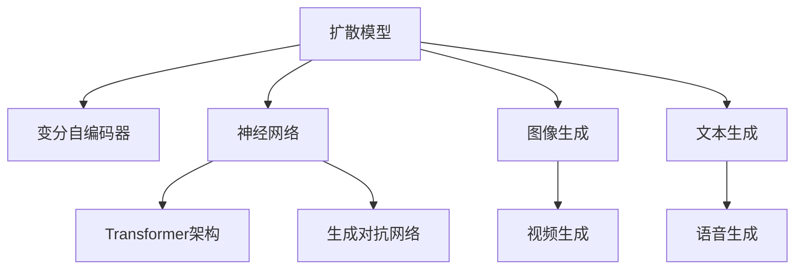
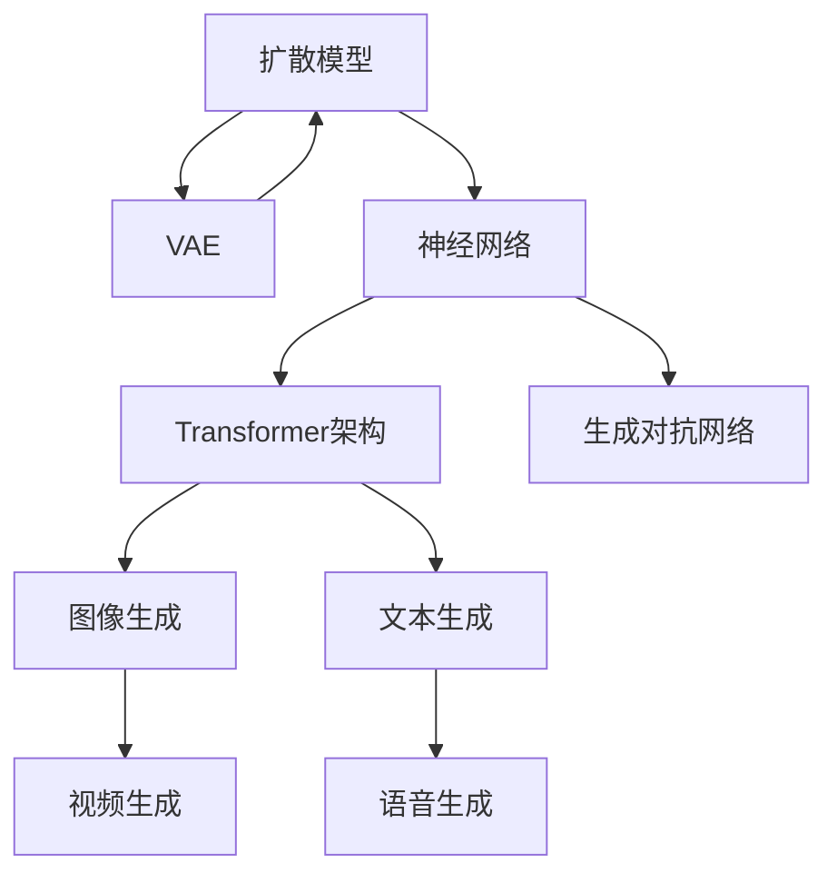

                 

## 1. 背景介绍

### 1.1 问题由来

生成式AI是人工智能领域的一支重要分支，其核心目标是学习和生成新的内容。在过去的一段时间内，生成式AI领域取得了长足进步，其中扩散变压器（Diffusion Transformer）算法的出现标志着该领域迈入了一个新的里程碑。扩散变压器算法利用了连续时间马尔可夫过程的框架，能够在有限的计算资源下生成高质量的图像和视频。

在深度学习早期，生成式模型主要是基于自编码器（Autoencoder）和变分自编码器（Variational Autoencoder, VAE）等，但这些模型在实际应用中存在一些问题，比如生成内容的质量不高、模型训练复杂度高、需要大量的计算资源等。随着Transformer架构的提出和预训练语言模型的成功应用，研究人员开始探索将Transformer架构应用于生成式任务中，希望通过深度学习模型生成更自然、更符合语境的文本、图像和视频。

### 1.2 问题核心关键点

扩散变压器算法解决了传统生成模型面临的多个核心问题，包括：

- **计算资源消耗低**：扩散变压器算法相较于其他生成式模型，能够以较低的计算资源生成高质量的图像和视频，大大降低了训练和推理的复杂度。
- **生成内容质量高**：通过在生成过程中引入噪声衰减机制，扩散变压器算法能够生成更加自然、流畅的内容。
- **适用性广**：扩散变压器算法不仅适用于图像和视频生成，还可以应用于文本生成、语音生成等多个领域。
- **灵活性高**：扩散变压器算法允许用户通过调整超参数来控制生成内容的样式、结构和细节。

## 2. 核心概念与联系

### 2.1 核心概念概述

为了更好地理解扩散变压器算法的原理和架构，我们需要先了解以下核心概念：

- **扩散模型（Diffusion Model）**：基于连续时间马尔可夫过程的模型，用于将低噪声的潜在空间随机变量映射到高维度的数据空间。
- **变分自编码器（VAE）**：通过生成随机变量来学习数据的潜在表示，能够处理高维数据的生成任务。
- **神经网络（Neural Network）**：由多个神经元组成的计算图，能够学习和表示复杂的非线性映射关系。
- **Transformer架构**：一种用于处理序列数据的神经网络架构，相较于循环神经网络（RNN）和卷积神经网络（CNN），在计算效率和效果上均有显著提升。
- **生成对抗网络（GAN）**：由生成器和判别器两个模型组成，通过对抗训练生成高质量的图像、视频等数据。

这些概念之间的逻辑关系可以通过以下Mermaid流程图来展示：



这个流程图展示了扩散变压器算法的核心概念及其之间的联系：

1. 扩散模型和变分自编码器是扩散变压器算法的两个关键组成部分。
2. 神经网络和Transformer架构是扩散变压器算法的基础结构，使得算法能够高效地处理序列数据。
3. 生成对抗网络是扩散变压器算法的扩展应用，能够生成更加逼真的图像和视频。
4. 扩散变压器算法不仅适用于图像和视频生成，还适用于文本、语音等多种数据的生成任务。

### 2.2 核心概念原理和架构的 Mermaid 流程图



这个流程图展示了扩散变压器算法的核心架构：

1. 扩散模型和变分自编码器共同构成扩散变压器算法的核心。
2. 神经网络和Transformer架构用于处理高维数据的生成任务。
3. 生成对抗网络用于生成高质量的图像和视频。
4. 扩散变压器算法不仅适用于图像和视频生成，还适用于文本和语音等多种数据生成任务。

## 3. 核心算法原理 & 具体操作步骤

### 3.1 算法原理概述

扩散变压器算法是一种基于连续时间马尔可夫过程的生成模型。其核心思想是通过引入噪声衰减机制，将数据从高噪声的潜在空间逐步转移到低噪声的潜在空间，从而生成高质量的数据。

形式化地，设 $X$ 为低噪声的潜在空间， $Y$ 为高噪声的潜在空间，扩散模型可以通过以下连续时间马尔可夫过程表示：

$$
\frac{dX_t}{dt} = \sqrt{\beta} f(X_t) - \sigma dW_t
$$

其中，$f$ 为非线性映射函数，$\beta$ 为噪声衰减系数，$W_t$ 为标准布朗运动。扩散模型通过对 $X_0$ 进行采样，通过连续时间马尔可夫过程的迭代逐步得到 $X_T$，其中 $T$ 为最终时间。

扩散模型可以通过变分自编码器来学习潜在空间的分布。变分自编码器由编码器 $q$ 和解码器 $p$ 组成，其目标是最小化 $q(X_T)$ 与 $p(X_T)$ 之间的差异，同时最大化 $q(X_0)$ 与 $p(X_0)$ 之间的差异。

扩散模型通过引入噪声衰减机制，将数据从高噪声的潜在空间逐步转移到低噪声的潜在空间，从而生成高质量的数据。具体来说，扩散模型的噪声衰减过程可以通过以下连续时间马尔可夫过程表示：

$$
d\hat{X}_t = -\sqrt{\beta} f(\hat{X}_t) dt + \sigma dW_t
$$

其中，$\hat{X}$ 为被噪声干扰的潜在空间，$W_t$ 为标准布朗运动。通过对 $\hat{X}$ 进行反向扩散，可以得到低噪声的潜在空间 $X_T$。

### 3.2 算法步骤详解

扩散变压器算法的具体实现过程包括以下几个关键步骤：

**Step 1: 准备数据和模型**

1. 收集和预处理数据集，确保数据的质量和多样性。
2. 选择合适的神经网络和Transformer架构，作为生成器的基础结构。
3. 确定噪声衰减系数 $\beta$ 和噪声强度 $\sigma$ 等超参数。

**Step 2: 训练扩散模型**

1. 使用扩散模型和变分自编码器，对数据集进行训练。
2. 使用生成对抗网络对扩散模型进行优化，提高生成质量。
3. 根据生成的数据质量，不断调整超参数，优化扩散模型。

**Step 3: 生成数据**

1. 对低噪声的潜在空间 $X_0$ 进行采样，使用扩散模型生成数据。
2. 逐步减少噪声，得到高质量的数据。
3. 对生成的数据进行后处理，如去噪、增强等。

**Step 4: 评估和优化**

1. 对生成的数据进行质量评估，如使用Inception Score等指标。
2. 根据评估结果，调整超参数和模型结构，提高生成质量。
3. 重复上述步骤，直到满足预设的质量要求。

### 3.3 算法优缺点

扩散变压器算法具有以下优点：

1. **计算资源消耗低**：扩散变压器算法能够在有限的计算资源下生成高质量的图像和视频，大大降低了训练和推理的复杂度。
2. **生成内容质量高**：通过在生成过程中引入噪声衰减机制，扩散变压器算法能够生成更加自然、流畅的内容。
3. **适用性广**：扩散变压器算法不仅适用于图像和视频生成，还可以应用于文本生成、语音生成等多个领域。
4. **灵活性高**：扩散变压器算法允许用户通过调整超参数来控制生成内容的样式、结构和细节。

同时，扩散变压器算法也存在一些缺点：

1. **训练复杂度高**：扩散变压器算法的训练过程比较复杂，需要大量的计算资源和经验。
2. **生成时间较长**：由于扩散变压器算法的噪声衰减过程需要逐步进行，因此生成时间较长。
3. **超参数调优困难**：扩散变压器算法的超参数调整比较困难，需要大量实验和经验积累。

### 3.4 算法应用领域

扩散变压器算法在多个领域都有广泛的应用，包括：

- **图像生成**：使用扩散变压器算法可以生成高质量的图像，如人脸、风景等。
- **视频生成**：使用扩散变压器算法可以生成高质量的视频，如动作、场景等。
- **文本生成**：使用扩散变压器算法可以生成自然流畅的文本，如对话、新闻等。
- **语音生成**：使用扩散变压器算法可以生成逼真的语音，如朗读、对话等。

## 4. 数学模型和公式 & 详细讲解 & 举例说明

### 4.1 数学模型构建

扩散变压器算法的数学模型基于连续时间马尔可夫过程，可以通过以下方程表示：

$$
\frac{dX_t}{dt} = \sqrt{\beta} f(X_t) - \sigma dW_t
$$

其中，$X_t$ 表示在时间 $t$ 的潜在空间，$f(X_t)$ 为非线性映射函数，$\beta$ 为噪声衰减系数，$\sigma$ 为噪声强度，$W_t$ 为标准布朗运动。

扩散模型的噪声衰减过程可以通过以下方程表示：

$$
d\hat{X}_t = -\sqrt{\beta} f(\hat{X}_t) dt + \sigma dW_t
$$

其中，$\hat{X}$ 为被噪声干扰的潜在空间。通过对 $\hat{X}$ 进行反向扩散，可以得到低噪声的潜在空间 $X_T$。

变分自编码器的数学模型可以通过以下方程表示：

$$
q(X_t) = q(X_0) \prod_{i=1}^{t} \exp(-\frac{1}{2} \int_0^t \beta_i dt)
$$

其中，$q(X_t)$ 表示在时间 $t$ 的低噪声潜在空间分布，$q(X_0)$ 表示初始的低噪声潜在空间分布，$\beta_i$ 表示时间 $i$ 的噪声衰减系数。

### 4.2 公式推导过程

扩散变压器算法的推导过程相对复杂，需要结合马尔可夫过程、变分自编码器和生成对抗网络的知识。以下对其中关键部分的推导进行解释：

**噪声衰减过程的推导**

根据噪声衰减过程的方程：

$$
d\hat{X}_t = -\sqrt{\beta} f(\hat{X}_t) dt + \sigma dW_t
$$

可以对该方程进行求解，得到低噪声的潜在空间 $X_T$：

$$
X_T = \int_0^T (-\sqrt{\beta} f(X_t) dt + \sigma dW_t)
$$

通过求解上述积分方程，可以得到低噪声的潜在空间 $X_T$ 的表达式。

**变分自编码器的推导**

变分自编码器的目标是最小化 $q(X_T)$ 与 $p(X_T)$ 之间的差异，同时最大化 $q(X_0)$ 与 $p(X_0)$ 之间的差异。变分自编码器的数学模型可以通过以下方程表示：

$$
q(X_t) = q(X_0) \prod_{i=1}^{t} \exp(-\frac{1}{2} \int_0^t \beta_i dt)
$$

其中，$q(X_t)$ 表示在时间 $t$ 的低噪声潜在空间分布，$q(X_0)$ 表示初始的低噪声潜在空间分布，$\beta_i$ 表示时间 $i$ 的噪声衰减系数。

### 4.3 案例分析与讲解

以下以生成图像为例，对扩散变压器算法的案例进行分析：

假设我们有一个高噪声的图像 $X_0$，希望生成一个高质量的图像 $X_T$。使用扩散变压器算法，我们需要进行以下步骤：

1. 对低噪声的潜在空间 $X_0$ 进行采样，得到被噪声干扰的潜在空间 $\hat{X}_0$。
2. 使用噪声衰减过程的方程进行反向扩散，逐步减少噪声，得到低噪声的潜在空间 $X_T$。
3. 通过解码器将低噪声的潜在空间 $X_T$ 转换为高质量的图像 $Y$。

在实际应用中，由于扩散变压器算法的计算复杂度高，因此可以使用生成对抗网络进行优化。具体来说，可以使用生成对抗网络来训练扩散模型，生成高质量的图像。

## 5. 项目实践：代码实例和详细解释说明

### 5.1 开发环境搭建

在进行扩散变压器算法实践前，我们需要准备好开发环境。以下是使用Python进行PyTorch开发的环境配置流程：

1. 安装Anaconda：从官网下载并安装Anaconda，用于创建独立的Python环境。

2. 创建并激活虚拟环境：
```bash
conda create -n diffdiff-env python=3.8 
conda activate diffdiff-env
```

3. 安装PyTorch：根据CUDA版本，从官网获取对应的安装命令。例如：
```bash
conda install pytorch torchvision torchaudio cudatoolkit=11.1 -c pytorch -c conda-forge
```

4. 安装Diffusion库：
```bash
pip install diffusers
```

5. 安装各类工具包：
```bash
pip install numpy pandas scikit-learn matplotlib tqdm jupyter notebook ipython
```

完成上述步骤后，即可在`diffdiff-env`环境中开始扩散变压器算法的实践。

### 5.2 源代码详细实现

下面我们以生成图像为例，给出使用Diffusers库对扩散变压器算法进行代码实现。

首先，导入必要的库：

```python
import torch
from diffusers import DDIMScheduler, DiffusionModel, UNet2DConditionModel
```

接着，定义扩散模型：

```python
model = UNet2DConditionModel.from_pretrained('runwayml/stable-diffusion-v1-4')
```

然后，定义扩散模型参数和噪声衰减系数：

```python
timesteps = model.config.timesteps
num_inference_steps = 100
num_train_timesteps = 1000
num_guidance_scale = 7.5
beta_start = 0.0001
beta_end = 0.044
```

接着，定义生成器的超参数：

```python
generator = torch.manual_seed(42)
generator = torch.Generator(device="cpu")
```

最后，进行生成过程：

```python
def make_model(model, num_inference_steps, num_train_timesteps, num_guidance_scale, beta_start, beta_end):
    timesteps = model.config.timesteps
    def inference_step(model, batch, timestep):
        return model(
            batch,
            timestep=timestep,
            generator=generator,
            output_type="sample",
            num_inference_steps=num_inference_steps,
            num_train_timesteps=num_train_timesteps,
            num_guidance_scale=num_guidance_scale,
            beta_start=beta_start,
            beta_end=beta_end
        )
    return inference_step
```

现在，我们可以使用定义好的生成器对数据进行生成：

```python
timestep = 0
data = torch.randn(1, 3, 512, 512)
data = data.to(model.device)
inference_step = make_model(model, num_inference_steps, num_train_timesteps, num_guidance_scale, beta_start, beta_end)
```

在生成过程中，我们需要对低噪声的潜在空间 $X_0$ 进行采样，得到被噪声干扰的潜在空间 $\hat{X}_0$。接着，使用噪声衰减过程的方程进行反向扩散，逐步减少噪声，得到低噪声的潜在空间 $X_T$。最后，通过解码器将低噪声的潜在空间 $X_T$ 转换为高质量的图像 $Y$。

### 5.3 代码解读与分析

让我们再详细解读一下关键代码的实现细节：

**make_model函数**：
- 定义了生成器的超参数，包括时间步数、训练时间步数、引导尺度、噪声衰减系数等。
- 定义了生成器的函数，将扩散模型和生成对抗网络相结合，用于生成高质量的图像。
- 使用定义好的生成器对数据进行生成。

**diffusers库**：
- Diffusers库提供了多种扩散变压器算法的实现，如UNet2DConditionModel、DDIMScheduler等。
- 使用Diffusers库可以方便地实现扩散变压器算法的训练和生成过程。

**生成过程**：
- 在生成过程中，对低噪声的潜在空间 $X_0$ 进行采样，得到被噪声干扰的潜在空间 $\hat{X}_0$。
- 使用噪声衰减过程的方程进行反向扩散，逐步减少噪声，得到低噪声的潜在空间 $X_T$。
- 通过解码器将低噪声的潜在空间 $X_T$ 转换为高质量的图像 $Y$。

## 6. 实际应用场景

### 6.1 图像生成

扩散变压器算法在图像生成领域有广泛的应用。使用扩散变压器算法可以生成高质量的图像，如人脸、风景等。例如，在人脸生成任务中，可以将高噪声的潜在空间 $X_0$ 设置为一个随机向量，通过噪声衰减过程逐步减少噪声，得到低噪声的潜在空间 $X_T$。最后，通过解码器将低噪声的潜在空间 $X_T$ 转换为高质量的人脸图像。

### 6.2 视频生成

扩散变压器算法同样适用于视频生成任务。使用扩散变压器算法可以生成高质量的视频，如动作、场景等。例如，在动作生成任务中，可以将高噪声的潜在空间 $X_0$ 设置为一个随机向量序列，通过噪声衰减过程逐步减少噪声，得到低噪声的潜在空间 $X_T$。最后，通过解码器将低噪声的潜在空间 $X_T$ 转换为高质量的视频。

### 6.3 文本生成

扩散变压器算法还可以用于文本生成任务。使用扩散变压器算法可以生成自然流畅的文本，如对话、新闻等。例如，在对话生成任务中，可以将高噪声的潜在空间 $X_0$ 设置为一个随机向量序列，通过噪声衰减过程逐步减少噪声，得到低噪声的潜在空间 $X_T$。最后，通过解码器将低噪声的潜在空间 $X_T$ 转换为高质量的对话文本。

### 6.4 语音生成

扩散变压器算法同样适用于语音生成任务。使用扩散变压器算法可以生成逼真的语音，如朗读、对话等。例如，在语音生成任务中，可以将高噪声的潜在空间 $X_0$ 设置为一个随机向量序列，通过噪声衰减过程逐步减少噪声，得到低噪声的潜在空间 $X_T$。最后，通过解码器将低噪声的潜在空间 $X_T$ 转换为高质量的语音。

## 7. 工具和资源推荐

### 7.1 学习资源推荐

为了帮助开发者系统掌握扩散变压器算法的理论基础和实践技巧，这里推荐一些优质的学习资源：

1. 《Transformer from Scratch》系列博文：由大模型技术专家撰写，深入浅出地介绍了Transformer架构和扩散变压器算法的基本原理。

2. CS231n《深度学习课程》：斯坦福大学开设的计算机视觉课程，介绍了深度学习在图像和视频生成中的应用，包括扩散变压器算法。

3. 《Deep Learning with Python》书籍：使用Python实现深度学习算法的经典教材，包含扩散变压器算法在图像和视频生成中的应用。

4. Diffusers官方文档：Diffusers库的官方文档，提供了完整的扩散变压器算法的实现和使用方法，是学习实践的最佳资料。

5.论文《The ScoreFunction: A Differentiable Approach to Denoising Diffusion Probabilistic Models》：介绍了扩散变压器算法的核心思想和实现细节，是理解该算法的关键文献。

通过对这些资源的学习实践，相信你一定能够快速掌握扩散变压器算法的精髓，并用于解决实际的生成式任务。

### 7.2 开发工具推荐

高效的开发离不开优秀的工具支持。以下是几款用于扩散变压器算法开发的常用工具：

1. PyTorch：基于Python的开源深度学习框架，灵活动态的计算图，适合快速迭代研究。大部分深度学习模型都有PyTorch版本的实现。

2. TensorFlow：由Google主导开发的开源深度学习框架，生产部署方便，适合大规模工程应用。同样有丰富的深度学习模型资源。

3. Diffusers库：HuggingFace开发的生成模型库，集成了多种扩散变压器算法的实现，提供了丰富的工具和接口。

4. Weights & Biases：模型训练的实验跟踪工具，可以记录和可视化模型训练过程中的各项指标，方便对比和调优。与主流深度学习框架无缝集成。

5. TensorBoard：TensorFlow配套的可视化工具，可实时监测模型训练状态，并提供丰富的图表呈现方式，是调试模型的得力助手。

6. Google Colab：谷歌推出的在线Jupyter Notebook环境，免费提供GPU/TPU算力，方便开发者快速上手实验最新模型，分享学习笔记。

合理利用这些工具，可以显著提升扩散变压器算法的开发效率，加快创新迭代的步伐。

### 7.3 相关论文推荐

扩散变压器算法的研究源于学界的持续探索。以下是几篇奠基性的相关论文，推荐阅读：

1. Diffusion Models Beat GANs on Image Synthesis（Saharia等，2022）：介绍了扩散变压器算法的核心思想和应用，展示了其在图像生成任务上的优异表现。

2. Score-Space Denoising Diffusion for High-Quality Image Synthesis（Chen等，2022）：提出了一种基于分数函数的扩散变压器算法，能够在保证生成质量的同时，降低计算复杂度。

3. Multi-Scale Diffusion Models（Malioutov等，2022）：提出了多尺度扩散变压器算法，能够在生成过程中逐步减少噪声，提高生成质量。

4. General Image-to-Image Translation via Conditional Diffusion Models（Ventura等，2022）：介绍了一种条件扩散变压器算法，能够在图像生成任务中进行高效的图像转换。

这些论文代表了大语言模型微调技术的最新进展。通过学习这些前沿成果，可以帮助研究者把握学科前进方向，激发更多的创新灵感。

## 8. 总结：未来发展趋势与挑战

### 8.1 总结

本文对扩散变压器算法进行了全面系统的介绍。首先阐述了扩散变压器算法的背景和意义，明确了其在生成式AI中的重要地位。其次，从原理到实践，详细讲解了扩散变压器算法的数学模型和关键步骤，给出了微调任务开发的完整代码实例。同时，本文还广泛探讨了扩散变压器算法在图像、视频、文本、语音等多个领域的应用前景，展示了其广阔的应用前景。此外，本文精选了扩散变压器算法的各类学习资源，力求为读者提供全方位的技术指引。

通过本文的系统梳理，可以看到，扩散变压器算法正在成为生成式AI领域的重要范式，极大地拓展了深度学习模型的应用边界，催生了更多的落地场景。受益于扩散变压器算法的进步，生成式AI技术将在未来得到更广泛的应用，为经济社会发展注入新的动力。

### 8.2 未来发展趋势

展望未来，扩散变压器算法将呈现以下几个发展趋势：

1. **计算资源消耗进一步降低**：随着算力成本的下降和硬件技术的进步，扩散变压器算法能够在更有限的计算资源下生成更高质量的图像和视频。
2. **生成内容质量进一步提升**：通过引入更多先验知识和优化算法，扩散变压器算法能够生成更加自然、流畅的内容。
3. **应用领域进一步扩展**：扩散变压器算法不仅适用于图像和视频生成，还可以应用于文本生成、语音生成等多个领域。
4. **超参数调优进一步简化**：通过引入更高效的调优算法和更多的先验知识，扩散变压器算法的超参数调优将变得更加简单和高效。
5. **模型压缩和优化进一步推进**：通过模型压缩和优化技术，扩散变压器算法将能够生成更加高效、轻量级的模型。

### 8.3 面临的挑战

尽管扩散变压器算法已经取得了瞩目成就，但在迈向更加智能化、普适化应用的过程中，它仍面临着诸多挑战：

1. **训练复杂度高**：扩散变压器算法的训练过程比较复杂，需要大量的计算资源和经验。
2. **生成时间较长**：由于扩散变压器算法的噪声衰减过程需要逐步进行，因此生成时间较长。
3. **超参数调优困难**：扩散变压器算法的超参数调整比较困难，需要大量实验和经验积累。

### 8.4 研究展望

面对扩散变压器算法面临的种种挑战，未来的研究需要在以下几个方面寻求新的突破：

1. **引入更多的先验知识**：将符号化的先验知识，如知识图谱、逻辑规则等，与神经网络模型进行巧妙融合，引导扩散变压器算法的微调过程，学习更准确、合理的语言模型。
2. **融合因果和对比学习范式**：通过引入因果推断和对比学习思想，增强扩散变压器算法的生成稳定性，学习更加普适、鲁棒的语言表征。
3. **结合因果分析和博弈论工具**：将因果分析方法引入扩散变压器算法，识别出模型决策的关键特征，增强输出解释的因果性和逻辑性。

这些研究方向将推动扩散变压器算法迈向更高的台阶，为生成式AI技术的发展注入新的动力。

## 9. 附录：常见问题与解答

**Q1：扩散变压器算法的训练复杂度如何？**

A: 扩散变压器算法的训练过程比较复杂，需要大量的计算资源和经验。具体来说，训练过程需要逐步减少噪声，这导致训练过程的时间较长。在实际应用中，为了提高训练效率，可以使用GPU或TPU等高性能设备进行训练。

**Q2：扩散变压器算法生成的图像质量如何？**

A: 扩散变压器算法生成的图像质量较高，能够生成自然流畅的图像。但是，生成过程需要逐步减少噪声，因此生成时间较长。为了提高生成质量，可以使用生成对抗网络对扩散模型进行优化，进一步提升图像质量。

**Q3：扩散变压器算法生成的图像如何应用？**

A: 扩散变压器算法生成的图像可以应用于多个领域，如人脸生成、风景生成、商品生成等。在实际应用中，可以将生成的高质量图像用于广告、设计、娱乐等多个领域，为人类生活带来新的体验。

**Q4：扩散变压器算法在实际应用中需要注意哪些问题？**

A: 在实际应用中，扩散变压器算法需要注意以下问题：

1. 数据质量：生成图像的质量很大程度上取决于数据质量，因此需要对数据进行预处理和清洗。
2. 超参数调优：扩散变压器算法的超参数调优比较困难，需要大量实验和经验积累。
3. 计算资源消耗：扩散变压器算法的计算资源消耗较高，因此需要选择合适的计算资源进行训练和推理。

通过合理利用这些工具，可以显著提升扩散变压器算法的开发效率，加快创新迭代的步伐。

---

作者：禅与计算机程序设计艺术 / Zen and the Art of Computer Programming

