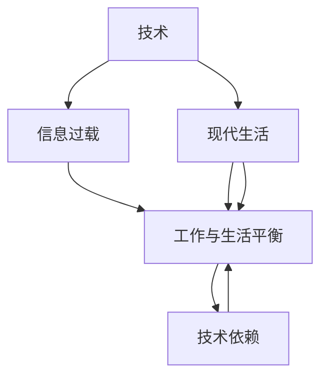

                 

# 技术、信息过载与现代生活：如何找到平衡

> 关键词：技术, 信息过载, 现代生活, 平衡, 工作, 学习, 健康, 娱乐

## 1. 背景介绍

### 1.1 问题由来
在信息化高速发展的今天，技术的进步极大地改变了我们的生活方式。智能手机、移动互联网、社交媒体、人工智能等各种技术的涌现，使得信息传播的速度和规模达到了前所未有的高度。然而，这些技术的双刃剑效应也逐渐显现，即信息过载现象。信息过载不仅给个人的工作、学习、生活带来困扰，更引发了关于如何在技术助力下找到工作与生活的平衡的广泛讨论。

### 1.2 问题核心关键点
1. **技术快速发展**：信息技术的飞速发展，使得我们被海量数据、不断更新的软件和应用所包围。
2. **信息过载现象**：过量的信息流使得注意力和精力的分配变得困难，认知负荷加重，信息处理效率下降。
3. **工作生活平衡**：技术虽然极大提高了生产效率，但同时也加剧了工作和生活的边界模糊，对心理健康带来威胁。
4. **技术依赖**：现代生活中对技术的高度依赖，使得对技术的反思和控制变得更加重要。

### 1.3 问题研究意义
研究如何在技术驱动的信息社会中寻找平衡，对于提升个体的工作效率和生活质量，促进社会整体的健康发展，具有重要意义：

1. **提高工作与生活的平衡度**：避免因信息过载导致的注意力分散和工作效率下降。
2. **促进心理健康**：减少因技术依赖和信息过载带来的焦虑和压力。
3. **推动技术健康发展**：鼓励技术开发者在设计产品时考虑用户健康，减少不良影响。
4. **支持社会和谐**：帮助社会成员适应技术变化，提升技术素养，构建健康的信息生态。

## 2. 核心概念与联系

### 2.1 核心概念概述

为更好地理解技术、信息过载和现代生活之间的关联，本节将介绍几个密切相关的核心概念：

- **技术**：广义上指应用于实践中的各种手段和工具，包括但不限于软件、硬件、信息处理技术等。
- **信息过载**：指人们在短时间内接收到超出其处理能力的信息量，导致认知负荷增加、注意力分散、信息处理效率下降的现象。
- **现代生活**：现代社会中，技术无处不在，影响着个体的工作、学习、娱乐和社交等方面。
- **工作与生活平衡**：在面对技术带来的便利和挑战时，如何有效管理时间和精力，确保工作效率和身心健康。
- **技术依赖**：个体在现代生活中对技术的高度依赖，导致对技术的依赖性增加，难以脱离。

这些核心概念之间的逻辑关系可以通过以下Mermaid流程图来展示：



这个流程图展示了技术、信息过载、现代生活、工作与生活平衡和技术依赖之间的内在联系：

1. 技术驱动了信息传播的广泛和快速，引发了信息过载。
2. 信息过载影响了现代生活，导致工作和生活的边界模糊，加重了认知负荷。
3. 工作与生活平衡是应对信息过载和现代生活挑战的策略之一。
4. 技术依赖加剧了信息过载和工作与生活的平衡问题。

## 3. 核心算法原理 & 具体操作步骤

### 3.1 算法原理概述

解决技术、信息过载和现代生活平衡问题，可以从优化信息处理、调整工作生活习惯、以及提升技术素养等多个方面入手。其中，信息处理优化是基础，而生活习惯和技术素养的提升则是关键。以下将从信息处理优化的角度出发，详细讲解基于监督学习的信息筛选和优先级管理算法。

### 3.2 算法步骤详解

#### 3.2.1 信息分类与筛选
通过自然语言处理(NLP)和机器学习技术，对接收到的信息进行分类和筛选，将重要信息从海量信息中提取出来，以减少认知负荷。

1. **信息分类**：使用分类算法将信息按照主题、重要性、紧急性等维度分类，帮助用户快速识别出关键信息。
2. **信息筛选**：利用聚类和排序算法，对分类后的信息进行进一步筛选，去除无价值的信息，保留对用户最有帮助的信息。

#### 3.2.2 优先级管理
通过模型预测信息的优先级，帮助用户有效管理时间和精力，避免因信息过载导致的注意力分散。

1. **优先级预测**：构建预测模型，根据信息的主题、来源、重要性等特征，预测信息的优先级。
2. **时间管理**：结合用户的日常工作和生活习惯，调整优先级预测模型的参数，确保模型输出的优先级排序符合用户的实际需求。

#### 3.2.3 时间管理与任务调度
通过优化时间管理和任务调度，合理分配时间和精力，确保工作和生活的高效协同。

1. **时间块分配**：将一天分成若干时间块，每个时间块分配特定的任务或活动，确保任务间的时间冲突最小化。
2. **任务优先级排序**：根据优先级预测结果，对任务进行排序，确保高优先级任务优先完成。

### 3.3 算法优缺点

#### 3.3.1 算法优点
1. **高效的信息处理**：通过信息分类和筛选，减少了用户的信息处理负担，提高了信息处理效率。
2. **个性化的优先级管理**：通过优先级预测和时间管理，为用户提供了个性化的信息处理策略，提升用户体验。
3. **适应性强**：算法可以根据用户的反馈和行为数据，不断调整和优化，适应不同用户和场景。

#### 3.3.2 算法缺点
1. **数据依赖性**：算法的性能很大程度上依赖于训练数据的质量和数量，难以处理非结构化数据。
2. **模型复杂度**：构建高效的优先级预测模型需要复杂的算法设计和大量计算资源，不易实现。
3. **用户参与度**：算法的优化需要用户的反馈和调整，用户参与度不高可能导致模型效果不理想。

### 3.4 算法应用领域

#### 3.4.1 工作场景
在办公室和远程办公场景中，信息分类与筛选和优先级管理可以帮助员工高效管理邮件、会议、任务等，提升工作效率。

#### 3.4.2 学习场景
在教育和学习场景中，信息分类与筛选可以帮助学生快速找到所需的学习资源，避免信息过载。优先级管理可以帮助学生合理安排学习时间，提升学习效果。

#### 3.4.3 娱乐和社交
在娱乐和社交场景中，信息分类与筛选可以帮助用户快速浏览和筛选信息流，避免无用信息的干扰。优先级管理可以帮助用户合理安排娱乐和社交活动，提升生活品质。

## 4. 数学模型和公式 & 详细讲解 & 举例说明

### 4.1 数学模型构建

为了构建基于监督学习的优先级管理模型，我们假设用户每天接收到的信息集合为 $D=\{(x_i, y_i)\}_{i=1}^N$，其中 $x_i$ 为信息的特征向量，$y_i$ 为信息的优先级标签。模型的目标是通过训练数据集 $D$，构建一个能够预测信息优先级的模型 $M$，使得模型在测试集上的预测误差最小化。

定义模型 $M$ 在输入 $x_i$ 上的损失函数为 $\ell(M(x_i),y_i)$，则在数据集 $D$ 上的经验风险为：

$$
\mathcal{L}(M) = \frac{1}{N}\sum_{i=1}^N \ell(M(x_i),y_i)
$$

模型 $M$ 可以是一个传统的机器学习模型（如逻辑回归、随机森林等），也可以是一个深度学习模型（如神经网络、卷积神经网络等）。模型的预测结果 $M(x_i)$ 可以是具体的优先级数值，也可以是优先级排序的向量。

### 4.2 公式推导过程

#### 4.2.1 逻辑回归模型
假设信息优先级 $y_i$ 只能取有限个离散值，如高、中、低。可以使用逻辑回归模型进行分类，模型的预测结果 $M(x_i)$ 为：

$$
M(x_i) = \frac{1}{1+e^{-z_i}}, \quad z_i = \omega^Tx_i + b
$$

其中 $\omega$ 为模型的参数向量，$b$ 为截距。在训练阶段，最小化损失函数：

$$
\mathcal{L}(\omega,b) = \frac{1}{N}\sum_{i=1}^N \ell(M(x_i),y_i)
$$

使用梯度下降等优化算法，更新模型参数 $\omega$ 和 $b$，使得模型在训练集上达到最小损失。

#### 4.2.2 深度学习模型
使用神经网络进行信息优先级预测，假设模型包含 $L$ 层，其中 $l$ 层的输出为 $h^{(l)}$，激活函数为 $f^{(l)}$，输入为 $x$，参数为 $\theta$。模型的预测结果 $M(x)$ 为：

$$
M(x) = f^{(L)}(h^{(L-1)})
$$

其中 $h^{(L-1)}$ 为 $L-1$ 层的输出，$f^{(L)}$ 为最后一层的激活函数。模型的损失函数为交叉熵损失：

$$
\mathcal{L}(\theta) = -\frac{1}{N}\sum_{i=1}^N \sum_{k=1}^K y_{ik}\log M_{ik}(x_i)
$$

其中 $K$ 为优先级的个数，$M_{ik}$ 表示第 $i$ 条信息属于第 $k$ 个优先级的预测概率。

### 4.3 案例分析与讲解

#### 4.3.1 案例背景
假设某企业员工每天会收到大量电子邮件，这些邮件按重要性和紧急性分为高、中、低三个优先级。企业希望通过机器学习模型，对员工接收到的邮件进行优先级预测，帮助员工高效管理邮件。

#### 4.3.2 数据准备
准备员工接收的电子邮件数据，包括邮件主题、发件人、内容、回复时间等特征。标注这些邮件的优先级标签，如高、中、低。

#### 4.3.3 模型构建
使用逻辑回归或深度学习模型构建信息优先级预测模型。以深度学习模型为例，可以选择一个多层的神经网络，包含输入层、隐藏层和输出层。输入层包含邮件的特征向量 $x$，隐藏层包含若干神经元，输出层包含 $K=3$ 个神经元，对应高、中、低三个优先级。

#### 4.3.4 训练与评估
使用训练集训练模型，最小化损失函数 $\mathcal{L}(\theta)$。在测试集上评估模型性能，使用准确率、召回率、F1-score等指标评估模型的预测效果。

## 5. 项目实践：代码实例和详细解释说明

### 5.1 开发环境搭建

在进行信息优先级管理算法实践前，我们需要准备好开发环境。以下是使用Python进行Scikit-Learn开发的环境配置流程：

1. 安装Anaconda：从官网下载并安装Anaconda，用于创建独立的Python环境。

2. 创建并激活虚拟环境：
```bash
conda create -n info_management python=3.8 
conda activate info_management
```

3. 安装Scikit-Learn：
```bash
conda install scikit-learn
```

4. 安装各类工具包：
```bash
pip install numpy pandas matplotlib seaborn scikit-learn
```

完成上述步骤后，即可在`info_management`环境中开始信息优先级管理算法的开发。

### 5.2 源代码详细实现

下面我们以信息优先级管理算法为例，给出使用Scikit-Learn库的Python代码实现。

首先，定义数据处理函数：

```python
import pandas as pd
from sklearn.model_selection import train_test_split
from sklearn.preprocessing import StandardScaler
from sklearn.linear_model import LogisticRegression

def load_data(file_path):
    data = pd.read_csv(file_path)
    return data

def preprocess_data(data):
    features = data[['topic', 'sender', 'content', 'reply_time']]
    labels = data['priority']
    features = StandardScaler().fit_transform(features)
    return features, labels

def split_data(features, labels):
    features_train, features_test, labels_train, labels_test = train_test_split(features, labels, test_size=0.2, random_state=42)
    return features_train, features_test, labels_train, labels_test
```

然后，定义模型训练与评估函数：

```python
from sklearn.metrics import classification_report

def train_model(features_train, labels_train):
    model = LogisticRegression()
    model.fit(features_train, labels_train)
    return model

def evaluate_model(model, features_test, labels_test):
    predictions = model.predict(features_test)
    print(classification_report(labels_test, predictions))
```

最后，启动训练流程并在测试集上评估：

```python
file_path = 'emails.csv'
data = load_data(file_path)
features, labels = preprocess_data(data)
features_train, features_test, labels_train, labels_test = split_data(features, labels)
model = train_model(features_train, labels_train)
evaluate_model(model, features_test, labels_test)
```

以上就是使用Scikit-Learn对信息优先级管理算法进行开发的完整代码实现。可以看到，Scikit-Learn提供了简单易用的API，使得算法开发变得高效快捷。

### 5.3 代码解读与分析

让我们再详细解读一下关键代码的实现细节：

**load_data函数**：
- 读取电子邮件数据文件，将邮件特征和优先级标签存储为Pandas DataFrame对象。

**preprocess_data函数**：
- 提取邮件的特征向量，包括主题、发件人、内容、回复时间等。
- 对特征向量进行标准化处理，使得各特征具有相同的量级，避免某些特征的权重过大。
- 提取优先级标签。

**split_data函数**：
- 将数据集划分为训练集和测试集，进行数据集分割。

**train_model函数**：
- 定义逻辑回归模型，使用训练集进行模型训练，返回训练好的模型。

**evaluate_model函数**：
- 在测试集上使用训练好的模型进行预测，输出预测结果。
- 使用分类报告函数，评估模型的性能指标，包括准确率、召回率、F1-score等。

**训练流程**：
- 定义数据处理函数和模型训练函数。
- 加载数据，预处理数据，划分训练集和测试集。
- 使用训练集训练逻辑回归模型。
- 在测试集上评估模型性能。

可以看到，Scikit-Learn提供了丰富的模型库和工具函数，使得算法开发和评估变得简单高效。开发者可以在此基础上进行更多的创新和优化。

## 6. 实际应用场景

### 6.1 企业邮件管理

企业员工每天接收大量邮件，信息过载严重。基于信息优先级管理算法的邮件系统，可以自动将邮件分类为高、中、低三个优先级，并根据优先级自动分配邮件提醒，帮助员工高效处理邮件。

### 6.2 个人事务管理

个人可以通过信息优先级管理算法，对收到的邮件、短信、社交媒体通知等进行分类和筛选，自动安排重要事件的提醒，避免错过重要事项。

### 6.3 智能客服系统

在智能客服系统中，可以使用信息优先级管理算法对客户问题进行自动分类和优先级排序，确保高优先级问题能够快速响应和处理，提升客户满意度。

### 6.4 未来应用展望

随着信息优先级管理算法的不断优化和应用场景的扩展，未来的智能系统将更加智能和高效。可以预见，信息优先级管理算法将在更多领域得到应用，为个体和组织带来更高的效率和更好的用户体验。

## 7. 工具和资源推荐

### 7.1 学习资源推荐

为了帮助开发者掌握信息优先级管理算法的理论基础和实践技巧，这里推荐一些优质的学习资源：

1. 《Python数据科学手册》：详细介绍了Python在数据处理、机器学习、深度学习中的应用，是学习数据科学的入门必备书籍。
2. 《机器学习实战》：通过实例演示了机器学习算法的实现过程，适合初学者快速上手。
3. 《深度学习入门》：介绍了深度学习的基本概念和常用算法，适合有一定编程基础的读者学习。
4. 《信息检索与文本挖掘》：涵盖了信息检索和文本挖掘的基本算法和应用场景，适合学习NLP技术。
5. 《自然语言处理综论》：全面介绍了自然语言处理的技术和应用，是NLP领域的经典教材。

通过对这些资源的学习实践，相信你一定能够快速掌握信息优先级管理算法的精髓，并用于解决实际的NLP问题。

### 7.2 开发工具推荐

高效的开发离不开优秀的工具支持。以下是几款用于信息优先级管理算法开发的常用工具：

1. Python：Python作为数据科学的主流语言，拥有丰富的库和工具，适合进行机器学习和深度学习任务开发。
2. Jupyter Notebook：支持交互式编程和代码块的实时执行，方便开发和调试。
3. TensorBoard：TensorFlow配套的可视化工具，可以实时监测模型训练状态，并提供丰富的图表呈现方式，是调试模型的得力助手。
4. Weights & Biases：模型训练的实验跟踪工具，可以记录和可视化模型训练过程中的各项指标，方便对比和调优。

合理利用这些工具，可以显著提升信息优先级管理算法的开发效率，加快创新迭代的步伐。

### 7.3 相关论文推荐

信息优先级管理算法的发展源于学界的持续研究。以下是几篇奠基性的相关论文，推荐阅读：

1. "Logistic Regression: A Statistical Learning With Discriminative Features"：介绍了逻辑回归模型的原理和应用。
2. "Convolutional Neural Networks for Sentence Classification"：介绍了使用卷积神经网络进行文本分类的算法。
3. "Sequence to Sequence Learning with Neural Networks"：介绍了使用神经网络进行序列到序列的文本生成任务。
4. "Attention Is All You Need"：介绍了Transformer结构，开启了NLP领域的预训练大模型时代。
5. "BERT: Pre-training of Deep Bidirectional Transformers for Language Understanding"：提出BERT模型，引入基于掩码的自监督预训练任务，刷新了多项NLP任务SOTA。

这些论文代表了大语言模型微调技术的发展脉络。通过学习这些前沿成果，可以帮助研究者把握学科前进方向，激发更多的创新灵感。

## 8. 总结：未来发展趋势与挑战

### 8.1 总结

本文对基于监督学习的信息优先级管理算法进行了全面系统的介绍。首先阐述了技术、信息过载和现代生活平衡的问题由来，明确了信息优先级管理算法在解决信息过载和提升工作效率方面的独特价值。其次，从算法原理到具体实现，详细讲解了信息分类、筛选和优先级预测的算法流程，给出了算法开发的完整代码实例。同时，本文还探讨了信息优先级管理算法在实际应用场景中的应用前景，展示了算法的广阔应用潜力。

通过本文的系统梳理，可以看到，基于监督学习的信息优先级管理算法在技术驱动的信息社会中，有望成为缓解信息过载、提升工作效率的重要工具。未来，伴随技术的不断进步和应用场景的拓展，信息优先级管理算法必将在更多领域得到应用，为个体和组织带来更高的效率和更好的用户体验。

### 8.2 未来发展趋势

展望未来，信息优先级管理算法将呈现以下几个发展趋势：

1. **算法自动化**：未来算法将更加自动化，通过数据驱动的方式，自动调整优先级预测模型，适应不同用户和场景。
2. **跨平台应用**：算法将拓展到更多平台，包括桌面、移动、物联网等，适应不同设备和环境。
3. **多模态融合**：结合文本、语音、图像等多模态数据，进行综合的优先级预测和信息管理。
4. **持续学习**：算法将具备持续学习的能力，能够不断从新数据中学习，适应数据分布的变化。
5. **跨领域应用**：算法将拓展到更多领域，如医疗、金融、教育等，提升各领域的信息管理效率。

以上趋势凸显了信息优先级管理算法的广阔前景。这些方向的探索发展，必将进一步提升信息管理的智能化水平，为个体和组织带来更高的效率和更好的用户体验。

### 8.3 面临的挑战

尽管信息优先级管理算法已经取得了初步成果，但在迈向更加智能化、普适化应用的过程中，它仍面临着诸多挑战：

1. **数据依赖性**：算法的性能很大程度上依赖于训练数据的质量和数量，难以处理非结构化数据。
2. **模型复杂度**：构建高效的优先级预测模型需要复杂的算法设计和大量计算资源，不易实现。
3. **用户参与度**：算法的优化需要用户的反馈和调整，用户参与度不高可能导致模型效果不理想。
4. **隐私与安全**：算法需要处理大量的敏感数据，如何保障用户隐私和安全，避免数据泄露，将是重要的研究课题。

### 8.4 研究展望

面对信息优先级管理算法所面临的种种挑战，未来的研究需要在以下几个方面寻求新的突破：

1. **数据增强与清洗**：通过数据增强和清洗技术，提高算法的鲁棒性和泛化能力。
2. **算法轻量化**：优化算法模型结构，降低计算资源消耗，实现高效的信息处理。
3. **用户反馈机制**：建立用户反馈机制，及时调整算法参数，提高算法的适应性。
4. **隐私保护技术**：引入隐私保护技术，保障用户数据安全，避免数据泄露风险。

这些研究方向的探索，必将引领信息优先级管理算法技术迈向更高的台阶，为构建智能化的信息管理系统铺平道路。面向未来，信息优先级管理算法还需要与其他人工智能技术进行更深入的融合，如知识表示、因果推理、强化学习等，多路径协同发力，共同推动信息管理系统的进步。只有勇于创新、敢于突破，才能不断拓展信息管理的边界，让技术更好地服务于社会。

## 9. 附录：常见问题与解答

**Q1：信息优先级管理算法是否适用于所有信息类型？**

A: 信息优先级管理算法主要适用于文本信息，对于图片、音频、视频等多媒体信息，需要结合其他算法进行处理。同时，算法的性能也依赖于信息的结构化和规范化程度，对于结构化程度较低的非结构化数据，需要额外的预处理步骤。

**Q2：如何处理大规模数据集？**

A: 处理大规模数据集时，可以使用分布式计算和模型并行化技术，将数据分割为多个小块，并行处理。同时，可以采用数据增量和异步更新策略，减少数据传输和存储的资源消耗。

**Q3：如何平衡算法准确率和实时性？**

A: 在设计和实现信息优先级管理算法时，需要根据具体应用场景进行权衡。对于实时性要求较高的场景，可以采用轻量级的算法和模型结构，降低计算复杂度。对于准确率要求较高的场景，可以采用更复杂的算法和模型结构，提升预测精度。

**Q4：如何提升算法的鲁棒性和泛化能力？**

A: 通过数据增强、模型集成、对抗训练等技术，提升算法的鲁棒性和泛化能力。同时，结合领域专家的知识，引入先验信息，帮助算法更好地适应特定领域。

**Q5：如何保障算法隐私与安全？**

A: 在算法设计和实现中，需要考虑数据隐私和安全问题。可以采用数据加密、差分隐私、联邦学习等技术，保障用户数据的隐私和安全。同时，建立透明的隐私保护机制，确保算法透明和可信。

---

作者：禅与计算机程序设计艺术 / Zen and the Art of Computer Programming

