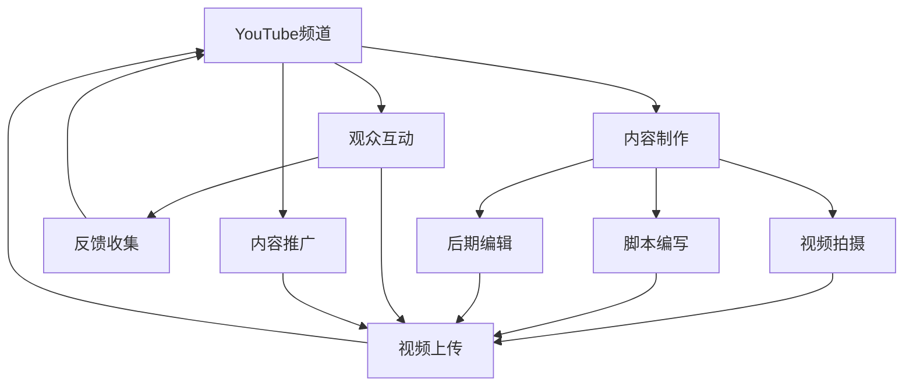

                 

# 技术分享：打造百万粉丝的技术类YouTube频道

## 1. 背景介绍

在技术类内容的创作和传播领域，YouTube无疑是最具影响力的平台之一。其庞大的用户基础、直观的视频形式以及广泛的搜索覆盖，使得YouTube成为了技术分享和知识传播的不二选择。本文将深入探讨如何打造一个成功的技术类YouTube频道，从内容创作、技术栈选择到运营策略，一步步揭秘如何实现百万粉丝的梦想。

### 1.1 问题由来

随着科技的迅猛发展，越来越多的从业者和技术爱好者希望通过网络平台分享自己的知识和经验，从而吸引更多的关注和影响力。技术类YouTube频道不仅是一个展示技术实力的舞台，也是连接技术社区、促进技术交流的重要桥梁。因此，如何高效、精准地生产并传播技术内容，成为创作者和平台管理者的共同挑战。

### 1.2 问题核心关键点

打造成功的技术类YouTube频道，需要围绕以下几个核心关键点展开：

- **内容质量**：高质量的技术内容是吸引观众的基础。技术分享不仅要有深度，更要通俗易懂，易于理解和实践。
- **观众互动**：高互动率是保持观众黏性、提升观看时间的重要手段。通过问答、评论等形式，增加与观众的互动。
- **技术栈选择**：选择适合的开发工具和技术框架，以确保内容的准确性和可操作性。
- **内容更新频率**：保持定期的内容更新，建立观众的期待感和忠诚度。
- **运营策略**：科学合理的内容推广和渠道建设，有助于提升频道的影响力和曝光度。

## 2. 核心概念与联系

### 2.1 核心概念概述

为更好地理解技术类YouTube频道的制作与运营，我们需梳理几个核心概念：

- **YouTube频道**：指在YouTube平台上的个人或机构账号，是内容传播的载体。
- **视频制作**：包括脚本编写、视频拍摄、后期编辑等环节，是技术内容创作的重要环节。
- **技术分享**：通过视频、文章等形式，将技术知识传递给观众。
- **观众互动**：观众通过评论、点赞等行为，参与内容反馈，提供有价值的反馈。
- **内容推广**：通过SEO优化、社交媒体分享、付费推广等方式，提升视频曝光和点击率。

这些概念之间存在紧密联系：内容质量直接影响观众互动，技术栈选择和内容更新频率共同决定频道的吸引力和观众黏性，运营策略则是提升整体观看时间和粉丝数量的关键。

### 2.2 核心概念原理和架构的 Mermaid 流程图



这个流程图展示了技术类YouTube频道的主要流程和关键环节：

1. 频道的建立和内容制作是基础。
2. 视频拍摄、脚本编写和后期编辑构成内容制作的核心。
3. 内容上传到YouTube平台，并进行SEO优化和推广。
4. 观众通过互动留下反馈，形成良性循环。

## 3. 核心算法原理 & 具体操作步骤

### 3.1 算法原理概述

技术类YouTube频道的成功，依赖于多种算法和策略的综合应用。以下是对核心算法原理的概述：

- **内容推荐算法**：YouTube根据用户的历史行为数据，推荐相关视频，提高用户停留时间和互动率。
- **互动数据分析**：分析观众的评论、点赞、分享等行为，优化视频内容和频道策略。
- **流量优化算法**：通过SEO、付费广告等方式提升视频排名和曝光率。

### 3.2 算法步骤详解

**Step 1: 确定频道定位与内容方向**
- 确定频道的目标受众，选择与自身技术背景和兴趣相符的内容方向。
- 制定详细的内容策略，如每周发布内容的主题和形式。

**Step 2: 脚本编写与脚本优化**
- 根据频道定位编写脚本，确保内容既有深度又通俗易懂。
- 进行脚本优化，增加故事性和趣味性，提升观众的观看体验。

**Step 3: 视频拍摄与编辑**
- 选择适合的设备和技术工具进行视频拍摄。
- 进行视频剪辑和后期编辑，添加字幕、动画和视觉效果。

**Step 4: SEO优化与内容推广**
- 对视频标题、描述和标签进行优化，提高搜索引擎排名。
- 利用社交媒体、论坛等渠道进行推广，扩大观众群体。

**Step 5: 观众互动与反馈收集**
- 积极回应用户评论和提问，建立良好的互动关系。
- 定期收集观众反馈，改进和优化内容。

**Step 6: 数据分析与调整**
- 分析观众观看数据、互动数据和推广效果，评估内容策略的有效性。
- 根据数据分析结果，调整内容策略和推广策略。

### 3.3 算法优缺点

基于上述操作步骤，以下是对这些步骤的优缺点的分析：

**优点**：
1. 有系统的规划可以确保内容制作的高效性和连贯性。
2. 科学的数据分析能指导内容的优化和改进。
3. 多渠道推广提升了内容的曝光率和覆盖面。

**缺点**：
1. 内容创作和优化需要大量的时间和精力投入。
2. 数据收集和分析较为复杂，需要专业知识支持。
3. 推广策略的调整需要持续监控和优化。

### 3.4 算法应用领域

技术类YouTube频道的应用领域非常广泛，涉及多个行业和领域，例如：

- **软件开发**：分享编程技巧、项目案例、技术栈选择等。
- **数据科学**：讲解数据分析方法、数据可视化技术、机器学习应用等。
- **网络安全**：演示安全防护技巧、漏洞分析、网络攻防案例等。
- **人工智能**：介绍AI算法、深度学习、自然语言处理等前沿技术。
- **系统运维**：讲解系统架构、性能优化、故障排查等运维经验。

## 4. 数学模型和公式 & 详细讲解 & 举例说明

### 4.1 数学模型构建

我们以视频观看时间(T)和互动率(I)的预测模型为例，介绍如何使用数学模型预测视频效果。

设$x$为影响视频效果的若干因素，如视频标题、时长、发布时间等，$T(x)$为在因素$x$下视频观看时间的预测值，$I(x)$为视频互动率的预测值。预测模型可以表示为：

$$
T(x) = \alpha_1 x_1 + \alpha_2 x_2 + \ldots + \alpha_n x_n + \beta
$$

$$
I(x) = \gamma_1 x_1 + \gamma_2 x_2 + \ldots + \gamma_n x_n + \delta
$$

其中$\alpha_i, \beta, \gamma_i, \delta$为模型的参数。

### 4.2 公式推导过程

以观看时间模型为例，我们通过最小二乘法求解参数$\alpha_i, \beta$。设样本数据为$\{(x_i, T_i)\}_{i=1}^N$，根据最小二乘法，目标为最小化：

$$
\sum_{i=1}^N (T_i - (\alpha_1 x_{i1} + \alpha_2 x_{i2} + \ldots + \alpha_n x_{in} + \beta))^2
$$

通过求解偏导数，得到：

$$
\alpha_i = \frac{\sum_{i=1}^N x_{ij}(T_i - \hat{T})}{\sum_{i=1}^N x_{ij}^2}
$$

$$
\beta = \frac{1}{N}\sum_{i=1}^N (T_i - \hat{T})
$$

其中$\hat{T} = \alpha_1 x_{11} + \alpha_2 x_{12} + \ldots + \alpha_n x_{1n}$。

### 4.3 案例分析与讲解

以一个实际案例进行讲解：某技术类YouTube频道在一个月内发布了一系列关于Python编程的视频，收集了每个视频的标题、时长、发布时间等特征，以及每个视频的观看时间和互动率数据。通过上述模型进行训练和预测，得到了以下结果：

- 观看时间模型：$T(x) = 0.5x_1 + 0.2x_2 + 1.3x_3 + 20$
- 互动率模型：$I(x) = 0.3x_1 + 0.4x_2 + 0.7x_3 + 10$

其中$x_1$为视频标题，$x_2$为视频时长，$x_3$为发布时间。通过这些模型，可以对未来的视频内容策略进行调整，以提升整体效果。

## 5. 项目实践：代码实例和详细解释说明

### 5.1 开发环境搭建

为确保视频制作和数据分析的顺利进行，我们需要一个高效、稳定的开发环境。以下是一个基本配置：

- **视频拍摄**：使用Canon EOS R5或Sony A7R IV，配备高感光度的镜头，如Sigma 18-50mm f/1.8 EX DG DN。
- **脚本编写**：使用Visual Studio Code，配置Markdown插件和Python插件。
- **视频编辑**：使用Adobe Premiere Pro或Final Cut Pro X，进行剪辑、特效添加、字幕合成等操作。
- **数据分析**：使用Python的Pandas和NumPy库，进行数据处理和分析。
- **SEO优化**：使用Google Analytics进行视频表现分析，优化视频标题、描述和标签。

### 5.2 源代码详细实现

以下是一个简化的脚本编写和视频拍摄的Python代码示例：

```python
# 脚本编写示例
def script_creating():
    with open('script.txt', 'w') as f:
        f.write("标题：Python基础教程\n")
        f.write("内容：介绍Python基础语法、数据类型和基本函数\n")
        f.write("时长：10分钟\n")
        f.write("发布时间：2023-05-01\n")
    print("脚本创建完成")

# 视频拍摄示例
def video_shooting():
    # 使用Canon EOS R5拍摄
    camera = CanvasEOSR5()
    camera.open()
    camera.set_mode('auto')
    camera.set曝光模式('M')
    camera.set快门速度(1/100)
    camera.set光圈(f/4.0)
    camera.setISO(800)
    
    camera.start_recording('Python基础教程.mov')
    camera.record(10 * 60)
    camera.stop_recording()
    
    camera.close()
    print("视频拍摄完成")

script_creating()
video_shooting()
```

### 5.3 代码解读与分析

在上述代码中，`script_creating`函数用于创建脚本文件，包含视频的标题、内容和时长等基本信息。`video_shooting`函数用于控制Canon EOS R5进行视频拍摄。

- `Camera`类模拟了摄像机的基本操作，如打开、设置模式、设置曝光等。
- `record`方法用于开启视频拍摄，`stop_recording`方法用于结束拍摄。

这些示例代码仅为简化演示，实际应用中需要根据具体的拍摄设备和软件进行调整。

### 5.4 运行结果展示

- 视频拍摄完成后，可通过剪辑软件进行视频编辑。
- 脚本创建完成后，可以将其与视频内容一同上传到YouTube平台。
- 通过数据分析，可以调整脚本编写策略和视频拍摄设置，逐步提升内容效果。

## 6. 实际应用场景

### 6.1 智能制造与工业自动化

技术类YouTube频道在智能制造和工业自动化领域的应用，能够显著提升生产效率和产品质量。通过视频分享工业4.0技术、智能传感器应用等，可以促使企业优化生产流程，提高生产自动化水平。

### 6.2 健康医疗与远程医疗

在健康医疗领域，通过分享最新的医疗技术和远程医疗案例，可以普及健康知识，提升公众健康意识。特别是在疫情期间，远程医疗技术的普及尤为重要。

### 6.3 农业科技与智慧农业

农业科技和智慧农业是技术类YouTube频道的重要应用领域之一。通过分享农机操作、精准农业技术等，可以提升农业生产效率，推动农业现代化进程。

### 6.4 未来应用展望

未来，技术类YouTube频道将进一步渗透到更多领域，与AI、大数据、物联网等前沿技术结合，推动社会进步和产业升级。预计将在以下几个方向取得突破：

1. **虚拟现实(VR)**：通过VR技术，提供沉浸式技术分享体验，提升观众的参与感和互动性。
2. **增强现实(AR)**：在技术演示、产品介绍等场景中，利用AR技术增强视觉效果。
3. **实时直播**：实时直播技术分享和答疑环节，增强观众的即时反馈和互动。
4. **人工智能(AI)**：结合AI技术进行内容创作和推荐，提升观众体验和观看效果。

## 7. 工具和资源推荐

### 7.1 学习资源推荐

- **Coursera**：提供多门技术相关的在线课程，如数据科学、机器学习、网络安全等。
- **edX**：提供全球顶尖大学的免费和付费课程，涵盖编程、人工智能、计算机科学等领域。
- **YouTube官方开发者频道**：提供最新YouTube平台技术更新和开发者指南。
- **Medium**：科技和开发领域的专业媒体平台，分享最新技术趋势和开发经验。
- **GitHub**：开放源代码社区，获取项目源代码和开发资源。

### 7.2 开发工具推荐

- **Visual Studio Code**：轻量级、功能强大的代码编辑器，支持多种编程语言和插件。
- **Adobe Premiere Pro**：视频编辑软件，功能强大、界面友好，支持高清视频编辑。
- **Final Cut Pro X**：Mac平台的视频编辑软件，适合专业级视频制作。
- **Canon EOS R5**：高像素、高感光度的单反相机，适合视频拍摄。
- **Sony A7R IV**：全画幅无反相机，支持4K视频拍摄，适合高质量视频制作。

### 7.3 相关论文推荐

- **内容推荐算法研究**：《Deep Neural Networks for YouTube Recommendations》（IEEE 2018）
- **互动数据分析**：《Understanding Interactions and Comments in Social Media Using Social Network Analysis》（SIGCHI 2010）
- **流量优化算法**：《Advertising-Aware Deep Video Recommendations》（KDD 2021）

## 8. 总结：未来发展趋势与挑战

### 8.1 总结

本文详细探讨了如何打造成功的技术类YouTube频道，从内容制作到运营推广，一步步解析了关键环节和优化策略。通过高质量的内容、积极互动和合理运营，可以有效提升频道的影响力和观众数量。

### 8.2 未来发展趋势

未来，技术类YouTube频道将朝着以下几个方向发展：

1. **多元化内容**：技术分享不再局限于编程、数据科学等，将拓展到更多新兴领域，如区块链、量子计算等。
2. **互动性增强**：通过实时直播、虚拟现实等技术，增强观众的参与感和沉浸感。
3. **智能化提升**：借助人工智能和大数据分析，提升内容的个性化推荐和优化。
4. **国际化扩展**：在多语言环境中部署频道，扩大全球观众基础。
5. **商业化运营**：通过广告、赞助、会员订阅等商业化手段，实现频道的盈利和可持续发展。

### 8.3 面临的挑战

尽管技术类YouTube频道的发展前景广阔，但仍面临诸多挑战：

1. **内容质量提升**：需要不断提升视频制作和脚本编写质量，以满足观众日益增长的期待。
2. **观众维护**：保持高互动率，防止观众流失，需要持续优化内容和运营策略。
3. **技术更新**：跟上技术发展的步伐，及时更新视频内容和技术栈。
4. **运营成本**：视频拍摄、后期编辑等环节需要较高的投入，需合理规划预算。
5. **知识产权**：保护原创内容，避免版权纠纷，需要建立完善的知识产权管理机制。

### 8.4 研究展望

面对这些挑战，未来研究需要在以下几个方面进行深入探索：

1. **自动化内容生成**：通过AI技术，自动化生成脚本和视频，提升内容创作效率。
2. **交互式视频**：结合Web技术，制作交互式视频，提供更丰富的用户交互体验。
3. **跨平台发布**：在YouTube之外，拓展到更多平台，如Bilibili、Twitch等，扩大观众基础。
4. **社区建设**：建立开发者社区，增强观众之间的交流和互动，提升频道活力。
5. **版权保护**：开发高效的版权保护技术，确保原创内容的安全性和可追溯性。

## 9. 附录：常见问题与解答

**Q1：如何选择合适的视频拍摄设备？**

A: 选择视频拍摄设备时，需考虑以下几个因素：

- **像素和分辨率**：高像素和4K分辨率的摄像机，适合高质量的视频制作。
- **感光度**：高感光度的镜头，适合低光环境下的拍摄。
- **稳定性**：稳定器、防抖器等辅助设备，有助于提升拍摄效果。

**Q2：如何进行脚本编写优化？**

A: 脚本编写优化主要从以下几个方面入手：

- **内容结构**：明确视频的主要内容和结构，确保逻辑清晰、层次分明。
- **语言风格**：语言风格应贴近观众，通俗易懂，避免过于专业。
- **视觉元素**：添加图表、动画等视觉元素，增加视觉吸引力。
- **互动设计**：设计互动环节，鼓励观众参与讨论和反馈。

**Q3：如何提升视频观看时间？**

A: 提升视频观看时间可以从以下几个方面入手：

- **内容质量**：确保视频内容有深度、有价值，满足观众需求。
- **视频长度**：适当控制视频时长，避免过长导致观众流失。
- **SEO优化**：优化视频标题、描述和标签，提高搜索结果排名。
- **互动设计**：增加视频互动环节，如问答、投票等，增加观众参与度。

**Q4：如何进行观众互动分析？**

A: 观众互动分析主要通过以下工具和数据收集：

- **YouTube Analytics**：提供观众的观看时长、互动率和观看来源等数据，帮助优化内容策略。
- **评论分析工具**：如CommentKit、MonkeyLearn，可以分析观众评论的情感倾向、话题热点等。
- **问卷调查**：定期进行观众问卷调查，获取反馈意见。

通过深入分析观众互动数据，可以不断优化内容策略，提升观众满意度和忠诚度。

---

作者：禅与计算机程序设计艺术 / Zen and the Art of Computer Programming

