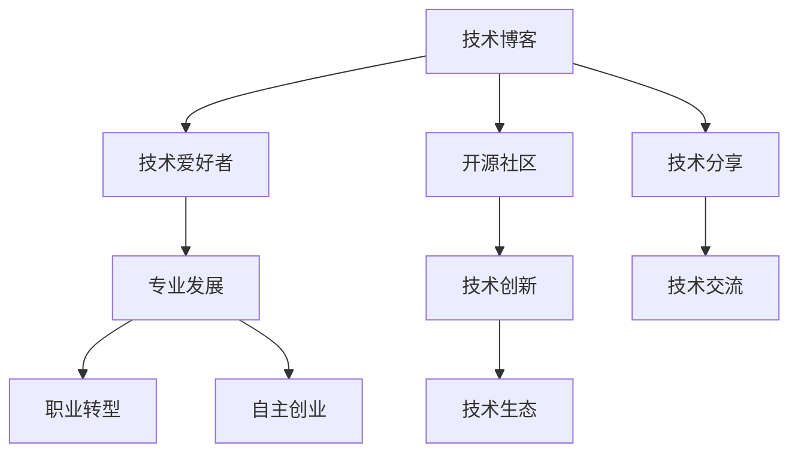

                 

# 技术博客：从爱好到主要收入来源

> 关键词：技术博客, 兴趣爱好, 程序员职业, 开源社区, 技术分享, 专业发展, 职业转型, 自主创业

## 1. 背景介绍

### 1.1 问题由来
在当今数字化和信息化的时代，技术博客已经成为人们获取技术知识和分享经验的重要平台。在过去，许多人将技术博客视为一种爱好，用来记录自己的学习心得和探索过程。然而，随着时间的推移，这种爱好逐渐演变为一种职业，很多人开始通过技术博客获取收入，实现财务自由。

### 1.2 问题核心关键点
技术博客的兴起不仅改变了人们获取知识的方式，也为技术爱好者提供了新的职业机会。技术博客的盈利模式主要包括广告收入、赞助、付费会员、课程销售等。许多人通过博客积累了大量粉丝和品牌影响力，从而实现了从兴趣爱好到主要收入来源的转变。

### 1.3 问题研究意义
研究技术博客的演变过程及其商业化途径，对于理解技术内容消费模式的变化、探索技术爱好者职业发展的路径、以及鼓励更多人加入技术博客领域具有重要意义。

## 2. 核心概念与联系

### 2.1 核心概念概述

技术博客的核心概念包括以下几个方面：

- **技术博客**：以技术为主题，通过博客形式发布技术文章，分享技术知识和经验。
- **技术爱好者**：对技术有浓厚兴趣，愿意投入时间和精力学习和实践新技术的人群。
- **开源社区**：鼓励开放源码共享，推动技术创新和合作的平台。
- **技术分享**：通过博客、视频、讲座等多种方式，将技术知识传播给他人，促进技术交流。
- **专业发展**：通过技术博客，提升个人技术水平，扩大专业影响力，为职业发展打下基础。
- **职业转型**：利用技术博客的经验和粉丝基础，转型为全职技术博客作者或相关领域的专业人士。
- **自主创业**：通过技术博客积累的资源和影响力，创建自己的技术公司或产品，实现自主创业。

这些核心概念共同构成了技术博客生态的基石，推动了技术知识的传播和应用，同时也为技术爱好者的职业发展提供了广阔的空间。

### 2.2 核心概念原理和架构的 Mermaid 流程图

这个流程图展示了技术博客与技术爱好者、开源社区、技术分享、专业发展、职业转型、自主创业以及技术创新和技术交流之间的关系。技术博客作为信息传播的媒介，促进了技术知识和经验的共享，推动了技术生态的健康发展。

## 3. 核心算法原理 & 具体操作步骤
### 3.1 算法原理概述

技术博客的运营主要依赖于内容创作和用户互动两个核心环节。内容创作是指技术爱好者通过撰写博客文章，分享技术知识、经验、项目实践等内容；用户互动是指读者通过评论、点赞、分享等方式与作者进行互动。这一过程可以通过以下几个步骤来实现：

1. 确定博客定位：技术爱好者需要确定自己的博客定位，选择适合自己的技术领域和发布频率。
2. 创作高质量内容：作者需投入时间和精力，撰写有深度、有广度、有高度的技术文章。
3. 推广和引流：通过社交媒体、搜索引擎优化（SEO）、广告投放等方式，吸引更多的读者访问博客。
4. 建立社区互动：鼓励读者在评论区留言、提问，增加互动，形成良好的社区氛围。
5. 商业化变现：通过广告收入、赞助、付费会员、课程销售等渠道实现盈利。

### 3.2 算法步骤详解

以下是技术博客运营的详细操作步骤：

**Step 1: 确定博客定位**
- 确定博客的主题领域：如前端开发、人工智能、区块链等。
- 确定发布频率：如每周更新一篇，保持稳定更新。

**Step 2: 创作高质量内容**
- 深入学习技术知识，积累实践经验。
- 使用Markdown格式撰写博客文章，便于编辑和排版。
- 撰写内容需有逻辑性、系统性，适合读者阅读和理解。

**Step 3: 推广和引流**
- 在社交媒体（如微信、微博、Twitter）发布博客内容，吸引关注。
- 使用SEO优化博客内容，提高搜索引擎排名。
- 投放广告，如Google AdSense、知乎广告等，增加访问量。

**Step 4: 建立社区互动**
- 鼓励读者留言评论，回答读者问题，增加互动。
- 建立读者微信群、QQ群，定期举办技术分享、问答等活动。
- 定期发布调查问卷，了解读者需求和反馈。

**Step 5: 商业化变现**
- 与广告平台合作，获得广告收入。
- 开设付费会员，提供专属内容、技术资料下载等。
- 推出技术培训课程，通过在线平台销售课程。
- 创建自己的技术产品，如插件、工具等，并通过博客推广。

### 3.3 算法优缺点

技术博客的运营模式有以下优缺点：

**优点：**
1. 灵活性高：技术博客运营模式灵活，可以根据个人兴趣和能力进行调整。
2. 门槛低：相比传统职业，技术博客的创业门槛较低，不需要大规模初始投资。
3. 互动性强：技术博客可以实现与读者、社区的互动，提升用户粘性。
4. 自主性强：技术博客作者可以自主选择发布内容和形式，自由度高。
5. 传播广：技术博客可以通过互联网传播，覆盖全球用户。

**缺点：**
1. 不稳定：技术博客盈利模式受读者数量和广告平台政策影响较大，存在一定的不确定性。
2. 竞争力强：随着技术博客的普及，竞争日益激烈，需要持续创新和优化。
3. 内容更新压力大：保持博客内容的持续更新，需要大量的时间和精力投入。
4. 技术要求高：需要具备较高的技术水平和写作能力，才能创作高质量内容。
5. 时间成本高：技术博客运营需要投入大量的时间精力，非全职技术爱好者难以兼顾。

### 3.4 算法应用领域

技术博客不仅限于技术分享，可以应用于多个领域，如科学、艺术、文化、教育等。以下是技术博客在不同领域的应用实例：

- **科学博客**：分享科研进展、实验结果、科学发现等，吸引科学家和爱好者。
- **艺术博客**：展示艺术作品、创作心得、艺术评论等，吸引艺术爱好者。
- **文化博客**：介绍文化历史、传统习俗、文学作品等，吸引文化研究者。
- **教育博客**：分享教育心得、学习资源、考试技巧等，吸引学生和教育工作者。
- **生活博客**：分享生活经验、旅游记录、美食心得等，吸引生活方式爱好者。

## 4. 数学模型和公式 & 详细讲解 & 举例说明

### 4.1 数学模型构建

技术博客的运营效果可以通过以下指标来衡量：

- **访问量**：衡量博客的吸引力和知名度。
- **留存率**：衡量用户粘性和互动效果。
- **转化率**：衡量博客商业化变现的效率。

假设博客的访问量为 $A$，留存率为 $R$，转化率为 $C$，博客运营的总收入为 $I$，则有：

$$
I = A \times R \times C
$$

其中 $A$、$R$、$C$ 分别表示博客的访问量、留存率和转化率。

### 4.2 公式推导过程

根据上述模型，推导访问量、留存率和转化率的关系：

- **访问量与留存率**：$A = R \times A_0$，其中 $A_0$ 为初始访问量。
- **转化率与留存率**：$C = \frac{I}{A \times R}$。

将 $A = R \times A_0$ 代入 $C = \frac{I}{A \times R}$，得：

$$
C = \frac{I}{R^2 \times A_0}
$$

从公式可以看出，转化率与留存率的平方成正比，留存率越高，转化率越稳定。因此，提高博客的留存率是提升商业化变现的关键。

### 4.3 案例分析与讲解

以技术博客为例，分析如何通过提高留存率和转化率来提升博客的商业化效果：

- **内容创新**：不断发布新的高质量内容，吸引读者关注和分享。
- **互动优化**：建立活跃的社区氛围，增加用户互动和粘性。
- **广告优化**：选择精准的广告投放策略，提高广告转化率。
- **会员制度**：通过付费会员制度，提供专属内容和福利，增加用户粘性。
- **课程销售**：开发和销售在线技术培训课程，增加博客的收入来源。

通过上述措施，可以有效提升技术博客的访问量和留存率，从而提高转化率和总收入。

## 5. 项目实践：代码实例和详细解释说明

### 5.1 开发环境搭建

技术博客的开发环境搭建主要包括以下步骤：

1. 选择博客平台：如WordPress、GitHub Pages、博客园等。
2. 安装编程环境：如Python、Java、Node.js等。
3. 选择博客框架：如Jekyll、Hexo、WordPress插件等。
4. 安装Markdown编辑器：如Typora、Atom、Visual Studio Code等。
5. 配置DNS域名和托管服务：如阿里云、腾讯云、AWS等。

### 5.2 源代码详细实现

以使用WordPress平台搭建技术博客为例，源代码实现如下：

1. **WordPress安装与配置**：
   - 在WordPress官网下载最新版本的安装包。
   - 在服务器上解压安装包，并配置数据库信息。
   - 通过FTP上传文件，访问后台进行初始化设置。

2. **安装插件**：
   - 安装必要的插件，如Yoast SEO、WP Super Cache、Jetpack等。
   - 配置SEO参数、缓存策略、安全性等设置。

3. **编写博客文章**：
   - 使用Markdown格式撰写博客文章。
   - 在WordPress后台发布文章，并进行预览和修改。
   - 添加图片、视频、代码块等元素，丰富文章内容。

4. **推广与引流**：
   - 使用SEO优化博客内容，提高搜索引擎排名。
   - 在社交媒体、论坛、博客平台上发布文章，吸引读者访问。
   - 与广告平台合作，投放广告，增加访问量。

5. **社区互动**：
   - 在文章底部添加评论功能，鼓励读者留言和互动。
   - 定期举办问答、讨论等活动，增强用户粘性。
   - 建立微信群、QQ群，提供专属讨论群。

### 5.3 代码解读与分析

在实际开发过程中，需要注意以下关键点：

**SEO优化**：使用SEO插件，优化博客标题、关键词、描述等参数，提高搜索引擎排名。

**安全设置**：启用网站安全插件，配置防火墙、反垃圾邮件等功能，确保网站安全。

**代码风格**：遵循代码规范，使用统一的编码风格，便于维护和协作。

**版本控制**：使用Git等版本控制系统，方便代码管理和版本回滚。

**测试与优化**：定期测试网站性能，优化代码和配置，确保博客稳定运行。

### 5.4 运行结果展示

运行结果展示主要包括以下方面：

- **博客访问量**：通过统计工具，如Google Analytics、百度统计等，实时监控博客访问量。
- **用户留存率**：分析用户行为数据，如页面停留时间、回访率等，评估用户粘性。
- **转化率**：统计广告点击量、付费会员数量、课程销售量等指标，评估转化效果。

## 6. 实际应用场景

### 6.1 技术博客在企业中的应用

企业可以利用技术博客作为内部技术交流和知识分享的平台，提升团队协作效率和创新能力。具体应用场景包括：

- **内部培训**：通过技术博客发布培训资料和视频，供员工学习和交流。
- **项目分享**：发布项目进展、技术突破、经验总结等内容，推动团队知识共享。
- **招聘**：通过博客展示公司技术实力和团队文化，吸引优秀技术人才加入。

### 6.2 技术博客在个人发展中的应用

技术博客不仅可以帮助技术爱好者实现财务自由，还可以提升个人品牌影响力，拓展职业机会。具体应用场景包括：

- **职业转型**：通过博客积累的资源和粉丝基础，转型为全职技术博客作者或相关领域的专业人士。
- **自主创业**：创建自己的技术公司或产品，通过博客推广和品牌建设，实现商业化运营。
- **技术合作**：与其他技术博客或开源社区建立合作，共同推动技术创新和交流。

### 6.3 技术博客在社会中的影响

技术博客在社会中的影响主要体现在以下几个方面：

- **知识普及**：通过技术博客，普及科学和技术知识，提高公众科技素养。
- **创新驱动**：推动技术创新和应用，促进经济和社会发展。
- **文化交流**：通过技术博客，展示技术作品和思想，促进文化交流和融合。

## 7. 工具和资源推荐

### 7.1 学习资源推荐

为了帮助开发者系统掌握技术博客的运营技巧，这里推荐一些优质的学习资源：

1. **《技术博客运营指南》系列博文**：由技术博客运营专家撰写，深入浅出地介绍了博客定位、内容创作、推广引流、互动社区等方面的经验和技巧。

2. **《技术博客营销》课程**：提供关于技术博客营销的课程，包括SEO优化、广告投放、社区互动等方面的知识。

3. **《技术博客成功案例》书籍**：收录了多个成功技术博客的运营经验，通过案例分析，提供实用的博客运营策略和技巧。

4. **Medium、TechCrunch等平台**：这些平台汇集了大量优秀的技术博客，可以学习他人的运营经验和思路。

5. **GrowthHackers、HackerNews等社区**：这些社区聚集了大量的博客运营者和技术爱好者，可以互相交流和学习。

通过对这些资源的学习实践，相信你一定能够快速掌握技术博客的运营技巧，并用于解决实际的博客运营问题。

### 7.2 开发工具推荐

高效的开发离不开优秀的工具支持。以下是几款用于技术博客运营开发的常用工具：

1. **WordPress、Medium、GitHub Pages**：常用的博客平台，易于使用和维护。
2. **SEO插件**：如Yoast SEO、All in One SEO Pack，优化博客内容，提升搜索引擎排名。
3. **代码编辑器**：如Visual Studio Code、Atom、Sublime Text，方便撰写和编辑博客文章。
4. **社交媒体管理工具**：如Buffer、Hootsuite，方便管理和发布社交媒体内容。
5. **数据分析工具**：如Google Analytics、百度统计，实时监控博客访问数据，评估运营效果。

合理利用这些工具，可以显著提升技术博客的运营效率，加快创新迭代的步伐。

### 7.3 相关论文推荐

技术博客的运营模式不断演进，以下是几篇奠基性的相关论文，推荐阅读：

1. **《技术博客的运营策略》**：深入分析技术博客的运营模式和策略，提供实用的博客运营建议。
2. **《博客社区的建设与维护》**：介绍博客社区的建设、管理和维护方法，促进用户互动和粘性。
3. **《技术博客的商业模式创新》**：探讨技术博客的多种商业模式，如广告、赞助、付费会员、课程销售等，提供创新的盈利思路。
4. **《技术博客的成功案例》**：分析多个成功的技术博客案例，总结其成功经验和教训。
5. **《博客的SEO优化》**：详细介绍博客SEO优化的方法和技巧，提高搜索引擎排名。

这些论文代表了大语言模型微调技术的发展脉络。通过学习这些前沿成果，可以帮助研究者把握学科前进方向，激发更多的创新灵感。

## 8. 总结：未来发展趋势与挑战

### 8.1 总结

本文对技术博客的运营模式及其商业化途径进行了全面系统的介绍。首先阐述了技术博客的兴起背景和演变过程，明确了博客运营模式和商业化途径的重要意义。其次，从内容创作、推广引流、互动社区、商业化变现等环节，详细讲解了技术博客运营的各个步骤。同时，本文还探讨了技术博客在不同领域的应用场景，提供了实用的工具和资源推荐。

通过本文的系统梳理，可以看到，技术博客不仅是一种技术分享和知识传播的媒介，更是一种职业发展的新路径。博客运营模式的多样化和灵活性，使得技术爱好者可以在保证技术热爱的同时，实现财务自由和职业转型，进一步推动技术知识和文化的传播和创新。

### 8.2 未来发展趋势

展望未来，技术博客的运营模式将呈现以下几个发展趋势：

1. **多元化内容**：技术博客将不再局限于技术分享，内容将更加多元化，涵盖科学、艺术、文化、教育等领域。
2. **社区化互动**：技术博客将更加注重社区建设和用户互动，增强用户粘性和参与感。
3. **商业化深化**：技术博客的商业模式将更加丰富，除了广告收入、付费会员、课程销售外，还将探索更多创新的盈利模式。
4. **技术创新**：技术博客将成为技术创新的重要平台，推动更多新技术和应用的诞生和发展。
5. **全球化传播**：技术博客的传播范围将更加广泛，覆盖全球用户，提升全球技术交流和合作。

### 8.3 面临的挑战

尽管技术博客的运营模式已经取得了显著成效，但在迈向更加智能化、普适化应用的过程中，它仍面临着诸多挑战：

1. **内容质量压力**：技术博客需要持续发布高质量内容，才能吸引读者和维持粉丝基础。
2. **运营成本高**：博客运营需要投入大量时间和精力，包括内容创作、平台维护、社区管理等。
3. **竞争激烈**：随着技术博客的普及，竞争日益激烈，需要持续创新和优化。
4. **读者需求变化**：读者需求不断变化，技术博客需要不断调整内容和形式，保持新鲜感。
5. **技术和安全风险**：技术博客需要应对技术和安全方面的风险，确保平台稳定运行。

### 8.4 研究展望

面对技术博客面临的这些挑战，未来的研究需要在以下几个方面寻求新的突破：

1. **内容生态建设**：建立更丰富的内容生态，吸引更多创作者和读者，形成良性循环。
2. **平台优化升级**：提升平台技术架构和服务质量，支持大规模、高流量的运营。
3. **社区治理机制**：建立社区管理机制，优化用户互动和社区氛围。
4. **商业化模式创新**：探索更多的商业化模式，如知识付费、内容付费等，实现盈利多元化。
5. **技术和安全保障**：加强技术和安全方面的保障，确保博客平台的安全稳定。

这些研究方向的探索，必将引领技术博客运营模式迈向更高的台阶，为技术爱好者提供更广阔的舞台，推动技术知识和文化的传播和创新。

## 9. 附录：常见问题与解答

**Q1：技术博客运营需要哪些关键技能？**

A: 技术博客运营需要以下关键技能：

1. **技术知识**：对所选领域的技术知识有深入理解，能够撰写高质量内容。
2. **写作能力**：具备良好的写作能力，能够清晰、准确地表达技术知识和观点。
3. **SEO优化**：了解搜索引擎优化知识，提升博客在搜索引擎中的排名。
4. **社交媒体运营**：掌握社交媒体运营技巧，吸引和维护粉丝基础。
5. **数据分析**：具备数据分析能力，实时监控和评估博客运营效果。
6. **社区管理**：能够有效管理社区，增强用户粘性和互动。
7. **商业化能力**：具备商业化运营能力，探索和实现多种盈利模式。

**Q2：如何提升技术博客的访问量和留存率？**

A: 提升技术博客的访问量和留存率可以通过以下措施：

1. **内容创新**：不断发布新的高质量内容，吸引读者关注和分享。
2. **SEO优化**：使用SEO优化博客内容，提高搜索引擎排名。
3. **互动优化**：建立活跃的社区氛围，增加用户互动和粘性。
4. **广告优化**：选择精准的广告投放策略，提高广告转化率。
5. **会员制度**：通过付费会员制度，提供专属内容、技术资料下载等，增加用户粘性。
6. **课程销售**：开发和销售在线技术培训课程，增加博客的收入来源。

**Q3：技术博客如何实现商业化变现？**

A: 技术博客的商业化变现可以通过以下渠道：

1. **广告收入**：通过广告平台获得广告收入。
2. **付费会员**：提供专属内容、技术资料下载等，吸引读者付费成为会员。
3. **课程销售**：开发和销售在线技术培训课程，增加博客的收入来源。
4. **技术产品**：创建自己的技术产品，通过博客推广和品牌建设，实现商业化运营。
5. **赞助和合作**：与企业和技术社区合作，获得赞助和资源支持。

**Q4：技术博客运营需要哪些技术和工具支持？**

A: 技术博客运营需要以下技术和工具支持：

1. **编程语言**：如Python、Java、Node.js等，方便博客内容的编写和处理。
2. **博客平台**：如WordPress、Medium、GitHub Pages等，方便博客的搭建和管理。
3. **SEO插件**：如Yoast SEO、All in One SEO Pack，优化博客内容，提升搜索引擎排名。
4. **代码编辑器**：如Visual Studio Code、Atom、Sublime Text，方便撰写和编辑博客文章。
5. **社交媒体管理工具**：如Buffer、Hootsuite，方便管理和发布社交媒体内容。
6. **数据分析工具**：如Google Analytics、百度统计，实时监控博客访问数据，评估运营效果。

**Q5：如何处理技术博客运营中的安全和隐私问题？**

A: 技术博客运营中，需要采取以下措施处理安全和隐私问题：

1. **网站安全**：使用安全插件，配置防火墙、反垃圾邮件等功能，确保网站安全。
2. **数据保护**：遵守数据保护法规，如GDPR、CCPA等，确保用户隐私安全。
3. **内容审核**：建立内容审核机制，避免发布有害和不当内容。
4. **用户反馈**：积极听取用户反馈，及时处理用户投诉和问题。
5. **法律法规**：了解和遵守相关法律法规，确保博客运营合规。

这些措施将有效提升技术博客的安全性和合规性，保障用户和读者的权益。

---

作者：禅与计算机程序设计艺术 / Zen and the Art of Computer Programming

