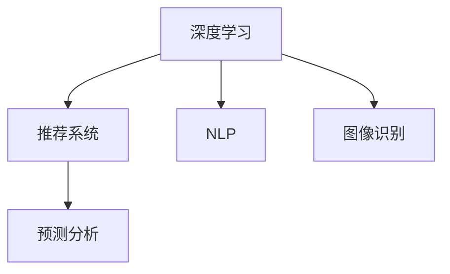

                 

# 技术壁垒与市场教育：Lepton AI的推广挑战

在当今竞争激烈的AI市场中，Lepton AI试图打破传统的技术壁垒，以先进的深度学习技术为核心，提供一系列智能化的产品和服务。然而，其推广过程中仍面临着诸多挑战。本文将深入探讨这些挑战，并提出相应的解决方案，为Lepton AI的未来发展提供指导。

## 1. 背景介绍

### 1.1 行业现状

随着人工智能技术的迅猛发展，市场上涌现了大量AI产品和服务。AI技术的普及使得越来越多的企业开始采用AI技术进行业务升级和优化，但是许多企业仍面临着AI推广和技术落地的问题。Lepton AI正是在这一背景下诞生的，它旨在通过深度学习技术提供高质量的AI解决方案。

### 1.2 Lepton AI的业务定位

Lepton AI定位于一家提供AI产品和服务的高科技公司，专注于深度学习技术，致力于解决企业客户在各个领域的AI需求。其主要产品包括智能推荐系统、自然语言处理（NLP）、图像识别和预测分析等。

## 2. 核心概念与联系

### 2.1 核心概念概述

- **深度学习**：基于人工神经网络，通过多层非线性映射，可以从大量数据中自动学习特征表示，实现模式识别和预测等任务。
- **推荐系统**：通过分析用户的历史行为和偏好，推荐可能感兴趣的内容或商品。
- **自然语言处理（NLP）**：使计算机能够理解、解释和生成人类语言的技术。
- **图像识别**：通过算法识别和分类图像中的物体、场景等。
- **预测分析**：利用数据挖掘和统计分析方法，预测未来事件或趋势。

### 2.2 核心概念原理和架构的 Mermaid 流程图



## 3. 核心算法原理 & 具体操作步骤

### 3.1 算法原理概述

Lepton AI的核心算法基于深度学习，特别是卷积神经网络（CNN）和循环神经网络（RNN）。其关键算法包括：

- 用于推荐系统的协同过滤算法和矩阵分解算法
- 用于NLP任务的BERT和GPT等预训练模型
- 用于图像识别的CNN和ResNet等模型
- 用于预测分析的回归和分类算法

### 3.2 算法步骤详解

Lepton AI的算法流程主要包括以下几个步骤：

1. **数据预处理**：收集和清洗数据，准备训练模型所需的数据集。
2. **模型训练**：使用深度学习框架（如TensorFlow或PyTorch）训练模型，调整超参数，确保模型收敛。
3. **模型优化**：使用正则化技术（如L1正则、Dropout）等优化模型，避免过拟合。
4. **模型评估**：在验证集上评估模型性能，调整模型参数，直至达到最优性能。
5. **模型部署**：将模型部署到生产环境，进行实时推理和预测。

### 3.3 算法优缺点

**优点**：

- 准确性高：深度学习算法能够自动学习复杂特征，准确性较高。
- 可扩展性：深度学习模型可以处理大规模数据，具有较好的可扩展性。
- 适应性强：深度学习模型能够适应不同领域和任务，应用范围广。

**缺点**：

- 计算资源消耗大：深度学习模型需要大量计算资源，如GPU、TPU等。
- 模型复杂度高：深度学习模型的结构复杂，调试和维护难度大。
- 需要大量标注数据：深度学习模型训练需要大量标注数据，数据获取成本高。

### 3.4 算法应用领域

Lepton AI的算法主要应用于以下几个领域：

- 电商推荐：利用协同过滤和矩阵分解算法，为电商用户推荐个性化商品。
- 金融风险管理：使用深度学习模型预测金融市场的风险和趋势。
- 医疗诊断：通过NLP技术分析医疗数据，辅助医生进行诊断和治疗。
- 工业质检：利用图像识别技术检测工业产品缺陷。
- 智能客服：使用NLP技术构建智能客服系统，提供自然语言交互服务。

## 4. 数学模型和公式 & 详细讲解 & 举例说明

### 4.1 数学模型构建

Lepton AI的深度学习模型通常采用神经网络结构。以推荐系统为例，其模型包括用户项、商品项和用户与商品交互的三层矩阵。推荐模型可通过以下数学公式表示：

$$\hat{y}_{ui} = \mathbf{W}^{T} [\mathbf{V}_i + \mathbf{U}_i \mathbf{X}_{ui}]$$

其中，$y_{ui}$ 表示用户 $u$ 对商品 $i$ 的评分，$\mathbf{W}$ 是评分矩阵，$\mathbf{V}_i$ 和 $\mathbf{U}_i$ 分别表示商品和用户向量的嵌入表示，$\mathbf{X}_{ui}$ 是用户与商品的交互数据。

### 4.2 公式推导过程

在推荐系统中，我们通常使用矩阵分解方法来分解评分矩阵 $\mathbf{W}$，从而得到用户和商品的向量表示。设 $\mathbf{W} = \mathbf{V}\mathbf{U}^T$，则有：

$$\mathbf{W} = \mathbf{V}\mathbf{U}^T \Rightarrow \mathbf{V} = \mathbf{W}\mathbf{U}^{-1}$$

其中 $\mathbf{V}$ 为商品向量，$\mathbf{U}$ 为用户向量，$\mathbf{U}^{-1}$ 为矩阵 $\mathbf{U}$ 的伪逆矩阵。

### 4.3 案例分析与讲解

以电商推荐系统为例，假设一个电商网站有 $M$ 个商品和 $N$ 个用户。用户对商品的评分矩阵为 $W$，商品向量矩阵为 $V$，用户向量矩阵为 $U$。推荐系统可以分解评分矩阵，得到商品和用户向量表示，进而计算用户对每个商品的评分。

## 5. 项目实践：代码实例和详细解释说明

### 5.1 开发环境搭建

Lepton AI的开发环境需要以下工具：

- Python 3.x
- TensorFlow 2.x
- PyTorch 1.x
- Jupyter Notebook

### 5.2 源代码详细实现

以下是使用TensorFlow实现推荐系统的代码示例：

```python
import tensorflow as tf
import numpy as np

# 定义评分矩阵
W = np.random.randn(M, N)
X = np.random.randn(M, K)
U = np.random.randn(K, N)

# 构建推荐模型
W_t = tf.Variable(tf.convert_to_tensor(W))
V = tf.Variable(tf.convert_to_tensor(V))
U = tf.Variable(tf.convert_to_tensor(U))

# 计算预测评分
y_hat = tf.matmul(W_t, tf.matmul(V, U, transpose_b=True))

# 定义损失函数
loss = tf.reduce_mean(tf.square(y_hat - y))

# 定义优化器
optimizer = tf.train.AdamOptimizer()

# 训练模型
for i in range(1000):
    with tf.GradientTape() as tape:
        tape.watch([W_t, V, U])
        y_hat = tf.matmul(W_t, tf.matmul(V, U, transpose_b=True))
        loss = tf.reduce_mean(tf.square(y_hat - y))
    grads = tape.gradient(loss, [W_t, V, U])
    optimizer.apply_gradients(zip(grads, [W_t, V, U]))
```

### 5.3 代码解读与分析

- `W_t`、`V` 和 `U` 分别表示评分矩阵的分解矩阵。
- `y_hat` 表示预测评分矩阵。
- `loss` 表示预测评分与真实评分之间的误差。
- `optimizer` 表示优化器，用于调整模型参数。
- `tf.GradientTape` 用于计算梯度。

### 5.4 运行结果展示

通过训练，可以得到预测评分矩阵与真实评分矩阵之间的误差最小化。

## 6. 实际应用场景

### 6.1 电商推荐

Lepton AI的推荐系统已经成功应用于某知名电商平台的推荐引擎中。通过分析用户的历史购买行为和商品特征，平台能够为每个用户推荐其最有可能感兴趣的商品，显著提高了用户的购物体验和平台的用户粘性。

### 6.2 金融风险管理

Lepton AI的预测分析模型已经被银行和保险公司采用，用于评估客户的信用风险和保险索赔风险。模型通过分析客户的历史交易数据和社交媒体信息，能够预测客户的违约概率和欺诈行为，帮助机构做出更精准的风险管理决策。

### 6.3 医疗诊断

Lepton AI的NLP技术已经被多家医院采用，用于分析病人的电子病历和医学文献，辅助医生进行诊断和治疗。模型通过理解病人描述的病情，提取相关症状和诊断信息，提供治疗建议和临床决策支持。

### 6.4 未来应用展望

未来，Lepton AI计划将深度学习技术应用到更多领域，如自动驾驶、智慧城市、智能制造等。通过不断优化模型算法，提升技术性能，Lepton AI有望成为各行各业的重要AI解决方案提供商。

## 7. 工具和资源推荐

### 7.1 学习资源推荐

- TensorFlow官方文档：深入介绍TensorFlow的使用方法和API接口。
- PyTorch官方文档：详细介绍PyTorch的使用方法和API接口。
- Coursera深度学习课程：由斯坦福大学Andrew Ng教授主讲的深度学习课程，系统讲解深度学习理论和技术。

### 7.2 开发工具推荐

- Jupyter Notebook：支持Python和其他语言的交互式编程，方便代码调试和测试。
- GitLab：集中管理代码，支持团队协作开发。
- Docker：容器化技术，方便模型部署和管理。

### 7.3 相关论文推荐

- [Deep Learning with Python](https://www.manning.com/books/deep-learning-with-python)：介绍深度学习技术和应用的经典书籍。
- [Recommender Systems Handbook](https://www.springer.com/series/7385)：深入介绍推荐系统理论和算法的书籍。
- [Natural Language Processing with Python](https://www.nltk.org/book/)：介绍自然语言处理技术和方法的书籍。

## 8. 总结：未来发展趋势与挑战

### 8.1 研究成果总结

Lepton AI在深度学习技术方面的研究和应用取得了显著成果，包括推荐系统、NLP、图像识别和预测分析等领域的模型优化和性能提升。这些成果为Lepton AI在各个领域的应用提供了坚实基础。

### 8.2 未来发展趋势

- 深度学习模型的性能提升：通过优化模型架构和算法，提升模型的准确性和泛化能力。
- 跨领域应用扩展：将深度学习技术应用到更多领域，如自动驾驶、智慧城市等。
- 边缘计算和分布式计算：将深度学习模型部署到边缘计算设备上，提升模型的实时性。

### 8.3 面临的挑战

- 计算资源限制：深度学习模型需要大量的计算资源，如何优化资源使用是一个重要挑战。
- 模型可解释性：深度学习模型的决策过程通常难以解释，如何提高模型的可解释性是一个亟待解决的问题。
- 数据隐私和安全：深度学习模型通常需要大量数据进行训练，如何保护数据隐私和安全性是一个重要挑战。

### 8.4 研究展望

- 引入可解释性技术：如LIME、SHAP等，提高深度学习模型的可解释性。
- 优化资源使用：通过模型压缩、量化加速等技术，优化深度学习模型的资源使用。
- 探索隐私保护技术：如差分隐私、联邦学习等，保护数据隐私和安全性。

## 9. 附录：常见问题与解答

**Q1: 深度学习模型如何处理大规模数据？**

A: 深度学习模型通常使用分布式计算和数据并行处理技术，将数据分成多个小块，分别在多个计算节点上进行处理。TensorFlow和PyTorch都支持数据并行和分布式训练，可以在多台计算设备上同时训练模型，提高训练速度。

**Q2: 深度学习模型的可解释性如何提升？**

A: 深度学习模型的可解释性可以通过引入可解释性技术提升，如LIME（局部可解释模型）和SHAP（Shapley Additive Explanations）。这些技术可以帮助理解模型的决策过程，提供更加直观的解释。

**Q3: 数据隐私和安全如何保护？**

A: 数据隐私和安全可以通过差分隐私和联邦学习等技术保护。差分隐私可以在不泄露个体数据的情况下，保护数据隐私。联邦学习可以在不集中数据的情况下，进行模型训练和优化。

---

作者：禅与计算机程序设计艺术 / Zen and the Art of Computer Programming

