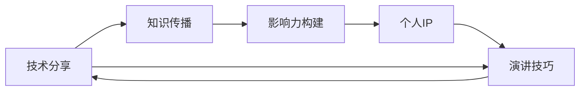

                 

# 技术演讲：从分享到个人IP打造

> 关键词：技术分享,个人品牌,知识传播,IP打造,演讲技巧

## 1. 背景介绍

在这个信息爆炸的时代，技术分享已经成为了连接专业人士与更广泛受众的重要桥梁。无论你是软件工程师、数据科学家还是产品经理，掌握如何高效地进行技术分享，不仅能够提升个人影响力，还能为你的职业生涯加分。同时，构建和塑造个人IP，已成为新时代背景下提升个人竞争力的重要途径。本文将从技术分享的角度出发，探讨如何打造个人IP，将你的专业技能转化为市场价值。

### 1.1 问题由来

随着互联网技术的发展，技术的普及和应用愈加广泛。对于技术人员而言，掌握最新的技术动态和深入理解技术原理，已经不再是自我提升的终点，而应该成为对外传播和分享的重要推动力。如何高效地进行技术分享，构建个人IP，成为了许多技术人员的思考方向。

### 1.2 问题核心关键点

- 技术分享与个人IP打造
- 高效演讲技巧
- 内容营销与影响力构建
- 个人品牌塑造
- 技术社区的参与与贡献

这些关键点构成了技术分享和个人IP打造的基石，帮助技术人员在技术圈内外树立自己的品牌，影响和感染更多人。

### 1.3 问题研究意义

1. 增强个人影响力：通过技术分享，可以显著提升你的专业技能和行业地位，使你在技术圈内外获得更多关注和认可。
2. 加速职业发展：良好的技术分享能力能让你更快地融入行业，获取更多机会和资源。
3. 推动技术普及：分享新技术，普及技术知识，有助于推动行业整体技术水平的提升。
4. 构建个人品牌：通过技术分享，能更好地展现你的专业能力和独特价值，形成个人品牌效应。
5. 提升社区贡献：积极参与技术社区，分享知识和经验，有助于提升社区的整体价值。

## 2. 核心概念与联系

### 2.1 核心概念概述

- **技术分享**：通过各种形式将技术知识和经验传播给受众，提升其对技术的理解与应用能力。
- **个人IP**：指个人品牌和市场价值在网络上的体现，通过分享和传播塑造一种独特的个人形象和专业价值。
- **知识传播**：将技术知识和经验转化为易于理解、传播的内容，通过不同渠道进行广泛传播。
- **影响力构建**：通过持续的技术分享和社区贡献，逐步建立个人在技术圈内的影响力。
- **演讲技巧**：在技术分享中，有效的演讲技巧能帮助更清晰、生动地传递信息，提升分享效果。

这些概念之间互相联系，共同构成了技术分享和个人IP打造的整体框架。

### 2.2 核心概念原理和架构的 Mermaid 流程图

## 3. 核心算法原理 & 具体操作步骤

### 3.1 算法原理概述

基于个人IP打造的良好技术分享，需要从内容、形式、渠道等多方面进行优化，形成一套完整的流程。这个流程的核心在于：

1. **内容创作**：掌握技术原理和应用案例，生成有价值的技术分享内容。
2. **形式设计**：通过图表、案例、故事等方式，使内容易于理解、传播。
3. **渠道选择**：选择适合的传播渠道，最大化传播范围和效果。
4. **反馈循环**：收集受众反馈，不断优化技术分享内容和方法。

### 3.2 算法步骤详解

**Step 1: 内容创作**

1. **技术原理解析**：深入理解新技术的原理和应用场景，掌握技术细节。
2. **案例分析与讲解**：通过具体案例，生动解释技术原理和应用方式，增强理解。
3. **结构化组织**：将内容结构化，分为引言、主体、总结等部分，使信息条理清晰。

**Step 2: 形式设计**

1. **视觉元素使用**：使用图表、图片、动画等视觉元素，增强内容可读性和传播效果。
2. **故事讲述**：通过讲故事的方式，使内容更加生动有趣，吸引受众。
3. **互动设计**：设计问答环节、互动讨论等形式，增强受众参与感。

**Step 3: 渠道选择**

1. **线上平台**：如GitHub、CSDN、Medium等，发布技术文章和项目。
2. **视频平台**：如Bilibili、YouTube等，上传技术讲解视频。
3. **线下活动**：如技术会议、技术沙龙等，进行面对面的技术分享。
4. **社交媒体**：如Twitter、LinkedIn等，通过短文、长文、图片等方式传播技术知识。

**Step 4: 反馈循环**

1. **收集反馈**：通过评论、私信等方式收集受众的反馈意见。
2. **分析总结**：对反馈进行分类和总结，发现问题并提出改进方案。
3. **迭代优化**：不断优化技术分享内容和方法，提升传播效果。

### 3.3 算法优缺点

**优点**：

- 提高个人知名度和影响力
- 增强专业技能和职业发展机会
- 推动技术普及和应用

**缺点**：

- 需要持续投入时间和精力
- 竞争激烈，需不断创新
- 传播效果受受众接受度影响

### 3.4 算法应用领域

技术分享和个人IP打造方法不仅适用于软件开发、数据科学等领域，还适用于产品设计、项目管理、市场分析等多个领域。

## 4. 数学模型和公式 & 详细讲解 & 举例说明

### 4.1 数学模型构建

假设你是一名软件工程师，掌握了一项新的编程技术，需要将其分享给技术社区。构建数学模型的过程如下：

1. **输入**：新技术的核心原理和应用场景，即 $X = (\text{原理}, \text{应用})$。
2. **输出**：技术分享的最终效果，即 $Y = (\text{影响}, \text{传播范围})$。
3. **模型**：从输入到输出的映射关系，即 $Y = f(X, P)$，其中 $P$ 为传播策略。

### 4.2 公式推导过程

以技术分享效果为例，进行公式推导：

$$
Y = \alpha f_{原理}(\text{原理}) + \beta f_{应用}(\text{应用}) + \gamma P
$$

其中 $\alpha$ 为原理传播的权重，$f_{原理}$ 为原理传播的函数；$\beta$ 为应用传播的权重，$f_{应用}$ 为应用传播的函数；$\gamma$ 为传播策略的权重，$P$ 为传播策略的影响。

### 4.3 案例分析与讲解

假设你分享了 Python 的异步编程技术，原理为事件循环和协程。分析如下：

1. **原理传播**：通过讲解事件循环和协程的工作原理，增强受众对技术的理解。
2. **应用传播**：通过具体案例，展示异步编程在实际项目中的应用，增强技术可操作性。
3. **传播策略**：选择 GitHub 发布项目代码，CSDN 发布技术文章，Bilibili 上传讲解视频，全面覆盖受众群体。

## 5. 项目实践：代码实例和详细解释说明

### 5.1 开发环境搭建

**Step 1: 安装开发环境**

1. **编程语言**：选择 Python 作为开发语言，因为它支持广泛的库和工具。
2. **IDE**：使用 Visual Studio Code 或 PyCharm，提供代码编辑和调试功能。
3. **版本控制**：使用 Git 进行版本控制，记录开发过程。
4. **文档生成**：使用 Sphinx 或 Markdown 生成技术文档，方便分享和传播。

### 5.2 源代码详细实现

**Step 2: 实现技术分享内容**

1. **代码示例**：编写具体技术实现代码，并加入注释和文档说明。
2. **测试和调试**：编写单元测试和集成测试，确保代码质量。
3. **优化和改进**：根据反馈意见，不断优化代码实现。

**Step 3: 设计分享形式**

1. **PPT 制作**：使用 PowerPoint 或 Keynote 制作技术分享 PPT，设计生动的内容。
2. **视频制作**：使用 Camtasia 或 Adobe Premiere 制作技术讲解视频，注重剪辑和音频质量。
3. **文章撰写**：使用 Markdown 或 LaTeX 撰写技术文章，生成 HTML 或 PDF 格式。

### 5.3 代码解读与分析

以技术文章的实现为例：

1. **标题**：使用 Markdown 格式，清晰表述文章主题。
2. **引言**：简要介绍技术背景，吸引读者兴趣。
3. **主体**：详细讲解技术原理和应用案例，结合图表和代码示例。
4. **总结**：总结技术分享要点，提出实践建议。

## 6. 实际应用场景

### 6.1 技术博客

在技术博客平台上发布技术文章，如CSDN、Medium等，通过高质量内容吸引和保留受众。

### 6.2 视频讲解

在视频平台上发布技术讲解视频，如Bilibili、YouTube等，通过生动的视觉和听觉效果提升传播效果。

### 6.3 线下演讲

在技术会议、技术沙龙等线下活动中进行面对面分享，增强互动效果，扩大受众范围。

### 6.4 社交媒体

在社交媒体平台上发布技术短文、长文、图片等内容，利用平台流量传播技术知识。

### 6.5 社区贡献

积极参与技术社区的讨论和项目，通过解决问题、分享经验，逐步建立个人影响力。

## 7. 工具和资源推荐

### 7.1 学习资源推荐

1. **《演讲之道》**：讲解演讲技巧，涵盖声音、肢体语言、内容组织等方面。
2. **《内容营销》**：讲解如何通过内容吸引和保留受众，构建个人品牌。
3. **《个人品牌》**：介绍如何建立和维护个人品牌，提升市场价值。
4. **《技术博客写作》**：讲解如何撰写高质量技术文章，提升传播效果。
5. **《技术演讲》**：讲解技术演讲的实践和技巧，提高演讲质量。

### 7.2 开发工具推荐

1. **IDE**：Visual Studio Code、PyCharm
2. **版本控制**：Git、GitHub
3. **文档生成**：Sphinx、Markdown
4. **视频制作**：Camtasia、Adobe Premiere
5. **博客平台**：CSDN、Medium

### 7.3 相关论文推荐

1. **《内容传播机制分析》**：研究内容传播的原理和影响因素。
2. **《社交媒体影响力模型》**：构建社交媒体影响力的数学模型，分析传播效果。
3. **《技术分享效果评估》**：评估技术分享的效果，提供优化建议。

## 8. 总结：未来发展趋势与挑战

### 8.1 研究成果总结

1. 技术分享与个人IP打造方法，提升了个人在技术圈内的知名度和影响力。
2. 通过系统化的流程，有效提升了技术传播效果，推动技术普及。
3. 通过多种形式的传播，提升了技术分享的覆盖面和受众互动。

### 8.2 未来发展趋势

1. **多渠道融合**：利用多种传播渠道，全面覆盖受众。
2. **内容多样化**：结合文字、视频、互动等多种形式，提升传播效果。
3. **技术社区**：积极参与技术社区，提升个人品牌和影响力。

### 8.3 面临的挑战

1. **时间投入**：持续的技术分享和传播需要大量时间和精力。
2. **内容创新**：保持技术内容的创新和新鲜度，避免受众疲劳。
3. **互动效果**：增强受众互动，提升分享效果。

### 8.4 研究展望

1. **自动化工具**：开发自动化工具，提升技术分享效率。
2. **个性化定制**：根据受众特点，定制化技术分享内容。
3. **数据驱动**：利用数据分析工具，优化技术分享策略。

## 9. 附录：常见问题与解答

**Q1: 技术分享如何吸引受众？**

A: 通过生动的案例和故事讲述，使技术内容更易于理解。同时，选择合适的传播渠道和形式，最大化传播效果。

**Q2: 如何提升个人品牌影响力？**

A: 通过持续的技术分享和社区贡献，逐步建立个人品牌。同时，利用多种形式的传播，提升品牌影响力。

**Q3: 技术分享有哪些注意事项？**

A: 确保技术内容的准确性和实用性，避免误导受众。同时，注重互动和反馈，不断优化技术分享内容和方法。

**Q4: 如何平衡技术分享和职业发展？**

A: 将技术分享作为职业发展的重要组成部分，通过提升个人影响力，获取更多的职业机会。

**Q5: 技术分享如何转化为商业价值？**

A: 通过技术分享建立个人品牌，吸引合作伙伴和客户，推动商业合作和技术应用。

---

作者：禅与计算机程序设计艺术 / Zen and the Art of Computer Programming

