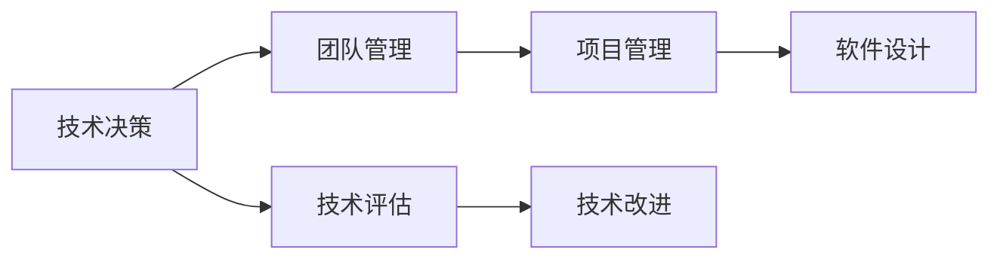

                 

# 技术领导力：提升职场价值

> 关键词：技术领导力,职场价值,软件开发,软件架构,CTO,技术团队管理,项目开发,软件设计,技术评估

## 1. 背景介绍

在快速发展的技术时代，技术领导力成为企业和组织成功的重要因素。随着信息技术的不断演进，对技术团队的管理、项目开发、软件设计和技术评估等方面提出了更高的要求。技术领导力不仅关乎技术团队内部的协作，更关系到企业的长期发展战略和竞争力。本文将从技术领导力的概念、内涵及其在职场中的应用进行全面探讨，帮助技术管理者提升职场价值，推动企业技术创新。

## 2. 核心概念与联系

### 2.1 核心概念概述

技术领导力（Technical Leadership）是指在技术领域内，通过技术决策、团队管理和项目领导等手段，推动技术创新和团队发展的能力。它涉及技术团队的管理、项目的规划与执行、软件设计等核心技术实践，是企业技术竞争力的关键。

技术领导力的核心要素包括：

- **技术决策**：在复杂的技术环境中，做出科学合理的技术决策，指引团队朝正确方向前进。
- **团队管理**：通过有效沟通、激励与指导，促进团队成员的合作与成长。
- **项目管理**：规划与执行项目，确保项目按时、按质完成。
- **软件设计**：设计可扩展、可维护、高性能的软件系统。

这些要素相互作用，形成一个完整的技术领导力框架，帮助技术管理者在职场中提升个人与团队的价值。

### 2.2 核心概念原理和架构的 Mermaid 流程图



此图展示了技术领导力的核心流程。技术决策从根本上指引团队方向，团队管理通过提升成员协作效率，项目管理确保项目按时完成，而软件设计则是技术团队的核心任务。技术评估和改进则作为反馈机制，持续优化技术决策和实践。

## 3. 核心算法原理 & 具体操作步骤

### 3.1 算法原理概述

技术领导力的方法论与算法，本质上是一种数据驱动和反馈循环的管理实践。以下将从决策理论、组织行为学和项目管理等领域，详细阐述技术领导的算法原理。

### 3.2 算法步骤详解

1. **技术评估与决策**：
   - 技术领导首先需要对现有技术和市场趋势进行评估，选择最佳的技术方案。
   - 利用数据驱动的方法，如A/B测试、数据分析等，进行决策支持。
   - 制定明确的技术路线图和里程碑，确保决策的科学性和可执行性。

2. **团队管理**：
   - 根据个人能力和技术栈，合理分配任务，优化团队结构。
   - 采用敏捷开发方法，促进快速迭代和反馈。
   - 通过技术培训和职业发展规划，提升团队整体素质。

3. **项目管理**：
   - 制定详细的时间表和资源计划，确保项目按时交付。
   - 采用合适的项目管理工具，如JIRA、Trello等，提高项目管理效率。
   - 定期召开项目进展汇报会议，及时调整策略，应对风险。

4. **软件设计**：
   - 采用模块化设计、模式设计等技术，保证软件系统的可扩展性和可维护性。
   - 设计合理的数据模型和架构，确保系统性能和安全性。
   - 采用代码审查和持续集成等实践，提高代码质量。

### 3.3 算法优缺点

**优点**：

- **科学决策**：数据驱动和反馈循环的管理实践，有助于做出更加科学和合理的技术决策。
- **高效协作**：通过团队管理和项目管理，提升团队协作效率，确保项目按时交付。
- **持续改进**：技术评估和改进机制，促进技术团队的持续创新和优化。

**缺点**：

- **复杂性高**：技术领导需要兼顾技术决策、团队管理、项目管理等多个方面，操作复杂。
- **资源投入大**：需要大量时间和精力进行评估和改进，资源投入较大。
- **灵活性不足**：技术路线图和里程碑一旦制定，调整起来较为困难。

### 3.4 算法应用领域

技术领导力广泛应用于软件开发、软件架构设计、技术团队管理、企业技术战略规划等领域。例如：

- **软件开发**：指导团队开发高质量的软件系统，提高软件质量和用户体验。
- **软件架构设计**：设计可扩展、可维护的软件架构，确保系统长期稳定性。
- **技术团队管理**：通过培训和发展，提升团队成员的技术能力和职业素养。
- **企业技术战略**：制定技术路线图和里程碑，推动企业技术创新和战略发展。

## 4. 数学模型和公式 & 详细讲解 & 举例说明

### 4.1 数学模型构建

技术领导力的数学模型可以表示为：

$$
TL = T_D + T_M + T_P + T_S
$$

其中：

- $TL$：技术领导力
- $T_D$：技术决策
- $T_M$：团队管理
- $T_P$：项目管理
- $T_S$：软件设计

### 4.2 公式推导过程

假设技术领导力$TL$由四个子模块组成，每个子模块的贡献为$\alpha_i$（$i \in [D, M, P, S]$），则：

$$
TL = \alpha_D \cdot T_D + \alpha_M \cdot T_M + \alpha_P \cdot T_P + \alpha_S \cdot T_S
$$

根据技术领导力的评估结果，我们可以得到不同子模块的权重$\alpha_i$。

### 4.3 案例分析与讲解

某软件公司技术团队面临项目延期和代码质量不高的问题，通过以下步骤提升技术领导力：

1. **技术评估**：
   - 评估现有技术和市场趋势，决定采用新的开发框架。
   - 使用A/B测试验证新框架的效果，选择最佳方案。

2. **团队管理**：
   - 根据技术栈和能力，重新分配任务，优化团队结构。
   - 引入敏捷开发方法，促进快速迭代和反馈。

3. **项目管理**：
   - 制定详细的时间表和资源计划，确保项目按时交付。
   - 使用JIRA管理项目进展，定期召开进展汇报会议。

4. **软件设计**：
   - 采用模块化设计，设计可扩展、可维护的软件架构。
   - 引入持续集成和代码审查，提高代码质量。

通过上述步骤，团队提升了技术领导力，解决了项目延期和代码质量不高的问题，项目按时交付并获得了客户好评。

## 5. 项目实践：代码实例和详细解释说明

### 5.1 开发环境搭建

为了实践技术领导的算法，需要搭建一个基于敏捷开发的开发环境。主要工具包括：

- **版本控制**：使用Git进行版本控制。
- **项目管理**：使用JIRA进行任务管理和进度跟踪。
- **持续集成**：使用Jenkins进行持续集成和代码审查。
- **敏捷开发**：采用Scrum或Kanban方法，促进快速迭代和反馈。

### 5.2 源代码详细实现

以下是敏捷开发中常见的任务管理流程示例：

1. **创建任务**：在JIRA中创建新的任务，包含任务描述、负责人和截止日期等信息。
   - ```python
   def create_task(description, responsible, due_date):
       # 创建任务的Python代码
   ```

2. **分配任务**：根据团队成员的技术栈和能力，分配任务。
   - ```python
   def assign_task(task_id, member):
       # 分配任务的Python代码
   ```

3. **迭代周期**：每两周为一个迭代周期，进行需求评审、设计、开发、测试和评审。
   - ```python
   def start_iteration(iteration_number):
       # 开始迭代周期的Python代码
   ```

4. **任务完成**：开发完成后，将任务状态更新为“已完成”。
   - ```python
   def complete_task(task_id):
       # 完成任务的Python代码
   ```

### 5.3 代码解读与分析

1. **版本控制**：
   - 使用Git进行版本控制，可以随时回退代码，避免开发冲突。
   - ```bash
   git init
   git add .
   git commit -m "Initial commit"
   ```

2. **项目管理**：
   - 使用JIRA进行任务管理和进度跟踪，可实时查看任务状态，确保项目按时交付。
   - ```python
   def get_task_status(task_id):
       # 获取任务状态的Python代码
   ```

3. **持续集成**：
   - 使用Jenkins进行持续集成和代码审查，确保每次提交的质量。
   - ```python
   def run_build():
       # 运行构建的Python代码
   ```

4. **敏捷开发**：
   - 采用Scrum或Kanban方法，促进快速迭代和反馈。
   - ```python
   def plan_iteration(iteration_number):
       # 制定迭代计划的Python代码
   ```

### 5.4 运行结果展示

通过敏捷开发流程，团队可以实时跟踪任务进展，快速响应变化，提升工作效率和质量。以下是一个典型的迭代周期任务完成情况：

| 迭代周期 | 任务ID | 任务描述 | 负责人 | 状态 | 截止日期 |
|---------|-------|---------|-------|------|---------|
| 第1周   | 1     | 需求分析 | A     | 未完成 | 2023-10-01 |
| 第1周   | 2     | 设计文档 | B     | 未完成 | 2023-10-07 |
| 第2周   | 1     | 需求分析 | A     | 已完成 | 2023-10-08 |
| 第2周   | 2     | 设计文档 | B     | 已完成 | 2023-10-14 |
| 第3周   | 3     | 开发任务 | C     | 未完成 | 2023-10-21 |
| 第4周   | 3     | 开发任务 | C     | 已完成 | 2023-10-28 |

## 6. 实际应用场景

### 6.1 技术团队管理

技术领导力在技术团队管理中起到关键作用。通过科学的技术评估和决策，合理分配任务，促进团队协作和创新，提升团队整体能力。

例如，某技术团队面临技术迭代慢、协作不畅的问题，通过以下措施进行改进：

1. **技术评估**：
   - 评估现有技术栈和开发框架，决定引入新的技术栈。
   - 使用A/B测试验证新框架的效果，选择最佳方案。

2. **团队管理**：
   - 根据技术栈和能力，重新分配任务，优化团队结构。
   - 引入敏捷开发方法，促进快速迭代和反馈。

3. **项目管理**：
   - 制定详细的时间表和资源计划，确保项目按时交付。
   - 使用JIRA管理项目进展，定期召开进展汇报会议。

通过上述措施，团队提升了技术领导力，提高了开发效率和质量，项目按时交付并获得了客户好评。

### 6.2 企业技术战略规划

技术领导力在企业技术战略规划中起到重要推动作用。通过科学的技术决策和评估，制定合理的技术路线图和里程碑，推动企业技术创新和战略发展。

例如，某公司面临技术更新换代和市场竞争压力，通过以下措施进行战略规划：

1. **技术评估**：
   - 评估现有技术和市场趋势，决定引入最新的技术框架。
   - 使用A/B测试验证新技术的效果，选择最佳方案。

2. **技术领导**：
   - 制定技术路线图和里程碑，确保技术战略的科学性和可执行性。
   - 通过技术培训和职业发展规划，提升团队整体素质。

3. **项目管理**：
   - 制定详细的时间表和资源计划，确保技术战略按时实施。
   - 定期评估技术战略的执行效果，根据市场变化调整策略。

通过上述措施，公司提升了技术领导力，推动了技术创新和战略发展，增强了市场竞争力。

## 7. 工具和资源推荐

### 7.1 学习资源推荐

为了帮助技术管理者提升技术领导力，推荐以下学习资源：

1. **书籍**：《技术领导力》（《Technical Leadership》）：作者：John Swets, Chellengren, Lynda, 提供系统的技术领导力理论框架和实际案例分析。
2. **课程**：Coursera《技术领导力》课程：由世界知名专家教授，提供系统的技术领导力培训。
3. **博客**：TechCrunch《技术领导力》系列文章：提供最新的技术领导力实践和案例分析。
4. **讲座**：Google I/O、Apple WWDC等技术大会上的技术领导力讲座：提供最新的技术领导力趋势和实践。

通过学习这些资源，技术管理者可以系统掌握技术领导力的理论和实践，提升职场价值。

### 7.2 开发工具推荐

为了实践技术领导的算法，推荐以下开发工具：

1. **版本控制**：Git：提供强大的版本控制和协作功能。
2. **项目管理**：JIRA：提供任务管理和进度跟踪功能。
3. **持续集成**：Jenkins：提供持续集成和代码审查功能。
4. **敏捷开发**：Scrum或Kanban：提供敏捷开发方法和协作工具。

这些工具能够提供高效的项目管理和团队协作支持，帮助技术管理者提升技术领导力。

### 7.3 相关论文推荐

为了深入理解技术领导的算法和实践，推荐以下相关论文：

1. "技术领导的驱动因素与模型研究"：该论文分析了技术领导的驱动因素，并提出了技术领导力模型。
2. "敏捷开发中的技术领导力研究"：该论文研究了敏捷开发中的技术领导力实践，提出了有效的技术领导策略。
3. "项目管理中的技术领导力应用"：该论文分析了项目管理中的技术领导力实践，提出了有效的项目管理策略。
4. "软件设计中的技术领导力实践"：该论文分析了软件设计中的技术领导力实践，提出了有效的软件设计策略。

这些论文提供了丰富的理论支持和实践案例，帮助技术管理者提升技术领导力。

## 8. 总结：未来发展趋势与挑战

### 8.1 未来发展趋势

技术领导力在未来的发展趋势如下：

1. **自动化和智能化**：随着人工智能和自动化技术的发展，技术领导力将更多依赖数据驱动和智能决策，提高决策效率和精度。
2. **跨领域融合**：技术领导力将更多结合跨领域知识，如业务分析、市场趋势等，提供更为全面的技术战略。
3. **开放协作**：技术领导力将更多依赖开放协作和团队智慧，提高团队创新能力和执行力。
4. **可持续发展**：技术领导力将更多关注企业的可持续发展，如环境、社会、治理（ESG）等议题。

### 8.2 面临的挑战

技术领导力在实现过程中面临以下挑战：

1. **数据驱动**：如何获取和利用高质量的数据，进行科学的技术决策，仍是技术领导的难点。
2. **团队协作**：如何在不同技术背景和性格特点的团队中，促进协作和创新，仍需深入探索。
3. **项目管理**：如何在快速变化的市场环境中，制定合理的时间表和资源计划，仍需深入研究。
4. **软件设计**：如何在大规模复杂系统中，设计可扩展、可维护的软件架构，仍需深入探讨。

### 8.3 研究展望

未来的技术领导力研究将从以下几个方向进行深入探索：

1. **数据驱动决策**：研究如何利用大数据和人工智能技术，提高技术领导的科学性和自动化水平。
2. **跨领域融合**：研究如何将跨领域知识与技术领导结合，提供更为全面的技术战略。
3. **团队协作**：研究如何利用团队智慧和协作工具，提高团队创新能力和执行力。
4. **可持续发展**：研究如何关注企业的可持续发展，推动技术领导力在ESG等议题上的应用。

## 9. 附录：常见问题与解答

### Q1：技术领导力与项目经理的区别是什么？

**A**：技术领导力更多关注技术决策、团队管理和软件设计，注重技术创新和团队协作；项目经理更多关注项目规划、资源管理和风险控制，注重项目按时交付和成本控制。

### Q2：如何提升技术领导力？

**A**：提升技术领导力需要不断学习和实践，具体建议如下：
1. 系统学习技术领导力理论和实践。
2. 不断获取和利用高质量的数据，进行科学的技术决策。
3. 促进团队协作和创新，提高团队整体素质。
4. 制定合理的时间表和资源计划，确保项目按时交付。
5. 关注企业的可持续发展，推动技术领导力在ESG等议题上的应用。

### Q3：技术领导的算法和流程有哪些？

**A**：技术领导的算法和流程包括技术评估、团队管理、项目管理、软件设计等核心环节。具体步骤如下：
1. 技术评估与决策：通过数据驱动的方法，制定最佳技术方案。
2. 团队管理：根据技术栈和能力，分配任务，优化团队结构。
3. 项目管理：制定详细的时间表和资源计划，确保项目按时交付。
4. 软件设计：采用模块化设计，设计可扩展、可维护的软件架构。

### Q4：技术领导力对企业发展有何影响？

**A**：技术领导力对企业发展有重要影响，具体如下：
1. 科学决策：提高技术决策的科学性和合理性，促进企业技术创新。
2. 高效协作：促进团队协作和创新，提高企业整体能力。
3. 项目管理：提高项目管理的效率和质量，确保企业按时交付高质量产品。
4. 可持续性：关注企业的可持续发展，推动企业社会责任和环境治理。

---

作者：禅与计算机程序设计艺术 / Zen and the Art of Computer Programming

