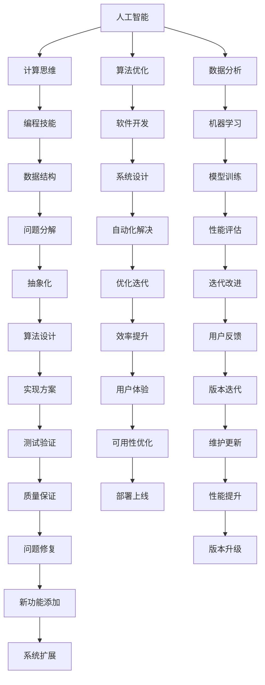

                 

# 技能提升：适应人类计算时代的新需求

> 关键词：人工智能,计算思维,算法优化,编程技能,软件开发

## 1. 背景介绍

### 1.1 问题由来

在当前这个快速变化的数字化时代，技术日新月异，计算能力的飞跃式提升已经深刻改变了人们的生活方式和社会结构。从个人到企业，从教育到医疗，计算技术已经渗透到我们生活的方方面面。然而，面对如此多样化和复杂化的计算需求，传统的教育模式和技能培养方式已经远远落后于技术发展的步伐。

### 1.2 问题核心关键点

计算技术的应用范围广泛，涉及到软件开发、数据分析、人工智能、系统设计等多个领域。在这个背景下，提升个人和团队的计算技能，适应新时代的计算需求，成为了一个紧迫而重要的课题。本文将深入探讨这一问题，分析当前计算技能培养中的痛点，并提出具体的解决方案。

## 2. 核心概念与联系

### 2.1 核心概念概述

在讨论如何提升计算技能之前，首先要明确几个核心概念：

- **人工智能（AI）**：通过算法和计算，使计算机模拟人类的智能行为，包括学习、推理、自我修正等能力。
- **计算思维（Computational Thinking）**：一种以计算为基础的思维方式，强调问题分解、抽象和自动化解决。
- **算法优化（Algorithm Optimization）**：通过改进算法，提高计算效率和性能的过程。
- **编程技能（Programming Skills）**：编写、调试和维护计算机程序的能力。
- **软件开发（Software Development）**：从需求分析、设计到实现和维护的软件开发过程。

这些概念相互关联，共同构成了当前计算技术的核心。掌握这些概念不仅能够提升个人和团队的技术水平，还能够促进计算技术的广泛应用和创新发展。

### 2.2 核心概念原理和架构的 Mermaid 流程图



## 3. 核心算法原理 & 具体操作步骤

### 3.1 算法原理概述

提升计算技能的核心在于掌握和应用一系列关键算法和优化技术。这些算法和优化技术不仅涵盖了软件开发、数据分析和人工智能等多个领域，还涉及到系统设计和用户体验优化等方面。以下将从算法原理、具体操作步骤、优缺点和应用领域四个方面进行详细探讨。

### 3.2 算法步骤详解

#### 3.2.1 算法选择与设计

选择合适的算法是提升计算技能的重要一步。通常，算法的选择应该基于以下几个方面：

- **问题类型**：不同的问题类型可能需要不同的算法，如排序问题需要稳定的排序算法，搜索问题需要高效的搜索算法。
- **数据规模**：数据规模越大，算法的时间和空间复杂度要求越高。
- **资源限制**：考虑硬件资源、软件环境的限制，选择合适的算法和优化技术。

#### 3.2.2 数据处理与预处理

数据处理和预处理是算法优化的关键步骤。常见的数据处理技术包括：

- **数据清洗**：去除噪声、缺失值和不一致的数据。
- **数据转换**：将原始数据转换为适合算法处理的形式，如特征工程、归一化等。
- **数据采样**：通过采样技术，减小数据集的规模，提高算法效率。

#### 3.2.3 算法优化与调优

算法优化是提升计算技能的关键环节。常见的算法优化技术包括：

- **算法选择**：根据问题类型选择合适的算法。
- **参数调优**：调整算法参数，提高算法性能。
- **数据结构优化**：选择合适的数据结构，提高算法效率。
- **并行计算**：利用并行计算技术，提高算法执行速度。

#### 3.2.4 结果评估与迭代

结果评估是提升计算技能的重要环节。常见的结果评估技术包括：

- **性能评估**：评估算法的执行时间、空间占用、正确性等指标。
- **用户体验评估**：通过用户反馈，评估算法在实际应用中的表现。
- **迭代改进**：根据评估结果，不断改进算法和优化技术。

### 3.3 算法优缺点

#### 3.3.1 优点

- **效率提升**：通过算法优化，提高计算效率，减少时间和资源消耗。
- **性能提升**：通过算法优化，提高计算性能，提升计算效果。
- **可扩展性**：优化的算法更容易扩展到大规模数据和复杂问题。

#### 3.3.2 缺点

- **技术门槛**：算法优化需要一定的技术基础，对初学者较为困难。
- **资源投入**：算法优化可能需要投入更多的时间和资源。
- **可能存在瓶颈**：某些问题可能存在算法瓶颈，难以通过优化彻底解决。

### 3.4 算法应用领域

算法优化技术在多个领域中都有广泛应用，例如：

- **软件开发**：通过代码优化、编译优化等技术，提高软件开发效率和软件性能。
- **数据分析**：通过数据清洗、特征工程、模型优化等技术，提高数据分析效果。
- **人工智能**：通过算法优化、模型训练等技术，提高人工智能模型的性能和效果。
- **系统设计**：通过算法优化、数据结构优化等技术，提高系统的稳定性和性能。

## 4. 数学模型和公式 & 详细讲解 & 举例说明

### 4.1 数学模型构建

在进行算法优化时，数学模型构建是关键步骤。通常，我们需要构建一个数学模型来描述问题和解决方案。以下是一个简单的排序问题的数学模型：

- **输入**：待排序的n个元素 $a_1, a_2, ..., a_n$。
- **输出**：排序后的元素序列 $b_1, b_2, ..., b_n$。

- **目标函数**：最小化排序时间或空间复杂度。
- **约束条件**：排序结果满足稳定排序、排序算法性质等约束。

### 4.2 公式推导过程

以快速排序为例，推导其时间复杂度：

$$
T(n) = T(\frac{n}{2}) + T(\frac{n}{2}) + O(n)
$$

推导过程如下：

1. 将n个元素分为两个子序列，分别递归排序。
2. 在排序子序列时，需要进行n次比较和交换操作。
3. 总时间复杂度为 $T(n) = 2T(\frac{n}{2}) + O(n)$。

通过递推公式，可以求得快速排序的时间复杂度为 $O(n\log n)$。

### 4.3 案例分析与讲解

#### 4.3.1 排序问题

排序问题是算法优化的经典案例。快速排序、归并排序等经典排序算法，其时间复杂度均为 $O(n\log n)$，但在实际应用中，需要根据数据规模和特点，选择合适的排序算法。

#### 4.3.2 数据结构

数据结构优化也是算法优化的重要环节。常见的数据结构包括数组、链表、哈希表、树等。不同的数据结构适用于不同的问题，选择合适的数据结构可以显著提高算法效率。

## 5. 项目实践：代码实例和详细解释说明

### 5.1 开发环境搭建

在进行算法优化实践时，开发环境搭建是关键步骤。以下是使用Python进行代码优化的环境配置流程：

1. 安装Anaconda：从官网下载并安装Anaconda，用于创建独立的Python环境。
2. 创建并激活虚拟环境：
```bash
conda create -n pyenv python=3.8 
conda activate pyenv
```
3. 安装PyTorch：根据CUDA版本，从官网获取对应的安装命令。例如：
```bash
conda install pytorch torchvision torchaudio cudatoolkit=11.1 -c pytorch -c conda-forge
```
4. 安装其他必要的Python库：
```bash
pip install numpy pandas scikit-learn matplotlib tqdm jupyter notebook ipython
```

完成上述步骤后，即可在`pyenv`环境中进行算法优化实践。

### 5.2 源代码详细实现

#### 5.2.1 排序算法实现

以下是一个简单的快速排序算法实现：

```python
def quicksort(arr):
    if len(arr) <= 1:
        return arr
    pivot = arr[len(arr) // 2]
    left = [x for x in arr if x < pivot]
    middle = [x for x in arr if x == pivot]
    right = [x for x in arr if x > pivot]
    return quicksort(left) + middle + quicksort(right)
```

#### 5.2.2 时间复杂度分析

通过对快速排序算法的分析，可以得出其时间复杂度为 $O(n\log n)$。

### 5.3 代码解读与分析

#### 5.3.1 排序算法实现

- **pivot选择**：选择中间值作为枢轴，以平衡左右两部分的规模。
- **分治策略**：将问题分解为两个子问题，分别解决，再合并结果。
- **递归调用**：通过递归调用，不断缩小问题的规模，最终得到排序结果。

#### 5.3.2 时间复杂度分析

- **递归层数**：算法的时间复杂度主要取决于递归层数。
- **数据规模**：n个元素的时间复杂度为 $T(n) = 2T(\frac{n}{2}) + O(n)$。
- **时间复杂度**：通过递推公式，可以求得时间复杂度为 $O(n\log n)$。

## 6. 实际应用场景

### 6.1 软件开发

#### 6.1.1 代码优化

在软件开发过程中，代码优化是提升软件性能的重要手段。常见的代码优化技术包括：

- **函数内联**：将函数调用转换为函数体，减少函数调用开销。
- **循环优化**：通过减少循环次数、优化循环结构等方式，提高循环效率。
- **内存优化**：通过减少内存分配、使用缓存等方式，提高内存效率。

#### 6.1.2 性能测试

性能测试是评估代码优化效果的重要手段。常见的性能测试技术包括：

- **基准测试**：通过编写基准测试代码，比较优化前后的性能变化。
- **工具测试**：使用性能分析工具，如Pyflame、Line profiler等，分析代码瓶颈。
- **用户测试**：通过用户反馈，评估优化后的用户体验和软件性能。

### 6.2 数据分析

#### 6.2.1 数据预处理

数据预处理是数据分析的重要环节。常见的数据预处理技术包括：

- **数据清洗**：去除噪声、缺失值和不一致的数据。
- **数据转换**：将原始数据转换为适合算法处理的形式，如特征工程、归一化等。
- **数据采样**：通过采样技术，减小数据集的规模，提高算法效率。

#### 6.2.2 特征工程

特征工程是数据分析的关键步骤。常见的特征工程技术包括：

- **特征选择**：选择对目标变量有较大影响的特征。
- **特征转换**：通过数学公式、统计方法等方式，生成新的特征。
- **特征降维**：通过主成分分析、PCA等方法，降低数据维度，提高算法效率。

### 6.3 人工智能

#### 6.3.1 模型优化

模型优化是提升人工智能模型性能的重要手段。常见的模型优化技术包括：

- **正则化**：通过添加正则项，防止模型过拟合。
- **参数调优**：通过调整模型参数，提高模型性能。
- **算法优化**：通过选择最优算法，提高模型训练速度和效果。

#### 6.3.2 模型评估

模型评估是衡量模型性能的重要手段。常见的模型评估技术包括：

- **准确率、召回率、F1值**：用于评估分类模型的性能。
- **均方误差、均方根误差**：用于评估回归模型的性能。
- **ROC曲线、AUC值**：用于评估二分类模型的性能。

## 7. 工具和资源推荐

### 7.1 学习资源推荐

为了帮助开发者系统掌握计算技能，这里推荐一些优质的学习资源：

1. 《算法导论》书籍：介绍经典算法和数据结构，是计算机科学领域的经典教材。
2. 《深入理解计算机系统》书籍：介绍计算机系统原理，包括内存管理、并发编程等内容。
3. 《计算机程序的构造和解释》书籍：介绍编程语言和计算机理论基础，是计算机科学的经典教材。
4. 《Python算法基础》书籍：介绍Python编程语言下的算法实现和优化技术。
5. 《计算机系统编程》书籍：介绍计算机系统编程技巧和优化技术，是编程实践的重要参考资料。

通过对这些资源的学习实践，相信你一定能够全面掌握计算技能，并用于解决实际的计算问题。

### 7.2 开发工具推荐

高效的开发离不开优秀的工具支持。以下是几款用于计算技能开发的常用工具：

1. PyTorch：基于Python的开源深度学习框架，灵活动态的计算图，适合快速迭代研究。
2. TensorFlow：由Google主导开发的开源深度学习框架，生产部署方便，适合大规模工程应用。
3. Numpy：Python下的科学计算库，支持高效的数组运算和优化。
4. Pandas：Python下的数据分析库，支持高效的数据处理和优化。
5. Scikit-learn：Python下的机器学习库，支持多种算法和模型优化。

合理利用这些工具，可以显著提升计算技能的开发效率，加快创新迭代的步伐。

### 7.3 相关论文推荐

计算技能的发展源于学界的持续研究。以下是几篇奠基性的相关论文，推荐阅读：

1. 《分布式算法》论文：介绍分布式算法设计和优化技术。
2. 《大规模数据处理》论文：介绍大规模数据处理和优化技术。
3. 《深度学习》论文：介绍深度学习算法和优化技术。
4. 《大数据系统设计》论文：介绍大数据系统设计和技术优化。
5. 《计算机体系结构》论文：介绍计算机体系结构和技术优化。

这些论文代表了大规模数据处理和优化技术的发展脉络。通过学习这些前沿成果，可以帮助研究者把握学科前进方向，激发更多的创新灵感。

## 8. 总结：未来发展趋势与挑战

### 8.1 总结

本文对提升计算技能进行了全面系统的探讨。首先明确了计算技能的重要性，分析了当前计算技能培养中的痛点，并提出具体的解决方案。其次，从算法原理、操作步骤、优缺点和应用领域四个方面，详细探讨了算法优化技术。最后，通过具体代码实例，展示了算法优化的实践过程。

通过本文的系统梳理，可以看到，提升计算技能对于应对当前计算技术快速变化、需求多样化的时代具有重要意义。掌握算法优化技术不仅能够提高计算效率和性能，还能促进计算技术的广泛应用和创新发展。

### 8.2 未来发展趋势

展望未来，计算技能的发展将呈现以下几个趋势：

1. **智能化和自动化**：人工智能和大数据技术将进一步推动计算技能向智能化和自动化方向发展，提高计算效率和精度。
2. **跨领域融合**：计算技能将与其他技术领域进一步融合，如物联网、云计算、区块链等，拓展计算技术的应用范围。
3. **持续学习和优化**：持续学习和优化技术将成为计算技能的重要组成部分，不断提高计算系统的稳定性和性能。
4. **用户体验优化**：用户体验优化将成为计算技能的关键环节，提升用户满意度和使用体验。
5. **可扩展性和安全性**：可扩展性和安全性将成为计算技能的重要考虑因素，提高系统的稳定性和可靠性。

### 8.3 面临的挑战

尽管计算技能的发展前景广阔，但在迈向智能化、自动化、安全性等方向的过程中，仍面临着诸多挑战：

1. **技术复杂性**：计算技能涉及的领域广泛，技术复杂性高，对从业者要求较高。
2. **资源限制**：计算技能的发展需要大量计算资源，硬件和软件环境的限制可能成为瓶颈。
3. **数据隐私和安全**：大规模数据处理和优化过程中，数据隐私和安全问题亟需解决。
4. **算法公平性**：算法公平性问题需要得到关注，避免算法偏见和歧视。
5. **用户体验优化**：用户体验优化需要不断迭代和优化，才能满足用户需求。

### 8.4 研究展望

面对计算技能面临的挑战，未来的研究需要在以下几个方面寻求新的突破：

1. **跨领域融合**：推动计算技能与其他技术领域的融合，拓展应用范围。
2. **智能化和自动化**：进一步推动计算技能的智能化和自动化，提高效率和精度。
3. **持续学习和优化**：加强持续学习和优化技术的研究，提高系统的稳定性和性能。
4. **用户体验优化**：提升用户体验优化技术，提升用户满意度和使用体验。
5. **算法公平性**：关注算法公平性问题，避免算法偏见和歧视。

这些研究方向的探索，必将引领计算技能迈向更高的台阶，为构建人机协同的智能系统铺平道路。面向未来，计算技能的研究还需要与其他技术领域进行更深入的融合，如知识表示、因果推理、强化学习等，多路径协同发力，共同推动计算技术的发展。只有勇于创新、敢于突破，才能不断拓展计算技能的边界，让计算技术更好地服务于社会。

## 9. 附录：常见问题与解答

**Q1: 如何提升计算技能？**

A: 提升计算技能需要系统化的学习和实践。建议从以下几个方面入手：
1. 学习经典算法和数据结构，掌握基础概念。
2. 实践编程技能，不断编写和优化代码。
3. 参与实际项目，积累实际经验。
4. 持续学习和跟踪前沿技术，不断提升自己的技能水平。

**Q2: 如何评估算法性能？**

A: 评估算法性能通常需要从以下几个方面入手：
1. 时间复杂度和空间复杂度：衡量算法执行时间和内存占用。
2. 数据集规模和分布：衡量算法在不同规模和分布数据上的表现。
3. 结果准确率和召回率：衡量算法的预测准确率和召回率。
4. 用户反馈和体验：通过用户反馈和体验评估算法性能。

**Q3: 如何优化算法性能？**

A: 优化算法性能通常需要从以下几个方面入手：
1. 算法选择：选择最适合问题的算法。
2. 参数调优：调整算法参数，提高算法性能。
3. 数据预处理：对数据进行清洗、转换等预处理操作。
4. 并行计算：利用并行计算技术，提高算法执行速度。
5. 持续优化：通过不断迭代和优化，提高算法性能。

**Q4: 计算技能有哪些应用？**

A: 计算技能在软件开发、数据分析、人工智能等多个领域都有广泛应用，例如：
1. 软件开发：通过代码优化、编译优化等方式提高软件开发效率和软件性能。
2. 数据分析：通过数据预处理、特征工程等方式提高数据分析效果。
3. 人工智能：通过算法优化、模型训练等方式提高人工智能模型的性能和效果。

通过本文的系统梳理，可以看到，计算技能在多个领域中都有广泛应用，掌握计算技能对于适应当前计算技术快速变化、需求多样化的时代具有重要意义。

