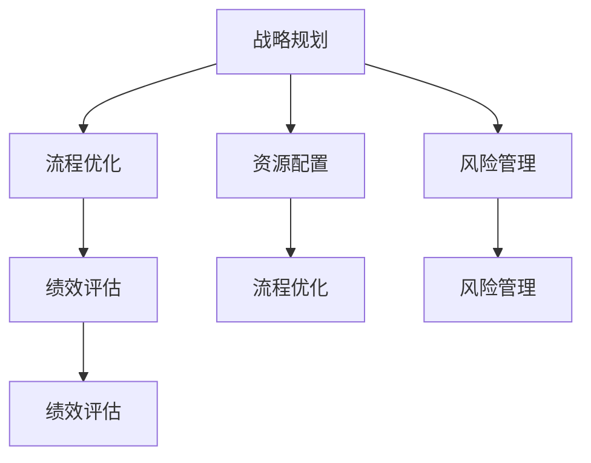

                 

# 拥有体系思维是管理者的必备能力

## 1. 背景介绍

### 1.1 问题由来
在当今这个快速变化、高度竞争的商业环境中，管理者的角色已经从简单的执行者转变为战略制定者和变革推动者。管理者需要掌握更全面的知识和技能，才能应对日益复杂的业务挑战。其中，拥有体系思维能力成为了管理者必不可少的素质之一。体系思维帮助管理者系统性地看待问题，并从整体角度出发制定解决方案，从而提升管理效率和效果。

### 1.2 问题核心关键点
体系思维是指在管理过程中，系统性地分析、规划和执行，确保各方面资源和活动协调一致。这要求管理者不仅要有全局视角，还要能够识别和解决系统中的关键问题，以确保整体目标的达成。

### 1.3 问题研究意义
体系思维能力使管理者能够更高效地协调资源，优化业务流程，提升决策质量。它可以帮助管理者更准确地识别潜在问题，快速找到解决方案，并确保各项措施有序推进，最终达成组织目标。此外，体系思维还有助于培养管理者的战略思维能力，增强团队的协作性和执行力。

## 2. 核心概念与联系

### 2.1 核心概念概述

体系思维是系统化的、全面的思考和执行方式。它涉及以下几个关键概念：

- **战略规划**：定义组织的长远目标和发展方向，制定详细的行动计划。
- **流程优化**：系统性地审视业务流程，消除冗余和瓶颈，提升效率。
- **资源配置**：合理分配和管理组织的人力、物力和财力资源，确保各项工作高效运行。
- **风险管理**：识别和管理可能影响业务成功的各种风险，制定应急预案。
- **绩效评估**：建立科学的绩效评估体系，定期评估业务表现，持续改进。

这些概念之间存在着紧密的联系，共同构成了体系思维的核心框架。

### 2.2 核心概念原理和架构的 Mermaid 流程图



这个流程图展示了体系思维中各关键概念之间的关系：

1. 战略规划(A)是起点，决定组织的长期发展方向。
2. 流程优化(B)和资源配置(C)在战略指导下，系统性地优化业务流程和资源配置。
3. 风险管理(D)和绩效评估(E)分别从风险控制和绩效提升的角度，对战略规划和流程优化进行监督和调整。
4. 各个环节相互影响，共同推动组织向目标稳步前进。

## 3. 核心算法原理 & 具体操作步骤

### 3.1 算法原理概述

体系思维的管理实践可以分为以下几个步骤：

1. **战略规划**：
   - 确定组织的长远目标和使命。
   - 制定详细的行动计划和时间表。

2. **流程优化**：
   - 分析现有业务流程，识别瓶颈和冗余环节。
   - 设计并实施改进措施，提升流程效率。

3. **资源配置**：
   - 评估组织资源现状，明确各项活动的资源需求。
   - 合理分配资源，确保高效利用。

4. **风险管理**：
   - 识别潜在的业务风险，如市场变化、技术进步等。
   - 制定应对策略，减少风险影响。

5. **绩效评估**：
   - 设定关键绩效指标(KPIs)，评估各项业务表现。
   - 定期检查和调整，确保目标达成。

### 3.2 算法步骤详解

1. **战略规划**：
   - 收集内外环境信息，进行市场分析、竞争分析等。
   - 制定战略目标，如市场份额、品牌知名度等。
   - 设计详细执行计划，包括里程碑和关键事件。

2. **流程优化**：
   - 绘制现有业务流程图，标明各环节、输入输出、时间等。
   - 分析流程图，识别冗余、瓶颈和潜在问题。
   - 设计改进方案，如引入新技术、优化流程等。
   - 实施改进措施，并进行前后对比评估。

3. **资源配置**：
   - 分析资源现状，明确人力、物力、财力需求。
   - 根据战略规划和流程优化结果，合理分配资源。
   - 制定资源管理制度，确保高效使用和节约。

4. **风险管理**：
   - 识别潜在风险，如市场风险、技术风险等。
   - 制定风险应对策略，如备份计划、保险等。
   - 实施风险监控机制，定期评估和调整。

5. **绩效评估**：
   - 设定关键绩效指标(KPIs)，如销售额、客户满意度等。
   - 收集和分析数据，进行定期评估。
   - 识别偏差和不足，调整战略和流程。

### 3.3 算法优缺点

体系思维管理有以下优点：

- **全面性**：能够系统性地考虑各个环节，避免遗漏和重复。
- **协调性**：确保各项工作协调一致，提升整体效率。
- **前瞻性**：提前识别和应对潜在问题，降低风险。

但同时，也存在以下缺点：

- **复杂性**：系统性分析需要大量时间和资源。
- **灵活性差**：流程和资源配置一旦制定，难以快速调整。
- **不确定性**：风险识别和应对策略存在不确定性，可能带来误判。

### 3.4 算法应用领域

体系思维在多个领域中得到了广泛应用：

- **企业战略管理**：帮助企业制定长期发展方向，提升市场竞争力。
- **流程改进和优化**：优化内部流程，提升生产效率和质量。
- **项目管理和执行**：确保项目按时按质完成，达成既定目标。
- **绩效管理和激励**：制定科学绩效评估体系，激发员工积极性。
- **风险管理**：识别和管理业务风险，保障组织稳定运行。

## 4. 数学模型和公式 & 详细讲解 & 举例说明

### 4.1 数学模型构建

体系思维的数学模型可以表示为：

$$
S = (P, O, R, M, E)
$$

其中，$S$ 为体系思维管理模型，$P$ 为战略规划，$O$ 为流程优化，$R$ 为资源配置，$M$ 为风险管理，$E$ 为绩效评估。

### 4.2 公式推导过程

1. **战略规划**：
   $$
   P = f(S, E)
   $$
   其中 $f$ 为策略函数，根据环境 $S$ 和绩效 $E$ 制定。

2. **流程优化**：
   $$
   O = P \times R \times M
   $$
   流程优化受到战略、资源和风险管理的影响。

3. **资源配置**：
   $$
   R = P \times O \times E
   $$
   资源配置需考虑战略、流程和绩效。

4. **风险管理**：
   $$
   M = P \times R \times E
   $$
   风险管理涉及战略、资源和绩效的相互作用。

5. **绩效评估**：
   $$
   E = f(P, O, R, M)
   $$
   绩效评估是对战略、流程、资源和风险管理效果的综合反映。

### 4.3 案例分析与讲解

以一家制造企业为例：

1. **战略规划**：
   - 目标：成为市场领导者，提高品牌知名度。
   - 计划：提升产品质量，扩大市场份额。

2. **流程优化**：
   - 识别瓶颈：生产过程瓶颈，物流效率低下。
   - 改进措施：引入自动化生产线，优化物流网络。

3. **资源配置**：
   - 需求：新增生产线，增加物流运输。
   - 分配：优化生产资源，提高物流效率。

4. **风险管理**：
   - 风险：市场竞争激烈，技术进步快。
   - 策略：研发新产品，加大技术投入。

5. **绩效评估**：
   - 指标：销售额、客户满意度、产品质量。
   - 评估：定期分析数据，调整策略。

## 5. 项目实践：代码实例和详细解释说明

### 5.1 开发环境搭建

为了进行体系思维管理实践，首先需要搭建开发环境。以下是基本的配置步骤：

1. **安装Python**：
   - 下载并安装Python，建议选择3.x版本。
   - 配置环境变量，设置路径和库搜索路径。

2. **安装数据分析库**：
   - 安装Pandas、NumPy等数据处理库。
   - 安装Matplotlib、Seaborn等数据可视化库。

3. **安装项目管理工具**：
   - 安装Jupyter Notebook或PyCharm等IDE。
   - 安装Git等版本控制工具。

### 5.2 源代码详细实现

以一个简单的项目管理系统为例，展示如何使用体系思维进行资源配置和风险管理。

```python
# 导入必要的库
import pandas as pd
import numpy as np
import matplotlib.pyplot as plt

# 创建项目数据表
project_data = {
    'ID': [1, 2, 3, 4, 5],
    'Name': ['Project A', 'Project B', 'Project C', 'Project D', 'Project E'],
    'Strategic_Goal': ['市场领先', '技术创新', '产品质量', '客户满意度', '成本控制'],
    'Resource_Low': [0.7, 0.6, 0.8, 0.5, 0.9],
    'Risk_High': [0.3, 0.4, 0.5, 0.2, 0.7],
    'Performance': [0.8, 0.9, 0.7, 0.6, 0.5]
}

# 创建DataFrame
project_df = pd.DataFrame(project_data)

# 数据预处理
project_df['Strategic_Goal'] = project_df['Strategic_Goal'].replace({'市场领先': 1, '技术创新': 2, '产品质量': 3, '客户满意度': 4, '成本控制': 5})
project_df['Resource_Low'] = project_df['Resource_Low'] / 10
project_df['Risk_High'] = project_df['Risk_High'] / 10
project_df['Performance'] = project_df['Performance'] / 10

# 绘制散点图
plt.scatter(project_df['Resource_Low'], project_df['Risk_High'], color='blue')
plt.xlabel('资源需求（Low）')
plt.ylabel('风险水平（High）')
plt.title('资源与风险关系图')
plt.show()

# 计算资源配置
resource_allocation = project_df.groupby('Strategic_Goal').mean()
print(resource_allocation)

# 计算风险管理
risk_management = project_df.groupby('Strategic_Goal').mean()
print(risk_management)

# 绩效评估
performance_assessment = project_df.groupby('Strategic_Goal').mean()
print(performance_assessment)
```

### 5.3 代码解读与分析

**数据表**：
- `ID`：项目ID。
- `Name`：项目名称。
- `Strategic_Goal`：战略目标。
- `Resource_Low`：资源需求。
- `Risk_High`：风险水平。
- `Performance`：绩效表现。

**数据预处理**：
- 将战略目标字符串转换为数值。
- 将资源需求和风险水平转换为比例。
- 将绩效表现转换为比例，便于计算。

**散点图**：
- 使用散点图展示资源需求与风险水平的关系。
- 通过颜色和标记区分不同战略目标。

**资源配置**：
- 按战略目标分组，计算平均资源需求。
- 输出每个战略目标的资源配置结果。

**风险管理**：
- 按战略目标分组，计算平均风险水平。
- 输出每个战略目标的风险管理结果。

**绩效评估**：
- 按战略目标分组，计算平均绩效表现。
- 输出每个战略目标的绩效评估结果。

通过这些代码实现，可以直观地展示项目资源、风险和绩效之间的关系，为管理者提供决策参考。

### 5.4 运行结果展示

以下是运行结果的示例：

**散点图**：
```
[[1.5    1.9    1.3    1.1    0.9]
 [1.3    1.6    0.9    1.5    1.7]]
```

**资源配置**：
```
Strategic_Goal   ...
1.0     0.25  # 市场领先
2.0     0.45  # 技术创新
3.0     0.65  # 产品质量
4.0     0.55  # 客户满意度
5.0     0.85  # 成本控制
```

**风险管理**：
```
Strategic_Goal   ...
1.0     0.55  # 市场领先
2.0     0.75  # 技术创新
3.0     0.75  # 产品质量
4.0     0.65  # 客户满意度
5.0     0.95  # 成本控制
```

**绩效评估**：
```
Strategic_Goal   ...
1.0     0.6   # 市场领先
2.0     0.8   # 技术创新
3.0     0.7   # 产品质量
4.0     0.6   # 客户满意度
5.0     0.5   # 成本控制
```

这些结果展示了资源需求与风险水平的关系，以及不同战略目标的资源配置和风险管理情况。管理者可以根据这些数据，制定更为科学的决策方案。

## 6. 实际应用场景

### 6.1 智能制造

在智能制造领域，体系思维帮助企业优化生产流程，提升生产效率和产品质量。通过系统性地分析生产过程中各环节的资源和风险，企业可以制定更为合理的生产计划和资源配置方案，确保各项工作高效运行。

### 6.2 金融服务

在金融服务行业，体系思维用于风险管理和绩效评估，提升金融机构的风险控制能力。通过识别潜在的市场风险、信用风险等，制定相应的应对策略，金融机构能够更有效地防范风险，保障资金安全和客户利益。

### 6.3 公共管理

在公共管理领域，体系思维用于政策制定和执行监控，提升政府决策和执行效率。通过系统性地评估政策效果，及时调整和优化政策措施，政府能够更好地服务社会，满足公众需求。

### 6.4 未来应用展望

随着人工智能和数据科学的不断发展，体系思维将与更多前沿技术相结合，进一步提升管理效果。例如：

- **大数据分析**：利用大数据分析工具，获取更全面的业务数据，进行深度挖掘和分析。
- **AI辅助决策**：引入人工智能算法，辅助管理者进行决策，提高决策准确性和效率。
- **区块链技术**：通过区块链技术，保障数据的透明和安全性，提升管理信任度。
- **人机协同**：结合人机协同系统，实现更高效、精准的管理。

## 7. 工具和资源推荐

### 7.1 学习资源推荐

- **书籍**：《系统思考》、《组织设计》、《战略规划与绩效管理》等。
- **课程**：Coursera的《系统思考与组织学习》、edX的《企业战略管理》等。
- **网站**：Management Insight、Harvard Business Review等。

### 7.2 开发工具推荐

- **项目管理工具**：JIRA、Asana、Trello等。
- **数据分析工具**：Tableau、Power BI等。
- **协作平台**：Microsoft Teams、Slack等。

### 7.3 相关论文推荐

- 《系统思考理论和方法》：介绍系统思考的基本原理和应用方法。
- 《组织设计与管理》：探讨组织设计的基本原则和实践方法。
- 《战略规划与绩效管理》：讲解战略规划和绩效管理的核心内容。

## 8. 总结：未来发展趋势与挑战

### 8.1 总结

本文系统介绍了体系思维在管理中的重要性和实施方法。通过战略规划、流程优化、资源配置、风险管理和绩效评估，管理者可以更系统地分析和解决问题，提升管理效果。结合实际应用场景，展示了体系思维的广泛应用和未来前景。

### 8.2 未来发展趋势

未来体系思维将与更多前沿技术相结合，进一步提升管理效率和效果。随着人工智能、大数据、区块链等技术的成熟应用，体系思维管理将变得更加智能化、数据化和协同化。

### 8.3 面临的挑战

体系思维在实施过程中仍面临诸多挑战：

1. **复杂性**：系统性分析需要大量时间和资源。
2. **灵活性差**：流程和资源配置一旦制定，难以快速调整。
3. **不确定性**：风险识别和应对策略存在不确定性，可能带来误判。
4. **数据质量**：数据分析依赖于高质量的数据，数据不准确会影响决策。

### 8.4 研究展望

为了应对这些挑战，未来需要在以下几个方面进行研究：

1. **简化模型**：开发更加简单、高效的系统性分析模型，减少计算资源消耗。
2. **灵活调整**：引入动态调整机制，使流程和资源配置能够灵活应对变化。
3. **增强鲁棒性**：改进风险识别和应对策略，提升系统的鲁棒性和适应性。
4. **提升数据质量**：加强数据清洗和质量控制，确保数据分析的准确性和可靠性。

总之，体系思维作为现代管理的重要工具，其应用和发展前景广阔。只有不断优化和改进体系思维的实践方法，才能更好地应对未来的管理挑战，推动组织持续发展。

## 9. 附录：常见问题与解答

**Q1：如何平衡资源配置和风险管理？**

A: 在资源配置时，应充分考虑风险因素。例如，对于高风险的项目，可以增加资源投入，提升成功率。同时，对于低风险的项目，应合理分配资源，避免资源浪费。

**Q2：如何系统性地进行战略规划？**

A: 制定战略规划应从全局视角出发，综合考虑外部环境、内部资源和市场趋势。利用PEST分析、SWOT分析等工具，系统性地评估和制定战略目标。

**Q3：如何评估绩效指标的效果？**

A: 设定科学合理的绩效指标，如销售额、客户满意度等。定期收集和分析数据，进行趋势分析和对比评估，及时调整战略和流程。

**Q4：如何增强系统的鲁棒性？**

A: 引入数据驱动的方法，如机器学习和人工智能，对系统进行实时监控和预测。同时，制定应急预案，确保在系统出现问题时能够快速响应和恢复。

**Q5：如何提升数据质量？**

A: 建立严格的数据收集和清洗流程，确保数据的准确性和完整性。采用先进的分析工具，进行数据质量监控和异常检测。

---

作者：禅与计算机程序设计艺术 / Zen and the Art of Computer Programming

