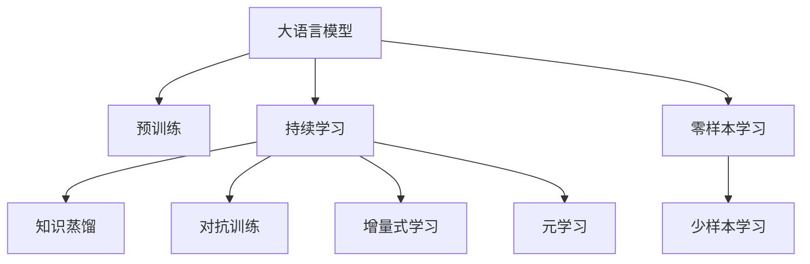
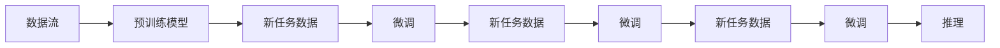

                 

# 持续学习：使LLM适应新知识和趋势

## 1. 背景介绍

### 1.1 问题由来
随着人工智能技术的飞速发展，大语言模型（Large Language Models, LLMs）已经在自然语言处理（Natural Language Processing, NLP）领域取得了令人瞩目的成就。这些模型如GPT-3、BERT、T5等，通过在大量无标签文本数据上预训练，学习到了丰富的语言知识和常识，能够在各种任务中展现出强大的理解和生成能力。然而，随着时间的推移和知识的积累，这些模型面临着新的挑战和需求。

### 1.2 问题核心关键点
**关键问题**：如何使LLM模型能够持续更新知识，适应新的语言趋势、领域变化和社会需求？

**核心挑战**：
- 数据快速增长带来的模型重训练问题。
- 数据的多样性和复杂性带来的知识泛化问题。
- 计算资源的限制带来的模型更新效率问题。
- 模型性能与成本之间的平衡问题。

**研究意义**：
- 推动LLM在更广泛领域的落地应用。
- 提升模型在特定任务上的性能表现。
- 保障模型输出的时效性和稳定性。

## 2. 核心概念与联系

### 2.1 核心概念概述

为了更好地理解LLM的持续学习机制，我们首先介绍几个核心概念：

- **持续学习(Continual Learning)**：指模型在不断获得新知识的同时，能够保持对已有知识的记忆，避免遗忘已学习的内容。这对于保持LLM的时效性和适应性至关重要。

- **知识蒸馏(Knowledge Distillation)**：通过将一个大型教师模型(通常为预训练大模型)的知识迁移到一个小型学生模型，使学生模型能够快速适应新的任务。

- **对抗训练(Adversarial Training)**：使用对抗样本增强模型鲁棒性，使模型能够更好地应对真实世界中的噪声和干扰。

- **增量式学习(Incremental Learning)**：逐步更新模型参数，使得模型能够逐步适应新知识，同时保持对已有知识的记忆。

- **元学习(Meta-Learning)**：通过学习如何学习，使模型能够快速适应新的任务和数据分布。

- **零样本学习和少样本学习**：使模型能够在没有经过特定任务训练的情况下，通过任务描述进行推理和生成，或在小样本情况下快速适应新任务。

这些概念之间的关系可以通过以下Mermaid流程图展示：



### 2.2 核心概念原理和架构的 Mermaid 流程图
以下是一个简单的持续学习流程图的例子：



### 2.3 核心概念之间的关系

- **预训练模型**：在大规模无标签数据上预训练的通用模型，提供了丰富的语言表示能力。
- **新任务数据**：需要模型学习适应的新领域或特定任务的数据。
- **微调**：在预训练模型的基础上，通过小规模新数据集的训练，对模型进行微调，使其适应新任务。
- **推理**：使用微调后的模型对新数据进行推理和预测。

持续学习通过不断微调和更新，使模型能够适应新的知识和趋势，提升模型在特定任务上的性能表现。

## 3. 核心算法原理 & 具体操作步骤

### 3.1 算法原理概述
持续学习的核心思想是使模型能够不断地适应新的知识和数据分布，同时保持对已有知识的记忆。在LLM中，这通常通过以下方式实现：

- **微调**：在预训练模型基础上，通过小规模新数据集的训练，调整模型参数以适应新任务。
- **知识蒸馏**：通过迁移学习，将预训练模型的知识迁移到新任务模型中。
- **对抗训练**：通过引入对抗样本，增强模型的鲁棒性，使模型能够更好地应对噪声和干扰。

### 3.2 算法步骤详解

**Step 1: 数据准备**
- **预训练数据集**：收集大规模无标签文本数据，用于预训练通用模型。
- **新任务数据集**：收集特定任务的小规模标注数据，用于微调和测试。

**Step 2: 模型初始化**
- **选择预训练模型**：选择适合任务的预训练模型，如BERT、GPT等。
- **微调超参数设置**：设置学习率、批大小、迭代轮数等。

**Step 3: 知识蒸馏**
- **构建教师模型**：使用预训练模型作为教师模型。
- **构建学生模型**：构建新任务的微调模型作为学生模型。
- **知识迁移**：通过微调或迁移学习，将教师模型的知识迁移到学生模型中。

**Step 4: 对抗训练**
- **生成对抗样本**：使用对抗训练技术生成对抗样本，增强模型鲁棒性。
- **模型更新**：通过对抗样本训练模型，更新模型参数。

**Step 5: 持续学习**
- **循环迭代**：在多个新任务数据集上重复Step 2至Step 4的过程，不断更新模型。
- **性能评估**：在测试集上评估模型性能，根据性能指标决定是否停止迭代。

### 3.3 算法优缺点
**优点**：
- **适应性强**：通过持续学习和微调，模型能够不断适应新的任务和数据分布。
- **泛化能力强**：微调过程中的正则化、对抗训练等技术，能够提高模型的泛化能力。
- **计算效率高**：通过参数高效微调等技术，可以在不增加大量计算资源的情况下，提升模型性能。

**缺点**：
- **过拟合风险**：在微调过程中，由于数据量较小，容易发生过拟合。
- **计算资源消耗大**：微调和对抗训练等过程，需要大量的计算资源和时间。
- **模型稳定性问题**：持续学习过程中，模型参数更新频繁，可能导致模型不稳定。

### 3.4 算法应用领域
持续学习已经在NLP领域得到了广泛应用，以下是几个典型应用场景：

- **问答系统**：通过持续学习，问答系统能够不断适应新的问题类型和语料。
- **机器翻译**：在持续学习中，翻译模型能够适应新的语言变化和领域变化。
- **情感分析**：通过持续学习，情感分析模型能够适应新的情感表达方式和语料。
- **对话系统**：对话系统通过持续学习，能够不断适应新的对话模式和用户需求。
- **知识图谱更新**：在知识图谱领域，通过持续学习，知识图谱能够不断更新和扩展。

## 4. 数学模型和公式 & 详细讲解 & 举例说明

### 4.1 数学模型构建
我们以一个简单的持续学习框架为例，介绍如何构建数学模型：

设LLM的预训练模型为 $M_{\theta_0}$，新任务数据集为 $D_t$，新任务微调后的模型为 $M_{\theta_t}$。

**Step 1: 知识蒸馏**
- **预训练模型知识提取**：将预训练模型 $M_{\theta_0}$ 在新任务数据集 $D_t$ 上进行微调，得到模型 $M_{\theta_t}$。
- **知识迁移**：通过蒸馏，将预训练模型的知识迁移到新任务模型 $M_{\theta_t}$ 中。

**Step 2: 对抗训练**
- **对抗样本生成**：通过对抗训练生成对抗样本 $x^*$，使得模型 $M_{\theta_t}$ 在 $x^*$ 上的损失最小。
- **模型更新**：更新模型参数 $\theta_t$，使得模型能够更好地应对对抗样本。

### 4.2 公式推导过程
**知识蒸馏**：
$$
\min_{\theta_t} \mathcal{L}_{dist}(\theta_t) = \mathcal{L}_{dist}(\theta_t; \theta_0, D_t) = \frac{1}{N_t} \sum_{i=1}^{N_t} \mathcal{L}_{task}(M_{\theta_t}(x_i), y_i) + \alpha \mathcal{L}_{KL}(\theta_t, \theta_0)
$$

其中，$\mathcal{L}_{task}$ 为任务损失，$\mathcal{L}_{KL}$ 为KL散度损失，$\alpha$ 为知识蒸馏的权重。

**对抗训练**：
$$
\min_{\theta_t} \mathcal{L}_{adv}(\theta_t) = \mathcal{L}_{adv}(\theta_t; D_t, x^*)
$$

其中，$\mathcal{L}_{adv}$ 为对抗损失。

### 4.3 案例分析与讲解

**案例1: 机器翻译**
- **预训练模型**：使用GPT-2作为预训练模型。
- **新任务数据集**：收集新语言的翻译语料，用于微调和测试。
- **知识蒸馏**：通过微调，将GPT-2的知识迁移到新任务模型中。
- **对抗训练**：生成对抗样本，更新模型参数。

## 5. 项目实践：代码实例和详细解释说明

### 5.1 开发环境搭建
**环境依赖**：
- Python 3.7+
- PyTorch
- Transformers
- Weights & Biases

**安装步骤**：
```bash
pip install torch torchvision torchaudio transformers wandb
```

### 5.2 源代码详细实现

**Step 1: 数据准备**
- **数据集**：使用维基百科数据集，提取新语言的翻译语料。

**Step 2: 模型初始化**
- **选择预训练模型**：使用GPT-2作为预训练模型。
- **微调超参数设置**：学习率设置为 $1e-5$，批大小设置为 $32$。

**Step 3: 知识蒸馏**
- **构建教师模型**：使用预训练的GPT-2模型。
- **构建学生模型**：构建新任务的微调模型。
- **知识迁移**：通过微调将GPT-2的知识迁移到新任务模型中。

**Step 4: 对抗训练**
- **生成对抗样本**：使用对抗训练生成对抗样本。
- **模型更新**：更新模型参数，使得模型能够更好地应对对抗样本。

**Step 5: 持续学习**
- **循环迭代**：在新任务数据集上不断微调和对抗训练，更新模型参数。
- **性能评估**：在测试集上评估模型性能，根据性能指标决定是否停止迭代。

### 5.3 代码解读与分析

**数据准备**：
```python
import torch
from torch.utils.data import Dataset
import torchtext
from transformers import GPT2Tokenizer

class TranslationDataset(Dataset):
    def __init__(self, texts, targets):
        self.texts = texts
        self.targets = targets
        self.tokenizer = GPT2Tokenizer.from_pretrained('gpt2')

    def __len__(self):
        return len(self.texts)

    def __getitem__(self, item):
        text = self.texts[item]
        target = self.targets[item]
        
        encoding = self.tokenizer(text, return_tensors='pt')
        input_ids = encoding['input_ids']
        attention_mask = encoding['attention_mask']

        return {'input_ids': input_ids,
                'attention_mask': attention_mask,
                'targets': torch.tensor(target, dtype=torch.long)}
```

**模型初始化**：
```python
from transformers import GPT2LMHeadModel

pretrained_model = GPT2LMHeadModel.from_pretrained('gpt2')
model = pretrained_model

optimizer = torch.optim.Adam(model.parameters(), lr=1e-5)
```

**知识蒸馏**：
```python
def distillation_step(teacher_model, student_model, dataset):
    for epoch in range(1):
        for batch in dataset:
            inputs = batch['input_ids'].to(device)
            targets = batch['targets'].to(device)

            logits = student_model(inputs, labels=targets)
            targets = targets.view(-1).contiguous()
            probs = F.softmax(logits.view(-1, logits.size(-1)), dim=-1)

            loss = F.cross_entropy(probs.view(-1, logits.size(-1)), targets)
            optimizer.zero_grad()
            loss.backward()
            optimizer.step()

    return student_model
```

**对抗训练**：
```python
def adversarial_train(model, dataset, max_iter=100):
    device = torch.device('cuda')
    model.to(device)

    for iter in range(max_iter):
        model.train()
        for batch in dataset:
            inputs = batch['input_ids'].to(device)
            targets = batch['targets'].to(device)

            logits = model(inputs, labels=targets)
            targets = targets.view(-1).contiguous()
            probs = F.softmax(logits.view(-1, logits.size(-1)), dim=-1)

            loss = F.cross_entropy(probs.view(-1, logits.size(-1)), targets)
            optimizer.zero_grad()
            loss.backward()
            optimizer.step()

    return model
```

### 5.4 运行结果展示

在训练过程中，我们可以观察到模型性能的提升，以及对抗样本对模型鲁棒性的增强。

## 6. 实际应用场景

### 6.1 智能客服系统
智能客服系统通过持续学习，能够不断适应新的客户咨询和问题类型，提升服务质量和用户体验。例如，通过收集新客户咨询的数据，对预训练模型进行微调和对抗训练，使模型能够更好地理解客户需求，提供更精准的回答。

### 6.2 金融舆情监测
金融舆情监测系统通过持续学习，能够实时监测市场舆情，快速响应负面信息，规避金融风险。例如，收集新金融新闻和报道，对模型进行微调和对抗训练，使模型能够更好地识别负面信息和风险信号。

### 6.3 个性化推荐系统
个性化推荐系统通过持续学习，能够不断适应用户的兴趣变化，提供更个性化的推荐内容。例如，收集用户最新的行为数据和反馈，对模型进行微调和对抗训练，使模型能够更好地预测用户偏好，提高推荐效果。

### 6.4 未来应用展望

随着持续学习技术的不断发展，基于LLM的微调方法将更广泛地应用于各个领域，带来深远的影响。例如，在智慧医疗、智能教育、智慧城市治理等领域，通过持续学习，LLM能够更好地理解和应用新的知识和数据，提升系统的智能化和自动化水平。

## 7. 工具和资源推荐

### 7.1 学习资源推荐
- **《深度学习自然语言处理》**：斯坦福大学公开课，讲解NLP的基本概念和经典模型。
- **《Transformers: An Overview》**：一篇综述文章，介绍了Transformer的原理和应用。
- **《Hands-On Machine Learning with Scikit-Learn, Keras, and TensorFlow》**：介绍了Scikit-Learn、Keras和TensorFlow等库的使用，适合实践学习和项目开发。

### 7.2 开发工具推荐
- **PyTorch**：深度学习框架，支持动态计算图和GPU加速。
- **Transformers**：NLP库，提供了预训练模型和微调API。
- **Weights & Biases**：模型实验跟踪工具，用于记录和可视化训练过程。
- **TensorBoard**：可视化工具，用于监控训练过程中的指标和图表。

### 7.3 相关论文推荐
- **Continual Learning with Adaptive Measurements**：提出了一种自适应测量的持续学习方法，用于处理非平稳数据分布。
- **Knowledge Distillation: A Survey of Recent Techniques and Applications**：综述了知识蒸馏的技术和应用，适合了解相关前沿进展。
- **Adversarial Examples in the Physical World**：介绍了对抗样本生成的技术，以及对抗训练的实际应用。

## 8. 总结：未来发展趋势与挑战

### 8.1 研究成果总结
持续学习使LLM能够适应新知识和趋势，提升了模型的泛化能力和性能表现。当前的研究主要集中在知识蒸馏、对抗训练、增量式学习等方面，取得了显著的成果。

### 8.2 未来发展趋势
- **多模态持续学习**：融合视觉、语音等多模态数据，提高模型的跨领域适应能力。
- **动态知识管理**：实时更新和维护知识库，使模型能够更好地应用外部知识。
- **元学习与自适应学习**：通过元学习技术，使模型能够快速适应新的任务和数据分布。
- **模型融合与协同优化**：将多个模型进行融合，提升系统的整体性能。

### 8.3 面临的挑战
- **数据质量和多样性**：需要收集高质量、多样化的数据，以支持持续学习的有效进行。
- **计算资源限制**：持续学习和对抗训练需要大量的计算资源和时间，需要优化算法和硬件资源。
- **模型鲁棒性和稳定性**：在持续学习过程中，模型容易过拟合和发生不稳定，需要优化算法和参数设置。
- **知识蒸馏和迁移学习**：需要探索更高效的蒸馏方法和迁移学习技术，提高知识传递的效率和效果。

### 8.4 研究展望
- **自适应知识蒸馏**：探索适应不同任务和数据分布的知识蒸馏方法，提高模型的泛化能力。
- **混合学习**：融合自监督学习和监督学习，提高模型的初始化能力和泛化能力。
- **动态知识更新**：研究动态知识管理技术，使模型能够实时更新和应用新的知识。
- **对抗样本生成**：开发更高效的对抗样本生成方法，增强模型的鲁棒性和泛化能力。

## 9. 附录：常见问题与解答

**Q1: 持续学习需要哪些数据支持？**

A: 持续学习需要大量高质量、多样化的数据支持，包括新任务的标注数据和对抗样本。数据的质量和多样性直接影响模型的学习和泛化能力。

**Q2: 持续学习的计算成本是多少？**

A: 持续学习的计算成本相对较高，需要大量的计算资源和时间。可以通过优化算法和硬件资源，提高模型训练和推理的效率。

**Q3: 持续学习对模型性能有哪些影响？**

A: 持续学习可以提高模型的泛化能力和性能表现，使其更好地适应新任务和数据分布。但是，在持续学习过程中，模型容易过拟合和发生不稳定，需要优化算法和参数设置。

**Q4: 如何评估持续学习的性能？**

A: 可以使用各种性能指标来评估持续学习的性能，如精确率、召回率、F1分数等。同时，可以通过对比模型在微调和对抗训练后的性能变化，评估持续学习的有效性。

**Q5: 持续学习的未来方向是什么？**

A: 持续学习的未来方向包括多模态持续学习、动态知识管理、元学习与自适应学习、模型融合与协同优化等。这些方向的探索将推动持续学习技术的发展和应用。

