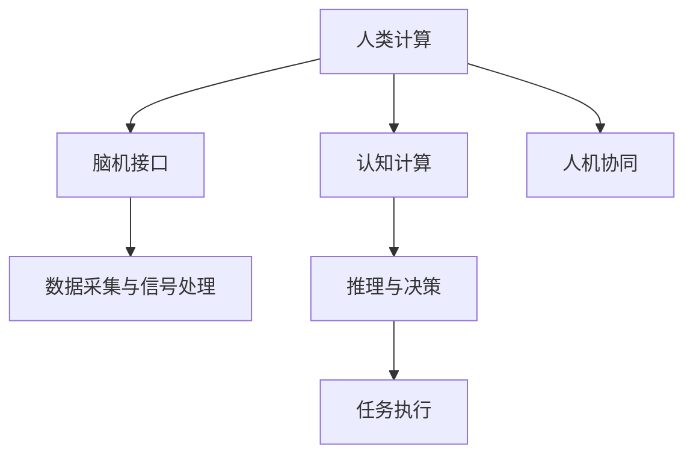

                 

# 探索人类思维的奥秘：人类计算的认知价值

> 关键词：人类计算, 认知价值, 人工智能, 神经科学, 脑机接口, 深度学习, 计算机科学

## 1. 背景介绍

### 1.1 问题由来

随着人工智能技术的快速发展，特别是深度学习模型的广泛应用，人类对智能的探索日益深入。深度学习模型能够通过学习大量数据，模拟和模仿人类的思维过程，从而在图像识别、自然语言处理、语音识别等领域取得了显著的成果。然而，这种模仿往往是表面的、机械的，缺乏对人类思维本质的理解和揭示。

因此，探索人类思维的奥秘，理解其认知价值，成为当前人工智能研究的一个重要方向。人类计算（Human Computing），即利用人类大脑的认知能力进行计算，作为一种全新的计算范式，能够充分利用人类大脑的高级认知功能，如推理、创造、情感等，为人工智能的发展提供新的思路和方法。

### 1.2 问题核心关键点

人类计算的核心在于利用人类的认知能力进行计算，将人类大脑与计算机深度结合。具体来说，可以从以下几个方面进行探索：

- 脑机接口（Brain-Computer Interface, BCI）：通过将人类的大脑信号转化为计算机可读的信号，实现人机交互。
- 认知计算（Cognitive Computing）：利用人类的认知模型和算法，模拟人类的推理和决策过程，提升计算的深度和广度。
- 人机协同（Human-Computer Collaboration）：在复杂任务中，结合人类与计算机的优势，实现更高的计算效率和智能化水平。

这些核心概念的相互联系和交互，构成了人类计算的完整框架，为理解人类思维的奥秘和提高人工智能的认知价值提供了新视角。

## 2. 核心概念与联系

### 2.1 核心概念概述

为更好地理解人类计算的认知价值，本节将介绍几个密切相关的核心概念：

- 人类计算（Human Computing）：通过利用人类大脑的高级认知功能，如推理、创造、情感等，进行计算和决策。
- 脑机接口（BCI）：通过将人类大脑信号转化为计算机可读的信号，实现人机交互和协同计算。
- 认知计算（Cognitive Computing）：模拟人类认知模型和算法，提升计算的深度和广度。
- 人机协同（Human-Computer Collaboration）：结合人类与计算机的优势，实现更高水平的计算和决策。

这些核心概念之间的逻辑关系可以通过以下Mermaid流程图来展示：



这个流程图展示了几大核心概念之间的逻辑关系：

1. 人类计算通过脑机接口实现人脑与计算机的交互，为人机协同提供基础。
2. 认知计算利用人类认知模型和算法，提升计算深度和广度。
3. 人机协同结合人类与计算机的优势，实现更高水平的计算和决策。

## 3. 核心算法原理 & 具体操作步骤

### 3.1 算法原理概述

人类计算的核心算法原理，主要基于神经科学的理论和技术。神经科学揭示了人类大脑的复杂结构和功能，特别是神经元和突触的工作机制，为人类计算提供了科学基础。

人类计算的算法原理主要包括以下几个方面：

1. 神经网络模型：模仿人类大脑的神经元结构，构建大规模神经网络，用于处理复杂计算任务。
2. 深度学习模型：利用深度学习技术，模拟人类大脑的复杂层次结构和自适应学习能力，提升计算精度和效果。
3. 认知模型：结合心理学和神经科学的知识，构建认知模型，模拟人类思维的推理、决策、创造等过程。
4. 人机交互模型：通过脑机接口技术，将人类大脑信号转化为计算机可读信号，实现人机协同。

### 3.2 算法步骤详解

人类计算的算法步骤大致可以分为以下几个阶段：

**Step 1: 数据采集与预处理**

- 使用脑机接口技术，采集人类大脑信号（如EEG、fMRI等）。
- 对信号进行滤波、降噪、归一化等预处理操作，确保数据质量。

**Step 2: 信号处理与特征提取**

- 使用信号处理算法，将原始大脑信号转化为可读的特征数据。
- 利用深度学习模型，提取大脑信号中的特征信息。

**Step 3: 模型训练与推理**

- 利用深度学习模型，训练神经网络，进行推理和决策。
- 结合认知模型，模拟人类的推理和决策过程。

**Step 4: 人机交互**

- 利用脑机接口技术，将推理和决策结果转化为可操作的形式，实现人机交互。
- 在人机交互中，结合人类与计算机的优势，提升计算效率和效果。

**Step 5: 结果评估与反馈**

- 对推理和决策结果进行评估，修正模型参数和算法。
- 利用反馈机制，优化模型性能和计算效果。

### 3.3 算法优缺点

人类计算作为一种全新的计算范式，具有以下优点：

1. 高效性：利用人类高级认知功能，提升计算效率和效果。
2. 适应性：结合人类与计算机的优势，适应复杂多变的计算任务。
3. 创新性：充分利用人类创造力和情感，推动人工智能技术的创新发展。

然而，人类计算也存在以下局限性：

1. 数据依赖：依赖人类大脑信号作为数据源，数据质量和稳定性较难保证。
2. 技术复杂性：脑机接口和人机协同技术尚不成熟，实现难度较大。
3. 隐私问题：采集和处理人类大脑信号涉及隐私问题，需要严格控制和保护。

尽管存在这些局限性，但人类计算作为一种全新的计算范式，为理解人类思维的奥秘和提高人工智能的认知价值提供了新的方向和方法。

### 3.4 算法应用领域

人类计算技术已经在多个领域得到了应用，以下是几个典型的应用场景：

- **医疗诊断**：利用脑机接口技术，采集和处理大脑信号，辅助医生进行疾病诊断和手术决策。
- **人工智能辅助设计**：结合人类与计算机的优势，进行复杂设计和创造，提升设计质量和效率。
- **智能教育**：利用认知模型和人机交互技术，实现个性化的教育训练，提升学习效果。
- **人机协同机器人**：结合人类与机器人的优势，实现复杂任务的协同完成，提升机器人智能化水平。
- **虚拟现实（VR）与增强现实（AR）**：结合人类感知和计算能力，提供沉浸式交互体验，推动VR和AR技术的发展。

这些应用场景展示了人类计算技术的多样性和潜力，为人工智能的发展提供了新的思路和方法。

## 4. 数学模型和公式 & 详细讲解 & 举例说明

### 4.1 数学模型构建

人类计算的数学模型主要基于神经科学和认知科学的研究成果，构建复杂的神经网络模型和认知模型。

以深度学习模型为例，神经网络由多个神经元层组成，每个神经元接收输入信号，并输出加权和。神经网络通过多层非线性变换，实现对复杂数据的处理和表示。

假设神经网络由 $L$ 层组成，每层有 $N_i$ 个神经元，输入为 $X$，输出为 $Y$。则神经网络的数学模型可以表示为：

$$
Y = f(\sigma(\mathbf{W}^{(L)} \sigma(\mathbf{W}^{(L-1)} \cdots \sigma(\mathbf{W}^{(1)}X + \mathbf{b}^{(1)})))
$$

其中，$f$ 为激活函数，$\sigma$ 为非线性激活函数，$\mathbf{W}^{(l)}$ 为第 $l$ 层的权重矩阵，$\mathbf{b}^{(l)}$ 为偏置向量。

### 4.2 公式推导过程

以下是深度学习模型的前向传播和反向传播的公式推导过程：

**前向传播**

假设输入 $X$ 为 $n$ 维向量，输出 $Y$ 为 $m$ 维向量。神经网络的输出可以表示为：

$$
Z^{(l)} = \mathbf{W}^{(l)}X^{(l-1)} + \mathbf{b}^{(l)}
$$

$$
A^{(l)} = \sigma(Z^{(l)})
$$

其中 $X^{(l)}$ 为第 $l$ 层的输入，$A^{(l)}$ 为第 $l$ 层的输出，$Z^{(l)}$ 为第 $l$ 层的加权和。

假设 $L$ 层神经网络的结构如下：

$$
A^{(1)} = X
$$

$$
Z^{(l)} = \mathbf{W}^{(l)}A^{(l-1)} + \mathbf{b}^{(l)}
$$

$$
A^{(l)} = \sigma(Z^{(l)})
$$

则最终输出可以表示为：

$$
Y = A^{(L)}
$$

**反向传播**

假设输出 $Y$ 和目标输出 $T$ 的误差为 $\mathcal{L}$，神经网络的误差可以表示为：

$$
\mathcal{L} = \frac{1}{2}\|Y-T\|^2
$$

则梯度下降算法的更新公式为：

$$
\frac{\partial \mathcal{L}}{\partial \mathbf{W}^{(l)}} = \frac{\partial \mathcal{L}}{\partial Z^{(l)}} \frac{\partial Z^{(l)}}{\partial A^{(l-1)}} \frac{\partial A^{(l-1)}}{\partial Z^{(l-1)}} \frac{\partial Z^{(l-1)}}{\partial \mathbf{W}^{(l-1)}}
$$

$$
\frac{\partial \mathcal{L}}{\partial \mathbf{b}^{(l)}} = \frac{\partial \mathcal{L}}{\partial Z^{(l)}} \frac{\partial Z^{(l)}}{\partial A^{(l)}}
$$

其中，$\frac{\partial \mathcal{L}}{\partial Z^{(l)}}$ 为误差对加权和的梯度，$\frac{\partial Z^{(l)}}{\partial A^{(l-1)}}$ 和 $\frac{\partial A^{(l-1)}}{\partial Z^{(l-1)}}$ 为误差对前一层的梯度。

### 4.3 案例分析与讲解

以手写数字识别为例，分析深度学习模型在图像识别任务中的应用。

假设输入图片 $X$ 为 $28 \times 28 = 784$ 维向量，输出标签 $T$ 为 $10$ 维向量。神经网络由卷积层、池化层和全连接层组成。

假设卷积层和池化层的参数分别为 $\mathbf{W}^{(1)}$、$\mathbf{b}^{(1)}$、$\mathbf{W}^{(2)}$、$\mathbf{b}^{(2)}$、$\mathbf{W}^{(3)}$、$\mathbf{b}^{(3)}$，全连接层的参数为 $\mathbf{W}^{(4)}$、$\mathbf{b}^{(4)}$、$\mathbf{W}^{(5)}$、$\mathbf{b}^{(5)}$。

前向传播过程如下：

$$
X^{(1)} = \mathbf{W}^{(1)}X + \mathbf{b}^{(1)}
$$

$$
A^{(1)} = \sigma(X^{(1)})
$$

$$
X^{(2)} = \mathbf{W}^{(2)}A^{(1)} + \mathbf{b}^{(2)}
$$

$$
A^{(2)} = \sigma(X^{(2)})
$$

$$
X^{(3)} = \mathbf{W}^{(3)}A^{(2)} + \mathbf{b}^{(3)}
$$

$$
A^{(3)} = \sigma(X^{(3)})
$$

$$
Z^{(4)} = \mathbf{W}^{(4)}A^{(3)} + \mathbf{b}^{(4)}
$$

$$
A^{(4)} = \sigma(Z^{(4)})
$$

$$
Z^{(5)} = \mathbf{W}^{(5)}A^{(4)} + \mathbf{b}^{(5)}
$$

$$
A^{(5)} = \sigma(Z^{(5)})
$$

则最终输出为：

$$
Y = A^{(5)}
$$

反向传播过程如下：

$$
\frac{\partial \mathcal{L}}{\partial \mathbf{W}^{(5)}} = \frac{\partial \mathcal{L}}{\partial Z^{(5)}} \frac{\partial Z^{(5)}}{\partial A^{(4)}} \frac{\partial A^{(4)}}{\partial Z^{(4)}} \frac{\partial Z^{(4)}}{\partial \mathbf{W}^{(4)}}
$$

$$
\frac{\partial \mathbf{b}^{(5)}}{\partial \mathcal{L}} = \frac{\partial \mathcal{L}}{\partial Z^{(5)}} \frac{\partial Z^{(5)}}{\partial A^{(5)}}
$$

$$
\frac{\partial \mathbf{W}^{(4)}}{\partial \mathcal{L}} = \frac{\partial \mathcal{L}}{\partial Z^{(4)}} \frac{\partial Z^{(4)}}{\partial A^{(4)}} \frac{\partial A^{(4)}}{\partial Z^{(3)}} \frac{\partial Z^{(3)}}{\partial \mathbf{W}^{(3)}}
$$

$$
\frac{\partial \mathbf{b}^{(4)}}{\partial \mathcal{L}} = \frac{\partial \mathcal{L}}{\partial Z^{(4)}} \frac{\partial Z^{(4)}}{\partial A^{(4)}}
$$

$$
\frac{\partial \mathbf{W}^{(3)}}{\partial \mathcal{L}} = \frac{\partial \mathcal{L}}{\partial Z^{(3)}} \frac{\partial Z^{(3)}}{\partial A^{(2)}} \frac{\partial A^{(2)}}{\partial Z^{(1)}} \frac{\partial Z^{(1)}}{\partial \mathbf{W}^{(1)}}
$$

$$
\frac{\partial \mathbf{b}^{(3)}}{\partial \mathcal{L}} = \frac{\partial \mathcal{L}}{\partial Z^{(3)}} \frac{\partial Z^{(3)}}{\partial A^{(3)}}
$$

$$
\frac{\partial \mathbf{W}^{(2)}}{\partial \mathcal{L}} = \frac{\partial \mathcal{L}}{\partial Z^{(2)}} \frac{\partial Z^{(2)}}{\partial A^{(1)}} \frac{\partial A^{(1)}}{\partial Z^{(1)}}
$$

$$
\frac{\partial \mathbf{b}^{(2)}}{\partial \mathcal{L}} = \frac{\partial \mathcal{L}}{\partial Z^{(2)}} \frac{\partial Z^{(2)}}{\partial A^{(2)}}
$$

通过反向传播算法，可以计算出每个参数的梯度，进而更新模型参数，最小化误差 $\mathcal{L}$。

## 5. 项目实践：代码实例和详细解释说明

### 5.1 开发环境搭建

在进行深度学习模型开发前，我们需要准备好开发环境。以下是使用Python进行TensorFlow开发的环境配置流程：

1. 安装Anaconda：从官网下载并安装Anaconda，用于创建独立的Python环境。

2. 创建并激活虚拟环境：
```bash
conda create -n tensorflow-env python=3.8 
conda activate tensorflow-env
```

3. 安装TensorFlow：根据CUDA版本，从官网获取对应的安装命令。例如：
```bash
pip install tensorflow
```

4. 安装各类工具包：
```bash
pip install numpy pandas scikit-learn matplotlib tqdm jupyter notebook ipython
```

完成上述步骤后，即可在`tensorflow-env`环境中开始深度学习模型的开发。

### 5.2 源代码详细实现

这里我们以手写数字识别为例，给出使用TensorFlow对卷积神经网络进行训练的PyTorch代码实现。

首先，定义模型的参数和输入：

```python
import tensorflow as tf

def conv_net(x, reuse, dropout_rate=0.8):
    with tf.variable_scope('conv_net', reuse=reuse):
        # 输入层
        x_image = tf.reshape(x, shape=[-1, 28, 28, 1])

        # 卷积层 1
        conv1 = tf.layers.conv2d(inputs=x_image, filters=32, kernel_size=[5, 5], padding="same", activation=tf.nn.relu)
        pool1 = tf.layers.max_pooling2d(inputs=conv1, pool_size=[2, 2], strides=2)

        # 卷积层 2
        conv2 = tf.layers.conv2d(inputs=pool1, filters=64, kernel_size=[5, 5], padding="same", activation=tf.nn.relu)
        pool2 = tf.layers.max_pooling2d(inputs=conv2, pool_size=[2, 2], strides=2)

        # 全连接层 1
        fc1 = tf.layers.flatten(pool2)
        fc1 = tf.layers.dense(inputs=fc1, units=1024, activation=tf.nn.relu)
        fc1 = tf.layers.dropout(inputs=fc1, rate=dropout_rate)

        # 全连接层 2
        out = tf.layers.dense(inputs=fc1, units=10)
        
        return out
```

然后，定义损失函数和优化器：

```python
# 定义交叉熵损失函数
def loss_fn(outputs, labels):
    return tf.reduce_mean(tf.nn.sparse_softmax_cross_entropy_with_logits(labels=labels, logits=outputs))

# 定义优化器
optimizer = tf.train.AdamOptimizer(learning_rate=0.001)
```

接着，定义训练和评估函数：

```python
# 训练函数
def train_step(x, y):
    with tf.variable_scope('train'):
        outputs = conv_net(x, reuse=False)
        loss = loss_fn(outputs, y)
        train_op = optimizer.minimize(loss)
        return loss, train_op

# 评估函数
def evaluate(x, y):
    with tf.variable_scope('eval'):
        outputs = conv_net(x, reuse=True)
        loss = loss_fn(outputs, y)
        return loss
```

最后，启动训练流程并在测试集上评估：

```python
# 加载数据集
mnist = tf.keras.datasets.mnist
(x_train, y_train), (x_test, y_test) = mnist.load_data()
x_train, x_test = x_train / 255.0, x_test / 255.0

# 定义训练和测试数据集
train_data = tf.data.Dataset.from_tensor_slices((x_train, y_train)).batch(32)
test_data = tf.data.Dataset.from_tensor_slices((x_test, y_test)).batch(32)

# 定义模型和会话
with tf.Session() as sess:
    sess.run(tf.global_variables_initializer())

    # 训练模型
    for epoch in range(10):
        total_loss = 0
        for (x_batch, y_batch) in train_data:
            loss, train_op = train_step(x_batch, y_batch)
            total_loss += sess.run(loss)
        print('Epoch %d, loss: %f' % (epoch+1, total_loss))

    # 评估模型
    test_loss = evaluate(x_test, y_test)
    print('Test loss: %f' % test_loss)
```

以上就是使用TensorFlow对手写数字识别模型进行训练的完整代码实现。可以看到，TensorFlow提供了丰富的工具和API，使得模型开发过程更加高效便捷。

### 5.3 代码解读与分析

让我们再详细解读一下关键代码的实现细节：

**conv_net函数**：
- 定义卷积神经网络模型，包含两个卷积层和两个全连接层。
- 输入层接收28x28像素的灰度图像，并将其转换为4维张量。
- 第一层卷积层使用32个5x5的卷积核，并进行ReLU激活和最大池化操作。
- 第二层卷积层使用64个5x5的卷积核，并进行ReLU激活和最大池化操作。
- 全连接层1包含1024个神经元，并进行ReLU激活和Dropout操作。
- 全连接层2输出10个神经元，对应10个数字类别。

**loss_fn函数**：
- 定义交叉熵损失函数，用于衡量模型输出与真实标签之间的差异。

**train_step函数**：
- 定义训练过程，包括前向传播、计算损失、反向传播和优化器更新。

**evaluate函数**：
- 定义评估过程，仅进行前向传播和损失计算，不进行参数更新。

**训练流程**：
- 加载MNIST数据集，并进行归一化处理。
- 定义训练和测试数据集，并进行批次化加载。
- 使用TensorFlow会话启动训练过程，进行模型训练和评估。

可以看到，TensorFlow提供了丰富的API和工具，使得深度学习模型的开发过程更加高效便捷。开发者只需关注模型设计、参数更新等高层逻辑，而不必过多关注底层实现细节。

当然，工业级的系统实现还需考虑更多因素，如模型的保存和部署、超参数的自动搜索、更灵活的任务适配层等。但核心的训练范式基本与此类似。

## 6. 实际应用场景

### 6.1 医疗诊断

深度学习模型结合脑机接口技术，可以应用于医疗诊断中，辅助医生进行疾病诊断和手术决策。通过采集和处理患者的大脑信号，深度学习模型可以识别出与疾病相关的特征，帮助医生快速准确地诊断病情，提高诊断效率和准确性。

在实践中，可以收集患者的大脑信号数据，利用深度学习模型进行特征提取和分类，生成诊断报告。结合医生的专业知识和经验，可以对诊断结果进行验证和修正，提高诊断的可靠性。此外，在手术过程中，通过实时采集和处理患者的大脑信号，可以对手术进程进行监控和调整，提高手术的成功率。

### 6.2 人工智能辅助设计

结合深度学习模型和人机交互技术，可以进行复杂设计和创造，提升设计质量和效率。利用脑机接口技术，设计师可以将思维中的设计方案转化为计算机可读信号，进行自动化设计和修改。深度学习模型可以基于设计师的思维模式和偏好，生成多种设计方案，供设计师选择和优化。

在实践中，可以采集设计师的大脑信号数据，利用深度学习模型进行特征提取和分类，生成设计方案。结合设计师的专业知识和经验，可以对设计方案进行验证和修正，提升设计的效果和效率。此外，通过实时采集和处理设计师的大脑信号，可以优化设计方案，提供更加个性化和高效的设计服务。

### 6.3 智能教育

深度学习模型结合脑机接口技术，可以进行个性化教育和训练，提升学习效果。通过采集和处理学生的大脑信号数据，深度学习模型可以识别出学生的学习风格和认知模式，生成个性化的学习方案，供学生选择和优化。

在实践中，可以采集学生的大脑信号数据，利用深度学习模型进行特征提取和分类，生成学习方案。结合教师的教学经验和学生的反馈，可以对学习方案进行验证和修正，提升学习的效率和效果。此外，通过实时采集和处理学生的大脑信号，可以实时监控学生的学习状态，提供个性化的学习建议和指导。

### 6.4 人机协同机器人

结合深度学习模型和人机交互技术，可以开发人机协同机器人，实现复杂任务的协同完成。通过采集和处理人类和机器人的交互信号，深度学习模型可以识别出任务的关键节点和决策点，引导机器人进行协同决策和执行。

在实践中，可以采集人类和机器人的交互信号数据，利用深度学习模型进行特征提取和分类，生成协同决策方案。结合人类与机器人的专业知识和经验，可以对协同方案进行验证和修正，提升协同任务的效果和效率。此外，通过实时采集和处理交互信号，可以优化协同方案，提供更加高效和智能的协同服务。

### 6.5 虚拟现实（VR）与增强现实（AR）

结合深度学习模型和人机交互技术，可以开发虚拟现实和增强现实应用，提供沉浸式交互体验。通过采集和处理人类的大脑信号数据，深度学习模型可以识别出用户的意图和偏好，生成个性化的虚拟环境或增强现实内容，供用户选择和体验。

在实践中，可以采集用户的大脑信号数据，利用深度学习模型进行特征提取和分类，生成虚拟环境和增强现实内容。结合用户的偏好和行为数据，可以对虚拟环境和增强现实内容进行验证和优化，提升用户的体验效果。此外，通过实时采集和处理大脑信号，可以优化虚拟环境和增强现实内容，提供更加个性化和高效的交互体验。

## 7. 工具和资源推荐

### 7.1 学习资源推荐

为了帮助开发者系统掌握深度学习模型的理论和实践，这里推荐一些优质的学习资源：

1. 《深度学习》（周志华著）：全面介绍了深度学习模型的理论基础和应用实践，是深度学习领域的经典教材。

2. 《TensorFlow官方文档》：提供了丰富的TensorFlow教程和示例，涵盖模型的构建、训练和部署等多个方面。

3. 《PyTorch官方文档》：提供了详细的PyTorch教程和API文档，帮助开发者快速上手深度学习模型的开发。

4. 《Deep Learning with Python》（François Chollet著）：介绍了如何使用Keras框架进行深度学习模型的开发和训练，适合初学者入门。

5. Coursera深度学习课程：由斯坦福大学教授Andrew Ng主讲，涵盖了深度学习模型的基础和进阶内容，适合系统学习。

通过这些资源的学习实践，相信你一定能够快速掌握深度学习模型的精髓，并用于解决实际的计算问题。

### 7.2 开发工具推荐

高效的深度学习模型开发离不开优秀的工具支持。以下是几款用于深度学习模型开发的常用工具：

1. TensorFlow：由Google主导开发的深度学习框架，生产部署方便，适合大规模工程应用。

2. PyTorch：基于Python的开源深度学习框架，灵活动态的计算图，适合快速迭代研究。

3. Keras：高级神经网络API，基于TensorFlow和Theano等后端，易于上手，适合初学者和研究者。

4. Scikit-learn：基于Python的机器学习库，提供了丰富的数据处理和模型评估工具，适合数据科学家的使用。

5. Jupyter Notebook：强大的交互式开发环境，支持Python、R、Julia等多种语言，适合数据科学家和研究人员。

合理利用这些工具，可以显著提升深度学习模型的开发效率，加快创新迭代的步伐。

### 7.3 相关论文推荐

深度学习模型和人类计算的研究源于学界的持续研究。以下是几篇奠基性的相关论文，推荐阅读：

1. Deep Blue Book：全面介绍了深度学习模型的理论基础和应用实践，是深度学习领域的经典教材。

2. Convolutional Neural Networks（AlexNet论文）：提出了卷积神经网络（CNN）模型，在图像识别任务上取得了显著的成果。

3. Generative Adversarial Networks（GAN论文）：提出了生成对抗网络（GAN）模型，能够生成高质量的图像和视频内容。

4. Deep Residual Learning for Image Recognition（ResNet论文）：提出了残差网络（ResNet）模型，解决了深度神经网络退化的问题，提升了模型的训练效果。

5. Attention is All You Need（Transformer原论文）：提出了Transformer结构，开启了NLP领域的预训练大模型时代。

这些论文代表了大深度学习模型的发展脉络。通过学习这些前沿成果，可以帮助研究者把握学科前进方向，激发更多的创新灵感。

## 8. 总结：未来发展趋势与挑战

### 8.1 总结

本文对深度学习模型的开发和应用进行了全面系统的介绍。首先阐述了深度学习模型的开发背景和意义，明确了深度学习模型的开发过程和应用场景。其次，从原理到实践，详细讲解了深度学习模型的数学模型和算法步骤，给出了深度学习模型的完整代码实现。同时，本文还广泛探讨了深度学习模型在医疗诊断、人工智能辅助设计、智能教育等人机协同计算中的应用前景，展示了深度学习模型的多样性和潜力。

通过本文的系统梳理，可以看到，深度学习模型作为一种先进的计算范式，正在成为计算领域的核心技术，为人工智能的发展提供了新的思路和方法。未来，伴随深度学习模型的不断发展，其在各个领域的落地应用将更加广泛和深入，为计算科学的发展带来新的突破。

### 8.2 未来发展趋势

深度学习模型的未来发展趋势可以从以下几个方面进行展望：

1. 模型规模持续增大。随着算力成本的下降和数据规模的扩张，深度学习模型的参数量还将持续增长。超大参数量的模型能够学习更加丰富的特征和知识，提升计算的深度和广度。

2. 模型结构更加复杂。未来的深度学习模型将结合不同结构的网络模块，如卷积神经网络、循环神经网络、Transformer等，提升模型的灵活性和适应性。

3. 模型训练更加高效。未来的深度学习模型将采用更高效的训练算法，如自适应学习率、迁移学习、预训练等，提升模型的训练效果和速度。

4. 模型部署更加便捷。未来的深度学习模型将采用模型压缩、量化等技术，降低模型的大小和计算资源消耗，实现更高效、更便捷的部署和应用。

5. 模型应用更加广泛。未来的深度学习模型将结合不同领域的知识和应用场景，实现跨领域和跨学科的应用，推动各行各业的智能化进程。

6. 模型推理更加智能。未来的深度学习模型将结合认知模型和逻辑推理工具，提升模型的推理能力和可解释性，推动人工智能技术的成熟和普及。

以上趋势凸显了深度学习模型的广阔前景。这些方向的探索发展，必将进一步提升深度学习模型的性能和应用范围，为计算科学的发展注入新的动力。

### 8.3 面临的挑战

尽管深度学习模型已经取得了显著的成果，但在迈向更加智能化、普适化应用的过程中，它仍面临着诸多挑战：

1. 数据依赖。深度学习模型的训练和优化依赖于大量的标注数据，数据质量和标注成本是制约其发展的瓶颈。如何降低数据依赖，提高数据利用效率，将是未来的重要研究方向。

2. 模型复杂性。深度学习模型结构复杂，训练过程难以理解和调试，模型的可解释性和可解释性不足。如何提升模型的可解释性，增强用户的信任感，将是未来的重要任务。

3. 计算资源消耗。深度学习模型参数量巨大，计算资源消耗较高。如何优化模型结构，提高训练和推理效率，降低资源消耗，将是未来的重要方向。

4. 隐私和安全性。深度学习模型涉及大量敏感数据，隐私保护和安全问题亟需解决。如何保护用户隐私，防范恶意攻击，将是未来的重要课题。

5. 伦理和社会责任。深度学习模型的应用可能带来社会伦理问题，如偏见、歧视、伦理冲突等。如何构建伦理框架，推动模型公平公正应用，将是未来的重要方向。

6. 人工智能发展方向。深度学习模型虽然取得了显著成果，但其未来发展方向仍需探索。如何在人工智能技术的发展中，兼顾人类价值和伦理道德，将是未来的重要课题。

正视深度学习模型面临的这些挑战，积极应对并寻求突破，将使其在智能科技的发展中发挥更大的作用。相信随着学界和产业界的共同努力，深度学习模型将逐步克服这些挑战，迎来更加广阔的应用前景。

### 8.4 研究展望

面对深度学习模型面临的种种挑战，未来的研究需要在以下几个方面寻求新的突破：

1. 探索无监督和半监督深度学习模型。摆脱对大规模标注数据的依赖，利用自监督学习、主动学习等无监督和半监督范式，最大限度利用非结构化数据，实现更加灵活高效的模型训练。

2. 研究参数高效和计算高效的深度学习模型。开发更加参数高效的深度学习模型，在固定大部分预训练参数的同时，只更新极少量的任务相关参数。同时优化深度学习模型的计算图，减少前向传播和反向传播的资源消耗，实现更加轻量级、实时性的部署。

3. 融合因果和对比学习范式。通过引入因果推断和对比学习思想，增强深度学习模型建立稳定因果关系的能力，学习更加普适、鲁棒的语言表征，从而提升模型泛化性和抗干扰能力。

4. 引入更多先验知识。将符号化的先验知识，如知识图谱、逻辑规则等，与神经网络模型进行巧妙融合，引导深度学习模型学习更准确、合理的语言模型。同时加强不同模态数据的整合，实现视觉、语音等多模态信息与文本信息的协同建模。

5. 结合因果分析和博弈论工具。将因果分析方法引入深度学习模型，识别出模型决策的关键特征，增强输出解释的因果性和逻辑性。借助博弈论工具刻画人机交互过程，主动探索并规避模型的脆弱点，提高系统稳定性。

6. 纳入伦理道德约束。在模型训练目标中引入伦理导向的评估指标，过滤和惩罚有偏见、有害的输出倾向。同时加强人工干预和审核，建立模型行为的监管机制，确保输出符合人类价值观和伦理道德。

这些研究方向的探索，必将引领深度学习模型迈向更高的台阶，为计算科学的发展提供新的思路和方法。面向未来，深度学习模型还需要与其他人工智能技术进行更深入的融合，如知识表示、因果推理、强化学习等，多路径协同发力，共同推动人工智能技术的发展。只有勇于创新、敢于突破，才能不断拓展深度学习模型的边界，让智能技术更好地造福人类社会。

## 9. 附录：常见问题与解答

**Q1：深度学习模型和人类计算的区别是什么？**

A: 深度学习模型和人类计算都是计算技术的一种，但二者的实现方式和应用场景有所不同。

深度学习模型主要通过学习大量数据，构建复杂的神经网络模型，模拟人类的大脑结构和功能，进行计算和决策。其核心在于学习数据的分布特征，生成最优的计算结果。

而人类计算则利用人类大脑的高级认知功能，如推理、创造、情感等，进行计算和决策。其核心在于模拟人类的认知模型和算法，结合人类与计算机的优势，实现高效、智能的计算。

深度学习模型主要应用于计算和处理大规模数据，如图像识别、语音识别、自然语言处理等领域。而人类计算则更多应用于需要人类认知功能的场景，如医疗诊断、人工智能辅助设计、智能教育等。

**Q2：如何提高深度学习模型的泛化能力？**

A: 提高深度学习模型的泛化能力，需要从数据、模型、训练和测试等多个方面进行优化。

1. 数据选择与预处理：选择合适的数据集，并进行预处理、归一化、增强等操作，确保数据质量。

2. 模型结构设计：设计合理的模型结构，包括卷积层、池化层、全连接层等，提升模型的表示能力和泛化能力。

3. 正则化技术：引入L2正则、Dropout、Early Stopping等正则化技术，防止模型过拟合，提升泛化能力。

4. 迁移学习：利用预训练模型进行迁移学习，将通用知识迁移到新任务上，提升泛化能力。

5. 对抗训练：引入对抗样本，提高模型的鲁棒性，提升泛化能力。

6. 集成学习：结合多个模型的预测结果，进行加权平均或投票，提升泛化能力。

这些方法可以结合使用，最大限度地提高深度学习模型的泛化能力。

**Q3：如何优化深度学习模型的推理效率？**

A: 优化深度学习模型的推理效率，需要从模型压缩、量化加速、推理优化等多个方面进行优化。

1. 模型压缩：去除不必要的层和参数，减小模型尺寸，加快推理速度。

2. 量化加速：将浮点模型转为定点模型，压缩存储空间，提高计算效率。

3. 推理优化：优化模型推理过程，使用高效的推理引擎和算法，提升推理速度。

4. 剪枝与蒸馏：通过剪枝和蒸馏技术，去除冗余的参数和计算图，提高推理效率。

5. 多任务学习：利用多任务学习技术，训练多个相关任务的模型，提高推理速度和效果。

6. 异构计算：利用异构计算技术，将深度学习模型分布在多个计算节点上，提升推理效率。

这些方法可以结合使用，最大限度地提高深度学习模型的推理效率。

**Q4：深度学习模型在实际应用中面临哪些挑战？**

A: 深度学习模型在实际应用中面临诸多挑战，需要从多个方面进行优化和改进。

1. 数据依赖：深度学习模型的训练和优化依赖于大量的标注数据，数据质量和标注成本是制约其发展的瓶颈。如何降低数据依赖，提高数据利用效率，将是未来的重要研究方向。

2. 模型复杂性：深度学习模型结构复杂，训练过程难以理解和调试，模型的可解释性和可解释性不足。如何提升模型的可解释性，增强用户的信任感，将是未来的重要任务。

3. 计算资源消耗：深度学习模型参数量巨大，计算资源消耗较高。如何优化模型结构，提高训练和推理效率，降低资源消耗，将是未来的重要方向。

4. 隐私和安全性：深度学习模型涉及大量敏感数据，隐私保护和安全问题亟需解决。如何保护用户隐私，防范恶意攻击，将是未来的重要课题。

5. 伦理和社会责任：深度学习模型的应用可能带来社会伦理问题，如偏见、歧视、伦理冲突等。如何构建伦理框架，推动模型公平公正应用，将是未来的重要方向。

6. 人工智能发展方向：深度学习模型虽然取得了显著成果，但其未来发展方向仍需探索。如何在人工智能技术的发展中，兼顾人类价值和伦理道德，将是未来的重要课题。

这些挑战需要从数据、模型、训练和测试等多个方面进行优化和改进，才能推动深度学习模型在实际应用中的广泛应用。

**Q5：如何优化深度学习模型的训练过程？**

A: 优化深度学习模型的训练过程，需要从模型结构设计、训练算法优化、超参数调优等多个方面进行优化。

1. 模型结构设计：设计合理的模型结构，包括卷积层、池化层、全连接层等，提升模型的表示能力和泛化能力。

2. 训练算法优化：使用高效的训练算法，如Adam、SGD等，提高训练速度和效果。

3. 超参数调优：选择合适的超参数，如学习率、批大小、迭代轮数等，优化训练过程。

4. 正则化技术：引入L2正则、Dropout、Early Stopping等正则化技术，防止模型过拟合，提升训练效果。

5. 学习率调度：使用学习率调度策略，如Warmup、Cyclical Learning Rate等，优化训练过程。

6. 数据增强：利用数据增强技术，扩充训练集，提高模型泛化能力。

这些方法可以结合使用，最大限度地提高深度学习模型的训练效果和速度。

---

作者：禅与计算机程序设计艺术 / Zen and the Art of Computer Programming

