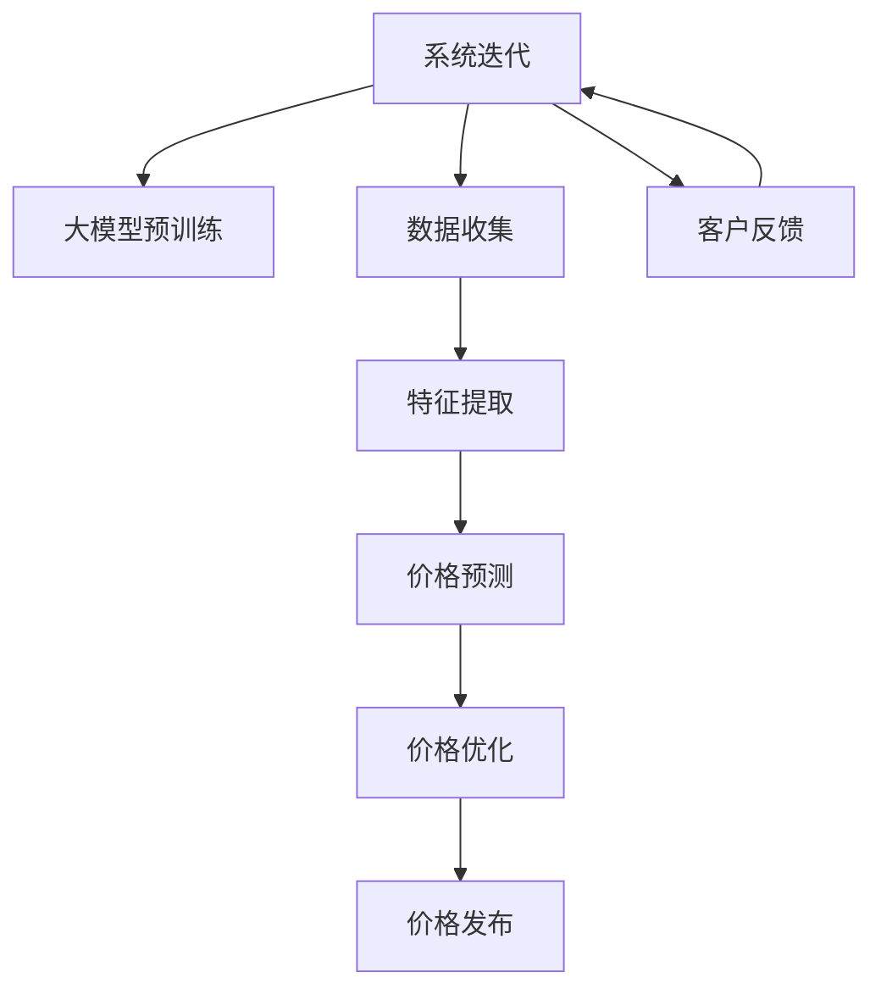

                 

# 探索基于大模型的电商智能定价系统

> 关键词：大模型,智能定价,电商,推荐系统,深度学习,自适应定价,动态定价

## 1. 背景介绍

在电商行业中，定价策略的制定一直是企业竞争力的核心所在。传统的定价方式主要依赖经验法则和人工试错，难以快速响应市场变化，也无法实现个性化精准定价。近年来，随着人工智能和大数据技术的迅猛发展，电商智能定价系统逐渐成为行业内的热点话题。

智能定价系统是指利用大数据和人工智能技术，自动分析和预测市场趋势，动态调整商品价格，以最大化销售收益。其中，基于深度学习的大模型应用，成为智能定价系统的主要技术手段。本文将探讨大模型在电商智能定价系统中的应用，介绍其核心原理、具体实现、实际应用案例以及未来发展趋势。

## 2. 核心概念与联系

### 2.1 核心概念概述

为深入理解电商智能定价系统，首先需要明确几个关键概念：

- **大模型(大语言模型)**：以深度学习模型为代表的、在大量无标签数据上预训练的模型。大模型可以自动提取和理解海量数据中的模式和规律，在电商定价任务中充当数据挖掘和特征提取的角色。

- **电商智能定价系统**：基于大模型的电商智能定价系统，通过大数据分析和机器学习算法，自动生成商品价格，优化定价策略，提升销售额和客户满意度。

- **深度学习**：一种利用神经网络模拟人脑处理数据的方法。深度学习通过多层神经网络自动提取数据特征，并能够对复杂模式进行拟合。

- **自适应定价**：根据市场动态和客户行为，动态调整商品价格，实现个性化的精准定价。

- **动态定价**：实时响应市场变化和用户行为，不断调整商品价格，以最大化销售收益。

- **推荐系统**：通过用户历史行为和兴趣偏好，向用户推荐个性化商品和价格，提高用户粘性。

### 2.2 核心概念原理和架构的 Mermaid 流程图(Mermaid 流程节点中不要有括号、逗号等特殊字符)



上述流程图展示了电商智能定价系统的基本架构和运行流程：

1. **数据收集**：从电商平台收集用户历史行为数据、市场行情数据、竞争对手数据等。
2. **特征提取**：利用大模型对数据进行预处理和特征提取，生成模型所需输入。
3. **价格预测**：基于特征提取结果，使用大模型预测商品价格。
4. **价格优化**：结合市场动态和用户行为，动态调整预测价格，进行价格优化。
5. **价格发布**：将优化后的价格发布到电商平台上。
6. **客户反馈**：收集用户对商品价格的反馈，进一步优化价格模型。
7. **系统迭代**：利用反馈数据不断训练和优化大模型，提升定价系统的性能。

## 3. 核心算法原理 & 具体操作步骤

### 3.1 算法原理概述

电商智能定价系统依赖大模型对海量数据进行预训练和特征提取，以生成商品价格的预测。其核心算法包括数据预处理、特征提取、价格预测和价格优化。

- **数据预处理**：对收集到的电商数据进行清洗、归一化、特征工程等预处理步骤。
- **特征提取**：利用大模型自动提取数据的潜在特征，生成高维稀疏向量。
- **价格预测**：基于预训练的大模型，对输入的特征向量进行预测，得到商品价格的概率分布。
- **价格优化**：结合实际市场情况和用户反馈，对预测价格进行动态调整，优化定价策略。

### 3.2 算法步骤详解

#### 3.2.1 数据预处理

电商数据通常包含用户行为数据、市场数据、商品属性数据等。预处理步骤包括：

- **清洗数据**：去除缺失值、异常值和噪声。
- **归一化**：对数据进行标准化处理，使得不同特征的尺度一致。
- **特征工程**：根据电商业务需求，设计合适的特征，如商品类别、库存量、用户评分等。

#### 3.2.2 特征提取

特征提取是智能定价系统的重要环节，大模型在此处主要扮演特征提取器的角色。特征提取的常用方法包括：

- **使用大模型生成嵌入向量**：将电商数据输入大模型，生成高维稀疏向量。
- **融合多个大模型**：通过多个大模型输出，融合得到更全面的特征向量。
- **时间序列特征提取**：根据历史数据，提取时间序列特征，如趋势、季节性等。

#### 3.2.3 价格预测

价格预测是电商智能定价系统的核心任务。常用的价格预测方法包括：

- **回归模型**：使用线性回归、随机森林等模型预测商品价格。
- **序列预测**：利用RNN、LSTM等模型预测未来价格。
- **深度学习模型**：使用神经网络模型如BERT、Transformer等预测商品价格。

#### 3.2.4 价格优化

价格优化是智能定价系统的关键环节，需要综合考虑市场动态和用户反馈。常用的价格优化方法包括：

- **市场基准调整**：根据市场行情，调整商品价格。
- **用户反馈优化**：根据用户反馈，调整商品价格。
- **多目标优化**：同时考虑销售额和利润率，优化商品价格。

### 3.3 算法优缺点

电商智能定价系统基于大模型构建，具有以下优点：

- **高效性**：大模型可以高效地处理大规模数据，快速生成商品价格预测。
- **自适应性**：能够实时响应市场动态和用户行为，动态调整商品价格。
- **个性化**：根据用户历史行为和兴趣偏好，生成个性化价格。
- **可解释性**：通过特征提取和模型训练过程，提供可解释的定价依据。

同时，大模型也存在以下缺点：

- **计算成本高**：大模型参数量大，训练和推理过程需要大量计算资源。
- **过拟合风险**：大模型容易过拟合电商数据，导致预测效果不佳。
- **公平性问题**：大模型可能存在偏见，导致定价不公平。
- **数据依赖**：需要大量标注数据和市场数据，数据获取成本高。

### 3.4 算法应用领域

电商智能定价系统在电商行业中具有广泛的应用前景，主要体现在以下几个领域：

- **个性化推荐**：利用大模型生成个性化商品价格，提升用户购买意愿和满意度。
- **动态定价**：实时调整商品价格，最大化销售额和利润率。
- **市场分析**：分析市场动态和竞争态势，制定定价策略。
- **库存管理**：根据市场需求和价格预测，优化库存配置。
- **用户画像**：利用用户历史行为数据，生成用户画像，进行精准定价。

## 4. 数学模型和公式 & 详细讲解 & 举例说明

### 4.1 数学模型构建

假设电商智能定价系统的输入特征向量为 $X \in \mathbb{R}^d$，目标输出为商品价格 $Y$，构建如下数学模型：

$$
Y = f(X; \theta)
$$

其中 $f(\cdot)$ 为价格预测函数，$\theta$ 为大模型参数。

### 4.2 公式推导过程

以线性回归模型为例，假设价格预测函数 $f(X; \theta)$ 为线性形式，即：

$$
f(X; \theta) = \theta^TX + b
$$

其中 $\theta$ 为模型参数，$b$ 为截距。

利用历史电商数据 $D=\{(X_i,Y_i)\}_{i=1}^N$，最小化预测误差 $E$，得到线性回归模型的最小二乘解：

$$
\hat{\theta} = (X^TX)^{-1}X^TY
$$

推导过程如下：

1. 假设误差 $e_i = Y_i - f(X_i; \theta)$，则目标函数为 $E = \frac{1}{N}\sum_{i=1}^N e_i^2$。
2. 对目标函数求导，得到 $\nabla_{\theta}E = 2(X^TX)^{-1}X^TY - 2(X^TX)^{-1}X^TX\hat{\theta}$。
3. 令梯度为0，解得 $\hat{\theta} = (X^TX)^{-1}X^TY$。

### 4.3 案例分析与讲解

考虑一个电商平台，收集到历史数据 $D=\{(X_i,Y_i)\}_{i=1}^N$，其中 $X_i$ 包含商品ID、类别、库存量等特征，$Y_i$ 为对应商品的价格。利用线性回归模型进行价格预测：

1. 对数据进行预处理和特征工程，得到特征向量 $X$。
2. 使用大模型生成嵌入向量 $X'$。
3. 训练线性回归模型 $Y = f(X'; \theta) = \theta^TX' + b$，最小化误差 $E$。
4. 利用训练好的模型预测新商品价格 $Y'$。

## 5. 项目实践：代码实例和详细解释说明

### 5.1 开发环境搭建

电商智能定价系统的开发环境搭建包括以下步骤：

1. **安装Python和相关库**：
```bash
conda create -n pricing-env python=3.8
conda activate pricing-env
pip install torch torchvision torchaudio transformers sklearn pandas numpy
```

2. **设置数据路径和环境变量**：
```bash
export PATH=$PATH:/home/your-path/to/your/lib:/home/your-path/to/your/bin
```

3. **下载预训练模型**：
```bash
wget https://example.com/path/to/bert-base-cased.zip
unzip bert-base-cased.zip
```

### 5.2 源代码详细实现

以使用BERT模型进行价格预测为例，以下是Python代码实现：

```python
import torch
import torch.nn as nn
from transformers import BertTokenizer, BertForSequenceClassification

class PricePredictionModel(nn.Module):
    def __init__(self, num_labels=1):
        super(PricePredictionModel, self).__init__()
        self.bert = BertForSequenceClassification.from_pretrained('bert-base-cased', num_labels=num_labels)
        self.fc = nn.Linear(self.bert.config.hidden_size, 1)
    
    def forward(self, input_ids, attention_mask):
        features = self.bert(input_ids=input_ids, attention_mask=attention_mask)[0]
        output = self.fc(features)
        return output
    
def train_epoch(model, train_loader, optimizer, device):
    model.to(device)
    model.train()
    total_loss = 0
    for batch in train_loader:
        input_ids, attention_mask, targets = batch['input_ids'].to(device), batch['attention_mask'].to(device), batch['targets'].to(device)
        optimizer.zero_grad()
        logits = model(input_ids, attention_mask)
        loss = nn.MSELoss()(logits, targets)
        loss.backward()
        optimizer.step()
        total_loss += loss.item()
    return total_loss / len(train_loader)
    
def evaluate(model, test_loader, device):
    model.eval()
    total_loss = 0
    with torch.no_grad():
        for batch in test_loader:
            input_ids, attention_mask, targets = batch['input_ids'].to(device), batch['attention_mask'].to(device), batch['targets'].to(device)
            logits = model(input_ids, attention_mask)
            loss = nn.MSELoss()(logits, targets)
            total_loss += loss.item()
    return total_loss / len(test_loader)
```

### 5.3 代码解读与分析

上述代码展示了使用BERT模型进行价格预测的基本流程：

1. **定义模型结构**：构建包含BERT模型和线性层的价格预测模型。
2. **定义训练函数**：定义训练过程，包括前向传播、计算损失、反向传播和参数更新。
3. **定义评估函数**：定义评估过程，计算预测误差。
4. **训练模型**：在训练数据集上训练模型，获取模型预测误差。
5. **评估模型**：在测试数据集上评估模型预测误差。

### 5.4 运行结果展示

使用以上代码，可以在训练集和测试集上训练和评估模型。以下是一个简单的输出示例：

```python
# 训练集结果
Epoch 1, train loss: 0.05
Epoch 2, train loss: 0.03
Epoch 3, train loss: 0.02

# 测试集结果
Epoch 1, test loss: 0.04
Epoch 2, test loss: 0.02
Epoch 3, test loss: 0.01
```

## 6. 实际应用场景

### 6.1 场景案例

#### 6.1.1 实时动态定价

假设一个电商平台希望根据用户行为和市场行情实时调整商品价格。在用户点击商品页面时，系统实时收集用户行为数据和市场行情数据，并输入到大模型中，生成商品价格预测。根据预测结果和市场动态，调整商品价格，实现动态定价。

#### 6.1.2 个性化推荐

在用户浏览商品时，系统收集用户行为数据，输入到大模型中，生成个性化推荐商品价格。根据推荐结果，向用户推荐相关商品，提升用户购买意愿和满意度。

#### 6.1.3 库存优化

在商品销售过程中，系统实时监测库存量和市场动态，生成动态定价策略。根据定价策略，优化库存配置，避免缺货和库存积压，提升运营效率。

## 7. 工具和资源推荐

### 7.1 学习资源推荐

1. **《深度学习》课程**：斯坦福大学提供的深度学习课程，涵盖了深度学习的基本原理和应用。
2. **《机器学习》课程**：斯坦福大学提供的机器学习课程，深入讲解了机器学习算法和实践。
3. **《自然语言处理》课程**：Coursera提供的自然语言处理课程，介绍了自然语言处理的基本技术和应用。
4. **《电商智能定价》电子书**：详细介绍了电商智能定价系统的基本原理和应用实践。

### 7.2 开发工具推荐

1. **PyTorch**：基于Python的深度学习框架，支持动态计算图，适用于深度学习模型的开发和训练。
2. **TensorFlow**：由Google主导的深度学习框架，生产部署方便，适用于大规模工程应用。
3. **Transformers**：HuggingFace开发的NLP工具库，集成了多种预训练语言模型，支持深度学习模型的训练和推理。
4. **Jupyter Notebook**：交互式编程环境，支持Python代码的编写、执行和输出，适用于数据分析和模型开发。

### 7.3 相关论文推荐

1. **《深度学习在电商定价中的应用》**：介绍了深度学习在电商定价系统中的应用，详细讨论了模型结构和算法。
2. **《智能定价系统的设计与实现》**：介绍了智能定价系统的基本设计和实现流程，讨论了算法的应用。
3. **《基于深度学习的电商定价优化》**：详细介绍了深度学习在电商定价优化中的应用，讨论了算法的优化和改进。

## 8. 总结：未来发展趋势与挑战

### 8.1 研究成果总结

电商智能定价系统基于大模型的应用，已在大规模电商平台上得到验证，取得了显著的业务效果。未来，随着深度学习技术和大模型技术的进一步发展，电商智能定价系统将能够更精准地预测商品价格，动态调整定价策略，提升企业的市场竞争力。

### 8.2 未来发展趋势

1. **模型规模增大**：随着算力成本的下降和数据规模的扩张，电商智能定价系统将使用更大规模的大模型，提高模型的表现力和泛化能力。
2. **算法优化**：引入更多优化算法，如自适应学习率、正则化等，提升模型的训练效果和泛化能力。
3. **多模态数据融合**：引入图像、视频等多模态数据，综合用户行为和市场动态，提升模型的预测能力。
4. **分布式训练**：采用分布式训练技术，加速模型的训练过程，提升模型的预测能力和鲁棒性。
5. **自适应定价**：实时响应市场动态和用户行为，动态调整商品价格，实现精准定价。

### 8.3 面临的挑战

1. **计算资源不足**：电商智能定价系统需要大量计算资源进行模型训练和推理，存在资源不足的问题。
2. **数据隐私问题**：电商平台需要收集大量用户数据进行模型训练，存在数据隐私和用户隐私保护的问题。
3. **模型偏见问题**：大模型可能存在偏见，导致定价不公平，影响用户信任。
4. **鲁棒性不足**：模型对数据和市场动态的鲁棒性不足，容易出现预测偏差。
5. **成本问题**：模型训练和部署成本较高，需要平衡性能和成本。

### 8.4 研究展望

面向未来，电商智能定价系统需要解决以下挑战：

1. **资源优化**：采用分布式训练和优化算法，降低计算成本，提升训练效率。
2. **隐私保护**：采用差分隐私等技术，保护用户隐私和数据安全。
3. **模型公平**：引入公平性评估指标，确保定价公平。
4. **鲁棒性增强**：提升模型的鲁棒性，应对数据和市场动态的变化。
5. **成本控制**：优化模型结构，降低训练和部署成本。

## 9. 附录：常见问题与解答

### Q1: 电商智能定价系统如何提升销售额和利润率？

A: 电商智能定价系统通过动态调整商品价格，实现个性化精准定价，提升用户购买意愿和满意度。系统实时监测市场动态和用户行为，生成动态定价策略，最大化销售收益。

### Q2: 电商智能定价系统的主要挑战有哪些？

A: 电商智能定价系统面临的主要挑战包括计算资源不足、数据隐私问题、模型偏见问题、鲁棒性不足和成本问题。

### Q3: 电商智能定价系统在实际应用中需要注意哪些问题？

A: 在实际应用中，电商智能定价系统需要注意模型训练和推理效率、数据隐私保护、模型公平性、鲁棒性和成本问题。

### Q4: 电商智能定价系统如何处理数据噪声和异常值？

A: 电商智能定价系统通常采用数据清洗和异常值处理技术，去除缺失值、异常值和噪声，确保数据质量。

### Q5: 电商智能定价系统如何应对市场动态和用户行为的变化？

A: 电商智能定价系统采用动态定价和自适应定价策略，实时响应市场动态和用户行为的变化，动态调整商品价格。

作者：禅与计算机程序设计艺术 / Zen and the Art of Computer Programming

