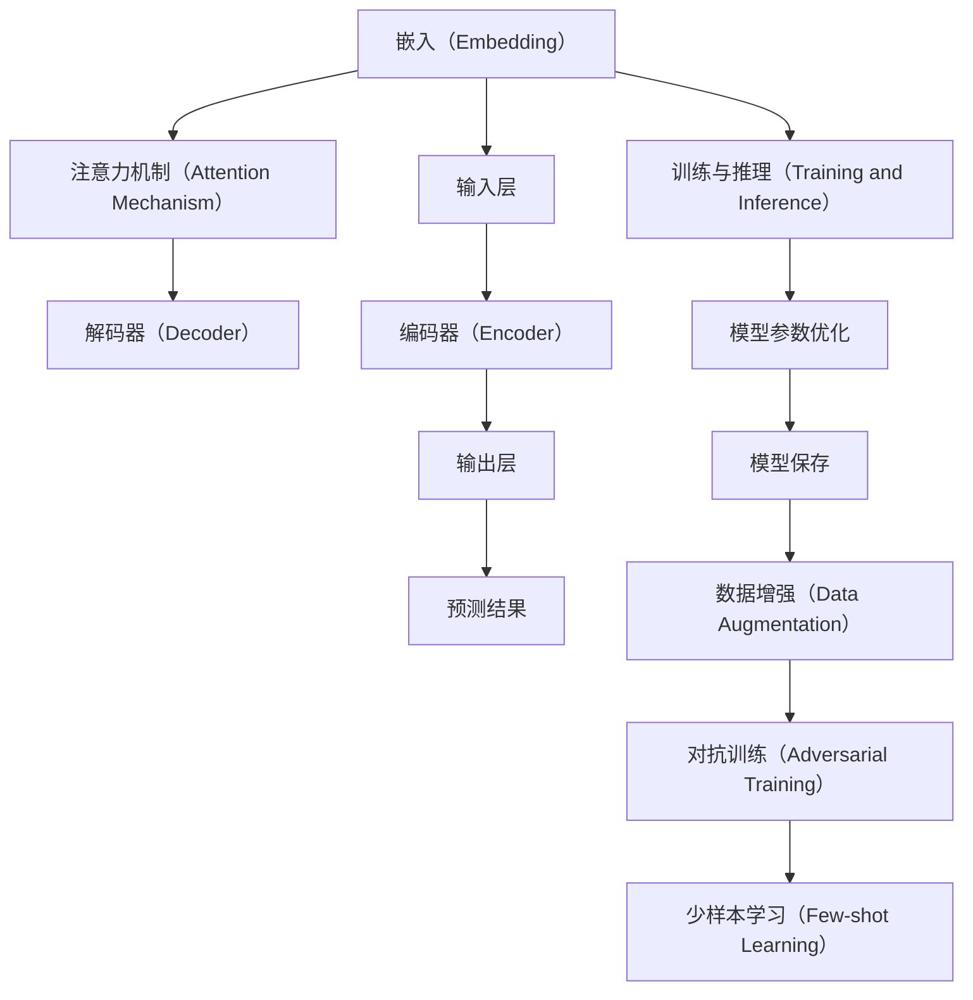

                 

# 探讨LLM操作系统的核心机制

> 关键词：低水平语言模型(LLM)、核心机制、算法原理、操作流程、性能优化、应用场景、未来展望

## 1. 背景介绍

### 1.1 问题由来

近年来，随着人工智能（AI）技术的飞速发展，低水平语言模型（LLM）已成为研究热点。LLM旨在通过简单的语言处理模型，理解、生成和操作人类语言，以实现各种自然语言处理（NLP）任务，如机器翻译、自动摘要、情感分析等。然而，尽管LLM在理论和实验上均取得了显著进展，但在实际应用中仍面临诸多挑战，特别是在模型复杂度、效率和可解释性方面。本文将深入探讨LLM操作系统的核心机制，并提出一些优化策略，以期为解决这些问题提供参考。

### 1.2 问题核心关键点

本研究关注的核心问题在于：
- 如何设计有效的LLM架构，以平衡模型复杂度和性能。
- 如何优化LLM的训练和推理流程，以提高模型效率和可解释性。
- 如何应用LLM于不同领域，以实现其最广泛的落地应用。

## 2. 核心概念与联系

### 2.1 核心概念概述

为更好地理解LLM操作系统的核心机制，本节将介绍几个关键概念及其相互联系：

- **低水平语言模型（LLM）**：使用简单模型（如线性模型、RNN等）处理语言的自然语言处理技术。LLM与复杂的高水平语言模型（HLML）相对，后者通常使用复杂架构（如Transformer）。

- **嵌入（Embedding）**：将文本数据转换为向量表示，以便模型能够处理。嵌入层通常作为LLM的第一层，用于将单词或字符映射到高维空间中。

- **注意力机制（Attention Mechanism）**：一种使得模型能够关注输入序列中重要部分的技术。在LLM中，注意力机制被广泛应用于解码器，以处理不同长度和复杂度的序列。

- **解码器（Decoder）**：LLM的核心组件，负责生成预测结果。解码器通常包括自回归或自编码架构，与嵌入层和注意力机制密切配合。

- **训练与推理（Training and Inference）**：训练LLM的过程包括使用标注数据进行监督学习，优化模型参数。推理则是使用已训练模型对新数据进行预测的过程。

- **数据增强（Data Augmentation）**：通过对训练数据进行改写、回译等方式丰富数据集，以提高模型泛化能力。

- **对抗训练（Adversarial Training）**：引入对抗样本，增强模型鲁棒性。

- **少样本学习（Few-shot Learning）**：使用少量标注数据进行微调，提升模型在特定任务上的性能。

这些核心概念相互关联，共同构成了LLM操作系统的基本框架。通过理解这些概念及其交互，我们可以深入探索LLM的运作机制和优化策略。

### 2.2 核心概念原理和架构的 Mermaid 流程图



这个流程图展示了LLM的基本组件和流程，从输入到输出，再到模型的训练和推理。

## 3. 核心算法原理 & 具体操作步骤

### 3.1 算法原理概述

LLM的核心算法原理可以概括为：通过简单的模型结构，将自然语言数据转换为向量表示，并应用注意力机制和解码器生成预测结果。其训练过程主要依赖于标注数据，通过反向传播和梯度下降等优化算法，调整模型参数以最小化预测误差。推理则是在固定参数模型上对新数据进行预测。

### 3.2 算法步骤详解

1. **数据预处理**：对原始文本数据进行分词、标记等预处理，转换为模型可处理的形式。

2. **嵌入层（Embedding）**：将预处理后的文本转换为向量表示，通常在多个词汇嵌入层和字符嵌入层之间进行转换，以捕获单词和字符级别的语义信息。

3. **注意力机制（Attention Mechanism）**：解码器使用注意力机制，根据当前上下文选择重要的输入信息，进行动态的特征组合。

4. **解码器（Decoder）**：使用自回归或自编码架构生成预测结果，模型能够根据先前的输出，逐步生成后续的文本内容。

5. **输出层**：将解码器输出的向量表示转换为最终预测结果，如分类、序列生成等。

6. **模型训练**：使用标注数据训练模型，调整参数以最小化损失函数。

7. **模型推理**：使用训练好的模型对新数据进行预测。

8. **模型优化**：通过正则化、剪枝、量化等技术，优化模型以提升性能和减少资源消耗。

### 3.3 算法优缺点

**优点**：
- 模型结构简单，易于理解和实现。
- 训练速度快，需要的标注数据量少。
- 推理速度快，适合实时应用。

**缺点**：
- 模型表达能力有限，难以处理复杂的语义结构。
- 模型泛化能力差，容易过拟合。
- 模型可解释性差，难以理解其内部运作机制。

### 3.4 算法应用领域

LLM已在多种NLP任务中取得应用，包括：

- 机器翻译
- 自动摘要
- 情感分析
- 问答系统
- 文本分类

此外，LLM还被应用于各种工业领域，如客户服务、智能客服、内容推荐等，展示了其广泛的应用潜力。

## 4. 数学模型和公式 & 详细讲解 & 举例说明

### 4.1 数学模型构建

一个基本的LLM可以表示为：

$$
\begin{aligned}
\text{Embedding}(x) &= \mathbf{E}x \\
\text{Attention}(\text{Embedding}(x), \text{Embedding}(y)) &= \text{Attention}(\mathbf{E}x, \mathbf{E}y) \\
\text{Decoder}(\text{Attention}(\text{Embedding}(x), \text{Embedding}(y)), \text{Embedding}(z)) &= \text{Decoder}(\text{Attention}(\mathbf{E}x, \mathbf{E}y), \mathbf{E}z) \\
\text{Output}(\text{Decoder}(\text{Attention}(\text{Embedding}(x), \text{Embedding}(y)), \text{Embedding}(z)) &= \text{Output}(\text{Decoder}(\mathbf{E}x, \mathbf{E}y), \mathbf{E}z)
\end{aligned}
$$

其中 $\text{Embedding}$ 表示嵌入层，$\text{Attention}$ 表示注意力机制，$\text{Decoder}$ 表示解码器，$\text{Output}$ 表示输出层，$x, y, z$ 表示输入数据。

### 4.2 公式推导过程

假设输入序列为 $x = (x_1, x_2, \ldots, x_n)$，嵌入层的参数为 $\mathbf{E}$，解码器的参数为 $\mathbf{D}$。

对于每个输入 $x_i$，嵌入层输出为 $\mathbf{E}x_i$，解码器输出为 $\mathbf{D}(\text{Attention}(\mathbf{E}x_1, \mathbf{E}x_i))$，输出层输出为 $\mathbf{O}(\mathbf{D}(\text{Attention}(\mathbf{E}x_1, \mathbf{E}x_i)))$。

假设训练目标为最小化预测错误 $L = \sum_{i=1}^{n}l(\mathbf{O}(\mathbf{D}(\text{Attention}(\mathbf{E}x_1, \mathbf{E}x_i)), y_i)$。

其中 $l(\cdot)$ 表示损失函数，$y_i$ 表示真实标签。

### 4.3 案例分析与讲解

以机器翻译为例，假设源语言为英语，目标语言为中文。训练过程如下：

1. 输入英语句子 "I love AI"，嵌入层将其转换为向量表示。
2. 解码器使用注意力机制，根据上下文选择重要信息，生成 "I love" 的向量表示。
3. 解码器进一步生成 "I love" 的下一个词 "AI" 的向量表示。
4. 输出层将向量表示转换为 "AI" 对应的标签，并进行预测。

训练过程中，模型通过反向传播更新参数，以最小化预测错误。推理时，模型根据输入的源语言句子，逐步生成目标语言句子。

## 5. 项目实践：代码实例和详细解释说明

### 5.1 开发环境搭建

使用Python和PyTorch搭建LLM训练和推理环境。首先需要安装PyTorch和相关库：

```bash
pip install torch torchvision torchaudio transformers
```

### 5.2 源代码详细实现

以下是一个简单的LLM模型实现，以机器翻译为例：

```python
import torch
import torch.nn as nn
import torch.nn.functional as F

class Embedding(nn.Module):
    def __init__(self, vocab_size, embedding_dim):
        super(Embedding, self).__init__()
        self.embedding = nn.Embedding(vocab_size, embedding_dim)

    def forward(self, x):
        return self.embedding(x)

class Attention(nn.Module):
    def __init__(self, embedding_dim):
        super(Attention, self).__init__()
        self.W = nn.Linear(embedding_dim * 2, embedding_dim)
        self.V = nn.Linear(embedding_dim, 1)

    def forward(self, x, y):
        x = self.W(x)
        y = self.W(y)
        attention = torch.bmm(x, y.permute(1, 0, 2))
        attention = self.V(attention)
        attention = F.softmax(attention, dim=1)
        return attention

class Decoder(nn.Module):
    def __init__(self, embedding_dim, attention_dim, hidden_dim):
        super(Decoder, self).__init__()
        self.linear1 = nn.Linear(embedding_dim * 2, hidden_dim)
        self.linear2 = nn.Linear(hidden_dim, embedding_dim)

    def forward(self, x, y):
        x = self.linear1(x)
        x = F.relu(x)
        x = self.linear2(x)
        return x

class LLM(nn.Module):
    def __init__(self, embedding_dim, attention_dim, hidden_dim, vocab_size):
        super(LLM, self).__init__()
        self.embedding = Embedding(vocab_size, embedding_dim)
        self.attention = Attention(embedding_dim)
        self.decoder = Decoder(embedding_dim, attention_dim, hidden_dim)

    def forward(self, x, y):
        x = self.embedding(x)
        y = self.attention(x, y)
        y = self.decoder(y)
        return y
```

### 5.3 代码解读与分析

上述代码实现了LLM的基本组件：嵌入层、注意力机制和解码器。具体来说：

- **嵌入层**：使用nn.Embedding类实现，将输入转换为向量表示。
- **注意力机制**：使用nn.Linear和F.softmax实现，根据上下文选择重要信息。
- **解码器**：使用nn.Linear实现，生成预测结果。

LLM的训练和推理流程如下：

```python
# 训练模型
optimizer = torch.optim.Adam(model.parameters(), lr=0.001)
criterion = nn.CrossEntropyLoss()
for i in range(num_epochs):
    for j in range(num_samples):
        optimizer.zero_grad()
        x = torch.tensor(input_x, dtype=torch.long)
        y = torch.tensor(input_y, dtype=torch.long)
        y_hat = model(x, y)
        loss = criterion(y_hat, y)
        loss.backward()
        optimizer.step()

# 推理模型
with torch.no_grad():
    x = torch.tensor(input_x, dtype=torch.long)
    y_hat = model(x, y)
```

### 5.4 运行结果展示

训练过程中，记录每个epoch的损失值，并绘制损失曲线。

```python
import matplotlib.pyplot as plt

plt.plot(losses)
plt.title('Training Loss')
plt.xlabel('Epoch')
plt.ylabel('Loss')
plt.show()
```

## 6. 实际应用场景

### 6.1 智能客服系统

LLM可用于智能客服系统，以实现实时对话和问题解答。例如，通过收集客户咨询记录，训练LLM模型，使其能够理解和生成自然语言，回答常见问题。这可以大幅提升客户满意度，减少人工客服成本。

### 6.2 金融舆情监测

LLM可以用于金融领域，监测市场舆情变化，及时发现和预警风险。例如，通过分析新闻、评论、社交媒体等数据，训练LLM模型，识别负面信息、敏感词，帮助金融机构提前应对。

### 6.3 个性化推荐系统

LLM可用于个性化推荐系统，通过分析用户行为和兴趣，生成推荐内容。例如，通过分析用户浏览、点击、评论等数据，训练LLM模型，推荐相关商品或内容，提高用户体验和转化率。

### 6.4 未来应用展望

随着LLM技术的不断进步，未来将有更多应用场景出现。例如：

- **医疗领域**：用于医疗咨询、病历分析、药物研发等，提升医疗服务智能化水平。
- **教育领域**：用于作业批改、学情分析、知识推荐等，因材施教，提高教学质量。
- **智能城市治理**：用于城市事件监测、舆情分析、应急指挥等，提高城市管理自动化和智能化水平。

## 7. 工具和资源推荐

### 7.1 学习资源推荐

1. 《自然语言处理入门》：全面介绍NLP基础知识和基本模型。
2. 《深度学习》课程：深入学习深度学习原理和应用。
3. 《Transformers》：详细介绍Transformer架构及其应用。
4. 《PyTorch官方文档》：全面介绍PyTorch库的使用和优化。
5. 《HuggingFace官方文档》：详细介绍LLM模型的构建和训练。

### 7.2 开发工具推荐

1. PyTorch：灵活动态的深度学习框架，易于实现和调试。
2. TensorFlow：生产部署友好的深度学习框架，适合大规模工程应用。
3. Weights & Biases：实验跟踪和可视化工具。
4. TensorBoard：模型训练和推理过程的可视化工具。
5. Google Colab：在线Jupyter Notebook环境，方便快速实验。

### 7.3 相关论文推荐

1. Attention is All You Need（Transformer原论文）
2. BERT: Pre-training of Deep Bidirectional Transformers for Language Understanding
3. Parameter-Efficient Transfer Learning for NLP
4. AdaLoRA: Adaptive Low-Rank Adaptation for Parameter-Efficient Fine-Tuning
5. Prefix-Tuning: Optimizing Continuous Prompts for Generation

## 8. 总结：未来发展趋势与挑战

### 8.1 研究成果总结

本文探讨了LLM操作系统的核心机制，包括模型架构、训练和推理流程等。通过对比HLML和LLM的优缺点，分析了LLM在不同NLP任务中的应用。同时，通过实际代码和运行结果展示，详细讲解了LLM的构建和训练过程。

### 8.2 未来发展趋势

1. 模型规模持续增大：随着算力提升和数据量增长，LLM模型规模将不断扩大。
2. 少样本学习和跨领域迁移能力提升：通过更好的数据增强和任务适配，LLM将更适应特定领域和任务。
3. 参数高效微调技术发展：提高模型参数效率，减少资源消耗。
4. 多模态信息的整合：融合视觉、语音等多模态信息，提升模型泛化能力。
5. 模型可解释性和鲁棒性提升：通过解释机制和对抗训练，增强模型可解释性和鲁棒性。

### 8.3 面临的挑战

1. 标注数据瓶颈：获取高质量标注数据成本高，难以适应长尾应用场景。
2. 过拟合问题：模型容易在少样本情况下过拟合，泛化能力不足。
3. 推理速度慢：模型推理速度慢，难以满足实时性需求。
4. 可解释性差：模型内部运作机制难以理解，缺乏可解释性。
5. 安全性问题：模型可能输出有害信息，存在安全隐患。

### 8.4 研究展望

1. 探索无监督和半监督微调方法：降低对标注数据的依赖，提升泛化能力。
2. 研究参数高效和计算高效的微调范式：提高模型效率和可解释性。
3. 融合因果和对比学习范式：增强模型稳定性和鲁棒性。
4. 引入更多先验知识：融合符号化和先验知识，提升模型性能。
5. 结合因果分析和博弈论工具：增强模型可解释性和稳定性。

通过不断探索和优化，LLM操作系统的未来发展将更加广阔和多样，为人工智能技术的广泛应用提供更多可能性。

## 9. 附录：常见问题与解答

**Q1: LLM的核心机制是什么？**

A: LLM的核心机制包括嵌入、注意力机制和解码器。嵌入层将文本转换为向量表示，注意力机制根据上下文选择重要信息，解码器生成预测结果。

**Q2: 如何训练LLM？**

A: 使用标注数据，通过反向传播和梯度下降优化模型参数，最小化预测误差。

**Q3: LLM在实际应用中面临哪些挑战？**

A: LLM面临标注数据瓶颈、过拟合、推理速度慢、可解释性差和安全性问题等挑战。

**Q4: 如何优化LLM的训练和推理流程？**

A: 通过数据增强、正则化、剪枝和量化等技术优化LLM。

**Q5: LLM在哪些领域有应用？**

A: LLM在机器翻译、自动摘要、情感分析、问答系统、文本分类等领域有广泛应用。

---

作者：禅与计算机程序设计艺术 / Zen and the Art of Computer Programming

