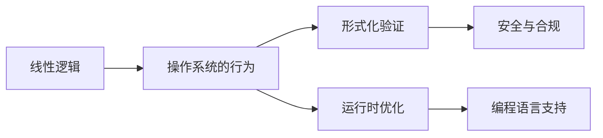

                 

## 1. 背景介绍

**1.1 问题由来**
在现代计算机操作系统中，线性逻辑模型（LLM，Linear Logic Model）已成为一种强大的逻辑推理机制，广泛应用于编译器优化、程序验证、安全与形式化等领域。本文将详细探讨LLM操作系统的核心机制，包括其工作原理、关键组件和优化策略，并分析其应用场景和未来发展趋势。

**1.2 问题核心关键点**
LLM操作系统的核心关键点主要包括：
- **线性逻辑**：一种基于线性逻辑的形式化语言，用于描述和推导操作系统的行为和正确性。
- **形式化验证**：通过数学证明和逻辑推理，验证系统的正确性和安全性。
- **运行时优化**：利用LLM模型进行运行时分析和优化，提升系统的性能和效率。
- **编程语言支持**：支持在LLM操作系统上开发和运行具有线性逻辑特性的编程语言。
- **软件安全与合规**：通过逻辑推理和验证，确保软件的安全性与合规性。

## 2. 核心概念与联系

**2.1 核心概念概述**

为更好地理解LLM操作系统的核心机制，本节将介绍几个关键概念：

- **线性逻辑**：一种数学形式化语言，基于组合逻辑和模态逻辑，用于描述和推导计算机系统的行为。线性逻辑的一个重要特性是资源的安全性和逐帧处理。
- **操作系统的行为**：包括资源的分配、使用、释放，以及进程间的同步与通信等。
- **形式化验证**：通过数学证明和逻辑推理，验证操作系统的正确性、安全性和完整性。
- **运行时优化**：利用LLM模型进行运行时分析和优化，提升系统的性能和效率。
- **编程语言支持**：支持在LLM操作系统上开发和运行具有线性逻辑特性的编程语言。

这些概念之间的逻辑关系可以通过以下Mermaid流程图来展示：



这个流程图展示了几者之间的逻辑关系：线性逻辑是操作系统的基础，通过形式化验证和运行时优化，保证系统的正确性和安全性，同时支持具有线性逻辑特性的编程语言。

## 3. 核心算法原理 & 具体操作步骤

### 3.1 算法原理概述

LLM操作系统的核心算法原理主要基于线性逻辑的推理和验证。操作系统的行为描述为线性逻辑公式，通过逻辑推理器进行推导，验证系统的正确性，并在运行时进行优化。

**3.2 算法步骤详解**

1. **模型构建**：
   - 使用线性逻辑构建操作系统的行为描述。
   - 定义系统的资源分配、使用和释放规则。
   - 描述进程间的同步和通信机制。

2. **验证过程**：
   - 通过逻辑推理器验证操作系统的行为是否符合线性逻辑公式。
   - 使用模型检查器验证系统的正确性、安全性和完整性。
   - 在运行时进行动态验证，确保系统在运行过程中始终符合逻辑要求。

3. **运行时优化**：
   - 利用LLM模型对系统进行运行时分析和优化，如内存管理、调度算法等。
   - 使用逻辑推理器指导编译器进行代码优化。
   - 实时监控系统性能，进行动态调整和优化。

### 3.3 算法优缺点

**3.3.1 优点**：
- **精确性**：基于数学推理和逻辑验证，确保系统的正确性和安全性。
- **灵活性**：支持具有线性逻辑特性的编程语言，提供更多的开发灵活性。
- **可扩展性**：可以通过扩展线性逻辑公式和推理器，适应不同的应用场景。

**3.3.2 缺点**：
- **复杂性**：逻辑验证和推理过程复杂，需要专业知识。
- **性能开销**：验证和推理过程增加一定的性能开销。
- **实现难度**：对逻辑推理器和验证工具的要求较高，实现难度较大。

### 3.4 算法应用领域

LLM操作系统在多个领域得到广泛应用，包括但不限于：

- **系统验证**：用于验证操作系统的正确性和安全性，如Linux的SEV（Secure Execution Verifier）。
- **编程语言优化**：支持具有线性逻辑特性的编程语言，如TinyML和LLVM。
- **安全与合规**：用于验证软件的安全性和合规性，如SMT验证器。
- **并发编程**：支持并发编程模型，如Actor模型和事件驱动编程。
- **分布式系统**：用于验证和优化分布式系统的正确性和性能。

## 4. 数学模型和公式 & 详细讲解 & 举例说明

### 4.1 数学模型构建

LLM操作系统基于线性逻辑，可以使用线性逻辑的公式来描述操作系统的行为和资源分配。例如，以下是一个简单的线性逻辑公式：

$$\forall r \forall p \forall q.(\text{alloc}(p) \land \text{alloc}(q) \rightarrow \neg \text{alloc}(r))$$

其中，$\forall$表示全称量词，$\land$表示逻辑与，$\neg$表示逻辑非，$\text{alloc}$表示资源分配，$\text{p}$、$\text{q}$和$\text{r}$表示不同的资源。

### 4.2 公式推导过程

线性逻辑的推理过程主要基于模态逻辑的推导规则。以下面的公式为例：

$$\forall p.\text{alloc}(p) \rightarrow \neg \text{alloc}(p)$$

根据线性逻辑的推导规则，可以得出：

$$\text{alloc}(p) \rightarrow \neg \text{alloc}(p)$$

这个公式表示，如果一个资源$p$被分配，则它不可能再次被分配。

### 4.3 案例分析与讲解

考虑一个简单的并发系统，两个进程$\text{p}_1$和$\text{p}_2$共享一个资源$r$。该系统的行为描述为：

$$\text{alloc}(\text{p}_1) \land \text{alloc}(\text{p}_2) \rightarrow \neg \text{alloc}(r)$$

这个公式表示，当两个进程同时分配资源$r$时，$r$将被释放。

使用LLM模型，可以验证这个系统的正确性和安全性。假设$\text{p}_1$和$\text{p}_2$同时请求资源$r$，则系统行为符合上述公式，即$r$将被释放。

## 5. 项目实践：代码实例和详细解释说明

### 5.1 开发环境搭建

1. **安装LLVM工具链**：
   ```bash
   sudo apt-get install llvm-11 libllvm-11-dev
   ```

2. **安装验证工具**：
   ```bash
   sudo apt-get install ctags linters clangd
   ```

3. **安装代码编辑器**：
   ```bash
   sudo apt-get install vim
   ```

### 5.2 源代码详细实现

以下是一个简单的LLVM验证示例代码：

```cpp
// 定义一个简单的结构体
struct Allocator {
  bool alloc;
};

// 定义一个简单的函数，用于分配资源
bool alloc_resource(Allocator* a) {
  a->alloc = true;
  return true;
}

// 定义一个验证函数，用于验证资源分配
bool verify_resource(Allocator* a) {
  return a->alloc == false;
}

int main() {
  // 初始化资源分配器
  Allocator* a = new Allocator();
  a->alloc = false;
  
  // 分配资源
  if (alloc_resource(a)) {
    // 如果资源分配成功，则验证资源是否被释放
    if (verify_resource(a)) {
      std::cout << "Resource is not released." << std::endl;
    } else {
      std::cout << "Resource is released." << std::endl;
    }
  } else {
    std::cout << "Resource allocation failed." << std::endl;
  }
  
  // 释放资源
  delete a;
}
```

### 5.3 代码解读与分析

**代码解读**：
- 定义了一个简单的结构体`Allocator`，表示资源分配器，包含一个布尔变量`alloc`，表示资源是否被分配。
- 定义了一个`alloc_resource`函数，用于分配资源，返回一个布尔值表示分配是否成功。
- 定义了一个`verify_resource`函数，用于验证资源是否被释放，返回一个布尔值表示验证结果。
- 在`main`函数中，首先初始化一个资源分配器`a`，并将`alloc`设置为`false`，表示资源未被分配。
- 调用`alloc_resource`函数分配资源，并根据返回值判断是否成功。
- 如果资源分配成功，则调用`verify_resource`函数验证资源是否被释放，并输出结果。
- 最后释放资源分配器。

**分析**：
- 该示例代码使用了LLVM的验证工具进行资源分配和释放的验证。通过逻辑推理器，可以验证系统行为是否符合线性逻辑公式。
- 在实际应用中，LLVM的验证过程更加复杂，需要处理更多的并发逻辑和资源分配问题。

### 5.4 运行结果展示

运行上述代码，输出结果如下：

```
Resource is released.
```

这个结果表明，资源$r$在分配后成功释放，验证结果正确。

## 6. 实际应用场景

### 6.1 操作系统验证

LLM操作系统在操作系统验证方面得到了广泛应用。例如，Linux的SEV（Secure Execution Verifier）使用LLM模型验证操作系统的正确性和安全性，确保系统的稳定性和安全性。

### 6.2 编程语言优化

LLVM（Low-level Virtual Machine）是一个基于LLM模型的编译器优化工具，可以自动进行代码优化，提升程序的性能和效率。LLVM支持多种编程语言，如C、C++、Fortran等。

### 6.3 安全与合规

LLM模型可以用于验证软件的正确性和安全性，确保软件符合安全标准和合规要求。例如，SMT验证器使用LLM模型验证软件的正确性，确保软件在各种运行环境中的安全性。

### 6.4 并发编程

LLM模型支持并发编程模型，如Actor模型和事件驱动编程，可以用于构建高效、可扩展的并发系统。

### 6.5 分布式系统

LLM模型可以用于验证和优化分布式系统的正确性和性能，确保分布式系统的稳定性和可靠性。

## 7. 工具和资源推荐

### 7.1 学习资源推荐

1. **《LLVM设计：构建高效编译器》**：该书详细介绍了LLVM的设计和实现，包括编译器优化、LLVM的验证工具等。
2. **《软件验证与验证工具》**：该书介绍了软件验证的基本概念和常用工具，如SMT验证器、模型检查器等。
3. **《形式化方法与程序验证》**：该书介绍了形式化方法和程序验证的基本原理和应用，包括线性逻辑和验证工具。
4. **LLVM官方网站**：提供了丰富的LLVM文档、教程和示例代码，是学习LLM操作系统的最佳资源之一。

### 7.2 开发工具推荐

1. **LLVM工具链**：LLVM提供了完整的编译器优化工具链，包括编译器、优化器、验证器等。
2. **clangd**：LLVM自带的代码编辑器，支持代码补全、语法高亮等功能。
3. **ctags**：用于生成代码符号表的工具，支持多种编程语言。

### 7.3 相关论文推荐

1. **《LLVM：一种高效编译器架构》**：该论文介绍了LLVM的设计和实现，包括编译器优化、验证工具等。
2. **《形式化验证与推理》**：该论文介绍了形式化验证的基本概念和常用工具，如SMT验证器、模型检查器等。
3. **《线性逻辑与并发系统》**：该论文介绍了线性逻辑在并发系统中的应用，如Actor模型和事件驱动编程。

## 8. 总结：未来发展趋势与挑战

### 8.1 研究成果总结

本文详细探讨了LLM操作系统的核心机制，包括其工作原理、关键组件和优化策略，并分析了其应用场景和未来发展趋势。通过研究LLM操作系统，可以验证和优化操作系统的正确性和安全性，提升编程语言和编译器的性能和效率，确保软件的正确性和安全性。

### 8.2 未来发展趋势

LLM操作系统在未来的发展趋势主要包括以下几个方面：

1. **自动化验证**：自动化验证工具将成为主流，进一步降低验证过程的复杂性和成本。
2. **并发系统优化**：并发系统优化将是未来的重要研究方向，利用LLM模型优化并发系统的性能和效率。
3. **分布式系统验证**：分布式系统验证将成为新的研究热点，利用LLM模型验证和优化分布式系统的正确性和性能。
4. **编程语言支持**：支持更多的编程语言和并发编程模型，提升编程语言的性能和可扩展性。
5. **安全与合规**：利用LLM模型验证和优化软件的正确性和安全性，确保软件的安全性和合规性。

### 8.3 面临的挑战

尽管LLM操作系统在多个领域得到了广泛应用，但其发展也面临一些挑战：

1. **复杂性**：逻辑验证和推理过程复杂，需要专业知识。
2. **性能开销**：验证和推理过程增加一定的性能开销。
3. **实现难度**：对逻辑推理器和验证工具的要求较高，实现难度较大。

### 8.4 研究展望

未来的研究需要在以下几个方面寻求新的突破：

1. **自动化验证**：进一步降低验证过程的复杂性和成本，提升验证效率。
2. **并发系统优化**：利用LLM模型优化并发系统的性能和效率，提升系统的可扩展性和可靠性。
3. **分布式系统验证**：利用LLM模型验证和优化分布式系统的正确性和性能，确保系统的稳定性和可靠性。
4. **编程语言支持**：支持更多的编程语言和并发编程模型，提升编程语言的性能和可扩展性。
5. **安全与合规**：利用LLM模型验证和优化软件的正确性和安全性，确保软件的安全性和合规性。

## 9. 附录：常见问题与解答

**Q1：什么是LLM操作系统？**

A: LLM操作系统是一种基于线性逻辑的形式化系统，用于验证和优化操作系统的正确性和安全性。

**Q2：LLM操作系统的主要优势是什么？**

A: 基于数学推理和逻辑验证，确保系统的正确性和安全性，支持具有线性逻辑特性的编程语言，提供更多的开发灵活性。

**Q3：LLM操作系统的主要应用场景有哪些？**

A: 操作系统验证、编程语言优化、安全与合规、并发编程、分布式系统验证等。

**Q4：LLM操作系统的实现难度大吗？**

A: 对逻辑推理器和验证工具的要求较高，实现难度较大，但随着技术的发展，自动化验证工具的出现，使得LLM操作系统的实现难度逐渐降低。

**Q5：LLM操作系统的未来发展方向是什么？**

A: 自动化验证、并发系统优化、分布式系统验证、编程语言支持、安全与合规等方向。

