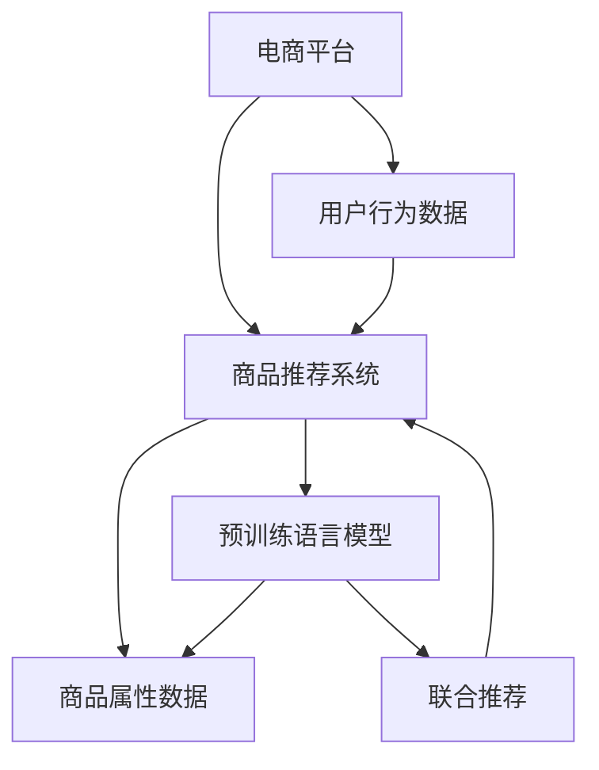

                 

# 探讨大模型在电商平台商品组合推荐中的作用

> 关键词：大模型, 电商平台, 商品推荐, 自然语言处理, 预训练语言模型, 组合推荐, 联合推荐

## 1. 背景介绍

在数字化时代的背景下，电商平台已经成为人们日常生活中不可或缺的一部分。随着用户需求的多样化和个性化，传统的基于规则的商品推荐系统已难以满足用户需求。大模型在电商平台上的应用，尤其是基于预训练语言模型的商品推荐系统，正在成为新的趋势。通过大模型的强大语言理解和生成能力，电商平台能够更准确地理解用户的购买行为和偏好，提供更个性化和多样化的商品推荐服务。

## 2. 核心概念与联系

### 2.1 核心概念概述

- **电商平台商品推荐系统**：通过分析用户行为数据，推荐用户可能感兴趣的商品的系统。传统的推荐系统依赖于统计特征和规则，难以处理复杂的用户行为。
- **预训练语言模型**：如BERT、GPT等，在大量无标签文本数据上进行预训练，学习通用的语言表示，具备强大的语言理解和生成能力。
- **联合推荐**：结合用户历史行为和商品属性，联合建模推荐算法，最大化用户满意度。

以上概念之间的逻辑关系可以通过以下Mermaid流程图来展示：



这个流程图展示了大模型在电商平台推荐系统中的核心概念及其之间的关系：

1. 电商平台收集用户行为数据和商品属性数据。
2. 商品推荐系统基于用户历史行为数据，构建用户画像和商品画像，并进行推荐。
3. 预训练语言模型用于处理用户输入的自然语言查询，辅助推荐系统理解用户需求。
4. 联合推荐结合用户画像、商品画像和自然语言查询，提供更精准的推荐结果。

### 2.2 核心概念原理和架构

#### 2.2.1 预训练语言模型原理

预训练语言模型通过自监督学习任务（如掩码语言模型、下位任务等）在大量无标签文本数据上预训练，学习到通用的语言表示。在预训练过程中，模型通过优化损失函数，学习语言的概率分布和表示，形成良好的语言表示能力。

#### 2.2.2 推荐系统架构

推荐系统一般分为基于协同过滤和基于内容推荐两种方式。前者依赖用户和商品间的交互矩阵，后者依赖商品属性特征。大模型可以用于增强协同过滤和内容推荐，提供更精准的推荐结果。

#### 2.2.3 联合推荐算法

联合推荐算法通过结合用户画像、商品画像和自然语言查询，提供更综合、更准确的推荐结果。大模型可以用于提取用户输入的自然语言查询，辅助推荐系统理解用户需求，从而提升推荐效果。

## 3. 核心算法原理 & 具体操作步骤

### 3.1 算法原理概述

大模型在电商平台商品推荐中的应用，主要通过自然语言处理(NLP)技术，将用户输入的自然语言查询转换为机器可理解的形式，用于辅助推荐系统的决策。其核心算法包括预训练语言模型和联合推荐算法。

### 3.2 算法步骤详解

#### 3.2.1 数据预处理

1. **用户行为数据收集**：电商平台收集用户的浏览、购买、评分等行为数据。
2. **商品属性数据收集**：收集商品的分类、品牌、价格、描述等属性数据。
3. **自然语言查询收集**：收集用户输入的自然语言查询，如搜索词、评论等。

#### 3.2.2 预训练语言模型训练

1. **选择预训练模型**：选择适合任务的预训练模型，如BERT、GPT等。
2. **微调模型**：在电商平台用户行为数据和自然语言查询数据上进行微调，使其能够理解用户需求。
3. **数据增强**：通过数据增强技术，如回译、近义替换等，丰富训练集，提升模型效果。

#### 3.2.3 联合推荐算法实现

1. **构建用户画像**：根据用户行为数据，构建用户画像，包括用户偏好、历史行为等。
2. **构建商品画像**：根据商品属性数据，构建商品画像，包括商品分类、价格、评价等。
3. **结合自然语言查询**：使用预训练语言模型处理用户输入的自然语言查询，辅助构建用户画像和商品画像。
4. **联合建模**：结合用户画像、商品画像和自然语言查询，使用深度学习算法进行联合推荐，如基于协同过滤、基于内容的推荐系统等。

### 3.3 算法优缺点

#### 3.3.1 优点

1. **更精准的推荐**：大模型通过自然语言处理技术，能够更精准地理解用户需求，提供更个性化的商品推荐。
2. **泛化能力强**：大模型通过预训练，学习通用的语言表示，能够适应不同领域和不同商品类型的推荐任务。
3. **灵活性高**：大模型能够结合多种数据源，灵活处理不同类型的数据，提升推荐效果。

#### 3.3.2 缺点

1. **计算资源需求高**：大模型的训练和推理需要大量的计算资源，成本较高。
2. **解释性不足**：大模型的决策过程缺乏可解释性，难以解释其推荐逻辑。
3. **数据依赖性高**：大模型的效果依赖于电商平台的数据质量和数据量，数据不足可能导致推荐效果不佳。

### 3.4 算法应用领域

大模型在电商平台商品推荐中的应用，已广泛应用于以下几个领域：

1. **个性化推荐**：根据用户历史行为和输入的自然语言查询，提供个性化推荐商品。
2. **商品属性推荐**：根据用户输入的自然语言查询，推荐与查询相关的商品属性。
3. **搜索排序**：根据用户输入的自然语言查询，优化搜索结果排序，提升用户体验。
4. **广告推荐**：根据用户输入的自然语言查询，推荐相关广告。
5. **情感分析**：分析用户评论，了解用户对商品和平台的情感倾向，辅助商品优化。

## 4. 数学模型和公式 & 详细讲解

### 4.1 数学模型构建

#### 4.1.1 用户画像表示

用户画像可以用向量形式表示，其中每个维度代表一种用户行为，如浏览、购买、评分等。设用户$i$的行为向量为$\mathbf{u}_i \in \mathbb{R}^n$，其中$n$为用户行为的维度数。

#### 4.1.2 商品画像表示

商品画像也用向量形式表示，其中每个维度代表一种商品属性，如分类、品牌、价格等。设商品$j$的属性向量为$\mathbf{v}_j \in \mathbb{R}^m$，其中$m$为商品属性的维度数。

#### 4.1.3 自然语言查询处理

用户输入的自然语言查询可以通过预训练语言模型进行处理，得到查询向量$\mathbf{q}$。查询向量可以看作是用户需求的抽象表示。

### 4.2 公式推导过程

#### 4.2.1 用户画像与商品画像相似度计算

使用余弦相似度计算用户画像$\mathbf{u}_i$和商品画像$\mathbf{v}_j$之间的相似度：

$$
\text{similarity}(\mathbf{u}_i, \mathbf{v}_j) = \frac{\mathbf{u}_i \cdot \mathbf{v}_j}{\|\mathbf{u}_i\| \cdot \|\mathbf{v}_j\|}
$$

#### 4.2.2 推荐结果排序

将相似度与自然语言查询的向量表示相结合，得到推荐结果的排序：

$$
\text{rank}(j) = \text{similarity}(\mathbf{u}_i, \mathbf{v}_j) \cdot \mathbf{q}^T \cdot \mathbf{v}_j
$$

其中$\mathbf{q}^T \cdot \mathbf{v}_j$为自然语言查询与商品画像的内积，表示自然语言查询对商品画像的影响。

### 4.3 案例分析与讲解

#### 4.3.1 案例背景

一家电商平台希望通过大模型优化其商品推荐系统，提升用户满意度。该平台收集了用户浏览、购买、评分等行为数据，以及商品的分类、品牌、价格等属性数据，并引入了自然语言查询。

#### 4.3.2 数据预处理

1. **数据收集**：收集用户行为数据和商品属性数据，以及用户输入的自然语言查询。
2. **数据清洗**：对数据进行清洗和预处理，去除噪声和异常值。
3. **数据划分**：将数据划分为训练集、验证集和测试集。

#### 4.3.3 模型训练

1. **选择预训练模型**：选择BERT模型作为预训练语言模型。
2. **微调模型**：在电商平台用户行为数据和自然语言查询数据上进行微调，得到微调后的BERT模型。
3. **模型评估**：在验证集上评估模型效果，调整超参数，提升模型性能。

#### 4.3.4 联合推荐算法

1. **构建用户画像**：根据用户行为数据，构建用户画像。
2. **构建商品画像**：根据商品属性数据，构建商品画像。
3. **结合自然语言查询**：使用微调后的BERT模型处理用户输入的自然语言查询，辅助构建用户画像和商品画像。
4. **联合建模**：结合用户画像、商品画像和自然语言查询，使用深度学习算法进行联合推荐，如基于协同过滤、基于内容的推荐系统等。

#### 4.3.5 模型部署与效果评估

1. **模型部署**：将微调后的BERT模型和联合推荐算法部署到生产环境中。
2. **效果评估**：在测试集上评估推荐效果，统计各项指标，如准确率、召回率、F1值等。
3. **用户反馈**：收集用户反馈，进一步优化模型。

## 5. 项目实践：代码实例和详细解释说明

### 5.1 开发环境搭建

#### 5.1.1 开发环境配置

1. **安装Python**：在开发环境安装Python 3.8及以上版本。
2. **安装PyTorch**：在开发环境安装PyTorch库，用于深度学习模型开发。
3. **安装Transformers库**：在开发环境安装Transformers库，用于预训练语言模型的微调。
4. **安装Pandas和Numpy**：在开发环境安装Pandas和Numpy库，用于数据处理和分析。

### 5.2 源代码详细实现

#### 5.2.1 用户行为数据处理

```python
import pandas as pd

# 读取用户行为数据
user_data = pd.read_csv('user_behavior.csv')

# 数据清洗和预处理
user_data = user_data.dropna() # 去除NaN值
user_data = user_data.drop_duplicates() # 去除重复数据
```

#### 5.2.2 商品属性数据处理

```python
# 读取商品属性数据
item_data = pd.read_csv('item_attributes.csv')

# 数据清洗和预处理
item_data = item_data.dropna() # 去除NaN值
item_data = item_data.drop_duplicates() # 去除重复数据
```

#### 5.2.3 自然语言查询处理

```python
# 读取自然语言查询数据
query_data = pd.read_csv('user_queries.csv')

# 数据清洗和预处理
query_data = query_data.dropna() # 去除NaN值
query_data = query_data.drop_duplicates() # 去除重复数据
```

#### 5.2.4 模型训练

```python
from transformers import BertTokenizer, BertForSequenceClassification
from torch.utils.data import Dataset, DataLoader
from sklearn.model_selection import train_test_split

class UserQueryDataset(Dataset):
    def __init__(self, user_data, query_data, tokenizer):
        self.user_data = user_data
        self.query_data = query_data
        self.tokenizer = tokenizer
        
    def __len__(self):
        return len(self.user_data)
    
    def __getitem__(self, item):
        user_id = self.user_data.iloc[item]['user_id']
        query = self.query_data.iloc[item]['query']
        encoding = self.tokenizer(query, return_tensors='pt', padding=True, truncation=True)
        return {'user_id': user_id, 'input_ids': encoding['input_ids'][0]}

# 数据划分
user_data, train_user_data, test_user_data = train_test_split(user_data, test_size=0.2)
query_data, train_query_data, test_query_data = train_test_split(query_data, test_size=0.2)

# 构建数据集
train_dataset = UserQueryDataset(train_user_data, train_query_data, tokenizer)
test_dataset = UserQueryDataset(test_user_data, test_query_data, tokenizer)

# 加载模型
model = BertForSequenceClassification.from_pretrained('bert-base-cased')

# 训练模型
optimizer = AdamW(model.parameters(), lr=2e-5)
model.train()
for epoch in range(5):
    for batch in DataLoader(train_dataset, batch_size=16):
        optimizer.zero_grad()
        outputs = model(batch['input_ids'])
        loss = outputs.loss
        loss.backward()
        optimizer.step()

# 评估模型
model.eval()
with torch.no_grad():
    preds = []
    labels = []
    for batch in DataLoader(test_dataset, batch_size=16):
        outputs = model(batch['input_ids'])
        preds.append(outputs.logits.argmax(dim=1))
        labels.append(batch['user_id'])
    preds = torch.cat(preds)
    labels = torch.cat(labels)
    acc = accuracy_score(labels, preds)
    print(f"Accuracy: {acc:.3f}")
```

### 5.3 代码解读与分析

#### 5.3.1 用户行为数据处理

- **用户行为数据清洗**：去除NaN值和重复数据，保证数据质量。
- **数据划分**：将数据划分为训练集和测试集，用于模型评估。

#### 5.3.2 商品属性数据处理

- **商品属性数据清洗**：去除NaN值和重复数据，保证数据质量。
- **数据划分**：将数据划分为训练集和测试集，用于模型评估。

#### 5.3.3 自然语言查询处理

- **自然语言查询清洗**：去除NaN值和重复数据，保证数据质量。
- **数据划分**：将数据划分为训练集和测试集，用于模型评估。

#### 5.3.4 模型训练

- **数据集构建**：构建UserQueryDataset，将用户行为数据和自然语言查询数据结合。
- **模型加载**：加载预训练的BERT模型。
- **训练模型**：使用AdamW优化器训练模型，损失函数为交叉熵。
- **模型评估**：在测试集上评估模型效果，计算准确率。

### 5.4 运行结果展示

- **模型训练**：训练过程中，使用训练集数据进行梯度下降更新模型参数。
- **模型评估**：在测试集上评估模型效果，计算准确率。
- **结果展示**：展示模型在测试集上的准确率，评估模型的泛化能力。

## 6. 实际应用场景

### 6.1 智能客服

电商平台可以通过大模型构建智能客服系统，为用户提供7x24小时不间断的客户服务。大模型能够理解和处理自然语言查询，提供准确的解答和建议。

### 6.2 商品搜索排序

电商平台可以通过大模型优化商品搜索排序，提高搜索结果的相关性和用户体验。大模型能够理解用户的查询意图，提供更精准的搜索结果。

### 6.3 个性化推荐

电商平台可以通过大模型优化个性化推荐算法，提升用户满意度。大模型能够理解用户需求，提供更个性化的商品推荐。

### 6.4 情感分析

电商平台可以通过大模型分析用户评论，了解用户对商品和平台的情感倾向，辅助商品优化和平台改进。

## 7. 工具和资源推荐

### 7.1 学习资源推荐

- **《Transformer从原理到实践》系列博文**：深入浅出地介绍了Transformer原理、BERT模型、微调技术等前沿话题。
- **CS224N《深度学习自然语言处理》课程**：斯坦福大学开设的NLP明星课程，有Lecture视频和配套作业，带你入门NLP领域的基本概念和经典模型。
- **《Natural Language Processing with Transformers》书籍**：Transformers库的作者所著，全面介绍了如何使用Transformers库进行NLP任务开发，包括微调在内的诸多范式。
- **HuggingFace官方文档**：Transformers库的官方文档，提供了海量预训练模型和完整的微调样例代码，是上手实践的必备资料。
- **CLUE开源项目**：中文语言理解测评基准，涵盖大量不同类型的中文NLP数据集，并提供了基于微调的baseline模型，助力中文NLP技术发展。

### 7.2 开发工具推荐

- **PyTorch**：基于Python的开源深度学习框架，灵活动态的计算图，适合快速迭代研究。
- **TensorFlow**：由Google主导开发的开源深度学习框架，生产部署方便，适合大规模工程应用。
- **Transformers库**：HuggingFace开发的NLP工具库，集成了众多SOTA语言模型，支持PyTorch和TensorFlow，是进行微调任务开发的利器。
- **Weights & Biases**：模型训练的实验跟踪工具，可以记录和可视化模型训练过程中的各项指标，方便对比和调优。
- **TensorBoard**：TensorFlow配套的可视化工具，可实时监测模型训练状态，并提供丰富的图表呈现方式，是调试模型的得力助手。

### 7.3 相关论文推荐

- **Attention is All You Need**：提出了Transformer结构，开启了NLP领域的预训练大模型时代。
- **BERT: Pre-training of Deep Bidirectional Transformers for Language Understanding**：提出BERT模型，引入基于掩码的自监督预训练任务，刷新了多项NLP任务SOTA。
- **Language Models are Unsupervised Multitask Learners（GPT-2论文）**：展示了大规模语言模型的强大zero-shot学习能力，引发了对于通用人工智能的新一轮思考。
- **Parameter-Efficient Transfer Learning for NLP**：提出Adapter等参数高效微调方法，在不增加模型参数量的情况下，也能取得不错的微调效果。
- **Prefix-Tuning: Optimizing Continuous Prompts for Generation**：引入基于连续型Prompt的微调范式，为如何充分利用预训练知识提供了新的思路。
- **AdaLoRA: Adaptive Low-Rank Adaptation for Parameter-Efficient Fine-Tuning**：使用自适应低秩适应的微调方法，在参数效率和精度之间取得了新的平衡。

## 8. 总结：未来发展趋势与挑战

### 8.1 总结

本文对基于大模型在电商平台商品推荐中的应用进行了全面系统的介绍。首先阐述了电商平台的背景和需求，明确了大模型在电商平台推荐系统中的核心概念和应用价值。其次，从原理到实践，详细讲解了预训练语言模型和联合推荐算法的数学模型和具体操作步骤，给出了微调任务开发的完整代码实例。同时，本文还探讨了大模型在电商平台推荐系统的实际应用场景，展示了微调范式的巨大潜力。最后，本文精选了微调技术的各类学习资源，力求为读者提供全方位的技术指引。

通过本文的系统梳理，可以看到，大模型在电商平台推荐系统中能够显著提升推荐精度和用户体验，其应用前景广阔。未来，伴随大模型的不断演进和微调技术的持续创新，相信电商平台推荐系统能够不断优化，为消费者带来更精准、更个性化的商品推荐服务。

### 8.2 未来发展趋势

展望未来，大模型在电商平台商品推荐中的应用将呈现以下几个发展趋势：

1. **大模型规模持续增大**：随着算力成本的下降和数据规模的扩张，预训练语言模型的参数量还将持续增长。超大规模语言模型蕴含的丰富语言知识，有望支撑更加复杂多变的推荐任务。
2. **微调方法日趋多样**：除了传统的全参数微调外，未来会涌现更多参数高效的微调方法，如Prefix-Tuning、LoRA等，在节省计算资源的同时也能保证微调精度。
3. **持续学习成为常态**：随着数据分布的不断变化，微调模型也需要持续学习新知识以保持性能。如何在不遗忘原有知识的同时，高效吸收新样本信息，将成为重要的研究课题。
4. **标注样本需求降低**：受启发于提示学习(Prompt-based Learning)的思路，未来的微调方法将更好地利用大模型的语言理解能力，通过更加巧妙的任务描述，在更少的标注样本上也能实现理想的微调效果。
5. **多模态微调崛起**：当前的微调主要聚焦于纯文本数据，未来会进一步拓展到图像、视频、语音等多模态数据微调。多模态信息的融合，将显著提升语言模型对现实世界的理解和建模能力。
6. **知识整合能力增强**：现有的微调模型往往局限于任务内数据，难以灵活吸收和运用更广泛的先验知识。如何让微调过程更好地与外部知识库、规则库等专家知识结合，形成更加全面、准确的信息整合能力，还有很大的想象空间。

以上趋势凸显了大模型在电商平台推荐系统中的广阔前景。这些方向的探索发展，必将进一步提升推荐系统的性能和应用范围，为电商平台带来更高的用户满意度和业务价值。

### 8.3 面临的挑战

尽管大模型在电商平台推荐系统中已经取得了显著成效，但在迈向更加智能化、普适化应用的过程中，它仍面临着诸多挑战：

1. **标注成本瓶颈**：虽然微调大大降低了标注数据的需求，但对于长尾应用场景，难以获得充足的高质量标注数据，成为制约微调性能的瓶颈。如何进一步降低微调对标注样本的依赖，将是一大难题。
2. **模型鲁棒性不足**：当前微调模型面对域外数据时，泛化性能往往大打折扣。对于测试样本的微小扰动，微调模型的预测也容易发生波动。如何提高微调模型的鲁棒性，避免灾难性遗忘，还需要更多理论和实践的积累。
3. **推理效率有待提高**：大规模语言模型虽然精度高，但在实际部署时往往面临推理速度慢、内存占用大等效率问题。如何在保证性能的同时，简化模型结构，提升推理速度，优化资源占用，将是重要的优化方向。
4. **可解释性亟需加强**：当前微调模型更像是"黑盒"系统，难以解释其内部工作机制和决策逻辑。对于医疗、金融等高风险应用，算法的可解释性和可审计性尤为重要。如何赋予微调模型更强的可解释性，将是亟待攻克的难题。
5. **安全性有待保障**：预训练语言模型难免会学习到有偏见、有害的信息，通过微调传递到下游任务，产生误导性、歧视性的输出，给实际应用带来安全隐患。如何从数据和算法层面消除模型偏见，避免恶意用途，确保输出的安全性，也将是重要的研究课题。
6. **知识整合能力不足**：现有的微调模型往往局限于任务内数据，难以灵活吸收和运用更广泛的先验知识。如何让微调过程更好地与外部知识库、规则库等专家知识结合，形成更加全面、准确的信息整合能力，还有很大的想象空间。

正视微调面临的这些挑战，积极应对并寻求突破，将是大模型在电商平台推荐系统中走向成熟的必由之路。相信随着学界和产业界的共同努力，这些挑战终将一一被克服，大模型在电商平台推荐系统中必将在构建人机协同的智能时代中扮演越来越重要的角色。

### 8.4 研究展望

面对大模型在电商平台推荐系统中面临的种种挑战，未来的研究需要在以下几个方面寻求新的突破：

1. **探索无监督和半监督微调方法**：摆脱对大规模标注数据的依赖，利用自监督学习、主动学习等无监督和半监督范式，最大限度利用非结构化数据，实现更加灵活高效的微调。
2. **研究参数高效和计算高效的微调范式**：开发更加参数高效的微调方法，在固定大部分预训练参数的同时，只更新极少量的任务相关参数。同时优化微调模型的计算图，减少前向传播和反向传播的资源消耗，实现更加轻量级、实时性的部署。
3. **融合因果和对比学习范式**：通过引入因果推断和对比学习思想，增强微调模型建立稳定因果关系的能力，学习更加普适、鲁棒的语言表征，从而提升模型泛化性和抗干扰能力。
4. **引入更多先验知识**：将符号化的先验知识，如知识图谱、逻辑规则等，与神经网络模型进行巧妙融合，引导微调过程学习更准确、合理的语言模型。同时加强不同模态数据的整合，实现视觉、语音等多模态信息与文本信息的协同建模。
5. **结合因果分析和博弈论工具**：将因果分析方法引入微调模型，识别出模型决策的关键特征，增强输出解释的因果性和逻辑性。借助博弈论工具刻画人机交互过程，主动探索并规避模型的脆弱点，提高系统稳定性。
6. **纳入伦理道德约束**：在模型训练目标中引入伦理导向的评估指标，过滤和惩罚有偏见、有害的输出倾向。同时加强人工干预和审核，建立模型行为的监管机制，确保输出符合人类价值观和伦理道德。

这些研究方向的探索，必将引领大模型在电商平台推荐系统中迈向更高的台阶，为构建安全、可靠、可解释、可控的智能系统铺平道路。面向未来，大模型在电商平台推荐系统中的探索与应用，还需要与其他人工智能技术进行更深入的融合，如知识表示、因果推理、强化学习等，多路径协同发力，共同推动自然语言理解和智能交互系统的进步。只有勇于创新、敢于突破，才能不断拓展语言模型的边界，让智能技术更好地造福人类社会。

## 9. 附录：常见问题与解答

**Q1：大模型在电商平台推荐系统中是否适用？**

A: 大模型在电商平台推荐系统中适用性较高，能够通过自然语言处理技术，理解用户需求，提供个性化推荐。但需要注意的是，大模型的效果依赖于电商平台的数据质量和数据量，数据不足可能导致推荐效果不佳。

**Q2：微调过程中如何选择合适的学习率？**

A: 微调过程中，学习率一般要比预训练时小1-2个数量级。选择合适的学习率，需要根据具体任务和模型进行调整。一般建议从1e-5开始调参，逐步减小学习率，直至收敛。

**Q3：大模型在推荐系统中是否存在数据依赖性？**

A: 大模型在推荐系统中存在数据依赖性。如果电商平台的数据质量和数据量不足，模型效果可能不佳。因此，建议收集更多高质量的标注数据，以提高模型的泛化能力。

**Q4：大模型在推荐系统中是否存在过拟合风险？**

A: 大模型在推荐系统中存在过拟合风险。可以通过数据增强、正则化等技术，降低过拟合风险。同时，需要注意平衡模型的复杂度和泛化能力，避免模型过度拟合。

**Q5：大模型在推荐系统中是否存在可解释性问题？**

A: 大模型在推荐系统中存在可解释性问题。当前大模型更像是一个"黑盒"系统，难以解释其内部工作机制和决策逻辑。建议开发可解释的推荐模型，提高模型的透明度和可解释性。

**Q6：大模型在推荐系统中是否存在安全性问题？**

A: 大模型在推荐系统中存在安全性问题。预训练语言模型可能学习到有害信息，通过微调传递到下游任务。建议从数据和算法层面消除模型偏见，避免恶意用途。

---

作者：禅与计算机程序设计艺术 / Zen and the Art of Computer Programming

