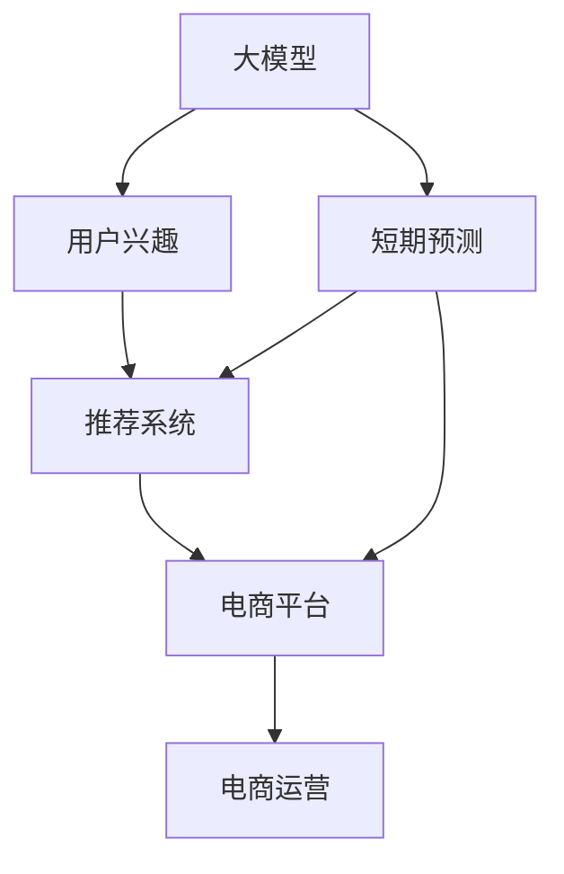

                 

# 探讨大模型在电商平台用户兴趣短期预测中的潜力

> 关键词：大语言模型, 电商平台, 用户兴趣, 短期预测, 推荐系统, 深度学习, 机器学习

## 1. 背景介绍

随着互联网电商的快速发展，用户体验和转化率成为了电商平台竞争力的重要指标。在千变万化的用户需求中，如何精准预测用户的短期兴趣和行为，为个性化推荐提供数据支撑，成为了电商运营中的核心问题。传统的基于规则和统计特征的推荐系统往往难以适应用户多变的行为模式，而大模型在自然语言处理、图像处理等领域的卓越表现，为电商平台用户兴趣短期预测带来了新的契机。

### 1.1 问题由来

在电商平台上，用户行为数据的实时性和多维性，给推荐系统带来了巨大的挑战。传统的推荐系统依赖静态特征，在用户兴趣快速变化时无法及时响应。相比之下，大模型能够从海量数据中学习和理解用户行为，捕捉动态变化的用户兴趣，实现短期预测。

然而，大模型在电商平台用户兴趣预测中的潜力尚未完全挖掘。其庞大的参数量和复杂的结构，对模型训练和推理的资源需求高，如何在电商环境中高效应用，成为急需解决的问题。本文将探讨大模型在电商平台用户兴趣短期预测中的应用潜力，提出具体的模型构建和优化策略。

## 2. 核心概念与联系

### 2.1 核心概念概述

为更好地理解大模型在电商平台用户兴趣短期预测中的应用，本节将介绍几个密切相关的核心概念：

- **大模型(Large Model)**：如BERT、GPT等大规模预训练语言模型，通过在大规模数据集上进行自监督学习，学习到丰富的语言和图像知识。
- **用户兴趣(User Interest)**：用户对电商平台商品的短期偏好和需求，是电商平台推荐系统的重要输入。
- **短期预测(Short-term Prediction)**：对用户在近期内的行为进行预测，如购买意向、浏览偏好等。
- **推荐系统(Recommendation System)**：基于用户历史行为数据和兴趣预测，为用户推荐个性化商品的系统。
- **深度学习(Deep Learning)**：一种基于神经网络的机器学习范式，适用于大规模数据和高维度特征的学习。
- **机器学习(Machine Learning)**：使用算法对数据进行分析和学习，自动改进模型性能。
- **电商运营(E-commerce Operations)**：电商平台中，包括用户行为分析、库存管理、营销活动等多个环节的运营工作。

这些概念之间的逻辑关系可以通过以下Mermaid流程图来展示：



这个流程图展示了大模型、用户兴趣、短期预测、推荐系统、电商平台和电商运营之间的联系和互动：

1. 大模型通过预训练获得广泛的知识，帮助用户兴趣预测更好地理解用户行为。
2. 用户兴趣是推荐系统的输入，用于计算用户对商品的短期偏好。
3. 短期预测通过大模型进行，帮助推荐系统识别用户的短期行为趋势。
4. 推荐系统基于预测结果生成个性化推荐。
5. 电商平台将推荐系统应用到实际运营中，提升用户体验和转化率。
6. 电商运营利用推荐系统的结果，进行库存管理和营销活动。

## 3. 核心算法原理 & 具体操作步骤
### 3.1 算法原理概述

基于大模型的电商平台用户兴趣短期预测，本质上是利用深度学习模型，从用户历史行为数据中挖掘出兴趣变化规律，进而进行短期行为预测。具体而言，可以采用以下步骤：

1. **数据收集与预处理**：收集电商平台用户的历史行为数据，包括浏览记录、点击记录、购买记录等，并进行数据清洗和预处理。
2. **特征工程**：将原始行为数据转化为适合模型训练的特征。如将用户浏览记录转换为向量表示，提取浏览序列中的重要特征点。
3. **模型训练**：使用大模型对处理后的特征进行训练，得到用户兴趣的短期预测模型。
4. **模型评估与优化**：在验证集上评估模型性能，根据评估结果进行模型调整，如调整模型超参数、正则化参数等。
5. **部署与监控**：将优化后的模型部署到电商平台，并实时监控模型性能和用户反馈，进行持续优化。

### 3.2 算法步骤详解

#### 3.2.1 数据收集与预处理

电商平台的用户行为数据种类繁多，包括浏览记录、点击记录、购买记录、收藏记录等。数据预处理的主要目标是清洗数据，使其适合输入到模型中。以下是一些常用的数据处理技巧：

- **缺失值处理**：对于有缺失值的记录，可以使用均值、中位数或插值法填补。
- **异常值检测**：检测并处理数据中的异常值，如通过箱线图等方法判断并剔除离群点。
- **特征归一化**：将不同量级的特征归一化到同一区间，方便模型训练。
- **特征编码**：将分类特征（如商品类别、用户标签等）转换为数值型特征。
- **序列处理**：将用户的浏览序列、点击序列等转换为张量形式，方便模型处理。

#### 3.2.2 特征工程

特征工程是模型训练的重要环节，高质量的特征可以显著提升模型性能。在电商平台上，用户行为数据具有时序性和复杂性，常用的特征提取方法包括：

- **时序特征**：将用户行为数据按时间顺序排列，提取时序信息，如用户近期的浏览记录、点击序列等。
- **文本特征**：将商品标题、描述等文本数据转换为数值型特征，如使用TF-IDF、词嵌入等技术提取文本特征。
- **交叉特征**：将多个特征进行交叉组合，提取高维特征，如用户ID与商品ID的交叉特征。
- **用户特征**：提取用户的基本信息，如用户性别、年龄、地域等。
- **商品特征**：提取商品的基本属性，如商品价格、类别、评分等。

#### 3.2.3 模型训练

在大模型选择方面，可以考虑使用预训练的BERT、GPT等模型，并根据任务需求进行微调。以文本预测任务为例，可以使用BERT等预训练模型，对用户浏览记录和商品描述进行编码，得到用户兴趣的向量表示。训练过程如下：

1. **模型加载与预处理**：加载预训练模型，并根据任务需求进行微调。对输入的数据进行分批次处理，转换为模型所需的张量形式。
2. **前向传播**：将输入数据通过模型前向传播，得到模型输出的向量表示。
3. **损失函数计算**：根据预测结果和真实标签计算损失函数，如交叉熵损失、均方误差等。
4. **反向传播**：使用反向传播算法计算模型参数的梯度，并根据优化算法更新模型参数。
5. **模型保存与验证**：将训练好的模型保存下来，并在验证集上进行性能评估。根据评估结果调整模型超参数和正则化参数。

#### 3.2.4 模型评估与优化

模型评估是确保模型性能的重要步骤。电商平台上用户兴趣变化快，因此需要选择适用的评估指标。常用的评估指标包括：

- **准确率(Accuracy)**：预测结果与真实标签相符的比例。
- **召回率(Recall)**：所有真实正样本中，被预测为正样本的比例。
- **精确率(Precision)**：所有预测为正样本中，真实正样本的比例。
- **F1值(F1 Score)**：综合考虑召回率和精确率，是准确率和召回率的调和平均数。

模型优化过程中，可以通过调整超参数、正则化参数、模型结构等方法，提升模型性能。如通过调整学习率、批大小、训练轮数等超参数，优化模型收敛速度和稳定性。通过添加正则化项，如L2正则、Dropout等，减少模型过拟合。

#### 3.2.5 部署与监控

模型训练完成后，需要将其部署到电商平台上，进行实时预测。在部署过程中，需要考虑模型的推理速度、内存占用、系统稳定性等因素。以下是一些常见的部署策略：

- **模型裁剪**：将模型裁剪为轻量级模型，减小模型尺寸，加快推理速度。
- **量化加速**：将模型参数转换为定点格式，减小存储空间，提高计算效率。
- **分布式训练**：使用分布式训练框架，加速模型训练和推理。
- **负载均衡**：合理分配计算资源，避免单点瓶颈，提高系统稳定性。
- **性能监控**：实时监控模型性能，及时发现并解决性能问题。

## 4. 数学模型和公式 & 详细讲解  
### 4.1 数学模型构建

在电商平台用户兴趣短期预测中，可以使用深度学习模型，如循环神经网络(RNN)、长短期记忆网络(LSTM)、Transformer等，对用户行为数据进行建模。以Transformer模型为例，其数学模型构建如下：

1. **输入表示**：将用户浏览记录和商品描述转换为向量表示，作为模型的输入。
2. **编码器**：通过Transformer编码器对输入进行编码，得到用户兴趣的向量表示。
3. **注意力机制**：通过多头注意力机制，对不同特征进行加权组合，提升模型预测准确率。
4. **解码器**：使用Transformer解码器对用户兴趣进行预测，得到短期行为结果。

假设输入为 $X=\{x_1, x_2, ..., x_n\}$，其中 $x_i$ 为用户第 $i$ 次浏览记录或商品描述。模型输出为 $Y=\{y_1, y_2, ..., y_n\}$，其中 $y_i$ 为模型预测的用户行为结果。模型的数学公式为：

$$
Y = \text{Transformer}(X)
$$

其中 $\text{Transformer}$ 表示Transformer模型。模型的优化目标是最大化预测结果与真实标签之间的匹配度，即最小化损失函数 $\mathcal{L}$。

### 4.2 公式推导过程

以LSTM模型为例，假设模型输入为 $X=\{x_1, x_2, ..., x_n\}$，其中 $x_i$ 为用户第 $i$ 次浏览记录或商品描述。模型输出为 $Y=\{y_1, y_2, ..., y_n\}$，其中 $y_i$ 为模型预测的用户行为结果。LSTM模型的数学公式为：

$$
h_t = \text{LSTM}(h_{t-1}, x_t)
$$

其中 $h_t$ 为第 $t$ 时刻的隐藏状态。LSTM模型的优化目标是最大化预测结果与真实标签之间的匹配度，即最小化损失函数 $\mathcal{L}$。

具体而言，模型首先通过输入层将输入数据转换为数值型特征，然后通过LSTM编码器对特征进行编码，得到用户兴趣的向量表示。最后通过输出层对用户兴趣进行预测，得到短期行为结果。模型的前向传播过程如下：

1. **输入层**：将输入数据转换为数值型特征。
2. **LSTM编码器**：通过LSTM对特征进行编码，得到隐藏状态 $h_t$。
3. **输出层**：将隐藏状态 $h_t$ 通过线性变换，得到预测结果。
4. **损失函数**：根据预测结果和真实标签计算损失函数 $\mathcal{L}$。
5. **反向传播**：使用反向传播算法计算模型参数的梯度，并根据优化算法更新模型参数。

### 4.3 案例分析与讲解

以电商平台上用户兴趣短期预测为例，使用LSTM模型进行具体分析。假设用户浏览了5个商品，每个商品对应一个向量表示，模型训练数据的构造如下：

- **输入数据**：$X=\{x_1, x_2, x_3, x_4, x_5\}$
- **输出数据**：$Y=\{y_1, y_2, y_3, y_4, y_5\}$

模型训练过程中，先定义LSTM编码器的结构，包括输入层、LSTM层和输出层。假设输入层的神经元数为 $d$，LSTM层的神经元数为 $h$，输出层的神经元数为 $m$。模型的输入表示为：

$$
X = \begin{bmatrix}
x_1 & x_2 & x_3 & x_4 & x_5
\end{bmatrix}
$$

模型的输出表示为：

$$
Y = \begin{bmatrix}
y_1 & y_2 & y_3 & y_4 & y_5
\end{bmatrix}
$$

模型训练的目标是最小化损失函数 $\mathcal{L}$。假设使用交叉熵损失函数，模型的优化目标为：

$$
\mathcal{L} = -\frac{1}{N}\sum_{i=1}^N \sum_{j=1}^m y_i \log(\hat{y}_{i,j})
$$

其中 $y_{i,j}$ 为第 $i$ 个用户对第 $j$ 个商品的兴趣标签，$\hat{y}_{i,j}$ 为模型预测的结果。模型的前向传播过程如下：

1. **输入层**：将输入数据 $X$ 通过线性变换得到数值型特征。
2. **LSTM编码器**：通过LSTM对特征进行编码，得到隐藏状态 $h_t$。
3. **输出层**：将隐藏状态 $h_t$ 通过线性变换，得到预测结果。
4. **损失函数**：根据预测结果和真实标签计算损失函数 $\mathcal{L}$。
5. **反向传播**：使用反向传播算法计算模型参数的梯度，并根据优化算法更新模型参数。

通过上述过程，模型能够从用户浏览记录中学习到兴趣变化规律，进行短期预测。最终模型输出的结果为：

$$
Y = \text{LSTM}(X)
$$

## 5. 项目实践：代码实例和详细解释说明
### 5.1 开发环境搭建

在进行电商平台用户兴趣短期预测的实践前，我们需要准备好开发环境。以下是使用Python进行TensorFlow开发的环境配置流程：

1. 安装Anaconda：从官网下载并安装Anaconda，用于创建独立的Python环境。

2. 创建并激活虚拟环境：
```bash
conda create -n tensorflow-env python=3.8 
conda activate tensorflow-env
```

3. 安装TensorFlow：根据CUDA版本，从官网获取对应的安装命令。例如：
```bash
pip install tensorflow
```

4. 安装TensorFlow Addons：
```bash
pip install tensorflow-addons
```

5. 安装TensorBoard：
```bash
pip install tensorboard
```

6. 安装PyTorch：
```bash
pip install torch
```

完成上述步骤后，即可在`tensorflow-env`环境中开始模型开发。

### 5.2 源代码详细实现

下面我们以LSTM模型为例，给出在TensorFlow中对电商平台用户兴趣短期预测的实现代码。

```python
import tensorflow as tf
from tensorflow.keras.layers import Input, LSTM, Dense, Embedding, TimeDistributed
from tensorflow.keras.models import Model

# 定义输入层
input_seq = Input(shape=(max_seq_len, ), name='input_seq')

# 定义LSTM层
lstm = LSTM(units=64, return_sequences=True)(input_seq)

# 定义输出层
output = Dense(1, activation='sigmoid')(lstm)

# 定义模型
model = Model(inputs=input_seq, outputs=output)

# 编译模型
model.compile(loss='binary_crossentropy', optimizer='adam', metrics=['accuracy'])

# 训练模型
model.fit(x_train, y_train, epochs=10, batch_size=32, validation_data=(x_val, y_val))

# 评估模型
model.evaluate(x_test, y_test)

# 预测结果
predictions = model.predict(x_test)
```

### 5.3 代码解读与分析

让我们再详细解读一下关键代码的实现细节：

**输入层定义**：
- `Input`：定义输入层的维度，这里以序列数据为例，最大序列长度为 `max_seq_len`。
- `name`：为输入层命名，方便后续调用。

**LSTM层定义**：
- `LSTM`：定义LSTM层，包括神经元数 `units` 和是否返回序列 `return_sequences`。
- `return_sequences=True` 表示返回LSTM层的所有时间步的输出。

**输出层定义**：
- `Dense`：定义输出层，神经元数为1，使用sigmoid激活函数。
- `activation='sigmoid'` 表示输出为二分类问题，预测结果在 [0,1] 之间。

**模型定义**：
- `Model`：将输入层、LSTM层和输出层组合为完整模型。
- `inputs`：输入层的定义。
- `outputs`：输出层的定义。

**模型编译**：
- `compile`：编译模型，指定损失函数、优化器和评估指标。
- `binary_crossentropy` 表示二分类问题，`adam` 表示优化器。

**模型训练**：
- `fit`：训练模型，指定训练数据 `x_train`、标签数据 `y_train`、训练轮数 `epochs`、批次大小 `batch_size` 和验证数据 `x_val`、`y_val`。

**模型评估**：
- `evaluate`：评估模型，指定测试数据 `x_test`、标签数据 `y_test`。

**模型预测**：
- `predict`：进行模型预测，返回预测结果 `predictions`。

通过上述代码实现，可以构建并训练LSTM模型，进行电商平台用户兴趣短期预测。代码简洁高效，适合快速原型开发和模型评估。

## 6. 实际应用场景
### 6.1 智能推荐

在电商平台上，智能推荐系统是提升用户体验和交易转化率的重要手段。传统的推荐系统依赖静态特征，难以捕捉用户兴趣的快速变化。大模型通过学习用户历史行为数据，可以动态预测用户的短期兴趣，实现更加个性化的推荐。

具体而言，电商平台可以收集用户历史浏览记录、点击记录和购买记录等数据，构建用户行为数据集。使用大模型对用户行为数据进行建模，得到用户兴趣的短期预测模型。将预测结果输入到推荐系统中，生成个性化推荐列表。最终用户根据推荐列表进行购物决策，电商平台根据用户反馈进行优化调整。

### 6.2 个性化营销

个性化营销是电商平台的重要业务环节，能够有效提升用户的购买意愿和转化率。传统的营销策略依赖人工设定和定期调整，难以满足用户多样化的需求。基于大模型的电商平台用户兴趣短期预测，可以实时捕捉用户的兴趣变化，实现更加精准的个性化营销。

具体而言，电商平台可以根据用户兴趣预测结果，动态生成个性化营销内容。如根据用户的浏览历史，推送与其兴趣相关的商品广告。根据用户的购买记录，推送相应品牌的优惠券。通过实时调整营销策略，提升用户满意度和转化率。

### 6.3 库存管理

库存管理是电商平台的核心运营环节，合理的库存管理能够有效降低运营成本，提升用户满意度。传统的库存管理依赖人工判断和经验积累，难以应对市场的快速变化。基于大模型的电商平台用户兴趣短期预测，可以实时预测用户的购买意向，优化库存管理策略。

具体而言，电商平台可以根据用户兴趣预测结果，实时调整库存水平和商品价格。对于高需求的商品，增加库存量，提高价格弹性。对于低需求的商品，减少库存量，降低价格，减少积压。通过实时调整库存策略，提升库存周转率和用户满意度。

### 6.4 未来应用展望

随着大模型和深度学习技术的不断发展，基于用户兴趣短期预测的应用场景将不断扩展。未来，电商平台可以通过大模型实现更复杂、更高维度的用户兴趣预测，为用户提供更加个性化、智能化的服务。

1. **多模态预测**：结合图像、视频、语音等多模态数据，进行更全面的用户兴趣预测。
2. **实时预测**：通过实时数据流处理技术，实现用户兴趣的实时预测和动态调整。
3. **跨平台预测**：将电商平台的用户数据与其他平台（如社交媒体、搜索引擎）的用户数据结合，进行更精准的用户兴趣预测。
4. **个性化推荐**：结合推荐系统，实现更加个性化的商品推荐，提升用户满意度和购买转化率。
5. **智能客服**：基于用户兴趣预测结果，实时调整智能客服的应答策略，提升用户互动体验。

未来，大模型在电商平台用户兴趣短期预测中的应用，将进一步提升电商平台的运营效率和用户满意度，为电商行业带来新的增长点。

## 7. 工具和资源推荐
### 7.1 学习资源推荐

为了帮助开发者系统掌握大模型在电商平台用户兴趣短期预测中的应用，这里推荐一些优质的学习资源：

1. **《TensorFlow实战》**：由TensorFlow官方团队编写，详细介绍TensorFlow的基本使用方法和深度学习模型的构建。
2. **《深度学习》**：斯坦福大学李飞飞教授的深度学习课程，讲解深度学习的基本概念和前沿技术。
3. **《自然语言处理综述》**：清华大学邱锡鹏教授的NLP课程，讲解自然语言处理的基本理论和最新进展。
4. **《Python深度学习》**：使用TensorFlow和Keras构建深度学习模型的实战教程。
5. **《深度学习与TensorFlow》**：讲解深度学习理论和TensorFlow的基本用法，适合初学者入门。

通过对这些资源的学习实践，相信你一定能够快速掌握大模型在电商平台用户兴趣短期预测中的应用，并用于解决实际的电商问题。
###  7.2 开发工具推荐

高效的开发离不开优秀的工具支持。以下是几款用于大模型和深度学习开发的常用工具：

1. **Jupyter Notebook**：开源的交互式开发环境，适合数据处理、模型训练和结果展示。
2. **TensorBoard**：可视化工具，实时监控模型训练过程和性能指标，帮助调试模型。
3. **Keras**：基于TensorFlow的高层次API，简化深度学习模型的构建和训练。
4. **PyTorch**：灵活的深度学习框架，适合研究和原型开发。
5. **TensorFlow Addons**：增强TensorFlow的功能，支持更加复杂的深度学习模型和算法。
6. **MXNet**：高性能的深度学习框架，支持多种语言和平台。

合理利用这些工具，可以显著提升大模型在电商平台用户兴趣短期预测的开发效率，加快创新迭代的步伐。

### 7.3 相关论文推荐

大模型和深度学习技术的发展源于学界的持续研究。以下是几篇奠基性的相关论文，推荐阅读：

1. **《Attention is All You Need》**：Transformer模型的原论文，提出自注意力机制，彻底改变了NLP领域的研究范式。
2. **《BERT: Pre-training of Deep Bidirectional Transformers for Language Understanding》**：BERT模型提出掩码语言模型预训练方法，大幅提升了NLP任务的性能。
3. **《SELU: Self-normalizing Neural Networks》**：提出自归一化神经网络，解决了深度网络训练中的梯度消失问题，提升了模型收敛速度和稳定性。
4. **《Deep Learning》**：深度学习领域的经典教材，讲解深度学习的理论和实践。
5. **《Neural Network Architectures for Named Entity Recognition》**：提出神经网络模型在命名实体识别任务中的优秀表现，为NLP任务提供了新的思路。

这些论文代表了大模型和深度学习技术的发展脉络。通过学习这些前沿成果，可以帮助研究者把握学科前进方向，激发更多的创新灵感。

## 8. 总结：未来发展趋势与挑战
### 8.1 总结

本文对大模型在电商平台用户兴趣短期预测中的应用潜力进行了全面系统的介绍。首先阐述了大模型和推荐系统的基本概念和应用场景，明确了其在电商平台中的重要性。其次，从原理到实践，详细讲解了电商平台用户兴趣短期预测的数学模型和代码实现，提供了具体的模型构建和优化策略。

通过本文的系统梳理，可以看到，基于大模型的电商平台用户兴趣短期预测方法，能够实时捕捉用户兴趣变化，实现更加个性化的推荐和营销。未来，随着大模型和深度学习技术的不断发展，其在电商平台中的应用将进一步拓展，为电商行业带来新的增长点。

### 8.2 未来发展趋势

展望未来，大模型在电商平台用户兴趣短期预测中的应用将呈现以下几个发展趋势：

1. **多模态融合**：结合图像、视频、语音等多模态数据，进行更全面的用户兴趣预测。
2. **实时预测**：通过实时数据流处理技术，实现用户兴趣的实时预测和动态调整。
3. **跨平台预测**：将电商平台的用户数据与其他平台（如社交媒体、搜索引擎）的用户数据结合，进行更精准的用户兴趣预测。
4. **个性化推荐**：结合推荐系统，实现更加个性化的商品推荐，提升用户满意度和购买转化率。
5. **智能客服**：基于用户兴趣预测结果，实时调整智能客服的应答策略，提升用户互动体验。

这些趋势凸显了大模型在电商平台中的广泛应用前景，将进一步提升电商平台的运营效率和用户满意度。

### 8.3 面临的挑战

尽管大模型在电商平台用户兴趣短期预测中的应用前景广阔，但在实际部署和优化过程中，仍面临诸多挑战：

1. **数据质量问题**：电商平台用户数据量大且复杂，如何保证数据质量和处理效率，是模型训练和推理的前提。
2. **模型性能优化**：模型参数量大，推理速度慢，如何优化模型结构和训练策略，提升模型性能，是实际部署的关键。
3. **系统稳定性**：电商平台的实时预测和推荐系统，需要高稳定性和高可靠性，如何设计合理的系统架构和监控策略，保证系统稳定性，是系统运维的难点。
4. **用户隐私保护**：电商平台上用户数据的隐私保护，是必须严格遵守的法律要求，如何设计数据隐私保护策略，是系统设计的重要环节。
5. **用户反馈机制**：用户兴趣预测结果的准确性和及时性，直接影响用户体验，如何设计合理的用户反馈机制，不断优化预测模型，是系统优化的重点。

面对这些挑战，未来的研究需要在数据处理、模型优化、系统架构、隐私保护和用户反馈等多个维度进行综合优化，才能充分发挥大模型的潜力，提升电商平台的运营效率和用户满意度。

### 8.4 研究展望

未来，随着大模型和深度学习技术的不断进步，电商平台用户兴趣短期预测将迎来更多的突破：

1. **自动化模型训练**：结合自动化机器学习(AutoML)技术，自动化模型选择、超参数调整和模型优化，提高模型训练效率和效果。
2. **跨领域迁移学习**：结合跨领域迁移学习技术，将预训练模型应用于不同领域的电商平台，提升模型的泛化能力和适用性。
3. **多任务学习**：结合多任务学习技术，在用户兴趣预测的同时，进行情感分析、舆情监控等多任务处理，提升系统的综合能力。
4. **联邦学习**：结合联邦学习技术，在保护用户隐私的前提下，进行大规模数据联合训练，提升模型性能和隐私保护能力。
5. **实时数据流处理**：结合实时数据流处理技术，对电商平台实时数据进行分析和预测，提升系统的实时性和准确性。

这些方向的研究将推动大模型在电商平台中的广泛应用，进一步提升电商平台的运营效率和用户满意度，为电商行业带来新的增长点。总之，大模型在电商平台用户兴趣短期预测中的应用前景广阔，需要从数据、模型、系统和用户等多个维度进行全面优化，才能充分发挥其潜力，实现智能电商的美好愿景。

## 9. 附录：常见问题与解答

**Q1：电商平台用户兴趣短期预测的难点在哪里？**

A: 电商平台用户兴趣短期预测的难点在于数据的复杂性和实时性。用户行为数据包含多种类型（如浏览记录、点击记录、购买记录等），且用户兴趣快速变化，对模型实时预测提出了高要求。

**Q2：如何选择合适的大模型进行电商应用？**

A: 选择合适的大模型需要综合考虑任务特点、数据规模和计算资源等因素。如对于用户兴趣预测任务，BERT、GPT等预训练语言模型较为适合，可以更好地捕捉用户兴趣的动态变化。

**Q3：电商平台用户兴趣短期预测的评估指标有哪些？**

A: 电商平台用户兴趣短期预测的评估指标包括准确率(Accuracy)、召回率(Recall)、精确率(Precision)和F1值(F1 Score)。其中F1值综合考虑了召回率和精确率，是常用的评估指标。

**Q4：如何优化电商平台用户兴趣短期预测模型的性能？**

A: 优化电商平台用户兴趣短期预测模型的性能，可以从以下几个方面入手：
1. **数据预处理**：通过缺失值处理、异常值检测、特征归一化等技术，提升数据质量。
2. **特征工程**：通过时序特征、文本特征、交叉特征等技术，提取高质量的特征。
3. **模型选择**：根据任务特点和数据规模，选择合适的深度学习模型，如LSTM、Transformer等。
4. **超参数优化**：通过调整学习率、批大小、训练轮数等超参数，优化模型性能。
5. **正则化技术**：通过L2正则、Dropout等技术，防止模型过拟合。

通过这些措施，可以有效提升电商平台用户兴趣短期预测模型的性能，提升用户体验和转化率。

**Q5：电商平台用户兴趣短期预测模型的部署策略有哪些？**

A: 电商平台用户兴趣短期预测模型的部署策略主要包括以下几种：
1. **模型裁剪**：将模型裁剪为轻量级模型，减小模型尺寸，加快推理速度。
2. **量化加速**：将模型参数转换为定点格式，减小存储空间，提高计算效率。
3. **分布式训练**：使用分布式训练框架，加速模型训练和推理。
4. **负载均衡**：合理分配计算资源，避免单点瓶颈，提高系统稳定性。
5. **性能监控**：实时监控模型性能，及时发现并解决性能问题。

合理选择部署策略，可以有效提升电商平台用户兴趣短期预测模型的实时性和稳定性，保证系统的高效运行。

---

作者：禅与计算机程序设计艺术 / Zen and the Art of Computer Programming

